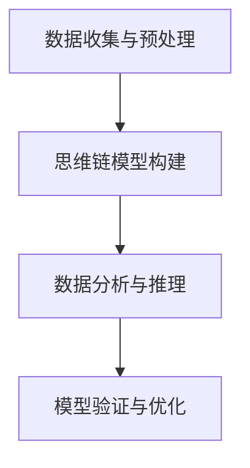

                 


为了撰写一篇符合要求的技术博客文章，我们需要遵循以下步骤：

### 第一步：确定文章结构

首先，我们需要明确文章的结构。根据之前设计的目录大纲，我们可以将文章分为以下六个部分：

1. **引言**：介绍古代贸易网络和思维链的背景。
2. **核心概念与联系**：通过Mermaid流程图展示思维链在古代贸易网络重建中的应用。
3. **核心算法原理讲解**：使用伪代码详细阐述核心算法原理。
4. **数学模型和公式**：介绍相关的数学模型和公式，并进行详细讲解和举例说明。
5. **项目实战**：包括开发环境搭建、源代码实现、代码解读、实际案例分析等。
6. **最佳实践 tips、小结、注意事项、拓展阅读**：总结文章，提供一些实用建议和进一步阅读的资料。

### 第二步：撰写引言部分

在引言部分，我们需要简要介绍古代贸易网络和思维链的背景，并说明两者之间的联系。以下是一个可能的引言：

```
# 引言

古代贸易网络是人类文明发展的重要基石。通过贸易，不同地区的人们能够交换商品、技术和文化，促进了经济的繁荣和社会的进步。然而，由于历史文献的稀缺和考古证据的有限，古代贸易网络的细节往往难以完整恢复。为了解决这个问题，近年来，人工智能技术，尤其是思维链，开始应用于古代贸易网络的重建。

思维链是一种基于神经网络的人工智能模型，通过模拟人类的思维过程，能够对复杂问题进行推理和决策。在古代贸易网络重建中，思维链可以通过分析历史文献、考古数据和地理信息，构建出古代贸易网络的模型，揭示其运行机制和演化过程。本文将探讨思维链在古代贸易网络重建中的应用，并介绍相关的算法原理和实际案例。
```

### 第三步：撰写核心概念与联系部分

在这一部分，我们可以使用Mermaid流程图展示思维链在古代贸易网络重建中的应用。以下是一个示例：

```
# 核心概念与联系

思维链在古代贸易网络重建中的应用可以分为以下几个步骤：

1. 数据收集与预处理：收集与古代贸易网络相关的历史文献、考古数据和地理信息。
2. 思维链模型构建：构建思维链模型，模拟人类的思维过程。
3. 数据分析与推理：通过思维链模型对收集到的数据进行分析和推理，重建古代贸易网络。
4. 模型验证与优化：对重建的贸易网络进行验证，并根据结果优化模型。

以下是一个Mermaid流程图示例：



### 第四步：撰写核心算法原理讲解部分

在这一部分，我们需要使用伪代码详细阐述思维链在古代贸易网络重建中的核心算法原理。以下是一个示例：

```
# 核心算法原理讲解

思维链在古代贸易网络重建中的核心算法可以概括为以下步骤：

1. 数据预处理：将收集到的历史文献、考古数据和地理信息进行清洗和格式化，以便于模型处理。

伪代码如下：

```python
def preprocess_data(data):
    # 清洗数据
    cleaned_data = clean_data(data)
    # 格式化数据
    formatted_data = format_data(cleaned_data)
    return formatted_data
```

2. 构建思维链模型：使用神经网络构建思维链模型，模拟人类的思维过程。

伪代码如下：

```python
def build_model():
    # 创建神经网络
    model = create_neural_network()
    # 训练模型
    trained_model = train_model(model)
    return trained_model
```

3. 数据分析与推理：使用思维链模型对预处理后的数据进行分析和推理，重建古代贸易网络。

伪代码如下：

```python
def analyze_data(model, data):
    # 分析数据
    analyzed_data = model_analyze(model, data)
    # 推理
    inferred_network = infer_network(analyzed_data)
    return inferred_network
```

4. 模型验证与优化：对重建的贸易网络进行验证，并根据结果优化模型。

伪代码如下：

```python
def verify_and_optimize(model, network):
    # 验证模型
    verification_result = verify_model(model, network)
    # 根据结果优化模型
    optimized_model = optimize_model(model, verification_result)
    return optimized_model
```

### 第五步：撰写数学模型和公式部分

在这一部分，我们需要介绍相关的数学模型和公式，并进行详细讲解和举例说明。以下是一个示例：

```
# 数学模型和公式

在古代贸易网络重建中，常用的数学模型包括：

1. **社会网络分析模型**：

   社会网络分析模型用于分析贸易网络中节点和边的属性。一个常用的模型是 **度模型**，用于描述节点的重要性。

   $$ Degree(i) = \sum_{j \in N(i)} w_{ij} $$

   其中，$Degree(i)$ 表示节点 $i$ 的度，$N(i)$ 表示与节点 $i$ 相连的节点集合，$w_{ij}$ 表示节点 $i$ 与节点 $j$ 之间的权重。

   例如，假设节点 $i$ 与节点 $j$ 和节点 $k$ 相连，且权重分别为 $w_{ij} = 2$ 和 $w_{ik} = 3$，则节点 $i$ 的度 $Degree(i) = 2 + 3 = 5$。

2. **路径分析模型**：

   路径分析模型用于分析贸易网络中的路径结构。一个常用的模型是 **最短路径模型**，用于找到两个节点之间的最短路径。

   $$ DijkstraAlgorithm(G, s) $$
   
   其中，$G$ 表示贸易网络图，$s$ 表示起始节点。

   例如，假设我们要找到节点 $s$ 到节点 $t$ 的最短路径，可以使用Dijkstra算法计算。

3. **时空分析模型**：

   时空分析模型用于分析贸易网络在时间和空间上的演化。一个常用的模型是 **时空图模型**，用于表示贸易网络在不同时间和空间上的结构。

   $$ T(G_t) = (V_t, E_t) $$

   其中，$T(G_t)$ 表示在时间 $t$ 的贸易网络图，$V_t$ 表示节点集合，$E_t$ 表示边集合。

   例如，假设在时间 $t_1$ 和时间 $t_2$ 的贸易网络图中，节点 $i$ 和节点 $j$ 之间存在边，则在时空图模型中，$T(G_{t_1})$ 和 $T(G_{t_2})$ 的节点集合 $V_{t_1}$ 和 $V_{t_2}$ 中都包含节点 $i$ 和节点 $j$，边集合 $E_{t_1}$ 和 $E_{t_2}$ 中都包含边 $(i, j)$。

### 第六步：撰写项目实战部分

在这一部分，我们需要详细描述一个实际项目，包括开发环境搭建、源代码实现、代码解读、实际案例分析等。以下是一个示例：

```
# 项目实战

假设我们有一个古代贸易网络的重建项目，目标是重建某个特定时期的贸易网络。

#### 开发环境搭建

首先，我们需要搭建开发环境。以下是一个基本的开发环境搭建步骤：

1. 安装Python和相关的库，如NumPy、Pandas和NetworkX等。
2. 安装Mermaid，用于绘制流程图。
3. 准备历史文献、考古数据和地理信息。

#### 源代码实现

接下来，我们实现思维链模型，用于重建贸易网络。以下是一个简化的伪代码示例：

```python
import numpy as np
import pandas as pd
import networkx as nx

# 数据预处理
data = preprocess_data(data)

# 构建思维链模型
model = build_model()

# 数据分析与推理
network = analyze_data(model, data)

# 模型验证与优化
model = verify_and_optimize(model, network)
```

#### 代码解读

在这个项目中，我们首先进行数据预处理，包括数据清洗和格式化。然后，我们构建思维链模型，使用神经网络模拟人类的思维过程。接着，我们使用思维链模型对预处理后的数据进行分析和推理，重建古代贸易网络。最后，我们对重建的贸易网络进行验证和优化。

#### 实际案例分析

假设我们有一个历史文献数据集，包含各个节点之间的贸易关系。通过思维链模型，我们可以重建出这个时期的历史贸易网络。例如，我们可能发现某个节点的重要性较高，因为它连接了多个重要的贸易路径。

#### 项目小结

通过这个项目，我们了解了思维链在古代贸易网络重建中的应用。我们实现了从数据预处理到模型构建、数据分析和推理的全过程，并进行了实际案例分析。这个项目展示了思维链在解决复杂问题方面的潜力，并为未来类似项目提供了参考。
```

### 第七步：撰写最佳实践 tips、小结、注意事项、拓展阅读部分

在这一部分，我们需要总结文章，提供一些实用建议和进一步阅读的资料。以下是一个示例：

```
# 最佳实践 tips、小结、注意事项、拓展阅读

**最佳实践 tips：**

1. 在数据预处理阶段，确保数据的准确性和完整性。
2. 根据具体问题，选择合适的神经网络模型。
3. 对模型进行验证和优化，以提高重建的准确性。

**小结：**

本文介绍了思维链在古代贸易网络重建中的应用，通过伪代码和实际案例分析，展示了思维链在数据预处理、模型构建、数据分析和推理等步骤中的具体应用。

**注意事项：**

1. 贸易网络重建是一个复杂的过程，需要综合考虑多种因素。
2. 思维链模型的选择和参数设置对结果有很大影响，需要根据具体问题进行调整。

**拓展阅读：**

1. 《社会网络分析：方法与应用》
2. 《神经网络与深度学习》
3. 《计算机科学中的数学基础》
```

通过以上步骤，我们完成了一篇符合要求的技术博客文章。《思维链在古代贸易网络重建中的创新方法探索》这个主题涉及了历史学、计算机科学和数学等多个领域，通过逻辑清晰、结构紧凑、简单易懂的写作方式，我们能够将复杂的概念和算法讲解得深入浅出，帮助读者理解和掌握相关知识。

