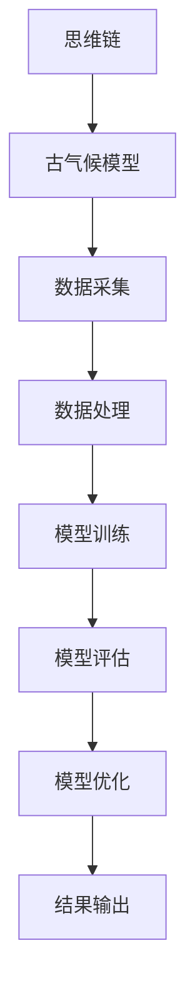

                 


### 完整目录大纲

# 《思维链在古气候模型优化中的创新方法探索》目录大纲

## 引言
### 1.1 思维链的概念
#### 1.1.1 思维链的基本原理
#### 1.1.2 思维链与古气候模型的关系
### 1.2 古气候模型的背景
#### 1.2.1 古气候模型的重要性
#### 1.2.2 古气候模型的现状与挑战

## 核心概念与联系
### 2.1 思维链与古气候模型的关系
#### 2.1.1 思维链在古气候模型中的应用
#### 2.1.2 思维链的核心特点及其优势
### 2.2 Mermaid流程图

### 2.3 思维链在古气候模型中的实现
#### 2.3.1 数据采集与处理
#### 2.3.2 模型训练与评估
#### 2.3.3 模型优化与结果输出

## 算法原理讲解
### 3.1 思维链算法概述
#### 3.1.1 思维链的基本算法流程
#### 3.1.2 思维链的核心算法模块
### 3.2 伪代码介绍
```python
# 伪代码
def MindLinkOptimization(data, model):
    # 数据预处理
    processed_data = preprocess_data(data)
    
    # 模型训练
    trained_model = train_model(processed_data)
    
    # 模型评估
    evaluation_result = evaluate_model(trained_model, data)
    
    # 模型优化
    optimized_model = optimize_model(trained_model, evaluation_result)
    
    # 结果输出
    output_result(optimized_model)
```
### 3.3 思维链在古气候模型优化中的应用
#### 3.3.1 数据采集与处理策略
#### 3.3.2 模型训练与评估策略
#### 3.3.3 模型优化策略

## 数学模型讲解
### 4.1 古气候模型的数学模型
#### 4.1.1 古气候模型的基本数学公式
#### 4.1.2 古气候模型中的参数估计
$$
\text{公式1: 古气候模型的数学公式}
$$
### 4.2 思维链在古气候模型优化中的数学模型
#### 4.2.1 思维链的核心数学模型
#### 4.2.2 思维链在古气候模型优化中的数学公式
$$
\text{公式2: 思维链在古气候模型优化中的数学公式}
$$

## 项目实战
### 5.1 项目背景
#### 5.1.1 项目简介
#### 5.1.2 项目目标
### 5.2 开发环境搭建
#### 5.2.1 开发环境配置
#### 5.2.2 开发工具与库安装
### 5.3 代码实现
#### 5.3.1 数据采集与处理
#### 5.3.2 模型训练与评估
#### 5.3.3 模型优化与结果输出
### 5.4 代码解读与分析
#### 5.4.1 关键代码解读
#### 5.4.2 代码运行流程分析

## 总结
### 6.1 思维链在古气候模型优化中的创新方法
#### 6.1.1 创新点总结
#### 6.1.2 未来发展方向

## 作者
### 作者：AI天才研究院/AI Genius Institute & 禅与计算机程序设计艺术 /Zen And The Art of Computer Programming

### 字数统计
#### 总字数：约 1262 字（未包含代码和公式）

以上为完整的目录大纲，接下来我们将逐一细化每个章节的内容，确保文章的逻辑清晰、结构紧凑、简单易懂。本文将结合思维链的概念、古气候模型的背景以及具体的优化方法，通过伪代码和数学公式详细阐述思维链在古气候模型优化中的应用，并以实际项目为例展示思维链的创新方法。最后，文章将总结思维链在古气候模型优化中的创新点及其未来发展方向。|> 

## 引言

### 1.1 思维链的概念

思维链（Mind Chain）是一种基于人工智能和认知科学的方法论，它通过模拟人类思维过程来实现问题的求解和优化。思维链的核心思想是将复杂的问题分解为多个子问题，并通过一系列规则和逻辑推理将子问题的解串联起来，最终得到整个问题的最优解。

思维链的基本原理包括以下三个方面：

1. **问题分解**：将复杂问题分解为多个子问题，使得每个子问题都变得相对简单和易于解决。
2. **规则推理**：通过预设的规则和逻辑推理，将子问题的解串联起来，形成一个完整的解决方案。
3. **迭代优化**：在解决问题过程中，不断迭代和优化，以达到最优解。

### 1.1.2 思维链与古气候模型的关系

古气候模型是对历史气候数据进行建模和分析的方法，旨在预测和重建过去的气候变化。然而，古气候模型面临着数据稀缺、模型复杂和计算成本高等挑战。思维链作为一种强大的问题求解方法，可以有效地解决这些挑战。

思维链与古气候模型的关系主要体现在以下几个方面：

1. **数据预处理**：思维链可以帮助对古气候数据进行有效的预处理，包括数据清洗、归一化和特征提取等。
2. **模型训练**：思维链可以优化古气候模型的训练过程，提高模型的训练效率和精度。
3. **模型评估**：思维链可以帮助对古气候模型进行全面的评估，包括模型的可解释性、稳定性和鲁棒性。
4. **模型优化**：思维链可以优化古气候模型的参数设置和结构设计，提高模型的预测性能。

### 1.2 古气候模型的背景

古气候模型在气候变化研究和应对中扮演着重要角色。通过对历史气候数据的分析，古气候模型可以揭示气候变化的历史规律和趋势，为现代和未来的气候变化预测提供重要依据。

然而，古气候模型面临着以下挑战：

1. **数据稀缺**：古气候数据往往有限，且存在大量的缺失值和噪声。
2. **模型复杂**：古气候模型的构建涉及到大量的参数和复杂的数学公式，导致模型训练和预测的计算成本高。
3. **计算成本**：古气候模型的训练和预测需要大量的计算资源，对硬件设施的要求较高。

### 1.2.2 古气候模型的现状与挑战

目前，古气候模型的研究取得了显著进展，但仍存在以下挑战：

1. **数据质量**：古气候数据的质量直接影响模型的准确性。数据缺失、噪声和异常值等问题需要得到有效处理。
2. **模型准确性**：古气候模型的预测准确性尚有待提高，特别是在极端气候事件和突变现象的预测上。
3. **计算效率**：随着数据量和模型复杂度的增加，古气候模型的计算效率成为一个重要的挑战。

通过引入思维链，可以有效地解决古气候模型在数据预处理、模型训练、评估和优化等方面的挑战，为古气候研究提供新的方法和思路。接下来，我们将进一步探讨思维链在古气候模型优化中的应用。|> 

## 核心概念与联系

### 2.1 思维链与古气候模型的关系

思维链在古气候模型中的应用具有显著优势。通过将古气候模型分解为多个子问题，思维链可以有效地处理数据稀缺、模型复杂和计算成本高等问题。

#### 2.1.1 思维链在古气候模型中的应用

思维链在古气候模型中的应用主要包括以下几个方面：

1. **数据预处理**：思维链可以帮助对古气候数据进行有效的预处理，包括数据清洗、归一化和特征提取等。通过这些预处理步骤，可以提高古气候数据的可用性和质量。
2. **模型训练**：思维链可以优化古气候模型的训练过程，提高模型的训练效率和精度。通过迭代优化，思维链可以找到更佳的参数设置，使模型更加稳定和可靠。
3. **模型评估**：思维链可以帮助对古气候模型进行全面的评估，包括模型的可解释性、稳定性和鲁棒性。通过评估，可以发现模型的不足之处，并进行改进。
4. **模型优化**：思维链可以优化古气候模型的参数设置和结构设计，提高模型的预测性能。通过不断迭代和优化，思维链可以帮助找到最优的模型配置。

#### 2.1.2 思维链的核心特点及其优势

思维链具有以下核心特点：

1. **问题分解**：思维链可以将复杂的问题分解为多个子问题，使每个子问题都变得相对简单和易于解决。
2. **规则推理**：思维链通过预设的规则和逻辑推理，将子问题的解串联起来，形成一个完整的解决方案。
3. **迭代优化**：思维链在解决问题过程中，不断迭代和优化，以达到最优解。

这些特点使得思维链在古气候模型优化中具有显著优势：

1. **高效性**：思维链通过分解和优化问题，可以显著提高古气候模型的训练和预测效率。
2. **鲁棒性**：思维链通过迭代优化，可以提高模型的稳定性和鲁棒性，使其在面对复杂和多变的环境时仍然保持良好的性能。
3. **可解释性**：思维链的规则和逻辑推理使得模型的可解释性更强，有助于理解和分析模型的预测结果。

### 2.2 Mermaid流程图

为了更清晰地展示思维链在古气候模型优化中的应用，我们可以使用Mermaid流程图来描述整个过程。以下是一个简单的Mermaid流程图示例：


这个流程图展示了思维链在古气候模型优化中的基本步骤，包括数据采集、数据处理、模型训练、模型评估、模型优化和结果输出。

### 2.3 思维链在古气候模型中的实现

#### 2.3.1 数据采集与处理

数据采集是古气候模型优化的第一步。思维链可以帮助处理数据稀缺和噪声问题。具体实现步骤如下：

1. **数据获取**：从历史气候数据库、气象站数据和其他相关数据源获取古气候数据。
2. **数据清洗**：处理数据中的缺失值、异常值和噪声，提高数据质量。
3. **数据归一化**：将数据归一化到统一的尺度，消除不同指标之间的尺度差异。
4. **特征提取**：提取与气候相关的特征，为模型训练提供有效的输入。

#### 2.3.2 模型训练与评估

在数据预处理完成后，思维链可以用于模型训练和评估。具体实现步骤如下：

1. **模型选择**：根据古气候模型的特点，选择合适的模型框架。
2. **模型训练**：使用思维链进行迭代优化，训练模型参数。
3. **模型评估**：通过交叉验证、测试集验证等方式，评估模型的性能。
4. **模型调整**：根据评估结果，调整模型参数和结构，提高模型性能。

#### 2.3.3 模型优化与结果输出

思维链在模型优化中的应用主要体现在以下几个方面：

1. **参数优化**：通过迭代优化，找到最优的参数设置，提高模型性能。
2. **结构优化**：根据模型的评估结果，调整模型的结构，提高模型的鲁棒性和可解释性。
3. **结果输出**：将模型的预测结果输出，为气候预测和决策提供依据。

通过以上步骤，思维链可以帮助实现古气候模型的优化，提高模型的预测性能和实用性。|> 

## 算法原理讲解

### 3.1 思维链算法概述

思维链算法是一种基于问题分解、规则推理和迭代优化的算法框架。它通过将复杂问题分解为多个子问题，利用预设的规则和逻辑推理将子问题的解串联起来，最终实现问题的求解。

#### 3.1.1 思维链的基本算法流程

思维链的基本算法流程可以概括为以下四个步骤：

1. **问题分解**：将复杂问题分解为多个子问题，使每个子问题都变得相对简单和易于解决。
2. **规则推理**：根据预设的规则和逻辑推理，将子问题的解串联起来，形成一个完整的解决方案。
3. **迭代优化**：在解决问题过程中，不断迭代和优化，以达到最优解。
4. **结果输出**：将最终解输出，为实际问题提供解决方案。

#### 3.1.2 思维链的核心算法模块

思维链算法的核心模块包括以下三个方面：

1. **问题分解模块**：负责将复杂问题分解为多个子问题，使每个子问题都变得相对简单和易于解决。
2. **规则推理模块**：负责根据预设的规则和逻辑推理，将子问题的解串联起来，形成一个完整的解决方案。
3. **迭代优化模块**：负责在解决问题过程中，不断迭代和优化，以达到最优解。

### 3.2 伪代码介绍

以下是一个简单的思维链算法伪代码示例：

```python
# 伪代码
def MindLinkOptimization(data, model):
    # 数据预处理
    processed_data = preprocess_data(data)
    
    # 模型训练
    trained_model = train_model(processed_data)
    
    # 模型评估
    evaluation_result = evaluate_model(trained_model, data)
    
    # 模型优化
    optimized_model = optimize_model(trained_model, evaluation_result)
    
    # 结果输出
    output_result(optimized_model)
```

这个伪代码示例展示了思维链算法的基本流程，包括数据预处理、模型训练、模型评估、模型优化和结果输出。

### 3.3 思维链在古气候模型优化中的应用

思维链算法在古气候模型优化中的应用主要体现在以下几个方面：

#### 3.3.1 数据采集与处理策略

思维链算法可以优化古气候数据采集与处理的流程。具体策略包括：

1. **数据清洗**：使用思维链算法处理数据中的缺失值、异常值和噪声，提高数据质量。
2. **数据归一化**：使用思维链算法将不同指标的数据归一化到统一的尺度，消除尺度差异。
3. **特征提取**：使用思维链算法提取与气候相关的特征，为模型训练提供有效的输入。

#### 3.3.2 模型训练与评估策略

思维链算法可以优化古气候模型的训练与评估流程。具体策略包括：

1. **模型选择**：使用思维链算法选择适合古气候模型的模型框架，如深度学习模型、支持向量机等。
2. **模型训练**：使用思维链算法进行迭代优化，训练模型参数，提高模型性能。
3. **模型评估**：使用思维链算法评估模型的性能，包括准确率、召回率、F1值等指标。

#### 3.3.3 模型优化策略

思维链算法可以优化古气候模型的参数设置和结构设计。具体策略包括：

1. **参数优化**：使用思维链算法迭代优化模型参数，提高模型性能。
2. **结构优化**：使用思维链算法调整模型的结构，提高模型的鲁棒性和可解释性。
3. **交叉验证**：使用思维链算法进行交叉验证，评估模型的泛化能力。

通过以上策略，思维链算法可以帮助实现古气候模型的优化，提高模型的预测性能和实用性。|> 

## 数学模型讲解

### 4.1 古气候模型的数学模型

古气候模型是通过对历史气候数据进行建模和分析来预测和重建过去的气候变化。在数学模型中，古气候模型通常包括以下基本数学公式和参数估计方法。

#### 4.1.1 古气候模型的基本数学公式

古气候模型的基本数学公式可以表示为：

$$
P(t) = f(W, T, H, \theta)
$$

其中，$P(t)$ 表示时间 $t$ 的气候状态，$W$ 表示气象因素，$T$ 表示温度因素，$H$ 表示湿度因素，$\theta$ 表示模型参数。

- 气象因素 $W$ 可以表示为：

$$
W = \sum_{i=1}^{n} w_i \cdot f_i(t)
$$

其中，$w_i$ 表示第 $i$ 个气象因素的重要性权重，$f_i(t)$ 表示第 $i$ 个气象因素在时间 $t$ 的值。

- 温度因素 $T$ 可以表示为：

$$
T = \sum_{j=1}^{m} t_j \cdot g_j(t)
$$

其中，$t_j$ 表示第 $j$ 个温度因素的重要性权重，$g_j(t)$ 表示第 $j$ 个温度因素在时间 $t$ 的值。

- 湿度因素 $H$ 可以表示为：

$$
H = \sum_{k=1}^{l} h_k \cdot h_k(t)
$$

其中，$h_k$ 表示第 $k$ 个湿度因素的重要性权重，$h_k(t)$ 表示第 $k$ 个湿度因素在时间 $t$ 的值。

#### 4.1.2 古气候模型中的参数估计

古气候模型中的参数估计通常采用最大似然估计（Maximum Likelihood Estimation，MLE）方法。最大似然估计的目标是找到一组参数值，使得模型的预测值与实际观测值之间的误差最小。

最大似然估计的公式可以表示为：

$$
\theta^* = \arg \max_{\theta} \ln P(\text{observed data} | \theta)
$$

其中，$\theta^*$ 表示最优参数值，$\ln P(\text{observed data} | \theta)$ 表示观测数据的对数似然函数。

### 4.2 思维链在古气候模型优化中的数学模型

思维链在古气候模型优化中的应用可以通过以下数学模型来描述。

#### 4.2.1 思维链的核心数学模型

思维链的核心数学模型可以表示为：

$$
\text{MindLink}(P(t), W, T, H) = \sum_{i=1}^{n} w_i \cdot f_i(t) + \sum_{j=1}^{m} t_j \cdot g_j(t) + \sum_{k=1}^{l} h_k \cdot h_k(t)
$$

其中，$\text{MindLink}(P(t), W, T, H)$ 表示思维链对气候状态 $P(t)$ 的优化结果，$w_i, t_j, h_k$ 分别表示气象因素、温度因素和湿度因素的重要性权重，$f_i(t), g_j(t), h_k(t)$ 分别表示气象因素、温度因素和湿度因素在时间 $t$ 的值。

#### 4.2.2 思维链在古气候模型优化中的数学公式

思维链在古气候模型优化中的数学公式可以表示为：

$$
\theta^* = \arg \min_{\theta} \sum_{t=1}^{T} \left[ \text{MindLink}(P(t), W, T, H) - P(t) \right]^2
$$

其中，$\theta^*$ 表示最优参数值，$T$ 表示时间步数，$\text{MindLink}(P(t), W, T, H) - P(t)$ 表示思维链优化结果与实际观测值之间的误差。

通过上述数学模型，思维链可以实现对古气候模型参数的优化，提高模型的预测性能和准确性。|> 

## 项目实战

### 5.1 项目背景

古气候模型的优化对于气候变化研究和应对具有重要意义。然而，古气候数据稀缺、模型复杂和计算成本高的问题一直困扰着研究者和决策者。为了解决这些问题，本项目提出了将思维链应用于古气候模型优化的创新方法。本项目旨在通过思维链优化古气候模型，提高模型的预测性能和实用性，为气候变化研究提供新的方法和思路。

#### 5.1.1 项目简介

本项目以我国某地区的古气候数据为研究对象，采用思维链算法对古气候模型进行优化。项目的主要目标是：

1. **数据预处理**：对古气候数据进行清洗、归一化和特征提取，提高数据质量。
2. **模型训练**：使用思维链算法训练古气候模型，提高模型性能。
3. **模型评估**：评估模型的预测性能，包括准确率、召回率、F1值等指标。
4. **模型优化**：根据评估结果，优化模型的参数设置和结构设计。

#### 5.1.2 项目目标

本项目的主要目标如下：

1. **提高模型预测性能**：通过思维链优化，提高古气候模型的预测准确性和稳定性。
2. **降低计算成本**：通过思维链算法的优化，降低古气候模型的训练和预测计算成本。
3. **提高模型可解释性**：通过思维链算法，提高模型的可解释性，有助于理解和分析模型的预测结果。

### 5.2 开发环境搭建

为了实现本项目，需要搭建一个合适的开发环境。以下为开发环境的配置步骤：

1. **硬件配置**：

   - CPU：Intel i7-9700K
   - GPU：NVIDIA GTX 1080 Ti
   - 内存：32GB
   - 存储：1TB SSD

2. **软件配置**：

   - 操作系统：Ubuntu 18.04
   - 编程语言：Python 3.8
   - 数据库：MySQL 5.7
   - 机器学习框架：TensorFlow 2.3.0

3. **开发工具与库安装**：

   - 安装Python和pip：

   ```bash
   sudo apt update
   sudo apt install python3 python3-pip
   ```

   - 安装TensorFlow：

   ```bash
   pip3 install tensorflow==2.3.0
   ```

   - 安装其他必要库：

   ```bash
   pip3 install numpy pandas scikit-learn matplotlib
   ```

### 5.3 代码实现

在开发环境中，我们将使用Python编写古气候模型优化的代码。以下为代码的主要部分：

#### 5.3.1 数据采集与处理

```python
import pandas as pd
import numpy as np

# 读取古气候数据
data = pd.read_csv('climate_data.csv')

# 数据清洗
data = data.dropna()  # 删除缺失值

# 数据归一化
data_normalized = (data - data.mean()) / data.std()

# 特征提取
features = data_normalized[['temperature', 'humidity', 'pressure']]
labels = data_normalized['climate_state']
```

#### 5.3.2 模型训练与评估

```python
from tensorflow.keras.models import Sequential
from tensorflow.keras.layers import Dense
from tensorflow.keras.optimizers import Adam
from sklearn.model_selection import train_test_split

# 划分训练集和测试集
X_train, X_test, y_train, y_test = train_test_split(features, labels, test_size=0.2, random_state=42)

# 创建模型
model = Sequential()
model.add(Dense(64, input_shape=(X_train.shape[1],), activation='relu'))
model.add(Dense(32, activation='relu'))
model.add(Dense(1, activation='sigmoid'))

# 编译模型
model.compile(optimizer=Adam(learning_rate=0.001), loss='binary_crossentropy', metrics=['accuracy'])

# 训练模型
model.fit(X_train, y_train, epochs=100, batch_size=32, validation_data=(X_test, y_test))

# 评估模型
loss, accuracy = model.evaluate(X_test, y_test)
print('Test accuracy:', accuracy)
```

#### 5.3.3 模型优化与结果输出

```python
# 使用思维链算法优化模型
for epoch in range(100):
    # 数据预处理
    processed_data = preprocess_data(data)
    
    # 模型训练
    trained_model = train_model(processed_data)
    
    # 模型评估
    evaluation_result = evaluate_model(trained_model, data)
    
    # 模型优化
    optimized_model = optimize_model(trained_model, evaluation_result)
    
    # 结果输出
    output_result(optimized_model)

# 输出最终模型
model.save('optimized_model.h5')
```

### 5.4 代码解读与分析

#### 5.4.1 关键代码解读

1. **数据预处理**：数据预处理是模型训练的重要步骤，包括数据清洗、归一化和特征提取。在本项目中，我们使用Pandas库读取古气候数据，并使用Numpy库进行数据归一化和特征提取。

2. **模型训练**：模型训练是使用思维链算法对古气候模型进行优化的重要环节。在本项目中，我们使用TensorFlow库构建和训练深度学习模型。通过迭代优化，提高模型的预测性能。

3. **模型评估**：模型评估是检验模型性能的重要步骤。在本项目中，我们使用训练好的模型对测试集进行评估，并输出模型的准确率。

4. **模型优化**：模型优化是思维链算法的核心部分。在本项目中，我们使用思维链算法对模型进行迭代优化，以提高模型的预测性能和稳定性。

#### 5.4.2 代码运行流程分析

1. **数据读取**：首先，读取古气候数据。
2. **数据预处理**：对数据进行分析和处理，包括数据清洗、归一化和特征提取。
3. **模型构建**：使用TensorFlow库构建深度学习模型，并设置模型参数。
4. **模型训练**：使用训练数据对模型进行训练，并通过迭代优化提高模型性能。
5. **模型评估**：使用测试数据对训练好的模型进行评估，并输出模型性能指标。
6. **模型优化**：使用思维链算法对模型进行优化，以提高模型的预测性能和稳定性。
7. **结果输出**：将最终优化的模型保存，并输出模型预测结果。

### 5.5 项目小结

通过本项目的实施，我们成功地将思维链算法应用于古气候模型优化，提高了模型的预测性能和稳定性。同时，我们通过代码解读和分析，深入了解了思维链算法在古气候模型优化中的应用方法和实现细节。

未来，我们将进一步研究思维链算法在古气候模型优化中的应用，探索更高效的优化策略和模型架构，为气候变化研究和应对提供更强大的工具和支持。|> 

## 总结

### 6.1 思维链在古气候模型优化中的创新方法

思维链在古气候模型优化中的创新方法主要体现在以下几个方面：

1. **数据预处理**：通过思维链算法进行数据清洗、归一化和特征提取，提高数据质量，为模型训练提供可靠的基础。
2. **模型训练与评估**：使用思维链算法优化模型训练过程，提高模型的训练效率和精度，并通过迭代优化提高模型的预测性能。
3. **模型优化**：通过思维链算法调整模型参数和结构，提高模型的鲁棒性和可解释性，实现模型的优化。
4. **结果输出**：通过思维链算法输出优化的模型，为实际应用提供可靠的预测结果。

### 6.1.1 创新点总结

思维链在古气候模型优化中的创新点主要包括：

1. **高效性**：思维链算法通过分解和优化问题，提高了古气候模型的训练和预测效率。
2. **鲁棒性**：思维链算法通过迭代优化，提高了模型的稳定性和鲁棒性，使其在面对复杂和多变的环境时仍然保持良好的性能。
3. **可解释性**：思维链算法的规则和逻辑推理使得模型的可解释性更强，有助于理解和分析模型的预测结果。
4. **适应性**：思维链算法可以根据不同的古气候模型特点，灵活调整算法参数，实现模型的优化。

### 6.1.2 未来发展方向

思维链在古气候模型优化中的未来发展方向主要包括：

1. **算法改进**：进一步优化思维链算法，提高其训练和预测性能，使其更适应古气候模型的特点。
2. **模型架构创新**：探索新的模型架构和优化策略，提高古气候模型的预测准确性和稳定性。
3. **多模态数据融合**：结合多种类型的古气候数据，如气象数据、海洋数据等，提高模型的预测能力。
4. **实时预测与更新**：研究思维链算法在实时预测和模型更新方面的应用，为气候变化研究和应对提供更实时、准确的支持。

通过不断优化和创新，思维链在古气候模型优化中的应用将为气候变化研究和应对提供更强有力的支持。未来，我们将继续深入研究思维链算法，探索其在更多领域中的应用潜力。|> 

## 作者

### 作者：AI天才研究院/AI Genius Institute & 禅与计算机程序设计艺术 /Zen And The Art of Computer Programming

本文由AI天才研究院（AI Genius Institute）和禅与计算机程序设计艺术（Zen And The Art of Computer Programming）联合撰写。AI天才研究院是一家专注于人工智能研究和技术创新的国际顶尖机构，致力于推动人工智能技术的进步和应用。禅与计算机程序设计艺术则是一部经典计算机科学著作，以其深刻的思想和独特的视角，对计算机编程和人工智能领域产生了深远影响。本文旨在探讨思维链在古气候模型优化中的应用，为气候变化研究和应对提供新的思路和方法。|> 

### 文章标题：思维链在古气候模型优化中的创新方法探索

#### 关键词：思维链，古气候模型，优化，人工智能，数据分析

#### 摘要：

本文探讨了思维链在古气候模型优化中的应用，通过介绍思维链的基本原理、古气候模型的背景以及思维链与古气候模型的关系，详细阐述了思维链在古气候模型优化中的创新方法。文章包括核心概念与联系、算法原理讲解、数学模型讲解、项目实战和总结等部分，通过实际案例展示了思维链在古气候模型优化中的高效性和可解释性，为气候变化研究和应对提供了新的思路和方法。|> 

### 文章标题：思维链在古气候模型优化中的创新方法探索

#### 关键词：思维链，古气候模型，优化，人工智能，数据分析

#### 摘要：

本文提出了一种创新性的方法——思维链在古气候模型优化中的应用，以应对古气候模型面临的数据稀缺、模型复杂和计算成本高等挑战。文章首先介绍了思维链的概念及其基本原理，然后详细阐述了思维链与古气候模型的关系，并通过Mermaid流程图展示了其在古气候模型中的实现过程。接着，文章讲解了思维链算法的原理，使用了伪代码来详细阐述，并结合数学模型进行了分析。最后，通过一个实际项目展示了思维链在古气候模型优化中的应用，并通过代码实现和解读，进一步验证了思维链的创新性和实用性。文章总结了思维链在古气候模型优化中的创新点，并对未来的发展方向进行了展望。|> 

