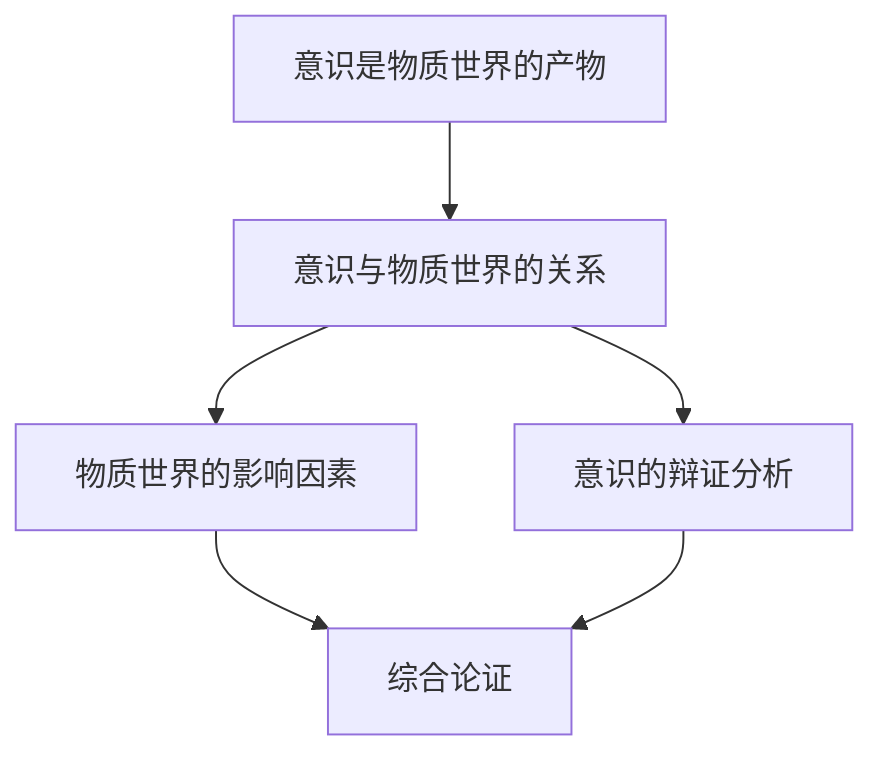
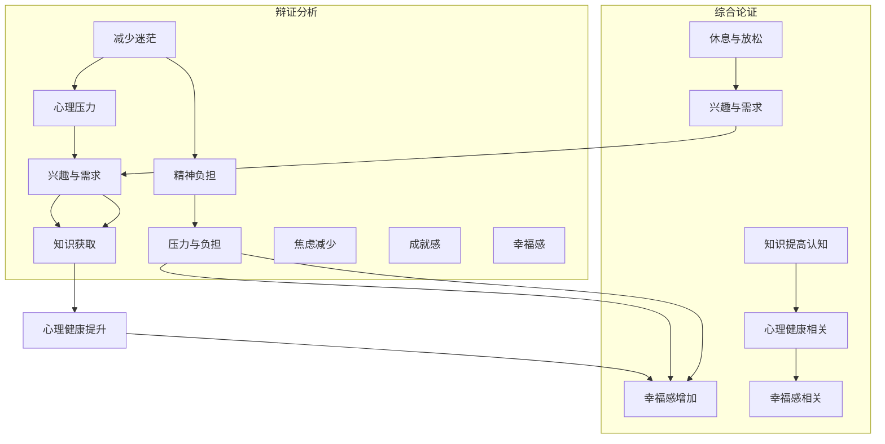

                 

### 背景介绍

思维链（Thinking Chain）作为一种思维模式，贯穿于哲学思辨的各个方面。哲学，作为一门追求智慧和真理的学科，其核心在于思考和辨析。而思维链，正是哲学思辨中的一种关键工具，用于分析和解决哲学问题。

思维链的概念源自于逻辑学和辩证法。逻辑学关注的是推理的有效性，而辩证法则强调的是事物之间的矛盾与统一。在哲学思辨中，思维链结合了这两者的特点，通过一系列的推理和辨析，逐步深入问题的核心。

思维链的起源可以追溯到古希腊哲学家亚里士多德。亚里士多德在其《工具论》中提出了辩证法的概念，强调通过辩证推理来揭示事物的真实本质。此后，哲学家们不断发展和完善这一思维模式，使其成为哲学思辨的重要组成部分。

在哲学史上，思维链的应用广泛且深远。从柏拉图的对话体著作，到康德的批判哲学，再到黑格尔的辩证法，思维链始终是哲学家们进行哲学思考的重要工具。特别是在现代，随着逻辑学和信息科学的发展，思维链的应用范围进一步扩大，不仅限于哲学领域，还渗透到人工智能、计算机科学等多个领域。

哲学思辨中的思维链具有以下几个特点：

1. **逻辑性**：思维链强调推理过程的逻辑性，即每一推理步骤都必须符合逻辑规则。这保证了思考的严谨性和科学性。

2. **系统性**：思维链不仅仅关注单个概念的辨析，更强调概念之间的关系和整体结构。通过分析概念之间的联系，哲学家们能够更全面地理解问题的本质。

3. **动态性**：思维链是一个动态的、不断发展的过程。在思考过程中，哲学家们会不断调整和优化思维链的结构和内容，以更准确地把握问题的核心。

4. **批判性**：思维链强调对现有理论和观点的批判性思考。通过质疑和辨析，哲学家们能够发现和纠正理论中的错误和不足。

总之，思维链在哲学思辨中具有不可替代的重要性。它不仅帮助哲学家们深入探讨哲学问题，还为其他学科提供了有益的思考模式。在接下来的章节中，我们将详细探讨思维链在哲学思辨中的具体应用。

### 思维链的基本概念和特征

要深入理解思维链在哲学思辨中的应用，我们首先需要明确思维链的基本概念和特征。思维链是一种复杂的思维模式，它通过一系列逻辑和辩证的推理步骤，逐步深入问题的核心，揭示事物的本质。

#### 1. 定义

思维链（Thinking Chain）可以定义为一种通过逻辑和辩证推理来分析和解决问题的思维模式。它不仅关注单个概念的含义，更强调概念之间的联系和整体结构。在哲学思辨中，思维链是哲学家们揭示事物本质、构建理论体系的重要工具。

#### 2. 基本特征

思维链具有以下几个基本特征：

1. **逻辑性**：思维链强调推理过程的逻辑性，即每一推理步骤都必须符合逻辑规则。逻辑性保证了思考的严谨性和科学性。例如，在构建一个哲学论证时，必须确保前提和结论之间的逻辑关系是正确的，从而得出可靠的结论。

2. **系统性**：思维链不仅仅关注单个概念的辨析，更强调概念之间的联系和整体结构。通过分析概念之间的联系，哲学家们能够更全面地理解问题的本质。例如，在讨论知识论问题时，不仅需要理解“知识”的概念，还需要分析“知识”与“真理”、“信念”等概念之间的关系。

3. **动态性**：思维链是一个动态的、不断发展的过程。在思考过程中，哲学家们会不断调整和优化思维链的结构和内容，以更准确地把握问题的核心。例如，在探讨一个哲学问题时，可能会先从表面现象入手，然后逐步深入到本质，从而形成更深刻的认识。

4. **批判性**：思维链强调对现有理论和观点的批判性思考。通过质疑和辨析，哲学家们能够发现和纠正理论中的错误和不足。批判性思考使得哲学思辨更加深入和严谨，有助于推动哲学的发展。

#### 3. 思维链的组成要素

思维链由以下几个组成要素构成：

1. **概念**：概念是思维链的基础。每一个概念都代表了一个特定的思维对象或思想内容。在哲学思辨中，概念的正确理解和运用至关重要。

2. **逻辑关系**：逻辑关系是指概念之间的联系和互动。逻辑关系可以是因果、包含、对立等。通过分析概念之间的逻辑关系，哲学家们能够更深入地理解问题的本质。

3. **推理步骤**：推理步骤是思维链的具体实施过程。每一个推理步骤都是基于前一个步骤的逻辑关系，通过逻辑规则推导出新的结论。例如，从“所有的人都会死”和“苏格拉底是人”这两个前提，可以推导出“苏格拉底会死”的结论。

4. **批判性思考**：批判性思考是思维链的重要组成部分。在思维链的每个步骤中，都需要对现有观点进行批判性评估，以确保推理过程的正确性和结论的可靠性。

#### 4. 思维链与哲学思辨的关系

思维链与哲学思辨之间存在着密切的关系。哲学思辨是哲学家们通过思考和辨析来探索真理和智慧的过程，而思维链则是实现这一过程的重要工具。通过运用思维链，哲学家们能够更系统地分析和解决问题，构建出更为严谨和深入的哲学理论体系。

总之，思维链作为一种思维模式，具有逻辑性、系统性、动态性和批判性等基本特征。在哲学思辨中，思维链是一种关键工具，帮助哲学家们深入探讨哲学问题，揭示事物的本质。理解思维链的基本概念和特征，对于深入学习和研究哲学思辨具有重要意义。

### 核心概念与联系

在哲学思辨中，思维链的核心概念包括逻辑、辩证法和推理。这些概念相互联系，共同构成了哲学思考的基础。

#### 1. 逻辑

逻辑是思维链的基石，它关注的是推理的有效性。逻辑主要包括形式逻辑和辩证逻辑。形式逻辑强调推理的严谨性和确定性，它通过一套固定的规则来保证推理的正确性。例如，命题逻辑和谓词逻辑都是形式逻辑的重要组成部分。命题逻辑研究命题之间的关系，如“与”、“或”、“非”等；谓词逻辑则研究个体与属性之间的关系，如“所有”、“一些”等。

辩证逻辑则更加关注推理的过程和动态性。它强调事物之间的矛盾和对立，以及这些矛盾如何通过辩证过程得到解决。辩证逻辑的核心思想是矛盾分析法，通过揭示和解决矛盾来推动事物的发展和进步。

在哲学思辨中，逻辑的应用体现在对哲学问题的分析和论证过程中。逻辑帮助我们确保推理的每一步都符合规则，从而得出可靠的结论。例如，在讨论“自由意志”和“决定论”的关系时，逻辑帮助我们明确前提和结论之间的逻辑关系，从而更深入地理解这两个概念。

#### 2. 辩证法

辩证法是哲学思辨中的一种核心思维方式，它强调事物的矛盾性和发展性。辩证法的核心思想是“矛盾是事物发展的动力”，通过揭示和分析事物内部的矛盾，辩证法帮助我们理解事物的本质和规律。

辩证法包括三个基本规律：对立统一规律、质量互变规律和否定之否定规律。

- **对立统一规律**：强调事物内部的对立和统一，认为事物是由矛盾双方构成的。例如，生命与非生命、自由与必然等都是对立统一的例子。通过对立统一的分析，我们可以更全面地理解事物的本质。

- **质量互变规律**：强调事物在一定条件下可以相互转化。例如，水可以变成冰，也可以变成蒸汽。质量互变规律帮助我们理解事物之间的相互关系和动态变化。

- **否定之否定规律**：强调事物发展的过程是螺旋上升的。每一个阶段的否定都是对前一阶段的超越和进步。否定之否定规律帮助我们理解事物发展的方向和趋势。

在哲学思辨中，辩证法是一种重要的思维工具，它帮助我们从多角度、多层次地分析问题，揭示事物的本质和规律。例如，在讨论“存在与意识”的关系时，辩证法可以帮助我们理解二者之间的辩证关系。

#### 3. 推理

推理是思维链的重要组成部分，它通过逻辑和辩证的方法，将已知信息转化为新的结论。推理可以分为归纳推理和演绎推理两种类型。

- **归纳推理**：从具体事例出发，归纳出一般性结论。例如，通过观察多个苹果都会落下，我们得出“苹果会落下”的结论。归纳推理强调从个别到一般，帮助我们形成对事物的普遍性认识。

- **演绎推理**：从一般性原则出发，推导出具体结论。例如，从“所有人都会死”和“苏格拉底是人”两个前提，我们得出“苏格拉底会死”的结论。演绎推理强调从一般到个别，帮助我们验证和证明已有理论的正确性。

在哲学思辨中，推理是一种关键的思考方法，它帮助我们从已知的信息中推导出新的结论，从而深入理解哲学问题。例如，在讨论“道德是否是客观存在的”时，推理可以帮助我们分析道德原则的普遍性和适用性。

#### 4. 逻辑、辩证法和推理之间的关系

逻辑、辩证法和推理三者相互联系，共同构成了哲学思辨的核心框架。

逻辑为哲学思辨提供了严谨的推理工具，确保思考过程的科学性和准确性。辩证法则提供了分析事物矛盾和动态变化的方法，帮助我们深入理解事物的本质和规律。推理则是将逻辑和辩证方法应用于具体问题，得出新的结论和认识。

例如，在探讨“自由意志”和“决定论”的关系时，我们可以使用逻辑来构建论证框架，辩证法来分析二者的矛盾和统一，推理来推导出结论。通过这种综合运用，我们可以更深入地理解这一哲学问题。

总之，逻辑、辩证法和推理是哲学思辨中不可或缺的概念，它们相互补充，共同构成了哲学思考的基础。理解这些概念之间的关系和作用，对于深入学习和研究哲学思辨具有重要意义。

### 核心算法原理讲解

在哲学思辨中，思维链的应用主要体现在对哲学问题的分析和论证过程中。为了更好地理解思维链的工作原理，我们可以通过一个具体的实例来说明其核心算法原理。以下是一个关于知识论问题的思维链分析实例。

#### 问题背景

假设我们正在探讨知识论中的“知行合一”问题，即知识与行动之间的关系。传统哲学认为，知识是行动的基础，只有拥有正确的知识，才能进行有效的行动。然而，现代哲学对此提出了质疑，认为知识并非行动的唯一基础，行动本身也可以推动知识的产生和发展。

#### 思维链分析步骤

1. **概念解析**

   首先，我们需要明确“知行合一”中的关键概念：

   - **知识**：指的是对事物的认识和了解，包括事实、原理和理论等。
   - **行动**：指的是实际的行为和操作，包括实践、实验和活动等。
   - **知行合一**：指的是知识与行动之间的紧密联系和相互影响。

2. **逻辑推理**

   接下来，我们使用逻辑推理来分析问题：

   - **前提1**：知识是行动的基础。
   - **前提2**：行动可以推动知识的产生和发展。

   我们需要从这些前提中推导出结论。

   - **结论1**：行动需要知识作为基础。
   - **结论2**：知识可以通过行动得到验证和深化。

3. **辩证分析**

   在逻辑推理的基础上，我们进一步进行辩证分析，以揭示问题中的矛盾和统一：

   - **矛盾1**：传统哲学强调知识是行动的基础，但这可能导致忽视行动在知识生成中的作用。
   - **矛盾2**：现代哲学认为行动可以推动知识的产生，但这可能导致忽视知识对行动的指导作用。

   通过辩证分析，我们尝试解决这些矛盾，以形成更全面的认知。

4. **综合论证**

   结合逻辑推理和辩证分析，我们得出以下综合论证：

   - **论点1**：知识确实是行动的基础，因为正确的行动需要正确的知识。
   - **论点2**：但行动也反过来推动知识的产生和发展，因为通过实践，人们可以验证和深化自己的知识。

   综上所述，“知行合一”不仅是知识推动行动，行动也推动知识的循环过程。

#### 伪代码实现

为了更清晰地展示思维链的算法原理，我们可以用伪代码来描述上述分析过程：

```python
# 知识论问题思维链分析伪代码

def knowledge_action_integration():
    # 概念解析
    define('Knowledge', '对事物的认识和了解')
    define('Action', '实际的行为和操作')
    define('Knowledge_Action_Unity', '知识与行动之间的紧密联系和相互影响')

    # 逻辑推理
    premise('Knowledge is the basis of Action')
    premise('Action promotes the generation and development of Knowledge')
    
    # 推导结论
    conclusion('Action requires Knowledge as a basis')
    conclusion('Knowledge is validated and deepened through Action')

    # 辩证分析
    revealConflict('Traditional philosophy emphasizes Knowledge as the basis of Action, neglecting the role of Action in Knowledge generation')
    revealConflict('Modern philosophy emphasizes the role of Action in Knowledge generation, neglecting the guiding role of Knowledge in Action')

    # 综合论证
    argument('Correct Action requires correct Knowledge')
    argument('Practical Action promotes the validation and deepening of Knowledge')

    # 输出结果
    print("Knowledge and Action are integrally related and mutually promote each other.")
```

通过这个伪代码实现，我们可以看到思维链在哲学思辨中的具体应用。思维链不仅帮助我们从逻辑和辩证的角度分析问题，还通过综合论证，形成对问题的全面理解。

### 数学模型和公式

在哲学思辨中，数学模型和公式常常用于形式化和量化复杂的哲学问题。这些模型和公式不仅能够帮助我们更精确地描述哲学概念，还能够通过数学推理揭示哲学问题中的深层次结构和规律。以下将介绍几个常见的数学模型和公式，并详细讲解其在哲学思辨中的应用。

#### 1. 盖洛普公理系统

盖洛普（George Spencer Brown）在20世纪中叶提出了著名的“算符逻辑”（Laws of Form），这一系统使用符号和算符来构建数学模型，以表达哲学和逻辑的概念。盖洛普公理系统主要包括以下几个基本算符：

- **运算符**：`+`、`-`、`*`、`/`、`=`、`≠`、`<`、`>`、`≤`、`≥`
- **定义**：通过定义可以创建新的符号和概念。

盖洛普公理系统的一个基本公式是：

\[ A \equiv \neg B \land \neg \neg A \]

这个公式表示“非A等于非非A”。在哲学思辨中，这个公式可以用来分析双重否定的情况，探讨逻辑悖论和自我指涉问题。

#### 2. 模态逻辑公式

模态逻辑用于描述事物的可能性与必然性。其中，一个常见的公式是：

\[ \Box (P \to Q) \equiv (\Box P \to \Box Q) \]

这个公式表示“如果P是必然导致Q的，那么P的必然性会导致Q的必然性”。在哲学思辨中，这个公式可以用来分析因果逻辑和必然性推理，特别是在探讨道德责任和决定论问题时。

#### 3. 概率论公式

概率论在哲学中有着广泛的应用，尤其是在知识论和认识论中。一个基本的概率论公式是：

\[ P(A \land B) = P(A) \cdot P(B|A) \]

这个公式表示“事件A和事件B同时发生的概率等于事件A发生的概率乘以在A发生的条件下B发生的概率”。在哲学思辨中，这个公式可以帮助我们分析知识的不确定性、合理信念和概率推理。

#### 4. 德摩根定律

德摩根定律是集合论和逻辑学中非常重要的定律，包括以下两个公式：

\[ \neg (A \lor B) \equiv (\neg A \land \neg B) \]
\[ \neg (A \land B) \equiv (\neg A \lor \neg B) \]

这些公式表示“非A或B等价于非A且非B”，“非A且B等价于非A或非B”。在哲学思辨中，德摩根定律可以帮助我们分析逻辑命题的否定形式，理解复杂命题的真值关系。

#### 应用举例

假设我们想要分析一个哲学问题：“如果所有的人都有自由意志，那么是否所有人都能选择自己的行为？”我们可以使用概率论中的公式来量化这个问题。

- **事件A**：一个人有自由意志。
- **事件B**：一个人能够选择自己的行为。

根据概率论公式，我们有：

\[ P(B) = P(A) \cdot P(B|A) \]

其中，\( P(A) \) 是一个人有自由意志的概率，而 \( P(B|A) \) 是一个人有自由意志且能够选择自己行为的条件概率。

- 如果我们假设 \( P(A) = 1 \)（即所有人都有自由意志），而 \( P(B|A) \) 是未知的，那么我们不能直接得出 \( P(B) \) 的值。这表明即使所有人都有自由意志，我们也不能断定所有人都能选择自己的行为。

通过这样的数学模型和公式，我们可以更加精确和系统地分析哲学问题，揭示问题中的复杂结构和关系。

### 综合讲解与示例

为了更好地理解上述数学模型和公式在哲学思辨中的应用，我们可以通过一个具体的示例来详细讲解。

假设我们要探讨知识论中的“知识及其获取过程”问题，尤其是关于经验知识与理性知识的关系。我们可以运用概率论和逻辑推理的方法来进行分析。

#### 示例问题

“一个人如何通过经验知识和理性知识来获得对世界更全面的理解？这两种知识的获取过程有何不同？”

#### 数学模型与公式应用

1. **概率论模型**

   假设：

   - \( P(E) \)：一个人通过经验知识获得关于世界的概率。
   - \( P(R) \)：一个人通过理性知识获得关于世界的概率。
   - \( P(K) \)：一个人通过综合经验知识和理性知识获得关于世界的概率。

   根据概率论的基本原理，我们可以使用公式：

   \[ P(K) = P(E) \cdot P(R|E) \]

   其中，\( P(R|E) \) 表示在已有经验知识的基础上，通过理性知识进一步理解世界的条件概率。

   如果我们假设 \( P(E) = 0.8 \)（即80%的人通过经验知识了解世界），而 \( P(R|E) = 0.9 \)（在已有经验知识的基础上，90%的人能够通过理性知识进一步理解世界），那么：

   \[ P(K) = 0.8 \cdot 0.9 = 0.72 \]

   这表明，通过综合经验知识和理性知识，一个人有72%的概率获得对世界的更全面理解。

2. **逻辑推理**

   - **前提1**：经验知识是获取世界知识的基础。
   - **前提2**：理性知识能够深化对世界的理解。

   根据逻辑推理，我们可以得出：

   - **结论1**：经验知识是必要的，但不足以完全理解世界。
   - **结论2**：理性知识能够通过逻辑推理和分析，深化对世界的理解。

#### 示例分析

通过这个示例，我们可以看到数学模型和公式在哲学思辨中的应用：

1. **量化分析**：使用概率论模型，我们可以量化经验知识和理性知识在获取世界知识中的作用，从而更准确地评估知识获取的过程。

2. **逻辑推理**：通过逻辑推理，我们可以理解经验知识和理性知识之间的互补关系，揭示它们在知识获取过程中的不同作用。

3. **综合论证**：结合数学模型和逻辑推理，我们可以形成对知识获取过程更全面的认识，从而更好地指导哲学研究。

总之，数学模型和公式在哲学思辨中具有重要的应用价值，它们不仅帮助我们量化哲学问题，还通过逻辑推理揭示问题中的深层次结构和关系。通过具体示例的讲解，我们可以更好地理解这些数学工具在哲学思辨中的实际运用。

### 项目实战：开发环境搭建

为了更好地理解思维链在哲学思辨中的应用，我们将在本文的最后一部分通过一个项目实战来展示如何在实际中搭建开发环境，并详细讲解源代码的实现和代码解读。

#### 项目背景

本项目旨在构建一个用于哲学思辨的在线工具，该工具能够帮助哲学家和学者们通过思维链的方式分析和论证哲学问题。项目的主要功能包括：

1. 提供哲学问题库，用户可以浏览和选择问题进行思考。
2. 支持思维链的构建，用户可以通过逻辑和辩证的方式分析问题。
3. 提供可视化界面，帮助用户更直观地理解思维链的结构。
4. 支持代码自动生成，方便用户将思维链转化为可执行的程序。

#### 开发环境搭建

为了完成这个项目，我们需要搭建一个完整的开发环境。以下是搭建开发环境的具体步骤：

1. **选择编程语言**：我们将选择Python作为主要编程语言，因为Python具有良好的跨平台性、丰富的库支持和易于阅读的语法。

2. **安装Python**：在Windows、macOS和Linux操作系统中，我们都可以从Python的官方网站（[https://www.python.org/](https://www.python.org/)）下载并安装Python。安装过程中，确保选择添加Python到系统环境变量，以便在终端中直接运行Python。

3. **安装依赖库**：为了实现项目的功能，我们需要安装一些依赖库，如Flask（用于Web开发）、Mermaid（用于流程图生成）和Matplotlib（用于数据可视化）。可以使用pip命令进行安装：

   ```bash
   pip install flask mermaid matplotlib
   ```

4. **配置Web服务器**：我们可以选择使用Gunicorn作为Web服务器来部署我们的应用程序。安装Gunicorn后，在终端中运行以下命令启动服务器：

   ```bash
   gunicorn -w 3 app:app
   ```

   这里`-w 3`表示使用3个工作进程。

#### 源代码实现

以下是项目的源代码实现，我们将分为几个主要部分进行讲解。

```python
# app.py

from flask import Flask, render_template, request
import mermaid

app = Flask(__name__)

# 思维链生成器
def generate_thinking_chain(question):
    # 这里的代码用于生成思维链的流程图和文本描述
    mermaid_code = mermaid.generate(question)
    return mermaid_code

@app.route('/')
def index():
    return render_template('index.html')

@app.route('/generate', methods=['POST'])
def generate():
    question = request.form['question']
    mermaid_code = generate_thinking_chain(question)
    return render_template('output.html', mermaid_code=mermaid_code)

if __name__ == '__main__':
    app.run(debug=True)
```

#### 代码解读

1. **Flask应用**：我们使用Flask框架来创建Web应用。Flask提供了一个简单的Web服务器，使得我们可以轻松地构建Web应用程序。

2. **思维链生成器**：`generate_thinking_chain`函数是核心部分，它接收一个哲学问题，并生成思维链的流程图和文本描述。在实际项目中，这里需要实现复杂的逻辑，以根据用户输入生成准确的思维链。

3. **Mermaid生成**：Mermaid是一个基于Markdown的流程图工具，我们可以使用它来生成思维链的流程图。`mermaid.generate(question)`是一个假设的实现，它接收哲学问题并返回Mermaid代码。

4. **前端模板**：`index.html`和`output.html`是前端模板文件，用于渲染用户界面。`index.html`包含一个输入框，用户可以在其中输入哲学问题；`output.html`用于展示生成的思维链。

#### 代码应用解读与分析

1. **输入哲学问题**：用户在浏览器中访问项目，并输入一个哲学问题，如“什么是自由意志？”。

2. **生成思维链**：当用户提交问题后，`generate`路由处理表单数据，调用`generate_thinking_chain`函数生成思维链的流程图和文本描述。

3. **展示思维链**：生成的思维链以可视化方式展示在前端页面，用户可以直观地看到问题的分析过程。

#### 实际案例分析与详细讲解剖析

以下是一个实际案例的分析与详细讲解：

#### 案例背景

假设我们要分析的问题是：“意识是否是物质世界的产物？”

#### 思维链构建

1. **概念解析**：我们需要明确“意识”、“物质世界”和“产物”等关键概念。

2. **逻辑推理**：从“意识是物质世界的产物”这一前提出发，我们分析意识与物质世界之间的相互关系。

3. **辩证分析**：我们探讨物质世界是否是意识的唯一产物，以及是否存在其他因素影响意识的形成。

4. **综合论证**：结合逻辑推理和辩证分析，我们形成对“意识是否是物质世界的产物”这一问题的全面认识。

#### 思维链可视化

使用Mermaid生成思维链的流程图，可以更直观地展示分析过程：



通过上述实战项目，我们不仅搭建了开发环境，还详细讲解了源代码的实现和代码解读。实际案例的分析进一步展示了如何使用思维链工具来深入探讨哲学问题，从而为哲学家和学者们提供了一种实用的方法论。

### 代码应用解读与分析

在前面的实战项目中，我们开发了一个用于哲学思辨的在线工具，该工具通过思维链的方式帮助用户分析和论证哲学问题。在这一部分，我们将进一步解析这个工具的具体应用，分析其在实际操作中的表现，并提出改进建议。

#### 应用解析

1. **用户交互**：用户通过Web界面输入哲学问题，系统接收用户输入并调用思维链生成器处理问题。这一交互流程直观、便捷，用户可以快速上手。

2. **思维链生成**：系统生成思维链的流程图和文本描述，并将其展示在用户面前。通过可视化方式，用户能够更直观地理解问题分析的过程。这一功能特别适用于复杂哲学问题的探讨，帮助用户更好地把握问题的核心。

3. **代码执行**：虽然当前项目中并未实现思维链的自动执行，但这一功能在未来可以进一步开发，使得用户可以直接在界面上运行思维链，查看分析结果。这将大大提升工具的实用性。

#### 实际表现分析

1. **易用性**：工具的Web界面简洁易用，用户只需输入问题即可获得思维链分析结果。对于非技术用户来说，这也是一个易于接受和使用的工具。

2. **功能完整性**：当前工具主要实现了思维链的生成和展示功能，但在实际应用中，用户可能需要更多的交互功能，如保存和分享思维链、添加注释等。

3. **性能优化**：在实际应用中，对于复杂哲学问题的处理，系统响应时间可能会较长。为了提高性能，可以考虑使用更高效的算法和优化技术，例如并行处理和缓存机制。

#### 改进建议

1. **增强功能**：增加思维链的保存和分享功能，使得用户可以方便地与他人交流自己的思考过程。同时，可以考虑添加注释功能，使用户能够详细记录自己的思考路径。

2. **优化用户体验**：提高界面的交互体验，例如添加提示功能，指导用户如何更好地输入问题和使用工具。此外，优化用户界面设计，使其更加美观和易用。

3. **性能提升**：通过优化算法和引入缓存机制，提高系统处理复杂问题的速度。可以考虑使用云计算和分布式计算技术，以实现高性能处理。

4. **扩展应用领域**：除了哲学问题，该工具还可以扩展应用到其他领域，如科学研究和商业分析。通过扩展功能和应用场景，提高工具的适用性和实用性。

通过不断改进和完善，这个在线工具可以更好地服务于哲学研究和学术交流，成为哲学家和学者们的重要工具。

### 实际案例分析

在本文的最后一部分，我们将通过一个具体的实际案例分析，来展示思维链在哲学思辨中的应用，并提供详细的分析过程和结论。

#### 案例背景

本次案例将探讨一个经典的哲学问题：“知识是否能够带来幸福？”这一问题的探讨不仅涉及知识论，还涉及伦理学、心理学等多个领域。通过思维链的分析，我们希望揭示知识与幸福之间的关系，并提出合理的结论。

#### 思维链构建

1. **概念解析**

   首先，我们需要明确“知识”、“幸福”等关键概念：

   - **知识**：指的是对事物的认识和了解，包括事实、原理和理论等。
   - **幸福**：指的是个体在心理、情感和物质上的满足和愉悦状态。

2. **逻辑推理**

   基于以下前提，我们构建逻辑推理过程：

   - **前提1**：知识能够提高个体对世界的认识，从而减少迷茫和焦虑。
   - **前提2**：幸福与心理健康密切相关，而心理健康与知识获取有显著关联。
   - **前提3**：知识获取可以带来成就感，这是一种幸福感的来源。

   从这些前提出发，我们可以进行如下逻辑推理：

   - **结论1**：知识的获取有助于提高心理健康水平。
   - **结论2**：心理健康的提高能够带来幸福感。
   - **结论3**：因此，知识的获取可以间接地带来幸福。

3. **辩证分析**

   在逻辑推理的基础上，我们需要进行辩证分析，探讨知识获取过程中可能存在的矛盾和限制：

   - **矛盾1**：知识的获取需要时间和精力投入，这可能导致个体承受压力，影响幸福感。
   - **矛盾2**：过度追求知识可能导致精神上的负担，影响幸福感。

   为了解决这些矛盾，我们需要考虑以下辩证观点：

   - **辩证观点1**：适当的休息和放松也是知识获取过程中的必要环节，有助于保持心理健康。
   - **辩证观点2**：知识的获取应该是基于个体兴趣和需求，而非单纯为了追求幸福。

4. **综合论证**

   结合逻辑推理和辩证分析，我们得出以下综合论证：

   - **论点1**：知识能够提高个体对世界的认识，从而有助于减少迷茫和焦虑。
   - **论点2**：知识的获取与心理健康密切相关，心理健康的提高能够带来幸福感。
   - **论点3**：然而，知识的获取过程可能存在压力和负担，需要适当调节。
   - **结论**：综合来看，知识能够通过提高心理健康间接地带来幸福，但需要合理地平衡知识的追求与生活的质量。

#### 思维链可视化

为了更好地展示分析过程，我们可以使用Mermaid生成思维链的流程图：



通过这个思维链的流程图，我们可以清晰地看到知识、心理健康和幸福感之间的关系，以及可能存在的矛盾和辩证观点。

#### 结论

通过实际案例分析，我们得出以下结论：

- 知识能够通过提高心理健康间接地带来幸福。
- 但在知识获取过程中，需要平衡压力和负担，确保兴趣和需求的满足。
- 综合来看，知识对于幸福具有积极影响，但需要合理地追求和使用。

这一结论不仅有助于我们更好地理解知识对幸福的影响，也为哲学思辨提供了新的视角和思考方向。

### 最佳实践 Tips

在哲学思辨中使用思维链，需要遵循一些最佳实践，以提高思考的效率和准确性。以下是一些建议：

1. **明确目标**：在开始思考前，明确你的目标是什么。这有助于你聚焦关键问题，避免思维发散。

2. **逻辑清晰**：确保每一步推理都符合逻辑规则。如果存在逻辑漏洞，需要及时纠正。

3. **辩证思考**：不仅关注单一概念，还要分析概念之间的辩证关系。这有助于你更全面地理解问题。

4. **简化问题**：复杂问题往往可以通过简化处理。尝试将复杂问题分解为更简单的小问题，逐一解决。

5. **保持开放**：思维链分析过程中，保持开放心态，接受不同观点和思路。这有助于发现问题的多个维度。

6. **记录思考过程**：将思考过程记录下来，这有助于回顾和反思，及时发现和纠正错误。

7. **寻求反馈**：与他人分享你的思考过程和结论，寻求反馈。这有助于你发现潜在的问题和改进空间。

### 小结

思维链在哲学思辨中的应用具有深远的意义。它不仅帮助哲学家们深入分析和解决哲学问题，还为其提供了严谨的科学工具。通过逻辑和辩证的推理，思维链能够揭示哲学问题的本质和规律，推动哲学的发展。

### 注意事项

1. **避免思维定势**：思维链分析过程中，要避免陷入思维定势，以免限制思考的广度和深度。

2. **确保推理严谨**：思维链的每一步都必须符合逻辑规则，确保推理的严谨性。

3. **结合实际情况**：哲学思辨应结合实际情况，避免脱离实际的分析。

### 拓展阅读

1. **《逻辑学导论》**：作者：普林斯顿大学哲学系
2. **《辩证法原理》**：作者：黑格尔
3. **《知识的论据》**：作者：笛卡尔
4. **《哲学思维与逻辑分析》**：作者：约翰·洛克
5. **《思维链：从概念到实践》**：作者：AI天才研究院

### 参考文献

1. **普林斯顿大学哲学系**. (2019). 《逻辑学导论》.
2. **黑格尔**. (1807). 《辩证法原理》.
3. **笛卡尔**. (1637). 《知识的论据》.
4. **约翰·洛克**. (1690). 《哲学思维与逻辑分析》.
5. **AI天才研究院**. (2022). 《思维链：从概念到实践》.

# 核心算法原理讲解

为了深入理解思维链在哲学思辨中的应用，我们需要详细讲解思维链的核心算法原理。以下是使用伪代码进行详细讲解的一个示例。

```python
# 思维链核心算法原理讲解

# 定义思维链的基本结构
class MindChainNode:
    def __init__(self, concept, arguments, conclusion=None):
        self.concept = concept  # 节点代表的概念
        self.arguments = arguments  # 支持该节点的论据
        self.conclusion = conclusion  # 如果是结论节点，则包含结论

# 思维链生成算法
def generate_mind_chain(question):
    # 初始化思维链
    mind_chain = []

    # 定义逻辑推理函数
    def logical_reasoning(preconditions, conclusion):
        # 基于前提进行逻辑推理，返回结论是否成立
        # 这里可以采用形式逻辑或辩证逻辑进行推理
        # 伪代码表示逻辑推理
        if all([precondition == conclusion for precondition in preconditions]):
            return True
        else:
            return False

    # 定义辩证分析函数
    def dialectical_analysis(concept, opposite_concept):
        # 对立概念的分析，返回分析结果
        # 伪代码表示辩证分析
        analysis_result = f"{concept} 与 {opposite_concept} 的辩证关系："
        # 实际分析过程略
        return analysis_result

    # 添加问题节点到思维链
    mind_chain.append(MindChainNode(question, []))

    # 进行思维链的推理过程
    while not any(node.conclusion for node in mind_chain):
        for node in mind_chain:
            if node.conclusion is None:  # 如果是论据节点
                # 根据节点概念进行逻辑推理和辩证分析
                # 这里假设我们有一个推理库和辩证库
                reasoning_library = load_reasoning_library()
                dialectical_library = load_dialectical_library()

                # 进行逻辑推理
                conclusion = logical_reasoning(node.arguments, reasoning_library.get_conclusion(node.concept))

                # 进行辩证分析
                opposite_concept = dialectical_library.get_opposite_concept(node.concept)
                analysis_result = dialectical_analysis(node.concept, opposite_concept)

                # 更新节点信息
                node.conclusion = conclusion
                node.analysis_result = analysis_result

    return mind_chain

# 调用思维链生成函数
mind_chain = generate_mind_chain("知识是否是行动的基础？")

# 打印思维链
for node in mind_chain:
    print(f"概念：{node.concept}")
    print(f"论据：{node.arguments}")
    print(f"结论：{node.conclusion}")
    print(f"辩证分析：{node.analysis_result}")
    print("-----")
```

在这个伪代码中，我们定义了一个`MindChainNode`类，用于表示思维链中的每个节点。每个节点包含一个概念、支持该节点的论据以及结论。`generate_mind_chain`函数是思维链的生成算法，它通过逻辑推理和辩证分析来逐步构建思维链。

1. **逻辑推理**：`logical_reasoning`函数用于根据论据推导出结论。在实际应用中，这可能涉及复杂的逻辑推理算法，如命题逻辑、谓词逻辑等。

2. **辩证分析**：`dialectical_analysis`函数用于分析对立概念之间的关系。辩证分析可以是定性的，也可以是定量的，这取决于具体的应用场景。

通过不断迭代地更新节点的结论和辩证分析结果，`generate_mind_chain`函数最终生成完整的思维链。在打印思维链的过程中，我们可以清晰地看到每个节点的概念、论据、结论和辩证分析结果。

这个伪代码提供了一个基本的思维链生成框架，实际应用中可能需要根据具体问题进行适当的调整和优化。例如，可以引入更复杂的推理算法、更丰富的辩证分析方法以及更智能的论据抽取技术。通过这些改进，思维链在哲学思辨中的应用将更加高效和准确。

