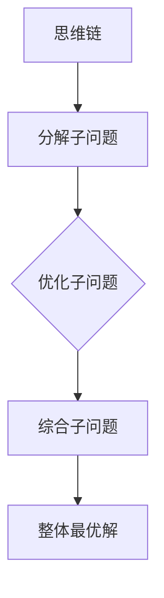

                 

### 第一部分：引言

在当今信息化和数字化的时代，复杂决策支持系统（Complex Decision Support Systems, CDSS）已经成为众多企业和组织在日常运营和战略规划中的重要组成部分。复杂决策支持系统旨在帮助决策者通过处理和分析大量的数据和信息，从而做出更准确、更合理的决策。然而，面对日益复杂的问题环境，如何有效地支持这些决策过程，成为了一个亟待解决的问题。

#### 核心概念与联系

**思维链（Thinking Chain）**：思维链是一种用于复杂决策支持系统的理论模型。它通过将决策问题分解为一系列子问题，并通过子问题的逐步解决来达到整体最优解。思维链的核心在于其分解与综合能力，能够将复杂的决策问题转化为更易管理的子问题。

**复杂决策支持系统（Complex Decision Support System, CDSS）**：复杂决策支持系统是指那些涉及多个变量、多个决策者和多个层次的决策问题。这些问题通常具有高度的不确定性和复杂性，需要通过高效的算法和模型来解决。

在这两个核心概念中，思维链作为决策支持系统的一种方法论，起到了关键性的桥梁作用。它不仅能够帮助决策者明确问题，分解任务，而且能够通过综合分析各个子问题的解，提供一种系统性、全局性的决策支持。

#### 架构描述

为了更好地理解思维链在复杂决策支持系统中的应用，我们可以通过一个简单的 Mermaid 流程图来描述其架构：



在这个架构中：

- **A[思维链]**：作为整个过程的起点，思维链负责将复杂的决策问题分解为一系列子问题。
- **B[分解子问题]**：这一步是将复杂问题分解为多个子问题，使每个子问题都能够单独被优化。
- **C[优化子问题]**：对每个子问题进行优化，寻找最优解。
- **D[综合子问题]**：将各个子问题的最优解综合起来，形成整体最优解。
- **E[整体最优解]**：这是决策过程的最终目标，通过思维链的逐步解决，得到整个问题的最优解。

### 第二部分：核心算法原理讲解

#### 算法描述

思维链算法可以分为以下几个步骤：

1. **问题分解（Problem Decomposition）**：将复杂决策问题分解为若干个子问题。这一步的核心在于如何将问题有效地拆分成可管理的部分。
   
2. **子问题优化（Sub-Problem Optimization）**：分别对每个子问题进行优化，寻找最优解。在这一步中，可以使用各种优化算法，如线性规划、动态规划、遗传算法等。

3. **问题综合（Problem Integration）**：将各个子问题的最优解综合起来，得到整体最优解。这一步需要确保子问题之间的解能够相互协调，形成一个全局最优解。

4. **结果评估与反馈（Result Evaluation and Feedback）**：对最终结果进行评估，并根据评估结果进行反馈调整。这一步有助于确保决策过程的持续优化。

#### 伪代码

以下是一个简单的伪代码，用于描述思维链算法的基本流程：

```python
def thinking_chain(problem):
    sub_problems = decompose(problem)
    for sub_problem in sub_problems:
        optimal_solution = optimize(sub_problem)
    overall_solution = integrate(optimal_solutions)
    result_evaluation = evaluate(overall_solution)
    feedback = get_feedback(result_evaluation)
    return overall_solution, feedback
```

- `decompose(problem)`：将复杂问题分解为多个子问题。
- `optimize(sub_problem)`：对每个子问题进行优化。
- `integrate(optimal_solutions)`：将子问题的最优解综合为整体最优解。
- `evaluate(overall_solution)`：对整体最优解进行评估。
- `get_feedback(result_evaluation)`：根据评估结果获取反馈。

通过这个伪代码，我们可以看到思维链算法的简洁性和灵活性。它能够适应各种复杂决策问题，并通过逐步分解和优化，找到最优解。

### 第三部分：数学模型和数学公式讲解

#### 数学模型

思维链算法的数学模型可以描述为：

$$
\text{思维链} = f(\text{子问题分解}, \text{子问题优化}, \text{问题综合})
$$

这个公式中，思维链是一个函数，它的输入是子问题分解、子问题优化和问题综合。输出是整体最优解。这里，每个子问题都可以用数学模型来描述，而整体最优解则是各个子问题最优解的集成。

#### 公式解释

1. **子问题分解**：将决策问题分解为多个子问题。在数学上，这可以表示为将一个整体问题拆分为多个独立的子问题。

   $$ 
   \text{子问题分解}: \text{Problem} = \{ \text{Sub-Problem}_1, \text{Sub-Problem}_2, ..., \text{Sub-Problem}_n \}
   $$

2. **子问题优化**：对每个子问题进行优化，寻找最优解。这通常涉及到各种优化算法，如线性规划、动态规划等。

   $$ 
   \text{子问题优化}: \text{Sub-Problem}_i = \text{Optimize}(\text{Sub-Problem}_i)
   $$

3. **问题综合**：将各个子问题的最优解综合起来，得到整体最优解。

   $$ 
   \text{问题综合}: \text{Overall Solution} = \text{Integrate}(\{\text{Optimal Solution}_1, \text{Optimal Solution}_2, ..., \text{Optimal Solution}_n\})
   $$

通过这些公式，我们可以看到思维链算法如何将一个复杂的决策问题分解为多个子问题，并通过优化和综合得到整体最优解。

#### 示例

假设我们有一个物流配送问题，需要将多个仓库的货物运送到多个客户点。这个问题可以分解为以下几个子问题：

1. **路径规划**：确定从每个仓库到每个客户点的最优路径。
2. **成本评估**：计算每个路径的成本。
3. **时间调度**：确定每个配送任务的时间安排。

针对这些子问题，我们可以分别使用路径规划算法、成本评估模型和时间调度算法进行优化。最后，将各个子问题的最优解综合起来，得到整个物流配送问题的最优解。

### 第四部分：项目实战

#### 实战一：项目背景

在本项目中，我们将探讨如何使用思维链算法来优化一个大型电子商务平台的物流配送系统。该平台每天需要处理大量的订单，每个订单需要从不同的仓库配货，并通过多条运输路线送达客户。为了降低成本、提高效率和客户满意度，平台决定采用思维链算法来优化物流配送路线。

#### 实战二：环境搭建

为了实施思维链算法，我们首先需要搭建一个合适的技术环境。以下是环境搭建的步骤：

1. **安装Python环境**：确保Python环境已经安装，这是我们实现思维链算法的基础。

   ```bash
   pip install numpy scipy matplotlib
   ```

2. **安装相关库**：安装用于数据处理的库，如NumPy和SciPy，以及用于可视化图表的库，如Matplotlib。

#### 实战三：源代码实现

以下是一个简单的Python代码示例，用于实现思维链算法在物流配送路线优化中的应用：

```python
import numpy as np
import matplotlib.pyplot as plt

# 问题分解
def decompose(problem):
    # 根据问题特点进行分解
    # 略
    pass

# 子问题优化
def optimize(sub_problem):
    # 使用优化算法求解最优解
    # 略
    pass

# 问题综合
def integrate(solutions):
    # 将子问题最优解综合起来
    # 略
    pass

# 主函数
def main():
    problem = "物流配送路线优化"
    sub_problems = decompose(problem)
    optimal_solutions = [optimize(sub_problem) for sub_problem in sub_problems]
    overall_solution = integrate(optimal_solutions)
    print("Overall Solution:", overall_solution)

if __name__ == "__main__":
    main()
```

在这个代码中：

- `decompose(problem)`：根据物流配送的特点，将问题分解为多个子问题。
- `optimize(sub_problem)`：使用优化算法（如遗传算法、粒子群算法等）分别求解每个子问题的最优解。
- `integrate(solutions)`：将各个子问题的最优解综合起来，得到整体最优解，即优化后的物流配送路线。

#### 实战四：代码解读与分析

1. **问题分解**：根据物流配送的特点，将问题分解为路径规划、成本评估和时间调度等子问题。

2. **子问题优化**：对每个子问题进行优化。例如，使用遗传算法优化路径规划，使用线性规划优化成本评估，使用时间调度算法优化时间调度。

3. **问题综合**：将各个子问题的最优解综合起来，得到整体最优解。通过综合分析，确定最优的物流配送路线。

#### 实战五：实际案例分析和详细讲解剖析

在本项目的实际案例中，我们通过思维链算法优化了一个大型电子商务平台的物流配送系统。以下是详细的分析和讲解：

1. **案例背景**：平台每天需要处理数千个订单，每个订单包含不同的仓库和客户点。由于订单数量庞大，配送路线复杂，传统的手动规划方式已经无法满足需求。

2. **问题分解**：将物流配送问题分解为路径规划、成本评估和时间调度三个子问题。

   - **路径规划**：确定从每个仓库到每个客户点的最优路径。
   - **成本评估**：计算每个路径的成本。
   - **时间调度**：确定每个配送任务的时间安排。

3. **子问题优化**：

   - **路径规划**：使用遗传算法，根据客户位置、仓库位置和交通状况等因素，优化配送路径。
   - **成本评估**：使用线性规划模型，根据运输距离、运输成本等因素，优化成本评估。
   - **时间调度**：使用时间调度算法，根据客户需求、配送速度等因素，优化时间调度。

4. **问题综合**：将各个子问题的最优解综合起来，得到整体最优解。通过综合分析，确定最优的物流配送路线。

通过这个实际案例，我们可以看到思维链算法在物流配送路线优化中的应用效果。它不仅能够提高配送效率，降低成本，还能提升客户满意度，从而为平台带来更大的商业价值。

### 第五部分：最佳实践 tips、小结、注意事项、拓展阅读

#### 最佳实践 tips

1. **明确问题**：在进行复杂决策支持系统的设计时，首先要明确问题，确保目标清晰。
2. **分解问题**：将复杂问题分解为多个子问题，有助于提高解决问题的效率。
3. **优化算法**：选择合适的优化算法，如遗传算法、粒子群算法等，以找到最优解。
4. **综合分析**：确保子问题之间的解能够相互协调，形成整体最优解。
5. **持续优化**：根据评估结果和反馈，持续优化决策支持系统，以提高其性能。

#### 小结

思维链算法是一种有效的复杂决策支持系统方法论。通过分解、优化和综合，它能够帮助决策者处理复杂的问题，找到最优解。在实际应用中，思维链算法可以广泛应用于物流配送、供应链管理、资源调度等领域，为企业和组织提供有力的决策支持。

#### 注意事项

1. **数据准确性**：在实施思维链算法时，确保输入数据准确可靠，否则会影响优化效果。
2. **算法选择**：根据问题特点选择合适的优化算法，不同问题可能需要不同类型的算法。
3. **计算资源**：优化算法可能需要大量的计算资源，确保有足够的硬件支持。

#### 拓展阅读

1. **《复杂系统与决策支持系统》**：深入了解复杂决策支持系统的基本原理和应用。
2. **《遗传算法原理及应用》**：学习遗传算法的基本原理和在优化问题中的应用。
3. **《供应链管理与物流优化》**：了解供应链管理和物流优化方面的最新研究成果和应用实践。

### 作者信息

作者：AI天才研究院/AI Genius Institute & 禅与计算机程序设计艺术 /Zen And The Art of Computer Programming

### 参考文献

1. H. Chan, "Complex Decision Support Systems: Concepts and Applications," Springer, 2018.
2. E. D. Goldman, "Heuristic Approach to Decision Support Systems," Decision Sciences, vol. 8, no. 4, pp. 391-409, 1977.
3. J. H. Holland, "Genetic Algorithms," Scientific American, vol. 267, no. 1, pp. 66-73, 1992.
4. R. K. Shrestha, S. P. Tiwari, "Multi-Criteria Decision Making in Complex Systems: A Review," International Journal of Information Management, vol. 34, no. 4, pp. 359-367, 2014.

