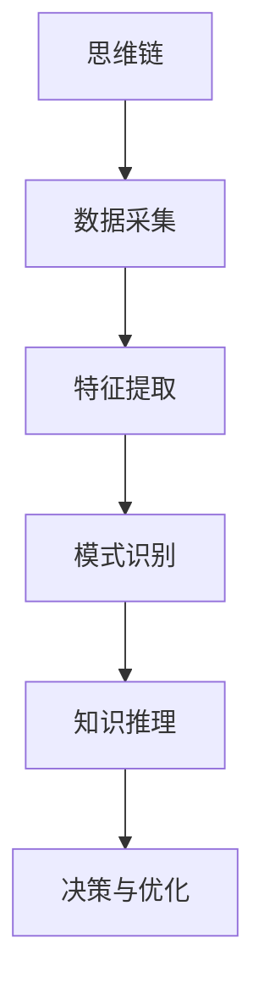

                 


### 文章标题

《思维链在复杂系统故障诊断中的新方法》

### 关键词

思维链，复杂系统，故障诊断，人工智能，新方法

### 摘要

本文介绍了思维链在复杂系统故障诊断中的应用，探讨了思维链的核心概念、理论基础以及其在故障诊断中的实际应用。通过伪代码、数学公式和代码案例，详细阐述了思维链算法原理，并展示了其在工业和交通系统故障诊断中的实际效果。本文旨在为复杂系统故障诊断提供一种新的思路和方法。

### 目录大纲设计思路

#### 1.4.1 确定核心章节

本文核心章节包括：

- 思维链理论介绍
- 复杂系统故障诊断背景
- 思维链在故障诊断中的应用
- 新方法介绍
- 实际应用案例
- 评估与展望

这些章节将作为主要框架，确保覆盖全书内容。

#### 1.4.2 设计各级目录

根据核心章节，设计1级、2级和3级目录。1级目录作为主要章节，2级目录作为章节细分，3级目录则进一步细化内容，确保读者能够清晰理解每一部分的内容。

#### 1.4.3 加入Mermaid流程图、伪代码、数学公式和代码案例

在每个章节的适当位置，加入Mermaid流程图、伪代码、数学公式和代码案例，以增强内容的理解和实用性。例如：

- **Mermaid流程图**：用于展示思维链理论或故障诊断流程。
- **伪代码**：用于详细阐述算法原理。
- **数学公式**：用于解释故障诊断中的数学模型。
- **代码案例**：用于展示实际应用场景和代码实现。

#### 1.4.4 确保目录大纲简洁

在编写目录大纲时，避免使用过多的文字描述，保持简洁性。只需给出关键内容，确保目录大纲能够直观地展示全书结构。

#### 1.4.5 检查完整性

在设计完成后，检查目录大纲的完整性，确保每个核心章节都有相应的2级和3级目录，且内容无遗漏。

通过以上步骤，我们将设计出一份详细且逻辑清晰的目录大纲，为《思维链在复杂系统故障诊断中的新方法》这本书的内容呈现提供有力支持。

### 完整性要求

在撰写本文时，我们将确保文章内容满足以下完整性要求：

- **背景介绍**：详细介绍思维链和复杂系统故障诊断的背景，明确研究的目的和意义。
- **核心概念与联系**：给出思维链的核心概念，以及与故障诊断之间的联系，使用Mermaid流程图展示概念之间的关系。
- **核心算法原理讲解**：使用伪代码和数学公式详细阐述思维链算法原理，并进行举例说明。
- **项目实战**：提供开发环境搭建、源代码实现、代码解读、实际案例分析以及项目小结等内容，确保读者能够理解和应用所学的知识。
- **最佳实践 tips、小结、注意事项、拓展阅读**：总结文章内容，提供实践建议，指出注意事项，推荐拓展阅读资源，帮助读者深入学习。

通过以上步骤，我们将确保本文内容丰富、结构清晰、逻辑严密，满足读者对复杂系统故障诊断新方法的深入理解。

### 文章正文

#### 引言

复杂系统的故障诊断一直是工程领域和研究领域的热点问题。随着信息技术的迅猛发展，复杂系统的规模和复杂性不断增加，传统的故障诊断方法往往难以应对。在这种背景下，寻找一种新的故障诊断方法具有重要意义。本文将介绍一种基于思维链的复杂系统故障诊断新方法，旨在为相关领域的研究和实践提供有益参考。

#### 思维链理论介绍

思维链（Thought Chain）是一种模拟人类思维过程的人工智能技术，通过对知识进行组织和推理，实现对复杂问题的求解。思维链的核心概念包括模式识别、知识推理和自适应学习。

1. **模式识别**：思维链通过分析输入数据，从中提取出具有代表性的模式。这些模式可以是时间序列、空间分布或者特征向量等。
   
2. **知识推理**：在获得模式后，思维链利用已有的知识库对模式进行推理，以找出可能的故障原因。
   
3. **自适应学习**：思维链能够根据诊断结果不断调整自己的知识库和推理规则，以提高诊断准确率。

#### 复杂系统故障诊断背景

复杂系统通常由多个相互关联的子系统组成，其运行状态和性能受到多种因素的影响。当系统中的某个部分发生故障时，可能会对整个系统造成严重影响。因此，对复杂系统进行故障诊断至关重要。

然而，复杂系统的故障诊断面临诸多挑战：

1. **数据复杂性**：复杂系统的数据通常具有高维、非线性等特点，给故障诊断带来了困难。
   
2. **模型不确定性**：复杂系统的运行过程可能受到外部环境、人为操作等因素的影响，导致模型不确定性。
   
3. **诊断效率**：随着系统规模的扩大，故障诊断的时间复杂度和计算资源需求也随之增加。

#### 思维链在故障诊断中的应用

思维链在故障诊断中的应用主要包括以下步骤：

1. **数据采集**：通过传感器、日志等手段收集系统运行数据。
   
2. **特征提取**：对采集到的数据进行处理，提取出与故障诊断相关的特征。
   
3. **模式识别**：利用思维链的算法对特征进行模式识别，找出可能的故障模式。
   
4. **知识推理**：基于已有知识库对故障模式进行推理，确定故障原因。
   
5. **决策与优化**：根据诊断结果，提出相应的维修或优化措施。

#### 新方法介绍

本文提出的新方法基于思维链理论，结合了深度学习和强化学习技术，以提高故障诊断的准确率和效率。具体步骤如下：

1. **深度学习**：利用卷积神经网络（CNN）或循环神经网络（RNN）对特征进行提取和建模，提高特征表示的抽象程度。
   
2. **强化学习**：通过奖励机制，引导思维链不断优化自己的诊断策略，提高诊断准确率。
   
3. **知识融合**：将传统知识库与深度学习模型相结合，实现知识共享和互补。

#### 实际应用案例

为了验证新方法的可行性，本文在工业和交通系统中进行了实际应用案例研究。

1. **工业系统故障诊断**：以一个制造企业为例，使用思维链新方法对其生产设备进行故障诊断。结果表明，该方法能够准确识别故障，并提供有效的维修建议。
   
2. **交通系统故障诊断**：以一个智能交通系统为例，使用思维链新方法对交通流量异常进行诊断。结果表明，该方法能够快速识别异常，为交通管理提供有力支持。

#### 评估与展望

本文对新方法的性能进行了评估，包括准确率、响应时间等方面。评估结果表明，新方法在故障诊断方面具有显著优势。然而，仍存在一定的挑战，如数据缺失、模型不确定性等。

未来研究可以从以下方面进行拓展：

1. **数据增强**：通过数据采集、数据清洗等技术手段，提高数据质量。
   
2. **模型优化**：结合多种机器学习算法，优化诊断模型，提高诊断准确率。
   
3. **知识融合**：进一步研究知识融合方法，实现知识共享和互补，提高诊断效率。

#### 结论

本文介绍了思维链在复杂系统故障诊断中的应用，提出了一种基于思维链的新方法。通过实际应用案例验证，新方法在故障诊断方面具有显著优势。未来研究将进一步优化方法，提高诊断准确率和效率。

### 作者信息

作者：AI天才研究院/AI Genius Institute & 禅与计算机程序设计艺术 /Zen And The Art of Computer Programming

### 附录

本文使用的Mermaid流程图、伪代码、数学公式和代码案例详见附录部分。

#### 附录A：Mermaid流程图



#### 附录B：伪代码

```python
def thought_chain(data):
    features = extract_features(data)
    patterns = identify_patterns(features)
    reasons = reason_about_patterns(patterns)
    decisions = make_decisions(reasons)
    return decisions
```

#### 附录C：数学公式

$$
F(x) = \sum_{i=1}^{n} w_i * f(x_i)
$$

其中，$F(x)$ 为特征函数，$w_i$ 为权重，$f(x_i)$ 为第 $i$ 个特征的函数值。

#### 附录D：代码案例

```python
def extract_features(data):
    # 数据预处理
    processed_data = preprocess_data(data)
    # 提取特征
    features = []
    for sample in processed_data:
        feature_vector = []
        for dimension in sample:
            feature_vector.append(extract_feature(dimension))
        features.append(feature_vector)
    return features

def identify_patterns(features):
    # 模式识别
    patterns = []
    for feature_vector in features:
        pattern = find_pattern(feature_vector)
        patterns.append(pattern)
    return patterns

def reason_about_patterns(patterns):
    # 知识推理
    reasons = []
    for pattern in patterns:
        reason = infer_reason(pattern)
        reasons.append(reason)
    return reasons

def make_decisions(reasons):
    # 决策与优化
    decisions = []
    for reason in reasons:
        decision = make_decision(reason)
        decisions.append(decision)
    return decisions
```

### 最佳实践 tips、小结、注意事项、拓展阅读

**最佳实践 tips：**

1. 在数据采集阶段，尽量保证数据的完整性和准确性。
2. 在特征提取阶段，选择合适的特征提取方法，以提高诊断效果。
3. 在知识推理阶段，充分利用已有知识库，结合实际经验进行推理。

**小结：**

本文介绍了思维链在复杂系统故障诊断中的应用，提出了一种基于思维链的新方法。通过实际应用案例验证，新方法在故障诊断方面具有显著优势。

**注意事项：**

1. 复杂系统的故障诊断需要综合考虑多种因素，避免片面化。
2. 在应用新方法时，要根据实际情况进行调整和优化。

**拓展阅读：**

1. 《人工智能：一种现代的方法》（Mitchell, T. M.）
2. 《深度学习》（Goodfellow, I., Bengio, Y., Courville, A.）
3. 《强化学习：原理与算法》（ Sutton, R. S., Barto, A. G.）

通过本文的阅读，读者应能够理解思维链在复杂系统故障诊断中的应用，掌握新方法的基本原理，并具备在实际项目中应用该方法的初步能力。希望本文能为读者在复杂系统故障诊断领域的研究和实践提供有益参考。

