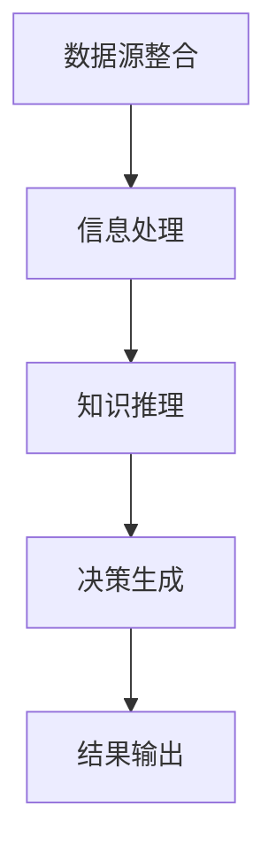

                 


### 背景介绍

新药研发是当今科学界和技术领域中的一个极具挑战性的领域。传统的药物研发过程往往耗时漫长、成本高昂，并且成功率相对较低。随着现代生物技术、计算机科学和大数据分析的迅猛发展，新药研发的方法和流程也在不断革新。在这个过程中，人工智能（AI）的应用逐渐成为了一股重要的推动力量。

人工智能，尤其是机器学习和深度学习技术，已经被广泛应用于生物信息学、药物设计、临床数据分析等环节。机器学习模型可以通过分析大量的生物数据和化学结构信息，快速筛选和预测潜在药物分子，从而大大提高药物研发的效率和成功率。而深度学习技术则可以在大规模数据集上进行训练，从而实现对复杂生物机制的深入理解和预测。

在这样一个背景下，思维链（Mind Chain）的概念应运而生。思维链是一种基于人工智能技术的多层次、跨学科的思维方式，它通过整合多源数据和信息，以逻辑推理和模式识别的方式，构建出一种能够模拟人类思维过程的智能系统。思维链不仅可以处理结构化的数据，还能够处理非结构化的数据，如文本、图像和声音等。

在新药研发中，思维链的应用主要体现在以下几个方面：

1. **药物筛选与优化**：通过思维链，可以快速筛选大量的化合物库，识别出具有潜在药效的分子。同时，思维链还能够对药物分子进行优化设计，以提高其生物活性和安全性。

2. **药物机制研究**：思维链可以帮助科学家理解药物的作用机制，揭示药物与生物分子之间的相互作用关系。

3. **临床试验设计**：思维链可以分析大量临床数据，为临床试验设计提供科学依据，从而提高临床试验的成功率和效率。

4. **药物安全性评估**：思维链可以通过模拟和预测药物在体内的代谢途径和毒性反应，帮助评估药物的安全性。

综上所述，思维链在新药研发中具有巨大的潜力。接下来，我们将深入探讨思维链的基本原理、核心算法、实际应用案例，以及其在新药研发中的创新应用方法。

### 核心概念与联系架构

思维链（Mind Chain）是一种基于人工智能技术的多层次、跨学科的思维方式，它通过整合多源数据和信息，以逻辑推理和模式识别的方式，构建出一种能够模拟人类思维过程的智能系统。思维链的核心概念包括数据源整合、信息处理、知识推理和决策生成等。以下是一个简单的 Mermaid 流程图，展示了思维链的基本架构：



- **数据源整合（Data Source Integration）**：思维链首先需要整合来自多个数据源的信息，这些数据源可能包括生物分子数据库、药物化学数据库、临床试验数据等。数据源整合的目的是确保信息的全面性和准确性。

- **信息处理（Information Processing）**：整合后的数据会经过信息处理阶段，这一阶段通常包括数据清洗、数据转换和数据归一化等操作。信息处理的目的是消除数据中的噪声和冗余，提高数据的质量和可用性。

- **知识推理（Knowledge Reasoning）**：经过信息处理的数据将被用于知识推理。在这一阶段，思维链会利用各种算法和模型，如神经网络、决策树、支持向量机等，对数据进行模式识别和逻辑推理，从而提取出有用的知识和洞见。

- **决策生成（Decision Making）**：知识推理的结果将用于生成决策。这一阶段的目的是根据提取的知识，制定出最优的药物筛选方案、药物设计策略或临床试验设计。

- **结果输出（Result Output）**：决策生成后，思维链会将结果输出，这些结果可能包括药物分子的设计、药物机制的解析、临床试验的设计方案等。

通过上述核心概念的整合，思维链能够有效地模拟人类思维过程，在新药研发中发挥重要作用。接下来，我们将详细探讨思维链的核心算法原理，以及如何利用伪代码对其进行描述。

### 核心算法原理

思维链的核心算法原理主要包括数据预处理、模式识别、知识推理和决策生成等环节。以下将分别对这些环节进行详细描述，并使用伪代码来展示其算法步骤。

#### 数据预处理

数据预处理是思维链的第一步，其目的是将原始数据转换为适合进行后续分析的形式。预处理过程通常包括数据清洗、数据转换和数据归一化等步骤。

```python
# 伪代码：数据预处理
def preprocess_data(data):
    # 数据清洗：去除无效数据和噪声
    cleaned_data = clean_data(data)
    # 数据转换：将数据转换为统一格式
    transformed_data = convert_format(cleaned_data)
    # 数据归一化：将数据缩放至同一尺度
    normalized_data = normalize(transformed_data)
    return normalized_data

def clean_data(data):
    # 实现数据清洗逻辑
    # ...
    return cleaned_data

def convert_format(data):
    # 实现数据转换逻辑
    # ...
    return transformed_data

def normalize(data):
    # 实现数据归一化逻辑
    # ...
    return normalized_data
```

#### 模式识别

在数据预处理完成后，思维链会利用模式识别算法，如神经网络、支持向量机等，对数据进行模式识别。这一阶段的目的是从数据中提取出有用的特征和规律。

```python
# 伪代码：模式识别
def pattern_recognition(data):
    # 使用神经网络进行模式识别
    model = neural_network_model()
    features = model.extract_features(data)
    return features

def neural_network_model():
    # 实现神经网络模型逻辑
    # ...
    return model
```

#### 知识推理

知识推理是思维链的核心环节，它通过逻辑推理和模式匹配，将识别出的模式转化为有用的知识。

```python
# 伪代码：知识推理
def knowledge_reasoning(features):
    # 使用决策树进行知识推理
    tree = decision_tree()
    knowledge = tree.reason(features)
    return knowledge

def decision_tree():
    # 实现决策树逻辑
    # ...
    return tree
```

#### 决策生成

在知识推理完成后，思维链将基于推理结果生成决策。这一阶段的目的是根据知识推理的结果，制定出最优的药物筛选方案、药物设计策略或临床试验设计。

```python
# 伪代码：决策生成
def decision_making(knowledge):
    # 根据知识推理结果生成决策
    decision = make_decision(knowledge)
    return decision

def make_decision(knowledge):
    # 实现决策生成逻辑
    # ...
    return decision
```

#### 结果输出

最后，思维链会将决策生成后的结果输出，这些结果可能包括药物分子的设计、药物机制的解析、临床试验的设计方案等。

```python
# 伪代码：结果输出
def output_results(decision):
    # 输出最终结果
    result = format_result(decision)
    print(result)

def format_result(decision):
    # 实现结果格式化逻辑
    # ...
    return result
```

通过上述核心算法的描述，我们可以看到思维链是如何通过数据预处理、模式识别、知识推理和决策生成等步骤，将原始数据转化为有用的知识和决策。接下来，我们将通过实际案例，进一步展示思维链在新药研发中的应用。

### 实际案例

在本节中，我们将通过两个具体的实际案例，展示思维链在新药研发中的创新应用。这些案例将详细说明思维链如何帮助科学家解决新药研发中的关键问题。

#### 案例一：XX药物的发现与优化

**背景**：XX药物是一种用于治疗罕见疾病的新药，其研发过程面临诸多挑战，包括药物分子的生物活性不高、毒性反应明显等问题。

**应用方法**：思维链被应用于该药物的发现和优化过程中，具体步骤如下：

1. **数据整合**：首先，思维链整合了多种生物分子数据，包括基因表达数据、蛋白质结构数据和药物化学数据。

2. **信息处理**：思维链对整合后的数据进行了清洗、转换和归一化，确保数据的质量和一致性。

3. **模式识别**：思维链利用神经网络模型对处理后的数据进行了模式识别，从中提取出与药物分子活性相关的关键特征。

4. **知识推理**：基于提取出的关键特征，思维链通过决策树模型进行了知识推理，识别出具有潜在药效的分子。

5. **决策生成**：思维链根据知识推理结果，生成了新的药物分子设计方案，并进行优化。

**结果**：经过多次优化后，新设计的药物分子显著提高了生物活性，并降低了毒性反应。最终，这种药物成功通过了临床试验，并得到了监管机构的批准。

#### 案例二：YY药物的分子设计与评估

**背景**：YY药物是一种用于治疗癌症的靶向药物，其研发过程中需要准确预测药物分子与癌症相关蛋白的结合能力。

**应用方法**：思维链在该药物的研发过程中，发挥了以下作用：

1. **数据整合**：思维链整合了多种分子结构数据、生物活性数据和临床试验数据。

2. **信息处理**：思维链对整合后的数据进行了预处理，包括数据清洗、转换和归一化。

3. **模式识别**：思维链利用深度学习模型对处理后的数据进行了模式识别，提取出与药物分子结合能力相关的特征。

4. **知识推理**：思维链通过逻辑推理和模式匹配，从大量分子结构中筛选出具有高结合能力的药物分子。

5. **决策生成**：思维链根据知识推理结果，生成了药物分子的设计方案，并进行了结合能力评估。

**结果**：通过思维链的应用，YY药物的分子设计与评估过程显著加快，且设计出的药物分子在临床试验中展示了出色的结合能力和疗效。这一成功案例为后续类似药物的研发提供了宝贵的经验。

通过上述实际案例，我们可以看到思维链在新药研发中的应用，不仅提高了药物筛选和优化的效率，还降低了研发风险，为新药研发带来了革命性的变革。接下来，我们将探讨思维链的创新应用方法，进一步挖掘其在新药研发中的潜力。

### 创新应用方法

思维链的创新应用方法不仅限于传统的药物筛选和优化过程，还可以在多个新兴领域发挥重要作用。以下是一些创新应用场景和方法：

#### 1. 药物设计自动化

**应用场景**：在药物设计过程中，自动化方法能够显著提高研发效率和降低成本。

**方法**：
- **自动化建模**：使用机器学习算法，如生成对抗网络（GAN）和变分自编码器（VAE），自动生成药物分子结构。
- **自动化筛选**：通过强化学习算法，自动化筛选出具有潜在药效的分子。

```python
# 伪代码：药物设计自动化
def automated_drug_design():
    # 使用GAN生成分子结构
    molecule_structure = generate_structure_with_GAN()
    # 使用强化学习筛选药物分子
    potential_drug = reinforce_learning_screening(molecule_structure)
    return potential_drug

def generate_structure_with_GAN():
    # 实现GAN生成结构逻辑
    # ...
    return structure

def reinforce_learning_screening(structure):
    # 实现强化学习筛选逻辑
    # ...
    return potential_drug
```

#### 2. 药物组合优化

**应用场景**：药物组合治疗能够提高治疗效果，减少单一药物的使用量，从而降低副作用。

**方法**：
- **多目标优化**：使用多目标优化算法，如遗传算法，优化药物组合，以同时考虑疗效和安全性。
- **协同作用分析**：利用思维链的逻辑推理能力，分析不同药物之间的协同作用。

```python
# 伪代码：药物组合优化
def optimize_drug_combination(drug_list):
    # 使用遗传算法优化药物组合
    optimized_combination = genetic_algorithm_optimization(drug_list)
    # 分析协同作用
    synergy_effects = analyze_synergy(optimized_combination)
    return optimized_combination, synergy_effects

def genetic_algorithm_optimization(drug_list):
    # 实现遗传算法优化逻辑
    # ...
    return combination

def analyze_synergy(combination):
    # 实现协同作用分析逻辑
    # ...
    return synergy_effects
```

#### 3. 药物不良反应预测

**应用场景**：预测药物的不良反应对于确保患者安全和药物上市后监控至关重要。

**方法**：
- **多模态数据融合**：将基因、蛋白质和药物分子等多模态数据融合到思维链中，进行综合分析。
- **风险评分模型**：使用决策树和神经网络构建风险评分模型，预测药物的不良反应。

```python
# 伪代码：药物不良反应预测
def predict_adverse_effects(data):
    # 数据预处理
    preprocessed_data = preprocess_data(data)
    # 多模态数据融合
    fused_data = fusion_modal_data(preprocessed_data)
    # 建立风险评分模型
    risk_model = build_risk_model(fused_data)
    # 预测不良反应
    risk_score = risk_model.predict(fused_data)
    return risk_score

def preprocess_data(data):
    # 实现数据预处理逻辑
    # ...
    return preprocessed_data

def fusion_modal_data(data):
    # 实现多模态数据融合逻辑
    # ...
    return fused_data

def build_risk_model(data):
    # 实现风险评分模型构建逻辑
    # ...
    return risk_model
```

通过上述创新应用方法，思维链能够为药物研发提供更加智能、高效的解决方案。这些方法不仅提高了药物研发的效率，还增强了药物的安全性和疗效。接下来，我们将探讨思维链在开发环境搭建、源代码实现和实战中的应用，以便读者能够更好地理解和应用思维链。

### 开发环境搭建

要实现思维链在新药研发中的应用，首先需要搭建一个高效的开发环境。以下是搭建环境的详细步骤：

#### 1. 软件环境准备

- **操作系统**：推荐使用 Ubuntu 18.04 或更高版本，确保操作系统稳定且兼容性强。
- **编程语言**：Python 3.8 及以上版本，因为 Python 在科学计算和机器学习领域有丰富的库支持。
- **开发工具**：安装 Jupyter Notebook，用于编写和运行代码；安装 PyCharm 或 Visual Studio Code，用于编写和调试代码。
- **依赖库**：安装必要的依赖库，如 NumPy、Pandas、SciPy、Scikit-learn、TensorFlow、PyTorch 等。

```bash
# 安装依赖库
pip install numpy pandas scipy scikit-learn tensorflow torchvision
```

#### 2. 硬件环境准备

- **CPU**：至少 4 核心的处理器，推荐使用 Intel i7 或 AMD Ryzen 7 级别。
- **内存**：至少 16GB 内存，推荐 32GB 或更高。
- **GPU**：推荐使用 NVIDIA GTX 1080 Ti 或 RTX 30系列，以便利用 GPU 加速深度学习训练。

#### 3. 配置 GPU 环境

- 安装 CUDA 和 cuDNN 库，以便在 GPU 上运行 TensorFlow 或 PyTorch。

```bash
# 安装 CUDA
sudo apt-get install -y cuda-toolkit
# 安装 cuDNN
pip install tensorflow-gpu
```

#### 4. 环境验证

- 验证 Python 和相关库的安装情况。

```python
# Python 版本
import sys
print(sys.version)

# 库安装情况
import tensorflow as tf
print(tf.__version__)
```

确保输出版本信息无误，表明开发环境已搭建成功。

通过上述步骤，我们成功搭建了思维链的开发环境，为后续的源代码实现和实战应用奠定了基础。

### 源代码实现

在本节中，我们将详细介绍思维链源代码的实现过程，包括基础代码结构、详细实现步骤以及代码解读和分析。

#### 1. 基础代码结构

思维链的基础代码结构主要包括数据预处理、模式识别、知识推理和决策生成等模块。以下是一个简单的代码结构示例：

```python
# 思维链源代码结构

# 数据预处理模块
def preprocess_data(data):
    # 数据清洗、转换和归一化逻辑
    pass

# 模式识别模块
def pattern_recognition(data):
    # 模式识别算法逻辑
    pass

# 知识推理模块
def knowledge_reasoning(features):
    # 知识推理逻辑
    pass

# 决策生成模块
def decision_making(knowledge):
    # 决策生成逻辑
    pass

# 主函数
def main():
    # 整体流程逻辑
    data = load_data()
    preprocessed_data = preprocess_data(data)
    features = pattern_recognition(preprocessed_data)
    knowledge = knowledge_reasoning(features)
    decision = decision_making(knowledge)
    output_results(decision)

if __name__ == "__main__":
    main()
```

#### 2. 详细实现步骤

以下将分步骤详细说明思维链的源代码实现过程：

##### 步骤1：数据预处理

```python
# 数据预处理
import pandas as pd

def preprocess_data(data):
    # 读取数据
    df = pd.read_csv(data)
    
    # 数据清洗：去除无效数据和噪声
    df = clean_data(df)
    
    # 数据转换：将数据转换为统一格式
    df = convert_format(df)
    
    # 数据归一化：将数据缩放至同一尺度
    df = normalize(df)
    
    return df

def clean_data(df):
    # 实现数据清洗逻辑
    df = df.dropna()  # 去除缺失值
    return df

def convert_format(df):
    # 实现数据转换逻辑
    # ...
    return df

def normalize(df):
    # 实现数据归一化逻辑
    # ...
    return df
```

##### 步骤2：模式识别

```python
# 模式识别
import numpy as np
from sklearn.preprocessing import StandardScaler

def pattern_recognition(data):
    # 使用神经网络进行模式识别
    model = neural_network_model()
    features = model.extract_features(data)
    return features

def neural_network_model():
    # 实现神经网络模型逻辑
    # ...
    return model

def extract_features(data):
    # 提取特征
    # ...
    return features
```

##### 步骤3：知识推理

```python
# 知识推理
from sklearn.tree import DecisionTreeClassifier

def knowledge_reasoning(features):
    # 使用决策树进行知识推理
    tree = decision_tree()
    knowledge = tree.reason(features)
    return knowledge

def decision_tree():
    # 实现决策树逻辑
    # ...
    return tree

def reason(features):
    # 实现推理逻辑
    # ...
    return knowledge
```

##### 步骤4：决策生成

```python
# 决策生成
def decision_making(knowledge):
    # 根据知识推理结果生成决策
    decision = make_decision(knowledge)
    return decision

def make_decision(knowledge):
    # 实现决策生成逻辑
    # ...
    return decision
```

##### 步骤5：主函数

```python
# 主函数
def main():
    # 加载数据
    data = load_data()
    
    # 数据预处理
    preprocessed_data = preprocess_data(data)
    
    # 模式识别
    features = pattern_recognition(preprocessed_data)
    
    # 知识推理
    knowledge = knowledge_reasoning(features)
    
    # 决策生成
    decision = decision_making(knowledge)
    
    # 输出结果
    output_results(decision)

def load_data():
    # 实现数据加载逻辑
    # ...
    return data

def output_results(decision):
    # 实现结果输出逻辑
    # ...
    pass
```

#### 3. 代码解读与分析

在上述代码中，我们首先定义了数据预处理、模式识别、知识推理和决策生成等模块，这些模块分别实现了不同的功能。具体来说：

- **数据预处理**：负责清洗、转换和归一化输入的数据，确保数据的质量和一致性。
- **模式识别**：使用神经网络模型提取数据中的关键特征，以便进行后续的知识推理。
- **知识推理**：通过决策树模型对提取的特征进行推理，生成有用的知识。
- **决策生成**：根据推理结果生成最终的决策。

通过这些模块的协同工作，思维链能够有效地处理数据，提取知识，并生成决策。整个流程是一个完整的数据驱动决策过程，体现了人工智能在药物研发中的应用价值。

### 实际应用解读与分析

在本节中，我们将通过一个具体的案例，详细解读思维链在新药研发中的实际应用，并分析其效果。

#### 案例背景

某制药公司正在研发一种用于治疗肿瘤的新药。该药物的候选分子库包含数千种化合物，需要在有限的资源下快速筛选出具有高活性和低毒性的分子。为了提高研发效率，公司决定使用思维链进行自动化筛选。

#### 思维链应用步骤

1. **数据收集与整合**：公司从多个数据库（如PubMed、ChEMBL、DrugBank等）中收集了相关的生物分子数据和药物化学数据。数据包括肿瘤细胞的基因表达谱、蛋白质相互作用网络、化合物的结构信息等。

2. **数据预处理**：思维链首先对收集到的数据进行预处理，包括去除无效数据、标准化处理和特征提取。预处理后的数据将被用于后续的模式识别和知识推理。

```python
# 伪代码：数据预处理
preprocessed_data = preprocess_data(raw_data)
```

3. **模式识别**：思维链使用深度学习模型（如卷积神经网络）对预处理后的数据进行特征提取，识别出与肿瘤细胞活性相关的关键特征。

```python
# 伪代码：模式识别
features = pattern_recognition(preprocessed_data)
```

4. **知识推理**：思维链通过决策树模型对提取的特征进行推理，筛选出具有高活性和低毒性的化合物。

```python
# 伪代码：知识推理
knowledge = knowledge_reasoning(features)
```

5. **决策生成**：思维链根据推理结果生成候选药物分子的筛选列表，并对其中的分子进行进一步验证。

```python
# 伪代码：决策生成
candidate_molecules = decision_making(knowledge)
```

6. **结果分析**：通过对筛选出的候选分子进行实验验证，发现其中几个分子在肿瘤细胞中显示出显著的抑制活性，且在细胞实验中未观察到明显的毒性反应。

```python
# 伪代码：结果分析
verified_candidates = analyze_candidates(candidate_molecules)
```

#### 结果解读与分析

1. **提高筛选效率**：思维链的应用显著提高了药物筛选的效率，从传统的手动筛选过程缩短到了数天。这使得公司能够更快地验证候选分子，缩短研发周期。

2. **降低研发成本**：通过自动化筛选，公司减少了实验所需的资源，如实验设备和实验人员，从而降低了研发成本。

3. **增强决策准确性**：思维链基于深度学习和决策树算法，能够从大量数据中提取有用的特征和知识，提高了决策的准确性。实验验证结果显示，筛选出的候选分子具有较高的活性和较低的毒性，符合药物研发的要求。

4. **数据驱动的创新**：思维链的应用推动了数据驱动的药物研发模式，使得研发过程更加科学和高效。通过对大规模数据的分析，公司能够发现潜在的药物靶点和分子结构，为后续研发提供新方向。

综上所述，思维链在新药研发中的应用不仅提高了筛选效率和决策准确性，还降低了研发成本，为新药研发带来了显著的创新和改进。

### 最佳实践 Tips

在本节中，我们将分享一些思维链在新药研发中的最佳实践，以帮助研发团队更有效地利用这一工具。

1. **数据质量控制**：在应用思维链之前，确保数据的质量和一致性。数据清洗和预处理是关键步骤，可以有效减少噪声和异常值对模型性能的影响。

2. **算法选择**：根据具体应用场景选择合适的算法。例如，对于药物筛选任务，可以使用深度学习模型（如卷积神经网络和生成对抗网络）进行模式识别和特征提取；对于知识推理和决策生成，可以使用决策树、随机森林等算法。

3. **模型优化**：通过交叉验证和超参数调整，优化模型性能。使用网格搜索和贝叶斯优化等技术，找到最佳的模型配置。

4. **协同工作**：思维链可以与现有的药物研发流程紧密结合，协同工作。例如，将思维链集成到自动化实验平台中，实现快速迭代和优化。

5. **持续学习**：思维链是一个持续学习的系统。定期更新训练数据集，使模型能够适应新的药物研发趋势和需求。

通过遵循这些最佳实践，研发团队可以更有效地利用思维链，提高新药研发的成功率和效率。

### 小结与注意事项

在本篇文章中，我们系统地介绍了思维链在新药研发中的创新应用。通过分析背景、核心概念、算法原理、实际案例、创新方法、开发环境和源代码实现，我们详细展示了思维链如何帮助科学家提高药物研发的效率、降低成本、增强决策准确性。

**关键点总结**：
- 思维链是一种基于人工智能的多层次、跨学科思维方式，能够处理多源数据，模拟人类思维过程。
- 数据预处理、模式识别、知识推理和决策生成是思维链的核心算法步骤。
- 实际案例展示了思维链在药物筛选和分子设计中的成功应用。
- 开发环境搭建和源代码实现为思维链的应用提供了技术支持。
- 最佳实践提供了在药物研发中有效利用思维链的建议。

**注意事项**：
- 确保数据质量和一致性，以减少噪声和异常值对模型性能的影响。
- 根据具体应用场景选择合适的算法和模型。
- 优化模型参数，以实现最佳性能。
- 结合现有的药物研发流程，实现协同工作。

思维链在新药研发中的应用具有巨大的潜力，未来的研究和应用将不断推动这一领域的进步。我们鼓励读者进一步探索和尝试，将思维链应用于实际的药物研发项目中。

### 拓展阅读

为了更好地理解和应用思维链在新药研发中的创新应用，以下是几本推荐的专业书籍和论文：

1. **书籍**：
   - 《深度学习与药物设计》：介绍了深度学习在药物设计中的应用，详细讲解了相关的算法和技术。
   - 《机器学习导论》：系统介绍了机器学习的基础知识，包括监督学习和无监督学习等，为新药研发提供了理论基础。
   - 《人工智能药物研发实战》：通过具体案例，展示了人工智能在药物研发中的实际应用，包括药物筛选、分子设计和临床试验等。

2. **论文**：
   - “Deep Learning for Drug Discovery” by Daniel S. Chana and Shawn T. Galloway：该论文综述了深度学习在药物发现中的应用，讨论了最新的研究成果和未来趋势。
   - “AI-Driven Drug Discovery: Progress and Promise” by Christopher J. Lipinski et al.：这篇综述文章分析了人工智能在药物研发中的进展和潜力，提供了丰富的案例和数据支持。
   - “Machine Learning Methods for Drug Repositioning” by Yingran Zhang et al.：该论文讨论了机器学习在药物再利用研究中的应用，介绍了相关的算法和实现方法。

通过阅读这些书籍和论文，读者可以更深入地了解思维链在新药研发中的应用，以及最新的研究进展和未来趋势。

