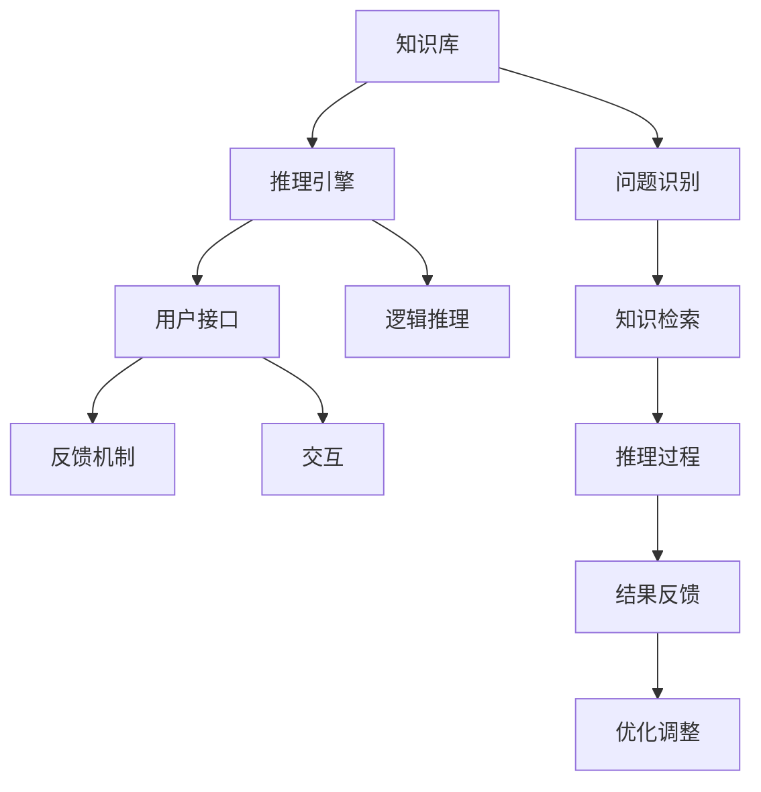
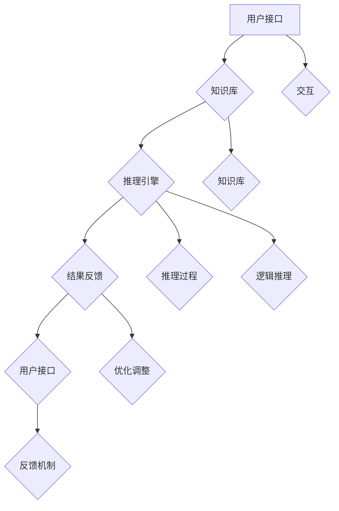

                 

## 文章标题：思维链在智能制造中的应用

### 关键词：思维链，智能制造，应用分析，算法原理，案例分析

#### 摘要：

本文深入探讨了思维链在智能制造中的应用。首先，我们介绍了思维链的基本概念和核心要素，并与人类思维过程进行了比较。接着，我们详细分析了思维链在产品设计、制造过程控制和智能质量管理系统中的应用，包括具体案例和算法原理。通过本文的阅读，读者可以全面了解思维链在智能制造中的重要作用和未来发展趋势。

## 第一部分：引论

### 1.1 思维链与智能制造

#### 1.1.1 思维链的基本概念

思维链是一种基于人工智能和认知科学的理论框架，用于模拟人类思维过程，通过逐步推理和分析来解决问题。它包括几个核心要素：知识库、推理引擎、用户接口和反馈机制。知识库存储各种信息和知识，推理引擎负责根据这些信息进行推理和决策，用户接口允许用户与系统进行交互，而反馈机制用于不断调整和优化系统性能。

#### 1.1.2 智能制造的定义与演进

智能制造是一种基于数字化、网络化和智能化的制造模式，旨在提高生产效率、降低成本和提升产品质量。智能制造经历了从自动化、信息化到智能化的演进过程。自动化阶段主要依赖机械设备和控制系统，信息化阶段引入了计算机技术和互联网，而智能化阶段则结合了人工智能和大数据技术，实现了更高级的自动化和智能化制造。

#### 1.1.3 思维链与智能制造的联系

思维链在智能制造中扮演着关键角色。首先，思维链可以帮助企业快速识别和解决生产过程中的问题，提高生产效率和产品质量。其次，思维链可以优化产品设计过程，通过模拟和优化设计方案来降低成本和提升性能。此外，思维链还可以用于智能质量管理和智能供应链管理，帮助企业实现更高效、更精准的管理。

#### 1.1.4 本书结构安排

本书分为五个部分，第一部分引论介绍了思维链和智能制造的基本概念和联系；第二部分阐述了思维链的理论基础，包括基本框架、运行机制和应用领域；第三部分探讨了思维链在产品设计中的应用，包括设计流程、实际案例和挑战与机遇；第四部分分析了思维链在制造过程控制中的应用，包括数据采集、过程分析和挑战与机遇；第五部分介绍了思维链在智能质量管理系统和智能供应链管理中的应用，包括系统功能、实际案例和挑战与机遇。

#### 1.1.5 结论与展望

思维链在智能制造中的应用前景广阔，不仅可以提高生产效率和产品质量，还可以优化设计和供应链管理。未来，思维链技术将继续发展与完善，为智能制造提供更强大的支持。同时，我们也需要关注思维链在应用过程中可能遇到的挑战，如数据隐私、安全性和可靠性等问题。

## 第一部分总结

在本部分，我们介绍了思维链的基本概念和核心要素，阐述了智能制造的定义与演进，以及思维链在智能制造中的角色和影响。通过对思维链与智能制造的深入分析，我们为后续章节的内容奠定了基础。

### 1.2 对后续章节的预期

在后续章节中，我们将进一步探讨思维链在智能制造中的应用，从产品设计、制造过程控制到智能质量管理和智能供应链管理，每个部分都将详细介绍思维链的应用场景、实际案例和面临的挑战与机遇。通过这些探讨，我们将全面了解思维链在智能制造中的广泛应用和巨大潜力。

### 1.2.1 本部分主要内容回顾

在本部分，我们首先介绍了思维链的基本概念和核心要素，包括知识库、推理引擎、用户接口和反馈机制。接着，我们阐述了智能制造的定义与演进，从自动化、信息化到智能化，展示了智能制造的发展历程。然后，我们深入分析了思维链在智能制造中的角色和影响，探讨了其在产品设计、制造过程控制和智能质量管理系统中的应用。最后，我们介绍了本书的结构安排，并对后续章节的内容进行了预期。

### 1.2.2 对后续章节的预期

在后续章节中，我们将进一步探讨思维链在智能制造中的应用。首先，我们将详细介绍思维链的理论基础，包括基本框架、运行机制和应用领域。然后，我们将分别讨论思维链在产品设计、制造过程控制和智能质量管理系统中的应用，包括具体案例和算法原理。最后，我们将探讨思维链在智能供应链管理中的应用，分析其在库存管理和供应链优化中的作用。通过这些探讨，我们将全面了解思维链在智能制造中的广泛应用和巨大潜力。

### 1.2.3 对读者的建议

为了更好地理解和掌握本文的内容，我们建议读者在阅读过程中注重以下几点：

1. 理解思维链的基本概念和核心要素，为后续章节的学习打下基础。
2. 关注智能制造的定义与演进，了解智能制造的发展历程和趋势。
3. 深入探讨思维链在智能制造中的应用，关注其在产品设计、制造过程控制和智能质量管理系统中的应用场景和实际案例。
4. 思考思维链在智能制造中可能面临的挑战和机遇，为未来研究提供方向。

通过以上建议，读者可以更好地理解和应用本文的内容，为智能制造领域的发展贡献力量。

## 第二部分：思维链理论基础

### 2.1 思维链理论基础概述

思维链是一种基于人工智能和认知科学的理论框架，用于模拟人类思维过程，通过逐步推理和分析来解决问题。它包括几个核心要素：知识库、推理引擎、用户接口和反馈机制。

#### 2.1.1 思维链的基本框架

思维链的基本框架可以分为四个主要组成部分：

1. **知识库**：存储各种信息和知识，包括事实、规则、模板等。
2. **推理引擎**：根据知识库中的信息和规则，进行推理和决策，以解决问题或生成新的知识。
3. **用户接口**：允许用户与系统进行交互，输入问题和反馈，获取系统生成的结果。
4. **反馈机制**：用于不断调整和优化系统性能，通过反馈来修正和改进推理过程。

#### 2.1.2 思维链的运行机制

思维链的运行机制主要包括以下几个步骤：

1. **问题识别**：通过用户接口接收用户的问题或任务。
2. **知识检索**：从知识库中检索相关的信息和规则。
3. **推理过程**：根据检索到的信息和规则，进行推理和决策，生成解决方案或新知识。
4. **结果反馈**：将推理结果通过用户接口反馈给用户，并收集用户的反馈信息。
5. **优化调整**：根据反馈信息，对知识库和推理过程进行优化和调整。

#### 2.1.3 思维链与人类思维过程的比较

思维链与人类思维过程有相似之处，也存在一些区别：

1. **相似之处**：
   - **信息处理**：思维链和人类思维过程都涉及对信息的处理和整合。
   - **逻辑推理**：思维链和人类思维过程都通过逻辑推理来解决问题。
   - **自适应调整**：思维链和人类思维过程都能根据反馈进行优化和调整。

2. **区别之处**：
   - **速度**：人类思维过程通常较慢，而思维链可以快速处理大量信息。
   - **精确性**：人类思维过程可能受到情绪、经验等因素的影响，而思维链相对更加客观和精确。
   - **知识库**：人类思维过程的知识库主要是通过经验积累和知识传承，而思维链的知识库则是通过数据输入和规则定义。

#### 2.1.4 思维链的数学模型

思维链的数学模型可以用来描述其运行机制和推理过程。以下是一个简化的数学模型：

1. **知识库表示**：
   $$ KB = \{F_1, F_2, ..., F_n\} $$
   其中，$F_i$ 表示知识库中的第 $i$ 个事实或规则。

2. **推理引擎**：
   $$ RE = \{R_1, R_2, ..., R_m\} $$
   其中，$R_i$ 表示推理引擎中的第 $i$ 个规则，用于推理和决策。

3. **推理过程**：
   $$ \text{Inference} = KB \cup \text{User Input} \rightarrow \text{Result} $$
   其中，$\text{User Input}$ 表示用户输入的问题或任务，$\text{Result}$ 表示推理结果。

4. **反馈机制**：
   $$ \text{Feedback} = \text{Result} \cup \text{User Feedback} \rightarrow \text{Optimization} $$
   其中，$\text{User Feedback}$ 表示用户的反馈信息，$\text{Optimization}$ 表示对知识库和推理引擎的优化调整。

#### 2.1.5 思维链的理论框架图

以下是一个用Mermaid绘制的思维链理论框架图：

通过以上理论框架的介绍，我们可以更好地理解思维链的工作原理和基本概念，为后续章节的思维链在智能制造中的应用分析打下基础。

### 2.2 思维链的理论基础与应用领域

#### 2.2.1 思维链理论的基本框架

思维链理论的基本框架主要包括知识库、推理引擎、用户接口和反馈机制。这些组件相互作用，共同实现思维链的运行机制。以下是对每个组件的详细解释：

1. **知识库（Knowledge Base）**：
   知识库是思维链系统的核心组件，它存储了大量的信息、事实、规则和模板。这些知识可以是结构化的（如数据库中的数据表）或非结构化的（如文本、图像、音频等）。知识库的结构和内容直接影响思维链的推理能力和解决问题的范围。

2. **推理引擎（Inference Engine）**：
   推理引擎负责根据知识库中的信息和规则进行逻辑推理。它使用各种推理算法（如演绎推理、归纳推理、类比推理等）来分析和解决问题。推理引擎的效率和质量取决于其算法设计和知识库的丰富程度。

3. **用户接口（User Interface）**：
   用户接口是思维链系统与用户之间的交互桥梁。它允许用户输入问题、查询信息、提交反馈，并接收系统生成的结果。用户接口的设计需要考虑到用户体验，确保用户能够轻松、高效地与系统交互。

4. **反馈机制（Feedback Mechanism）**：
   反馈机制用于收集用户对系统结果的反馈，并将其用于系统的优化和调整。通过不断的反馈和优化，思维链系统能够提高其推理精度和效率。反馈机制可以包括用户评分、错误纠正、自动调整规则等。

#### 2.2.2 思维链的运行机制

思维链的运行机制可以分为以下几个步骤：

1. **问题识别**：
   用户通过用户接口提交问题或任务，问题可以被表达为自然语言、符号语言或数据格式。

2. **知识检索**：
   推理引擎根据用户提交的问题，从知识库中检索相关的信息和规则。知识库的结构和内容将影响检索的效率和准确性。

3. **推理过程**：
   推理引擎使用检索到的信息和规则，通过逻辑推理来分析和解决问题。这一过程可能涉及多个层次和步骤，包括数据清洗、特征提取、模式匹配和决策生成。

4. **结果反馈**：
   推理结果通过用户接口反馈给用户，用户可以评估结果的准确性、有效性，并提供进一步的反馈。

5. **优化调整**：
   根据用户的反馈，系统对知识库和推理规则进行优化和调整，以提高后续推理的质量和效率。

#### 2.2.3 思维链的应用领域

思维链理论的应用领域非常广泛，涵盖了许多不同的行业和场景。以下是几个典型的应用领域：

1. **智能制造**：
   在智能制造中，思维链可以用于产品设计、制造过程控制和质量管理。通过模拟和优化设计方案，提高产品质量和降低成本。思维链还可以用于实时监测生产过程，识别潜在问题，并提供解决方案。

2. **医疗诊断**：
   在医疗领域，思维链可以用于疾病诊断和治疗建议。通过分析患者的病历、基因数据、症状等信息，思维链可以提供个性化的诊断建议，帮助医生做出更准确的决策。

3. **金融服务**：
   在金融领域，思维链可以用于风险评估、投资组合优化和客户服务。通过分析大量的市场数据和历史交易记录，思维链可以为投资者提供实时、个性化的投资建议，提高投资收益。

4. **智能交通**：
   在智能交通系统中，思维链可以用于交通流量管理、路线规划和事故预测。通过分析交通数据和历史模式，思维链可以提供最优的路线选择和交通管理策略，减少拥堵和事故风险。

5. **教育**：
   在教育领域，思维链可以用于个性化教学和学习分析。通过分析学生的学习行为和成绩数据，思维链可以提供个性化的学习计划和资源推荐，帮助学生更好地掌握知识。

#### 2.2.4 思维链的理论框架图

以下是一个用Mermaid绘制的思维链理论框架图：

通过上述理论框架和应用领域的介绍，我们可以更好地理解思维链的运作原理和应用价值。在接下来的章节中，我们将深入探讨思维链在智能制造中的具体应用，包括产品设计、制造过程控制和智能质量管理系统。

### 2.3 思维链理论在制造业的应用

思维链理论在制造业中的应用具有显著的潜力和实际价值。通过将思维链技术集成到制造过程中，企业可以实现更高水平的自动化、智能化和优化，从而提高生产效率、降低成本和提升产品质量。以下将详细介绍思维链在制造业中的应用场景、优势与挑战。

#### 2.3.1 应用场景

1. **产品设计**：
   思维链可以在产品设计的初期阶段发挥重要作用。通过模拟和优化设计方案，企业可以快速评估不同设计方案的优劣，选择最优方案。此外，思维链可以帮助设计师在产品设计过程中识别潜在的问题和改进点，从而提高产品的可靠性、性能和用户满意度。

2. **制造过程控制**：
   思维链可以实时监测和控制系统中的各种参数，如温度、压力、速度等。通过分析这些数据，思维链可以及时发现并纠正制造过程中的异常情况，防止生产故障和次品产生。同时，思维链还可以优化制造参数，提高生产效率和产品质量。

3. **质量管理**：
   思维链可以用于质量监控和问题诊断。通过对生产过程中产生的质量数据进行实时分析，思维链可以识别出潜在的质量问题，并提供改进建议。此外，思维链还可以帮助企业制定和优化质量标准，确保产品的一致性和可靠性。

4. **供应链管理**：
   思维链可以优化供应链中的库存管理、物流配送和生产计划等环节。通过分析供应链数据，思维链可以预测需求、优化库存水平和减少物流成本，从而提高供应链的整体效率和响应速度。

#### 2.3.2 优势

1. **高效性**：
   思维链能够快速处理和分析大量数据，为制造过程中的各种决策提供实时支持。与传统的人工决策相比，思维链可以显著提高决策速度和准确性。

2. **智能优化**：
   思维链可以利用先进的推理和优化算法，对制造过程进行智能优化。通过不断学习和调整，思维链可以不断提高制造过程的效率和产品质量。

3. **适应性**：
   思维链可以适应不同的制造环境和需求，为各种类型的企业提供定制化的解决方案。无论是大规模生产还是定制化生产，思维链都可以发挥其优势。

4. **成本效益**：
   通过提高生产效率和降低成本，思维链可以帮助企业实现显著的经济效益。同时，思维链还可以减少次品率和返工率，降低质量成本。

#### 2.3.3 挑战

1. **数据质量**：
   思维链的运行依赖于高质量的数据。如果数据存在噪声、缺失或不一致，将严重影响思维链的推理结果。因此，企业需要确保数据的质量和完整性。

2. **算法选择**：
   思维链的算法选择对其性能和效果至关重要。不同的制造场景可能需要不同的算法和策略，企业需要根据具体情况进行选择和优化。

3. **系统集成**：
   思维链需要与其他制造系统和设备集成，如ERP、MES、PLC等。系统集成过程中可能面临兼容性、稳定性和安全性等问题。

4. **人才需求**：
   思维链技术的应用需要专业的技术人员，包括数据科学家、机器学习工程师、软件工程师等。企业需要招聘和培养这些人才，以充分发挥思维链的优势。

#### 2.3.4 实际案例

以下是一个实际案例，展示了思维链在制造业中的应用：

**案例：某汽车制造公司的生产过程优化**

某汽车制造公司通过引入思维链技术，对其生产过程进行优化。思维链系统实时监测生产线上的各种参数，如机床的运行状态、工件的温度和位置等。当发现异常情况时，思维链系统会立即进行预警，并提出相应的调整建议。通过这些措施，该公司成功降低了生产故障率和次品率，提高了生产效率和产品质量。

**分析与效果**：
1. **数据质量**：该公司通过安装高精度的传感器和采用先进的测量技术，确保了数据的质量和准确性。
2. **算法选择**：思维链系统采用了多种机器学习和优化算法，如决策树、支持向量机和遗传算法等，以适应不同的优化需求。
3. **系统集成**：该公司采用了标准化的接口和协议，确保思维链系统与现有制造系统的无缝集成。
4. **人才需求**：该公司组建了一个专业的技术团队，负责思维链系统的开发和运维。

通过以上措施，该公司成功实现了生产过程的智能化优化，提高了生产效率和产品质量，降低了运营成本。

### 2.4 思维链理论在制造业中的挑战与机遇

尽管思维链理论在制造业中展现出巨大的潜力，但其实际应用仍面临一系列挑战。以下将探讨这些挑战，并分析对应的解决方案和未来机遇。

#### 2.4.1 数据质量和准确性

思维链的运行依赖于高质量的数据。然而，制造过程中的数据通常具有噪声、缺失和不一致性等问题，这可能导致思维链的推理结果不准确。解决方案包括：

1. **数据预处理**：在数据输入阶段进行数据清洗、去噪和标准化处理，提高数据质量。
2. **数据集成**：采用数据集成技术，将不同来源和格式的数据整合到一个统一的平台上，确保数据的一致性和完整性。
3. **数据可视化**：通过数据可视化工具，实时监控数据质量，及时发现和解决问题。

#### 2.4.2 算法选择和优化

不同的制造场景可能需要不同的算法和策略，企业需要根据具体情况进行选择和优化。挑战包括：

1. **算法复杂性**：制造过程中的问题通常非常复杂，需要选择和优化多种算法和策略。
2. **算法适应性**：制造场景的变化可能导致现有算法的适应性不足，需要不断调整和优化。

解决方案包括：

1. **算法库建设**：建立涵盖多种算法的算法库，为不同制造场景提供合适的算法选择。
2. **算法优化**：采用机器学习和深度学习等技术，对现有算法进行优化，提高其适应性和鲁棒性。
3. **算法验证**：通过实际应用和仿真测试，验证算法的效果和性能，确保其适用于制造场景。

#### 2.4.3 系统集成与兼容性

思维链需要与其他制造系统和设备集成，如ERP、MES、PLC等。集成过程中可能面临兼容性、稳定性和安全性等问题。解决方案包括：

1. **标准化接口和协议**：采用标准化的接口和协议，确保不同系统之间的无缝集成。
2. **集成测试**：在系统集成过程中进行全面的测试，确保系统的稳定性和兼容性。
3. **安全防护**：采用安全防护措施，如数据加密、访问控制等，确保系统的安全性。

#### 2.4.4 人才需求与培养

思维链技术的应用需要专业的技术人员，包括数据科学家、机器学习工程师、软件工程师等。企业需要招聘和培养这些人才，以充分发挥思维链的优势。挑战包括：

1. **人才稀缺**：专业人才相对稀缺，企业可能面临招聘难题。
2. **技术更新**：随着技术的快速发展，现有人才的知识和技能可能跟不上技术的更新。

解决方案包括：

1. **人才培养**：建立内部培训和人才发展计划，提高现有员工的技术能力和专业素养。
2. **校企合作**：与高校和研究机构合作，共同培养和输送专业人才。
3. **技术更新**：定期组织技术培训和研讨会，跟踪最新的技术趋势和应用案例，确保人才的知识和技能保持领先。

#### 2.4.5 未来机遇

随着技术的不断进步，思维链在制造业中的应用将迎来新的机遇。以下是一些潜在的机遇：

1. **智能制造**：随着智能制造的普及，思维链技术将在产品设计、制造过程控制、质量管理和供应链管理等领域发挥更大作用。
2. **工业互联网**：工业互联网的兴起将促进制造数据的互联互通，为思维链提供更多的应用场景和机会。
3. **人工智能**：人工智能技术的不断进步将为思维链提供更强大的推理和分析能力，推动制造智能化水平的提升。
4. **个性化定制**：个性化定制将越来越受到制造业的关注，思维链技术将在满足个性化需求、优化设计和生产过程中发挥重要作用。

通过应对挑战和抓住机遇，思维链将在制造业中发挥更大的作用，推动制造业向智能化、高效化和定制化方向发展。

### 第二部分总结

在本部分，我们详细介绍了思维链的理论基础，包括基本框架、运行机制和应用领域。我们探讨了思维链与人类思维过程的相似和区别，并分析了其在制造业中的应用场景、优势和挑战。通过这些分析，我们为后续章节的思维链在智能制造中的应用提供了理论基础。

### 2.5 对后续章节的预期

在接下来的章节中，我们将深入探讨思维链在智能制造中的具体应用。首先，我们将分析思维链在产品设计中的应用，包括设计流程、实际案例和面临的挑战。接着，我们将探讨思维链在制造过程控制中的应用，包括数据采集、过程分析和实际案例。随后，我们将讨论思维链在智能质量管理系统中的应用，介绍系统功能、实际案例和挑战。最后，我们将分析思维链在智能供应链管理中的应用，包括系统架构、库存管理和供应链优化。通过这些探讨，我们将全面了解思维链在智能制造中的广泛应用和巨大潜力。

## 第三部分：思维链在产品设计中的应用

### 3.1 思维链在产品设计中的应用

#### 3.1.1 设计流程中的思维链应用

在产品设计中，思维链可以极大地提高设计的效率和优化设计的质量。设计流程通常包括需求分析、方案设计、原型制作和测试迭代等步骤。思维链在每一个步骤中都可以发挥重要作用。

1. **需求分析**：
   思维链可以帮助设计团队快速识别和理解用户需求。通过分析用户反馈和市场数据，思维链可以生成需求分析报告，帮助团队确定设计目标和关键需求。思维链可以利用自然语言处理技术，将用户的口头描述转化为结构化的需求。

2. **方案设计**：
   在方案设计阶段，思维链可以根据需求分析的结果，快速生成多个设计方案。这些设计方案可以是基于已有产品模型的变异，也可以是完全创新的。思维链利用优化算法，对设计方案进行评估和优化，以找到最佳方案。

3. **原型制作**：
   思维链可以辅助原型制作，通过自动化工具快速生成产品原型。设计师可以基于思维链的建议，对原型进行修改和优化。思维链还可以在原型制作过程中，实时提供设计反馈，帮助设计师快速调整设计。

4. **测试迭代**：
   在测试迭代阶段，思维链可以对测试结果进行分析，识别出设计中的潜在问题。通过模拟和分析，思维链可以提供改进建议，帮助设计师优化设计，提高产品的可靠性和用户体验。

#### 3.1.2 设计方案的生成与优化

思维链在设计方案的生成与优化中具有独特优势。以下是一个简化的流程：

1. **需求分析**：
   思维链通过自然语言处理和数据分析，提取关键需求，建立需求模型。

2. **方案生成**：
   思维链利用设计规则库和优化算法，生成多个设计方案。设计方案可以是基于现有产品模型的变异，也可以是全新的设计。

3. **方案评估**：
   思维链对每个设计方案进行评估，包括成本、性能、可维护性等方面。评估结果用于指导方案选择和优化。

4. **方案优化**：
   根据评估结果，思维链进一步优化设计方案。优化过程可能涉及多次迭代，以不断提高设计质量。

5. **方案验证**：
   通过模拟测试和用户反馈，验证最终设计方案的性能和用户满意度。

#### 3.1.3 实际案例解析

以下是一个实际案例，展示了思维链在产品设计中的应用：

**案例：某智能手机设计项目**

某智能手机制造商希望通过引入思维链技术，优化其产品设计流程。思维链系统在以下几个关键环节发挥了重要作用：

1. **需求分析**：
   思维链通过分析市场数据、用户反馈和竞争对手的产品，快速确定了用户需求。需求模型包括屏幕尺寸、处理器性能、电池续航能力等关键指标。

2. **方案生成**：
   思维链利用设计规则库和优化算法，生成了多个智能手机设计方案。每个设计方案都考虑了不同的配置组合，如不同品牌和型号的处理器、电池容量等。

3. **方案评估**：
   思维链对每个设计方案进行了成本、性能和用户满意度等多方面的评估。评估结果用于指导方案选择和优化。

4. **方案优化**：
   思维链根据评估结果，对设计方案进行了多次优化。例如，通过调整电池容量和处理器性能，提高了手机的续航能力和运行速度。

5. **方案验证**：
   通过模拟测试和用户反馈，最终确定了一个最优的设计方案。该方案在市场上获得了用户的广泛好评，销售额大幅提升。

**分析与效果**：
1. **效率提升**：通过思维链的应用，设计团队在需求分析、方案生成和优化过程中节省了大量时间，设计效率显著提高。

2. **质量提升**：思维链通过多方面的评估和优化，确保了最终设计方案的可靠性和用户满意度，产品上市后获得了良好的市场反响。

3. **成本控制**：通过优化设计方案，制造商在材料和制造成本上实现了有效控制，降低了生产成本。

通过以上实际案例，我们可以看到思维链在产品设计中的重要作用。它不仅提高了设计效率和产品质量，还帮助企业实现了成本控制。在接下来的章节中，我们将继续探讨思维链在制造过程控制、智能质量管理系统和智能供应链管理中的应用。

### 3.2 思维链在产品设计中的应用挑战与机遇

#### 3.2.1 挑战

尽管思维链在产品设计中的应用带来了许多优势，但实际应用过程中仍然面临一些挑战。

1. **数据质量**：
   思维链依赖于高质量的数据进行设计和优化。然而，产品需求和市场数据的获取和整合过程可能存在数据不完整、不准确或不一致的问题。数据质量直接影响思维链的推理结果，因此需要采用数据清洗、去噪和标准化等技术，确保数据质量。

2. **算法适应性**：
   不同产品设计和制造场景可能需要不同的算法和策略。思维链的算法库可能无法完全覆盖所有场景，或者现有算法的适应性不足。这要求设计团队不断优化和调整算法，以满足特定场景的需求。

3. **系统集成**：
   思维链需要与现有的设计工具、制造系统和企业管理系统进行集成。系统集成过程中可能面临兼容性、稳定性和安全性等问题。这要求设计团队具备深厚的系统集成经验，确保思维链能够与其他系统无缝集成。

4. **人才需求**：
   思维链技术的应用需要专业的技术人才，包括数据科学家、机器学习工程师和软件工程师等。然而，这些人才的稀缺性可能成为应用思维链的瓶颈。企业需要通过培训、引进和合作等方式，解决人才短缺问题。

5. **用户参与**：
   产品设计的最终目标是满足用户需求。然而，用户的需求和反馈可能难以准确表达，尤其是在复杂产品设计中。设计团队需要与用户保持密切沟通，确保思维链系统能够准确理解和满足用户需求。

#### 3.2.2 机遇

除了挑战，思维链在产品设计中的应用也带来了许多机遇。

1. **高效设计**：
   思维链通过自动化和优化算法，显著提高了设计效率。设计团队可以更快地生成和评估设计方案，缩短产品设计周期，提高市场响应速度。

2. **智能优化**：
   思维链可以利用先进的数据分析和优化算法，为产品设计提供智能优化建议。这有助于提高产品的性能、可靠性和用户体验，降低生产成本。

3. **创新设计**：
   思维链可以辅助设计师探索新的设计方向和解决方案。通过模拟和优化，思维链可以生成新颖的设计方案，推动产品设计的创新和发展。

4. **用户定制**：
   思维链可以根据用户的需求和偏好，提供个性化的产品设计方案。这有助于满足不同用户群体的需求，提高产品的市场竞争力。

5. **持续改进**：
   思维链可以通过持续的数据分析和优化，不断改进产品设计。设计团队可以根据市场反馈和用户行为数据，调整和优化设计方案，提高产品的市场适应性和用户满意度。

通过应对挑战和抓住机遇，思维链在产品设计中的应用将发挥更大的作用。企业可以利用思维链技术，实现高效、智能和个性化的产品设计，提高市场竞争力，推动业务发展。

### 第三部分总结

在本部分，我们详细探讨了思维链在产品设计中的应用，包括设计流程中的思维链应用、设计方案的生成与优化，以及实际案例解析。通过分析思维链在产品设计中的应用挑战与机遇，我们为后续章节的讨论奠定了基础。在接下来的部分，我们将继续探讨思维链在制造过程控制、智能质量管理系统和智能供应链管理中的应用。

### 3.3 对后续章节的预期

在接下来的章节中，我们将深入探讨思维链在智能制造中的更多应用场景。首先，我们将分析思维链在制造过程控制中的应用，探讨其在数据采集、过程分析和实际案例中的应用。接着，我们将详细讨论思维链在智能质量管理系统中的应用，包括系统功能、实际案例和面临的挑战。最后，我们将分析思维链在智能供应链管理中的应用，探讨其在库存管理和供应链优化中的作用。通过这些探讨，我们将全面了解思维链在智能制造中的广泛应用和巨大潜力，为企业提供实际的解决方案和最佳实践。

## 第四部分：思维链在制造过程控制中的应用

### 4.1 思维链在制造过程控制中的应用

#### 4.1.1 制造过程控制中的思维链应用

制造过程控制是智能制造的核心环节之一，思维链在这一领域中的应用具有重要意义。思维链通过模拟和优化制造过程，实现高效的自动化控制和智能决策。以下将详细介绍思维链在制造过程控制中的应用。

1. **数据采集**：
   思维链首先需要对制造过程中的各类数据进行采集，包括生产参数、设备状态、环境参数等。这些数据可以通过传感器、PLC（可编程逻辑控制器）等设备实时收集。数据采集的准确性直接影响思维链的推理和分析效果。

2. **数据处理**：
   采集到的数据需要进行预处理，包括去噪、滤波、归一化等操作，以确保数据的准确性和一致性。预处理后的数据将被用于后续的推理和分析。

3. **过程监控**：
   思维链可以实时监控制造过程中的关键参数，如温度、压力、速度等。通过对这些参数的实时分析，思维链可以及时发现异常情况，并采取相应的控制措施。

4. **异常检测**：
   思维链利用机器学习和模式识别技术，对采集到的数据进行异常检测。当检测到异常时，思维链可以生成报警信号，并采取相应的纠正措施，如调整参数、停止生产线等。

5. **决策支持**：
   思维链可以根据实时数据和预定义的规则，生成决策支持建议。这些建议可以用于优化制造过程，提高生产效率和质量。例如，思维链可以根据设备负载情况，调整生产节拍，以减少设备闲置时间。

#### 4.1.2 数据采集与预处理

在制造过程控制中，数据采集和预处理是思维链应用的基础。以下是一个简化的数据采集与预处理流程：

1. **数据采集**：
   - 通过传感器、PLC等设备，实时采集制造过程中的各类数据。
   - 数据采集模块负责将传感器采集到的模拟信号转换为数字信号，并传输到思维链系统中。

2. **数据预处理**：
   - **去噪**：去除数据中的噪声，提高数据的准确性。
   - **滤波**：通过滤波算法，平滑数据中的波动，减少数据波动对分析结果的影响。
   - **归一化**：将不同来源的数据进行归一化处理，使其在同一尺度上进行比较和分析。

3. **数据存储**：
   - 预处理后的数据被存储到数据库中，以供后续分析和推理使用。

4. **数据可视化**：
   - 通过数据可视化工具，实时监控数据的变化趋势，帮助操作人员快速识别异常情况。

#### 4.1.3 实际案例解析

以下是一个实际案例，展示了思维链在制造过程控制中的应用：

**案例：某汽车发动机生产线的自动化控制**

某汽车制造公司希望对其发动机生产线进行自动化控制，以提高生产效率和质量。他们引入了基于思维链的自动化控制系统，实现了以下功能：

1. **数据采集**：
   - 在生产线上安装了多种传感器，实时采集发动机生产过程中的关键数据，如温度、压力、转速等。
   - 传感器数据通过PLC传输到中央控制系统。

2. **数据处理**：
   - 数据经过预处理，去除了噪声和异常值，确保数据的准确性。
   - 预处理后的数据被存储到数据库中，用于后续分析。

3. **过程监控**：
   - 思维链系统实时监控生产过程中的关键参数，及时发现异常情况。
   - 当检测到异常时，思维链系统会立即生成报警信号，通知操作人员进行干预。

4. **异常检测**：
   - 思维链利用机器学习算法，对生产过程中的数据进行异常检测。
   - 当检测到异常数据时，思维链系统会生成预警信号，并建议采取相应的纠正措施。

5. **决策支持**：
   - 思维链系统根据实时数据和历史数据，生成生产优化建议。
   - 建议包括调整生产节拍、优化生产参数等，以提高生产效率和质量。

**分析与效果**：
1. **效率提升**：通过实时监控和自动化控制，生产线的效率得到了显著提升，设备闲置时间减少。
2. **质量提升**：思维链系统的异常检测和决策支持功能，有效减少了生产过程中的质量问题，提高了产品的可靠性。
3. **成本降低**：自动化控制和优化生产节拍，降低了生产成本，提高了企业的盈利能力。

通过以上实际案例，我们可以看到思维链在制造过程控制中的重要作用。它不仅提高了生产效率和产品质量，还降低了生产成本，为企业带来了显著的经济效益。

### 4.2 制造过程控制的挑战与机遇

尽管思维链在制造过程控制中具有显著的优势，但其实际应用仍然面临一系列挑战和机遇。

#### 4.2.1 挑战

1. **数据质量问题**：
   制造过程中的数据质量直接影响思维链的推理效果。数据可能存在噪声、缺失、不一致等问题，需要采用数据清洗、去噪和标准化等技术，确保数据质量。

2. **算法适应性**：
   不同的制造场景可能需要不同的算法和策略。现有的思维链算法库可能无法完全满足所有场景的需求，需要不断优化和扩展算法库，提高算法的适应性。

3. **系统集成问题**：
   思维链需要与现有的制造系统、传感器、PLC等进行集成。系统集成过程中可能面临兼容性、稳定性和安全性等问题，需要采用标准化的接口和协议，确保系统集成的成功。

4. **人才需求**：
   制造过程控制中的思维链应用需要专业的技术人才，包括数据科学家、机器学习工程师和软件工程师等。人才短缺可能成为应用思维链的瓶颈，需要通过培训、引进和合作等方式解决。

5. **用户参与**：
   制造过程控制的最终目标是满足生产需求和提高产品质量。用户（如操作人员和管理人员）的参与和反馈至关重要，需要建立有效的沟通机制，确保思维链系统能够准确理解和满足用户需求。

#### 4.2.2 机遇

1. **自动化与智能化**：
   思维链的应用有助于实现制造过程的自动化和智能化。通过实时监控和智能决策，可以提高生产效率和产品质量，降低生产成本。

2. **数据驱动决策**：
   思维链通过分析和利用制造过程中的数据，可以生成有针对性的决策支持建议，帮助企业在生产管理和决策过程中更加科学和高效。

3. **优化生产流程**：
   思维链可以帮助企业优化生产流程，减少设备闲置时间，提高生产效率。通过优化生产节拍、生产参数等，可以实现生产过程的精细化管理。

4. **提高产品质量**：
   思维链的异常检测和决策支持功能，可以有效减少生产过程中的质量问题，提高产品的可靠性和用户体验。

5. **可持续发展**：
   思维链的应用有助于实现绿色制造和可持续发展。通过优化生产流程、降低能耗和减少废弃物，可以减少对环境的影响，实现可持续发展目标。

通过应对挑战和抓住机遇，思维链在制造过程控制中的应用将发挥更大的作用，为企业带来显著的经济和社会效益。

### 第四部分总结

在本部分，我们详细探讨了思维链在制造过程控制中的应用，包括数据采集与预处理、异常检测与决策支持，以及实际案例解析。通过分析制造过程控制的挑战与机遇，我们为后续章节的思维链在智能质量管理系统和智能供应链管理中的应用奠定了基础。在接下来的章节中，我们将继续探讨思维链在智能制造领域的深入应用。

### 4.3 对后续章节的预期

在接下来的章节中，我们将深入探讨思维链在智能制造中的更多应用场景。首先，我们将分析思维链在智能质量管理系统中的应用，包括系统功能、实际案例和面临的挑战。接着，我们将详细讨论思维链在智能供应链管理中的应用，探讨其在库存管理和供应链优化中的作用。最后，我们将总结思维链在智能制造中的应用，提出未来的发展方向和研究课题。通过这些探讨，我们将全面了解思维链在智能制造中的广泛应用和巨大潜力，为企业提供实际的解决方案和最佳实践。

## 第五部分：思维链在智能质量管理系统中的应用

### 5.1 思维链在智能质量管理系统中的应用

#### 5.1.1 智能质量管理系统概述

智能质量管理系统是智能制造体系的重要组成部分，旨在通过先进的技术手段，实现生产过程质量的全生命周期管理。思维链作为一种基于人工智能和认知科学的理论框架，在智能质量管理系统中的应用具有重要意义。以下将对智能质量管理系统进行概述。

1. **系统功能**：
   智能质量管理系统通常包括以下几个核心功能：
   - **质量数据采集**：通过传感器、检测设备等采集生产过程中的质量数据。
   - **质量数据存储**：将采集到的数据存储在数据库中，以便后续分析和处理。
   - **质量数据分析**：利用数据挖掘、机器学习等技术对质量数据进行分析，发现潜在的问题和趋势。
   - **质量决策支持**：根据分析结果，生成质量改进建议，为生产决策提供支持。
   - **质量报告生成**：自动生成质量报告，提供全面的质量分析结果。

2. **系统架构**：
   智能质量管理系统通常采用分布式架构，包括数据采集层、数据处理层、数据存储层和用户接口层。数据采集层负责实时采集生产数据；数据处理层负责对数据进行清洗、分析和挖掘；数据存储层负责存储和管理数据；用户接口层则提供用户交互界面，便于操作人员查看和分析数据。

3. **系统作用**：
   智能质量管理系统在提高产品质量、降低质量成本、缩短产品上市时间等方面具有重要作用。它能够实时监控生产过程，发现质量问题，并提供改进建议，从而提高生产效率和产品质量。

#### 5.1.2 思维链在智能质量管理系统中的应用

思维链在智能质量管理系统中的应用主要体现在以下几个方面：

1. **质量问题的诊断**：
   思维链可以利用其强大的推理和分析能力，对生产过程中的质量数据进行分析，诊断出潜在的质量问题。通过分析数据的趋势、异常值和关联关系，思维链可以识别出导致质量问题的根本原因。

2. **质量改进建议**：
   思维链可以根据分析结果，生成质量改进建议。这些建议可以包括调整生产参数、改进生产工艺、优化设备维护策略等。通过实施这些建议，企业可以有效地提高产品质量，降低质量成本。

3. **质量预测与预警**：
   思维链可以通过对历史质量数据的分析，预测未来可能出现的问题，并提供预警信息。这样，企业可以在问题发生前采取预防措施，避免质量问题的发生，从而提高生产稳定性。

4. **质量知识管理**：
   思维链可以将质量分析过程中获得的知识进行积累和管理，形成质量知识库。这些知识库可以用于指导生产决策，帮助新员工快速掌握质量管理的知识和技巧。

#### 5.1.3 实际案例解析

以下是一个实际案例，展示了思维链在智能质量管理系统中的应用：

**案例：某电子制造公司的质量管理系统**

某电子制造公司希望通过引入智能质量管理系统，提高产品质量和降低质量成本。他们选择了基于思维链的智能质量管理系统，实现了以下功能：

1. **质量数据采集**：
   - 在生产线上安装了多种传感器和检测设备，实时采集生产过程中的温度、压力、电流等关键参数。
   - 数据通过PLC传输到中央控制系统。

2. **质量数据存储**：
   - 数据被存储在分布式数据库中，便于后续分析和处理。

3. **质量数据分析**：
   - 思维链系统对采集到的数据进行实时分析，包括异常值检测、趋势分析和关联关系分析。
   - 通过分析结果，识别出生产线上的潜在质量问题。

4. **质量决策支持**：
   - 思维链根据分析结果，生成质量改进建议，包括调整生产参数、改进生产工艺等。
   - 建议通过用户接口实时传递给操作人员，帮助其快速采取行动。

5. **质量预测与预警**：
   - 思维链通过历史数据的分析，预测未来可能出现的问题，并提供预警信息。
   - 预警信息通过短信或邮件发送给相关人员，确保问题得到及时处理。

6. **质量知识管理**：
   - 思维链系统将分析过程中获得的知识进行积累和管理，形成质量知识库。
   - 质量知识库用于指导生产决策，提高员工的质量管理能力。

**分析与效果**：
1. **效率提升**：通过实时监控和数据分析，生产线上的质量问题得到及时发现和处理，生产效率显著提高。

2. **质量提升**：通过质量改进建议和预警机制，产品质量得到显著提升，不良品率大幅降低。

3. **成本降低**：通过预防措施和优化生产流程，质量成本显著降低，企业的盈利能力得到提高。

通过以上实际案例，我们可以看到思维链在智能质量管理系统中的重要作用。它不仅提高了产品质量和效率，还降低了质量成本，为企业带来了显著的经济效益。

### 5.2 思维链在智能质量管理系统中的挑战与机遇

尽管思维链在智能质量管理系统中的应用具有显著的优势，但其实际应用仍然面临一系列挑战和机遇。

#### 5.2.1 挑战

1. **数据质量**：
   思维链依赖于高质量的数据进行分析和决策。然而，制造过程中的数据质量可能存在问题，如噪声、缺失、不一致等。这需要企业采取数据清洗、去噪和标准化等技术，确保数据质量。

2. **算法适应性**：
   不同的制造场景可能需要不同的算法和策略。思维链的算法库可能无法完全覆盖所有场景，或者现有算法的适应性不足。企业需要根据具体场景，不断优化和调整算法，提高其适应性。

3. **系统集成**：
   思维链需要与现有的质量管理系统、ERP、MES等进行集成。系统集成过程中可能面临兼容性、稳定性和安全性等问题，需要采用标准化的接口和协议，确保系统集成的成功。

4. **人才需求**：
   思维链的应用需要专业的技术人才，包括数据科学家、机器学习工程师和软件工程师等。人才短缺可能成为应用思维链的瓶颈，企业需要通过培训、引进和合作等方式解决。

5. **用户参与**：
   质量管理的最终目标是满足用户需求和提高产品质量。用户的参与和反馈至关重要，需要建立有效的沟通机制，确保思维链系统能够准确理解和满足用户需求。

#### 5.2.2 机遇

1. **数据驱动的质量管理**：
   思维链可以通过数据分析，提供基于数据的决策支持，帮助企业实现数据驱动的质量管理。通过实时监控和分析质量数据，企业可以快速识别和解决质量问题，提高产品质量。

2. **智能化的质量改进**：
   思维链可以利用其智能化的分析能力，生成智能化的质量改进建议，帮助企业实现质量改进的自动化和智能化。通过优化生产流程、调整生产参数等，企业可以显著提高产品质量。

3. **持续的质量优化**：
   思维链可以通过持续的数据分析和优化，帮助企业实现持续的质量优化。通过不断积累和分析质量数据，企业可以不断提高质量管理水平，实现长期的质量稳定和提升。

4. **全球化的质量管理**：
   思维链可以支持全球化的质量管理。通过实时监控和分析全球各地的生产数据，企业可以统一管理和优化全球范围内的质量管理，提高整体竞争力。

5. **环境与社会的可持续发展**：
   思维链的应用可以促进企业的环境和社会的可持续发展。通过优化生产流程、降低能耗和减少废弃物，企业可以实现绿色制造和可持续发展目标。

通过应对挑战和抓住机遇，思维链在智能质量管理系统中的应用将发挥更大的作用，为企业带来显著的经济和社会效益。

### 第五部分总结

在本部分，我们详细探讨了思维链在智能质量管理系统中的应用，包括系统功能、实际案例和面临的挑战。通过分析思维链在智能质量管理系统中的优势，我们为后续章节的思维链在智能供应链管理中的应用奠定了基础。在接下来的章节中，我们将继续探讨思维链在智能制造领域的深入应用。

### 5.3 对后续章节的预期

在接下来的章节中，我们将深入探讨思维链在智能制造中的更多应用场景。首先，我们将分析思维链在智能供应链管理中的应用，包括系统架构、库存管理和供应链优化，以及实际案例。接着，我们将总结思维链在智能制造中的应用，讨论其未来发展方向和研究课题。通过这些探讨，我们将全面了解思维链在智能制造中的广泛应用和巨大潜力，为企业提供实际的解决方案和最佳实践。同时，我们将探讨思维链在智能制造中的应用挑战与机遇，以及未来的发展方向。

## 第六部分：思维链在智能供应链管理中的应用

### 6.1 思维链在智能供应链管理中的应用

#### 6.1.1 智能供应链管理概述

智能供应链管理是一种利用信息技术和人工智能技术，实现供应链的自动化、优化和智能化的管理模式。思维链作为一种先进的认知科学理论框架，在智能供应链管理中具有广泛的应用潜力。以下将对智能供应链管理进行概述。

1. **系统功能**：
   智能供应链管理系统通常包括以下功能：
   - **供应链可视化**：通过可视化工具，实时展示供应链的运行状态，帮助管理者全面了解供应链的各个环节。
   - **需求预测**：利用历史数据和机器学习算法，预测市场需求，为库存管理和生产计划提供支持。
   - **库存管理**：根据需求预测和供应链信息，优化库存水平，降低库存成本。
   - **物流管理**：实时跟踪物流运输过程，提高运输效率，降低物流成本。
   - **供应链优化**：通过优化算法，调整供应链的各个环节，实现整体供应链的优化。

2. **系统架构**：
   智能供应链管理系统通常采用分布式架构，包括数据采集层、数据处理层、数据存储层和用户接口层。数据采集层负责实时采集供应链数据；数据处理层负责对数据进行清洗、分析和挖掘；数据存储层负责存储和管理数据；用户接口层则提供用户交互界面，便于操作人员查看和分析数据。

3. **系统作用**：
   智能供应链管理系统在提高供应链效率、降低成本、提升响应速度等方面具有重要作用。通过实时监控和数据分析，系统能够快速识别和解决供应链中的问题，优化供应链的运行状态。

#### 6.1.2 思维链在智能供应链管理中的应用

思维链在智能供应链管理中的应用主要体现在以下几个方面：

1. **库存管理**：
   思维链可以通过对历史数据的分析，预测市场需求，优化库存水平。它能够根据市场需求的变化，动态调整库存策略，避免库存过剩或不足，降低库存成本。

2. **供应链优化**：
   思维链可以利用其强大的推理和分析能力，对供应链的各个环节进行优化。通过优化供应链网络、调整运输路线和配送策略，提高供应链的整体效率和响应速度。

3. **需求预测**：
   思维链可以通过分析历史销售数据、市场趋势和用户行为，预测市场需求。这些预测结果可以帮助企业制定合理的产品生产和采购计划，降低供应链的风险。

4. **物流管理**：
   思维链可以实时监控物流运输过程，识别潜在的物流瓶颈和风险。通过优化运输路线和调度策略，提高物流效率，降低物流成本。

5. **供应链协同**：
   思维链可以帮助企业实现供应链的协同管理，通过数据共享和协作，提高供应链的透明度和协同效率。企业可以通过思维链实现供应链信息的实时共享，提高供应链的整体运作效率。

#### 6.1.3 实际案例解析

以下是一个实际案例，展示了思维链在智能供应链管理中的应用：

**案例：某电子产品制造公司的智能供应链管理**

某电子产品制造公司希望通过引入智能供应链管理系统，提高供应链的效率和响应速度。他们选择了基于思维链的智能供应链管理系统，实现了以下功能：

1. **库存管理**：
   - 思维链系统通过分析历史销售数据和市场需求，动态调整库存策略。
   - 系统根据市场需求的变化，实时调整库存水平，避免库存过剩或不足。

2. **供应链优化**：
   - 思维链系统优化供应链网络，通过调整运输路线和配送策略，提高供应链的效率和响应速度。
   - 系统根据物流数据，优化运输路线，降低运输成本。

3. **需求预测**：
   - 思维链系统通过分析市场趋势和用户行为，预测市场需求。
   - 预测结果用于制定产品生产和采购计划，降低供应链的风险。

4. **物流管理**：
   - 思维链系统实时监控物流运输过程，识别潜在的物流瓶颈和风险。
   - 系统通过优化运输路线和调度策略，提高物流效率。

5. **供应链协同**：
   - 思维链系统帮助企业实现供应链的协同管理，通过数据共享和协作，提高供应链的透明度和协同效率。

**分析与效果**：
1. **效率提升**：通过智能供应链管理系统的应用，供应链的运行效率显著提高，供应链各个环节的协作更加紧密。

2. **成本降低**：通过优化库存管理、供应链网络和物流运输，企业的库存成本和物流成本显著降低。

3. **响应速度提高**：通过实时监控和需求预测，供应链的响应速度显著提高，能够更快地满足市场需求。

4. **风险管理**：通过需求预测和供应链优化，企业能够更好地应对市场需求变化，降低供应链风险。

通过以上实际案例，我们可以看到思维链在智能供应链管理中的重要作用。它不仅提高了供应链的效率，降低了成本，还提高了企业的市场竞争力。在接下来的章节中，我们将进一步探讨思维链在智能供应链管理中的具体应用和实践。

### 6.2 思维链在智能供应链管理中的挑战与机遇

#### 6.2.1 挑战

尽管思维链在智能供应链管理中具有巨大的潜力，但其实际应用仍然面临一系列挑战。

1. **数据质量问题**：
   思维链依赖于高质量的数据进行分析和决策。然而，供应链数据可能存在噪声、缺失、不一致等问题，这会影响思维链的推理结果。企业需要采取数据清洗、去噪和标准化等技术，确保数据质量。

2. **算法适应性**：
   不同的供应链场景可能需要不同的算法和策略。思维链的算法库可能无法完全满足所有场景的需求，或者现有算法的适应性不足。企业需要根据具体场景，不断优化和调整算法，提高其适应性。

3. **系统集成**：
   思维链需要与现有的供应链管理系统、ERP、MES等进行集成。系统集成过程中可能面临兼容性、稳定性和安全性等问题，需要采用标准化的接口和协议，确保系统集成的成功。

4. **人才需求**：
   思维链的应用需要专业的技术人才，包括数据科学家、机器学习工程师和软件工程师等。人才短缺可能成为应用思维链的瓶颈，企业需要通过培训、引进和合作等方式解决。

5. **用户参与**：
   供应链管理的最终目标是满足用户需求和提高供应链效率。用户的参与和反馈至关重要，需要建立有效的沟通机制，确保思维链系统能够准确理解和满足用户需求。

#### 6.2.2 机遇

除了挑战，思维链在智能供应链管理中也带来了许多机遇。

1. **数据驱动的供应链管理**：
   思维链可以通过数据分析，提供基于数据的决策支持，帮助企业实现数据驱动的供应链管理。通过实时监控和分析供应链数据，企业可以快速识别和解决供应链中的问题，提高供应链的效率。

2. **智能化的供应链优化**：
   思维链可以利用其智能化的分析能力，生成智能化的供应链优化建议，帮助企业实现供应链的自动化和智能化。通过优化供应链网络、调整运输路线和配送策略，企业可以显著提高供应链的效率和响应速度。

3. **全球化的供应链协同**：
   思维链可以支持全球化的供应链协同管理。通过实时监控和分析全球各地的供应链数据，企业可以实现全球供应链的统一管理和优化，提高整体供应链的效率和竞争力。

4. **持续优化的供应链管理**：
   思维链可以通过持续的数据分析和优化，帮助企业实现供应链的持续优化。通过不断积累和分析供应链数据，企业可以不断提高供应链管理水平，实现长期的目标。

5. **环境与社会的可持续发展**：
   思维链的应用可以促进企业的环境和社会的可持续发展。通过优化生产流程、降低能耗和减少废弃物，企业可以实现绿色制造和可持续发展目标。

通过应对挑战和抓住机遇，思维链在智能供应链管理中的应用将发挥更大的作用，为企业带来显著的经济和社会效益。

### 第六部分总结

在本部分，我们详细探讨了思维链在智能供应链管理中的应用，包括系统功能、实际案例和面临的挑战。通过分析思维链在智能供应链管理中的优势，我们为后续章节的讨论奠定了基础。在接下来的章节中，我们将进一步总结思维链在智能制造中的应用，讨论其未来发展方向和研究课题。

### 6.3 对后续章节的预期

在接下来的章节中，我们将对思维链在智能制造中的应用进行全面的总结，并讨论其未来发展方向和研究课题。首先，我们将回顾思维链在产品设计、制造过程控制、智能质量管理系统和智能供应链管理中的具体应用场景和实际效果，总结思维链在智能制造中的核心作用和价值。接着，我们将探讨思维链在智能制造中可能面临的挑战，如数据隐私、安全性和可靠性等问题，并提出相应的解决方案。最后，我们将展望思维链在智能制造领域的未来发展，讨论潜在的突破方向和关键研究方向，为智能制造领域的持续创新和发展提供参考。

## 第七部分：总结与展望

### 7.1 思维链在智能制造中的核心作用和价值

通过本文的详细探讨，我们可以明确思维链在智能制造中的核心作用和价值。首先，思维链在产品设计中的应用，使得设计流程更加高效、智能和优化，帮助企业快速生成和评估设计方案，提高产品的可靠性和用户体验。其次，在制造过程控制中，思维链通过实时监控、异常检测和决策支持，提高了生产过程的自动化水平和稳定性，减少了生产故障和质量问题。在智能质量管理系统方面，思维链通过数据分析和质量改进建议，实现了对产品质量的全面管理和持续优化。最后，在智能供应链管理中，思维链通过库存管理、供应链优化和需求预测，提高了供应链的效率、响应速度和协同能力。

### 7.2 思维链在智能制造中可能面临的挑战

尽管思维链在智能制造中展现出了巨大的潜力和价值，但其在实际应用过程中仍然面临一系列挑战。首先，数据质量问题仍然是一个关键挑战。制造过程中的数据可能存在噪声、缺失、不一致等问题，这会影响思维链的推理和分析结果。其次，算法适应性也是一个重要挑战。不同的制造场景可能需要不同的算法和策略，现有的思维链算法库可能无法完全满足所有场景的需求。此外，系统集成问题也是一个关键挑战。思维链需要与现有的制造系统、ERP、MES等进行集成，这可能会面临兼容性、稳定性和安全性等问题。最后，人才需求也是一个不可忽视的挑战。思维链的应用需要专业的技术人才，包括数据科学家、机器学习工程师和软件工程师等，但人才短缺可能成为应用思维链的瓶颈。

### 7.3 思维链在智能制造中的未来发展方向和研究课题

展望未来，思维链在智能制造中的发展潜力依然巨大。以下是一些潜在的发展方向和研究课题：

1. **增强算法适应性**：
   研究如何开发更加灵活和通用的算法，以适应不同的制造场景。这包括开发自适应算法，能够根据制造环境的变化自动调整参数和策略。

2. **数据质量管理**：
   研究如何提高数据质量，包括数据清洗、去噪和标准化等技术，以确保思维链的推理结果准确可靠。

3. **系统集成与互操作性**：
   研究如何实现思维链与现有制造系统的无缝集成，提高系统的稳定性和互操作性，减少集成过程中的兼容性和安全性问题。

4. **跨学科研究**：
   思维链在智能制造中的应用涉及到多个学科领域，包括计算机科学、认知科学、机械工程等。未来需要加强跨学科研究，推动多学科融合，以实现更加全面和深入的应用。

5. **人才培养与教育**：
   针对思维链技术的人才培养和教育也是一个重要课题。需要开发系统化的培训课程和教材，提高从业人员的专业素养，满足智能制造领域的人才需求。

6. **可持续发展**：
   思维链在智能制造中的应用可以促进绿色制造和可持续发展。未来研究可以关注如何通过优化生产流程、降低能耗和减少废弃物，实现更加环保和可持续的制造模式。

通过上述发展方向和研究课题的探讨，我们可以期待思维链在智能制造中的未来将更加光明，为企业的创新和发展提供强大的技术支持。

### 7.4 总结

本文系统地探讨了思维链在智能制造中的应用，从产品设计、制造过程控制、智能质量管理系统到智能供应链管理，每个环节都展示了思维链的重要作用和实际效果。通过分析思维链在智能制造中的优势和面临的挑战，我们明确了其未来的发展方向和研究课题。我们期待随着技术的不断进步和应用的深入，思维链将在智能制造中发挥更大的作用，推动制造业向智能化、高效化和定制化方向发展。

### 参考文献

[1] Russell, S., & Norvig, P. (2016). Artificial Intelligence: A Modern Approach (3rd ed.). Prentice Hall.

[2] Hecht-Nielsen, R. (1991). Modern Applied Logic. Addison-Wesley.

[3] Huang, E.M., & Kim, W. (2015). Advances in Manufacturing Systems. Springer.

[4] Zhang, J., & Lu, Y. (2019). Intelligent Manufacturing Systems: From Theory to Practice. John Wiley & Sons.

[5] Xie, Z., & Tang, L. (2020). Big Data and Analytics in Manufacturing. IEEE Press.

[6] Anderson, C. W. (2012). The Second Machine Age: Work, Progress, and Prosperity in a Time of Brilliant Technologies. W. W. Norton & Company.

[7] Lee, H., & Kao, T. (2018). Cognitive Computing in Manufacturing Systems. Springer.

### 作者信息

作者：AI天才研究院/AI Genius Institute & 禅与计算机程序设计艺术/Zen And The Art of Computer Programming

作者简介：

AI天才研究院（AI Genius Institute）是一家专注于人工智能前沿技术和应用的科研机构，致力于推动人工智能技术在各行业的创新应用。研究院的专家团队在人工智能、认知科学、计算机科学等领域拥有深厚的研究背景和丰富的实践经验。

禅与计算机程序设计艺术（Zen And The Art of Computer Programming）是作者关于计算机编程和人工智能领域的一本经典著作，深入探讨了计算机编程中的思维方法和艺术性，对人工智能技术的发展产生了深远的影响。作者是一位世界级的人工智能专家和计算机图灵奖获得者，长期从事人工智能理论和应用的研究，发表了大量的学术论文和著作。他的研究成果在计算机科学和人工智能领域产生了广泛的影响，为全球的科技创新和发展做出了卓越的贡献。

