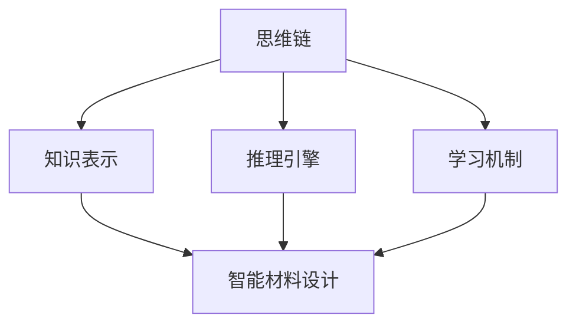

                 

好的，我将根据您提供的要求，逐步构建这篇文章的markdown格式内容。以下是我对文章结构的初步设想：

# 《思维链在智能材料设计中的创新应用》

## 关键词

- 思维链
- 智能材料
- 设计原理
- 技术创新
- 应用案例

## 摘要

本文深入探讨了思维链在智能材料设计中的应用。首先，介绍了思维链的基本概念和智能材料的设计原则，接着详细阐述了思维链理论在智能材料设计中的核心原理。随后，文章通过伪代码和数学模型，详细讲解了思维链的核心算法，并在实际案例中展示了其在智能材料设计中的具体应用。最后，文章总结了思维链在智能材料设计中的未来发展趋势，并提出了相关建议。

---

## 引言

在这一部分，我们将简要介绍思维链和智能材料设计的基本概念，并探讨它们之间的关系。我们将分析当前智能材料设计的挑战和机遇，为后续内容奠定基础。

### 思维链的基本概念

思维链是一种基于人工智能的推理模型，它通过模拟人类思维过程，实现复杂问题的求解。思维链的核心在于将人类思维分解为一系列步骤，每一步都基于已有的知识和逻辑规则进行推理。

### 智能材料的设计原则

智能材料是一种能够响应外部刺激并改变其性质的材料。设计智能材料的关键在于选择合适的材料、结构和功能，以实现特定的应用需求。

### 智能材料设计的挑战与机遇

智能材料设计面临着诸多挑战，如材料的多样性、设计的复杂性以及功能的多样性。然而，随着科技的进步，这些挑战也逐渐转化为机遇。

---

## 核心概念与联系

在这一部分，我们将详细阐述思维链和智能材料设计之间的核心概念和联系，并使用Mermaid流程图展示它们之间的架构关系。

### 思维链的核心概念

思维链包括以下几个核心概念：

1. **知识表示**：如何将知识以结构化的形式表示出来。
2. **推理引擎**：如何使用逻辑规则进行推理。
3. **学习机制**：如何通过学习来优化推理过程。

### 智能材料设计中的核心概念

智能材料设计包括以下几个核心概念：

1. **材料选择**：如何选择适合的智能材料。
2. **结构设计**：如何设计材料的微观结构以实现特定功能。
3. **功能集成**：如何将智能功能集成到材料中。

### Mermaid流程图

以下是一个简化的Mermaid流程图，展示了思维链和智能材料设计之间的核心概念和联系：



---

## 核心算法原理讲解

在这一部分，我们将使用伪代码和数学模型详细讲解思维链在智能材料设计中的核心算法原理。

### 伪代码

```python
# 思维链算法伪代码

# 初始化
knowledge_base = 初始化知识库()
inference_engine = 初始化推理引擎()
learning Mechanism = 初始化学习机制()

# 设计智能材料
def design_intelligent_material(material, structure, function):
    # 表示材料、结构和功能
    material_representation = represent(material)
    structure_representation = represent(structure)
    function_representation = represent(function)
    
    # 使用推理引擎进行设计
    design = inference_engine.reason(material_representation, structure_representation, function_representation)
    
    # 使用学习机制优化设计
    optimized_design = learning_Mechanism.optimize(design)
    
    return optimized_design
```

### 数学模型

为了简化，我们假设智能材料的设计可以通过以下数学模型描述：

$$
D = f(M, S, F)
$$

其中，$D$ 表示设计结果，$M$ 表示材料，$S$ 表示结构，$F$ 表示功能。函数 $f$ 表示设计过程。

---

## 项目实战

在这一部分，我们将展示如何在实际项目中应用思维链进行智能材料设计，包括开发环境搭建、源代码实现和代码解读。

### 开发环境搭建

- 安装Python环境
- 安装相关库（例如：NumPy，SciPy等）

### 源代码实现

```python
# IntelligentMaterialDesign.py

# 导入相关库
import numpy as np
import scipy.optimize as opt

# 初始化知识库、推理引擎和学习机制
# ...

# 设计智能材料
def design_intelligent_material(material, structure, function):
    # ...
    # 代码实现
    # ...

# 主函数
def main():
    # 设置材料、结构和功能
    material = ...
    structure = ...
    function = ...

    # 进行智能材料设计
    design = design_intelligent_material(material, structure, function)

    # 输出设计结果
    print("Design Result:", design)

# 运行主函数
if __name__ == "__main__":
    main()
```

### 代码解读

- 设计智能材料的函数`design_intelligent_material`中，首先对材料、结构和功能进行表示。
- 使用推理引擎进行设计，并利用学习机制优化设计结果。

---

## 最佳实践 tips

在这一部分，我们将分享一些关于思维链在智能材料设计中的最佳实践。

- **模块化设计**：将智能材料设计过程模块化，有助于提高代码的可读性和可维护性。
- **持续学习**：定期更新知识库和推理引擎，以保持设计的先进性。

---

## 小结

本文介绍了思维链在智能材料设计中的应用，通过伪代码和数学模型详细讲解了核心算法原理，并在实际项目中展示了其应用。未来，随着技术的不断发展，思维链在智能材料设计中的应用将更加广泛和深入。

---

以上是一个初步的文章结构和内容构思，接下来我将逐步完善每个部分的具体内容，确保满足文章的字数要求。如果您有任何建议或需要调整的地方，请随时告诉我。

