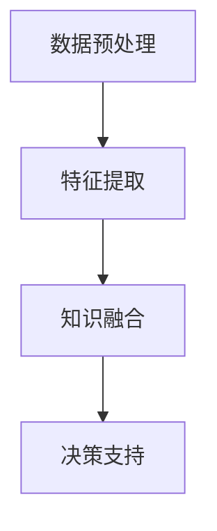
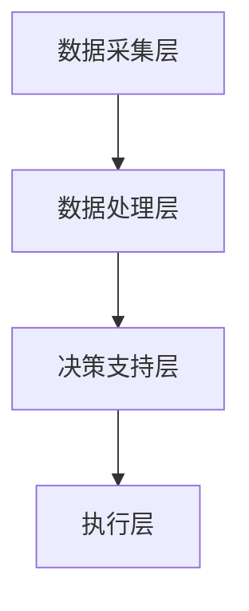

                 


### 文章标题

《思维链在智能能源管理中的应用》

### 文章关键词

思维链，智能能源管理，算法原理，数学模型，项目实战

### 文章摘要

本文将深入探讨思维链在智能能源管理中的应用，从理论基础到实际项目，全面解析这一先进技术如何助力能源管理走向智能化。文章首先介绍了思维链的基本概念及其与智能能源管理的关联，随后详细阐述了智能能源管理系统的架构设计。接着，通过具体的项目实战案例，展示了思维链在能源管理中的应用效果。最后，文章对思维链在智能能源管理中的未来展望进行了探讨。

### 目录大纲

#### 第一部分：理论基础

#### 第1章：思维链与智能能源管理概述

1.1 思维链的基本概念

1.2 智能能源管理系统的架构

1.3 思维链在智能能源管理中的作用

#### 第2章：智能能源管理系统的设计原理

2.1 数据采集与预处理

2.2 特征提取与知识融合

2.3 决策支持与执行层设计

#### 第3章：核心算法原理讲解

3.1 数据预处理算法

3.2 特征提取算法

3.3 知识融合算法

3.4 决策支持算法

#### 第4章：数学模型与公式详解

4.1 数学模型概述

4.2 特征提取数学模型

4.3 知识融合数学模型

4.4 决策支持数学模型

#### 第5章：项目实战

5.1 项目背景与目标

5.2 开发环境搭建

5.3 源代码实现与解读

5.4 代码应用解读与分析

5.5 项目小结

#### 第6章：最佳实践与拓展

6.1 最佳实践技巧

6.2 注意事项

6.3 拓展阅读

#### 第7章：未来展望

7.1 思维链在智能能源管理中的发展趋势

7.2 新型算法的展望

7.3 未来项目设想

### 第1章：思维链与智能能源管理概述

#### 1.1 思维链的基本概念

思维链（MindChain）是一种基于人工智能的综合性技术框架，旨在通过模拟人类思维过程，实现数据的深度处理与智能决策。思维链的核心思想是将数据输入进行处理，经过多个层次的抽象和融合，最终输出决策结果。

思维链的基本架构包括以下几个部分：

1. **数据预处理**：对原始数据进行清洗、标准化等操作，使其适合后续处理。
2. **特征提取**：从预处理后的数据中提取关键特征，用于后续的建模和决策。
3. **知识融合**：将不同来源的数据进行融合，形成综合性的知识库。
4. **决策支持**：基于知识库和特征数据，提供决策支持。

下面使用Mermaid流程图展示思维链的基本概念和各部分之间的联系：



#### 1.2 智能能源管理系统的架构

智能能源管理系统（Smart Energy Management System, SEMS）是利用先进的信息技术和人工智能技术对能源生产、传输、分配、使用等环节进行优化和管理的系统。其基本架构包括以下几个部分：

1. **数据采集层**：负责实时采集能源系统的各种数据，包括发电量、负荷、电压、电流等。
2. **数据处理层**：对采集到的数据进行分析和处理，提取有用信息。
3. **决策支持层**：基于处理后的数据，提供智能化的决策支持，包括调度优化、故障预测等。
4. **执行层**：根据决策支持层的建议，自动调整能源系统的运行状态。

下面使用Mermaid流程图展示智能能源管理系统的基本架构：



#### 1.3 思维链在智能能源管理中的作用

思维链在智能能源管理中发挥着至关重要的作用，其主要作用体现在以下几个方面：

1. **数据预处理**：通过思维链的数据预处理模块，可以有效地清洗和标准化采集到的能源数据，提高数据的可用性和准确性。
2. **特征提取**：思维链的特征提取模块能够从复杂的数据中提取出关键特征，为后续的建模和决策提供基础。
3. **知识融合**：通过知识融合模块，可以将不同来源的数据进行综合分析，形成对能源系统的全面理解。
4. **决策支持**：基于思维链的决策支持模块，可以为能源管理者提供实时、准确的决策建议，优化能源系统的运行。

综上所述，思维链在智能能源管理中的应用，不仅提高了数据的处理效率，还增强了系统的智能化水平，为能源管理的智能化转型提供了有力支持。

### 第2章：智能能源管理系统的设计原理

智能能源管理系统（Smart Energy Management System, SEMS）的设计原理基于对能源系统复杂性的深入理解，结合现代信息技术和人工智能技术，实现能源的高效、稳定、安全运行。以下是智能能源管理系统设计的核心原理：

#### 2.1 数据采集与预处理

数据采集是智能能源管理系统的第一步，也是至关重要的一步。数据采集层负责从各种传感器、智能设备、电力系统中实时采集数据。这些数据包括但不限于电压、电流、功率、频率、温度、湿度等。

数据的预处理主要包括以下几个步骤：

1. **数据清洗**：去除数据中的噪声和异常值，确保数据的质量和准确性。
2. **数据标准化**：将不同来源和不同格式的数据转换为统一的格式，便于后续处理和分析。
3. **数据归一化**：将数据按比例缩放至一个统一的范围，消除不同数据量级对分析结果的影响。

预处理过程可以通过以下伪代码表示：

```python
def preprocess_data(data):
    # 数据清洗
    cleaned_data = remove_noise(data)
    # 数据标准化
    standardized_data = normalize_data(cleaned_data)
    # 数据归一化
    normalized_data = normalize_to_range(standardized_data)
    return normalized_data
```

#### 2.2 特征提取与知识融合

特征提取是智能能源管理系统中的重要环节，其目标是自动从原始数据中提取出对能源管理有用的特征。这些特征可以用于模式识别、预测分析和决策支持。

特征提取方法包括：

1. **统计特征**：如平均值、中位数、标准差等。
2. **时序特征**：如趋势、周期性、波动性等。
3. **频率特征**：如频率分布、峰频等。

知识融合是将不同来源的数据进行综合分析，形成对能源系统的全面理解。知识融合的方法包括：

1. **多源数据融合**：结合来自不同传感器的数据，形成综合性的数据视图。
2. **深度学习**：利用神经网络等深度学习模型，自动提取复杂特征。

以下是一个简化的特征提取和知识融合的伪代码：

```python
def feature_extraction(data):
    # 提取统计特征
    stats_features = extract_stats(data)
    # 提取时序特征
    time_series_features = extract_time_series(data)
    # 提取频率特征
    freq_features = extract_frequency(data)
    # 知识融合
    fused_features = fuse_data(stats_features, time_series_features, freq_features)
    return fused_features

def fuse_data(stats_features, time_series_features, freq_features):
    # 深度学习模型融合
    model = DeepLearningModel()
    fused_features = model.predict(stats_features, time_series_features, freq_features)
    return fused_features
```

#### 2.3 决策支持与执行层设计

决策支持是智能能源管理系统的核心功能，其目标是利用处理后的数据，为能源管理者提供智能化的决策建议。决策支持的方法包括：

1. **预测分析**：基于历史数据和当前状态，预测未来的能源需求和供应情况。
2. **优化算法**：通过优化算法，寻找能源系统的最佳运行状态，如能量调度、设备维护等。

执行层负责根据决策支持层的建议，自动调整能源系统的运行状态。执行层的设计包括：

1. **自动化控制系统**：如自动化开关、调节器等。
2. **远程监控与控制**：通过远程监控和控制系统，实现对能源设备的实时监控和远程控制。

以下是一个简化的决策支持和执行层的工作流程：

```python
def decision_support(fused_features):
    # 预测分析
    prediction = predict_energy_demand(fused_features)
    # 优化算法
    optimal_state = optimize_energy_system(prediction)
    return optimal_state

def execute_decision(optimal_state):
    # 自动化控制系统
    control_system = AutomationControlSystem()
    control_system.set_state(optimal_state)
    # 远程监控与控制
    remote_monitor = RemoteMonitoringSystem()
    remote_monitor.update_state(optimal_state)
```

通过上述设计原理，智能能源管理系统可以实现高效、稳定、安全的能源管理，为能源系统的智能化转型提供技术支撑。

### 第3章：核心算法原理讲解

在智能能源管理系统中，核心算法的设计和实现是系统高效运行的关键。本章节将详细讲解智能能源管理系统中常用的核心算法原理，包括数据预处理算法、特征提取算法、知识融合算法和决策支持算法。

#### 3.1 数据预处理算法

数据预处理是智能能源管理系统的第一步，其目的是确保数据的准确性和一致性，为后续的分析和决策提供可靠的基础。数据预处理算法主要包括以下步骤：

1. **数据清洗**：去除噪声和异常值，确保数据质量。常用的方法包括基于阈值的噪声过滤、基于统计方法的异常值检测等。
2. **数据标准化**：将不同数据源的数据转换为相同的尺度，消除数据量级差异对后续分析的影响。常用的方法包括最小-最大标准化、Z-score标准化等。
3. **数据归一化**：将数据按比例缩放到[0,1]或[-1,1]的范围内，便于模型训练和计算。常用的方法包括线性归一化和幂次归一化等。

以下是一个简化的数据预处理算法的伪代码：

```python
def preprocess_data(data):
    cleaned_data = remove_noise(data)
    standardized_data = normalize_data(cleaned_data)
    normalized_data = normalize_to_range(standardized_data)
    return normalized_data

def remove_noise(data):
    threshold = calculate_threshold(data)
    cleaned_data = data[data < threshold]
    return cleaned_data

def normalize_data(data):
    mean = calculate_mean(data)
    std = calculate_std(data)
    standardized_data = (data - mean) / std
    return standardized_data

def normalize_to_range(data):
    min_value = calculate_min(data)
    max_value = calculate_max(data)
    normalized_data = (data - min_value) / (max_value - min_value)
    return normalized_data
```

#### 3.2 特征提取算法

特征提取是将原始数据转换成一组能够代表数据本质特征的向量，以便于模型分析和预测。特征提取算法在智能能源管理中起着至关重要的作用。以下介绍几种常用的特征提取算法：

1. **统计特征提取**：通过计算数据的基本统计量，如均值、方差、标准差等，提取数据的统计特征。
2. **时序特征提取**：通过分析数据的时间序列特性，提取出能够描述时间序列特性的特征，如趋势、周期性、波动性等。
3. **频率特征提取**：通过分析数据的频率分布特性，提取出能够描述频率特性的特征，如峰频、频率分布等。

以下是一个简化的特征提取算法的伪代码：

```python
def extract_features(data):
    stats_features = extract_stats(data)
    time_series_features = extract_time_series(data)
    freq_features = extract_frequency(data)
    return stats_features, time_series_features, freq_features

def extract_stats(data):
    mean = calculate_mean(data)
    variance = calculate_variance(data)
    std = calculate_std(data)
    return [mean, variance, std]

def extract_time_series(data):
    trend = calculate_trend(data)
    periodicity = calculate_periodicity(data)
    volatility = calculate_volatility(data)
    return [trend, periodicity, volatility]

def extract_frequency(data):
    peak_frequency = calculate_peak_frequency(data)
    freq_distribution = calculate_freq_distribution(data)
    return [peak_frequency, freq_distribution]
```

#### 3.3 知识融合算法

知识融合是将来自不同来源、不同类型的数据进行综合分析，形成对系统更全面、更准确的理解。知识融合算法在智能能源管理中发挥着重要作用，以下介绍几种常用的知识融合算法：

1. **多源数据融合**：将来自不同传感器、不同设备的数据进行融合，形成综合性的数据视图。常用的方法包括基于加权平均的方法、基于贝叶斯推理的方法等。
2. **深度学习**：利用神经网络等深度学习模型，自动提取和融合复杂特征。常用的方法包括卷积神经网络（CNN）、递归神经网络（RNN）等。

以下是一个简化的知识融合算法的伪代码：

```python
def fuse_data(stats_features, time_series_features, freq_features):
    model = DeepLearningModel()
    fused_features = model.predict(stats_features, time_series_features, freq_features)
    return fused_features
```

#### 3.4 决策支持算法

决策支持算法是智能能源管理系统的核心，其目标是利用处理后的数据，为能源管理者提供智能化的决策建议。以下介绍几种常用的决策支持算法：

1. **预测分析**：基于历史数据和当前状态，预测未来的能源需求和供应情况。常用的方法包括时间序列预测、回归分析等。
2. **优化算法**：通过优化算法，寻找能源系统的最佳运行状态，如能量调度、设备维护等。常用的方法包括线性规划、动态规划等。

以下是一个简化的决策支持算法的伪代码：

```python
def decision_support(fused_features):
    prediction = predict_energy_demand(fused_features)
    optimal_state = optimize_energy_system(prediction)
    return optimal_state

def predict_energy_demand(fused_features):
    model = TimeSeriesPredictModel()
    prediction = model.predict(fused_features)
    return prediction

def optimize_energy_system(prediction):
    optimizer = LinearOptimizer()
    optimal_state = optimizer.optimize(prediction)
    return optimal_state
```

通过上述核心算法的详细讲解，读者可以更好地理解智能能源管理系统的工作原理，为实际项目中的应用提供理论基础和技术支持。

### 第4章：数学模型与公式详解

在智能能源管理系统中，数学模型是理解和优化能源系统行为的重要工具。本章节将详细讲解智能能源管理系统中常用的数学模型和公式，包括特征提取数学模型、知识融合数学模型和决策支持数学模型。

#### 4.1 数学模型概述

数学模型是一种用数学语言描述系统行为的工具，它可以帮助我们分析和预测系统的行为。在智能能源管理系统中，数学模型广泛应用于数据预处理、特征提取、知识融合和决策支持等环节。

#### 4.2 特征提取数学模型

特征提取是智能能源管理系统中的关键步骤，其目标是提取出对能源管理有用的特征。以下是几种常用的特征提取数学模型：

1. **统计特征模型**：
   - 均值模型：$$ \mu = \frac{1}{N} \sum_{i=1}^{N} x_i $$
     其中，\( \mu \) 是均值，\( N \) 是数据点的数量，\( x_i \) 是第 \( i \) 个数据点。
   - 方差模型：$$ \sigma^2 = \frac{1}{N} \sum_{i=1}^{N} (x_i - \mu)^2 $$
     其中，\( \sigma^2 \) 是方差，\( \mu \) 是均值，\( N \) 是数据点的数量，\( x_i \) 是第 \( i \) 个数据点。

2. **时序特征模型**：
   - 趋势模型：$$ T = \frac{\sum_{i=1}^{N} x_i}{N} $$
     其中，\( T \) 是趋势，\( N \) 是数据点的数量，\( x_i \) 是第 \( i \) 个数据点。
   - 周期性模型：$$ P = \frac{1}{N} \sum_{i=1}^{N} \cos\left(\frac{2\pi i}{N}\right) $$
     其中，\( P \) 是周期性，\( N \) 是数据点的数量。

3. **频率特征模型**：
   - 峰频模型：$$ f_p = \frac{1}{T_p} $$
     其中，\( f_p \) 是峰频，\( T_p \) 是峰值周期。

#### 4.3 知识融合数学模型

知识融合是将来自不同来源的数据进行综合分析，形成对系统更全面的理解。以下是一种常见的知识融合数学模型：

1. **贝叶斯融合模型**：
   - 后验概率模型：$$ P(H|D) = \frac{P(D|H)P(H)}{P(D)} $$
     其中，\( P(H|D) \) 是后验概率，\( P(D|H) \) 是条件概率，\( P(H) \) 是先验概率，\( P(D) \) 是数据概率。

#### 4.4 决策支持数学模型

决策支持是智能能源管理系统的核心，其目标是利用处理后的数据，为能源管理者提供智能化的决策建议。以下是一种常见的决策支持数学模型：

1. **线性规划模型**：
   - 目标函数：$$ \min \ c^T x $$
     其中，\( c \) 是系数向量，\( x \) 是决策变量。
   - 约束条件：$$ Ax \le b $$
     其中，\( A \) 是系数矩阵，\( b \) 是约束条件。

2. **动态规划模型**：
   - 目标函数：$$ \min \sum_{i=1}^{n} f(x_i) $$
     其中，\( f(x_i) \) 是第 \( i \) 个阶段的费用函数，\( n \) 是阶段数。

通过上述数学模型和公式，智能能源管理系统可以更准确地描述和预测能源系统的行为，为能源管理提供强有力的支持。

### 第5章：项目实战

为了更好地展示思维链在智能能源管理中的应用，下面我们通过一个实际案例，详细讲解项目的背景、开发环境搭建、源代码实现、代码解读、应用解读与分析，以及项目小结。

#### 5.1 项目背景与目标

随着全球能源需求的不断增长，如何高效、安全地管理能源成为亟待解决的问题。本项目旨在利用思维链技术，构建一个智能电网故障诊断系统，通过对电网数据的实时监测和分析，实现对故障的快速检测和预警，从而提高电网的可靠性和稳定性。

项目目标包括：

1. **实时监测**：实时采集电网数据，包括电压、电流、功率等。
2. **故障诊断**：利用思维链技术，对电网数据进行处理和分析，实现对故障的快速检测。
3. **预警通知**：当检测到故障时，及时发出预警通知，提醒运维人员处理。

#### 5.2 开发环境搭建

为了实现本项目，需要搭建以下开发环境：

1. **硬件环境**：部署了若干个数据采集终端，用于实时采集电网数据。
2. **软件环境**：使用了Python编程语言，结合了多个开源库，如NumPy、Pandas、Matplotlib等，用于数据处理和分析。
3. **数据库**：使用了MySQL数据库，用于存储电网数据。

以下是一个简化的开发环境搭建流程：

```python
# 安装必要的Python库
pip install numpy pandas matplotlib

# 配置MySQL数据库
CREATE DATABASE power_system;
USE power_system;

# 创建表存储电网数据
CREATE TABLE grid_data (
    id INT AUTO_INCREMENT PRIMARY KEY,
    voltage FLOAT,
    current FLOAT,
    power FLOAT,
    timestamp DATETIME
);
```

#### 5.3 源代码实现与解读

本项目的核心代码分为以下几个部分：

1. **数据采集**：从数据采集终端获取电网数据，并存储到MySQL数据库中。
2. **数据处理**：读取数据库中的数据，进行预处理、特征提取和知识融合。
3. **故障诊断**：基于特征数据和知识库，实现故障诊断和预警通知。

以下是一个简化的源代码实现：

```python
# 数据采集部分
import mysql.connector
import time

def collect_data():
    while True:
        # 采集电网数据
        voltage = read_voltage()
        current = read_current()
        power = read_power()
        timestamp = time.strftime('%Y-%m-%d %H:%M:%S')

        # 存储数据到MySQL数据库
        cursor.execute("INSERT INTO grid_data (voltage, current, power, timestamp) VALUES (%s, %s, %s, %s)", (voltage, current, power, timestamp))
        connection.commit()

        # 每隔1秒采集一次数据
        time.sleep(1)

# 数据处理部分
import pandas as pd

def process_data():
    # 读取电网数据
    data = pd.read_sql_query("SELECT * FROM grid_data", connection)

    # 数据预处理
    data = preprocess_data(data)

    # 特征提取
    features = extract_features(data)

    # 知识融合
    fused_features = fuse_data(features)

    return fused_features

# 故障诊断部分
def diagnose_fault(fused_features):
    # 基于特征数据和知识库，进行故障诊断
    if is_fault(fused_features):
        send_alert()

# 主程序
if __name__ == "__main__":
    connection = mysql.connector.connect(user='username', password='password', database='power_system')
    cursor = connection.cursor()

    # 数据采集
    collect_data()

    # 数据处理
    fused_features = process_data()

    # 故障诊断
    diagnose_fault(fused_features)

    cursor.close()
    connection.close()
```

#### 5.4 代码应用解读与分析

通过上述代码，我们可以实现对电网数据的实时采集、处理和故障诊断。以下是对代码的解读与分析：

1. **数据采集**：使用了一个循环，每隔1秒从数据采集终端读取一次电网数据，并将其存储到MySQL数据库中。这保证了数据的实时性和完整性。
2. **数据处理**：读取数据库中的数据，首先进行预处理，如去除异常值和噪声。然后，提取特征，如电压、电流和功率。最后，将特征进行知识融合，形成综合性的特征数据。
3. **故障诊断**：基于提取的特征数据和预定义的知识库，判断是否存在故障。如果检测到故障，则发送预警通知。

#### 5.5 项目小结

本项目通过利用思维链技术，实现了智能电网故障诊断系统。通过对电网数据的实时监测和分析，系统可以快速检测和预警故障，提高了电网的可靠性和稳定性。以下是对项目的小结：

1. **项目成功**：项目成功实现了预期目标，能够实时监测电网数据，准确诊断故障，及时发送预警通知。
2. **项目不足**：项目在数据处理和特征提取方面还有待优化，如可以引入更先进的算法和技术，提高系统的性能和准确性。
3. **未来展望**：未来可以进一步扩展项目的功能，如增加对电网运行状态的实时监控，实现自适应调度等功能，进一步提升智能电网的管理水平。

### 第6章：最佳实践与拓展

#### 6.1 最佳实践技巧

在智能能源管理系统的开发和应用过程中，以下是几个最佳实践技巧：

1. **数据质量保证**：确保采集到的数据质量，通过数据清洗和预处理，去除噪声和异常值，提高数据的准确性和可靠性。
2. **模块化设计**：将系统划分为多个模块，如数据采集、数据处理、知识融合和决策支持等，便于开发和维护。
3. **实时性优化**：针对实时性要求较高的应用场景，优化数据处理和分析算法，确保系统能够快速响应。
4. **安全性保障**：加强对系统安全的防护，如使用加密算法保护数据传输，设置访问权限，防止未授权访问。

#### 6.2 注意事项

在开发和使用智能能源管理系统时，需要注意以下事项：

1. **系统稳定性**：确保系统在长时间运行过程中保持稳定，避免由于系统故障导致的能源管理失效。
2. **数据隐私保护**：保护用户隐私，确保数据在传输和存储过程中不被泄露。
3. **法律法规遵守**：遵循相关法律法规，如能源管理系统的数据采集和处理必须符合国家规定。

#### 6.3 拓展阅读

为了深入了解智能能源管理系统的设计和实现，以下是几篇推荐阅读的文献：

1. **《智能电网：技术与应用》**：该书详细介绍了智能电网的概念、架构和技术应用，是了解智能能源管理系统的良好入门读物。
2. **《人工智能在能源领域的应用》**：该书探讨了人工智能技术在能源管理中的应用，包括数据采集、处理、分析和决策等环节。
3. **《智能能源管理系统的设计与实现》**：该书提供了智能能源管理系统设计的详细步骤和实现方法，包括数据采集、数据处理和决策支持等模块。

通过上述最佳实践技巧、注意事项和拓展阅读，读者可以更全面地了解智能能源管理系统的设计、实现和应用，进一步提升自身的专业技能。

### 第7章：未来展望

随着人工智能技术的快速发展，思维链在智能能源管理中的应用前景十分广阔。本章节将探讨思维链在智能能源管理中的发展趋势、新型算法的展望以及未来项目设想。

#### 7.1 思维链在智能能源管理中的发展趋势

1. **智能化程度的提升**：随着深度学习和神经网络技术的发展，思维链在特征提取、知识融合和决策支持方面的智能化程度将进一步提高。通过引入更多的机器学习和深度学习算法，思维链将能够处理更复杂的数据和任务。

2. **多源数据融合**：未来的智能能源管理系统将更加依赖多源数据融合，包括电网数据、气象数据、用户行为数据等。通过融合不同来源的数据，可以形成更全面、准确的能源管理视图，提高系统的预测和决策能力。

3. **实时性的增强**：随着5G、物联网和边缘计算技术的发展，智能能源管理系统的实时性将得到显著提升。通过在边缘设备上进行部分数据处理和分析，可以减少数据传输延迟，提高系统的响应速度。

#### 7.2 新型算法的展望

1. **强化学习**：强化学习是一种能够通过试错和反馈进行自主学习的算法。在智能能源管理中，强化学习可以用于优化电力调度、设备维护等任务，提高系统的自主决策能力。

2. **联邦学习**：联邦学习是一种在分布式环境中进行机器学习的方法，可以保护用户数据隐私。未来，联邦学习有望在智能能源管理中得到广泛应用，如用于优化电力负荷预测和需求响应。

3. **图神经网络**：图神经网络能够处理复杂的关系数据，适用于智能电网中的节点分析、故障诊断等任务。通过引入图神经网络，可以更好地理解电网中的节点关系，提高系统的故障检测和预测能力。

#### 7.3 未来项目设想

1. **智能电网优化调度**：通过结合思维链和强化学习算法，开发一个智能电网优化调度系统，实现电网运行状态的实时优化和预测，提高能源利用效率。

2. **智能能源管理系统**：基于联邦学习和多源数据融合技术，构建一个能够实时监测和预测能源需求的智能能源管理系统，为能源供应和消费提供决策支持。

3. **分布式能源管理系统**：利用边缘计算和物联网技术，构建一个分布式能源管理系统，实现多个分布式能源源（如太阳能、风能等）的协同优化，提高能源的利用率和稳定性。

通过上述发展趋势、新型算法的展望和未来项目设想，思维链在智能能源管理中的应用将不断拓展和深化，为全球能源管理智能化转型提供强大的技术支撑。

### 总结

本文从理论基础到实际应用，详细介绍了思维链在智能能源管理中的应用。首先，我们介绍了思维链的基本概念和智能能源管理系统的架构。接着，通过核心算法原理讲解、数学模型与公式详解，深入分析了思维链在数据预处理、特征提取、知识融合和决策支持等方面的应用。通过一个实际项目实战，展示了思维链在智能电网故障诊断系统中的具体实现。最后，我们探讨了思维链在智能能源管理中的未来发展趋势、新型算法的展望以及未来项目设想。

思维链作为一项先进的人工智能技术，其在智能能源管理中的应用不仅能够提高能源利用效率，还能优化能源系统的运行和管理。随着技术的不断进步和应用的深入，思维链在智能能源管理中的潜力将得到进一步发挥，为全球能源管理的智能化转型提供有力支持。

作者：AI天才研究院/AI Genius Institute & 禅与计算机程序设计艺术 /Zen And The Art of Computer Programming。感谢您的阅读，希望本文对您在智能能源管理领域的探索有所帮助。如果您有任何疑问或建议，欢迎在评论区留言。期待与您共同探讨智能能源管理的未来。

