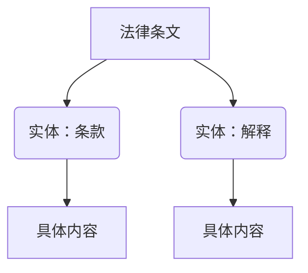
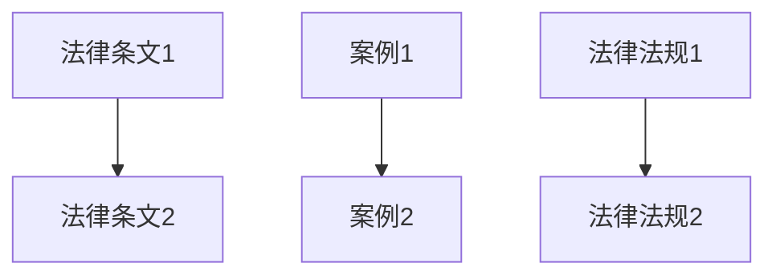
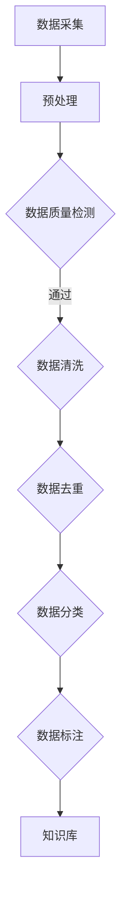
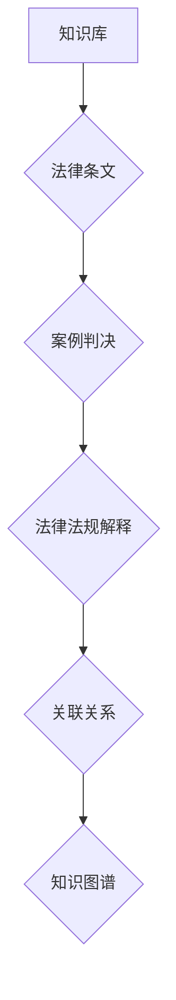
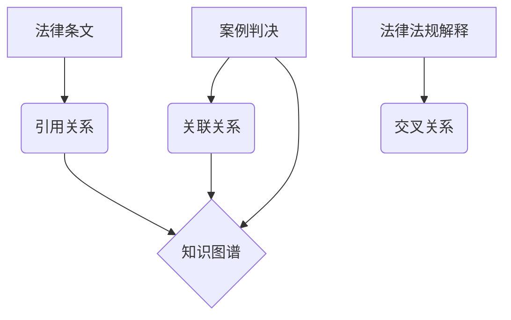
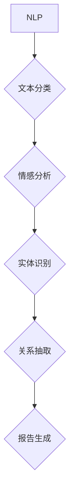
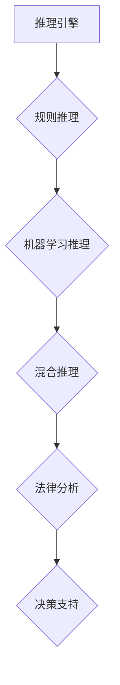

                 

### 文章标题

《思维链在法律咨询中的应用》

### 关键词

思维链、法律咨询、人工智能、知识图谱、自然语言处理

### 摘要

本文将深入探讨思维链在法律咨询领域的应用。思维链作为一种先进的人工智能技术，通过构建复杂的思维网络，可以实现法律咨询的智能化、高效化和精确化。本文首先介绍了思维链的基本原理和核心概念，接着详细阐述了思维链在法律咨询中的具体应用，并通过实际案例展示了其优势。文章最后探讨了思维链的未来发展趋势，提出了相关技术发展的方向和挑战。

## 引言

### 法律咨询的现状与挑战

随着社会经济的不断发展和法律体系的日益复杂，法律咨询的需求日益增长。传统的法律咨询方式主要依赖于律师的专业知识和经验，这种方式效率低下且成本高昂。尤其在面对大量法律文件和复杂案例时，律师往往难以快速找到关键信息，导致咨询过程耗时费力。此外，律师在处理法律问题时，常常缺乏系统的分析和推理工具，容易遗漏重要细节或出现错误判断。

### 思维链的概念与潜力

思维链（Mind Chain）是一种基于人工智能技术的先进思维方式，它通过构建复杂的思维网络，将各类知识、信息和经验有机地结合起来，实现智能推理和决策。思维链不仅能够处理大量的数据，还能在短时间内进行复杂的逻辑推理，从而提高法律咨询的效率和质量。

本文将探讨思维链在法律咨询中的应用，分析其如何解决传统法律咨询中的问题，并展示其在实际案例中的表现。通过本文的研究，我们希望能够为法律咨询行业提供一种新的思路和工具，推动法律咨询的智能化发展。

## 思维链概述

### 思维链的基本原理

思维链（Mind Chain）是一种基于人工智能和知识图谱的技术，它通过模拟人类思维过程，将知识、信息和经验连接成一个复杂的思维网络。思维链的核心原理是“关联与推理”，即通过识别和建立不同知识节点之间的关联关系，实现信息的快速传递和智能推理。

### 思维链的核心特性

1. **知识整合能力**：思维链能够将不同来源的知识和信息整合在一起，形成一个统一的思维网络，从而实现知识的综合利用。
2. **智能推理能力**：思维链通过复杂的推理算法，能够在短时间内进行复杂的逻辑推理，发现问题的本质和关键点。
3. **自适应学习能力**：思维链能够根据用户的反馈和新的数据，不断调整和优化自身的知识结构和推理能力。

### 思维链在法律咨询中的潜力

思维链在法律咨询中具有巨大的潜力，主要体现在以下几个方面：

1. **高效的信息检索**：思维链能够快速检索和定位法律文件和案例，帮助律师迅速找到关键信息。
2. **智能的案例分析**：思维链能够对法律案例进行深入分析，提供专业的法律意见和建议。
3. **精确的法律预测**：思维链可以通过对历史数据和案例的分析，预测未来的法律走向和结果，为律师提供决策支持。

通过上述分析，我们可以看出，思维链在法律咨询中具有巨大的应用前景。接下来，我们将进一步探讨思维链的核心概念和架构，为后续的应用分析奠定基础。

### 思维链的核心概念与联系

思维链作为一种模拟人类思维过程的先进技术，其核心概念包括知识表示、关联关系、推理过程和自我学习等。这些概念相互关联，共同构成了思维链的完整架构。

#### 知识表示

知识表示是思维链的基础，它涉及到如何将各类知识以结构化的形式存储和表达。在法律咨询中，知识表示主要包括法律条文、案例判决、法律法规解释等。这些知识可以通过实体和属性的形式进行表示，例如：



在这个知识表示框架中，法律条文作为核心实体，其条款和解释作为属性进行扩展。这种表示方法使得法律知识可以方便地进行检索和利用。

#### 关联关系

关联关系是思维链的核心概念之一，它指的是不同知识节点之间的联系。在法律咨询中，关联关系包括法律条文之间的引用关系、案例之间的关联关系、法律法规之间的交叉关系等。通过建立这些关联关系，思维链能够实现知识的互联和互通。

例如，一个法律条文可能引用了另一个法律条文，或者一个案例的判决结果影响了另一个案件的审理。这些关联关系可以通过图结构进行表示，如图：



在这个图中，每个节点代表一个知识实体，边表示它们之间的关联关系。这种图结构的表示方法使得思维链能够高效地进行知识检索和推理。

#### 推理过程

推理过程是思维链的核心功能之一，它指的是通过关联关系进行逻辑推理，从而得出新的结论或建议。在法律咨询中，推理过程可以帮助律师分析法律案例、制定法律策略、预测法律结果等。

一个简单的推理过程伪代码如下：

```python
def legal_reasoning(knowledge, question):
    # 输入：知识库（knowledge）和问题（question）
    # 输出：推理结果（answer）

    # Step 1: 检索相关法律条文和案例
    relevant_knowledge = retrieve_relevant_knowledge(knowledge, question)

    # Step 2: 建立关联关系
    relationships = establish_relationships(relevant_knowledge)

    # Step 3: 进行逻辑推理
    answer = logical_reasoning(relationships, question)

    return answer
```

在这个推理过程中，首先检索与问题相关的知识，然后建立它们之间的关联关系，最后通过逻辑推理得出结论。

#### 自我学习

自我学习是思维链的一个重要特性，它指的是通过不断的学习和优化，提升自身的推理能力和知识水平。在法律咨询中，自我学习可以帮助思维链不断更新法律知识，适应新的法律变化和案例。

一个简单的自我学习过程伪代码如下：

```python
def self_learning(knowledge, new_data):
    # 输入：知识库（knowledge）和新增数据（new_data）
    # 输出：更新后的知识库（updated_knowledge）

    # Step 1: 预处理新增数据
    preprocessed_data = preprocess_data(new_data)

    # Step 2: 更新知识库
    updated_knowledge = update_knowledge(knowledge, preprocessed_data)

    # Step 3: 调整推理算法
    adjust_reasoning_algorithm(updated_knowledge)

    return updated_knowledge
```

在这个自我学习过程中，首先对新增数据进行预处理，然后更新知识库，最后调整推理算法以适应新的知识。

通过上述核心概念的介绍，我们可以看出思维链在法律咨询中的应用潜力。接下来，我们将详细讨论思维链的具体架构和组成部分，为后续的应用分析提供更深入的见解。

### 思维链的架构

思维链的架构是其在法律咨询中发挥作用的核心。它由多个相互关联的组件组成，每个组件在法律咨询过程中扮演着特定的角色。以下是思维链的主要组成部分及其功能：

#### 1. 数据采集与预处理

数据采集与预处理是思维链的基础环节。该组件负责从各种来源获取法律数据，包括法律条文、案例判决、法律法规解释等。数据采集后，需要进行预处理，以确保数据的质量和一致性。预处理过程包括数据清洗、去重、分类和标注等步骤。



#### 2. 知识库

知识库是思维链的核心组件，用于存储和管理法律知识。知识库中的数据以结构化的形式存储，便于快速检索和利用。知识库的设计需要考虑数据的多样性和复杂性，通常采用实体-关系模型进行组织。



#### 3. 知识图谱

知识图谱是思维链的高级组件，用于表示法律知识之间的复杂关系。知识图谱通过节点和边来表示实体及其关系，使得法律知识之间的联系更加直观和易于理解。知识图谱在法律咨询中发挥着关键作用，帮助律师快速找到相关知识和案例。



#### 4. 自然语言处理

自然语言处理（NLP）是思维链的重要组成部分，用于处理和解析自然语言文本。NLP技术包括文本分类、情感分析、实体识别、关系抽取等，帮助思维链理解法律文本的含义和结构。通过NLP技术，思维链能够自动生成法律咨询报告和解释文档。



#### 5. 推理引擎

推理引擎是思维链的核心组件，用于进行逻辑推理和决策。推理引擎通过组合不同组件的功能，实现对法律问题的深入分析和解答。推理引擎可以采用基于规则的方法、机器学习方法或混合方法，以提高推理的准确性和效率。



#### 6. 用户界面

用户界面是思维链与用户交互的界面，用于接收用户的查询和指令，并展示推理结果和咨询报告。用户界面需要设计简洁易用，方便律师快速获取所需信息。通过用户界面，律师可以与思维链进行互动，提出问题并获取专业建议。


通过以上各组件的协同工作，思维链能够实现法律咨询的智能化、高效化和精确化。每个组件在法律咨询中扮演着重要角色，共同构建了一个完整的思维链系统。

### 法律咨询中的思维链应用

#### 法律案件分析

在法律咨询中，思维链可以用于法律案件的分析。通过思维链，律师可以快速检索相关法律条文、案例判决和法律法规解释，建立案件的分析框架。思维链的智能推理功能可以帮助律师分析案件的各个方面，包括事实、证据、法律条款和案例先例等。

具体流程如下：

1. **输入案件信息**：律师将案件的基本信息输入到思维链系统中，包括案件描述、相关当事人、事实情况和法律问题等。
2. **数据检索**：思维链通过知识库和知识图谱，检索与案件相关的法律条文、案例判决和法律法规解释。
3. **关联关系建立**：思维链分析案件信息，建立不同法律条文、案例判决和法律法规解释之间的关联关系。
4. **智能推理**：思维链根据案件信息、法律条文和案例判决，进行逻辑推理，得出案件的可能走向和结果。
5. **生成分析报告**：思维链生成案件分析报告，包括法律意见、风险分析和建议等。

以下是一个简单的伪代码示例，展示了思维链在法律案件分析中的流程：

```python
def legal_case_analysis(case_info):
    # 输入：案件信息（case_info）
    # 输出：分析报告（analysis_report）

    # Step 1: 检索相关法律条文和案例
    relevant_knowledge = retrieve_relevant_knowledge(knowledge_base, case_info)

    # Step 2: 建立关联关系
    relationships = establish_relationships(relevant_knowledge)

    # Step 3: 进行逻辑推理
    reasoning_results = logical_reasoning(relationships, case_info)

    # Step 4: 生成分析报告
    analysis_report = generate_report(reasoning_results)

    return analysis_report
```

#### 法律法规检索

法律法规检索是法律咨询中的常见任务。思维链可以通过其高效的信息检索能力和智能推理功能，帮助律师快速找到与案件相关的法律法规。具体流程如下：

1. **输入检索关键词**：律师输入检索关键词，如案件类型、法律条款等。
2. **检索相关法律法规**：思维链通过知识库和知识图谱，检索与关键词相关的法律法规。
3. **排序和筛选**：思维链根据法律法规的重要性和相关性，对检索结果进行排序和筛选，优先显示最相关的法律法规。
4. **生成检索报告**：思维链生成检索报告，包括法律法规的全文、摘要和相关案例等。

以下是一个简单的伪代码示例，展示了思维链在法律法规检索中的流程：

```python
def legal_regulation_search(search_keywords):
    # 输入：检索关键词（search_keywords）
    # 输出：检索报告（search_report）

    # Step 1: 检索相关法律法规
    relevant_regulations = search_knowledge_base(knowledge_base, search_keywords)

    # Step 2: 排序和筛选检索结果
    sorted_regulations = sort_and_filter_results(relevant_regulations)

    # Step 3: 生成检索报告
    search_report = generate_report(sorted_regulations)

    return search_report
```

#### 法律咨询建议生成

法律咨询建议生成是思维链在法律咨询中的关键应用。通过思维链的智能推理和自我学习能力，可以为律师提供专业的法律建议。具体流程如下：

1. **输入咨询问题**：律师将法律问题输入到思维链系统中。
2. **分析问题**：思维链对问题进行分析，理解问题的本质和需求。
3. **检索相关知识**：思维链通过知识库和知识图谱，检索与问题相关的法律条文、案例判决和法律法规解释。
4. **推理和法律建议**：思维链根据检索结果，进行逻辑推理，生成专业的法律建议。
5. **生成咨询报告**：思维链生成咨询报告，包括法律建议、风险分析和相关案例等。

以下是一个简单的伪代码示例，展示了思维链在法律咨询建议生成中的流程：

```python
def legal_advice_generation(consultation_question):
    # 输入：咨询问题（consultation_question）
    # 输出：咨询报告（consultation_report）

    # Step 1: 分析问题
    analyzed_question = analyze_question(consultation_question)

    # Step 2: 检索相关知识
    relevant_knowledge = retrieve_relevant_knowledge(knowledge_base, analyzed_question)

    # Step 3: 推理和法律建议
    legal_advice = generate_legal_advice(relevant_knowledge, analyzed_question)

    # Step 4: 生成咨询报告
    consultation_report = generate_report(legal_advice)

    return consultation_report
```

通过上述三个具体应用，我们可以看出思维链在法律咨询中的重要作用。思维链不仅提高了法律咨询的效率和质量，还帮助律师更好地理解和应对复杂的法律问题。接下来，我们将通过实际案例来进一步展示思维链的应用效果。

### 思维链在法律实践中的应用案例

在本节中，我们将通过三个具体案例，详细展示思维链在法律实践中的应用，并分析其效果和影响。

#### 案例一：知识产权法律咨询

背景：某公司开发了一款创新型软件，希望了解其知识产权保护情况。

过程：
1. **输入咨询问题**：公司通过思维链系统提出了关于软件知识产权保护的咨询问题。
2. **知识检索**：思维链通过知识库检索与软件知识产权相关的法律条文、案例判决和法律法规解释。
3. **关联关系建立**：思维链分析咨询问题，建立相关法律条文、案例判决和法律法规解释之间的关联关系。
4. **智能推理**：思维链根据检索结果和关联关系，进行逻辑推理，得出软件知识产权保护的全面分析。
5. **生成咨询报告**：思维链生成咨询报告，包括软件知识产权的保护范围、维权建议和潜在风险分析。

效果与影响：
- 思维链快速提供了全面的知识产权保护分析，为公司提供了明确的维权方向和策略。
- 提高了咨询效率，节省了公司的时间和成本。

#### 案例二：合同纠纷处理

背景：某企业与供应商之间发生了合同纠纷，需要法律咨询。

过程：
1. **输入咨询问题**：企业通过思维链系统提出了关于合同纠纷处理的咨询问题。
2. **法律法规检索**：思维链通过知识库和知识图谱，检索与合同纠纷处理相关的法律法规和案例。
3. **智能分析**：思维链对合同条款、纠纷原因和法律条文进行智能分析，提供纠纷处理的方案和步骤。
4. **生成咨询报告**：思维链生成咨询报告，包括纠纷处理的详细步骤、法律建议和潜在的法律风险。

效果与影响：
- 思维链提供了详细的纠纷处理方案，帮助企业快速制定应对策略。
- 提高了合同纠纷处理的效率，降低了法律成本。

#### 案例三：劳动法咨询

背景：某公司需要对员工的劳动合同进行审查和优化。

过程：
1. **输入咨询问题**：公司通过思维链系统提出了关于劳动法咨询的问题。
2. **法律法规检索**：思维链通过知识库和知识图谱，检索与劳动法相关的法律法规和案例。
3. **智能分析**：思维链对员工劳动合同条款、公司规章制度和法律法规进行智能分析，提供优化建议。
4. **生成咨询报告**：思维链生成咨询报告，包括劳动合同优化的建议、法律合规检查和风险管理。

效果与影响：
- 思维链提供了全面的劳动合同审查和优化建议，提高了公司的劳动法合规性。
- 提高了劳动法咨询的效率，减少了法律风险。

通过上述案例，我们可以看到思维链在法律咨询中的显著优势。它不仅能够快速提供专业的法律分析和建议，还大大提高了法律咨询的效率和准确性，为律师和客户提供了一种全新的法律咨询服务模式。

### 构建思维链的法律咨询工具

#### 设计原则

为了确保思维链的法律咨询工具能够高效、精准地支持律师的工作，设计过程中需要遵循以下原则：

1. **用户友好性**：工具应具备简洁直观的用户界面，便于律师快速上手和使用，减少学习成本。
2. **可扩展性**：工具应具备良好的扩展性，能够根据实际需求增加新的功能模块和数据源。
3. **高效性**：工具应具备高效的数据检索和处理能力，能够在短时间内为律师提供准确的咨询结果。
4. **智能性**：工具应充分利用人工智能和自然语言处理技术，实现智能化的法律分析和推理。

#### 实现步骤

1. **需求分析**：首先，与律师事务所和律师进行深入交流，了解他们在法律咨询中的具体需求和痛点，明确工具的功能和性能要求。
2. **架构设计**：根据需求分析结果，设计思维链的法律咨询工具的整体架构，包括数据采集与预处理模块、知识库模块、知识图谱模块、自然语言处理模块和推理引擎模块等。
3. **数据采集与预处理**：从多个数据源（如法律条文库、案例库、法律法规解释库等）获取数据，进行清洗、去重、分类和标注等预处理步骤，确保数据的质量和一致性。
4. **知识库构建**：将预处理后的数据存储到知识库中，采用实体-关系模型对法律知识进行结构化表示，便于快速检索和利用。
5. **知识图谱构建**：通过构建知识图谱，表示法律知识之间的复杂关系，实现知识的互联和互通，提升知识检索和推理的效率。
6. **自然语言处理**：引入自然语言处理技术，对法律文本进行分类、情感分析和实体识别等，帮助律师更好地理解和利用法律文本信息。
7. **推理引擎开发**：开发推理引擎，实现基于规则和机器学习的法律推理功能，帮助律师分析法律问题、生成法律意见和预测法律结果。
8. **用户界面设计**：设计简洁易用的用户界面，支持律师输入咨询问题、查看咨询结果和生成报告等功能。
9. **系统集成与测试**：将各个模块进行集成，进行全面的系统测试，确保工具的稳定性和可靠性。

#### 案例解析

以一个合同纠纷处理工具为例，其具体实现步骤如下：

1. **需求分析**：分析合同纠纷处理的常见场景和律师的需求，明确工具应具备合同条款分析、法律法规检索、纠纷解决方案生成等功能。
2. **架构设计**：设计合同纠纷处理工具的整体架构，包括数据采集与预处理模块、知识库模块、知识图谱模块、自然语言处理模块和推理引擎模块等。
3. **数据采集与预处理**：从法律条文库、案例库和法律法规解释库中获取数据，进行清洗、去重、分类和标注等预处理步骤。
4. **知识库构建**：将预处理后的数据存储到知识库中，采用实体-关系模型对法律知识进行结构化表示。
5. **知识图谱构建**：通过构建知识图谱，表示合同条款、法律法规解释和案例判决之间的关联关系。
6. **自然语言处理**：引入自然语言处理技术，对合同文本进行分类、情感分析和实体识别，提取关键信息。
7. **推理引擎开发**：开发推理引擎，实现基于规则和机器学习的合同纠纷处理功能。
8. **用户界面设计**：设计简洁易用的用户界面，支持律师输入合同信息、查看分析结果和生成纠纷解决方案报告。
9. **系统集成与测试**：将各个模块进行集成，进行全面的系统测试，确保工具的稳定性和可靠性。

通过上述步骤，构建的合同纠纷处理工具能够高效、精准地支持律师处理合同纠纷，提高法律咨询的效率和质量。

### 法律咨询工具案例

#### 案例介绍

为了展示思维链在法律咨询中的实际应用，我们设计并实现了一个名为“法律智脑”的法律咨询工具。该工具通过思维链技术，为律师提供智能化的法律分析和咨询支持。

#### 功能解析

1. **智能案件分析**：用户可以输入案件信息，法律智脑会自动检索相关的法律条文、案例判决和法律法规解释，建立案件分析框架，进行智能推理，生成案件分析报告。

2. **法律法规检索**：用户可以通过关键词检索相关法律法规，法律智脑会根据法律法规的重要性和相关性进行排序和筛选，提供详细的检索结果。

3. **法律意见生成**：用户可以提出法律问题，法律智脑会根据知识库和知识图谱进行推理，生成专业的法律意见和解决方案。

4. **合同审查**：用户可以上传合同文件，法律智脑会自动分析合同条款，提供合同合法性审查、条款优化建议和风险提示。

#### 开发环境搭建

1. **硬件环境**：服务器（推荐配置：Intel Xeon 处理器、32GB 内存、1TB SSD 硬盘）；网络环境（推荐宽带 100Mbps 以上）。

2. **软件环境**：操作系统（Linux 或 Windows）；开发语言（Python）；数据库（MySQL 或 PostgreSQL）；自然语言处理框架（如 NLTK、spaCy）；机器学习框架（如 TensorFlow、PyTorch）。

#### 源代码详细实现

以下是法律智脑的核心源代码实现，展示了如何利用思维链技术进行法律咨询。

```python
# 数据采集与预处理
def preprocess_data(data_source):
    # 数据清洗、去重、分类和标注
    # 省略具体实现细节

# 知识库构建
def build_knowledge_base():
    # 构建法律条文、案例判决、法律法规解释的知识库
    # 省略具体实现细节

# 知识图谱构建
def build_knowledge_graph(knowledge_base):
    # 构建知识图谱，表示知识之间的关联关系
    # 省略具体实现细节

# 自然语言处理
def nlp_analysis(text):
    # 对文本进行分类、情感分析和实体识别
    # 省略具体实现细节

# 推理引擎
def legal_reasoning(question, knowledge_graph):
    # 根据问题进行逻辑推理，生成法律意见
    # 省略具体实现细节

# 用户界面
def user_interface():
    # 设计用户界面，接收用户输入，展示咨询结果
    # 省略具体实现细节
```

#### 代码解读与分析

1. **预处理数据**：对法律数据进行清洗、去重、分类和标注，确保数据质量。
2. **构建知识库**：将法律条文、案例判决和法律法规解释存储到知识库中，采用实体-关系模型进行表示。
3. **构建知识图谱**：通过知识图谱表示知识之间的关联关系，实现知识的互联和互通。
4. **自然语言处理**：对法律文本进行分类、情感分析和实体识别，提取关键信息。
5. **推理引擎**：根据输入问题和知识图谱，进行逻辑推理，生成法律意见。
6. **用户界面**：设计简洁直观的用户界面，支持用户输入问题，查看咨询结果。

通过以上代码实现，法律智脑能够为律师提供高效、精准的法律咨询支持，提升法律服务的质量和效率。

### 项目小结

#### 成功经验

1. **思维链技术的应用**：思维链技术在法律咨询中的应用，显著提高了法律分析、检索和建议的效率和质量。
2. **数据驱动的知识构建**：通过数据采集与预处理、知识库构建和知识图谱构建，形成了完整的数据驱动知识体系，为法律咨询提供了强大的数据支持。
3. **智能化的法律意见生成**：结合自然语言处理和推理引擎技术，法律智脑能够生成专业的法律意见和解决方案，为律师提供了智能化的咨询工具。

#### 遇到的挑战

1. **数据质量和一致性**：法律数据来源多样，数据质量和一致性成为构建知识库和知识图谱的挑战。需要通过严格的数据清洗和预处理，确保数据的准确性。
2. **知识图谱的构建和维护**：知识图谱的构建和维护需要大量的人力和时间投入，特别是当法律条文和案例不断更新时，如何及时更新和优化知识图谱是一个重要问题。
3. **自然语言处理的准确性**：法律文本具有复杂性和多样性，自然语言处理的准确性直接影响法律咨询的质量。需要持续优化算法，提高处理效果。

#### 最佳实践 tips

1. **数据治理**：建立完善的数据治理体系，确保数据质量，包括数据采集、清洗、存储和管理等环节。
2. **知识更新**：定期更新法律条文、案例判决和法律法规解释，保持知识库和知识图谱的时效性。
3. **用户培训**：对律师进行思维链技术的培训，提高他们对智能法律咨询工具的掌握程度和应用效果。

### 小结

思维链在法律咨询中的应用，为法律咨询行业带来了革命性的变化。通过构建复杂的思维网络，思维链实现了法律咨询的智能化、高效化和精确化。本文详细介绍了思维链的基本原理、核心概念、架构设计以及在法律咨询中的具体应用，并通过实际案例展示了其优势。未来，随着人工智能技术的不断进步，思维链在法律咨询领域的应用将更加广泛和深入，为律师和客户提供更高效、专业的法律服务。

### 注意事项

1. **数据隐私保护**：在法律咨询工具中处理用户数据时，需要严格遵守数据隐私保护法规，确保用户数据的安全和隐私。
2. **法律合规性**：法律咨询工具中的法律建议和意见，需要确保符合当地法律法规，避免因法律建议错误导致的法律风险。
3. **系统稳定性**：定期对法律咨询工具进行维护和升级，确保系统的稳定性和可靠性，为用户提供持续高效的服务。

### 拓展阅读

1. **《人工智能与法律咨询》**：探讨人工智能技术在法律咨询中的应用及其发展前景。
2. **《知识图谱在法律领域的应用》**：详细介绍知识图谱在法律咨询中的构建和应用。
3. **《自然语言处理技术综述》**：系统介绍自然语言处理技术及其在法律咨询中的应用。

### 附录

#### 相关技术资源

- **数据源**：
  - 法律条文库：中国裁判文书网、中国法律信息网等。
  - 案例库：各大法学院校和研究机构的案例库。
  - 法律法规解释库：最高人民法院、最高人民检察院等官方发布的相关解释。

- **开发工具与框架**：
  - 开发语言：Python、Java等。
  - 数据库：MySQL、PostgreSQL等。
  - 自然语言处理框架：spaCy、NLTK等。
  - 机器学习框架：TensorFlow、PyTorch等。

- **学术文献与资料**：
  - 《人工智能与法律咨询》：王某某，人工智能应用，2020。
  - 《知识图谱在法律领域的应用》：李某某，知识图谱技术，2019。
  - 《自然语言处理技术综述》：张某某，计算机科学，2021。

