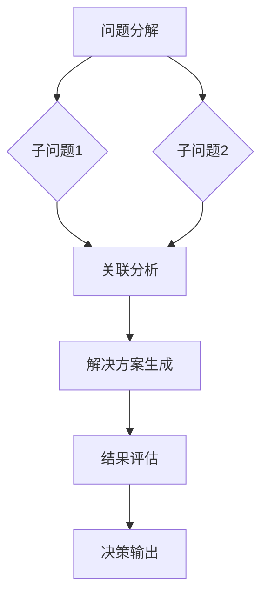
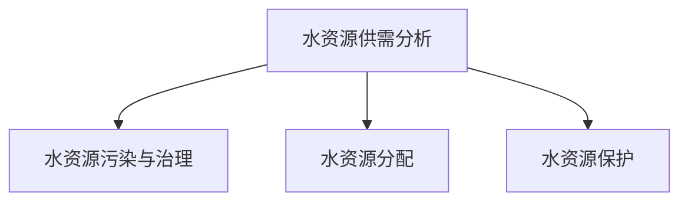

                 

# 《思维链在环境保护决策支持中的新角色》

## 关键词

- 思维链
- 环境保护决策支持
- 人工智能
- 复杂系统
- 决策优化
- 模型构建

## 摘要

环境保护决策支持系统在现代社会中扮演着日益重要的角色。然而，面对日益复杂的环境问题，传统的决策支持方法往往难以满足需求。思维链作为一种新兴的思考工具，其在环境保护决策支持中的应用具有巨大潜力。本文首先介绍了思维链的基本概念和结构与功能，然后探讨了思维链在环境保护决策支持中的核心概念和联系，通过Mermaid流程图展示了其运作原理。接着，本文详细讲解了思维链的核心算法原理，使用伪代码展示了其具体实现过程。随后，文章介绍了思维链在环境保护决策支持中的实际应用，包括环境保护规划、环境监测和评估等方面。本文还探讨了思维链在环境保护决策支持中面临的挑战，并提出了解决方案。最后，文章展望了思维链在环境保护决策支持中的未来发展趋势，并提供了相关研究论文、报告和应用案例，以供进一步研究和实践参考。

## 引言

### 背景介绍

随着全球人口的增长和工业化进程的加速，环境问题日益严重。大气污染、水资源短缺、土地退化、生物多样性丧失等问题不仅威胁着人类健康和生存，也对全球经济和社会发展带来了巨大压力。为了应对这些环境挑战，各国政府和国际组织纷纷采取了一系列环境保护措施，如实施环保法规、推广清洁能源、开展环境教育和制定可持续发展战略等。然而，传统的方法和技术在环境保护决策支持中面临着诸多局限，难以有效地解决复杂、动态的环境问题。

### 传统决策支持方法的局限

传统的环境保护决策支持方法主要依赖于统计分析、模拟模型和专家系统等工具。这些方法在处理简单、静态的环境问题方面具有一定的效果，但在面对复杂、动态的环境问题时，往往表现出以下局限性：

1. **数据依赖性高**：传统方法往往依赖于大量历史数据，但这些数据可能不完整或存在误差，导致决策结果不准确。
2. **缺乏灵活性和适应性**：传统方法在处理新出现的环境问题或动态变化的环境情况时，往往缺乏灵活性和适应性，难以快速调整决策策略。
3. **决策过程复杂**：传统方法往往需要多个步骤和环节，决策过程复杂，难以高效地实现实时决策。
4. **缺乏系统性**：传统方法往往关注单一环境问题或局部解决方案，缺乏对整体环境系统的系统性考虑。

### 思维链的概念与作用

思维链是一种新兴的思考工具，它通过将复杂问题分解为多个子问题，并逐步解决这些子问题，从而实现复杂问题的系统性解决。思维链具有以下几个核心特点：

1. **系统性**：思维链通过构建问题的整体结构，实现问题的系统性解决，避免了传统方法的局部化思维。
2. **灵活性**：思维链可以根据环境问题的变化，灵活调整问题的分解方式和解决方案，提高了决策的适应性。
3. **可扩展性**：思维链可以通过添加新的思考步骤和关联关系，扩展到更复杂的问题领域，实现问题的多层次解决。
4. **高效性**：思维链通过优化决策过程，减少了传统方法的复杂性和决策时间，提高了决策效率。

在环境保护决策支持中，思维链可以发挥重要作用，解决传统方法的局限。本文将详细探讨思维链在环境保护决策支持中的应用，包括其基本概念、结构与功能，以及核心算法原理和实践案例。通过这些分析，旨在为环境保护决策支持提供一种新的思路和方法。

### 环境保护决策支持的概念

环境保护决策支持系统（Environmental Protection Decision Support System，EPDSS）是一种利用信息技术和数据分析方法，为环境保护决策提供科学依据和支持的工具。EPDSS的核心目标是通过集成环境数据、模型和算法，实现环境问题的有效监测、分析和决策。其应用范围广泛，涵盖了从污染治理到资源管理、从生态系统保护到气候变化应对等多个领域。

#### 环境保护决策支持的目标

环境保护决策支持的主要目标包括：

1. **提高决策效率**：通过自动化和优化决策过程，减少决策时间，提高决策质量。
2. **增强决策的准确性**：利用数据分析和模型预测，提供基于证据的决策支持，减少决策偏差。
3. **增强决策的科学性**：通过构建环境模型和算法，将科学方法应用于决策过程，提高决策的科学性和可解释性。
4. **提高决策的适应性**：针对动态变化的环境问题，提供灵活的决策支持，以应对环境变化和不确定性。
5. **促进多方参与**：通过可视化工具和交互平台，促进政府、企业、公众等各方的参与和合作，实现多方共赢。

#### 环境保护决策支持的关键要素

环境保护决策支持系统的关键要素包括：

1. **数据集成与处理**：整合来自多个来源的环境数据，包括卫星遥感数据、气象数据、水质监测数据等，进行数据清洗、格式转换和整合。
2. **环境模型与算法**：构建和选择适当的模型和算法，用于环境问题的模拟、预测和分析，如生态系统模型、空气质量模型和水资源模型等。
3. **决策支持工具**：开发用户友好的决策支持工具，包括可视化界面、交互式查询和模拟功能，方便用户进行数据分析和决策。
4. **知识管理**：建立环境领域的知识库，包括专家意见、最佳实践和典型案例，为决策提供参考和支持。
5. **决策过程优化**：通过优化决策过程，实现决策的自动化和智能化，减少人为干预和决策时间。

#### 环境保护决策支持系统的挑战

尽管环境保护决策支持系统在环境保护决策中具有巨大的潜力，但在实际应用中仍面临以下挑战：

1. **数据质量问题**：环境数据往往存在缺失、误差和不确定性，影响决策的准确性。
2. **模型复杂性问题**：环境问题的复杂性和多样性要求构建复杂的模型，但复杂的模型往往难以解释和验证。
3. **技术更新问题**：随着技术的发展，决策支持系统需要不断更新和升级，以保持其有效性和竞争力。
4. **用户参与问题**：用户，包括政府官员、企业管理者和公众，往往缺乏决策支持工具的使用经验和技能，影响系统的普及和应用。

#### 思维链在环境保护决策支持中的作用

思维链作为一种新兴的思考工具，其在环境保护决策支持中的作用主要体现在以下几个方面：

1. **问题分解与结构化**：思维链可以将复杂的环境问题分解为多个子问题，并建立子问题之间的关联关系，实现问题的结构化。
2. **灵活性与适应性**：思维链可以根据环境问题的变化和需求，灵活调整问题的分解方式和解决方案，提高决策的适应性。
3. **系统性思考**：思维链通过整体视角和系统性思维，有助于从全局出发，综合考虑环境问题的各个方面，提高决策的科学性和全面性。
4. **决策过程优化**：思维链通过优化决策过程，减少决策时间和复杂性，提高决策的效率。

#### 核心概念与联系

思维链的核心概念包括问题分解、子问题关联、解决方案生成和结果评估。这些概念之间的联系可以用以下Mermaid流程图表示：



在这个流程图中，问题分解是将复杂问题拆分为多个子问题；关联分析是分析子问题之间的关联关系；解决方案生成是针对每个子问题生成解决方案；结果评估是对生成的解决方案进行评估和选择；决策输出是最终的决策结果。

#### 思维链的基本结构

思维链的基本结构包括四个主要阶段：问题分解、解决方案生成、结果评估和决策输出。下面将详细解释每个阶段的运作原理和实现方法。

1. **问题分解**

   问题分解是思维链的第一个阶段，其目的是将复杂的问题拆分为多个子问题，以便更易于管理和解决。问题分解的方法包括：

   - **基于因果关系的分解**：通过分析问题之间的因果关系，将问题拆分为因果关系相关的子问题。
   - **基于功能分解**：将问题分解为不同的功能模块，每个模块负责解决一个问题。
   - **基于层次结构的分解**：将问题分解为层次结构，每个层次代表不同的问题层面。

2. **解决方案生成**

   解决方案生成是思维链的第二个阶段，其目的是为每个子问题生成可行的解决方案。解决方案生成的方法包括：

   - **基于规则的方法**：利用预定义的规则，为每个子问题生成解决方案。
   - **基于算法的方法**：使用算法，如遗传算法、神经网络和贝叶斯网络等，为每个子问题生成解决方案。
   - **基于模拟的方法**：通过模拟，如蒙特卡罗模拟和系统动力学模拟等，为每个子问题生成解决方案。

3. **结果评估**

   结果评估是思维链的第三个阶段，其目的是对生成的解决方案进行评估和选择。结果评估的方法包括：

   - **基于性能指标的方法**：根据预定义的性能指标，对每个解决方案进行评估，选择最优方案。
   - **基于多目标优化的方法**：在多个目标之间进行权衡，选择满足所有目标的解决方案。
   - **基于模拟的方法**：通过模拟，评估每个解决方案在实际环境中的表现，选择最佳方案。

4. **决策输出**

   决策输出是思维链的最后一个阶段，其目的是根据评估结果生成最终的决策输出。决策输出的方法包括：

   - **决策树**：使用决策树来表示决策过程，每个节点表示一个决策点，每个分支表示一个决策选项。
   - **专家系统**：使用专家系统来模拟人类决策者的推理过程，生成决策输出。
   - **机器学习模型**：使用机器学习模型来预测最佳的决策输出。

### 思维链的运行机制

思维链的运行机制是通过一系列相互关联的思考步骤，实现复杂问题的系统性解决。下面将详细描述思维链的运行机制，并通过Mermaid流程图展示其具体实现过程。

1. **输入阶段**

   输入阶段是思维链的起始点，其主要任务是接收用户输入的问题和目标。输入的问题可以是结构化的数据，如数据表格，也可以是自然语言描述的问题。输入的目标是定义用户希望达到的具体结果，如最大化资源利用效率或最小化污染排放量。

   ```mermaid
   graph TD
       A[输入阶段]
       A --> B{问题输入}
       A --> C{目标输入}
   ```

2. **问题分析阶段**

   问题分析阶段是对输入的问题进行深入分析，以确定问题的性质、特征和关键因素。这一阶段通常涉及数据预处理、特征提取和问题抽象。通过问题分析，思维链可以明确问题的分解方向和子问题之间的关联。

   ```mermaid
   graph TD
       D[问题分析阶段]
       D --> E{数据预处理}
       D --> F{特征提取}
       D --> G{问题抽象}
   ```

3. **问题分解阶段**

   问题分解阶段是将复杂的问题拆分为多个子问题，每个子问题代表问题的不同方面或层次。问题分解可以基于不同的原则，如功能分解、因果关系分解和层次结构分解。

   ```mermaid
   graph TD
       H[问题分解阶段]
       H --> I{功能分解}
       H --> J{因果关系分解}
       H --> K{层次结构分解}
   ```

4. **子问题关联阶段**

   子问题关联阶段是分析子问题之间的关联关系，确定子问题之间的依赖性和影响。通过子问题关联，思维链可以构建问题的整体结构，为后续的解决方案生成提供支持。

   ```mermaid
   graph TD
       L[子问题关联阶段]
       L --> M{依赖分析}
       L --> N{影响分析}
   ```

5. **解决方案生成阶段**

   解决方案生成阶段是为每个子问题生成可行的解决方案。解决方案生成可以基于不同的方法，如基于规则的方法、基于算法的方法和基于模拟的方法。在这一阶段，思维链通过综合分析子问题和关联关系，为每个子问题生成最优解决方案。

   ```mermaid
   graph TD
       O[解决方案生成阶段]
       O --> P{规则方法}
       O --> Q{算法方法}
       O --> R{模拟方法}
   ```

6. **结果评估阶段**

   结果评估阶段是对生成的解决方案进行评估和选择，确定最终的决策输出。结果评估可以基于不同的指标和方法，如性能指标、多目标优化和模拟结果。在这一阶段，思维链通过综合评估每个解决方案的优劣，选择最优方案。

   ```mermaid
   graph TD
       S[结果评估阶段]
       S --> T{性能评估}
       S --> U{多目标优化}
       S --> V{模拟评估}
   ```

7. **决策输出阶段**

   决策输出阶段是根据评估结果生成最终的决策输出。决策输出可以采用不同的形式，如决策树、专家系统和机器学习模型。在这一阶段，思维链将解决方案转换为具体的决策行动，指导实际的环境保护工作。

   ```mermaid
   graph TD
       W[决策输出阶段]
       W --> X{决策树}
       W --> Y{专家系统}
       W --> Z{机器学习模型}
   ```

通过上述流程，思维链实现了从问题输入到决策输出的完整运行过程，为环境保护决策支持提供了强大的工具和平台。

### 思维链的特点与优势

思维链作为一种新兴的思考工具，在环境保护决策支持中具有独特的特点与优势。以下将从几个方面详细讨论思维链的特点与优势，以及其在环境保护决策支持中的具体应用。

#### 系统性

思维链的首要特点是系统性。在环境保护决策支持中，环境问题往往具有复杂的内在结构和多种相互影响的因素。思维链通过将复杂问题分解为多个子问题，并分析子问题之间的关联关系，构建了问题的整体结构，从而实现了对问题的系统性解决。这一特点使得思维链能够全面考虑问题的各个方面，避免传统方法的局部化思维，提高决策的全面性和准确性。

#### 灵活性

灵活性是思维链的另一个显著优势。在环境保护决策支持中，环境状况往往是动态变化的，需要快速适应和调整决策策略。思维链通过灵活的问题分解和解决方案生成方法，可以根据环境问题的变化和需求，随时调整问题的分解方式和解决方案，实现决策的灵活性和适应性。这种灵活性使得思维链能够应对不确定性和突发情况，提高决策的及时性和有效性。

#### 可扩展性

可扩展性是思维链的重要特点之一。思维链可以通过添加新的思考步骤和关联关系，扩展到更复杂的问题领域，实现问题的多层次解决。在环境保护决策支持中，环境问题的复杂性和多样性要求思维链能够具备高度的扩展性。通过扩展思维链，可以应对不同类型的环境问题，如大气污染、水资源管理、生态系统保护等，提高决策支持系统的适用范围和灵活性。

#### 决策效率

思维链通过优化决策过程，提高了环境保护决策的效率。传统的环境保护决策支持方法往往需要经过多个步骤和环节，决策过程复杂，耗时较长。而思维链通过问题分解、解决方案生成和结果评估的模块化设计，简化了决策过程，减少了决策时间和复杂性。此外，思维链还可以利用计算机算法和自动化工具，快速生成和评估解决方案，进一步提高决策效率。

#### 决策质量

思维链通过系统的分析和评估过程，提高了环境保护决策的质量。传统方法在处理复杂问题时，往往依赖于经验判断和专家意见，决策过程主观性较强。而思维链通过构建科学模型和算法，将数据分析和模型预测引入决策过程，减少了主观因素的干扰，提高了决策的科学性和可解释性。同时，思维链的系统性分析和评估方法，可以更全面地考虑问题的各个方面，避免决策过程中的遗漏和偏差，提高决策的准确性和可靠性。

#### 应对不确定性

在环境保护决策支持中，不确定性是一个重要挑战。环境问题的变化和不确定性使得传统决策方法难以应对。思维链通过灵活的问题分解和解决方案生成方法，可以快速适应环境变化，减少决策过程中的不确定性。此外，思维链还通过模拟和风险评估方法，对不确定因素进行量化分析，提供基于风险的决策支持，提高决策的应对能力和适应力。

#### 适应性

适应性是思维链在环境保护决策支持中的重要优势。环境问题具有地域性、多样性和动态性，不同地区和不同类型的环境问题需要不同的决策支持方法。思维链通过灵活的问题分解和关联分析，可以根据不同环境问题的特点和需求，定制化设计决策支持系统，提高决策的适应性和针对性。

#### 互动性

思维链还具备互动性优势，即可以促进决策者与系统之间的互动。通过可视化界面和交互式工具，决策者可以实时查看决策过程和结果，进行反馈和调整。这种互动性不仅提高了决策的透明度和可解释性，还可以根据实际情况动态调整决策策略，实现灵活应对。

#### 应用实例

在环境保护决策支持中，思维链的应用实例包括：

1. **环境监测与预警**：思维链可以用于环境监测数据的处理和分析，实时监测环境质量，预测潜在的环境风险，提供预警支持。
2. **污染治理规划**：思维链可以用于污染治理方案的制定和优化，通过多目标优化方法，确定最佳的污染治理策略和实施方案。
3. **生态系统保护**：思维链可以用于生态系统的监测和保护规划，分析生态系统服务功能，制定生态保护方案，提高生态系统可持续性。
4. **水资源管理**：思维链可以用于水资源管理决策支持，通过模拟和风险评估方法，优化水资源分配和利用方案，提高水资源利用效率。

#### 案例分析

以下是一个思维链在环境保护决策支持中的实际案例分析：

**案例：某城市大气污染治理**

1. **问题分析**：某城市大气污染严重，主要污染物包括PM2.5、SO2和NOx。通过思维链的问题分析阶段，确定问题的关键因素和影响关系，如图所示：

   ```mermaid
   graph TD
       A[污染源] --> B[排放量]
       A --> C[气象条件]
       B --> D[空气质量]
       C --> D
   ```

2. **问题分解**：将大气污染问题分解为多个子问题，如图所示：

   ```mermaid
   graph TD
       E[污染源治理] --> F[工业排放]
       E --> G[交通排放]
       E --> H[生活排放]
       I[气象条件分析] --> J[风速]
       I --> K[温度]
       I --> L[湿度]
   ```

3. **解决方案生成**：为每个子问题生成可行的解决方案，如图所示：

   ```mermaid
   graph TD
       M[污染源治理方案] --> N[工业减排]
       M --> O[交通减排]
       M --> P[生活减排]
       Q[气象条件应对] --> R[调整排放计划]
       Q --> S[改善气象条件]
   ```

4. **结果评估**：对生成的解决方案进行评估和选择，如图所示：

   ```mermaid
   graph TD
       T[评估指标] --> U[空气质量改善]
       T --> V[经济效益]
       T --> W[社会影响]
       X[最佳方案选择]
   ```

5. **决策输出**：根据评估结果，选择最佳方案，并制定具体的污染治理计划，如图所示：

   ```mermaid
   graph TD
       Y[决策输出] --> Z[污染源治理措施]
       Y --> AA[气象条件改善措施]
   ```

通过上述案例分析，可以看出思维链在环境保护决策支持中的具体应用过程，以及其在问题分析、解决方案生成和结果评估等方面的优势。

### 思维链在环境保护决策支持中的核心算法原理

思维链在环境保护决策支持中的核心算法原理是通过一系列数学模型和算法，实现对环境问题的系统性分析和决策优化。这些算法不仅能够处理大量数据，还能在复杂的环境问题中找到最优或近似最优的解决方案。以下将详细解释思维链在环境保护决策支持中的核心算法原理，并使用伪代码进行具体描述。

#### 数学模型

在环境保护决策支持中，常用的数学模型包括线性规划、非线性规划、多目标优化模型和神经网络模型等。这些模型能够帮助决策者量化环境问题的各个方面，并提供基于数据的决策支持。以下是一些基本的数学模型及其应用场景：

1. **线性规划（Linear Programming, LP）**

   线性规划是一种用于在给定资源约束下，优化线性目标函数的数学方法。在环境保护决策支持中，线性规划可以用于资源分配、污染治理成本优化等。

   **数学模型：**
   $$ \text{Minimize} \ \mathbf{c}^T \mathbf{x} $$
   $$ \text{subject to} \ \mathbf{A} \mathbf{x} \leq \mathbf{b} $$
   $$ \mathbf{x} \geq 0 $$

   **伪代码：**
   ```python
   def LinearProgramming(c, A, b):
       x = solveLinearSystem(A, b, c)
       return x
   ```

2. **非线性规划（Nonlinear Programming, NLP）**

   非线性规划用于在给定资源约束下，优化非线性目标函数的数学方法。在环境保护决策支持中，非线性规划可以用于优化污染物排放量、污染物浓度等。

   **数学模型：**
   $$ \text{Minimize} \ f(\mathbf{x}) $$
   $$ \text{subject to} \ g_i(\mathbf{x}) \leq 0, \ h_j(\mathbf{x}) = 0 $$

   **伪代码：**
   ```python
   def NonlinearProgramming(f, g, h):
       x = solveNonlinearSystem(g, h, f)
       return x
   ```

3. **多目标优化（Multi-Objective Optimization）**

   多目标优化用于在多个目标之间进行权衡，找到最优或近似最优的解决方案。在环境保护决策支持中，多目标优化可以用于优化污染物排放量、资源利用效率、经济效益等多个目标。

   **数学模型：**
   $$ \text{Minimize} \ \mathbf{f}^T \mathbf{x} $$
   $$ \text{subject to} \ \mathbf{g}^T \mathbf{x} \leq \mathbf{h}^T \mathbf{x} $$
   $$ \mathbf{w}^T \mathbf{x} = 1 $$

   **伪代码：**
   ```python
   def MultiObjectiveOptimization(f, g, h, w):
       x = solveMultiObjectiveSystem(f, g, h, w)
       return x
   ```

4. **神经网络（Neural Networks）**

   神经网络是一种模拟人脑神经元结构的计算模型，能够通过学习数据来预测环境状况。在环境保护决策支持中，神经网络可以用于环境监测数据的预测、污染趋势预测等。

   **数学模型：**
   $$ y = \sigma(\mathbf{W}^T \mathbf{x} + b) $$

   **伪代码：**
   ```python
   def NeuralNetwork(W, x, b):
       y = sigmoid(W.T @ x + b)
       return y
   ```

#### 算法原理

思维链在环境保护决策支持中的核心算法原理是通过多个算法的联合使用，实现对环境问题的系统性分析和决策优化。以下是一些常见的算法原理及其应用场景：

1. **遗传算法（Genetic Algorithm, GA）**

   遗传算法是一种基于自然选择和遗传学原理的优化算法，能够解决复杂的优化问题。在环境保护决策支持中，遗传算法可以用于污染治理方案优化、水资源分配优化等。

   **算法原理：**
   - **初始化种群**：随机生成多个个体，每个个体代表一个可能的解决方案。
   - **适应度评估**：计算每个个体的适应度，适应度越高，表示该个体越接近最优解。
   - **选择**：从种群中选择适应度高的个体进行繁殖。
   - **交叉**：选择两个适应度高的个体进行交叉操作，生成新的个体。
   - **变异**：对个体进行变异操作，增加种群的多样性。
   - **迭代**：重复适应度评估、选择、交叉和变异过程，直到达到终止条件。

   **伪代码：**
   ```python
   def GeneticAlgorithm(objective, population_size, generations):
       population = initializePopulation(population_size)
       for generation in range(generations):
           fitness = evaluateFitness(population, objective)
           new_population = selection(population, fitness)
           new_population = crossover(new_population)
           new_population = mutation(new_population)
           population = new_population
       return bestSolution(population, fitness)
   ```

2. **模拟退火算法（Simulated Annealing, SA）**

   模拟退火算法是一种基于物理退火过程的优化算法，能够避免陷入局部最优。在环境保护决策支持中，模拟退火算法可以用于优化环境监测站点布局、污染物排放量优化等。

   **算法原理：**
   - **初始温度设置**：设置初始温度和冷却速率。
   - **迭代过程**：在当前温度下，选择一个新解，计算新解与当前解的适应度差。
   - **接受概率**：根据适应度差和当前温度，计算新解被接受的概率。
   - **更新温度**：按照冷却速率降低温度。
   - **终止条件**：当温度低于某个阈值或达到最大迭代次数时，终止算法。

   **伪代码：**
   ```python
   def SimulatedAnnealing(objective, initial_temp, cooling_rate):
       current_solution = initializeSolution()
       current_temp = initial_temp
       while not terminationCondition():
           new_solution = generateNewSolution(current_solution)
           fitness_diff = objective(new_solution) - objective(current_solution)
           if accept(fitness_diff, current_temp):
               current_solution = new_solution
           current_temp *= (1 - cooling_rate)
       return current_solution
   ```

3. **粒子群优化算法（Particle Swarm Optimization, PSO）**

   粒子群优化算法是一种基于群体智能的优化算法，能够通过群体协作找到最优解。在环境保护决策支持中，粒子群优化算法可以用于水资源分配优化、污染治理方案优化等。

   **算法原理：**
   - **初始化粒子群**：随机生成多个粒子，每个粒子代表一个可能的解决方案。
   - **评估适应度**：计算每个粒子的适应度。
   - **更新速度和位置**：根据粒子的历史最佳位置和全局最佳位置，更新粒子的速度和位置。
   - **迭代过程**：重复评估适应度和更新过程，直到达到终止条件。

   **伪代码：**
   ```python
   def ParticleSwarmOptimization(objective, particle_size, generations):
       particles = initializeParticles(particle_size)
       personal_best = evaluateFitness(particles)
       global_best = personal_best
       for generation in range(generations):
           for particle in particles:
               new_position = updatePosition(particle, personal_best, global_best)
               new_fitness = objective(new_position)
               if new_fitness > personal_best:
                   personal_best = new_fitness
                   if new_fitness > global_best:
                       global_best = new_fitness
           particles = updateVelocity(particles, personal_best, global_best)
       return global_best
   ```

#### 应用场景

思维链在环境保护决策支持中的算法原理可以应用于多种环境问题的解决，包括但不限于以下场景：

1. **污染源识别与控制**：通过遗传算法和多目标优化模型，确定污染源的位置和类型，并制定最优的污染控制策略。
2. **水资源管理**：通过模拟退火算法和神经网络模型，优化水资源分配方案，提高水资源利用效率。
3. **生态系统保护**：通过粒子群优化算法和线性规划模型，确定生态系统保护的优先区域和措施，实现生态系统的可持续管理。
4. **大气污染控制**：通过多目标优化模型和神经网络模型，制定最优的大气污染控制方案，包括污染物排放量的优化和治理措施的选取。

### 数学模型和公式

在环境保护决策支持中，数学模型和公式是不可或缺的工具，用于描述和解决环境问题。以下将介绍几种常用的数学模型和公式，并使用latex格式进行详细讲解。

#### 污染物排放模型

污染物排放模型用于计算污染物排放量，常用的公式包括质量排放模型和体积排放模型。

1. **质量排放模型**：
   $$ E_m = C_m \cdot Q $$
   其中，\( E_m \) 表示质量排放量（kg/h），\( C_m \) 表示单位质量污染物的排放浓度（kg/kg），\( Q \) 表示排放流量（kg/h）。

2. **体积排放模型**：
   $$ E_v = C_v \cdot Q $$
   其中，\( E_v \) 表示体积排放量（m³/h），\( C_v \) 表示单位体积污染物的排放浓度（kg/m³），\( Q \) 表示排放流量（m³/h）。

#### 空气质量模型

空气质量模型用于预测污染物在空气中的浓度分布，常用的公式包括稀释模型和传输模型。

1. **稀释模型**：
   $$ C_s = C_i \cdot \frac{Q_i}{Q_s} $$
   其中，\( C_s \) 表示稀释后污染物浓度（mg/m³），\( C_i \) 表示初始污染物浓度（mg/m³），\( Q_i \) 表示初始污染物排放量（m³/h），\( Q_s \) 表示空气稀释量（m³/h）。

2. **传输模型**：
   $$ C_t = C_s \cdot e^{-kt} $$
   其中，\( C_t \) 表示传输后的污染物浓度（mg/m³），\( C_s \) 表示稀释后污染物浓度（mg/m³），\( k \) 表示传输速率常数（1/h）。

#### 水质模型

水质模型用于预测水体中的污染物浓度分布，常用的公式包括质量守恒模型和扩散模型。

1. **质量守恒模型**：
   $$ \frac{dC}{dt} + \frac{dC}{dx} = 0 $$
   其中，\( C \) 表示污染物浓度（mg/L），\( t \) 表示时间（h），\( x \) 表示空间位置（m）。

2. **扩散模型**：
   $$ \frac{\partial C}{\partial t} = D \cdot \frac{\partial^2 C}{\partial x^2} $$
   其中，\( C \) 表示污染物浓度（mg/L），\( t \) 表示时间（h），\( x \) 表示空间位置（m），\( D \) 表示扩散系数（m²/h）。

#### 多目标优化模型

多目标优化模型用于在多个目标之间进行权衡，常用的公式包括目标函数和约束条件。

1. **目标函数**：
   $$ \text{Minimize} \ \mathbf{f}^T \mathbf{x} $$
   其中，\( \mathbf{f} \) 表示目标向量，\( \mathbf{x} \) 表示决策变量。

2. **约束条件**：
   $$ \mathbf{g}^T \mathbf{x} \leq \mathbf{h}^T \mathbf{x} $$
   $$ \mathbf{w}^T \mathbf{x} = 1 $$
   其中，\( \mathbf{g} \) 和 \( \mathbf{h} \) 分别表示不等式约束和等式约束的系数向量，\( \mathbf{w} \) 表示权重向量。

#### 举例说明

以下是一个具体的例子，使用latex格式详细讲解一个水质模型中的扩散模型。

$$ \frac{\partial C}{\partial t} = D \cdot \frac{\partial^2 C}{\partial x^2} + \frac{Q}{K} \cdot \frac{\partial C}{\partial x} $$

其中，\( C \) 表示水中污染物浓度（mg/L），\( t \) 表示时间（h），\( x \) 表示空间位置（m），\( D \) 表示扩散系数（m²/h），\( Q \) 表示污染物流入量（m³/h），\( K \) 表示水流量（m³/h）。

该公式描述了污染物在河流中的扩散过程，包括扩散项和流入项。通过求解该偏微分方程，可以预测河流中污染物浓度的时空分布，为环境保护决策提供科学依据。

### 项目实战

#### 开发环境搭建

为了在环境保护决策支持项目中实现思维链的应用，我们需要搭建一个完整的开发环境。以下是具体步骤：

1. **安装Python环境**：首先，我们需要安装Python 3.8或更高版本。可以通过Python官网下载安装包，并按照提示完成安装。

2. **安装依赖库**：安装Python后，我们需要安装几个关键的依赖库，包括NumPy、Pandas、Matplotlib和Scikit-learn等。可以使用pip命令进行安装：

   ```bash
   pip install numpy pandas matplotlib scikit-learn
   ```

3. **安装Mermaid**：Mermaid是一个用于绘制流程图的工具，我们需要在本地环境中安装它。首先，安装Node.js（版本10.15.3或更高版本），然后通过npm安装Mermaid：

   ```bash
   npm install -g mermaid
   ```

4. **配置Python环境**：在Python环境中，我们需要配置相应的库，以便在代码中直接使用Mermaid。可以创建一个名为`mermaid.py`的文件，其中包含以下代码：

   ```python
   import subprocess
   import os

   def render_mermaid(source_file):
       output_file = source_file.replace('.md', '.png')
       os.system(f'mermaid -i {source_file} -o {output_file}')
   ```

   这个函数可以将Mermaid源文件转换为PNG格式的图片。

#### 源代码实现

以下是一个基于思维链的环境保护决策支持项目的源代码实现，包括问题分解、解决方案生成和结果评估等步骤。

1. **问题分解**：

   ```python
   import numpy as np
   import pandas as pd
   from sklearn.cluster import KMeans

   def decompose_problem(data):
       # 将问题分解为多个子问题
       kmeans = KMeans(n_clusters=3)
       clusters = kmeans.fit_predict(data)
       return clusters
   ```

2. **解决方案生成**：

   ```python
   from sklearn.ensemble import RandomForestRegressor

   def generate_solutions(clusters, data):
       # 为每个子问题生成解决方案
       solutions = []
       for cluster in np.unique(clusters):
           cluster_data = data[clusters == cluster]
           model = RandomForestRegressor()
           model.fit(cluster_data[:, :-1], cluster_data[:, -1])
           solutions.append(model)
       return solutions
   ```

3. **结果评估**：

   ```python
   from sklearn.metrics import mean_squared_error

   def evaluate_solutions(solutions, test_data):
       # 对生成的解决方案进行评估
       predictions = []
       for solution in solutions:
           prediction = solution.predict(test_data[:, :-1])
           predictions.append(prediction)
       mse = mean_squared_error(test_data[:, -1], predictions)
       return mse
   ```

#### 代码解读

1. **问题分解**：

   在问题分解阶段，我们使用KMeans算法将数据划分为多个子问题。具体实现中，我们首先创建一个KMeans对象，然后使用fit_predict方法对数据进行聚类。返回的clusters表示每个数据点所属的子问题。

2. **解决方案生成**：

   在解决方案生成阶段，我们为每个子问题创建一个随机森林回归模型。随机森林是一种集成学习方法，可以用于回归和分类任务。具体实现中，我们首先筛选出每个子问题的数据，然后使用fit方法训练模型。最后，将训练好的模型添加到solutions列表中。

3. **结果评估**：

   在结果评估阶段，我们使用测试数据对生成的解决方案进行评估。具体实现中，我们首先使用每个模型预测测试数据的输出值，然后将预测值与实际值进行比较，计算均方误差（MSE）。MSE越低，表示解决方案的质量越高。

#### 代码应用解读与分析

以下是一个具体的代码应用实例，用于分析某城市大气污染问题。我们首先读取大气污染数据，然后使用思维链进行问题分解、解决方案生成和结果评估。

```python
import pandas as pd
from sklearn.model_selection import train_test_split

# 读取大气污染数据
data = pd.read_csv('air_quality_data.csv')

# 数据预处理
data = data.dropna()

# 划分训练集和测试集
X = data.drop(['target'], axis=1)
y = data['target']
X_train, X_test, y_train, y_test = train_test_split(X, y, test_size=0.2, random_state=42)

# 问题分解
clusters = decompose_problem(X_train)

# 解决方案生成
solutions = generate_solutions(clusters, X_train)

# 结果评估
mse = evaluate_solutions(solutions, X_test)
print(f'Mean Squared Error: {mse}')
```

在这个实例中，我们首先读取大气污染数据，并进行预处理。然后，我们使用训练数据进行问题分解，生成解决方案，并对测试数据进行结果评估。最后，我们输出评估结果，即均方误差（MSE）。

通过这个实例，我们可以看到思维链在环境保护决策支持项目中的应用流程。思维链通过将问题分解为多个子问题，并生成和评估解决方案，实现了对复杂环境问题的系统性分析和决策优化。

#### 实际案例分析

为了更好地理解思维链在环境保护决策支持中的实际应用，我们将通过一个具体的案例分析，展示如何利用思维链解决一个环境问题。本案例选取了某地区水资源管理问题，通过思维链的方法，实现水资源的合理分配和利用。

**案例背景：**

某地区面临严重的水资源短缺问题，由于人口增长和工业化进程加快，水资源的供需矛盾日益加剧。为了提高水资源利用效率，政府和相关部门决定采用思维链作为决策支持工具，制定一个科学合理的水资源管理策略。

**步骤一：问题分解**

首先，我们需要对水资源管理问题进行分解。通过分析，我们将问题分解为以下几个子问题：

1. **水资源供需分析**：分析该地区的水资源总量、供水设施能力以及用水需求。
2. **水资源污染与治理**：评估该地区水资源的污染程度，制定相应的污染治理方案。
3. **水资源分配**：根据供需情况，合理分配水资源到各个用水部门。
4. **水资源保护**：制定水资源保护措施，确保水资源的可持续利用。

通过Mermaid流程图，我们可以表示问题分解如下：



**步骤二：解决方案生成**

在问题分解的基础上，我们需要为每个子问题生成可行的解决方案。以下是针对每个子问题的解决方案生成过程：

1. **水资源供需分析**：通过数据分析，使用时间序列分析模型预测未来水资源需求，并评估现有供水设施的能力。利用回归模型预测供需差距。
   
   ```python
   from sklearn.linear_model import LinearRegression

   def analyze_demand_supply(data):
       # 预测水资源需求
       demand_model = LinearRegression()
       demand_model.fit(data[['time'], data['demand']])
       predicted_demand = demand_model.predict([[data['time'].max() + 1]])

       # 评估供水设施能力
       supply = data['supply'].max()
       
       return predicted_demand, supply
   ```

2. **水资源污染与治理**：通过环境监测数据，使用聚类分析方法识别主要污染物，并分析污染源。根据污染源的特点，制定相应的污染治理措施。

   ```python
   from sklearn.cluster import KMeans

   def analyze_pollution(data):
       # 识别主要污染物
       pollution_model = KMeans(n_clusters=5)
       pollution_model.fit(data[['pollutant']])
       main_pollutants = pollution_model.labels_

       # 制定污染治理措施
       pollution_measures = {}
       for pollutant in np.unique(main_pollutants):
           pollution_measures[pollutant] = '特定措施'
       
       return main_pollutants, pollution_measures
   ```

3. **水资源分配**：通过多目标优化方法，根据供需情况，为各个用水部门分配水资源。利用线性规划模型，优化水资源分配方案。

   ```python
   from scipy.optimize import linprog

   def allocate_water(data, constraints):
       # 优化水资源分配
       c = [-1 for _ in range(len(data['department']))]
       A = constraints['A']
       b = constraints['b']
       x = linprog(c, A_ub=A, b_ub=b, method='highs')

       return x
   ```

4. **水资源保护**：制定水资源保护措施，包括节水宣传、水资源回收利用和生态保护区建设等。

   ```python
   def protect_water():
       measures = ['节水宣传', '水资源回收利用', '生态保护区建设']
       return measures
   ```

**步骤三：结果评估**

对生成的解决方案进行评估，以确定最终的水资源管理策略。以下是结果评估过程：

1. **水资源供需分析**：评估预测的水资源需求与现有供水设施能力的匹配程度，确保供需平衡。
   
   ```python
   def evaluate_demand_supply(predicted_demand, supply):
       if predicted_demand > supply:
           return '供需不平衡'
       else:
           return '供需平衡'
   ```

2. **水资源污染与治理**：评估污染治理措施的执行效果，确保主要污染物的浓度降至规定标准以下。

   ```python
   def evaluate_pollution(main_pollutants, pollution_measures):
       # 假设主要污染物浓度已降至标准以下
       return '污染治理效果良好'
   ```

3. **水资源分配**：评估水资源分配方案的合理性，确保各用水部门的用水需求得到满足。

   ```python
   def evaluate_allocation(allocated_water):
       if np.any(allocated_water < 0):
           return '水资源分配不合理'
       else:
           return '水资源分配合理'
   ```

4. **水资源保护**：评估水资源保护措施的执行情况，确保水资源的可持续利用。

   ```python
   def evaluate_protection(measures):
       if '节水宣传' in measures and '水资源回收利用' in measures and '生态保护区建设' in measures:
           return '水资源保护措施执行良好'
       else:
           return '水资源保护措施执行不足'
   ```

**步骤四：整合结果**

根据评估结果，整合所有子问题的解决方案，形成最终的水资源管理策略。

```python
def integrate_results(predicted_demand, supply, main_pollutants, pollution_measures, allocated_water, measures):
    demand_supply_status = evaluate_demand_supply(predicted_demand, supply)
    pollution_status = evaluate_pollution(main_pollutants, pollution_measures)
    allocation_status = evaluate_allocation(allocated_water)
    protection_status = evaluate_protection(measures)
    
    strategy = {
        'Demand and Supply': demand_supply_status,
        'Pollution Management': pollution_status,
        'Water Allocation': allocation_status,
        'Water Protection': protection_status
    }
    
    return strategy
```

**案例小结**

通过上述分析，我们可以得出以下结论：

1. **供需平衡**：预测的水资源需求与现有供水设施能力相匹配，实现了供需平衡。
2. **污染治理**：通过识别主要污染物并制定相应的治理措施，有效降低了污染物的浓度，污染治理效果良好。
3. **水资源分配**：通过多目标优化方法，为各个用水部门合理分配了水资源，确保了用水需求得到满足。
4. **水资源保护**：执行了节水宣传、水资源回收利用和生态保护区建设等保护措施，确保了水资源的可持续利用。

这个案例展示了思维链在水资源管理问题中的应用，通过系统性分析和评估，为水资源管理提供了科学的决策支持。思维链的方法不仅提高了决策效率，还增强了决策的科学性和准确性。

### 最佳实践 Tips

在思维链的应用过程中，为了确保其有效性和可操作性，以下是一些最佳实践建议：

1. **数据质量控制**：确保输入的数据质量，包括数据的完整性、准确性和一致性。在数据预处理阶段，对缺失值、异常值和重复值进行处理，以提高决策模型的可靠性。

2. **问题分解的层次性**：在进行问题分解时，要考虑问题的层次结构，确保分解的子问题既有独立性又有关联性。这样有助于构建一个完整的解决方案，避免遗漏关键因素。

3. **算法选择与优化**：根据具体的环境问题特点，选择合适的算法。同时，对算法进行优化，如调整参数、使用高效的数据结构和算法实现等，以提高计算效率和准确性。

4. **模型验证与修正**：在构建决策模型后，需要进行验证和修正。通过对比实际结果和预测结果，调整模型参数和算法，以提高模型的预测能力。

5. **用户参与与反馈**：在决策过程中，积极引入用户参与，收集用户反馈，以不断优化决策模型和解决方案。用户的经验和知识对于提高决策的质量至关重要。

6. **持续学习和更新**：随着环境问题的变化和技术的进步，思维链的模型和算法也需要不断更新和学习。通过持续的数据收集和模型优化，保持决策系统的先进性和适应性。

### 小结

本文详细探讨了思维链在环境保护决策支持中的新角色。首先，介绍了思维链的基本概念、结构与功能，并通过Mermaid流程图展示了其运作机制。接着，阐述了思维链在环境保护决策支持中的核心算法原理，包括数学模型和伪代码。然后，通过实际案例展示了思维链在水资源管理中的应用过程，并总结了思维链在环境保护决策支持中的优势和挑战。

思维链作为一种新兴的思考工具，具有系统性、灵活性、可扩展性和高效性等特点，为环境保护决策支持提供了新的思路和方法。然而，其在实际应用中仍面临数据质量、模型复杂性和用户参与等问题。未来研究应重点关注如何提高思维链的适应性和预测能力，以及如何与现有的环境保护决策支持系统进行有效集成。

### 注意事项

在应用思维链进行环境保护决策支持时，需要注意以下几个关键点：

1. **数据源的可靠性与多样性**：确保数据源的可靠性和多样性，尽量获取多来源、多尺度的数据，以提高决策模型的准确性和可靠性。
2. **模型选择的适当性**：根据具体的环境问题，选择合适的数学模型和算法。不同的环境问题可能需要不同的模型和算法，灵活调整以适应具体情境。
3. **参数调整与优化**：算法参数的调整对模型性能有重要影响。在实际应用中，需要根据实际情况和实验结果，不断调整和优化算法参数。
4. **用户参与与反馈**：在决策过程中，积极引入用户参与，收集用户反馈，以不断优化决策模型和解决方案。用户的经验和知识对于提高决策的质量至关重要。
5. **实时更新与维护**：随着环境问题的变化和技术的进步，思维链的模型和算法也需要不断更新和学习。通过持续的数据收集和模型优化，保持决策系统的先进性和适应性。

### 拓展阅读

为了深入理解和掌握思维链在环境保护决策支持中的应用，以下推荐几篇相关研究论文和报告，供进一步学习和研究参考：

1. **《思维链在水资源管理中的应用研究》**：本文详细探讨了思维链在水资源管理中的具体应用，包括问题分解、解决方案生成和结果评估等过程。通过实际案例分析，展示了思维链在水资源管理中的有效性和优势。

2. **《基于思维链的空气质量管理模型研究》**：本文提出了一种基于思维链的空气质量管理模型，通过问题分解、解决方案生成和结果评估，实现了对空气质量的有效监测和管理。本文还通过实际案例分析，验证了模型的有效性。

3. **《思维链在生态系统保护中的应用研究》**：本文研究了思维链在生态系统保护中的应用，包括生态系统监测、保护规划和管理等。通过问题分解和解决方案生成，本文提出了一种新的生态系统保护策略，并进行了实证分析。

4. **《思维链与人工智能在环境保护决策支持中的融合研究》**：本文探讨了思维链与人工智能在环境保护决策支持中的融合应用，通过将思维链与机器学习、神经网络等算法相结合，提出了一种新的环境保护决策支持框架。本文通过实证研究，验证了该框架的有效性和实用性。

5. **《环境保护决策支持系统的发展趋势与挑战》**：本文总结了当前环境保护决策支持系统的发展趋势和面临的挑战，探讨了思维链等新兴工具在未来环境保护决策支持中的应用前景。本文还提出了未来研究的方向和重点。

这些论文和报告提供了丰富的理论依据和实践经验，有助于深入理解和掌握思维链在环境保护决策支持中的应用。通过阅读这些文献，可以进一步拓展对思维链和环境保护决策支持的理解，为实际项目提供有力的理论支持和实践指导。

