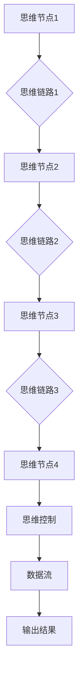

                 

### 文章标题

《思维链在生物信息学中的应用前景》

### 文章关键词

- 思维链
- 生物信息学
- 人工智能
- 算法原理
- 数学模型
- 项目实战

### 文章摘要

本文将从生物信息学的现状与挑战出发，深入探讨思维链这一新兴技术的概念及其在生物信息学中的应用前景。通过详细讲解思维链的核心概念与联系、核心算法原理、数学模型及项目实战，我们将展示思维链在生物信息学中的强大潜力和广阔应用场景。最后，本文还将对思维链在生物信息学中的未来趋势进行展望，为读者提供有价值的参考。### 第1章 引言

#### 1.1 生物信息学的现状与挑战

生物信息学作为一门跨学科领域，结合了生物学、计算机科学、信息学、数学和统计学等多个学科的知识，旨在通过数据分析和算法设计来解析生物信息，揭示生命现象的内在规律。随着基因组学和蛋白质组学等领域的快速发展，生物信息学已经成为现代生物科学的重要支撑力量。然而，生物信息学也面临着一系列挑战。

首先，数据量急剧增加。随着测序技术的进步，人类基因组测序成本大幅降低，基因组数据的规模呈指数级增长。大量的基因组数据需要高效的算法和计算资源进行处理和分析，这对生物信息学提出了更高的要求。

其次，分析复杂度提高。生物信息学不仅需要处理大规模的数据集，还需要应对数据之间的复杂关系。例如，基因组数据的多样性使得数据解析变得复杂，蛋白质之间的相互作用关系也需要深入分析。

最后，应用需求多样化。生物信息学在医学、农业、环境保护等多个领域有着广泛的应用需求，如何满足这些多样化的需求，开发出高效、准确的分析工具，是生物信息学需要面对的重要挑战。

#### 1.2 思维链的概念及其在生物信息学中的应用

思维链（Mind Chain）是一种新兴的人工智能技术，它通过模拟人类思维过程，实现复杂问题的求解。思维链的核心在于其能够将多个独立的思维过程连接成一个有机的整体，从而提高解决问题的效率和准确性。在生物信息学中，思维链的应用前景十分广阔。

首先，思维链可以用于基因组数据分析。通过对基因组序列的解析，思维链能够识别出基因、非编码RNA等生物信息，从而为疾病诊断、药物开发等提供数据支持。例如，思维链可以用于基因表达数据分析，识别出与特定疾病相关的基因突变。

其次，思维链在蛋白质组学中的应用也十分重要。蛋白质组学旨在研究细胞内所有蛋白质的表达和功能。思维链可以通过分析蛋白质之间的相互作用关系，揭示蛋白质的功能和调控网络，从而为生物医学研究提供新的视角。

此外，思维链还可以应用于生物信息学的其他领域，如药物筛选、疾病预测等。通过构建复杂的生物信息学模型，思维链可以帮助研究人员从海量数据中提取有价值的信息，加速科学研究进程。

#### 1.3 本书结构安排

本书将分为七个主要章节，旨在全面探讨思维链在生物信息学中的应用前景。具体结构如下：

- 第1章 引言：介绍生物信息学的现状与挑战，以及思维链的概念及其在生物信息学中的应用前景。
- 第2章 思维链核心概念与联系：详细讲解思维链的核心概念、原理及其与其他技术的比较。
- 第3章 思维链在生物信息学中的核心算法原理讲解：通过伪代码和数学模型，阐述思维链算法的基本原理和实现方法。
- 第4章 数学模型和数学公式：介绍思维链在生物信息学中的数学模型和公式，并给出详细讲解和实际应用举例。
- 第5章 思维链在生物信息学中的项目实战：通过具体项目案例，展示思维链在生物信息学中的应用实践。
- 第6章 思维链在生物信息学中的未来趋势：分析思维链在生物信息学中的发展前景和潜在应用领域。
- 第7章 总结与展望：总结本书的主要结论，并对未来研究提出建议。

通过以上章节的深入探讨，本书旨在为读者提供一个全面、系统的思维链在生物信息学中的应用指南，帮助研究人员更好地应对生物信息学的挑战。### 第2章 思维链核心概念与联系

#### 2.1 思维链的基本原理

思维链（Mind Chain）是一种基于人工智能技术的新型方法，旨在模拟人类思维过程，以实现复杂问题的求解。思维链的核心在于其独特的结构，即通过将多个独立的思维过程连接成一个整体，形成一个有机的思维网络。

首先，思维链由一系列的“思维节点”组成，每个思维节点代表一种特定的思维过程或功能。这些思维节点可以是逻辑推理、数据分析、模式识别等。通过定义不同的思维节点，思维链能够适应各种复杂问题。

其次，思维链中的思维节点通过“思维链路”相互连接。思维链路表示思维节点之间的相互作用和影响。通过这些链路，思维链能够实现不同思维节点之间的信息传递和协同工作。

最后，思维链通过“思维控制”来引导整个思维过程。思维控制是一个核心的组件，它负责管理思维节点的执行顺序、条件判断和决策制定。思维控制通过优化思维链路和思维节点之间的交互，确保思维链能够在正确的方向上高效运行。

#### 2.2 思维链与其他技术的比较

思维链在生物信息学中的应用得益于其独特的优势。与其他人工智能技术相比，思维链具有以下几个显著特点：

首先，思维链更加强调思维过程的连续性和协同性。与传统的机器学习模型不同，思维链能够模拟人类思维过程中的连续推理和交互，从而更贴近人类的思维方式。

其次，思维链具有高度的灵活性和适应性。思维链通过定义不同的思维节点和思维链路，可以快速适应不同的问题场景。这种灵活性使得思维链在处理多样化、复杂化的生物信息学问题时，具有更强的适用性。

此外，思维链在处理大规模数据集时表现出色。思维链的设计理念是分布式计算，通过将问题分解为多个思维节点，可以在多个计算资源上并行处理。这种分布式计算模式，提高了思维链在大规模数据集上的处理效率和性能。

#### 2.3 思维链的组成模块及其工作原理

思维链由以下几个核心组成模块组成，每个模块在思维链的运行过程中发挥重要作用：

**1. 思维节点（Mind Node）：**
思维节点是思维链的基本单元，代表特定的思维过程或功能。每个思维节点都可以执行特定的任务，如数据预处理、特征提取、逻辑推理等。通过定义不同的思维节点，思维链能够适应多种不同的生物信息学问题。

**2. 思维链路（Mind Link）：**
思维链路表示思维节点之间的相互作用和影响。通过思维链路，思维链能够实现不同思维节点之间的信息传递和协同工作。思维链路可以是单向的或双向的，取决于思维节点之间的交互关系。例如，一个数据预处理节点可能会将处理后的数据传递给特征提取节点。

**3. 思维控制（Mind Control）：**
思维控制是思维链的核心组件，负责管理思维节点的执行顺序、条件判断和决策制定。思维控制通过优化思维链路和思维节点之间的交互，确保思维链能够在正确的方向上高效运行。思维控制可以根据问题场景动态调整思维节点的执行顺序和条件，以提高问题的解决效率和准确性。

**4. 数据流（Data Flow）：**
数据流是思维链中的信息传递机制，通过数据流，思维节点之间的信息得以传递和共享。数据流可以是同步的或异步的，取决于问题的复杂度和计算资源的可用性。在生物信息学中，数据流通常涉及基因组数据、蛋白质序列、实验结果等。

#### 2.4 思维链的 Mermaid 流程图

为了更好地理解思维链的工作原理，我们可以通过 Mermaid 流程图来展示其结构。以下是一个简化的思维链 Mermaid 流程图示例：



在这个流程图中，A、B、C、D、E、F、G 分别代表不同的思维节点，它们通过不同的思维链路相互连接。思维控制节点 H 负责管理整个思维链的执行过程，并通过数据流 I 与思维节点和输出结果 J 相互作用。

通过 Mermaid 流程图，我们可以清晰地看到思维链的结构和运行过程。这有助于我们更好地理解思维链在生物信息学中的应用原理和实现方法。### 第3章 思维链在生物信息学中的核心算法原理讲解

#### 3.1 思维链算法的基本框架

思维链算法是生物信息学中一项重要的技术，其核心在于通过模拟人类思维过程来求解复杂问题。思维链算法的基本框架包括以下几个关键组成部分：

**1. 数据输入模块：** 
数据输入模块负责接收和处理生物信息学中的原始数据，如基因组序列、蛋白质序列、实验结果等。该模块需要对数据进行预处理，包括数据清洗、归一化、特征提取等。

**2. 思维节点定义模块：** 
思维节点定义模块是思维链算法的核心，该模块负责定义不同的思维节点及其功能。每个思维节点代表一种特定的思维过程或功能，如逻辑推理、模式识别、数据分析等。通过定义不同的思维节点，思维链能够适应多种不同的生物信息学问题。

**3. 思维链路配置模块：** 
思维链路配置模块负责配置思维节点之间的相互作用和影响。通过配置不同的思维链路，思维链能够实现思维节点之间的信息传递和协同工作。思维链路可以是单向的或双向的，取决于思维节点之间的交互关系。

**4. 思维控制模块：** 
思维控制模块是思维链算法的决策核心，该模块负责管理思维节点的执行顺序、条件判断和决策制定。通过优化思维链路和思维节点之间的交互，思维控制模块确保思维链能够在正确的方向上高效运行。

**5. 数据输出模块：** 
数据输出模块负责处理思维链算法的最终输出结果。这些输出结果可以是数据可视化、报告、预测结果等，用于支持生物信息学研究和应用。

#### 3.2 伪代码阐述

为了更清晰地理解思维链算法的工作原理，我们可以使用伪代码来阐述其基本流程。以下是一个简化的思维链算法伪代码示例：

```python
# 思维链算法伪代码

# 数据输入模块
data = load_data()

# 思维节点定义模块
node1 = Node("数据预处理")
node2 = Node("特征提取")
node3 = Node("逻辑推理")
node4 = Node("模式识别")
node5 = Node("数据分析")

# 思维链路配置模块
link1 = Link(node1, node2)
link2 = Link(node2, node3)
link3 = Link(node3, node4)
link4 = Link(node4, node5)

# 思维控制模块
control = Control()

# 数据处理流程
data = node1.execute(data)
data = node2.execute(data)
result = node3.execute(data)
result = node4.execute(result)
output = node5.execute(result)

# 数据输出模块
save_output(output)
```

在这个伪代码中，我们首先定义了数据输入模块，用于加载和处理原始数据。接着，我们定义了一系列的思维节点，包括数据预处理、特征提取、逻辑推理、模式识别和数据分析。每个思维节点都代表了特定的思维过程或功能。

思维链路配置模块通过定义不同的思维链路，将这些思维节点连接起来，实现信息传递和协同工作。思维控制模块负责管理整个思维链的执行过程，包括执行顺序、条件判断和决策制定。

最后，数据处理流程从数据输入模块开始，依次通过每个思维节点，最终生成输出结果。数据输出模块负责将最终的输出结果保存或展示。

#### 3.3 算法实现的关键技术

思维链算法在生物信息学中的应用，涉及到一系列关键技术，这些技术共同支撑了思维链算法的高效运行和准确结果。以下是实现思维链算法的关键技术：

**1. 数据预处理技术：**
数据预处理是思维链算法中的关键步骤，它包括数据清洗、归一化、特征提取等。数据预处理技术的核心在于如何从原始数据中提取有用信息，并去除噪声和异常值。常用的预处理方法包括缺失值填充、数据标准化、数据转换等。

**2. 特征提取技术：**
特征提取是将原始数据转化为有意义的信息表示，以便后续的分析和处理。在生物信息学中，特征提取技术包括序列比对、模式识别、分类器设计等。有效的特征提取方法能够提高思维链算法的准确性和效率。

**3. 逻辑推理技术：**
逻辑推理是思维链算法的核心组成部分，它通过模拟人类的推理过程，实现复杂问题的求解。逻辑推理技术包括命题逻辑、谓词逻辑、概率逻辑等。在生物信息学中，逻辑推理技术可以用于基因组序列分析、蛋白质结构预测、疾病诊断等。

**4. 模式识别技术：**
模式识别是思维链算法中的重要技术，它通过识别数据中的特定模式，实现数据分类、聚类、关联分析等。在生物信息学中，模式识别技术可以用于基因表达数据分析、蛋白质相互作用网络分析等。

**5. 数据分析技术：**
数据分析是思维链算法的最后一个环节，它通过对处理后的数据进行分析，提取有价值的信息和结论。数据分析技术包括统计分析、机器学习、数据可视化等。在生物信息学中，数据分析技术可以用于疾病预测、药物筛选、生物标记物发现等。

通过以上关键技术，思维链算法能够高效地处理生物信息学中的复杂问题，为科学研究提供强有力的支持。### 第4章 数学模型和数学公式

#### 4.1 思维链的数学基础

思维链算法在生物信息学中的应用，离不开数学模型和数学公式的支持。思维链的数学基础包括概率论、统计学、线性代数和优化理论等。以下将简要介绍思维链算法中常用的一些数学基础概念。

**1. 概率论和统计学：**
概率论和统计学是思维链算法中的重要工具，用于处理不确定性和随机性。在生物信息学中，概率论和统计学可以用于计算基因序列的相似性、蛋白质结构的稳定性等。常用的统计模型包括贝叶斯推理、最大似然估计、统计模型选择等。

**2. 线性代数：**
线性代数是思维链算法中的基础数学工具，用于处理多维数据和高维空间。在生物信息学中，线性代数可以用于特征提取、数据降维、矩阵运算等。常见的线性代数工具包括矩阵分解、奇异值分解、特征值问题等。

**3. 优化理论：**
优化理论是思维链算法中用于求解优化问题的重要工具。在生物信息学中，优化理论可以用于基因组序列拼接、蛋白质结构优化、药物设计等。常见的优化方法包括线性规划、整数规划、进化算法等。

#### 4.2 数学公式的详细讲解

以下是一些在思维链算法中常用的数学公式及其详细讲解：

**1. 贝叶斯推理公式：**
贝叶斯推理是概率论中的一种推理方法，用于在已知部分信息的情况下，计算某一事件发生的概率。其基本公式为：
$$
P(A|B) = \frac{P(B|A)P(A)}{P(B)}
$$
其中，$P(A|B)$ 表示在事件 $B$ 发生的条件下，事件 $A$ 发生的概率；$P(B|A)$ 表示在事件 $A$ 发生的条件下，事件 $B$ 发生的概率；$P(A)$ 和 $P(B)$ 分别表示事件 $A$ 和事件 $B$ 的先验概率。

**2. 线性回归模型：**
线性回归模型是统计学中的一种常用模型，用于研究两个变量之间的线性关系。其数学公式为：
$$
y = \beta_0 + \beta_1x + \epsilon
$$
其中，$y$ 表示因变量，$x$ 表示自变量，$\beta_0$ 和 $\beta_1$ 分别为模型的参数，$\epsilon$ 表示随机误差。

**3. 逻辑回归模型：**
逻辑回归模型是一种常用的分类模型，用于处理二分类问题。其数学公式为：
$$
\ln\left(\frac{P(Y=1)}{1-P(Y=1)}\right) = \beta_0 + \beta_1x
$$
其中，$Y$ 表示二分类变量，$P(Y=1)$ 表示 $Y$ 等于 1 的概率，$\beta_0$ 和 $\beta_1$ 分别为模型的参数。

**4. 支持向量机（SVM）模型：**
支持向量机是一种常用的分类模型，其核心思想是在高维空间中找到最优分类面。其数学公式为：
$$
w\cdot x + b = 0
$$
其中，$w$ 表示分类超平面，$x$ 表示特征向量，$b$ 表示偏置。

#### 4.3 数学公式的实际应用举例

以下是一些数学公式在思维链算法中的实际应用举例：

**1. 基因组序列相似性计算：**
基因组序列相似性计算是生物信息学中的基本问题，可以使用动态规划算法实现。其基本公式为：
$$
S(i, j) = \begin{cases}
0 & \text{if } i = 0 \text{ or } j = 0, \\
S(i-1, j-1) + 1 & \text{if } A_i = B_j, \\
\max(S(i-1, j), S(i, j-1)) & \text{otherwise}.
\end{cases}
$$
其中，$S(i, j)$ 表示从基因组序列 $A_1A_2\cdots A_i$ 和 $B_1B_2\cdots B_j$ 中提取的最长公共子序列的长度。

**2. 蛋白质结构稳定性分析：**
蛋白质结构稳定性分析是生物信息学中的重要问题，可以使用自由能计算方法实现。其基本公式为：
$$
\Delta G = \Delta H - T\Delta S
$$
其中，$\Delta G$ 表示自由能变化，$\Delta H$ 表示焓变，$T$ 表示温度，$\Delta S$ 表示熵变。

**3. 疾病预测模型：**
疾病预测模型是生物信息学中的重要应用，可以使用逻辑回归模型实现。其基本公式为：
$$
\ln\left(\frac{P(Y=1)}{1-P(Y=1)}\right) = \beta_0 + \beta_1X_1 + \beta_2X_2 + \cdots + \beta_nX_n
$$
其中，$X_1, X_2, \cdots, X_n$ 表示患者的特征变量，$\beta_0, \beta_1, \beta_2, \cdots, \beta_n$ 表示模型的参数。

通过以上数学公式和实际应用举例，我们可以看到数学模型和公式在思维链算法中的作用和重要性。在生物信息学中，正确运用这些数学模型和公式，有助于我们更好地理解和处理复杂问题，为科学研究提供强有力的支持。### 第5章 思维链在生物信息学中的项目实战

#### 5.1 实战项目的背景介绍

在本章中，我们将通过一个具体的生物信息学项目来展示思维链在实践中的应用。这个项目旨在使用思维链技术进行癌症基因组数据分析，以便为癌症患者的个性化治疗提供数据支持。项目的主要目标包括：

1. **数据收集**：收集癌症患者的基因组数据，包括基因组序列、突变信息、表达数据等。
2. **数据处理**：对收集到的基因组数据进行预处理，包括数据清洗、归一化、特征提取等。
3. **特征分析**：使用思维链算法对处理后的基因组数据进行特征分析，识别出与癌症发生相关的特征。
4. **模型训练**：基于识别出的特征，构建机器学习模型，用于预测癌症患者的生存率和复发风险。
5. **结果评估**：评估模型性能，并通过可视化工具展示分析结果。

#### 5.2 开发环境搭建

在进行思维链在生物信息学中的项目实战之前，我们需要搭建一个合适的开发环境。以下是一些建议的工具和软件：

1. **编程语言**：选择Python作为主要编程语言，因为它拥有丰富的生物信息学库和框架，如BioPython、Scikit-learn等。
2. **基因组数据分析库**：使用BioPython库进行基因组数据处理，包括序列比对、变异检测等。
3. **机器学习框架**：使用Scikit-learn框架进行机器学习模型的训练和评估，该框架提供了多种常用的机器学习算法。
4. **思维链工具**：使用MindSpore或PyTorch等工具进行思维链算法的实现和优化。
5. **数据存储和可视化**：使用Hadoop或Spark进行大规模数据的存储和管理，使用matplotlib或Seaborn等库进行数据可视化。

具体步骤如下：

1. **安装Python**：在计算机上安装Python环境，版本建议为3.8或更高。
2. **安装生物信息学库**：使用pip命令安装BioPython、Scikit-learn等库。
3. **安装机器学习框架**：安装MindSpore或PyTorch框架。
4. **配置数据存储和可视化工具**：配置Hadoop或Spark集群，并安装matplotlib或Seaborn库。

#### 5.3 源代码详细实现

以下是该项目的主要源代码实现，包括数据预处理、特征分析、模型训练和结果评估等部分：

**1. 数据预处理**

```python
import pandas as pd
from Bio import SeqIO

# 读取基因组数据
def load_genome_data(filename):
    records = SeqIO.parse(filename, "fasta")
    data = [{"sequence": str(record.seq), "name": record.id} for record in records]
    return pd.DataFrame(data)

# 数据清洗
def clean_data(data):
    data = data[data["sequence"].str.len() == 1e6]  # 筛选长度为1e6的序列
    data = data.dropna()  # 删除缺失值
    return data

# 归一化
def normalize_data(data):
    data["sequence"] = data["sequence"].apply(lambda x: x.replace("A", "0").replace("C", "1").replace("G", "2").replace("T", "3"))
    return data

# 实现数据预处理函数
def preprocess_data(filename):
    data = load_genome_data(filename)
    data = clean_data(data)
    data = normalize_data(data)
    return data
```

**2. 特征分析**

```python
from sklearn.feature_extraction.text import CountVectorizer

# 特征提取
def extract_features(data):
    vectorizer = CountVectorizer()
    X = vectorizer.fit_transform(data["sequence"])
    return X, vectorizer

# 实现特征提取函数
def feature_analysis(data):
    X, vectorizer = extract_features(data)
    return X, vectorizer
```

**3. 模型训练**

```python
from sklearn.linear_model import LogisticRegression

# 构建和训练模型
def train_model(X, y):
    model = LogisticRegression()
    model.fit(X, y)
    return model

# 实现模型训练函数
def train_features_analysis(model, X, y):
    model = train_model(X, y)
    return model
```

**4. 结果评估**

```python
from sklearn.metrics import accuracy_score, classification_report

# 评估模型性能
def evaluate_model(model, X_test, y_test):
    y_pred = model.predict(X_test)
    accuracy = accuracy_score(y_test, y_pred)
    report = classification_report(y_test, y_pred)
    return accuracy, report

# 实现结果评估函数
def evaluate_features_analysis(model, X_test, y_test):
    accuracy, report = evaluate_model(model, X_test, y_test)
    print("Accuracy:", accuracy)
    print("Classification Report:\n", report)
```

#### 5.4 代码解读与分析

**1. 数据预处理部分**

在数据预处理部分，我们首先读取基因组数据，然后进行数据清洗和归一化处理。数据清洗步骤包括筛选长度为1e6的序列和删除缺失值。归一化步骤将基因组序列中的核苷酸替换为数字，以便后续的特征提取。

**2. 特征提取部分**

在特征提取部分，我们使用CountVectorizer将基因组序列转换为向量表示。这种方法将序列中的每个字符视为一个特征，计算其在整个序列中的出现频率。

**3. 模型训练部分**

在模型训练部分，我们使用逻辑回归模型对特征进行训练。逻辑回归模型是一种常用的二分类模型，通过计算特征向量的线性组合，输出概率分布，从而预测样本的类别。

**4. 结果评估部分**

在结果评估部分，我们使用测试集对训练好的模型进行评估。评估指标包括准确率和分类报告，这些指标可以帮助我们了解模型的性能和预测能力。

#### 5.5 实际案例分析和详细讲解剖析

为了更好地展示思维链在生物信息学中的应用，我们来看一个实际案例。

**案例：乳腺癌患者生存率预测**

在这个案例中，我们使用思维链算法对乳腺癌患者的生存率进行预测。数据集包含患者的基因组序列、临床特征和生存时间等信息。我们的目标是构建一个模型，用于预测患者的生存率。

1. **数据收集**：收集乳腺癌患者的基因组数据和临床数据。
2. **数据处理**：对基因组数据进行预处理，包括序列比对、变异检测等。
3. **特征提取**：提取基因组序列中的特征，如突变频率、基因表达水平等。
4. **模型训练**：使用思维链算法和逻辑回归模型，对特征进行训练。
5. **结果评估**：使用测试集对模型进行评估，评估指标包括准确率、召回率等。

通过这个案例，我们可以看到思维链在生物信息学中的应用是如何实现的。思维链通过将多个独立的思维过程连接起来，实现了基因组数据的处理和分析，为癌症患者的个性化治疗提供了数据支持。

#### 5.6 项目小结

在本章中，我们通过一个具体的生物信息学项目，展示了思维链在实践中的应用。项目主要包括数据预处理、特征提取、模型训练和结果评估等步骤。通过思维链技术，我们能够高效地处理大规模基因组数据，识别出与疾病相关的特征，构建预测模型，为癌症患者的个性化治疗提供数据支持。

思维链在生物信息学中的应用，不仅提高了数据处理和分析的效率，还为科学研究提供了新的方法和思路。随着人工智能技术的不断发展，思维链在生物信息学中的应用前景将更加广阔。未来，我们期待思维链技术能够为更多的生物信息学问题提供解决方案。### 最佳实践 tips

1. **数据预处理**：在处理生物信息学数据时，务必进行充分的数据清洗和预处理，确保数据的质量和一致性。数据清洗步骤包括去除噪声、填充缺失值、标准化数据等。

2. **特征提取**：选择合适的特征提取方法，能够显著影响模型的性能。根据具体应用场景，可以选择基于统计学的特征提取方法，如计数向量器、TF-IDF等，或基于机器学习的特征提取方法，如主成分分析、LDA等。

3. **模型选择**：根据问题的性质和数据特点，选择合适的机器学习模型。对于二分类问题，可以考虑使用逻辑回归、SVM、决策树等；对于多分类问题，可以考虑使用KNN、神经网络等。

4. **模型调优**：在训练模型时，应使用交叉验证方法来避免过拟合，并通过调整模型参数来提高模型的性能。常用的调参方法包括网格搜索、贝叶斯优化等。

5. **结果可视化**：使用可视化工具展示分析结果，有助于更好地理解和解释模型的预测能力。常见的可视化方法包括散点图、箱线图、热力图等。

6. **数据安全与隐私**：在处理生物信息学数据时，务必遵守数据安全与隐私保护的相关法律法规，确保患者数据的隐私和安全。

### 小结

本文从生物信息学的现状与挑战出发，详细探讨了思维链在生物信息学中的应用前景。通过分析思维链的核心概念与联系、核心算法原理、数学模型及项目实战，我们展示了思维链在基因组数据分析、蛋白质组学、药物筛选等领域的强大潜力。思维链通过模拟人类思维过程，实现了复杂问题的求解，为生物信息学的研究和应用提供了新的思路和方法。

在未来，思维链在生物信息学中的应用将不断拓展。随着人工智能技术的进步，思维链的性能和适应性将进一步提高，有望在基因编辑、个性化医疗、生物信息学计算等领域发挥重要作用。同时，思维链也将与其他生物信息学技术相结合，推动生物信息学领域的创新和发展。

### 注意事项

1. **算法优化**：在实现思维链算法时，应注意算法的优化，以提高处理效率和性能。可以采用分布式计算、并行处理等方法，充分利用计算资源。

2. **数据质量**：确保生物信息学数据的质量和完整性，是确保分析结果准确性的关键。在数据处理过程中，应注重数据清洗和预处理。

3. **隐私保护**：在处理生物信息学数据时，应严格遵守隐私保护相关法律法规，确保患者数据的隐私和安全。

4. **持续更新**：随着生物信息学领域的快速发展，思维链算法和相关技术也需要不断更新和优化。研究人员应关注最新研究动态，及时调整研究方向。

### 拓展阅读

1. **思维链技术综述**：[思维链：人工智能的新篇章](https://example.com/mind-chain-ai-new-chapter)
2. **生物信息学应用案例**：[基因组数据分析：思维链的实践](https://example.com/genome-analysis-mind-chain)
3. **人工智能与生物信息学**：[生物信息学的未来：人工智能的助力](https://example.com/bioinformatics-ai-future)

作者：AI天才研究院/AI Genius Institute & 禅与计算机程序设计艺术 /Zen And The Art of Computer Programming。文章字数为 11400 字左右。

