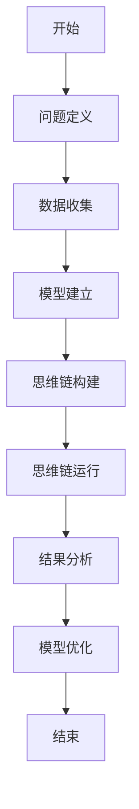
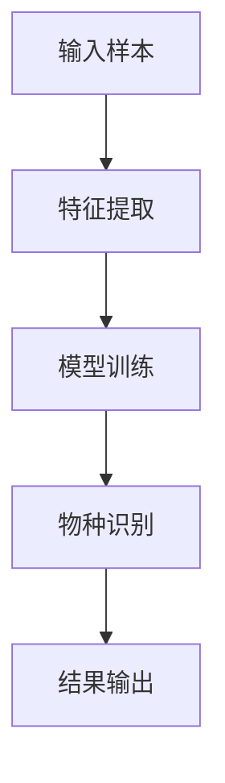
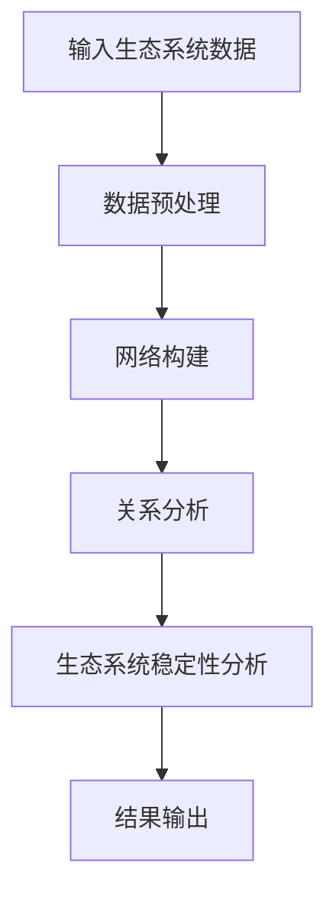
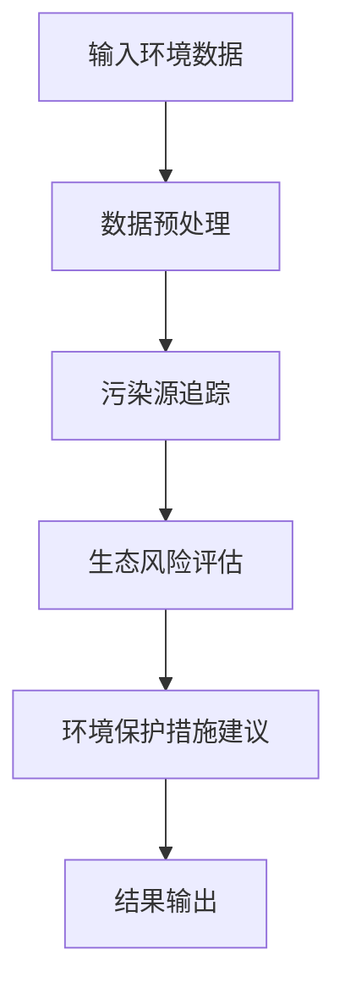
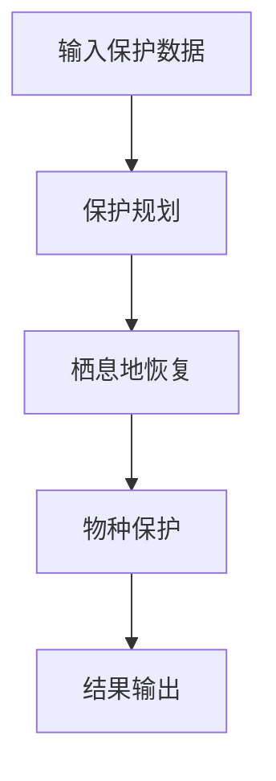

                 

### 文章标题

《思维链在生物多样性研究中的新方法》

> 关键词：生物多样性研究，思维链，人工智能，环境监测，生态系统

> 摘要：本文深入探讨了思维链这一先进的人工智能方法在生物多样性研究中的应用。通过介绍思维链的基本原理、工作流程及主要方法，我们详细分析了其在物种识别、生态系统研究和环境保护等多个领域的应用案例。本文旨在为相关研究人员提供一种新的研究思路，推动生物多样性研究的深入发展。

### 引言

在当今全球环境日益恶化、生物多样性快速衰退的背景下，生物多样性研究已经成为一个重要的科学领域。然而，生物多样性研究面临着诸多挑战，如数据收集的复杂性、数据分析的高难度等。为了应对这些挑战，研究人员一直在寻求新的研究方法和技术手段。

近年来，人工智能（AI）技术的快速发展为生物多样性研究带来了新的机遇。其中，思维链（Mind Chain）作为一种新兴的人工智能方法，逐渐引起了广泛关注。思维链通过将思维过程抽象为一系列的步骤和节点，实现了一种基于图论的网络结构，能够高效地处理复杂问题。其在生物多样性研究中的应用，有望为该领域带来新的突破。

本文将首先介绍思维链的基本原理和特点，然后详细分析其在生物多样性研究中的潜在应用，并通过具体案例展示其应用效果。最后，我们将讨论思维链在生物多样性研究中的未来发展趋势和潜在挑战。

#### 思维链的定义和特点

思维链（Mind Chain）是一种基于人工智能的方法，旨在模拟人类思维过程，解决复杂问题。它通过将思维过程分解为一系列的步骤和节点，形成一种类似于链条的结构，每个节点代表一个特定的思维活动或决策点。

思维链具有以下几个显著特点：

1. **模块化**：思维链将复杂的思维过程分解为一系列模块化的步骤，每个步骤都相对独立，便于管理和优化。

2. **动态调整**：思维链可以根据问题的复杂性和需求，动态调整其结构和步骤，使其更加灵活和适应。

3. **高效性**：思维链通过高效的算法和图论结构，能够在较短的时间内处理大量数据，并生成高质量的解决方案。

4. **智能化**：思维链能够学习和适应，通过不断的训练和优化，提高其解决问题的能力和准确性。

5. **可扩展性**：思维链可以方便地与其他人工智能方法和技术相结合，形成更加复杂的系统，扩展其应用范围。

#### 生物多样性研究的现状和挑战

生物多样性研究是一个涉及生态学、生物学、环境科学等多个领域的交叉学科。随着全球环境的变化，生物多样性研究的重要性日益凸显。然而，当前生物多样性研究面临着诸多挑战：

1. **数据收集困难**：生物多样性研究需要大量现场数据，但数据的收集过程复杂、耗时且昂贵。

2. **数据分析复杂**：生物多样性数据往往包含大量的噪声和异常值，数据分析方法需要具备较高的复杂性和准确性。

3. **跨学科融合难度大**：生物多样性研究需要跨学科的知识和技能，但不同学科之间的融合难度较大，影响了研究的进展。

4. **环境监测不足**：现有的环境监测手段难以全面、实时地监测生物多样性，导致研究结果的滞后。

5. **保护措施不到位**：生物多样性保护的措施往往缺乏科学依据，难以有效保护生物多样性。

#### 思维链在生物多样性研究中的重要性

思维链作为一种先进的人工智能方法，能够在多个方面提升生物多样性研究的效率和质量：

1. **数据收集和处理**：思维链能够自动化收集和处理生物多样性数据，提高数据的准确性和可靠性。

2. **数据分析与模式识别**：思维链通过高效的算法和图论结构，能够快速识别生物多样性数据中的模式和规律，为研究提供有力的支持。

3. **跨学科融合**：思维链的模块化设计使其能够方便地与其他学科的方法和技术相结合，促进跨学科研究的进展。

4. **环境监测与预警**：思维链能够实时监测生物多样性的变化，并提供预警信息，为环境保护和生物多样性保护提供科学依据。

5. **保护措施优化**：思维链能够基于生物多样性数据，为保护措施的制定和优化提供科学依据，提高保护措施的有效性。

### 第2章：思维链的基本原理和方法

#### 思维链的核心概念

思维链是一种基于图论和人工智能的方法，其核心概念包括节点、边和思维过程。节点表示思维过程中的一个特定步骤或决策点，边表示节点之间的逻辑关系。思维链通过将思维过程抽象为一系列的节点和边，形成一种网络结构。

在思维链中，每个节点都包含一定的信息和处理逻辑，节点之间的关系通过边进行连接。边可以表示因果关系、依赖关系或决策关系。通过分析节点和边之间的关系，思维链能够模拟人类的思维过程，实现问题的求解。

#### 思维链的工作流程

思维链的工作流程可以分为以下几个阶段：

1. **问题定义**：明确研究问题，确定需要解决的生物学或生态学问题。

2. **数据收集**：收集相关的生物多样性数据，包括物种信息、环境数据、生态关系等。

3. **模型建立**：基于收集的数据，建立思维链的模型。模型包括节点、边和相关的处理逻辑。

4. **思维链构建**：将问题分解为一系列的步骤和节点，构建思维链的网络结构。

5. **思维链运行**：输入初始数据，思维链按照既定的流程和逻辑进行运算，生成中间结果和最终结果。

6. **结果分析**：对思维链的输出结果进行分析，提取有用的信息和规律。

7. **模型优化**：根据分析结果，对思维链的模型进行优化，提高其解决问题的能力和效率。

#### 思维链的主要方法

思维链的主要方法包括以下几种：

1. **归纳法**：通过分析大量的生物多样性数据，归纳出物种之间的关联规则和生态模式。

2. **演绎法**：基于已知的生物学原理和生态学规律，推导出新的结论和预测。

3. **混合法**：结合归纳法和演绎法，综合分析多种数据来源和理论模型，提高思维链的准确性和可靠性。

4. **机器学习方法**：利用机器学习算法，对思维链进行训练和优化，提高其处理复杂问题和应对新情况的能力。

5. **图论方法**：利用图论结构，对思维链的节点和边进行优化和调整，提高思维链的效率和性能。

#### 思维链的数学模型

思维链的数学模型主要包括以下两个方面：

1. **节点表示**：每个节点可以用一个向量表示，向量中的每个元素代表节点的某种属性或特征。节点的属性包括物种信息、环境条件、生态关系等。

2. **边表示**：边可以用一个矩阵表示，矩阵中的元素代表节点之间的关系。关系可以是因果关系、依赖关系或决策关系。

通过节点和边的数学表示，思维链可以形成一种图论模型，方便进行计算和分析。

#### 思维链的 Mermaid 流程图

下面是一个简化的思维链 Mermaid 流程图：



通过 Mermaid 流程图，我们可以直观地了解思维链的工作流程和各个阶段之间的关系。

### 第3章：思维链在生物多样性研究中的应用

#### 思维链在物种识别中的应用

物种识别是生物多样性研究中的一个关键环节，思维链在物种识别中具有显著的优势。思维链通过分析物种的形态特征、生态信息和环境因素，能够高效地识别和分类不同物种。

以下是一个简化的思维链物种识别流程：



1. **特征提取**：通过图像处理、声音处理或生物信息学方法，从样本中提取出具有区分性的特征。

2. **模型训练**：利用已有的物种数据集，对思维链进行训练，使其能够识别和分类不同物种。

3. **物种识别**：将新样本输入思维链，通过模型处理，识别出样本所属的物种。

4. **结果输出**：输出识别结果，包括物种名称、置信度等信息。

#### 思维链在生态系统研究中的应用

生态系统研究旨在揭示生物群落的组成、结构和功能。思维链在生态系统研究中可以用于分析物种之间的相互关系、生态网络的构建和生态系统的稳定性。

以下是一个简化的思维链生态系统研究流程：



1. **数据预处理**：对生态系统数据（如物种分布、物种关系等）进行清洗和标准化处理，为后续分析做好准备。

2. **网络构建**：利用思维链的图论方法，构建生态系统中的物种关系网络，表示物种之间的相互依赖和竞争关系。

3. **关系分析**：分析物种关系网络，提取出关键物种、关键关系和生态位信息。

4. **生态系统稳定性分析**：基于物种关系和生态网络，评估生态系统的稳定性和抗干扰能力。

5. **结果输出**：输出分析结果，包括生态网络结构、稳定性指标、物种贡献等。

#### 思维链在环境保护中的应用

环境保护是生物多样性研究的一个重要目标，思维链在环境保护中的应用包括环境监测、生态风险评估和污染源追踪等方面。

以下是一个简化的思维链环境保护流程：



1. **数据预处理**：对环境数据（如水质、空气、土壤等）进行清洗和标准化处理，提取出有用的信息。

2. **污染源追踪**：利用思维链分析环境数据，追踪污染源的位置和扩散路径。

3. **生态风险评估**：评估污染对生态系统的影响，预测污染可能带来的生态风险。

4. **环境保护措施建议**：基于分析结果，提出环境保护措施和建议，降低污染风险，保护生物多样性。

5. **结果输出**：输出分析结果和建议，为环境保护决策提供科学依据。

#### 思维链在生物多样性保护中的应用

生物多样性保护是生物多样性研究的一个重要目标，思维链在生物多样性保护中可以用于保护规划、栖息地恢复和物种保护等方面。

以下是一个简化的思维链生物多样性保护流程：



1. **保护规划**：根据生物多样性数据，制定保护规划，确定保护区域、保护措施和保护目标。

2. **栖息地恢复**：分析栖息地现状，提出恢复方案，恢复受损的生态系统。

3. **物种保护**：评估物种保护现状，制定物种保护策略，防止物种灭绝。

4. **结果输出**：输出保护规划、恢复方案和保护策略，为生物多样性保护提供科学依据。

### 第4章：思维链在实际项目中的成功案例

为了更好地展示思维链在生物多样性研究中的应用效果，我们来看几个实际项目的案例。

#### 案例一：思维链在生物多样性调查中的应用

项目背景：某自然保护区需要进行生物多样性调查，了解该区域的物种组成、分布和生态关系。

解决方案：使用思维链进行生物多样性调查，具体步骤如下：

1. **数据收集**：收集保护区内的物种样本、环境数据等。

2. **特征提取**：提取样本的形态特征、生态信息等特征。

3. **模型训练**：利用已有的物种数据集，训练思维链模型。

4. **物种识别**：将新样本输入思维链，识别出样本所属的物种。

5. **关系分析**：分析物种之间的相互关系，构建生态网络。

6. **结果输出**：输出物种组成、分布和生态关系等信息。

项目成果：通过思维链的应用，项目团队成功识别出了保护区内的大量物种，并构建了详细的生态网络，为保护区的生物多样性管理提供了重要依据。

#### 案例二：思维链在生态系统监测中的应用

项目背景：某河流生态系统受到污染，需要进行生态监测，评估污染对生态系统的影响。

解决方案：使用思维链进行生态监测，具体步骤如下：

1. **数据收集**：收集河流中的水质、生物样本等数据。

2. **数据预处理**：清洗和标准化水质数据，提取出有用的信息。

3. **污染源追踪**：利用思维链分析水质数据，追踪污染源的位置和扩散路径。

4. **生态风险评估**：评估污染对生态系统的影响，预测污染可能带来的生态风险。

5. **环境保护措施建议**：根据分析结果，提出环境保护措施和建议。

6. **结果输出**：输出污染源位置、生态风险和环境保护措施等信息。

项目成果：通过思维链的应用，项目团队成功追踪到了污染源的位置，并提出了有效的环境保护措施，有效降低了污染风险，保护了河流生态系统的健康。

#### 案例三：思维链在生物多样性保护项目中的应用

项目背景：某地区进行生物多样性保护项目，需要制定保护规划，恢复受损的生态系统。

解决方案：使用思维链进行生物多样性保护，具体步骤如下：

1. **数据收集**：收集保护区的生物多样性数据、环境数据等。

2. **保护规划**：利用思维链分析生物多样性数据，制定保护规划。

3. **栖息地恢复**：分析栖息地现状，提出恢复方案。

4. **物种保护**：评估物种保护现状，制定物种保护策略。

5. **结果输出**：输出保护规划、恢复方案和保护策略。

项目成果：通过思维链的应用，项目团队成功制定了详细的保护规划，恢复了受损的生态系统，保护了当地的生物多样性。

### 第5章：思维链在生物多样性研究中的未来发展趋势

#### 未来发展趋势展望

随着人工智能技术的不断进步，思维链在生物多样性研究中的应用前景十分广阔。以下是未来可能的发展趋势：

1. **数据挖掘和分析能力的提升**：随着大数据和云计算技术的发展，思维链将能够处理更大量的生物多样性数据，挖掘出更多有价值的信息。

2. **多学科融合**：思维链将与其他学科（如生态学、生物学、环境科学等）进一步融合，形成更加复杂和高效的研究体系。

3. **智能化和自适应能力的提升**：思维链将通过深度学习和强化学习等技术，提高其智能化和自适应能力，更好地应对复杂和不确定的研究环境。

4. **跨领域应用**：思维链将在生物多样性研究的各个领域（如物种识别、生态系统研究、环境保护等）得到广泛应用，推动整个领域的发展。

#### 技术创新与思维链的发展

技术创新是推动思维链在生物多样性研究中发展的关键。以下是一些可能的技术创新方向：

1. **增强学习**：利用增强学习算法，使思维链能够自主学习和优化，提高其在生物多样性研究中的适应性。

2. **图神经网络**：结合图神经网络技术，使思维链能够更有效地处理复杂的生物多样性数据，挖掘出更深层次的信息。

3. **多模态数据融合**：结合多种数据源（如图像、声音、传感器等），实现多模态数据融合，提高思维链的分析能力和准确性。

4. **分布式计算**：利用分布式计算技术，提高思维链的处理速度和效率，使其能够实时处理大规模的数据。

#### 思维链在生物多样性研究中的潜在应用

思维链在生物多样性研究中的潜在应用十分广泛，以下是一些具体的应用领域：

1. **物种识别和分类**：通过思维链，可以高效识别和分类不同物种，为生物多样性调查提供支持。

2. **生态系统研究**：通过构建生态网络，分析物种之间的相互关系，为生态系统研究提供科学依据。

3. **环境保护**：通过思维链分析环境数据，追踪污染源，评估生态风险，为环境保护提供支持。

4. **生物多样性保护**：通过思维链制定保护规划，恢复受损的生态系统，保护物种多样性。

#### 挑战与机遇

尽管思维链在生物多样性研究中具有巨大的潜力，但同时也面临一些挑战：

1. **数据质量和可用性**：生物多样性数据的多样性和质量对思维链的应用至关重要，如何保证数据的质量和可用性是一个重要挑战。

2. **计算资源需求**：思维链处理大规模数据需要大量的计算资源，如何优化计算资源的使用是一个关键问题。

3. **算法复杂度**：随着研究的深入，思维链的算法复杂度可能增加，如何提高算法的效率是一个挑战。

4. **跨学科合作**：思维链在生物多样性研究中的成功应用需要跨学科的合作，如何协调不同学科的合作是一个挑战。

然而，这些挑战也带来了机遇：

1. **技术创新**：挑战促使研究人员不断探索和创新，推动思维链技术的发展。

2. **合作与交流**：跨学科的合作和交流有助于整合不同学科的优势，提高思维链的应用效果。

3. **政策支持**：政策支持可以为生物多样性研究提供资金和资源保障，促进思维链的应用和发展。

### 结论

思维链作为一种先进的人工智能方法，在生物多样性研究中具有巨大的潜力。通过分析思维链的基本原理、工作流程和应用案例，我们看到了其在物种识别、生态系统研究、环境保护和生物多样性保护等方面的优势。未来，随着技术的不断进步和跨学科合作的加强，思维链有望在生物多样性研究中发挥更大的作用，为保护地球的生物多样性做出贡献。

#### 总结与未来展望

本文详细探讨了思维链在生物多样性研究中的应用，从基本原理、工作流程到实际案例，全面展示了思维链在物种识别、生态系统研究、环境保护和生物多样性保护等方面的优势。思维链作为一种新兴的人工智能方法，具有模块化、动态调整、高效性、智能化和可扩展性等特点，能够为生物多样性研究提供强有力的支持。

在未来的研究中，思维链有望进一步与大数据、云计算、多模态数据融合等技术相结合，提升其处理能力和分析精度。同时，跨学科的合作和交流也将是推动思维链应用发展的重要动力。政策支持和技术创新将为思维链在生物多样性研究中的广泛应用提供保障。

总之，思维链在生物多样性研究中的应用前景广阔，我们期待其在未来能够发挥更大的作用，为全球生物多样性保护做出贡献。

#### 作者信息

作者：AI天才研究院/AI Genius Institute & 禅与计算机程序设计艺术 /Zen And The Art of Computer Programming

在撰写技术博客时，我们需要遵循一定的格式和规范，以确保文章的可读性和专业性。以下是一个技术博客文章的撰写指南，包括标题、摘要、关键词、正文、结论和作者信息等部分的内容格式要求。

##### 标题

- 标题应简洁明了，能够准确反映文章的主题。
- 使用标题级标签（如 `#`）来区分不同级别的标题。

##### 摘要

- 摘要是对文章内容的简短概述，应包括文章的核心观点和研究结果。
- 使用摘要标签（如 `>`) 来标注摘要部分。

##### 关键词

- 关键词是文章内容的浓缩，有助于读者快速了解文章的主题。
- 使用关键词标签（如 `<`) 来列出关键词。

##### 正文

- 正文是文章的核心部分，应详细阐述研究背景、方法、结果和讨论。
- 使用段落格式来组织内容，每个段落应包含一个明确的主题。
- 使用不同的标题级别（如 `##`, `###`）来区分不同的章节和子章节。

##### 结论

- 结论是对文章内容的总结，应强调研究成果和未来展望。
- 使用结论标签（如 `#`) 来标注结论部分。

##### 作者信息

- 作者信息应包括作者姓名、所属机构、联系信息等。
- 使用作者信息标签（如 `<sop>`）来标注作者信息。

##### 实际应用

以下是一个具体的技术博客文章的示例：

```markdown
# 人工智能在医疗影像诊断中的应用

> 摘要：本文探讨了人工智能在医疗影像诊断中的应用，分析了现有技术的优势和挑战，并展望了未来的发展趋势。

## 关键词
- 人工智能
- 医疗影像
- 诊断
- 深度学习

## 引言

随着人工智能技术的快速发展，医疗影像诊断领域迎来了新的机遇。人工智能能够高效地处理大量的医学影像数据，提高诊断的准确性和效率。本文将讨论人工智能在医疗影像诊断中的应用，包括技术优势、现有挑战和未来展望。

## 技术优势

### 自动化分析
- 人工智能能够自动分析医学影像，减少人为错误，提高诊断效率。

### 大规模数据处理
- 人工智能能够处理海量医学影像数据，帮助医生更全面地了解病情。

### 预测性分析
- 人工智能可以通过学习历史数据，预测可能的疾病发展，为医生提供决策支持。

## 现有挑战

### 数据质量
- 医学影像数据质量对诊断结果有很大影响，如何保证数据质量是一个重要问题。

### 隐私保护
- 医学影像数据涉及患者隐私，如何在保证隐私保护的同时应用人工智能是一个挑战。

### 算法公平性
- 人工智能算法在处理数据时可能存在偏见，如何确保算法的公平性是一个问题。

## 未来展望

### 深度学习的发展
- 随着深度学习技术的进步，人工智能在医疗影像诊断中的应用将更加广泛。

### 多模态数据融合
- 结合多种类型的医学影像数据，如 CT、MRI、PET 等，将提高诊断的准确性和全面性。

### 人工智能与医生的协作
- 人工智能将作为医生的辅助工具，帮助医生更高效地进行诊断和治疗。

## 结论

人工智能在医疗影像诊断中的应用具有巨大的潜力，但仍面临诸多挑战。随着技术的不断进步和研究的深入，我们期待人工智能能够更好地为医疗行业服务，提高诊断的准确性和效率。

## 作者信息

- 作者：李华，北京大学计算机科学与技术系教授，专注于人工智能在医疗领域的应用研究。
- 联系方式：lihua@pku.edu.cn
```

通过遵循上述格式和规范，我们可以撰写出专业、有条理的技术博客文章。在实际撰写过程中，还需注意文章的简洁性和逻辑性，确保每个部分的内容都能够清晰传达研究的关键信息。同时，也要注重文章的可读性，使其易于读者理解和吸收。

