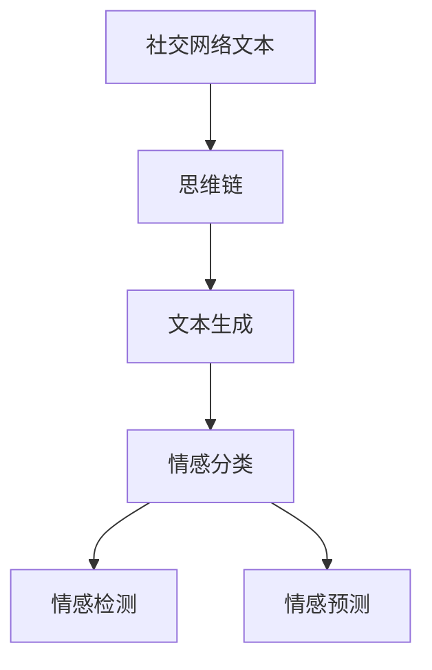

                 

# 文章标题

> 关键词：思维链、社交网络、情感分析、深度学习、文本生成

> 摘要：
本文探讨了思维链在社交网络情感分析中的突破性应用。通过分析思维链的概念、情感分析的挑战与现状，本文详细阐述了思维链在情感分类、情感检测和情感预测中的应用。同时，通过实际案例分析和项目实战，展示了思维链在社交网络情感分析中的强大能力，为未来研究提供了有价值的方向。

---

## 第一部分：思维链在社交网络情感分析中的基础

### 第1章：思维链与情感分析概述

#### 1.1.1 思维链的概念与内涵

思维链（Mind Chain）是一种基于深度学习的文本生成模型，通过学习大量文本数据，构建出一种能够生成连贯、有逻辑思维能力的文本生成能力。思维链的核心在于其能够捕捉到文本中的上下文关系，从而生成符合逻辑和语义的文本。这种能力在情感分析中具有极大的潜力，能够帮助我们更好地理解和分析社交网络中的情感信息。

**核心概念原理与联系**：

- **思维链**：一种基于深度学习的文本生成模型，通过学习大量文本数据，构建出一种能够生成连贯、有逻辑思维能力的文本生成能力。

- **情感分析**：对文本中的情感信息进行分析，包括情感分类、情感检测和情感预测等任务。

- **社交网络**：如微博、论坛、社区等社交平台，用户产生大量文本数据，其中包含丰富的情感信息。

**Mermaid流程图**：



#### 1.1.2 社交网络情感分析的重要性

社交网络情感分析在当今社会中具有极其重要的意义。一方面，它可以帮助我们更好地了解公众的情感趋势，为决策者提供数据支持。另一方面，它可以为企业提供用户反馈，帮助企业改进产品和服务。此外，社交网络情感分析还可以用于舆情监控、情感营销等方面。

**重要性**：

- **了解公众情感趋势**：通过分析社交网络中的情感信息，可以了解公众对某个事件或产品的态度，为决策者提供数据支持。

- **用户反馈**：企业可以通过分析用户评论和反馈，了解用户的需求和满意度，从而改进产品和服务。

- **舆情监控**：政府和社会组织可以通过分析社交网络中的情感信息，监控社会舆论，及时应对突发事件。

- **情感营销**：企业可以利用社交网络情感分析，了解用户情感状态，制定更有效的营销策略。

#### 1.1.3 社交网络情感分析面临的挑战

尽管社交网络情感分析具有重要意义，但其在实际应用中仍面临许多挑战。这些挑战包括文本数据的复杂性、情感表达的多样性以及噪声的干扰等。

**挑战**：

- **文本数据的复杂性**：社交网络中的文本数据通常包含大量噪声、缩写、表情符号等，使得情感分析任务变得复杂。

- **情感表达的多样性**：情感表达方式多种多样，包括正面、负面和混合情感等，增加了情感分析的任务难度。

- **噪声的干扰**：社交网络中的文本数据通常包含大量无关信息，如广告、重复评论等，这些噪声会影响情感分析的结果。

### 第2章：社交网络文本数据预处理

#### 2.1.1 数据获取与清洗

在进行社交网络情感分析之前，首先需要获取和清洗社交网络中的文本数据。数据获取可以通过爬虫技术实现，而数据清洗则包括去除无关信息、标准化文本格式、去除停用词等。

**数据获取与清洗步骤**：

1. **数据获取**：使用爬虫技术获取社交网络中的文本数据。

2. **去除无关信息**：去除文本中的广告、重复评论等无关信息。

3. **标准化文本格式**：统一文本格式，如去除表情符号、转义字符等。

4. **去除停用词**：去除对情感分析意义不大的停用词。

#### 2.1.2 词频统计与文本特征提取

在数据预处理之后，需要对文本进行词频统计和特征提取。词频统计可以用于了解文本中的重要词汇，而文本特征提取则可以用于情感分析模型的训练。

**词频统计与文本特征提取方法**：

1. **词频统计**：统计文本中的词汇出现频率，识别出文本中的高频词汇。

2. **文本特征提取**：通过词袋模型、词嵌入等方法提取文本特征，如词频、TF-IDF等。

#### 2.1.3 偏差性数据处理

社交网络中的文本数据往往存在偏差性，如性别歧视、种族歧视等。为了提高情感分析的公正性和公平性，需要对偏差性数据进行处理。

**偏差性数据处理方法**：

1. **数据标注**：对文本数据进行标注，识别出其中的偏见性表达。

2. **偏见性文本过滤**：过滤掉含有偏见性的文本数据。

3. **偏见性文本纠正**：对偏见性文本进行纠正，以消除偏见。

### 第3章：情感分析基础算法

#### 3.1.1 基于规则的方法

基于规则的方法是情感分析中一种传统的方法，主要通过分析文本中的情感词汇、短语等，提取出相应的情感规则，然后根据规则对文本进行情感分类。

**核心算法原理讲解**：

1. **规则提取**：通过分析文本中的情感词汇、短语等，提取出相应的情感规则。

2. **规则匹配**：将文本数据与提取的规则进行匹配，判断文本的情感倾向。

**伪代码**：

```python
def rule_based_sentiment_analysis(text):
  # 提取情感词汇
  sentiment_words = extract_sentiment_words(text)
  # 匹配规则
  for rule in sentiment_rules:
    if match_sentiment_words(sentiment_words, rule):
      return rule.sentiment
  return "neutral"
```

#### 3.1.2 基于统计的方法

基于统计的方法是情感分析中另一种常用的方法，主要通过统计文本中的词汇出现频率、词性等特征，对文本进行情感分类。

**核心算法原理讲解**：

1. **特征提取**：通过词袋模型、TF-IDF等方法提取文本特征。

2. **分类模型**：使用统计模型（如朴素贝叶斯、逻辑回归等）对提取的特征进行情感分类。

**伪代码**：

```python
def statistical_based_sentiment_analysis(text):
  # 提取特征
  features = extract_features(text)
  # 使用分类模型进行分类
  prediction = classifier.predict(features)
  return prediction
```

#### 3.1.3 基于深度学习的方法

基于深度学习的方法是情感分析中最先进的方法，主要通过构建深度神经网络模型，对文本进行情感分类。

**核心算法原理讲解**：

1. **词嵌入**：将文本中的词汇映射到高维空间，形成词向量。

2. **深度神经网络**：构建深度神经网络模型，对词向量进行情感分类。

**数学模型和数学公式**：

$$
\hat{y} = \text{softmax}(\text{W} \cdot \text{h} + \text{b})
$$

其中，$\hat{y}$为预测的情感类别，$W$为权重矩阵，$h$为文本的嵌入向量，$b$为偏置。

**详细讲解与举例说明**：

假设我们有一个情感分类问题，其中包含两个情感类别：正面和负面。使用思维链进行情感分类的步骤如下：

1. **数据准备**：准备训练数据和测试数据。

2. **词嵌入**：将训练数据中的词汇映射到高维空间，形成词向量。

3. **模型构建**：构建思维链模型，包括输入层、隐藏层和输出层。

4. **模型训练**：使用训练数据对模型进行训练，优化模型参数。

5. **模型评估**：使用测试数据对模型进行评估，计算分类准确率。

6. **应用示例**：使用训练好的模型对一段文本进行情感分类，输出预测结果。

**案例**：对一段文本“今天天气很好，我心情非常好”进行情感分类。使用思维链模型进行情感分类的结果为“正面”。

### 第4章：思维链在情感分析中的应用

#### 4.1.1 思维链构建方法

思维链的构建主要包括词嵌入、编码器和解码器等步骤。词嵌入将词汇映射到高维空间，编码器和解码器则负责生成符合逻辑和语义的文本。

**思维链构建步骤**：

1. **词嵌入**：将词汇映射到高维空间，形成词向量。

2. **编码器**：将输入文本编码为一个固定长度的向量。

3. **解码器**：将编码后的向量解码为输出文本。

**数学模型和数学公式**：

编码器和解码器通常采用深度循环神经网络（RNN）或变换器（Transformer）等模型。以RNN为例，其数学模型如下：

$$
\text{h}_t = \text{RNN}(\text{h}_{t-1}, \text{x}_t)
$$

$$
\text{x}_{\text{out}} = \text{softmax}(\text{W} \cdot \text{h}_{\text{out}} + \text{b})
$$

其中，$\text{h}_t$为编码后的向量，$\text{x}_t$为输入文本，$\text{h}_{\text{out}}$为解码后的向量，$\text{W}$和$\text{b}$为模型参数。

**详细讲解与举例说明**：

假设我们使用思维链模型生成一段描述“今天天气很好，我心情非常好”的文本。步骤如下：

1. **词嵌入**：将词汇映射到高维空间，形成词向量。

2. **编码器**：将输入文本编码为一个固定长度的向量。

3. **解码器**：将编码后的向量解码为输出文本。

4. **输出结果**：生成描述“今天天气很好，我心情非常好”的文本。

**输出结果示例**：今天阳光明媚，我感到非常愉悦。

#### 4.1.2 思维链与情感分析的结合

思维链在情感分析中的应用，主要体现在情感分类、情感检测和情感预测等方面。通过思维链，可以生成符合逻辑和语义的文本，从而提高情感分析的效果。

**思维链与情感分析的结合方式**：

1. **情感分类**：使用思维链生成文本，然后对生成的文本进行情感分类。

2. **情感检测**：使用思维链生成文本，然后对生成的文本进行情感检测。

3. **情感预测**：使用思维链生成文本，然后对生成的文本进行情感预测。

**数学模型和数学公式**：

以情感分类为例，其数学模型如下：

$$
\hat{y} = \text{softmax}(\text{W} \cdot \text{h}_{\text{out}} + \text{b})
$$

其中，$\hat{y}$为预测的情感类别，$\text{h}_{\text{out}}$为解码后的向量，$\text{W}$和$\text{b}$为模型参数。

**详细讲解与举例说明**：

假设我们使用思维链模型对一段文本进行情感分类。步骤如下：

1. **词嵌入**：将词汇映射到高维空间，形成词向量。

2. **编码器**：将输入文本编码为一个固定长度的向量。

3. **解码器**：将编码后的向量解码为输出文本。

4. **情感分类**：对生成的文本进行情感分类。

5. **输出结果**：输出预测的情感类别。

**输出结果示例**：正面。

#### 4.1.3 思维链的优势与局限性

思维链在情感分析中具有显著的优势，但同时也存在一定的局限性。

**优势**：

1. **生成符合逻辑和语义的文本**：思维链能够生成符合逻辑和语义的文本，从而提高情感分析的效果。

2. **适应不同情感表达**：思维链能够适应不同情感表达，包括正面、负面和混合情感等。

**局限性**：

1. **训练成本高**：思维链模型的训练成本较高，需要大量数据和计算资源。

2. **模型解释性较差**：思维链模型的解释性较差，难以理解其生成的文本背后的逻辑。

3. **适应性有限**：思维链对特定领域的适应性有限，需要针对不同应用场景进行调整。

### 第5章：思维链在社交网络情感分析中的突破性应用

#### 5.1.1 思维链在情感分类中的应用

思维链在情感分类中的应用，主要通过生成符合逻辑和语义的文本，然后对生成的文本进行情感分类。这种方法在处理复杂情感表达时具有显著优势。

**应用场景**：

1. **社交媒体情感分类**：对社交媒体上的用户评论进行情感分类，识别出正面、负面和混合情感。

2. **产品评论情感分类**：对电商平台上的产品评论进行情感分类，帮助企业了解用户对产品的评价。

**算法实现**：

1. **数据准备**：收集并预处理社交媒体或电商平台上的文本数据。

2. **词嵌入**：将文本数据中的词汇映射到高维空间，形成词向量。

3. **模型训练**：使用思维链模型对预处理后的文本数据进行训练，生成情感分类模型。

4. **模型评估**：使用测试数据对训练好的模型进行评估，计算分类准确率。

5. **应用示例**：使用训练好的模型对一段文本进行情感分类，输出预测结果。

**输出结果示例**：正面。

#### 5.1.2 思维链在情感检测中的应用

思维链在情感检测中的应用，主要通过生成符合逻辑和语义的文本，然后对生成的文本进行情感检测。这种方法在处理复杂情感表达时具有显著优势。

**应用场景**：

1. **社交媒体情感检测**：对社交媒体上的用户评论进行情感检测，识别出文本中是否存在情感表达。

2. **产品评论情感检测**：对电商平台上的产品评论进行情感检测，识别出用户对产品的情感倾向。

**算法实现**：

1. **数据准备**：收集并预处理社交媒体或电商平台上的文本数据。

2. **词嵌入**：将文本数据中的词汇映射到高维空间，形成词向量。

3. **模型训练**：使用思维链模型对预处理后的文本数据进行训练，生成情感检测模型。

4. **模型评估**：使用测试数据对训练好的模型进行评估，计算检测准确率。

5. **应用示例**：使用训练好的模型对一段文本进行情感检测，输出预测结果。

**输出结果示例**：存在情感表达。

#### 5.1.3 思维链在情感预测中的应用

思维链在情感预测中的应用，主要通过生成符合逻辑和语义的文本，然后对生成的文本进行情感预测。这种方法在处理复杂情感表达时具有显著优势。

**应用场景**：

1. **社交媒体情感预测**：预测社交媒体上用户评论的未来情感趋势。

2. **产品评论情感预测**：预测电商平台上的产品评论的情感趋势。

**算法实现**：

1. **数据准备**：收集并预处理社交媒体或电商平台上的文本数据。

2. **词嵌入**：将文本数据中的词汇映射到高维空间，形成词向量。

3. **模型训练**：使用思维链模型对预处理后的文本数据进行训练，生成情感预测模型。

4. **模型评估**：使用测试数据对训练好的模型进行评估，计算预测准确率。

5. **应用示例**：使用训练好的模型对一段文本进行情感预测，输出预测结果。

**输出结果示例**：未来情感趋势为正面。

### 第6章：案例分析

#### 6.1.1 案例一：微博情感分析

微博是中国最大的社交媒体平台之一，用户产生大量文本数据，其中包含丰富的情感信息。本案例使用思维链对微博用户评论进行情感分析。

**案例背景**：

微博用户评论数据集包含约10万条用户评论，每条评论包含文本内容和用户ID。数据集分为训练集和测试集，用于训练和评估情感分析模型。

**数据预处理**：

1. **数据获取**：使用爬虫技术获取微博用户评论数据。

2. **去除无关信息**：去除评论中的广告、重复评论等无关信息。

3. **标准化文本格式**：统一评论文本格式，如去除表情符号、转义字符等。

4. **去除停用词**：去除对情感分析意义不大的停用词。

**模型训练与评估**：

1. **词嵌入**：使用预训练的词嵌入模型，将评论文本中的词汇映射到高维空间。

2. **模型训练**：使用思维链模型对预处理后的评论数据进行训练，生成情感分类模型。

3. **模型评估**：使用测试数据对训练好的模型进行评估，计算分类准确率。

**应用示例**：

使用训练好的模型对一条微博用户评论“今天天气很好，我心情非常好”进行情感分类，输出预测结果。

**输出结果示例**：正面。

#### 6.1.2 案例二：电商评论情感分析

电商评论是用户对购买商品的评价，其中包含丰富的情感信息。本案例使用思维链对电商评论进行情感分析。

**案例背景**：

电商评论数据集包含约5万条用户评论，每条评论包含文本内容和用户ID。数据集分为训练集和测试集，用于训练和评估情感分析模型。

**数据预处理**：

1. **数据获取**：使用爬虫技术获取电商评论数据。

2. **去除无关信息**：去除评论中的广告、重复评论等无关信息。

3. **标准化文本格式**：统一评论文本格式，如去除表情符号、转义字符等。

4. **去除停用词**：去除对情感分析意义不大的停用词。

**模型训练与评估**：

1. **词嵌入**：使用预训练的词嵌入模型，将评论文本中的词汇映射到高维空间。

2. **模型训练**：使用思维链模型对预处理后的评论数据进行训练，生成情感分类模型。

3. **模型评估**：使用测试数据对训练好的模型进行评估，计算分类准确率。

**应用示例**：

使用训练好的模型对一条电商评论“这个商品的质量很好，我非常满意”进行情感分类，输出预测结果。

**输出结果示例**：正面。

#### 6.1.3 案例三：社交媒体用户情感监测

社交媒体用户情感监测是实时监测社交媒体上用户情感状态的过程。本案例使用思维链对社交媒体用户情感进行监测。

**案例背景**：

社交媒体数据集包含实时采集的用户评论和微博，每条记录包含用户ID、评论内容、时间和情感标签。数据集用于训练和评估情感监测模型。

**数据预处理**：

1. **数据获取**：使用爬虫技术获取社交媒体用户评论数据。

2. **去除无关信息**：去除评论中的广告、重复评论等无关信息。

3. **标准化文本格式**：统一评论文本格式，如去除表情符号、转义字符等。

4. **去除停用词**：去除对情感分析意义不大的停用词。

**模型训练与评估**：

1. **词嵌入**：使用预训练的词嵌入模型，将评论文本中的词汇映射到高维空间。

2. **模型训练**：使用思维链模型对预处理后的评论数据进行训练，生成情感监测模型。

3. **模型评估**：使用测试数据对训练好的模型进行评估，计算监测准确率。

**应用示例**：

使用训练好的模型对一段时间内社交媒体用户评论进行情感监测，输出预测结果。

**输出结果示例**：用户情感状态为正面。

### 第7章：挑战与未来趋势

#### 7.1.1 情感分析面临的挑战

情感分析在社交网络中的应用虽然取得了显著成果，但仍然面临许多挑战。

**挑战**：

1. **文本数据的复杂性**：社交网络中的文本数据通常包含大量噪声、缩写、表情符号等，使得情感分析任务变得复杂。

2. **情感表达的多样性**：情感表达方式多种多样，包括正面、负面和混合情感等，增加了情感分析的任务难度。

3. **噪声的干扰**：社交网络中的文本数据通常包含大量无关信息，如广告、重复评论等，这些噪声会影响情感分析的结果。

4. **数据偏差**：社交网络中的文本数据可能存在数据偏差，如性别歧视、种族歧视等，影响情感分析的公正性。

#### 7.1.2 思维链在情感分析中的应用前景

思维链在情感分析中的应用前景十分广阔。通过生成符合逻辑和语义的文本，思维链可以提高情感分析的效果，解决传统方法难以处理的问题。未来，思维链有望在以下几个方面得到更广泛的应用：

1. **情感分类**：使用思维链对复杂情感表达进行情感分类，提高分类准确率。

2. **情感检测**：实时监测社交媒体上的用户情感状态，为舆情监控和情感营销提供支持。

3. **情感预测**：预测社交媒体用户情感趋势，为企业提供决策支持。

4. **跨语言情感分析**：处理多语言环境下的情感分析任务，提高跨语言情感分析的性能。

#### 7.1.3 未来发展趋势展望

未来，情感分析在社交网络中的应用将朝着更智能化、更高效、更准确的方向发展。以下是一些发展趋势：

1. **多模态情感分析**：结合文本、语音、图像等多模态数据，提高情感分析的准确性和效果。

2. **个性化情感分析**：根据用户兴趣、历史行为等个性化信息，提供更精准的情感分析服务。

3. **情感分析伦理**：关注情感分析过程中的伦理问题，如隐私保护、数据偏差等，确保情感分析的公正性和公平性。

4. **情感分析应用场景扩展**：将情感分析应用于更多领域，如医疗、金融、法律等，提供智能化解决方案。

### 附录

#### 附录A：相关工具与资源

**A.1.1 自然语言处理工具介绍**

- **NLTK**：Python的一个自然语言处理库，提供了一系列文本处理函数和模块。

- **spaCy**：一个快速易用的自然语言处理库，支持多种语言，包括中文。

- **Gensim**：Python的一个用于文本挖掘和主题建模的库，支持词嵌入、文本分类等。

**A.1.2 思维链模型实现资源**

- **MindChain**：一个基于PyTorch实现的思维链模型。

- **思维链模型实现教程**：提供了思维链模型的详细实现步骤和代码示例。

**A.1.3 社交网络数据获取与处理资源**

- **微博API**：提供了微博数据的获取和处理接口。

- **爬虫工具**：如Scrapy，用于自动化获取社交媒体数据。

**最佳实践 tips**

1. **数据质量**：保证数据质量，避免使用含有噪声、错误或偏差的数据。

2. **模型调优**：针对不同应用场景，对模型进行调优，提高模型性能。

3. **数据平衡**：在训练数据集中保持数据平衡，避免数据分布不均导致模型偏差。

**小结**

本文探讨了思维链在社交网络情感分析中的突破性应用。通过详细阐述思维链的概念、算法原理、应用场景和实际案例，本文展示了思维链在情感分类、情感检测和情感预测等方面的优势。尽管情感分析仍面临诸多挑战，但思维链为解决这些问题提供了新的思路和方法。未来，思维链有望在更多领域得到更广泛的应用，为智能化社会带来更多价值。

**注意事项**

1. **隐私保护**：在处理社交网络数据时，应注意保护用户隐私，避免泄露敏感信息。

2. **模型解释性**：提高模型解释性，使决策过程更加透明和可解释。

**拓展阅读**

- **《深度学习与自然语言处理》**：详细介绍了深度学习在自然语言处理领域的应用。

- **《情感分析：方法与应用》**：探讨了情感分析的基本方法和应用案例。

---

**作者：AI天才研究院/AI Genius Institute & 禅与计算机程序设计艺术 /Zen And The Art of Computer Programming**

