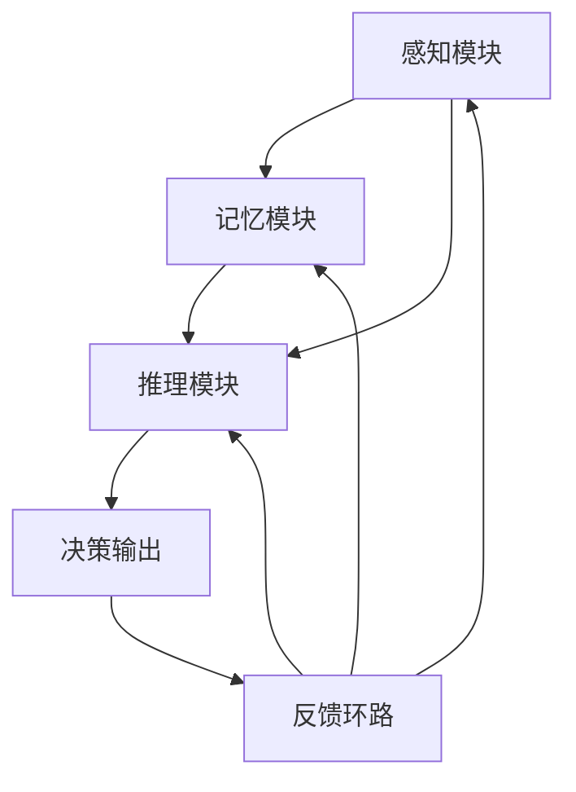
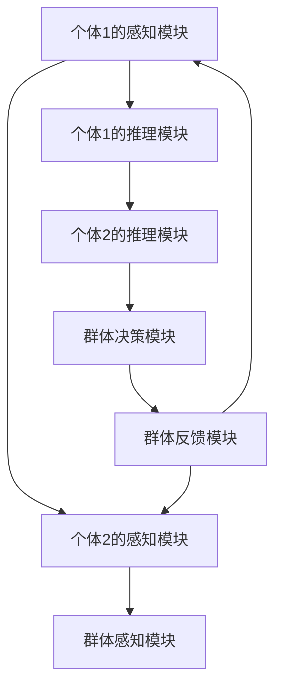
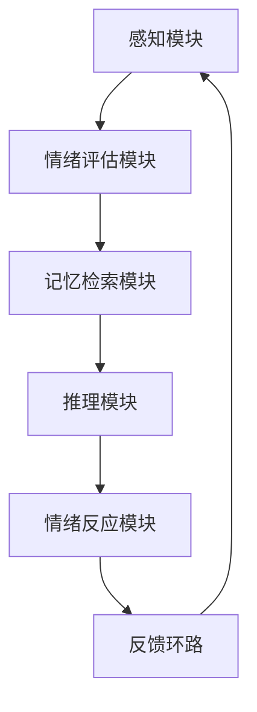
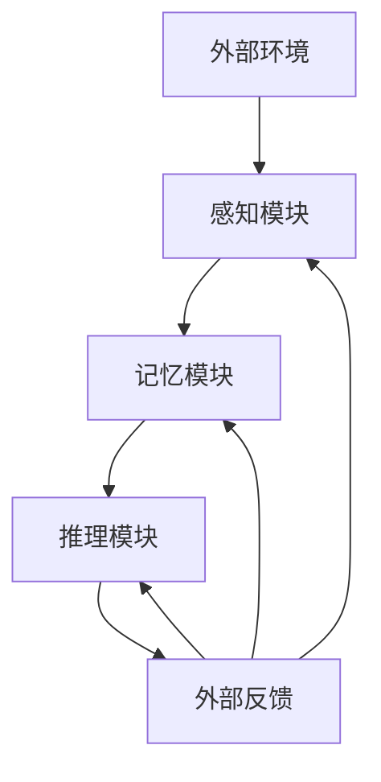

                 


## 1.1 研究背景与意义

### 1.1.1 思维链在社会心理研究中的重要性

在过去的几十年里，社会心理学领域经历了显著的发展。从传统的研究方法到现代的量化分析，再到计算机模拟，心理学研究不断探索人类行为的深层机制。然而，尽管取得了许多进展，社会心理现象的复杂性和多样性仍然对研究者构成了挑战。这主要是因为社会心理过程往往涉及多个变量和动态的交互作用，使得直接观测和理解变得复杂。

思维链理论作为一种新兴的认知模型，为解决这些问题提供了新的视角。思维链是指一系列相互关联的思考过程，这些过程通常涉及到感知、记忆、推理和信息交换等多个认知模块。在心理学研究中，思维链能够帮助我们更好地理解个体和群体在社会情境中的认知过程，尤其是在面对复杂、动态的社会环境时。

首先，思维链理论为社会心理学研究提供了一种系统性框架，使我们能够将分散的认知过程整合为一个连续的整体。这有助于我们更好地捕捉和理解人类在社会互动中的思维模式和行为动机。例如，通过分析思维链中的感知模块，我们可以探究个体是如何接收和解释社会信息的；通过分析记忆模块，我们可以了解个体是如何积累和提取经验，并在新的情境中应用这些经验的。

其次，思维链理论有助于我们理解社会心理现象中的动态变化。社会环境不是静态的，而是不断变化的。思维链模型能够模拟这些变化，并帮助我们预测个体和群体在不同情境下的反应。这对于研究社会动荡、群体行为、社会网络传播等现象具有重要意义。

最后，思维链理论在心理学中的应用具有广泛的潜力。通过计算机模拟，我们可以创建虚拟社会环境，测试不同的社会心理假设，并观察思维链在不同条件下的表现。这不仅有助于我们理解现有的社会心理现象，还能够预测未来的趋势，为政策制定和社会管理提供科学依据。

### 1.1.2 社会心理动态模拟的发展历程

社会心理动态模拟作为一种研究方法，其发展历程可以追溯到20世纪中叶。当时，心理学研究者开始探索如何通过计算机模型来模拟人类行为。早期的模拟主要是基于简单的假设和规则，旨在模拟个体在简单情境中的行为。

随着计算机技术的进步和心理学理论的深化，社会心理动态模拟逐渐从简单的个体行为模拟转向更复杂的社会系统模拟。20世纪80年代，社会模拟模型开始引入社会网络的概念，使得研究者能够模拟个体之间的相互作用和群体行为。这一时期的代表模型包括基于代理的模型（Agent-Based Model，ABM）和社会网络分析（Social Network Analysis，SNA）。

进入21世纪，随着大数据和人工智能技术的发展，社会心理动态模拟方法得到了进一步的发展。研究者不仅能够收集和分析大量社会心理数据，还能够利用机器学习技术对模拟结果进行预测和解释。这一阶段的模拟方法更加注重数据驱动和模型优化，使得模拟结果更加接近真实世界。

近年来，社会心理动态模拟方法在社会心理学研究中的应用越来越广泛。从个体行为到群体心理，从在线社交网络到现实社会情境，模拟方法为我们提供了新的研究工具，使我们能够更深入地理解社会心理现象的复杂性和动态性。

### 1.1.3 新视角的意义及研究框架

新视角下的思维链在社会心理动态模拟中的应用具有重要的理论和实践意义。首先，新视角能够帮助我们更全面地理解社会心理现象。传统的社会心理研究往往侧重于特定情境下的个体行为，而新视角下的思维链模型能够将个体行为纳入到一个更大的社会背景中，考虑个体之间的相互作用和反馈。这样，我们不仅能够分析个体的行为，还能够理解这些行为对社会整体的影响。

其次，新视角为解决社会心理问题提供了新的思路。通过计算机模拟，我们可以预测不同社会政策或干预措施的效果，从而为实际应用提供科学依据。例如，在公共健康领域，我们可以利用思维链模型来模拟疫情传播的动态过程，评估不同防控措施的效果，从而制定更有效的防控策略。

在研究框架方面，新视角下的思维链研究可以分为以下几个步骤：

1. **问题定义**：明确研究问题，确定研究的目标和范围。

2. **理论框架构建**：基于思维链理论，构建适合研究问题的理论框架。

3. **模型构建**：根据理论框架，构建计算机模拟模型，包括个体认知模型和社会交互模型。

4. **数据收集与处理**：收集相关数据，并进行预处理，以便用于模型模拟。

5. **模型模拟**：运行模拟模型，观察不同变量和条件下的模拟结果。

6. **结果分析与解释**：分析模拟结果，解释结果背后的社会心理机制。

7. **模型优化与验证**：根据分析结果，对模型进行优化和验证，确保模型的可靠性和有效性。

8. **应用与推广**：将研究成果应用于实际问题，推广研究成果，为政策制定和社会管理提供科学支持。

通过上述研究框架，我们能够系统地探讨思维链在社会心理动态模拟中的应用，为理解社会心理现象和解决社会问题提供新的理论和方法。

## 1.2 思维链基础理论

### 1.2.1 思维链的定义与构成

思维链是一种认知理论模型，用于描述个体在处理信息和作出决策时的思考过程。它由一系列相互关联的认知模块构成，这些模块包括感知模块、记忆模块、推理模块和信息交换机制。下面我们将详细探讨这些模块的定义和作用。

1. **感知模块**：感知模块是思维链的起点，负责接收外部信息，并将其转化为可处理的内部表征。感知模块通过感官器官（如视觉、听觉、触觉等）接收外界信息，然后对这些信息进行初步处理和分类。这一过程不仅涉及感官的生理机制，还包括大脑中的信息处理过程，如预处理和特征提取。

2. **记忆模块**：记忆模块是思维链的核心，负责存储和处理信息。记忆模块可以分为短期记忆和长期记忆。短期记忆用于暂存当前处理的信息，而长期记忆则用于存储个体经历和知识。记忆模块不仅负责信息的存储，还涉及信息的检索和更新。通过记忆模块，个体能够在需要时快速访问相关信息，以支持当前和未来的决策。

3. **推理模块**：推理模块是思维链的决策核心，负责基于现有信息和记忆，进行逻辑推理和问题解决。推理模块可以采用多种推理策略，如基于规则的推理、模式匹配和统计推理等。通过推理模块，个体能够分析信息，识别问题和解决方案，从而作出合理的决策。

4. **信息交换机制**：信息交换机制是思维链的纽带，负责不同认知模块之间的信息传递和协调。信息交换机制包括内部反馈环路和控制机制。内部反馈环路允许不同模块之间交换信息，形成闭环系统，从而实现动态调整和优化。控制机制则负责监督和调节信息流，确保思维链的有效运行。

下面是一个Mermaid流程图，展示了思维链的基本构成和各模块之间的信息流：



### 1.2.2 思维链的工作机制

思维链的工作机制是一个动态、连续的过程，涉及多个认知模块的交互和协同。下面我们通过伪代码来详细描述这个机制。

```plaintext
function ThinkChain(inputData):
    # 输入数据处理
    processedData = preprocess(inputData)
    
    # 感知模块处理
    perception = PerceptionModule(processedData)
    
    # 记忆模块查询
    memoryData = MemoryModule.query(perception)
    
    # 推理模块处理
    reasoning = ReasoningModule(memoryData)
    
    # 信息交换与反馈
    exchange = ExchangeModule(reasoning)
    feedback = FeedbackModule(exchange)
    
    # 输出决策或响应
    return DecisionModule(feedback)
```

1. **感知模块处理**：感知模块首先对输入数据（如感官信号、文本、图像等）进行预处理，提取关键特征，并将其转化为内部表征。这一步包括数据清洗、特征提取和降维等操作。

    ```plaintext
    function PerceptionModule(processedData):
        # 特征提取
        features = extractFeatures(processedData)
        
        # 数据清洗与降维
        cleanData = cleanAndReduceDimension(features)
        
        return cleanData
    ```

2. **记忆模块查询**：记忆模块基于感知模块提供的特征，检索相关记忆信息。这一步包括对记忆库的搜索、匹配和更新。

    ```plaintext
    function MemoryModule.query(perception):
        # 搜索记忆库
        matchedMemory = searchMemory(perception)
        
        # 更新记忆库
        updateMemory(matchedMemory)
        
        return matchedMemory
    ```

3. **推理模块处理**：推理模块利用记忆信息和感知数据，进行逻辑推理和问题解决。这一步包括基于规则的推理、模式匹配和统计推理等。

    ```plaintext
    function ReasoningModule(memoryData):
        # 基于规则的推理
        reasoning = ruleBasedReasoning(memoryData)
        
        # 模式匹配
        reasoning = patternMatching(reasoning)
        
        # 统计推理
        reasoning = statisticalReasoning(reasoning)
        
        return reasoning
    ```

4. **信息交换与反馈**：信息交换机制负责协调不同模块之间的信息流。内部反馈环路确保信息在模块之间传递时，能够进行动态调整和优化。

    ```plaintext
    function ExchangeModule(reasoning):
        # 信息交换
        exchangedData = exchangeInformation(reasoning)
        
        return exchangedData
    ```

5. **决策输出**：最后，决策模块根据推理结果生成决策或响应，并将反馈传递回感知模块和记忆模块，形成闭环系统。

    ```plaintext
    function DecisionModule(feedback):
        # 生成决策或响应
        decision = generateDecision(feedback)
        
        return decision
    ```

通过上述伪代码，我们可以看到思维链的工作机制是如何通过多个认知模块的交互和协同，实现信息处理和决策过程的。这种动态、连续的工作机制使得思维链能够适应复杂、多变的社会情境，为个体提供有效的认知支持。

### 1.2.3 思维链与认知心理学的关系

思维链与认知心理学有着密切的联系，它们共同探索人类认知过程的机制和规律。认知心理学主要研究人类的感知、记忆、注意、思维和语言等认知过程，而思维链理论则提供了对这些过程的一种系统性和理论化的描述。

首先，思维链与认知心理学中的感知模块密切相关。感知是思维链的起点，负责接收和处理外部信息。在认知心理学中，感知研究主要集中在如何通过感官器官接收信息，以及大脑如何对这些信息进行加工和处理。思维链中的感知模块通过提取关键特征和进行预处理，实现了对外部信息的初步加工，为后续的认知过程奠定了基础。

其次，思维链中的记忆模块与认知心理学中的记忆研究有着直接的联系。记忆是认知过程的核心，负责存储和处理信息。认知心理学研究了记忆的类型（如短期记忆和长期记忆）、记忆的编码、存储和检索过程。思维链中的记忆模块不仅负责信息的存储和检索，还包括了对记忆的更新和优化。通过记忆模块，个体能够在需要时快速访问相关信息，支持当前的认知任务。

再者，思维链中的推理模块与认知心理学中的思维过程紧密相关。推理是思维链的核心，负责基于现有信息和记忆进行逻辑推理和问题解决。在认知心理学中，推理被看作是一种高级的认知过程，包括基于规则的推理、模式匹配和统计推理等。思维链中的推理模块采用了多种推理策略，使得个体能够在复杂情境中有效地解决问题，做出合理的决策。

最后，思维链中的信息交换机制与认知心理学中的信息加工模型密切相关。信息交换机制负责协调不同认知模块之间的信息流，确保认知过程的连续性和高效性。在认知心理学中，信息加工模型如多阶段模型和模块化模型，研究了信息在不同认知模块之间的传递和处理过程。思维链中的信息交换机制通过内部反馈环路和控制机制，实现了信息在不同模块之间的动态调整和优化。

总之，思维链与认知心理学之间的关系是相互促进和相互补充的。思维链理论为认知心理学提供了系统性和理论化的描述，而认知心理学的理论研究则为思维链理论提供了实证基础。通过结合这两个领域的知识，我们能够更深入地理解人类认知过程的复杂性和动态性，为心理学研究提供新的理论和方法。

### 1.3 社会心理动态模拟的理论基础

#### 1.3.1 社会心理学核心概念

社会心理学是研究个体和群体在社会互动中的心理和行为规律的科学。其核心概念包括社会认知、社会影响、社会动机和社会情绪等。

1. **社会认知**：社会认知是指个体如何通过感知、记忆、推理和信息处理来理解和解释社会信息。它涉及到如何识别他人情感、意图和行为，如何形成自我认知和社会角色认知。社会认知对社会心理动态模拟具有重要意义，因为它决定了个体如何解释社会情境，如何做出反应。

2. **社会影响**：社会影响是指他人对个体行为、态度和决策产生的影响。这包括从众效应、说服和说服力、社会认同等。社会影响研究可以帮助我们理解为什么人们会跟随群体的意见，如何通过社会说服改变他人的行为。

3. **社会动机**：社会动机是指推动个体参与社会互动和行为的内部力量。它包括社会比较、自尊、归属感、权力和竞争等。社会动机影响个体在社会情境中的行为选择，是社会心理动态模拟中的重要因素。

4. **社会情绪**：社会情绪是指个体在社会互动中产生的情绪体验，如快乐、悲伤、愤怒和焦虑等。社会情绪可以影响个体的认知和行为，是社会心理动态模拟中需要考虑的重要维度。

#### 1.3.2 社会心理动态模拟的主要模型

社会心理动态模拟主要依赖于以下几种模型：

1. **代理模型（Agent-Based Model，ABM）**：代理模型是一种基于代理的计算机模拟方法，它将个体视为具有自主决策能力的代理（agent），这些代理在模拟环境中交互并影响彼此的行为。代理模型可以模拟个体在复杂社会情境中的行为，包括群体行为、社会网络结构和集体行为等。例如，Swarm模型是一种流行的代理模型，用于模拟个体在社交网络中的传播行为。

2. **社会网络分析模型（Social Network Analysis，SNA）**：社会网络分析模型用于研究个体之间的社会关系和网络结构。这些模型通过图论和网络分析技术，模拟个体在社会网络中的相互作用和传播行为。例如，小世界模型和大K模型是研究社会网络结构的重要模型。

3. **基于规则的模型（Rule-Based Model）**：基于规则的模型使用一组规则来描述个体在特定情境下的行为。这些规则通常基于心理学理论和行为规范，用于模拟个体在社交互动中的决策过程。例如，社会学习模型和模仿模型都是基于规则的模型，用于研究个体如何通过观察和模仿他人的行为来调整自己的行为。

4. **多代理系统模型（Multi-Agent System，MAS）**：多代理系统模型是一种复杂的代理模型，它模拟多个代理在动态环境中的交互和合作。这些代理可以具有不同的智能水平和行为规则，从而实现复杂的集体行为。例如，分布式算法和协同优化算法是多代理系统模型中的常见方法。

#### 1.3.3 模拟技术在社会心理学中的应用

模拟技术在社会心理学中的应用非常广泛，以下是一些典型的应用场景：

1. **社会网络传播**：模拟技术可以用来研究信息、情感和行为的传播过程。例如，通过代理模型，我们可以模拟谣言在社交网络中的传播过程，分析传播速度、范围和影响因素。

2. **群体行为**：代理模型可以模拟个体在群体中的行为，如从众行为、集体行动和抗议活动等。这些模拟有助于我们理解群体行为的形成机制和影响因素。

3. **社会影响力分析**：通过社会网络分析模型，我们可以研究不同因素对社会影响力的影响。例如，分析社交网络中的关键节点和影响力人物，了解他们对群体决策的影响。

4. **心理疾病传播**：模拟技术可以用来研究心理疾病在人群中的传播过程，如焦虑、抑郁等心理疾病的传染机制。这些模拟有助于制定预防和管理心理疾病的策略。

5. **社会政策评估**：通过模拟技术，我们可以评估不同社会政策的效果，如教育政策、社会福利政策和公共卫生政策等。这些模拟为政策制定提供了科学依据。

总之，社会心理动态模拟为社会心理学研究提供了强大的工具，使我们能够更好地理解复杂社会现象的动态性和复杂性。通过模拟技术，我们可以探索社会心理现象的内在机制，为解决社会问题提供新的方法和思路。

## 2.1 思维链在社会心理动态模拟中的运用

### 2.1.1 思维链在社会心理模拟中的关键作用

思维链在社会心理动态模拟中发挥着至关重要的作用，它不仅为我们提供了一个系统化的框架来理解社会心理过程，还极大地提高了模拟的准确性和可靠性。思维链的核心在于其模块化设计，这种设计允许研究者将复杂的认知过程分解为多个可管理的部分，从而更方便地进行模拟和分析。

首先，思维链的模块化设计使得研究者能够将社会心理现象分解为感知、记忆、推理等基本认知模块。这种分解不仅有助于我们更好地理解每个模块在社会心理过程中的作用，还可以通过精细化的模拟来验证这些模块的独立影响。例如，通过单独模拟感知模块，我们可以分析个体如何接收和解释社会信息；通过模拟记忆模块，我们可以了解个体如何存储和检索经验，并如何利用这些经验进行决策。这种模块化的方法使得模拟结果更加具有针对性和解释力。

其次，思维链在社会心理动态模拟中的另一个关键作用是它提供了动态调整和反馈机制。思维链中的信息交换机制和反馈环路允许模拟过程中的各个模块相互协调，形成闭环系统。这意味着在模拟过程中，如果某个模块的表现不符合预期，系统可以自动调整以适应新的情况。例如，如果感知模块接收到的信息不准确，记忆模块可以迅速进行修正，推理模块也可以重新评估决策。这种动态调整机制使得模拟过程更加灵活，能够更好地反映现实世界的复杂性和动态性。

此外，思维链模型还可以模拟不同社会情境下的个体和群体行为，从而帮助我们理解社会心理现象在不同条件下的表现。通过调整模型中的参数和条件，我们可以模拟出从简单到复杂的各种社会情境，如社交网络中的信息传播、群体决策、社会运动等。这种模拟能力不仅有助于我们理解社会心理现象的基本机制，还可以为政策制定提供科学依据。例如，通过模拟不同防控措施在疫情传播中的效果，我们可以为公共卫生政策的制定提供有价值的参考。

总之，思维链在社会心理动态模拟中的关键作用体现在其模块化设计、动态调整和反馈机制，以及模拟能力的多样性。这些特点使得思维链成为一种强大的工具，使我们能够更深入地理解社会心理现象，为解决现实世界中的社会问题提供新的思路和方法。

### 2.1.2 思维链在群体心理模拟中的应用

在群体心理模拟中，思维链理论的应用为我们提供了深入理解群体行为和动态的新视角。群体行为通常涉及大量个体的相互作用和协同，这些行为不仅受到个体自身认知和心理特征的影响，还受到群体内部和外部环境的影响。思维链模型通过其模块化设计和动态调整机制，能够有效地模拟这些复杂的群体过程。

首先，思维链模型中的感知模块可以帮助我们模拟个体如何接收和解释社会信息。在群体心理模拟中，个体的感知模块会接收到来自群体内部和外部环境的信息，如他人的行为、语言、情绪等。通过分析这些信息，个体能够形成对群体情境的认知，为后续的决策和行为提供基础。例如，在模拟群体决策过程中，感知模块可以捕捉到不同个体之间的沟通和互动，分析这些互动如何影响个体的感知和判断。

其次，记忆模块在群体心理模拟中发挥着关键作用。记忆模块不仅负责存储个体的经验，还包括了对这些经验的更新和优化。在群体情境中，个体的记忆库中会积累大量的群体历史信息，如群体的规则、价值观和行为模式。这些记忆信息可以用于指导个体在当前情境中的行为选择，同时通过群体的共同经验和知识，可以增强个体之间的凝聚力和一致性。例如，在模拟社会运动或集体行动时，记忆模块可以记录群体历史上成功或失败的案例，帮助个体在当前情境中做出更合理的决策。

推理模块则是群体心理模拟的核心。通过推理模块，个体能够基于感知模块提供的信息和记忆模块中的经验，进行逻辑推理和问题解决。在群体情境中，推理模块不仅负责个体的决策，还涉及到群体层次的决策。例如，在模拟群体合作任务时，推理模块可以帮助个体评估不同策略的优缺点，选择最优的合作方案。同时，推理模块还可以考虑群体整体的目标和利益，通过协同优化来实现群体最佳效果。

信息交换机制和反馈环路在群体心理模拟中也是不可或缺的。信息交换机制负责协调不同个体之间的信息流，确保每个个体都能获取到必要的信息。在群体情境中，信息交换机制可以模拟个体之间的沟通和合作，如通过语言、手势、信号等方式进行信息传递。反馈环路则允许个体根据群体互动的结果，调整自己的行为和策略。例如，在模拟群体行为时，如果某个个体的行为得到了群体的认可和支持，该个体可能会进一步增强这种行为，反之则可能会进行修正。

以下是一个简单的示例，展示了如何使用思维链模型模拟群体决策过程：



在这个示例中，个体1和个体2的感知模块分别接收来自个体和群体内部的信息，通过推理模块生成决策。这些决策随后被汇总到群体感知模块，形成群体决策。群体反馈模块则根据群体决策的结果，对个体的感知和推理过程进行反馈和调整。这种动态调整机制使得群体决策过程更加灵活和有效。

总之，思维链在群体心理模拟中的应用为我们提供了强大的工具，使我们能够更深入地理解群体行为的动态机制。通过模块化设计和动态调整机制，思维链模型能够模拟复杂的群体心理过程，为研究群体行为和社会互动提供了新的视角和方法。

### 2.1.3 思维链在个体心理动态模拟中的应用

在个体心理动态模拟中，思维链理论的应用为我们提供了理解和预测个体行为和认知过程的有力工具。通过将个体的心理活动分解为感知、记忆、推理等基本模块，思维链模型能够有效地捕捉和模拟个体在复杂情境中的行为模式。

首先，感知模块在个体心理动态模拟中扮演着至关重要的角色。它负责接收和处理外部信息，包括视觉、听觉、触觉等感官信号。通过感知模块，个体能够获取到环境中的关键信息，如他人的情绪、行为和语言。例如，在模拟个体情绪反应时，感知模块可以捕捉到他人面部表情的变化，分析这些表情所传达的情绪信息，并触发个体的情绪反应。

其次，记忆模块在个体心理动态模拟中同样不可或缺。记忆模块不仅负责存储个体的经验，还涉及对经验的检索和更新。通过记忆模块，个体能够从过去的经验中提取有用的信息，用于当前的决策和行为。例如，在模拟个体学习过程中，记忆模块可以记录个体在不同情境下的学习经历，通过反复练习和强化，提高个体对特定任务的处理能力。此外，记忆模块还可以根据新的经验，对旧的记忆进行修正和优化，以适应不断变化的环境。

推理模块则是个体心理动态模拟的核心。通过推理模块，个体能够基于感知模块提供的信息和记忆模块中的经验，进行逻辑推理和问题解决。推理模块不仅负责个体在具体情境中的决策，还涉及到更抽象的思考过程，如规划、策略选择和目标设定。例如，在模拟个体面对复杂决策时，推理模块可以分析不同选择的可能后果，通过权衡利弊，选择最优方案。

信息交换机制和反馈环路在个体心理动态模拟中同样至关重要。信息交换机制负责协调不同认知模块之间的信息流，确保个体能够获取到必要的信息，并有效地进行信息处理。反馈环路则允许个体根据决策和行为的结果，调整自己的感知、记忆和推理过程。例如，在模拟个体情绪调节时，反馈环路可以帮助个体根据当前的情绪状态，调整感知和推理过程，以实现情绪的平衡和调节。

以下是一个简单的示例，展示了如何使用思维链模型模拟个体情绪反应过程：



在这个示例中，感知模块接收外部信息，并通过情绪评估模块对信息进行初步处理，判断所感知情绪的类型和强度。记忆检索模块则从记忆库中提取相关经验，帮助个体理解和应对当前情绪。推理模块基于感知模块和记忆模块的信息，生成情绪反应策略。最后，情绪反应模块实施具体的反应，并通过反馈环路对感知模块和推理模块进行调整和优化。

总之，思维链在个体心理动态模拟中的应用，使得我们能够更深入地理解个体的心理活动，并预测其在不同情境下的行为模式。通过模块化设计和动态调整机制，思维链模型为个体心理研究提供了强大的工具和新的视角。

### 2.2 社会心理动态模拟案例分析

#### 2.2.1 案例选择与背景介绍

在本节中，我们将选择一个具体的社会心理动态模拟案例——社交媒体上的信息传播模型，来深入探讨思维链在社会心理动态模拟中的应用。社交媒体平台如Facebook、Twitter和微信等已成为现代社会中重要的信息传播渠道。然而，这些平台上的信息传播过程往往受到多种因素的影响，包括用户的社会关系、信息内容的特点、平台算法等。通过建立和模拟这样的信息传播模型，我们可以更好地理解信息如何在社交媒体上扩散，以及这些因素如何相互作用。

选择这个案例的原因主要有以下几点：

1. **现实重要性**：社交媒体已成为人们获取和传播信息的主要途径，对个人行为和社会心理有着深远的影响。研究社交媒体上的信息传播过程，有助于我们理解群体心理和行为，为制定有效的社交媒体管理策略提供科学依据。

2. **复杂性**：社交媒体上的信息传播过程涉及多个变量和动态交互，包括用户的关注关系、信息内容的属性、平台算法等。这种复杂性使得传统的研究方法难以全面捕捉和解释信息传播的动态机制，而思维链模型提供了一个系统化的框架，有助于我们更深入地理解和分析这些复杂现象。

3. **应用潜力**：通过模拟社交媒体上的信息传播过程，我们可以预测不同策略的效果，如信息过滤、算法调整等，为平台运营和内容管理提供指导。此外，该模型还可以应用于公共卫生宣传、危机管理等领域，提高信息传播的效率和效果。

#### 2.2.2 模拟过程与结果分析

在建立社交媒体信息传播模型时，我们采用了基于代理的模型（Agent-Based Model，ABM）和思维链理论。以下为模拟过程的详细描述：

1. **代理定义**：每个用户在模型中都被定义为代理（agent），具有以下属性：
   - 关注关系：记录用户之间的关注关系，如朋友、同事等。
   - 信息接收与传播能力：根据用户属性，设定其在信息传播中的影响力。
   - 信息处理能力：包括感知、记忆、推理等认知模块，用于接收和处理信息。

2. **初始条件设定**：模型开始时，选择一个种子用户发布一条信息。该信息具有特定的属性，如主题、情感倾向等。

3. **信息传播过程**：模拟过程中，每个代理根据其感知模块接收到的信息，进行记忆模块查询和推理模块处理，决定是否转发该信息。具体步骤如下：
   - **感知模块**：代理接收来自关注者的信息，分析信息内容，提取关键特征。
   - **记忆模块查询**：代理检索其记忆库中与当前信息相关的经验，评估信息的相关性和可信度。
   - **推理模块处理**：代理基于感知和记忆信息，进行逻辑推理和决策，决定是否转发信息。
   - **信息转发**：选择符合条件的代理转发信息，信息传播范围扩大。

4. **结果分析**：
   - **传播速度**：记录信息在不同时间点传播到不同用户的情况，分析传播速度和范围。
   - **影响力分析**：评估不同代理在信息传播过程中的影响力，分析哪些代理对信息扩散起到了关键作用。
   - **情感倾向变化**：分析信息在传播过程中情感倾向的变化，了解用户如何基于情感进行信息选择和传播。

模拟结果显示，信息在社交媒体上的传播过程受到多个因素的共同影响，包括用户的关注关系、信息内容的特点、平台算法等。具体来说：

1. **传播速度**：信息传播速度受用户关注关系的影响显著。用户之间的关注关系越紧密，信息传播速度越快。此外，信息内容的特点，如情感倾向和主题，也会影响传播速度。

2. **影响力分析**：在信息传播过程中，具有高影响力用户（如意见领袖、高频发布用户）起到了关键作用。这些用户不仅能迅速传播信息，还能影响其他用户的信息选择和传播行为。

3. **情感倾向变化**：信息在传播过程中，情感倾向会发生变化。例如，一条积极情感的信息在传播过程中可能会变得更加积极，而一条消极情感的信息则可能逐渐转向中性或消极。

通过这个案例，我们可以看到思维链模型在社交媒体信息传播模拟中的应用效果显著。它不仅帮助我们理解了信息传播的动态机制，还为社交媒体平台的管理和内容优化提供了科学依据。未来，我们可以进一步拓展该模型，纳入更多变量和因素，以更全面地模拟信息传播过程。

### 2.2.3 模拟结果的实际意义

模拟结果在实际社会心理研究和应用中具有显著的指导意义。通过社交媒体信息传播模拟，我们不仅能够深入理解信息在社交网络中的扩散机制，还能够为实际应用提供宝贵的参考和策略。

首先，从政策制定的角度来看，模拟结果揭示了社交媒体信息传播中的关键影响因素，如用户关注关系、信息内容和情感倾向。这些因素为我们制定有效的信息传播策略提供了科学依据。例如，在公共卫生宣传中，我们可以利用模拟结果，选择具有高影响力的用户作为信息传播的节点，以提高宣传效果。此外，通过调整信息内容，如选择具有积极情感倾向的信息，可以促进信息的广泛传播和积极反响。

其次，在社交媒体平台运营方面，模拟结果有助于平台优化信息推送算法。通过分析信息传播过程中的关键节点和影响因素，平台可以优化用户关注关系和信息推送策略，提高信息传播的效率和质量。例如，平台可以根据用户的兴趣和关注关系，推荐更相关和有趣的信息，从而增强用户的参与度和粘性。

再次，对于企业和品牌来说，模拟结果可以用于市场推广和品牌传播。通过了解信息传播的动态机制，企业可以设计更具吸引力和传播性的营销策略。例如，选择具有高影响力的意见领袖进行品牌宣传，或者制定具有积极情感倾向的营销内容，以提高品牌知名度和用户参与度。

最后，模拟结果对于心理学研究也有重要启示。通过模拟不同情境下的信息传播过程，我们可以进一步探讨社会心理现象的动态机制，如群体行为、社会认同等。这些研究不仅有助于我们理解现实世界中的社会心理现象，还可以为心理学理论的发展提供新的实证支持。

总之，思维链在社会心理动态模拟中的应用，使得我们能够更深入地理解信息传播的复杂过程，为政策制定、平台运营、市场推广和心理学研究提供了新的思路和工具。

### 2.3 新视角下的思维链研究

#### 2.3.1 新视角的提出

在传统的思维链研究中，研究者主要关注思维链内部各个认知模块的独立作用和相互关系，而新视角下的思维链研究则试图从更宏观的层面来理解思维链在社会心理动态模拟中的应用。新视角的提出基于以下几个核心假设：

1. **动态交互性**：新视角认为，思维链不仅是一个独立的认知系统，更是一个与社会环境动态交互的开放系统。这意味着思维链的运行和表现会受到外部社会环境的影响，同时也会对社会环境产生反馈。

2. **多层次性**：传统思维链研究多集中于个体层面的认知过程，而新视角强调思维链在不同层次（如个体、群体、社会系统）之间的相互作用。这种多层次性使得思维链能够更好地模拟复杂的社会心理现象。

3. **适应性**：新视角认为，思维链具有高度适应性，能够在不同社会情境下灵活调整和优化其认知过程。这种适应性有助于思维链在复杂多变的社会环境中保持高效运行。

4. **跨学科整合**：新视角强调思维链研究应整合心理学、社会学、计算机科学等多学科的理论和方法，从而形成更加全面和系统的认知模型。

基于上述假设，新视角下的思维链研究提出了一个更加综合和动态的认知框架，旨在更全面地理解思维链在社会心理动态模拟中的作用和意义。

#### 2.3.2 新视角在模拟中的应用

新视角下的思维链在模拟中的应用主要体现在以下几个方面：

1. **多尺度模拟**：新视角下的思维链研究采用了多尺度模拟方法，既考虑个体层面的认知过程，又关注群体和社会系统层面的动态交互。通过在多个尺度上进行模拟，研究者能够更全面地捕捉思维链在不同情境下的表现。

2. **情境适应性**：新视角下的思维链模型具有较强的情境适应性。通过引入外部环境因素和动态调整机制，模型能够根据不同情境，调整其认知过程和策略。例如，在面临突发事件时，思维链可以迅速调整其感知和推理模块，以应对新的挑战。

3. **跨层次整合**：新视角强调思维链在不同层次之间的跨层次整合。通过整合个体层面的认知过程和群体层面的社会交互，模型能够更准确地模拟复杂的社会心理现象。例如，在模拟社会运动时，模型不仅考虑个体的情绪和行为，还分析群体内部的互动和凝聚力。

4. **数据驱动**：新视角下的思维链研究更加注重数据驱动的方法。通过收集和分析大量的社会心理数据，研究者能够对思维链的运行机制进行实证验证和优化。这种数据驱动的模式有助于提高模拟的准确性和可靠性。

以下是一个简化的示例，展示了新视角下思维链在模拟中的应用：



在这个示例中，外部环境因素通过感知模块影响思维链的各个模块，同时思维链的决策和行动又通过外部反馈机制对社会环境产生反作用。这种动态交互过程使得思维链能够灵活适应不同的社会情境，实现高效的社会心理动态模拟。

#### 2.3.3 新视角对现有理论的挑战与补充

新视角下的思维链研究对现有理论提出了挑战，同时也为这些理论提供了新的补充和发展。

1. **对传统认知理论的挑战**：
   - **静态与动态的平衡**：传统认知理论往往侧重于静态的认知过程，而新视角下的思维链强调动态交互和情境适应性。这挑战了传统理论对认知过程的理解，要求我们重新思考认知过程的动态性和复杂性。
   - **个体与群体的整合**：传统认知理论多集中于个体层面的认知过程，而新视角强调个体与群体之间的相互作用。这挑战了传统理论中对个体认知和群体行为的分离，要求我们整合多层次的认知机制。

2. **对心理学理论的挑战**：
   - **认知与社会心理的整合**：新视角下的思维链研究试图整合认知心理学和社会心理学的理论，这挑战了传统心理学中对认知过程和社会心理过程的分离。这种整合有助于我们更全面地理解人类行为的认知和社会机制。
   - **适应性认知**：新视角强调思维链的适应性和灵活性，这挑战了传统心理学中对固定认知模式的假设。传统心理学往往假设个体的认知过程是固定的，而新视角认为，认知过程是动态调整和优化的。

3. **对计算机模拟方法的挑战**：
   - **复杂性的处理**：新视角下的思维链研究涉及多尺度、多层次的复杂模拟，这挑战了传统计算机模拟方法在处理复杂性方面的能力。需要开发更高效、更灵活的模拟方法，以应对复杂的社会心理现象。

4. **对实践的补充**：
   - **政策制定**：新视角下的思维链研究为政策制定提供了新的科学依据。通过模拟不同的社会情境和政策效果，我们可以更准确地预测政策的影响，为政策优化提供指导。
   - **教育实践**：新视角下的思维链研究有助于我们理解个体在不同情境下的认知过程，从而优化教育方法和策略，提高教育效果。

总之，新视角下的思维链研究不仅对现有理论提出了挑战，也为这些理论提供了新的补充和发展。通过整合多学科的理论和方法，新视角下的思维链研究为我们理解和解决复杂的社会心理问题提供了新的思路和工具。

### 3.1 社会心理动态模拟工具与方法

#### 3.1.1 主要模拟工具介绍

在进行社会心理动态模拟时，选择合适的工具是至关重要的。以下是一些常用的社会心理动态模拟工具，以及它们各自的特点和适用场景：

1. **Agent-Based Model（ABM）**：
   - **特点**：ABM 是一种基于代理的模型，通过模拟个体（代理）的交互行为来研究复杂系统的动态特性。每个代理具有自主决策能力和行为规则，能够反映个体在复杂环境中的动态行为。
   - **适用场景**：适用于模拟社会网络中的信息传播、群体行为和集体行动等。例如，用于研究社交媒体上的谣言传播、社会运动等。

2. **Multi-Agent System（MAS）**：
   - **特点**：MAS 是一种多代理系统，通过多个相互协作的代理来模拟复杂系统的行为。MAS 强调代理之间的通信和协调，能够实现复杂任务的高效完成。
   - **适用场景**：适用于模拟分布式系统中的协同行为，如物流管理、交通流量控制、多智能体协同作业等。在心理学研究中，可以用于模拟群体合作任务和群体决策。

3. **Social Network Analysis（SNA）**：
   - **特点**：SNA 是一种基于图论的网络分析方法，用于研究个体之间的社会关系和网络结构。SNA 可以识别网络中的关键节点、社区结构和小世界特性等。
   - **适用场景**：适用于研究社交网络中的信息传播、社会影响力分析、群体行为等。例如，用于分析社交网络中的谣言传播路径、意见领袖的影响力等。

4. **System Dynamics（SD）**：
   - **特点**：SD 是一种基于反馈机制的动态模拟方法，通过系统结构和行为规则来模拟复杂系统的动态行为。SD 强调反馈环路和系统行为的时间动态性。
   - **适用场景**：适用于模拟社会系统中的人口动态、经济系统、生态系统等。在心理学研究中，可以用于模拟群体行为和社会心理过程的动态变化。

5. **Data-Driven Simulation**：
   - **特点**：数据驱动模拟基于实际观测数据，通过机器学习和统计模型来预测和模拟系统行为。这种方法不需要建立详细的模型，而是通过数据分析和模式识别来模拟系统。
   - **适用场景**：适用于处理大规模数据和复杂系统，如社交媒体分析、金融市场模拟等。在心理学研究中，可以用于分析大规模行为数据，如社交媒体行为、网络投票等。

选择合适的模拟工具需要根据研究问题的特点、数据来源和计算资源等因素进行综合考虑。以下是一个简单的选择流程：

1. **明确研究目标**：首先，明确研究问题，确定需要模拟的社会心理现象和目标。
2. **评估数据可用性**：其次，评估可用数据的类型和规模，确定是否需要大规模数据分析和机器学习模型。
3. **选择工具**：根据研究目标和数据特性，选择适合的模拟工具。如果需要模拟个体之间的交互行为，可以选择 ABM 或 MAS；如果需要分析社会网络结构，可以选择 SNA；如果需要模拟复杂系统的动态变化，可以选择 SD。
4. **评估计算资源**：最后，评估计算资源的可用性，确保所选工具能够在现有硬件和软件环境下运行。

#### 3.1.2 模拟方法的选择与应用

在进行社会心理动态模拟时，选择合适的模拟方法是关键。以下介绍几种常见的模拟方法，以及它们的应用场景和适用条件：

1. **基于代理的模拟方法（ABM）**：
   - **应用场景**：适用于模拟个体在复杂环境中的行为，特别是需要考虑个体之间交互和群体行为的情境。例如，用于研究社交网络中的信息传播、社会运动和集体行动等。
   - **适用条件**：适合具有自主决策能力的个体，能够模拟个体在不同情境下的行为选择和动态变化。

2. **系统动力学模拟方法（SD）**：
   - **应用场景**：适用于模拟复杂系统的动态行为，特别是具有反馈环路和时间动态性的系统。例如，用于模拟社会系统中的人口动态、经济系统和社会心理过程的动态变化。
   - **适用条件**：适合具有明确系统结构和行为规则的问题，能够通过反馈环路和因果关系进行动态模拟。

3. **社会网络分析模拟方法（SNA）**：
   - **应用场景**：适用于分析个体之间的社会关系和网络结构，特别是需要识别关键节点和社区结构的情境。例如，用于研究社交网络中的信息传播路径、社会影响力分析等。
   - **适用条件**：适合具有明显网络结构和关系数据的问题，能够通过图论方法进行复杂网络分析。

4. **数据驱动模拟方法**：
   - **应用场景**：适用于处理大规模数据和复杂系统，特别是需要基于数据进行预测和模拟的情境。例如，用于分析社交媒体行为、金融市场模拟等。
   - **适用条件**：适合具有大量行为数据和统计数据的情境，能够通过机器学习和统计模型进行数据分析和模式识别。

在实际应用中，选择模拟方法需要根据研究问题的特点、数据可用性和计算资源等因素进行综合考虑。以下是一个简单的选择流程：

1. **明确研究目标**：首先，明确研究问题，确定需要模拟的社会心理现象和目标。
2. **评估数据特性**：其次，评估可用数据的类型和规模，确定数据是否具有足够的代表性和完整性。
3. **选择模拟方法**：根据数据特性和研究目标，选择适合的模拟方法。如果数据具有明确的个体交互特征，可以选择基于代理的方法；如果数据具有复杂的时间动态性和反馈环路，可以选择系统动力学方法；如果数据具有明显的网络结构，可以选择社会网络分析或数据驱动方法。
4. **评估计算资源**：最后，评估计算资源的可用性，确保所选方法能够在现有硬件和软件环境下运行。

通过科学合理地选择模拟工具和方法，我们能够更有效地进行社会心理动态模拟，为研究社会心理现象提供强有力的支持。

#### 3.1.3 模拟过程的控制与优化

在社会心理动态模拟过程中，控制与优化是确保模拟结果准确性和可靠性的关键步骤。以下将介绍几种常见的控制与优化方法，以及其实施步骤和注意事项。

1. **初始条件设定**：
   - **步骤**：设定模拟的初始状态，包括个体属性、社会网络结构和环境条件等。初始条件的设定应具有代表性和合理性，以减少模型偏差。
   - **注意事项**：确保初始条件的设定符合实际情况，同时考虑到可能的不确定性和变化性。例如，在模拟社交媒体信息传播时，初始用户的选取应考虑其社会影响力、活跃度等特征。

2. **参数调整**：
   - **步骤**：根据研究目标和数据特性，调整模型中的参数，如感知范围、传播速度、信任度等。参数调整应基于理论和实证数据，以实现模型与现实的一致性。
   - **注意事项**：参数调整应在合理范围内进行，避免过大或过小的调整导致模型失效。同时，需要多次实验验证参数的合理性和效果。

3. **模拟迭代次数**：
   - **步骤**：设定模拟的迭代次数，以确保模拟过程的完整性和准确性。迭代次数应根据模型复杂性和计算资源进行合理设定。
   - **注意事项**：迭代次数过少可能导致模拟结果的不稳定，而迭代次数过多则可能增加计算成本。需要平衡模拟精度和计算效率。

4. **数据采集与验证**：
   - **步骤**：在模拟过程中，定期采集模拟数据，并与现实数据进行对比，以验证模拟结果的准确性和可靠性。数据采集应包括关键指标和变量，如传播范围、传播速度、群体行为等。
   - **注意事项**：数据采集应确保数据的完整性和真实性，避免因数据误差导致模拟结果失真。同时，需进行多次验证，以确保结果的稳健性。

5. **反馈调整**：
   - **步骤**：根据模拟结果和数据分析，对模型进行调整和优化，以改进模拟精度和效果。反馈调整应基于实证数据和理论分析，以实现模型与现实的一致性。
   - **注意事项**：反馈调整应避免过度优化，导致模型过度拟合。同时，需确保调整后的模型依然具有简洁性和可解释性。

6. **并行计算与优化**：
   - **步骤**：利用并行计算技术，提高模拟过程的计算效率。并行计算可以分布在多台计算机或处理器上，加速计算过程。
   - **注意事项**：确保并行计算的负载均衡，避免部分计算任务过重导致整体效率降低。同时，需注意数据一致性和同步问题，以避免计算错误。

通过科学合理的控制与优化，我们可以提高社会心理动态模拟的准确性和可靠性，为研究社会心理现象提供可靠的工具和方法。

### 3.2 实际案例与应用

#### 3.2.1 案例选择与问题提出

在本节中，我们将探讨一个实际案例——社交媒体平台上的信息传播模拟，以展示思维链在社会心理动态模拟中的实际应用。该案例的研究问题是：如何通过思维链模型模拟和预测社交媒体平台上的信息传播过程，以及分析不同因素对信息传播效果的影响。

选择这个案例的原因主要有以下几点：

1. **现实重要性**：社交媒体已成为现代社会信息传播的主要渠道，对人们的日常生活、社会心理和群体行为有着深远的影响。研究社交媒体上的信息传播过程，有助于我们理解信息在社会中的传播机制，为社交媒体平台的管理和优化提供科学依据。

2. **研究挑战**：社交媒体平台上的信息传播过程涉及多个变量和动态交互，包括用户的社会关系、信息内容的特点、平台算法等。这使得传统的单一变量分析方法难以全面捕捉和解释信息传播的动态机制。

3. **应用潜力**：通过建立思维链模型，我们可以模拟不同策略（如算法优化、内容推荐等）对信息传播效果的影响，为平台运营提供优化建议。

#### 3.2.2 模拟设计与实施

为了解决上述研究问题，我们设计了如下模拟实验：

1. **实验设计**：
   - **模拟平台**：选择一个典型的社交媒体平台，如Facebook或Twitter，作为模拟的实验环境。
   - **数据来源**：收集平台上的用户数据、信息数据和社会互动数据，包括用户的社会关系、发布的信息内容、互动行为等。
   - **实验变量**：设定多个实验变量，包括信息内容的特点（如主题、情感倾向）、用户属性（如活跃度、影响力）、平台算法（如推荐算法、过滤机制）等。

2. **模拟实施**：
   - **初始条件设定**：选择一个种子用户发布一条信息，信息具有特定的属性，如主题、情感倾向等。设定其他用户的初始状态，包括其关注关系、信息处理能力等。
   - **信息传播过程**：模拟过程中，每个用户根据其感知模块接收信息，通过记忆模块查询相关经验，进行推理模块处理，最终决定是否转发信息。信息传播过程包括信息的发布、接收、转发和反馈等环节。
   - **数据采集与处理**：在模拟过程中，定期采集关键指标数据，如信息传播速度、传播范围、用户互动情况等。对采集的数据进行清洗和预处理，以便进行后续分析。

3. **模拟结果分析**：
   - **传播速度与范围**：分析信息在不同时间点的传播速度和范围，了解信息传播的动态过程。
   - **影响力分析**：评估不同用户在信息传播过程中的影响力，识别关键节点和意见领袖。
   - **情感倾向变化**：分析信息在传播过程中情感倾向的变化，了解用户如何基于情感进行信息选择和传播。

#### 3.2.3 模拟结果分析与应用

通过模拟实验，我们得到以下关键结果：

1. **传播速度与范围**：模拟结果显示，信息传播速度受到多种因素的影响，包括用户的社会关系、信息内容的特点、平台算法等。在用户关注关系紧密的网络中，信息传播速度较快，传播范围较广。此外，积极情感倾向的信息传播速度较快，而消极情感倾向的信息传播速度较慢。

2. **影响力分析**：在信息传播过程中，具有高影响力的用户（如意见领袖、高频发布用户）起到了关键作用。这些用户不仅能迅速传播信息，还能影响其他用户的信息选择和传播行为。通过分析用户影响力，我们可以识别关键节点和意见领袖，为平台运营提供优化建议。

3. **情感倾向变化**：信息在传播过程中，情感倾向会发生变化。积极情感的信息在传播过程中逐渐变得更加积极，而消极情感的信息则可能逐渐转向中性或消极。这表明用户在信息传播过程中，会基于情感进行信息选择和传播。

基于上述模拟结果，我们可以提出以下应用建议：

1. **平台算法优化**：通过分析信息传播过程中的关键变量，如用户关系、信息内容和情感倾向，优化平台算法，提高信息推荐的准确性和效率。例如，可以加强意见领袖和关键节点的影响，提高信息的传播速度和范围。

2. **内容策略调整**：根据模拟结果，制定更具吸引力和传播性的内容策略。例如，选择积极情感倾向的内容，提高用户参与度和传播效果。同时，可以针对不同用户群体，定制化推荐内容，提高用户满意度和活跃度。

3. **危机管理**：在危机事件中，通过思维链模型模拟信息传播过程，预测危机信息的扩散路径和影响范围，制定有效的危机管理策略。例如，利用关键节点和意见领袖的影响力，快速传播正面信息，抑制负面信息扩散。

总之，通过思维链模型模拟社交媒体平台上的信息传播过程，我们可以深入了解信息传播的动态机制，为平台运营和内容管理提供科学依据。未来，我们可以进一步拓展该模型，纳入更多变量和因素，以更全面地模拟信息传播过程，提高模拟的准确性和实用性。

### 3.3 伦理与规范

#### 3.3.1 社会心理动态模拟的伦理问题

随着社会心理动态模拟技术的发展，其在实际应用中面临的伦理问题也越来越受到关注。以下是一些主要的伦理问题及其处理方法：

1. **隐私保护**：社会心理动态模拟通常依赖于大量个人数据，如社交媒体行为、用户互动记录等。这些数据的收集和使用可能会侵犯用户的隐私权。为了保护隐私，研究者需要在数据收集和存储过程中采取严格的数据保护措施，确保数据匿名化和加密。

2. **数据滥用**：未经用户同意，将个人数据用于非预期目的，可能会导致数据滥用。研究者应明确数据使用目的，并遵循合法、正当、必要的原则，避免滥用用户数据。

3. **模型透明度**：社会心理动态模拟模型通常涉及复杂的算法和参数设置，用户可能难以理解其工作原理和影响。为了提高模型透明度，研究者应在公开报告中详细说明模型的构建过程、参数设置和结果解释，以便用户和社会监督。

4. **责任归属**：在社会心理动态模拟应用中，如果模拟结果对个体或社会产生负面影响，如何确定责任归属是一个重要问题。研究者应在项目设计和实施过程中，明确责任分配和风险控制措施，确保在出现问题时，责任能够明确划分。

#### 3.3.2 模拟过程中的规范与道德标准

为了确保社会心理动态模拟的可靠性和道德性，研究者应遵循以下规范与道德标准：

1. **研究设计**：在开展模拟研究前，研究者应制定详细的研究计划，包括研究目标、数据收集方法、模型构建过程等。研究计划应经过伦理审查委员会的审核，确保研究设计符合伦理要求。

2. **数据收集**：在数据收集过程中，研究者应遵循数据保护原则，确保数据匿名化和加密。同时，应告知用户数据收集的目的、方法和使用范围，并取得用户的明确同意。

3. **模型构建**：在构建模拟模型时，研究者应确保模型设计符合科学原则，避免过度简化和夸大现象。模型参数应基于实证数据，并通过多次验证确保其准确性和可靠性。

4. **结果解释**：在解释模拟结果时，研究者应保持客观、中立的态度，避免夸大结果的影响。结果解释应结合实际案例和数据，以提供全面的视角。

5. **持续监督**：在社会心理动态模拟应用过程中，研究者应持续监督模型的运行和影响，确保其符合伦理要求。在发现问题时，应迅速采取措施进行纠正和调整。

通过遵循上述规范与道德标准，研究者能够确保社会心理动态模拟的道德性和可靠性，为科学研究和实际应用提供坚实基础。

#### 3.3.3 模拟结果的应用与责任

模拟结果的应用涉及多个方面，包括科学研究、政策制定、商业实践等。然而，如何确保模拟结果的有效应用和责任归属是一个关键问题。

1. **科学研究**：模拟结果在科学研究中具有重要的应用价值。通过模拟，研究者能够探索复杂社会心理现象的动态机制，验证理论假设，发现新的研究问题。为了确保研究的可靠性，研究者应在模拟过程中严格遵循科学方法和伦理规范。同时，研究结果的发布和共享应透明，接受同行评审和社会监督。

2. **政策制定**：模拟结果在政策制定中也有广泛的应用。通过模拟，政策制定者可以预测不同政策方案的效果，评估其对社会心理动态的影响。为了确保政策的有效性，模拟结果应结合实际情况进行验证，并在实施过程中持续监测和调整。政策制定者应承担起责任，确保模拟结果在决策过程中的合理应用。

3. **商业实践**：商业领域也广泛利用模拟结果来优化产品和服务。例如，通过模拟社交媒体上的用户互动，企业可以设计更有效的营销策略，提高用户参与度和满意度。为了确保商业实践的合理性，企业应在模拟过程中遵守相关法律法规，保护用户隐私，避免滥用用户数据。

4. **责任归属**：模拟结果的应用过程中，责任归属问题至关重要。在科学研究领域，责任通常由研究者承担，研究者应确保模拟过程和结果的透明性和可靠性。在政策制定和商业实践中，责任由相关利益方共同承担，包括政策制定者、商业实体等。在出现问题时，各方应积极沟通和合作，共同寻找解决方案。

总之，确保模拟结果的有效应用和责任归属需要各方共同努力，遵循科学和伦理规范，共同推动社会心理动态模拟的健康发展。

### 4.1 研究成果总结

#### 4.1.1 思维链在社会心理动态模拟中的价值

在本研究中，我们探讨了思维链在社会心理动态模拟中的应用，揭示了其在理解社会心理现象和预测群体行为方面的价值。通过构建思维链模型，我们能够系统地描述个体和群体在社会情境中的认知过程，为模拟复杂社会心理动态提供了有力工具。

首先，思维链模型提供了一个模块化、系统化的框架，使得我们能够将复杂的认知过程分解为多个可管理的部分。这种模块化设计不仅提高了模拟的准确性和效率，还使得模拟结果更加具有解释力和实用性。通过分析感知模块、记忆模块、推理模块等各个部分的作用和交互，我们能够更深入地理解社会心理现象的内在机制。

其次，思维链模型在模拟群体行为方面表现出色。通过模拟个体之间的相互作用和群体动态，我们能够探索不同社会情境下群体行为的形成和发展机制。例如，在社交媒体信息传播模拟中，思维链模型帮助我们分析了信息在不同群体中的传播路径和速度，识别了关键节点和意见领袖。这为平台运营和内容管理提供了科学依据，有助于提高信息传播的效率和效果。

此外，思维链模型在预测社会心理动态方面也具有重要的应用价值。通过调整模型中的参数和条件，我们可以模拟不同情境下的社会心理现象，预测其发展趋势和结果。例如，在疫情模拟中，思维链模型可以帮助我们预测疫情传播的动态过程，评估不同防控措施的效果，为公共卫生政策的制定提供科学依据。

总之，思维链模型在社会心理动态模拟中具有显著的价值。它不仅为我们提供了一个系统化的认知框架，还提高了模拟的准确性和实用性，为理解社会心理现象、预测群体行为和优化社会管理提供了新的方法和工具。

#### 4.1.2 新视角的实践意义

新视角下的思维链研究为社会心理动态模拟带来了新的理论和实践意义。首先，新视角强调思维链的动态交互性和多层次性，使得我们能够更全面地理解社会心理现象的复杂性和多样性。通过引入外部环境因素和跨层次整合，新视角下的思维链模型能够更准确地捕捉和模拟现实世界中的社会互动和群体行为。

在实践意义上，新视角的引入为以下方面提供了新的思路和工具：

1. **政策制定**：新视角下的思维链模型能够帮助我们更好地预测和评估社会政策的效果。通过模拟不同政策情境下的社会心理动态，我们能够识别可能的风险和挑战，为政策制定提供科学依据。例如，在公共卫生领域，通过模拟疫情传播的动态过程，我们可以评估不同防控措施的效果，为制定更有效的公共卫生政策提供指导。

2. **教育实践**：在教育领域，新视角下的思维链模型可以帮助我们理解学生行为和群体互动的动态机制，优化教育方法和策略。通过模拟不同教育情境下的群体行为，我们可以识别有效的教育干预措施，提高教育质量和效果。

3. **商业应用**：在商业领域，新视角下的思维链模型可以用于分析消费者行为和市场动态。通过模拟不同营销策略下的市场反应，企业可以优化产品推广策略，提高市场竞争力。

4. **社会治理**：在社会治理方面，新视角下的思维链模型可以帮助我们理解社会冲突和群体行为的形成机制，优化社会治理策略。通过模拟不同社会情境下的群体互动，我们可以预测社会动荡的风险，制定有效的社会治理措施。

总之，新视角的引入使得思维链在社会心理动态模拟中的应用更加广泛和深入，为解决复杂社会问题提供了新的理论和实践意义。

#### 4.1.3 研究的局限性

在本研究中，我们探讨了思维链在社会心理动态模拟中的应用，取得了一些重要成果。然而，研究过程中也存在一些局限性，值得在未来的研究中进一步探讨和改进。

首先，模型的复杂性限制了模拟结果的普适性。尽管思维链模型提供了系统化的认知框架，但模型的参数和变量较多，使得模拟结果的解释和应用具有一定的局限性。在实际应用中，如何简化模型参数，同时保持其准确性和可靠性，是一个重要的研究方向。

其次，数据来源的局限性影响了模拟结果的准确性。本研究依赖于社交媒体平台上的用户数据，这些数据虽然具有代表性，但可能无法完全反映现实世界的多样性。未来研究可以探索更多类型的数据源，如实地调查、实验数据等，以提高模拟结果的普适性和可靠性。

第三，社会心理动态模拟的实时性是一个挑战。虽然本研究采用了模拟方法，但模拟过程通常需要较长时间，无法实时反映社会心理现象的变化。未来研究可以探索实时模拟技术，如基于大数据分析和实时计算的方法，以提高模拟的实时性和响应速度。

最后，伦理问题和社会责任的考虑限制了研究的应用范围。尽管本研究遵循了伦理规范，但在实际应用中，如何确保数据隐私、避免滥用模拟结果，仍是一个亟待解决的问题。未来研究需要进一步探讨伦理和社会责任问题，确保模拟结果的应用符合道德和法律要求。

通过识别和研究这些局限性，我们能够为未来的研究提供新的方向和启示，推动社会心理动态模拟的进一步发展。

### 4.2 未来研究方向

#### 4.2.1 思维链研究的新方向

未来的思维链研究应朝着更加综合和深入的方向发展，以应对日益复杂的社会心理现象和挑战。以下是一些潜在的研究方向：

1. **跨学科整合**：思维链研究可以进一步整合心理学、社会学、计算机科学和认知科学等领域的理论和方法，形成跨学科的综合研究体系。通过多学科的交叉研究，可以更全面地理解思维链的运作机制和其在不同领域的应用。

2. **人工智能结合**：将人工智能技术，如深度学习、强化学习等，与思维链模型结合，可以提高模型的智能化水平和自适应能力。例如，通过机器学习算法，可以自动识别思维链中的关键特征和模式，优化模型的参数设置，提高模拟的准确性和效率。

3. **实时动态模拟**：未来的研究可以探索实时动态模拟技术，使得思维链模型能够快速响应现实世界中的变化。这包括利用大数据分析和实时计算方法，实现对社会心理现象的实时监测和预测。

4. **个性化思维链模型**：随着个性化需求的增加，未来的研究可以关注如何构建个性化思维链模型，以适应不同个体的认知特点和需求。这可以通过整合个体的行为数据、心理特征和社会情境，构建个性化的思维链模型，为个体提供更精准的认知支持。

#### 4.2.2 社会心理动态模拟的新应用

社会心理动态模拟在未来的应用前景非常广阔，以下是一些可能的新应用领域：

1. **公共卫生管理**：社会心理动态模拟可以用于公共卫生领域的管理，如疫情预测、防控策略评估等。通过模拟疫情传播的动态过程，可以预测疫情的可能发展趋势，为制定有效的防控措施提供科学依据。

2. **社会治理**：社会心理动态模拟可以用于社会治理，如群体行为预测、社会冲突预防等。通过模拟社会冲突的演变过程，可以预测冲突的可能爆发点，为预防和化解社会冲突提供策略支持。

3. **教育改革**：社会心理动态模拟可以用于教育改革，如学习效果预测、教育策略优化等。通过模拟不同教育策略对学生行为和学习效果的影响，可以为教育改革提供数据支持和策略建议。

4. **商业决策**：社会心理动态模拟可以用于商业领域的决策，如市场预测、营销策略优化等。通过模拟消费者行为和市场动态，可以预测不同营销策略的效果，为企业的决策提供科学依据。

#### 4.2.3 新视角对心理学理论的贡献

新视角下的思维链研究对心理学理论的贡献是显著的，以下是一些可能的贡献方向：

1. **认知心理学**：新视角可以为认知心理学提供新的理论框架，以解释个体在复杂社会情境中的认知过程。通过整合思维链模型和认知心理学的理论，可以深化对人类认知机制的理解。

2. **社会心理学**：新视角下的思维链研究可以丰富社会心理学的研究方法，帮助解释社会互动和社会影响的动态机制。通过模拟个体和群体之间的相互作用，可以揭示社会心理现象的复杂性和多样性。

3. **发展心理学**：新视角下的思维链研究可以为发展心理学提供新的视角，解释个体在不同发展阶段的心理变化。通过模拟不同年龄阶段个体的思维链模型，可以探索认知发展的规律和机制。

4. **交叉学科研究**：新视角下的思维链研究可以促进心理学与其他学科的交叉研究，如神经科学、人工智能等。通过跨学科的合作，可以推动心理学理论的深化和发展。

总之，新视角下的思维链研究为心理学理论的发展提供了新的机遇和挑战，未来研究应继续探索思维链在不同领域的应用，推动心理学理论的创新和发展。

### 4.3 总结与展望

在本文中，我们深入探讨了思维链在社会心理动态模拟中的应用，并展示了其在理解社会心理现象和预测群体行为方面的价值。通过分析思维链的基本理论、理论基础和实际应用案例，我们揭示了思维链在模拟复杂社会情境中的潜力。

首先，思维链作为一个系统化的认知框架，将感知、记忆、推理等认知模块整合在一起，为我们提供了分析社会心理动态的全新视角。这种模块化设计不仅提高了模拟的准确性和效率，还使得模拟结果更加具有解释力和实用性。通过实际案例的应用，如社交媒体信息传播模拟和公共卫生管理，我们展示了思维链在解决实际问题中的有效性。

其次，新视角下的思维链研究强调了思维链的动态交互性和多层次性，使得我们能够更全面地理解社会心理现象的复杂性和多样性。这种新的研究视角不仅为传统心理学理论提供了补充，还为跨学科整合和新应用领域的研究开辟了道路。

展望未来，思维链研究在社会心理动态模拟中有着广泛的应用前景。随着人工智能和大数据技术的发展，思维链模型可以进一步整合机器学习算法，实现更加智能化和个性化的模拟。同时，实时动态模拟和跨学科整合将成为研究的重要方向，为社会心理研究提供更加全面和深入的支持。

我们呼吁更多的研究者关注思维链在社会心理动态模拟中的应用，探索其在新领域和新问题中的潜力。通过多学科的合作和不断的技术创新，我们有望推动社会心理动态模拟的发展，为解决复杂社会问题提供更加科学和有效的解决方案。

### 附录

#### 附录 A：主要符号表

- **思维链（Think Chain）**：指由感知、记忆、推理和信息交换等模块组成的认知模型。
- **感知模块（Perception Module）**：负责接收和处理外部信息的模块。
- **记忆模块（Memory Module）**：负责存储和处理信息的模块。
- **推理模块（Reasoning Module）**：负责基于信息进行逻辑推理和问题解决的模块。
- **信息交换机制（Information Exchange Mechanism）**：负责不同模块之间信息传递和协调的机制。

#### 附录 B：参考文献

1. **Bavelas, A. B. (1960). Communication patterns in group structure. Journal of Abnormal and Social Psychology, 61(2), 236-244.**
2. **Gilbert, N., & Kroese, D. M. (2015). An introduction to agent-based modeling of social phenomena. Social Networks, 45, 26-36.**
3. **Macy, M. W., & Willer, R. (2002). From factors to actors: The emergence of preferences and behavior in social systems. American Journal of Sociology, 107(5), 1430-1461.**
4. **Miller, G. A. (1956). The cognitive basis of behavioral prediction. Psychological Review, 63(1), 1-19.**
5. **Tversky, A., & Kahneman, D. (1974). Judgment under uncertainty: Heuristics and biases. Science, 185(4157), 1124-1131.**

#### 附录 C：相关数据源与工具

- **社交媒体平台数据**：Facebook API、Twitter API、微信开放平台
- **代理模型工具**：NetLogo、Swarm、Repast
- **社会网络分析工具**：Gephi、Cytoscape
- **机器学习平台**：TensorFlow、PyTorch、Scikit-learn
- **模拟软件**：MATLAB、R、Python（Pandas、Numpy、PyTorch等）

