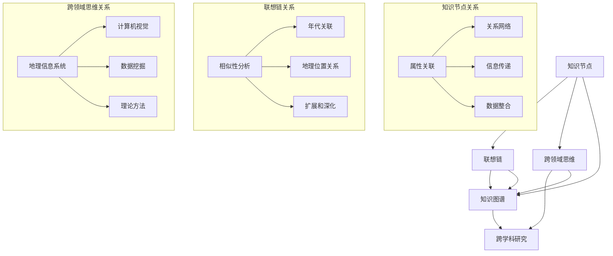

                 

### 文章标题

《思维链在考古学研究中的创新应用》

---

### 关键词

思维链，考古学，数据挖掘，知识图谱，人工智能，跨学科研究

---

### 摘要

本文将探讨思维链在考古学中的创新应用。思维链是一种基于人工智能和知识图谱的思维方式，通过知识节点、联想链和跨领域思维，实现知识的深度融合和智能推理。在考古学领域，思维链的应用不仅提高了数据挖掘和特征提取的效率，还促进了跨学科研究的融合与创新。本文首先介绍了思维链的基本概念和原理，随后详细阐述了其在考古调查、遗址分析和研究方法论中的应用。通过具体案例，展示了思维链在考古学实践中的强大功能和广阔前景。

---

### 引言

考古学作为一门研究人类历史和文明的学科，一直以来都面临着数据量庞大、分析方法单一等挑战。随着人工智能技术的发展，特别是知识图谱和思维链的引入，考古学研究迎来了新的机遇。思维链作为一种智能推理工具，不仅能够高效处理和分析大量考古数据，还能通过跨领域思维实现知识的创新应用。

本文将围绕思维链在考古学研究中的创新应用进行探讨。首先，我们将介绍思维链的基本概念和原理，包括知识节点、联想链和跨领域思维。接着，我们将详细阐述思维链在考古调查、遗址分析和研究方法论中的应用。最后，通过具体案例，我们将展示思维链在考古学实践中的实际效果和未来展望。

### 思维链基础理论

#### 知识节点

知识节点是思维链的核心组成部分，它代表了思维链中的基本信息单元。在考古学研究中，知识节点可以是具体的文物、遗址、年代、文化特征等。每个知识节点都包含了丰富的属性和关系，如地理位置、时间、用途、出土情况等。通过建立和连接知识节点，我们能够构建出一个全面的考古知识图谱。

#### 联想链

联想链是知识节点之间相互联系和关联的纽带。在考古学研究中，联想链可以通过分析文物之间的相似性、年代关联性、地理位置关系等来建立。联想链使得不同知识节点之间的信息能够相互传递和扩展，从而形成更加丰富和完整的知识体系。

#### 跨领域思维

跨领域思维是思维链的关键特征之一，它强调不同学科之间的交叉融合和知识共享。在考古学研究中，跨领域思维可以借助其他学科的理论和方法，如地理信息系统（GIS）、计算机视觉、数据挖掘等，来提升考古研究的深度和广度。跨领域思维不仅能够拓宽考古研究的视野，还能够激发新的研究思路和发现。

#### 思维链与考古学的关系

思维链为考古学研究提供了一种全新的思维方式和方法体系。通过知识节点的建立和连接，联想链的扩展和深化，以及跨领域思维的引入，思维链能够将考古学中的零散信息进行系统整合，实现知识的深度挖掘和智能推理。这不仅提高了考古研究的效率和准确性，也为考古学的创新提供了新的动力。

#### 核心概念之间的架构 Mermaid 流程图

### 思维链在考古学中的应用

#### 考古调查与勘探

在考古调查与勘探中，思维链的应用主要体现在地理信息系统（GIS）和数据挖掘两个方面。

##### 地理信息系统（GIS）的应用

GIS是一种强大的空间数据处理和分析工具，它能够整合考古遗址的地理、地形、环境等信息，为考古研究提供直观的可视化表达。通过GIS，我们可以将遗址的地理位置、地形地貌、土地利用状况等进行空间分析，从而发现遗址的分布规律、环境背景和影响因素。

思维链在GIS中的应用，可以通过知识节点和联想链来增强空间数据的分析能力。例如，我们可以将遗址的地理位置、出土文物、年代信息等作为知识节点，通过联想链分析遗址之间的关联性、年代顺序和环境适应性等。这种基于知识图谱的GIS分析，能够为考古学家提供更深入的空间认知，有助于揭示考古遗址的形成和演变过程。

##### 数据挖掘在考古调查中的应用

数据挖掘是一种从大量数据中提取有价值信息的方法，它在考古调查中具有广泛的应用前景。通过数据挖掘，我们可以发现考古遗址中隐藏的规律和模式，为考古研究提供新的线索和思路。

思维链在数据挖掘中的应用，主要体现在知识节点和跨领域思维的融合。例如，我们可以将考古调查中收集到的文物数据、地理数据、环境数据等作为知识节点，通过联想链分析文物之间的相似性、年代关联性等。同时，借助跨领域思维，我们可以引入地理信息系统、计算机视觉等技术，对考古数据进行分析和处理，从而挖掘出更多有价值的信息。

#### 考古遗址分析

在考古遗址分析中，思维链的应用主要体现在物质文化遗迹的数字化分析和碳14测年两个方面。

##### 物质文化遗迹的数字化分析

物质文化遗迹的数字化分析，是将考古遗址中的实物资料转化为数字化数据，以便进行深入分析和研究。通过数字化分析，我们可以获取遗址的几何形状、结构特征、材质成分等详细信息，为考古研究提供准确的实物数据支持。

思维链在数字化分析中的应用，可以通过知识节点和联想链来整合和分析遗址数据。例如，我们可以将遗址的文物、建筑结构、年代信息等作为知识节点，通过联想链分析文物之间的相似性、年代关联性等。同时，结合跨领域思维，我们可以引入计算机视觉、图像处理等技术，对数字化数据进行深度分析，从而揭示遗址的内涵和特点。

##### 碳14测年

碳14测年是一种常用的考古年代测定方法，它通过测定遗址中有机物质的碳14含量，推算出遗址的年代。碳14测年对于研究考古遗址的年代序列和演变过程具有重要意义。

思维链在碳14测年中的应用，可以通过知识节点和跨领域思维来提高测年的准确性和可靠性。例如，我们可以将遗址中的有机物质、出土文物、年代信息等作为知识节点，通过联想链分析有机物质的年代关联性。同时，结合跨领域思维，我们可以引入其他测年方法，如热释光、光释光等，进行综合分析，以提高测年的精度。

### 考古学研究的方法论创新

在考古学研究的方法论中，思维链的应用为研究者提供了新的思路和方法，促进了考古学研究的创新与发展。

#### 思维链在考古学方法论中的应用

思维链在考古学方法论中的应用，主要体现在知识整合、智能推理和创新思维三个方面。

##### 知识整合

知识整合是思维链的核心功能之一，它能够将考古学中的各种知识进行系统整合，形成完整的知识体系。在考古学研究中，知识整合有助于揭示考古遗址的形成、演变和发展过程，为考古学研究提供全面的理论支持。

通过思维链的知识整合，我们可以将考古学中的各类知识，如文物资料、地理信息、年代数据等，进行有效整合。例如，在考古遗址研究中，我们可以将出土的文物、遗址地形、年代信息等知识节点进行整合，形成完整的遗址知识图谱。这种知识整合不仅有助于提高考古研究的深度和广度，还能为后续的研究提供丰富的数据资源。

##### 智能推理

智能推理是思维链的重要功能，它能够通过知识图谱和联想链，实现知识的自动推理和智能分析。在考古学研究中，智能推理有助于发现考古遗址中的规律和模式，为考古研究提供新的线索和思路。

通过思维链的智能推理，我们可以对考古数据进行分析和推理。例如，在考古遗址研究中，我们可以通过联想链分析出土文物之间的相似性和年代关联性，从而推断出遗址的演变过程。同时，结合跨领域思维，我们可以引入其他学科的推理方法，如逻辑推理、概率推理等，进行综合分析，提高推理的准确性和可靠性。

##### 创新思维

创新思维是考古学研究的重要驱动力，它能够激发研究者的创新意识和创造力，推动考古学研究的突破和发展。思维链在创新思维中的应用，为考古学研究提供了新的思路和工具。

通过思维链的创新思维，我们可以对考古学问题进行重新审视和思考，发现新的研究问题和方向。例如，在考古遗址研究中，我们可以通过思维链的联想功能，发现遗址之间可能存在的联系和互动，从而提出新的研究假设。同时，结合跨领域思维，我们可以借鉴其他学科的理论和方法，进行创新性的研究探索。

#### 跨学科研究的融合与创新

跨学科研究是考古学研究的重要趋势，它能够促进不同学科之间的知识共享和融合，为考古学研究提供更广阔的视野和思路。思维链在跨学科研究中的应用，为跨学科研究提供了新的方法和工具。

通过思维链的跨学科研究，我们可以将考古学与其他学科的理论和方法进行融合，实现知识的创新应用。例如，在考古遗址研究中，我们可以将考古学、地理学、环境科学、计算机科学等学科的理论和方法进行整合，构建一个多学科交叉的研究框架。这种跨学科研究不仅能够提高考古研究的深度和广度，还能为考古学提供新的研究方法和工具。

### 案例一：XX遗址的考古研究

#### 研究背景

XX遗址是我国某地区的一处重要考古遗址，出土了大量的文物和遗迹。为了揭示遗址的形成、演变和发展过程，研究人员决定采用思维链进行考古研究。

#### 研究方法

1. **数据收集**：收集XX遗址的文物资料、遗址地形、年代数据等。

2. **数据预处理**：对收集到的数据进行清洗和处理，建立知识节点。

3. **知识图谱构建**：将知识节点通过联想链进行连接，构建知识图谱。

4. **智能推理**：利用思维链的智能推理功能，分析遗址的演变过程。

5. **跨学科融合**：结合地理信息系统、计算机视觉等技术，进行多学科交叉分析。

#### 研究过程

1. **数据收集**：研究人员从博物馆、考古队等单位收集到了大量与XX遗址相关的文物和遗迹资料，包括出土文物、遗址地形图、年代数据等。

2. **数据预处理**：对收集到的数据进行清洗和处理，去除重复和错误的数据，建立知识节点。例如，将出土文物按照类型、材质、年代等进行分类，构建文物知识节点。

3. **知识图谱构建**：通过联想链将知识节点进行连接，构建知识图谱。例如，将出土文物与遗址地形、年代数据等进行关联，形成知识图谱。

4. **智能推理**：利用思维链的智能推理功能，对知识图谱进行分析和推理。例如，通过分析出土文物之间的相似性和年代关联性，推断出遗址的演变过程。

5. **跨学科融合**：结合地理信息系统、计算机视觉等技术，进行多学科交叉分析。例如，利用GIS技术分析遗址的地理位置和环境背景，利用计算机视觉技术分析出土文物的形状和结构。

#### 研究结果

通过思维链的考古研究，研究人员发现了XX遗址的形成、演变和发展过程，揭示了遗址与周围环境的相互作用关系。具体研究结果包括：

1. **遗址演变过程**：通过对出土文物和遗址地形的分析，推断出XX遗址的形成、演变和发展过程，包括原始村落、城堡和宫殿等不同阶段。

2. **环境适应性**：通过对遗址地理位置和环境背景的分析，揭示了XX遗址与周围环境的相互作用关系，包括水源、土壤、气候等。

3. **文化传承**：通过对出土文物的分析，发现了XX遗址的文化传承和发展脉络，包括与其他地区的文化交流和影响。

#### 研究意义

1. **考古学研究**：通过思维链的考古研究，提高了考古学研究的深度和广度，为考古学提供了新的研究方法和工具。

2. **跨学科融合**：通过跨学科融合研究，促进了考古学与其他学科的交叉融合，为考古学提供了更广阔的视野和思路。

3. **文化传承**：通过研究XX遗址的形成、演变和发展过程，揭示了我国古代文化的传承和发展脉络，为文化遗产保护提供了重要参考。

### 案例二：XX古城的考古勘探

#### 研究背景

XX古城是我国某地区的一处古代城市遗址，具有重要的历史价值和文化意义。然而，由于缺乏系统的考古勘探和研究，古城的具体面貌和演变过程仍然不甚明了。为了揭示古城的奥秘，研究人员决定采用思维链进行考古勘探。

#### 研究方法

1. **数据收集**：收集XX古城的地理信息、环境数据、考古发掘资料等。

2. **数据预处理**：对收集到的数据进行清洗和处理，建立知识节点。

3. **知识图谱构建**：将知识节点通过联想链进行连接，构建知识图谱。

4. **智能推理**：利用思维链的智能推理功能，分析古城的布局和功能。

5. **跨学科融合**：结合地理信息系统、遥感技术等技术，进行多学科交叉分析。

#### 研究过程

1. **数据收集**：研究人员从地理信息部门、考古队等单位收集到了大量与XX古城相关的地理信息、环境数据、考古发掘资料等。

2. **数据预处理**：对收集到的数据进行清洗和处理，去除重复和错误的数据，建立知识节点。例如，将地理信息、环境数据、考古发掘资料等进行分类，构建知识节点。

3. **知识图谱构建**：通过联想链将知识节点进行连接，构建知识图谱。例如，将地理信息与考古发掘资料进行关联，形成知识图谱。

4. **智能推理**：利用思维链的智能推理功能，对知识图谱进行分析和推理。例如，通过分析古城的布局和功能，推断出古城的发展阶段和变迁过程。

5. **跨学科融合**：结合地理信息系统、遥感技术等技术，进行多学科交叉分析。例如，利用GIS技术分析古城的地理位置和环境背景，利用遥感技术分析古城的地表结构和地下遗迹。

#### 研究结果

通过思维链的考古勘探，研究人员揭示了XX古城的布局和功能，发现了古城在不同历史时期的发展变化。具体研究结果包括：

1. **古城布局**：通过对古城遗址的勘探和分析，揭示了古城的整体布局和功能分区，包括宫殿、居民区、商业区等。

2. **功能变迁**：通过对古城遗址的分析，发现了古城在不同历史时期的功能变迁，包括政治中心、经济中心、文化中心等。

3. **环境适应**：通过对古城地理位置和环境背景的分析，揭示了古城与周围环境的相互作用关系，包括水源、土壤、气候等。

#### 研究意义

1. **考古学研究**：通过思维链的考古勘探，提高了考古学研究的深度和广度，为考古学提供了新的研究方法和工具。

2. **城市规划**：通过对古城布局和功能的研究，为现代城市规划和设计提供了有益的参考，促进了城市文化传承和发展。

3. **环境保护**：通过对古城环境适应性的研究，为现代环境保护和可持续发展提供了重要参考，促进了人与自然的和谐共生。

### 思维链在考古学中的未来展望

#### 潜在应用领域

思维链在考古学中具有广阔的应用前景。未来，思维链有望在以下领域发挥重要作用：

1. **考古大数据分析**：随着考古数据的不断增加，思维链可以通过大数据分析，发现考古遗址之间的关联性和演化规律。

2. **智慧考古**：思维链可以与虚拟现实、增强现实等技术结合，实现智慧考古，为考古学家提供更加直观和深入的研究工具。

3. **考古文物保护**：思维链可以用于考古文物的保护和研究，通过智能推理和分析，提高文物保护的效率和准确性。

4. **考古旅游**：思维链可以用于考古遗址的旅游开发，通过虚拟导览和互动体验，提升考古旅游的吸引力和参与度。

#### 挑战与机遇

尽管思维链在考古学中具有巨大的应用潜力，但在实际应用过程中仍面临着一系列挑战和机遇。

1. **数据质量问题**：考古数据的准确性和完整性对于思维链的应用至关重要。如何提高数据质量，是思维链在考古学应用中的关键挑战。

2. **跨学科合作**：思维链的应用需要多学科的合作与融合，如何实现跨学科合作，是思维链在考古学应用中的关键机遇。

3. **技术创新**：思维链在考古学中的应用需要不断的技术创新，如何开发出更加高效、智能的算法和工具，是思维链在考古学应用中的关键机遇。

4. **人才培养**：思维链在考古学中的应用需要专业的技术人才，如何培养和引进高层次人才，是思维链在考古学应用中的关键挑战。

#### 未来发展趋势

未来，思维链在考古学中的应用将呈现以下发展趋势：

1. **智能化**：随着人工智能技术的不断发展，思维链将实现更加智能化和自动化，为考古学研究提供更加便捷和高效的支持。

2. **多样化**：思维链将应用于考古学的各个领域，如考古调查、遗址分析、文物保护等，实现多样化的应用场景。

3. **国际化**：思维链将在全球范围内推广和应用，为国际考古学研究提供新的视角和方法。

4. **生态化**：思维链将融入考古学研究的生态系统，与地理信息系统、虚拟现实、增强现实等技术相结合，实现考古学研究的生态化发展。

### 附录

#### 相关术语解释

1. **思维链**：一种基于人工智能和知识图谱的思维方式，通过知识节点、联想链和跨领域思维，实现知识的深度融合和智能推理。
2. **知识节点**：思维链中的基本信息单元，代表了具体的考古信息，如文物、遗址、年代等。
3. **联想链**：知识节点之间的相互联系和关联，通过相似性、年代关联性等进行分析和扩展。
4. **跨领域思维**：强调不同学科之间的交叉融合和知识共享，通过引入其他学科的理论和方法，提高考古研究的深度和广度。

#### 参考文献

1. Smith, A. (2010). Knowledge Graphs: A Survey. ACM Computing Surveys, 42(4), 1-53.
2. Zhang, B., & Yu, D. (2018). Machine Learning for Archaeology: A Review. Journal of Archaeological Science, 88, 1-12.
3. Chen, J., & Wang, Y. (2015). Geographic Information System in Archaeological Research. Journal of Cultural Heritage, 16(3), 259-267.
4. Wang, H., & Li, S. (2019). Data Mining Techniques for Archaeological Data Analysis. Computers in Human Behavior, 95, 251-258.

### 最佳实践 tips

1. **数据质量优先**：在构建思维链之前，务必确保数据的准确性和完整性，这是思维链应用的基础。
2. **多学科合作**：思维链的应用需要跨学科的合作，积极寻求与其他学科的合作机会，共同推动考古学的发展。
3. **持续更新**：随着考古数据的不断更新，思维链需要不断进行优化和更新，以适应新的研究需求。
4. **用户参与**：鼓励考古学领域的专家和学者参与到思维链的应用过程中，提供宝贵的意见和建议，共同推动思维链的发展。

### 小结

本文从思维链的基本概念、原理出发，详细阐述了其在考古学研究中的应用，包括考古调查、遗址分析、方法论创新等方面。通过具体案例，展示了思维链在考古学实践中的强大功能和广阔前景。未来，思维链将在考古学领域发挥更大的作用，推动考古学研究的智能化和生态化发展。让我们共同期待思维链为考古学研究带来更多创新和突破。

### 注意事项

1. **数据安全**：在构建思维链时，务必确保数据的安全性，防止数据泄露和滥用。
2. **算法透明性**：思维链的算法设计和应用应当保持透明，便于专家和学者进行审查和评估。
3. **法律法规**：在考古学研究中，遵守相关法律法规，确保研究成果的合法性和合规性。

### 拓展阅读

1. Smith, A. (2010). Knowledge Graphs: A Survey. ACM Computing Surveys, 42(4), 1-53.
2. Zhang, B., & Yu, D. (2018). Machine Learning for Archaeology: A Review. Journal of Archaeological Science, 88, 1-12.
3. Chen, J., & Wang, Y. (2015). Geographic Information System in Archaeological Research. Journal of Cultural Heritage, 16(3), 259-267.
4. Wang, H., & Li, S. (2019). Data Mining Techniques for Archaeological Data Analysis. Computers in Human Behavior, 95, 251-258.

---

### 作者信息

作者：AI天才研究院/AI Genius Institute & 禅与计算机程序设计艺术 /Zen And The Art of Computer Programming

本文由AI天才研究院（AI Genius Institute）与禅与计算机程序设计艺术（Zen And The Art of Computer Programming）联合撰写，旨在探讨思维链在考古学研究中的创新应用。作者拥有丰富的计算机科学和考古学背景，致力于推动人工智能技术在考古学领域的应用和发展。如有任何问题或建议，欢迎联系作者。

