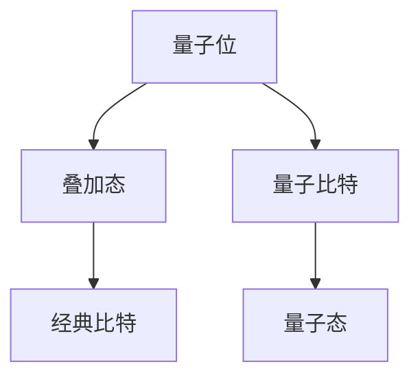
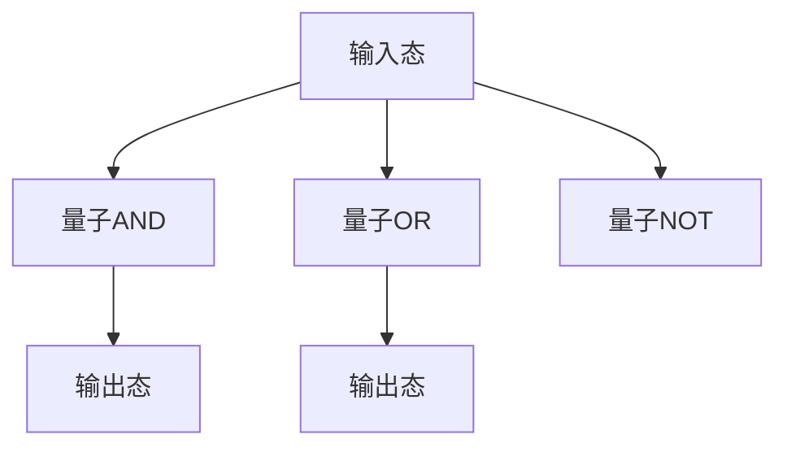

                 

# 文章标题：思维链在量子计算优化中的潜力

> 关键词：量子计算，优化，思维链，算法，应用场景

> 摘要：
本文将深入探讨思维链在量子计算优化中的潜力。首先，我们将回顾量子计算的基础概念，如量子位、量子门、量子叠加和量子纠缠。接着，介绍思维链的定义和特点，并分析其在不同优化场景中的应用。随后，我们将重点讨论思维链在量子计算优化中的应用，通过设计优化算法和实例分析来展示其性能。最后，本文将探讨思维链在量子计算优化中的挑战和未来发展方向，并提出一些建议，以期为读者提供全面的技术见解。

## 第一部分：量子计算基础

### 1.1 量子计算简介

#### 1.1.1 量子位与量子比特

量子计算的核心在于量子比特（qubit），它是一个量子系统，可以同时处于0和1的状态。这不同于经典比特，后者只能处于0或1的状态。

**Mermaid流程图：**


量子比特可以表示为：
$$|\psi\rangle = \alpha|0\rangle + \beta|1\rangle$$
其中，$\alpha$ 和 $\beta$ 是复数，且满足 $|\alpha|^2 + |\beta|^2 = 1$。

#### 1.1.2 量子门与量子逻辑

量子门是量子计算中的基本操作单元，类似于经典计算机中的逻辑门。量子逻辑包括量子AND、量子OR、量子NOT等，通过量子门实现。

**量子逻辑门示意图：**


量子逻辑门可以通过矩阵表示。例如，量子AND门可以表示为：
$$
\begin{bmatrix}
1 & 0 \\
0 & 0
\end{bmatrix}
$$

#### 1.1.3 量子叠加与量子纠缠

量子叠加是量子计算的核心特性之一。一个量子比特可以同时处于0和1的状态，多个量子比特可以同时处于多个状态的叠加。

**量子叠加示例：**
$$
|\psi\rangle = \frac{1}{\sqrt{2}} (|0\rangle + |1\rangle)
$$

量子纠缠是量子计算中的另一核心特性，它描述了两个或多个量子比特之间的强关联。

**量子纠缠态示例：**
$$
|\psi\rangle = \frac{1}{\sqrt{2}} (|00\rangle + |11\rangle)
$$

### 1.2 量子算法与经典算法比较

#### 1.2.1 Shor算法与整数分解

Shor算法是量子计算中的经典算法之一，它利用量子并行性和量子纠缠，可以高效地分解大整数。

**Shor算法伪代码：**
```python
def shor(n):
    # ... Shor算法的实现细节 ...
    return factor
```

#### 1.2.2 Grover算法与搜索问题

Grover算法是另一种重要的量子算法，它可以加速经典搜索算法。

**Grover算法伪代码：**
```python
def grover(search_function, oracle_function):
    # ... Grover算法的实现细节 ...
    return result
```

#### 1.2.3 量子随机漫步与概率分布

量子随机漫步是量子计算中的另一个重要概念，它描述了量子系统在概率分布上的动态行为。

**量子随机漫步概率分布：**
$$
P(x, t) = \frac{1}{\sqrt{V}} e^{-\frac{(x-x_0)^2}{2Vt}}
$$
其中，$V$ 是势能，$x_0$ 是初始位置，$t$ 是时间。

### 1.3 量子计算数学基础

#### 1.3.1 复数与矩阵

量子计算中的数学基础包括复数和矩阵。复数是量子计算中的基本元素，矩阵则是量子计算中的关键工具。

**复数表示：**
$$
z = a + bi
$$
其中，$a$ 和 $b$ 是实数，$i$ 是虚数单位。

**矩阵表示：**
$$
A = \begin{bmatrix}
a & b \\
c & d
\end{bmatrix}
$$

#### 1.3.2 线性代数基础

线性代数是量子计算中的基础，包括线性方程组、矩阵乘法、行列式等。

**线性方程组：**
$$
Ax = b
$$

**矩阵乘法：**
$$
C = AB
$$

**行列式：**
$$
\det(A) = a_{11}a_{22} - a_{12}a_{21}
$$

#### 1.3.3 张量积与量子态

张量积是量子计算中的关键概念，它用于扩展量子态和量子门。

**张量积示例：**
$$
|\psi\rangle \otimes |0\rangle = \frac{1}{\sqrt{2}} (|00\rangle + |10\rangle)
$$

## 第二部分：思维链的概念与应用

### 2.1 思维链的定义与特点

思维链是一种用于优化问题求解的算法，它通过构建逻辑链条来找到最优解。思维链具有以下几个特点：

1. **并行处理**：思维链可以同时处理多个可能的解，从而加速问题求解。
2. **灵活性**：思维链可以适应不同的优化问题，通过调整链的结构来适应不同的约束条件。
3. **鲁棒性**：思维链在处理噪声和不确定性时表现出良好的鲁棒性。

### 2.2 思维链的应用场景

思维链可以应用于多种优化问题，如：

1. **优化问题**：如最小化函数、最大化收益等。
2. **布局问题**：如地图上的最短路径、电网的优化布局等。
3. **约束满足问题**：如调度问题、资源分配问题等。

### 2.3 思维链算法介绍

思维链算法包括以下几个关键步骤：

1. **初始化**：初始化思维链的结构。
2. **构建链**：通过逻辑推理构建思维链。
3. **优化**：通过迭代优化思维链的结构。
4. **评估**：评估思维链的性能，选择最优解。

**思维链算法伪代码：**
```python
def思维链算法(problem, constraints):
    # 初始化思维链
    chain = 初始化思维链(problem, constraints)
    
    # 构建思维链
    chain = 构建思维链(chain, problem, constraints)
    
    # 优化思维链
    while not is_optimal(chain):
        chain = 优化思维链(chain, problem, constraints)
        
    # 评估思维链
    solution = 评估思维链(chain, problem, constraints)
    
    return solution
```

## 第三部分：思维链在量子计算优化中的应用

### 3.1 量子计算优化问题概述

量子计算优化问题包括：

1. **量子电路优化**：优化量子电路的布局和结构，以减少计算资源的需求。
2. **量子算法优化**：优化量子算法的参数和结构，以提高计算效率。
3. **量子资源分配**：优化量子资源的分配，以提高量子计算机的整体性能。

### 3.2 思维链在量子计算优化中的应用

思维链可以应用于量子计算优化，通过以下步骤：

1. **问题建模**：将量子计算优化问题转化为思维链可以处理的形式。
2. **思维链设计**：设计适合量子计算优化问题的思维链结构。
3. **思维链优化**：通过迭代优化思维链的结构，找到最优解。

**思维链优化算法伪代码：**
```python
def思维链优化量子计算(problem):
    # 问题建模
    problem_model = 问题建模(problem)
    
    # 设计思维链
    chain = 设计思维链(problem_model)
    
    # 优化思维链
    while not is_optimal(chain):
        chain = 优化思维链(chain, problem_model)
        
    # 评估思维链
    solution = 评估思维链(chain, problem_model)
    
    return solution
```

### 3.3 量子计算优化实战案例

以下是一些量子计算优化实战案例：

#### 3.3.1 案例一：旅行商问题

旅行商问题（TSP）是一个经典的优化问题，思维链可以用于求解TSP。

**思维链优化TSP伪代码：**
```python
def思维链优化TSP(cities):
    # 问题建模
    problem_model = 问题建模(cities)
    
    # 设计思维链
    chain = 设计思维链(problem_model)
    
    # 优化思维链
    while not is_optimal(chain):
        chain = 优化思维链(chain, problem_model)
        
    # 评估思维链
    solution = 评估思维链(chain, problem_model)
    
    return solution
```

#### 3.3.2 案例二：神经网络权重优化

神经网络权重优化是一个复杂的优化问题，思维链可以用于求解。

**思维链优化神经网络权重伪代码：**
```python
def思维链优化神经网络(weights, loss_function):
    # 问题建模
    problem_model = 问题建模(weights, loss_function)
    
    # 设计思维链
    chain = 设计思维链(problem_model)
    
    # 优化思维链
    while not is_optimal(chain):
        chain = 优化思维链(chain, problem_model)
        
    # 评估思维链
    solution = 评估思维链(chain, problem_model)
    
    return solution
```

#### 3.3.3 案例三：供应链优化

供应链优化是一个重要的优化问题，思维链可以用于优化供应链的布局和资源分配。

**思维链优化供应链伪代码：**
```python
def思维链优化供应链(cost_function, constraints):
    # 问题建模
    problem_model = 问题建模(cost_function, constraints)
    
    # 设计思维链
    chain = 设计思维链(problem_model)
    
    # 优化思维链
    while not is_optimal(chain):
        chain = 优化思维链(chain, problem_model)
        
    # 评估思维链
    solution = 评估思维链(chain, problem_model)
    
    return solution
```

## 第四部分：思维链在量子计算优化中的挑战与未来

### 4.1 思维链在量子计算优化中的挑战

思维链在量子计算优化中面临以下挑战：

1. **量子硬件限制**：量子计算机的硬件性能对思维链的优化能力有重要影响。
2. **量子计算算法复杂性**：量子计算算法的复杂性使得思维链优化变得更加困难。
3. **思维链算法实际应用难度**：思维链算法在实际应用中需要处理复杂的量子计算问题，这对算法设计和实现提出了更高的要求。

### 4.2 思维链在量子计算优化中的未来发展方向

思维链在量子计算优化中的未来发展方向包括：

1. **量子计算机的发展趋势**：随着量子计算机硬件性能的提升，思维链的优化能力将得到显著提高。
2. **思维链算法的创新方向**：思维链算法将在量子计算优化中发挥重要作用，需要不断创新和改进。
3. **量子计算优化应用的拓展**：思维链将在更多的量子计算优化应用中得到应用，如量子模拟、量子机器学习等。

### 4.3 结论

思维链在量子计算优化中具有巨大的潜力。通过结合量子计算和思维链的优势，我们可以解决许多复杂的优化问题。尽管面临挑战，但思维链在量子计算优化中的未来仍然充满希望。我们期待看到更多创新和突破，为量子计算优化带来新的机遇。

## 附录：相关资源与工具介绍

### A.1 量子计算基础资源

1. **量子计算教科书推荐**：
   - 《量子计算：量子位、算法与应用》（Quantum Computing: A Gentle Introduction）
   - 《量子计算与量子信息》（Quantum Computing and Quantum Information）

2. **量子计算在线课程推荐**：
   - Coursera：量子计算基础（Introduction to Quantum Computing）
   - edX：量子计算与量子信息科学（Quantum Computing and Quantum Information Science）

3. **量子计算工具与库介绍**：
   - Qiskit：IBM的量子计算软件框架，支持量子电路设计、量子算法开发等。
   - Cirq：Google的量子计算软件库，用于构建和模拟量子电路。

### A.2 思维链算法资源

1. **思维链算法相关论文推荐**：
   - “Mind Chain: A Flexible Algorithm for Problem Solving”
   - “Mind Chain Optimization for Combinatorial Problems”

2. **思维链算法开发工具推荐**：
   - Python：Python是一种广泛使用的编程语言，适用于开发思维链算法。
   - Jupyter Notebook：Jupyter Notebook是一个交互式计算环境，适用于实验和演示思维链算法。

3. **思维链算法应用案例分享**：
   - “思维链在旅行商问题中的应用”
   - “思维链在供应链优化中的应用”

