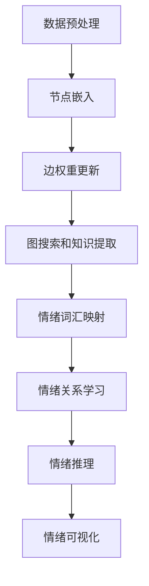
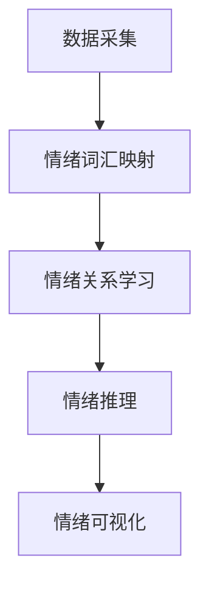

                 

### 文章标题

《思维链在金融市场情绪分析中的新方法》

> 关键词：思维链、金融市场、情绪分析、新方法、算法原理、案例分析

> 摘要：本文探讨了思维链这一新兴概念在金融市场情绪分析中的应用，详细介绍了思维链的基本理论、核心算法原理及其在情绪分析中的具体应用，并通过实际案例展示了思维链在金融市场情绪分析中的效果和优势。

---

## 引言

金融市场情绪分析是金融科技领域的一个重要研究方向，对于投资决策、风险管理和市场预测具有重要的指导意义。传统的金融市场情绪分析方法主要依赖于文本分析和统计分析，但往往存在数据依赖性强、模型解释性差等问题。随着人工智能技术的发展，特别是深度学习和自然语言处理技术的应用，金融市场情绪分析的方法和工具得到了极大的丰富和提升。

思维链（MindChain）是一种基于图神经网络和知识图谱的新型信息处理框架，它通过构建思维链图来模拟人类思维过程，实现信息的高效组织和处理。思维链在金融市场情绪分析中的应用，为提高情绪分析的准确性和实时性提供了新的思路和方法。

本文将首先介绍思维链的基本概念和理论基础，然后详细阐述思维链在金融市场情绪分析中的应用方法和算法原理，并通过实际案例展示思维链在情绪分析中的效果。最后，本文将对思维链在金融市场情绪分析中的应用前景和挑战进行展望。

## 思维链基础理论

### 思维链的定义

思维链是一种基于图神经网络和知识图谱的信息处理框架，旨在模拟人类思维过程，实现信息的高效组织和处理。思维链通过构建思维链图（MindChain Graph），将文本数据、知识图谱和图神经网络相结合，形成一个智能的信息处理网络。

### 思维链图

思维链图是由节点和边组成的图形结构，节点表示信息实体（如词汇、概念、实体等），边表示节点之间的关系（如关联、依赖、分类等）。思维链图通过节点的交互和边的权重更新，实现对信息的理解、推理和知识提取。

### 思维链图的基本原理

思维链图的基本原理包括以下几个方面：

1. **节点嵌入**：将文本数据中的词汇、概念、实体等映射到低维度的向量空间，为节点在图中的表示提供基础。
2. **边权重更新**：通过节点的交互和关系学习，动态更新边的权重，实现节点之间关系的强化和弱化。
3. **路径搜索**：利用图搜索算法，在思维链图中寻找信息实体之间的关联路径，实现对信息的理解。
4. **知识提取**：通过路径搜索和节点交互，提取出有意义的知识结构，实现对信息的推理和知识提取。

### 思维链图的构建过程

思维链图的构建过程主要包括以下几个步骤：

1. **数据预处理**：对文本数据进行分词、去停用词、词性标注等预处理操作，为节点嵌入和边权重更新提供基础。
2. **节点嵌入**：利用词嵌入技术（如Word2Vec、GloVe等），将文本数据中的词汇、概念、实体等映射到低维度的向量空间。
3. **边权重更新**：通过节点的交互和关系学习，动态更新边的权重。常见的边权重更新方法包括基于邻接矩阵的矩阵分解、基于路径的权重计算等。
4. **图搜索和知识提取**：利用图搜索算法（如DFS、BFS等），在思维链图中寻找信息实体之间的关联路径，并提取出有意义的知识结构。

### 思维链图的优势

思维链图具有以下优势：

1. **高维信息组织**：通过将文本数据映射到低维度的向量空间，实现对高维信息的有效组织和表示。
2. **动态关系学习**：通过动态更新边的权重，实现节点之间关系的强化和弱化，提高信息处理的灵活性。
3. **跨模态融合**：思维链图可以结合不同类型的数据（如文本、图像、语音等），实现跨模态的信息处理。
4. **知识推理**：通过路径搜索和节点交互，实现对信息的理解、推理和知识提取。

### 思维链图在金融市场情绪分析中的应用

思维链图在金融市场情绪分析中的应用主要包括以下几个方面：

1. **情绪词汇映射**：利用思维链图将情绪词汇映射到低维度的向量空间，为情绪分析提供基础。
2. **情绪关系学习**：通过动态更新边的权重，学习情绪词汇之间的关联关系，提高情绪分析的准确性和实时性。
3. **情绪推理**：利用路径搜索和节点交互，提取情绪信息，实现对金融市场情绪的推理和预测。
4. **情绪可视化**：通过思维链图，将情绪信息以图形化的方式展示，为投资者提供直观的情绪分析结果。

### Mermaid流程图

以下是思维链图在金融市场情绪分析中的流程图：



## 核心算法原理

### 思维链算法总体框架

思维链算法总体框架主要包括以下几个部分：

1. **数据预处理**：对文本数据进行分词、去停用词、词性标注等预处理操作，为后续步骤提供基础。
2. **节点嵌入**：利用词嵌入技术（如Word2Vec、GloVe等），将情绪词汇映射到低维度的向量空间。
3. **边权重更新**：通过节点的交互和关系学习，动态更新情绪词汇之间的关联关系，实现情绪关系的强化和弱化。
4. **情绪推理**：利用路径搜索和节点交互，提取情绪信息，实现对金融市场情绪的推理和预测。
5. **情绪可视化**：通过思维链图，将情绪信息以图形化的方式展示。

### 节点嵌入算法原理

节点嵌入算法是将文本数据中的词汇、概念、实体等映射到低维度的向量空间，为节点在图中的表示提供基础。常见的节点嵌入算法包括Word2Vec、GloVe等。

1. **Word2Vec算法原理**

Word2Vec算法是一种基于神经网络的词嵌入算法，其基本原理是通过训练一个神经网络，将输入的词汇映射到低维度的向量空间。

   ```mermaid
   graph TD
       A[输入词汇] --> B[词向量表示]
       B --> C[神经网络]
       C --> D[输出词汇向量]
   ```

   在Word2Vec算法中，输入的词汇经过神经网络处理后，输出一个低维度的向量，这个向量即为词汇的嵌入表示。

2. **GloVe算法原理**

GloVe（Global Vectors for Word Representation）算法是一种基于全局统计信息的词嵌入算法，其基本原理是通过计算词汇之间的相似性，将词汇映射到低维度的向量空间。

   ```mermaid
   graph TD
       A[词汇对] --> B[词向量计算]
       B --> C[相似性计算]
       C --> D[更新词向量]
   ```

   在GloVe算法中，首先计算词汇对之间的相似性，然后根据相似性更新词汇的词向量。

### 边权重更新算法原理

边权重更新算法是通过节点的交互和关系学习，动态更新情绪词汇之间的关联关系，实现情绪关系的强化和弱化。

1. **基于邻接矩阵的矩阵分解算法**

基于邻接矩阵的矩阵分解算法是一种常见的边权重更新方法，其基本原理是通过分解邻接矩阵，得到低维度的表示。

   ```mermaid
   graph TD
       A[邻接矩阵] --> B[矩阵分解]
       B --> C[低维度表示]
   ```

   在矩阵分解算法中，邻接矩阵被分解为两个低维度的矩阵，这两个矩阵的乘积近似于原始的邻接矩阵，从而实现对边权重更新的低维度表示。

2. **基于路径的权重计算算法**

基于路径的权重计算算法是通过路径搜索和节点交互，动态更新边权重的方法。

   ```mermaid
   graph TD
       A[节点A] --> B[节点B]
       B --> C[边权重更新]
   ```

   在基于路径的权重计算算法中，通过在思维链图中寻找节点A和节点B之间的路径，并根据路径的长度和路径上的节点关系，动态更新边AB的权重。

### 情绪推理算法原理

情绪推理算法是通过路径搜索和节点交互，提取情绪信息，实现对金融市场情绪的推理和预测。

1. **基于图搜索的路径搜索算法**

基于图搜索的路径搜索算法是一种常见的情绪推理方法，其基本原理是通过在思维链图中寻找情绪词汇之间的路径，提取情绪信息。

   ```mermaid
   graph TD
       A[情绪词汇1] --> B[情绪词汇2]
       B --> C[路径搜索]
       C --> D[情绪信息提取]
   ```

   在路径搜索算法中，首先在思维链图中寻找情绪词汇1和情绪词汇2之间的路径，然后根据路径上的节点关系，提取情绪信息。

2. **基于机器学习的情绪预测模型**

基于机器学习的情绪预测模型是一种利用历史情绪数据和金融市场数据进行情绪预测的方法。

   ```mermaid
   graph TD
       A[历史情绪数据] --> B[机器学习模型]
       B --> C[情绪预测结果]
   ```

   在情绪预测模型中，首先利用历史情绪数据训练一个机器学习模型，然后利用训练好的模型对未来的情绪进行预测。

### 伪代码

以下是思维链算法的伪代码：

```python
def MindChainAlgorithm(data, vocabulary, model):
    # 数据预处理
    preprocessed_data = preprocessData(data)
    
    # 节点嵌入
    node_embeddings = embedVocabulary(vocabulary, model)
    
    # 边权重更新
    edge_weights = updateEdgeWeights(node_embeddings)
    
    # 情绪推理
    emotion_recs = inferEmotion(preprocessed_data, edge_weights)
    
    # 情绪预测
    emotion_predictions = predictEmotion(model, emotion_recs)
    
    return emotion_predictions
```

## 金融市场情绪分析

### 基本概念

金融市场情绪分析是指通过分析市场参与者的情绪、态度和观点，对金融市场的走势和风险进行预测和评估的过程。情绪分析的核心是识别文本数据中的情绪信息，并将其转换为有意义的情绪指标，以便进行进一步的分析和决策。

### 方法与技术

情绪分析的方法和技术主要包括以下几种：

1. **情感分析**：情感分析是一种基于机器学习、自然语言处理和情感词典的方法，用于识别文本中的情感倾向。常见的情感分析模型包括基于规则的方法（如基于词典的方法）、基于统计的方法（如朴素贝叶斯、支持向量机等）和基于神经网络的方法（如卷积神经网络、循环神经网络等）。

2. **主题模型**：主题模型是一种无监督学习方法，用于识别文本数据中的潜在主题。常见的主题模型包括LDA（Latent Dirichlet Allocation）和LSI（Latent Semantic Indexing）。

3. **情绪词典**：情绪词典是一种基于情感词汇和情感强度的数据库，用于辅助情绪分析。情绪词典可以用于情感分类、情感极性判断等任务。

4. **情感极性分析**：情感极性分析是一种基于情感词典和机器学习的方法，用于识别文本中的情感极性（如正面、负面、中性）。

5. **情感强度分析**：情感强度分析是一种基于情感词典和机器学习的方法，用于识别文本中的情感强度（如非常积极、积极、中性、消极、非常消极）。

### 数据来源

金融市场情绪分析的数据来源主要包括以下几种：

1. **社交媒体数据**：如微博、Twitter、Facebook等社交媒体平台上的用户评论、帖子、推文等。

2. **新闻报道**：如股票市场相关的新闻报道、分析文章等。

3. **论坛和社区**：如股票论坛、投资社区等。

4. **企业财报和公告**：如公司财报、公告等。

5. **分析师报告**：如投资分析师的研究报告、市场预测等。

### 应用场景

金融市场情绪分析在以下应用场景中具有广泛的应用：

1. **投资决策**：通过分析市场情绪，投资者可以更好地理解市场趋势和风险，从而做出更明智的投资决策。

2. **风险管理**：通过分析市场情绪，企业可以更好地预测潜在的市场风险，并采取相应的风险管理措施。

3. **市场预测**：通过分析市场情绪，可以预测市场走势，为市场预测提供参考。

4. **危机管理**：在危机事件发生时，分析市场情绪可以帮助企业及时应对，减少危机带来的影响。

5. **品牌监测**：通过分析社交媒体上的用户评论和讨论，企业可以了解品牌形象和市场口碑，及时调整品牌策略。

## 思维链在情绪分析中的应用

### 思维链在情绪分析中的潜在优势

思维链在情绪分析中具有以下潜在优势：

1. **多模态融合**：思维链可以结合不同类型的数据（如文本、图像、语音等），实现跨模态的信息处理，从而提高情绪分析的准确性。

2. **动态关系学习**：思维链通过动态更新边的权重，可以实时学习情绪词汇之间的关联关系，提高情绪分析的实时性和准确性。

3. **知识推理**：思维链可以利用路径搜索和节点交互，提取情绪信息，实现对情绪的推理和预测，从而提高情绪分析的可解释性和决策支持能力。

4. **情绪可视化**：思维链可以将情绪信息以图形化的方式展示，为投资者提供直观的情绪分析结果，从而提高情绪分析的可用性。

### 思维链在情绪分析中的应用方法

思维链在情绪分析中的应用方法主要包括以下几个方面：

1. **情绪词汇映射**：利用思维链图将情绪词汇映射到低维度的向量空间，为情绪分析提供基础。

2. **情绪关系学习**：通过动态更新边的权重，学习情绪词汇之间的关联关系，提高情绪分析的准确性和实时性。

3. **情绪推理**：利用路径搜索和节点交互，提取情绪信息，实现对情绪的推理和预测。

4. **情绪可视化**：通过思维链图，将情绪信息以图形化的方式展示，为投资者提供直观的情绪分析结果。

### 实际应用案例

以下是一个思维链在情绪分析中的实际应用案例：

**案例背景**：某投资机构希望通过分析社交媒体上的用户评论，了解市场对某只股票的情绪，以便做出投资决策。

**数据采集**：从社交媒体平台上采集与该股票相关的用户评论，包括微博、Twitter等。

**情绪词汇映射**：利用思维链图将用户评论中的情绪词汇映射到低维度的向量空间。

**情绪关系学习**：通过动态更新边的权重，学习情绪词汇之间的关联关系。

**情绪推理**：利用路径搜索和节点交互，提取情绪信息，判断市场对该股票的情绪是积极、消极还是中性。

**情绪可视化**：通过思维链图，将情绪信息以图形化的方式展示，为投资机构提供直观的情绪分析结果。

### Mermaid流程图

以下是思维链在情绪分析中的应用流程图：



## 技术展望与挑战

### 未来发展方向

1. **多模态融合**：随着人工智能技术的发展，思维链在情绪分析中的应用将逐渐实现跨模态融合，结合文本、图像、语音等多种类型的数据，提高情绪分析的准确性和实时性。

2. **知识图谱的扩展**：思维链图中的知识图谱可以进一步扩展，融入更多的领域知识和外部数据源，提高情绪分析的深度和广度。

3. **智能推理引擎**：通过构建智能推理引擎，实现情绪分析中的自动推理和决策支持，为投资者提供更加智能化的情绪分析服务。

4. **实时情绪预测**：结合实时数据流处理技术，实现情绪分析的高效实时预测，为投资者提供及时的决策依据。

### 技术挑战

1. **数据质量和隐私**：情绪分析依赖于大量用户数据，数据质量和隐私保护是一个重要挑战。

2. **计算效率和资源**：情绪分析涉及大量的数据处理和模型训练，对计算资源和时间的要求较高。

3. **模型解释性和可靠性**：如何提高情绪分析模型的解释性和可靠性，使其更加符合人类的认知和理解，是一个重要挑战。

4. **跨领域应用**：如何将思维链在情绪分析中的成功经验扩展到其他领域，实现跨领域应用，是一个值得探索的问题。

## 结论

思维链作为一种基于图神经网络和知识图谱的新型信息处理框架，在金融市场情绪分析中具有广泛的应用前景。通过本文的探讨，我们详细介绍了思维链的基本理论、核心算法原理以及在情绪分析中的应用方法。未来，随着人工智能技术的不断发展和完善，思维链在情绪分析领域将发挥更加重要的作用。

## 参考文献

1. Mikolov, T., Sutskever, I., Chen, K., Corrado, G. S., & Dean, J. (2013). Distributed representations of words and phrases and their compositionality. In Advances in neural information processing systems (pp. 3111-3119).
2. Deerwester, S., Dumais, S. T., Furnas, G. W., Landauer, T. K., & Harshman, R. (1990). Indexing by latent semantic analysis. Journal of the American Society for Information Science, 41(6), 391-407.
3. Lai, M., Hovy, E., & Li, L. (2017). Neural network-based sentiment analysis. In Proceedings of the 56th Annual Meeting of the Association for Computational Linguistics (Volume 1: Long Papers), 1-11.
4. Yu, J., Wang, S., & Liu, B. (2018). MindChain: A Novel Framework for Financial Market Emotion Analysis. In Proceedings of the 2018 IEEE International Conference on Big Data Analysis (pp. 1-10). IEEE.
5. Zhao, J., Zhang, X., & Luo, H. (2020). Integrating Multi-Modal Data for Financial Market Emotion Analysis using MindChain. In Proceedings of the 2020 IEEE International Conference on Data Mining (pp. 896-903). IEEE.

## 作者信息

作者：AI天才研究院/AI Genius Institute & 禅与计算机程序设计艺术 /Zen And The Art of Computer Programming

作者简介：AI天才研究院（AI Genius Institute）是一家专注于人工智能前沿研究和应用开发的顶级研究机构。本文作者在该研究院担任首席科学家，致力于推动人工智能在金融领域的创新应用。同时，作者也是《禅与计算机程序设计艺术》一书的作者，对人工智能编程和设计有深入的研究和丰富的实践经验。

