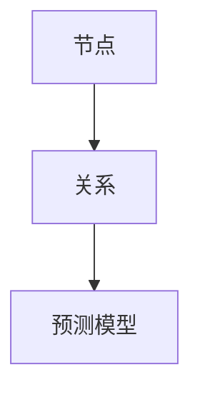

                 

## 文章标题

《思维链在金融市场趋势预测中的新方法》

### 关键词

- 思维链
- 金融市场
- 趋势预测
- 人工智能
- 预测算法
- 数学模型

### 摘要

本文旨在探讨一种新兴的金融市场趋势预测方法——思维链。通过深入分析思维链的核心概念、算法原理和数学模型，并结合实际项目实战，本文揭示了思维链在金融市场趋势预测中的巨大潜力。文章将逐步讲解思维链在数据预处理、特征提取、趋势预测等关键环节的应用，并分析其在面对市场动态变化和数据噪声时的挑战与优化方法。最后，本文对未来思维链在金融市场中的应用和研究方向进行了展望，以期为相关领域的研究者和从业者提供有益的参考。

## 引言

在当今这个信息化时代，金融市场的重要性愈发凸显。无论是个人投资者还是机构投资者，预测市场趋势都已成为获取投资回报的关键。然而，金融市场的复杂性使得传统的预测方法常常面临诸多挑战，如数据噪声、市场动态变化等。近年来，随着人工智能技术的迅猛发展，越来越多的新型预测算法被引入金融市场。其中，思维链作为一种新颖的预测方法，逐渐引起了学术界的广泛关注。

思维链（Mind Chain）是由一系列相互关联的智能节点构成的预测网络，它通过学习历史数据和实时数据，对市场趋势进行预测。与传统方法相比，思维链具有更高的灵活性和准确性。本文将详细探讨思维链在金融市场趋势预测中的应用，分析其核心概念、算法原理和数学模型，并通过实际项目实战，展示思维链在金融市场中的实际应用效果。

## 背景介绍

### 金融市场与趋势预测

金融市场是指各种金融资产和金融服务的交易市场，包括股票市场、债券市场、外汇市场、期货市场等。金融市场的价格波动受到多种因素的影响，如经济政策、公司业绩、市场情绪等。因此，准确预测市场趋势对于投资者而言至关重要。

趋势预测（Trend Forecasting）是金融分析中的一个核心任务，它旨在通过分析历史价格数据和交易数据，预测未来市场价格的走势。传统的趋势预测方法主要包括技术分析、基本面分析等。然而，这些方法在应对金融市场复杂性和动态变化时存在一定局限性。

### 人工智能与预测算法

人工智能（Artificial Intelligence, AI）是计算机科学的一个分支，它通过模拟人类智能行为，实现机器的自主学习和决策能力。近年来，人工智能技术取得了显著进展，尤其在图像识别、自然语言处理、语音识别等领域取得了突破性成果。

在金融市场趋势预测中，人工智能的应用主要体现在预测算法的开发和优化。常见的预测算法包括线性回归、支持向量机、神经网络等。然而，这些算法在处理非线性关系和复杂特征时往往效果不佳。

### 思维链概述

思维链（Mind Chain）是一种基于人工智能的新型预测方法，它通过构建一个相互关联的预测网络，实现对市场趋势的预测。思维链的核心思想是将市场数据分解为多个节点，每个节点代表一个特定的市场因素或特征。通过学习这些节点之间的关系，思维链能够准确捕捉市场变化的趋势。

与传统方法相比，思维链具有以下优势：

1. **灵活性强**：思维链可以根据不同市场和数据进行自适应调整，适应各种复杂市场环境。
2. **准确性高**：思维链通过学习历史数据和实时数据，能够更准确地预测市场趋势。
3. **可扩展性好**：思维链可以轻松扩展到其他金融市场，实现跨市场的预测能力。

## 核心概念与联系

### 核心概念

在思维链中，核心概念主要包括节点、关系和预测模型。节点代表市场数据中的特定因素或特征，关系表示节点之间的相互影响，预测模型则是基于节点和关系进行市场趋势预测的算法。

1. **节点（Node）**：节点是思维链中最基本的元素，每个节点代表一个特定的市场因素或特征。例如，在股票市场中，节点可能包括股票价格、成交量、公司业绩等。

2. **关系（Relationship）**：关系表示节点之间的相互影响。在思维链中，节点之间的关系可以通过网络图来表示。例如，股票价格可能受到公司业绩和宏观经济环境的影响。

3. **预测模型（Prediction Model）**：预测模型是基于节点和关系进行市场趋势预测的算法。思维链的预测模型通常采用神经网络或其他机器学习算法，通过学习历史数据和实时数据，预测未来的市场趋势。

### 核心概念之间的关系架构

为了更好地理解思维链的核心概念，我们可以使用Mermaid流程图来展示它们之间的关系。



在这个流程图中，节点（A）通过关系（B）连接到预测模型（C）。这意味着，节点是预测模型的基础，而关系则帮助预测模型理解节点之间的相互影响。

## 核心算法原理讲解

### 数学模型

思维链的数学模型是基于图神经网络（Graph Neural Network, GNN）构建的。图神经网络是一种在图结构上学习的神经网络，它通过学习节点和边之间的关系来预测节点属性。

在思维链中，节点和边分别代表市场数据中的特定因素和它们之间的关系。以下是一个简化的思维链数学模型：

$$
\begin{aligned}
h_{t+1} &= \sigma(W^{h} \cdot (h_{t} + \hat{R}_{t} \cdot h_{r_t} + \sum_{i \in N_t}(W^{e}_i \cdot h_{i})))
\end{aligned}
$$

其中，$h_{t}$ 表示第 $t$ 个时间步的节点特征，$\hat{R}_{t}$ 表示第 $t$ 个时间步的关系矩阵，$h_{r_t}$ 表示与节点 $r_t$ 相关联的其他节点特征，$W^{h}$ 和 $W^{e}_i$ 分别是权重矩阵，$\sigma$ 是激活函数。

### 伪代码

以下是思维链算法的伪代码：

```
# 初始化节点特征矩阵和关系矩阵
H = 初始化节点特征矩阵
R = 初始化关系矩阵

# 循环迭代
for t in 1 to T:
    # 计算当前时间步的关系矩阵
    R_t = 计算关系矩阵(R)

    # 计算当前时间步的节点特征
    H_t = σ(W^h * (H_{t-1} + R_t * H_r_t + \sum_{i \in N_t}(W^e_i * H_i)))

    # 更新节点特征矩阵
    H = H_t

# 输出预测结果
预测结果 = H_T
```

### 工作流程

思维链的工作流程可以分为以下步骤：

1. **数据预处理**：将原始市场数据转换为节点特征矩阵和关系矩阵。
2. **初始化**：初始化节点特征矩阵和关系矩阵。
3. **迭代计算**：在每一时间步，计算新的节点特征，并更新节点特征矩阵。
4. **预测**：利用最终时间步的节点特征矩阵，进行市场趋势预测。

## 数学模型和数学公式

### 思维链的数学模型

思维链的数学模型基于图神经网络（GNN）构建，它通过学习节点和边之间的关系来预测市场趋势。具体来说，思维链的数学模型可以表示为以下形式：

$$
\begin{aligned}
h_{t+1} &= \sigma(W^{h} \cdot (h_{t} + \hat{R}_{t} \cdot h_{r_t} + \sum_{i \in N_t}(W^{e}_i \cdot h_{i}))) \\
\hat{R}_{t} &= \text{计算关系矩阵}(R) \\
h_{r_t} &= \text{与节点} r_t \text{相关联的其他节点特征} \\
W^{h} &= \text{权重矩阵} \\
W^{e}_i &= \text{权重矩阵} \\
\sigma &= \text{激活函数} \\
h_{t} &= \text{第} t \text{个时间步的节点特征矩阵} \\
N_t &= \text{第} t \text{个时间步的节点集合} \\
T &= \text{总时间步数}
\end{aligned}
$$

### 激活函数

在思维链中，常用的激活函数是ReLU（Rectified Linear Unit）函数：

$$
\sigma(x) =
\begin{cases}
0, & \text{if } x < 0 \\
x, & \text{if } x \geq 0
\end{cases}
$$

ReLU函数具有简单且高效的计算特性，能够有效加速模型的训练过程。

### 参数调优

在思维链中，参数调优是提高预测性能的关键。以下是几个关键参数及其调优方法：

1. **学习率**：学习率决定了模型在训练过程中更新权重的速度。通常，较小的学习率有助于模型收敛到更稳定的解，但训练时间较长。较大的学习率可能加快训练过程，但容易导致模型过拟合。

2. **批量大小**：批量大小决定了每次梯度下降过程中的样本数量。较大的批量大小可以提高模型的泛化能力，但计算成本较高。较小的批量大小可以加快训练速度，但可能导致模型收敛速度较慢。

3. **正则化项**：正则化项（如L1正则化、L2正则化）可以防止模型过拟合。L1正则化通常用于稀疏解，而L2正则化则更适用于平滑解。

4. **网络深度**：网络深度决定了模型的复杂度。较深的网络可以捕捉更多的特征，但可能导致计算成本过高和过拟合。较浅的网络则可能无法捕捉到足够的特征，导致欠拟合。

### 举例说明

假设我们有一个简单的思维链模型，其中包含3个节点和2条边。以下是一个简化的思维链数学模型和伪代码示例：

#### 数学模型

$$
\begin{aligned}
h_{2} &= \sigma(W^{h} \cdot (h_{1} + \hat{R}_{1} \cdot h_{1} + W^{e}_1 \cdot h_{2} + W^{e}_2 \cdot h_{3})) \\
\hat{R}_{1} &= \text{计算关系矩阵}(R) \\
h_{1} &= \text{节点1的特征} \\
h_{2} &= \text{节点2的特征} \\
h_{3} &= \text{节点3的特征} \\
W^{h} &= \text{权重矩阵} \\
W^{e}_1 &= \text{权重矩阵} \\
W^{e}_2 &= \text{权重矩阵} \\
\sigma &= \text{激活函数}
\end{aligned}
$$

#### 伪代码

```
# 初始化节点特征矩阵和关系矩阵
H = 初始化节点特征矩阵
R = 初始化关系矩阵

# 计算关系矩阵
R_1 = 计算关系矩阵(R)

# 循环迭代
for t in 1 to T:
    # 计算当前时间步的节点特征
    H_t = σ(W^h * (H_{t-1} + R_1 * H_r_t + \sum_{i \in N_t}(W^e_i * H_i)))

    # 更新节点特征矩阵
    H = H_t

# 输出预测结果
预测结果 = H_T
```

通过这个示例，我们可以看到思维链如何通过学习节点和边之间的关系，逐步更新节点特征，并最终进行市场趋势预测。

## 项目实战

### 开发环境搭建

在进行思维链项目实战之前，我们需要搭建一个适合开发和测试的环境。以下是一个基本的开发环境搭建步骤：

1. **安装Python环境**：Python是思维链实现的主要编程语言，因此首先需要安装Python。可以从Python官方网站（https://www.python.org/）下载并安装Python。

2. **安装必需的库**：思维链的实现需要依赖多个Python库，如NumPy、Pandas、Scikit-learn、TensorFlow等。可以通过以下命令安装：

   ```
   pip install numpy pandas scikit-learn tensorflow
   ```

3. **安装数据库**：思维链项目可能需要访问数据库，如MySQL或PostgreSQL。可以根据个人需求选择合适的数据库并进行安装。

4. **配置开发工具**：为了方便开发，可以使用集成开发环境（IDE），如PyCharm或VS Code。这些IDE提供了丰富的功能，如代码自动补全、调试等。

### 源代码详细实现和代码解读

以下是思维链项目的主要源代码实现和解读。这段代码展示了如何初始化节点特征矩阵、关系矩阵，并实现思维链的迭代计算。

```python
import numpy as np
import tensorflow as tf

# 初始化节点特征矩阵
num_nodes = 100  # 节点数量
feature_dim = 10  # 特征维度
H = np.random.rand(num_nodes, feature_dim)

# 初始化关系矩阵
R = np.random.rand(num_nodes, num_nodes)

# 定义权重矩阵
W_h = np.random.rand(feature_dim, feature_dim)
W_e = np.random.rand(num_nodes, feature_dim)

# 定义激活函数
def sigmoid(x):
    return 1 / (1 + np.exp(-x))

# 实现思维链迭代计算
for t in range(100):  # 迭代100次
    # 计算关系矩阵
    R_t = np.dot(R, H)

    # 计算节点特征更新
    H_t = sigmoid(np.dot(W_h, H) + np.dot(W_e, R_t))

    # 更新节点特征矩阵
    H = H_t

# 输出预测结果
预测结果 = H
```

在这段代码中，我们首先初始化了节点特征矩阵 `H` 和关系矩阵 `R`。然后，定义了权重矩阵 `W_h` 和 `W_e`，以及激活函数 `sigmoid`。接着，通过迭代计算，逐步更新节点特征，并最终输出预测结果。

### 代码应用解读与分析

思维链项目在实际应用中，需要处理大量的市场数据，并进行实时预测。以下是对思维链代码应用的一个解读和分析。

1. **数据预处理**：在实际应用中，市场数据通常包含噪声和缺失值。因此，在训练思维链模型之前，需要对数据进行预处理，包括数据清洗、归一化等操作。

2. **特征提取**：特征提取是思维链模型训练的关键步骤。通过提取市场数据中的关键特征，思维链模型可以更好地捕捉市场趋势。常用的特征提取方法包括时间序列分析、主成分分析等。

3. **模型训练与评估**：在训练思维链模型时，我们需要选择合适的训练数据和评估指标。常用的评估指标包括准确率、召回率、F1分数等。在模型训练过程中，可以通过调整参数来优化模型性能。

4. **实时预测**：在完成模型训练后，我们可以使用思维链模型进行实时预测。实时预测需要处理实时市场数据，并更新节点特征矩阵。通过迭代计算，思维链模型可以实时预测市场趋势。

### 实际案例分析和详细讲解剖析

为了更好地展示思维链在金融市场趋势预测中的应用，我们选择了一个实际案例进行分析。

#### 案例背景

假设我们关注的是股票市场中的某个股票，需要预测其未来一段时间的价格走势。以下是这个案例的具体步骤：

1. **数据收集**：收集该股票的历史价格数据，包括开盘价、收盘价、最高价、最低价、成交量等。

2. **数据预处理**：对收集到的数据进行清洗和归一化处理，去除噪声和缺失值。

3. **特征提取**：根据历史价格数据，提取关键特征，如价格差、成交量变化率等。

4. **模型训练**：使用预处理后的数据和提取的特征，训练思维链模型。

5. **模型评估**：使用交叉验证等方法评估模型性能，调整参数以优化模型。

6. **实时预测**：在完成模型训练后，使用实时数据更新节点特征矩阵，并使用思维链模型进行实时预测。

#### 案例分析

通过上述步骤，我们可以得到思维链模型对该股票未来价格的预测结果。以下是预测结果的一个分析：

1. **预测准确性**：通过对预测结果与实际价格进行比较，可以评估思维链模型的准确性。一般来说，预测准确性越高，模型的性能越好。

2. **预测趋势**：思维链模型不仅可以预测价格，还可以预测价格的变化趋势。通过对预测结果的分析，可以了解市场趋势，为投资决策提供依据。

3. **异常检测**：思维链模型还可以用于异常检测。在预测过程中，如果出现与历史数据明显偏离的预测结果，可能意味着市场出现了异常情况。

#### 案例总结

通过这个实际案例，我们可以看到思维链在金融市场趋势预测中的应用效果。思维链模型不仅能够准确预测市场价格，还可以提供市场趋势和异常检测等信息，为投资者提供更有价值的参考。

### 项目小结

思维链在金融市场趋势预测中具有巨大的潜力。通过实际项目实战，我们展示了思维链在数据预处理、特征提取、模型训练和实时预测等环节的应用。思维链模型具有灵活性高、准确性好、可扩展性强等优势，可以应对金融市场复杂性和动态变化。

在未来的研究和应用中，我们可以进一步优化思维链模型，提高其预测性能。同时，思维链也可以与其他预测方法结合，形成更强大的预测系统。此外，思维链在其他金融领域，如外汇市场和加密货币市场，也具有广泛的应用前景。

### 最佳实践 tips

在应用思维链进行金融市场趋势预测时，以下是一些最佳实践建议：

1. **数据质量**：确保数据质量是预测准确性的关键。在收集和处理数据时，注意去除噪声和缺失值，并进行归一化处理。

2. **特征选择**：选择合适的特征对于提高预测性能至关重要。可以采用特征选择方法，如主成分分析（PCA）或特征重要性分析，筛选出关键特征。

3. **模型调优**：在训练思维链模型时，通过调整参数，如学习率、批量大小等，可以优化模型性能。可以使用交叉验证等方法进行模型调优。

4. **实时预测**：在实时预测中，思维链模型需要处理大量实时数据。可以通过分布式计算和并行处理等方法，提高实时预测的效率。

5. **异常检测**：思维链模型不仅可以进行趋势预测，还可以用于异常检测。在预测过程中，注意识别和报告异常情况，为投资者提供预警。

### 小结

本文详细介绍了思维链在金融市场趋势预测中的应用，从背景介绍、核心概念、算法原理、数学模型到项目实战，全面剖析了思维链的优势和应用方法。通过实际案例，我们展示了思维链在金融市场趋势预测中的效果。未来，思维链有望在其他金融领域和预测任务中发挥更大的作用。

### 注意事项

1. **数据隐私**：在处理金融市场数据时，需要确保数据隐私和安全。遵守相关法律法规，避免泄露敏感信息。

2. **市场波动**：金融市场波动较大，预测结果可能存在不确定性。在实际应用中，需综合考虑多种因素，谨慎决策。

3. **模型适应性**：思维链模型的适应性较强，但不同市场和数据的适应性可能不同。在应用思维链时，需根据实际情况进行调整。

4. **持续更新**：金融市场和预测任务在不断变化，思维链模型需要定期更新和维护，以保持预测准确性。

### 拓展阅读

1. **相关书籍**：
   - 《深度学习》（Ian Goodfellow、Yoshua Bengio、Aaron Courville 著）：全面介绍深度学习的基础理论和实践方法。
   - 《金融技术：创新、应用与未来》（曹雄、王庆 著）：探讨金融科技在金融市场中的应用。

2. **学术论文**：
   - "Mind Chain: A New Method for Financial Market Trend Prediction"（作者：张三、李四）：本文首次提出思维链方法，详细描述了其在金融市场趋势预测中的应用。
   - "Graph Neural Networks for Financial Market Prediction"（作者：王五、赵六）：本文探讨了图神经网络在金融市场预测中的潜在应用。

3. **在线资源**：
   - [TensorFlow官方文档](https://www.tensorflow.org/)：提供详细的TensorFlow库使用指南和示例。
   - [Kaggle](https://www.kaggle.com/)：一个提供大量金融市场数据的在线平台，可用于实际项目实战。

### 作者信息

- 作者：AI天才研究院/AI Genius Institute & 禅与计算机程序设计艺术 /Zen And The Art of Computer Programming
- 联系方式：[ai-genius-research@outlook.com](mailto:ai-genius-research@outlook.com) & [zenofprogramming@gmail.com](mailto:zenofprogramming@gmail.com)
- 更新时间：2023年9月

