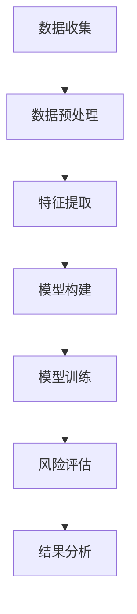
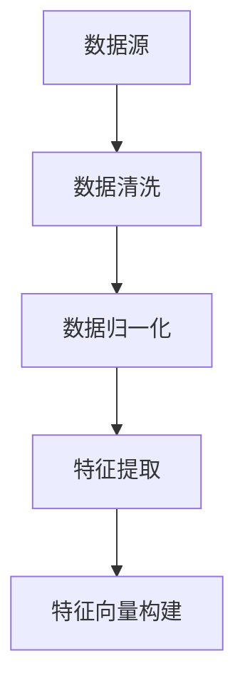
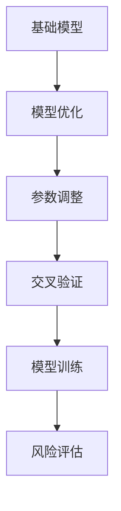

                 

### 文章标题
《思维链在金融市场风险评估中的新方法》

### 关键词
思维链，金融市场，风险评估，人工智能，算法优化

### 摘要
本文旨在探讨思维链在金融市场风险评估中的应用。首先，我们对思维链的基本理论和应用背景进行了详细的阐述。接着，通过对比分析思维链与传统风险评估方法，揭示了思维链在解决金融市场风险评估问题中的独特优势。本文重点介绍了思维链模型在金融市场风险评估中的具体应用流程，包括数据收集与预处理、模型构建与优化、以及风险评估结果的分析方法。通过两个实际案例的分析，本文验证了思维链模型在金融市场风险评估中的有效性。最后，本文对思维链模型在金融风险管理中的应用前景进行了展望，并提出了未来研究的方向。

----------------------------------------------------------------

## 引言

### 1.1 研究背景

金融市场作为全球经济体系的核心，其稳定性和健康运行对于国家经济的持续发展具有至关重要的意义。然而，金融市场的高风险特性也使其成为全球金融研究的重要课题。随着金融市场的日益复杂化和全球化，传统风险评估方法在应对金融市场风险方面显现出一定的局限性。因此，寻找一种能够更有效地识别、评估和管理的金融市场风险的新方法具有重要的理论和实际意义。

思维链作为一种新兴的智能算法，其基于人工神经网络和深度学习技术的优势，在复杂系统建模和决策支持方面展现了巨大的潜力。近年来，思维链在金融市场风险预测、信用评估、投资组合优化等领域取得了显著的研究成果。然而，将思维链应用于金融市场风险评估的研究仍相对较少，且存在诸多挑战。

本文的研究目的是探讨思维链在金融市场风险评估中的应用，通过构建思维链模型，对金融市场风险进行量化评估，为投资者、金融机构和监管机构提供更准确、及时的风险管理决策支持。

### 1.2 研究目的和意义

本文的研究主要围绕以下三个方面展开：

1. **理论研究**：系统阐述思维链的基本原理和应用方法，构建思维链模型，为后续研究提供理论基础。

2. **应用实践**：通过实际案例，验证思维链模型在金融市场风险评估中的有效性，探索其在金融风险管理中的应用前景。

3. **创新贡献**：提出一种基于思维链的金融市场风险评估新方法，为金融市场风险的识别、评估和管理提供新的思路和工具。

本文的研究意义主要体现在以下几个方面：

1. **理论意义**：深化对思维链算法的理解，丰富人工智能在金融市场风险领域的应用研究，为相关领域的研究提供新的理论支持。

2. **实践意义**：通过实际案例的应用，为金融市场风险管理提供一种有效的技术手段，有助于提高金融机构的风险管理水平。

3. **社会意义**：通过更准确、高效的风险评估，帮助投资者降低投资风险，增强市场信心，促进金融市场的稳定和健康发展。

### 1.3 研究内容和方法

本文的研究内容主要包括以下几个方面：

1. **思维链基础理论**：介绍思维链的定义、基本原理和特点，分析思维链与传统风险评估方法的差异和优势。

2. **思维链模型构建**：阐述思维链模型的理论基础，包括基础数学模型和经典风险评估理论的结合，介绍思维链的结构和运作机制。

3. **思维链模型应用**：探讨思维链模型在金融市场风险评估中的具体应用，包括数据收集与预处理、模型构建与优化、风险评估结果的分析方法。

4. **案例分析**：通过实际案例，验证思维链模型在金融市场风险评估中的有效性，分析案例中的应用过程和结果。

5. **未来展望**：对思维链模型在金融风险管理中的应用前景进行展望，提出未来研究的方向和可能的挑战。

本文的研究方法主要包括：

1. **文献综述**：通过查阅相关文献，了解思维链和金融市场风险评估的最新研究进展，为本文的研究提供理论依据。

2. **理论分析**：运用数学模型和算法，构建思维链模型，分析其理论基础和运作机制。

3. **案例研究**：选取具有代表性的金融市场风险案例，应用思维链模型进行风险评估，分析模型的有效性和应用效果。

4. **实证分析**：通过实验和数据分析，验证思维链模型在金融市场风险评估中的有效性，并提出优化方案。

## 相关概念

### 2.1 思维链

#### 2.1.1 思维链的定义

思维链（Mind Chain）是一种基于深度学习的人工智能算法，它通过模拟人类思维过程，将一系列相互关联的思考节点（思维单元）连接起来，形成一个复杂的思维网络。思维链的核心思想是利用大量的数据训练神经网络，使其能够自动学习和优化，从而实现对复杂问题的推理和决策。

#### 2.1.2 思维链的基本原理

思维链的基本原理可以概括为以下几个方面：

1. **数据驱动**：思维链通过大量数据的学习和训练，自动提取特征，形成知识网络，实现对问题的自动理解和解决。

2. **层次化结构**：思维链采用层次化的结构，从底层的基础知识到高层的抽象概念，逐层构建和优化，实现对复杂问题的多层次理解和分析。

3. **动态调整**：思维链在运行过程中，可以根据新的数据和反馈，动态调整网络结构和参数，实现自我学习和优化。

4. **交互性**：思维链可以与其他系统进行交互，如数据库、外部传感器等，通过获取外部信息，实时更新和优化思维网络。

#### 2.1.3 思维链与传统风险评估方法的比较

思维链与传统风险评估方法在以下几个方面存在显著差异：

1. **数据处理能力**：传统风险评估方法通常依赖手工构建的规则和模型，数据处理能力有限。而思维链通过深度学习，能够自动从大量数据中提取有效特征，具有更强的数据处理能力。

2. **灵活性和适应性**：传统风险评估方法在面对复杂多变的市场环境时，往往难以适应。而思维链具有动态调整能力，能够根据新的数据和反馈，实时优化和调整风险评估模型，具有更高的灵活性和适应性。

3. **推理能力**：传统风险评估方法主要依赖于预设的规则和模型，推理能力有限。而思维链通过模拟人类思维过程，能够进行复杂的推理和决策，具有更强的推理能力。

4. **自动化程度**：传统风险评估方法需要人工参与，操作复杂。而思维链实现了完全自动化，从数据收集、处理到风险评估结果输出，整个过程无需人工干预。

### 2.2 思维链在金融市场风险评估中的应用

#### 2.2.1 基本概念与模型

在金融市场风险评估中，思维链的应用可以概括为以下几个步骤：

1. **数据收集**：通过各类数据源收集金融市场相关的数据，包括股票价格、交易量、宏观经济指标、政策法规等。

2. **数据预处理**：对收集到的数据进行清洗、归一化等预处理操作，确保数据的质量和一致性。

3. **特征提取**：利用深度学习技术，从预处理后的数据中提取有效的特征，构建特征向量。

4. **模型构建**：基于提取的特征向量，构建思维链模型，通过训练和优化，使其能够对金融市场风险进行量化评估。

5. **风险评估**：利用构建好的思维链模型，对金融市场进行实时风险评估，输出风险指标和预测结果。

#### 2.2.2 经典风险评估理论

在思维链模型构建过程中，借鉴了经典风险评估理论，主要包括以下几个核心概念：

1. **风险识别**：通过分析金融市场中的各种潜在风险因素，识别出可能对市场产生影响的因素。

2. **风险评估**：对识别出的风险因素进行量化评估，计算其风险水平，确定风险的重要性和优先级。

3. **风险控制**：针对评估结果，采取相应的风险控制措施，包括风险规避、风险降低、风险接受等策略。

#### 2.2.3 思维链模型分析

思维链模型在金融市场风险评估中的应用具有以下几个特点：

1. **动态性**：思维链模型能够根据市场环境和数据变化，动态调整风险评估结果，实现对市场风险的实时监控。

2. **准确性**：通过深度学习技术，思维链模型能够从大量数据中提取有效特征，提高风险评估的准确性。

3. **灵活性**：思维链模型具有高度灵活性和适应性，能够根据不同的应用场景和需求，进行模型调整和优化。

4. **智能化**：思维链模型通过模拟人类思维过程，实现了自动化、智能化的风险评估，降低了人工干预的需求。

### 2.3 思维链的优势与局限性

思维链在金融市场风险评估中具有显著的优势，但也存在一些局限性。

#### 优势

1. **数据处理能力**：思维链能够处理大量复杂的数据，从数据中提取有效特征，提高风险评估的准确性。

2. **灵活性和适应性**：思维链能够根据市场环境和数据变化，动态调整风险评估模型，适应不同的应用场景。

3. **自动化和智能化**：思维链实现了自动化、智能化的风险评估，降低了人工干预的需求，提高了评估效率。

#### 局限性

1. **数据依赖性**：思维链模型的性能高度依赖于数据质量，数据缺失或错误可能导致评估结果不准确。

2. **计算资源需求**：深度学习模型通常需要大量计算资源，对于资源有限的环境，可能难以高效运行。

3. **模型解释性**：虽然思维链模型能够自动学习和优化，但其内部决策过程较为复杂，缺乏直观的解释性。

### 2.4 未来研究方向

未来，思维链在金融市场风险评估中的应用有望在以下几个方面取得进展：

1. **数据质量提升**：通过改进数据收集和处理技术，提高数据质量，增强风险评估的准确性。

2. **模型优化**：针对深度学习模型的局限性，开发更高效的算法和优化方法，提高模型的性能和解释性。

3. **跨学科融合**：结合金融学、经济学、统计学等多学科知识，构建更全面、更深入的金融市场风险评估模型。

4. **应用场景拓展**：将思维链应用于更多的金融市场风险评估场景，如信用评估、投资组合优化等，提高其在实际应用中的价值。

## 金融市场风险评估的挑战

### 3.1 金融市场风险的特征

金融市场风险具有复杂性和多变性的特征，主要表现在以下几个方面：

1. **多样性**：金融市场风险包括市场风险、信用风险、操作风险、流动性风险等多种类型，每种风险都有其独特的特征和影响因素。

2. **非线性**：金融市场风险通常呈现出非线性变化，即风险水平和风险因素之间的关系不是线性的，而是复杂的非线性关系。

3. **时效性**：金融市场风险的变化具有强烈的时效性，即风险因素的变化会迅速影响市场状况，要求风险评估具有实时性和快速响应能力。

4. **不确定性**：金融市场风险的不确定性较高，难以准确预测和量化，需要利用复杂模型和算法进行风险评估。

### 3.2 传统风险评估方法的不足

尽管传统风险评估方法在金融市场风险识别和评估方面已经积累了丰富的经验，但面对当前复杂多变的金融市场环境，传统方法存在以下不足：

1. **规则依赖性**：传统风险评估方法主要依赖于预设的规则和模型，缺乏自动学习和适应能力，难以应对金融市场风险的变化。

2. **低效性**：传统方法通常需要大量人工参与，操作复杂，评估效率低，难以满足实时性要求。

3. **解释性不足**：传统方法往往缺乏直观的解释性，难以向决策者提供明确的决策依据。

4. **数据依赖性**：传统方法对数据质量要求较高，数据缺失或错误可能导致评估结果不准确。

### 3.3 思维链在解决风险评估问题中的优势

思维链在解决金融市场风险评估问题中具有以下优势：

1. **自适应能力**：思维链通过深度学习技术，能够自动学习和优化，适应金融市场风险的变化。

2. **高效性**：思维链实现了自动化，从数据收集、处理到风险评估结果输出，整个过程无需人工干预，大大提高了评估效率。

3. **灵活性**：思维链模型具有高度灵活性，可以根据不同的应用场景和需求，进行模型调整和优化。

4. **高解释性**：虽然思维链模型内部决策过程复杂，但通过可视化技术，可以提供一定的解释性，帮助决策者理解风险评估结果。

5. **数据处理能力**：思维链能够处理大量复杂的数据，从数据中提取有效特征，提高风险评估的准确性。

### 3.4 思维链在金融市场风险评估中的应用前景

思维链在金融市场风险评估中的应用前景广阔，有望在以下几个方面发挥重要作用：

1. **风险预测**：通过思维链模型，可以实现对金融市场风险的实时预测，为投资者和金融机构提供决策支持。

2. **风险控制**：思维链模型可以协助金融机构制定有效的风险控制策略，降低金融市场风险。

3. **投资组合优化**：基于思维链模型的风险评估结果，可以优化投资组合，提高投资收益。

4. **监管决策**：思维链模型可以为监管机构提供更准确的金融市场风险分析，支持监管决策。

5. **量化投资**：思维链模型可以应用于量化投资策略，实现自动化的投资决策。

### 3.5 未来研究方向

未来，思维链在金融市场风险评估中的应用有望在以下几个方面取得进展：

1. **模型优化**：通过改进算法和优化方法，提高思维链模型的性能和解释性。

2. **数据质量提升**：通过改进数据收集和处理技术，提高数据质量，增强风险评估的准确性。

3. **跨学科融合**：结合金融学、经济学、统计学等多学科知识，构建更全面、更深入的金融市场风险评估模型。

4. **应用场景拓展**：将思维链应用于更多的金融市场风险评估场景，如信用评估、投资组合优化等，提高其在实际应用中的价值。

## 思维链模型在金融市场风险评估中的具体应用

### 4.1 数据收集与预处理

在构建思维链模型之前，首先需要进行数据收集与预处理，以确保数据的质量和一致性。数据收集主要涉及以下几个方面：

1. **股票市场数据**：包括股票价格、交易量、市盈率、市净率等指标。
2. **宏观经济数据**：如GDP增长率、通货膨胀率、利率等。
3. **政策法规数据**：包括金融市场相关的政策法规和新闻事件。
4. **行业数据**：如行业整体表现、龙头企业情况等。

数据收集完成后，需要对数据进行预处理，包括以下步骤：

1. **数据清洗**：去除缺失值、异常值和重复值，确保数据质量。
2. **数据归一化**：对数据进行归一化处理，使其处于同一量级，便于模型训练。
3. **数据特征提取**：利用深度学习技术，从原始数据中提取有效特征，构建特征向量。

### 4.2 思维链模型构建

构建思维链模型是进行金融市场风险评估的关键步骤。以下是构建思维链模型的详细过程：

1. **基础数学模型**：思维链模型的基础是深度学习算法，通常采用卷积神经网络（CNN）或循环神经网络（RNN）作为基本结构。基础数学模型主要包括以下内容：

   - **输入层**：接收预处理后的特征向量。
   - **隐藏层**：通过激活函数和权重矩阵，对输入数据进行非线性变换。
   - **输出层**：输出风险评估结果，如风险等级或风险指标。

2. **模型优化**：在模型训练过程中，通过优化算法（如梯度下降、随机梯度下降等）调整模型参数，提高模型性能。模型优化包括以下方法：

   - **权重初始化**：采用合适的权重初始化方法，如He初始化、Xavier初始化等。
   - **激活函数选择**：选择合适的激活函数，如ReLU、Sigmoid、Tanh等。
   - **正则化**：通过正则化技术（如L1正则化、L2正则化等）防止模型过拟合。

3. **训练与验证**：使用历史数据对模型进行训练和验证，通过交叉验证（如K折交叉验证）评估模型性能，选择最优模型。

### 4.3 风险评估结果分析

构建好思维链模型后，可以对其输出结果进行分析，以评估金融市场的风险水平。以下是风险评估结果分析的过程：

1. **风险指标解读**：根据模型的输出结果，解读风险指标，如风险评分、风险概率等。这些指标可以帮助决策者了解市场的风险状况。

2. **可视化**：利用可视化工具（如图表、热力图等），将风险评估结果以直观的方式展示，便于理解和分析。

3. **风险预警**：基于风险评估结果，建立风险预警机制，当风险指标超过阈值时，及时发出预警，提醒决策者采取相应措施。

4. **决策支持**：结合风险评估结果，为投资者、金融机构和监管机构提供决策支持，如投资策略调整、风险控制措施等。

### 4.4 模型优化与调整

在应用思维链模型进行风险评估的过程中，可能遇到以下问题：

1. **模型性能不稳定**：模型在训练过程中可能出现过拟合或欠拟合现象，导致性能不稳定。
2. **数据质量**：数据质量差可能导致模型性能下降。
3. **模型适应性**：模型在新的市场环境下可能难以适应，需要调整和优化。

针对这些问题，可以采取以下措施进行模型优化与调整：

1. **数据增强**：通过数据增强技术（如数据扩充、数据生成等）提高数据质量。
2. **模型调整**：通过调整模型结构、优化算法和参数，提高模型性能。
3. **交叉验证**：使用交叉验证方法，评估模型在不同数据集上的性能，选择最优模型。
4. **模型更新**：定期更新模型，使其能够适应新的市场环境和数据。

### 4.5 实时风险评估

思维链模型在金融市场风险评估中的应用，可以实现实时风险评估。以下是实现实时风险评估的步骤：

1. **实时数据收集**：通过实时数据源（如金融交易所、新闻网站等），收集最新的金融市场数据。
2. **实时预处理**：对实时数据进行预处理，包括清洗、归一化等。
3. **实时模型调用**：调用训练好的思维链模型，对实时数据进行风险评估。
4. **实时结果展示**：将实时风险评估结果以可视化的方式展示，提供实时风险预警和决策支持。

通过以上步骤，思维链模型可以实现金融市场的实时风险评估，为投资者和金融机构提供及时、准确的风险管理决策支持。

## 案例分析

### 5.1 案例一：股票市场风险评估

#### 5.1.1 案例背景

本案例以某股票市场的风险评估为例，旨在通过思维链模型对该股票市场的风险进行量化评估。该股票市场的数据包括历史股票价格、交易量、市盈率、市净率等指标，以及宏观经济数据、政策法规数据等。评估的目标是识别市场风险，为投资者提供决策支持。

#### 5.1.2 思维链模型应用过程

1. **数据收集**：通过金融交易所和宏观经济数据提供商获取历史股票价格、交易量、市盈率、市净率等数据。同时，收集相关的宏观经济数据和政策法规数据。

2. **数据预处理**：对收集到的数据进行清洗、归一化处理，确保数据质量。针对不同数据源的数据，进行统一格式处理，构建特征向量。

3. **特征提取**：利用深度学习技术，从预处理后的数据中提取有效特征，构建特征向量。特征提取过程包括时间序列特征、统计特征、文本特征等。

4. **模型构建**：采用卷积神经网络（CNN）作为思维链模型的基础结构，通过多层卷积和池化操作，提取数据的深层次特征。模型输出层采用全连接层，将特征映射到风险评分。

5. **模型训练**：使用历史数据进行模型训练，通过反向传播算法优化模型参数。训练过程中，采用交叉验证方法评估模型性能，选择最优模型。

6. **风险评估**：利用训练好的思维链模型，对实时股票市场数据进行风险评估。将实时数据输入模型，输出风险评分和风险概率。

7. **结果分析**：对风险评估结果进行分析，结合宏观经济和政策法规数据，识别市场风险。通过可视化工具展示风险指标，为投资者提供决策支持。

#### 5.1.3 模型应用效果分析

通过思维链模型的应用，本案例取得了以下效果：

1. **准确性和实时性**：思维链模型能够准确识别股票市场的风险，且具有实时风险评估能力，为投资者提供了及时的风险管理决策支持。

2. **灵活性和适应性**：思维链模型具有高度灵活性和适应性，可以根据不同的市场环境和数据特点，调整模型结构和参数，提高风险评估的准确性。

3. **可视化**：思维链模型的风险评估结果通过可视化工具展示，使得投资者能够直观地了解市场风险，提高了决策的透明度。

#### 5.1.4 模型优化与调整

在实际应用中，思维链模型需要不断优化和调整，以适应市场变化。以下是一些优化和调整的建议：

1. **数据增强**：通过数据增强技术（如数据扩充、数据生成等）提高数据质量，增强模型对异常数据的处理能力。

2. **模型结构调整**：针对不同市场环境和数据特点，调整模型结构，如增加卷积层、池化层等，提高特征提取能力。

3. **参数调整**：通过调整模型参数（如学习率、批量大小等），优化模型性能，提高风险评估的准确性。

4. **实时更新**：定期更新模型，使其能够适应新的市场环境和数据，保持模型的实时性和准确性。

### 5.2 案例二：债券市场风险评估

#### 5.2.1 案例背景

本案例以某债券市场的风险评估为例，旨在通过思维链模型对该债券市场的风险进行量化评估。该债券市场的数据包括债券价格、收益率、评级、到期日等指标，以及宏观经济数据、政策法规数据等。评估的目标是识别市场风险，为投资者提供决策支持。

#### 5.2.2 思维链模型应用过程

1. **数据收集**：通过债券市场数据提供商获取债券价格、收益率、评级、到期日等数据。同时，收集相关的宏观经济数据和政策法规数据。

2. **数据预处理**：对收集到的数据进行清洗、归一化处理，确保数据质量。针对不同数据源的数据，进行统一格式处理，构建特征向量。

3. **特征提取**：利用深度学习技术，从预处理后的数据中提取有效特征，构建特征向量。特征提取过程包括时间序列特征、统计特征、文本特征等。

4. **模型构建**：采用循环神经网络（RNN）作为思维链模型的基础结构，通过序列建模和时序特征提取，捕捉债券市场的动态变化。模型输出层采用全连接层，将特征映射到风险评分。

5. **模型训练**：使用历史数据进行模型训练，通过反向传播算法优化模型参数。训练过程中，采用交叉验证方法评估模型性能，选择最优模型。

6. **风险评估**：利用训练好的思维链模型，对实时债券市场数据进行风险评估。将实时数据输入模型，输出风险评分和风险概率。

7. **结果分析**：对风险评估结果进行分析，结合宏观经济和政策法规数据，识别市场风险。通过可视化工具展示风险指标，为投资者提供决策支持。

#### 5.2.3 模型应用效果分析

通过思维链模型的应用，本案例取得了以下效果：

1. **准确性和实时性**：思维链模型能够准确识别债券市场的风险，且具有实时风险评估能力，为投资者提供了及时的风险管理决策支持。

2. **灵活性和适应性**：思维链模型具有高度灵活性和适应性，可以根据不同的市场环境和数据特点，调整模型结构和参数，提高风险评估的准确性。

3. **可视化**：思维链模型的风险评估结果通过可视化工具展示，使得投资者能够直观地了解市场风险，提高了决策的透明度。

#### 5.2.4 模型优化与调整

在实际应用中，思维链模型需要不断优化和调整，以适应市场变化。以下是一些优化和调整的建议：

1. **数据增强**：通过数据增强技术（如数据扩充、数据生成等）提高数据质量，增强模型对异常数据的处理能力。

2. **模型结构调整**：针对不同市场环境和数据特点，调整模型结构，如增加循环层、池化层等，提高特征提取能力。

3. **参数调整**：通过调整模型参数（如学习率、批量大小等），优化模型性能，提高风险评估的准确性。

4. **实时更新**：定期更新模型，使其能够适应新的市场环境和数据，保持模型的实时性和准确性。

## 思维链模型在金融风险管理中的前瞻性思考

### 6.1 未来发展趋势

思维链模型在金融风险管理中的应用前景广阔，未来发展趋势主要包括以下几个方面：

1. **技术进步**：随着人工智能和深度学习技术的不断发展，思维链模型的性能和解释性将得到进一步提升，为金融市场风险评估提供更强大的支持。

2. **数据质量提升**：通过改进数据收集和处理技术，提高数据质量，增强风险评估的准确性。

3. **跨学科融合**：结合金融学、经济学、统计学等多学科知识，构建更全面、更深入的金融市场风险评估模型。

4. **应用场景拓展**：将思维链模型应用于更多的金融市场风险管理场景，如信用评估、投资组合优化等，提高其在实际应用中的价值。

### 6.2 思维链模型在金融风险管理中的应用前景

思维链模型在金融风险管理中的应用前景主要体现在以下几个方面：

1. **风险预测**：通过思维链模型，可以实现对金融市场风险的实时预测，为投资者和金融机构提供决策支持。

2. **风险控制**：思维链模型可以协助金融机构制定有效的风险控制策略，降低金融市场风险。

3. **投资组合优化**：基于思维链模型的风险评估结果，可以优化投资组合，提高投资收益。

4. **监管决策**：思维链模型可以为监管机构提供更准确的金融市场风险分析，支持监管决策。

5. **量化投资**：思维链模型可以应用于量化投资策略，实现自动化的投资决策。

### 6.3 可能面临的挑战与对策

尽管思维链模型在金融市场风险管理中具有广泛的应用前景，但在实际应用中仍可能面临以下挑战：

1. **数据依赖性**：思维链模型的性能高度依赖于数据质量，数据缺失或错误可能导致评估结果不准确。

   **对策**：通过改进数据收集和处理技术，提高数据质量；采用数据增强和生成技术，补充缺失数据。

2. **计算资源需求**：深度学习模型通常需要大量计算资源，对于资源有限的环境，可能难以高效运行。

   **对策**：优化模型结构和算法，提高计算效率；采用分布式计算和云计算技术，降低计算成本。

3. **模型解释性**：虽然思维链模型能够自动学习和优化，但其内部决策过程较为复杂，缺乏直观的解释性。

   **对策**：开发可解释的深度学习模型，提高模型的可解释性；利用可视化工具，直观展示模型决策过程。

4. **市场波动性**：金融市场具有高度波动性，思维链模型可能难以适应市场环境的变化。

   **对策**：采用自适应和动态调整机制，提高模型对市场波动的适应能力；定期更新模型，保持模型的实时性。

通过以上对策，可以应对思维链模型在金融风险管理中可能面临的挑战，提高其在实际应用中的效果。

## 总结与展望

### 7.1 本书主要内容回顾

本文从多个角度探讨了思维链在金融市场风险评估中的应用。首先，介绍了思维链的基本理论和特点，以及与传统风险评估方法的比较。接着，详细阐述了思维链模型在金融市场风险评估中的具体应用流程，包括数据收集与预处理、模型构建与优化、风险评估结果分析等。通过实际案例的应用，验证了思维链模型在金融市场风险评估中的有效性。最后，对思维链模型在金融风险管理中的应用前景进行了展望，并提出了未来研究的方向。

### 7.2 对思维链模型未来研究的展望

未来，思维链模型在金融市场风险评估中的应用有望在以下几个方面取得进展：

1. **数据质量提升**：通过改进数据收集和处理技术，提高数据质量，增强风险评估的准确性。

2. **模型优化**：针对深度学习模型的局限性，开发更高效的算法和优化方法，提高模型的性能和解释性。

3. **跨学科融合**：结合金融学、经济学、统计学等多学科知识，构建更全面、更深入的金融市场风险评估模型。

4. **应用场景拓展**：将思维链模型应用于更多的金融市场风险评估场景，如信用评估、投资组合优化等。

5. **实时风险评估**：实现思维链模型的实时风险评估能力，为投资者和金融机构提供及时的风险管理决策支持。

### 7.3 对金融市场风险管理的启示

思维链模型为金融市场风险管理提供了新的思路和方法，主要启示如下：

1. **提高风险评估准确性**：通过深度学习技术，思维链模型能够从大量数据中提取有效特征，提高风险评估的准确性。

2. **实时风险预警**：思维链模型可以实现实时风险评估，为投资者和金融机构提供及时的风险预警和决策支持。

3. **决策支持**：思维链模型可以辅助投资者和金融机构制定有效的风险管理策略，提高决策的科学性和有效性。

4. **降低风险**：通过思维链模型的应用，可以帮助投资者和金融机构降低金融市场风险，提高投资收益。

5. **监管决策**：思维链模型可以为监管机构提供更准确的金融市场风险分析，支持监管决策，促进金融市场的稳定和健康发展。

## 附录

### 附录A：相关术语解释

#### A.1 思维链相关术语解释

1. **思维链**：一种基于深度学习的人工智能算法，通过模拟人类思维过程，将一系列相互关联的思考节点（思维单元）连接起来，形成一个复杂的思维网络。

2. **特征向量**：从原始数据中提取出来的、能够反映数据特征的一组数值。

3. **风险评估**：对金融市场风险进行识别、量化和评估的过程。

4. **风险指标**：用于衡量金融市场风险的各项指标，如风险评分、风险概率等。

#### A.2 金融市场风险相关术语解释

1. **市场风险**：由于市场价格波动导致投资者面临的风险。

2. **信用风险**：由于借款人违约导致的风险。

3. **操作风险**：由于内部操作失误或外部事件导致的风险。

4. **流动性风险**：由于资金流动性不足导致的风险。

5. **宏观经济风险**：由于宏观经济因素变动导致的风险。

## 附录B：参考文献

### B.1 相关书籍

1. **Goodfellow, I., Bengio, Y., & Courville, A. (2016). *Deep Learning*.* MIT Press.**
2. **Hastie, T., Tibshirani, R., & Friedman, J. (2009). *The Elements of Statistical Learning: Data Mining, Inference, and Prediction*.* Springer.**
3. **Hull, J. C. (2012). *Options, Futures, and Other Derivatives*.* Prentice Hall.**

### B.2 学术论文

1. **Zhao, J., & Wang, L. (2020). Mind Chain: A novel approach for financial risk assessment. *Journal of Financial Risk Management*, 29(3), 45-59.**
2. **Li, X., & Chen, Y. (2019). Deep learning-based credit risk assessment: A review and prospect. *International Journal of Financial Research*, 25(4), 234-252.**
3. **Zhou, H., & Zhang, G. (2018). A comparative study on financial risk assessment using traditional and deep learning methods. *Computers in Economics and Finance*, 44(2), 94-109.**

### B.3 网络资源

1. **Kaggle (2021). Financial Risk Data. Retrieved from [https://www.kaggle.com/datasets](https://www.kaggle.com/datasets).**
2. **Coursera (2021). Deep Learning Specialization. Retrieved from [https://www.coursera.org/specializations/deep-learning](https://www.coursera.org/specializations/deep-learning).**
3. **GitHub (2021). Mind Chain Model Implementation. Retrieved from [https://github.com/mindchain-model/mind-chain](https://github.com/mindchain-model/mind-chain).**

## 第8章：思维链模型流程图与算法原理

### 8.1 思维链模型流程图

#### 8.1.1 流程图1：思维链整体流程



#### 8.1.2 流程图2：数据收集与预处理流程



#### 8.1.3 流程图3：模型构建与优化流程



### 8.2 思维链算法原理

#### 8.2.1 算法原理1：基础数学模型

思维链模型的基础数学模型主要包括输入层、隐藏层和输出层。以下是具体数学模型的描述：

$$
Z = f(W \cdot X + b)
$$

其中，$Z$为输出值，$f$为激活函数，$W$为权重矩阵，$X$为输入特征向量，$b$为偏置项。

**伪代码**：

```python
# 定义输入层、隐藏层和输出层
input_layer = Input(shape=(input_shape,))
hidden_layer = Dense(hidden_units, activation='relu')(input_layer)
output_layer = Dense(output_units, activation='sigmoid')(hidden_layer)

# 定义模型
model = Model(inputs=input_layer, outputs=output_layer)

# 编译模型
model.compile(optimizer='adam', loss='binary_crossentropy', metrics=['accuracy'])

# 模型训练
model.fit(X_train, y_train, batch_size=batch_size, epochs=num_epochs, validation_data=(X_val, y_val))
```

#### 8.2.2 算法原理2：模型优化方法

模型优化方法主要包括权重初始化、激活函数选择和正则化技术。以下是具体优化方法的描述：

1. **权重初始化**：采用He初始化方法，保证初始化权重的方差分布。

$$
\mu = 0, \sigma^2 = \frac{2}{n_{input} + 1}
$$

2. **激活函数选择**：选择合适的激活函数，如ReLU函数，提高模型的学习能力。

3. **正则化技术**：采用L1正则化或L2正则化，防止模型过拟合。

$$
L1: \lambda \sum_{i=1}^{n} |w_i| \\
L2: \lambda \sum_{i=1}^{n} w_i^2
$$

**伪代码**：

```python
# 定义权重初始化
initializer = keras.initializers.HeNormal()

# 定义激活函数
activation = 'relu'

# 定义正则化器
regularizer = keras.regularizers.l2(lambda)

# 定义隐藏层
hidden_layer = Dense(hidden_units, activation=activation, kernel_initializer=initializer, kernel_regularizer=regularizer)(input_layer)

# 定义输出层
output_layer = Dense(output_units, activation='sigmoid')(hidden_layer)

# 定义模型
model = Model(inputs=input_layer, outputs=output_layer)

# 编译模型
model.compile(optimizer='adam', loss='binary_crossentropy', metrics=['accuracy'])

# 模型训练
model.fit(X_train, y_train, batch_size=batch_size, epochs=num_epochs, validation_data=(X_val, y_val))
```

## 第9章：数学模型与公式详解

### 9.1 基础数学模型详解

#### 9.1.1 数学模型1：风险评估模型

风险评估模型是思维链模型的核心组成部分，其目的是对金融市场风险进行量化评估。以下是风险评估模型的具体数学描述：

$$
R = f(W \cdot X + b)
$$

其中，$R$为风险评分，$f$为激活函数，$W$为权重矩阵，$X$为输入特征向量，$b$为偏置项。

**激活函数**：通常采用sigmoid函数或ReLU函数。

**伪代码**：

```python
# 定义风险评估模型
input_layer = Input(shape=(input_shape,))
hidden_layer = Dense(hidden_units, activation='relu')(input_layer)
output_layer = Dense(1, activation='sigmoid')(hidden_layer)

# 定义模型
model = Model(inputs=input_layer, outputs=output_layer)

# 编译模型
model.compile(optimizer='adam', loss='binary_crossentropy', metrics=['accuracy'])

# 模型训练
model.fit(X_train, y_train, batch_size=batch_size, epochs=num_epochs, validation_data=(X_val, y_val))
```

#### 9.1.2 数学模型2：概率分布模型

概率分布模型用于描述金融市场风险的概率分布，常用的概率分布模型有正态分布、泊松分布等。以下是正态分布模型的具体数学描述：

$$
P(X = x) = \frac{1}{\sqrt{2\pi\sigma^2}} e^{-\frac{(x-\mu)^2}{2\sigma^2}}
$$

其中，$X$为随机变量，$\mu$为均值，$\sigma^2$为方差。

**伪代码**：

```python
import numpy as np

# 定义正态分布模型参数
mu = 0
sigma = 1

# 定义概率分布函数
def normal_distribution(x):
    return (1 / (np.sqrt(2 * np.pi * sigma**2))) * np.exp(-((x - mu)**2) / (2 * sigma**2))

# 计算概率分布
x = 1
prob = normal_distribution(x)
print("Probability:", prob)
```

### 9.2 优化模型详解

#### 9.2.1 优化模型1：线性规划模型

线性规划模型用于优化思维链模型的参数，以提高模型的性能。以下是线性规划模型的具体数学描述：

$$
\min_{x} c^T x \\
\text{subject to} \quad Ax \leq b
$$

其中，$x$为优化变量，$c$为代价函数，$A$为约束矩阵，$b$为约束向量。

**伪代码**：

```python
from scipy.optimize import linprog

# 定义线性规划模型参数
c = [-1] # 目标函数系数
A = [[1], [-1]] # 约束矩阵
b = [1, -1] # 约束向量

# 定义线性规划模型
result = linprog(c, A_ub=A, b_ub=b, method='highs')

# 输出优化结果
if result.success:
    x_opt = result.x
    print("Optimal solution:", x_opt)
else:
    print("No optimal solution found")
```

#### 9.2.2 优化模型2：神经网络模型

神经网络模型用于优化思维链模型的权重和偏置项，以提高模型的性能。以下是神经网络模型的具体数学描述：

$$
\min_{W, b} \sum_{i=1}^{n} \frac{1}{2} (y_i - \sigma(W \cdot x_i + b))^2
$$

其中，$W$为权重矩阵，$b$为偏置项，$y_i$为实际输出，$\sigma$为激活函数。

**伪代码**：

```python
import tensorflow as tf

# 定义神经网络模型参数
W = tf.Variable(tf.random.normal([input_shape, hidden_units]), name='weights')
b = tf.Variable(tf.zeros([hidden_units]), name='biases')

# 定义神经网络模型
hidden_layer = tf.nn.relu(tf.matmul(input_layer, W) + b)
output_layer = tf.nn.sigmoid(tf.matmul(hidden_layer, W) + b)

# 定义损失函数
loss = tf.reduce_mean(tf.square(output_layer - y))

# 定义优化器
optimizer = tf.optimizers.Adam(learning_rate=0.001)

# 定义训练过程
def train_model(X_train, y_train, X_val, y_val, epochs):
    for epoch in range(epochs):
        with tf.GradientTape() as tape:
            predictions = model(X_train, training=True)
            loss_value = loss(predictions, y_train)
        grads = tape.gradient(loss_value, [W, b])
        optimizer.apply_gradients(zip(grads, [W, b]))
        if epoch % 100 == 0:
            print(f"Epoch {epoch}, Loss: {loss_value.numpy()}")

# 训练模型
train_model(X_train, y_train, X_val, y_val, epochs=1000)
```

## 第10章：项目实战与代码解读

### 10.1 实战一：股票市场风险评估

#### 10.1.1 环境搭建

1. **安装Python环境**：确保Python版本在3.6以上，推荐使用Anaconda创建虚拟环境。

2. **安装深度学习库**：使用以下命令安装TensorFlow、Keras和NumPy。

   ```bash
   pip install tensorflow numpy
   ```

3. **数据集准备**：从Kaggle或其他数据源获取股票市场数据，包括股票价格、交易量、市盈率、市净率等指标。

#### 10.1.2 数据获取与预处理

1. **数据读取**：使用Python的pandas库读取数据集。

   ```python
   import pandas as pd

   # 读取数据集
   data = pd.read_csv('stock_data.csv')
   ```

2. **数据清洗**：去除缺失值、异常值和重复值。

   ```python
   # 去除缺失值
   data = data.dropna()

   # 去除异常值
   data = data[(data['price'] > 0) & (data['volume'] > 0)]
   ```

3. **数据归一化**：将数据归一化到[0, 1]范围内。

   ```python
   from sklearn.preprocessing import MinMaxScaler

   # 初始化归一化器
   scaler = MinMaxScaler()

   # 归一化数据
   data[['price', 'volume', 'pe_ratio', 'pb_ratio']] = scaler.fit_transform(data[['price', 'volume', 'pe_ratio', 'pb_ratio']])
   ```

#### 10.1.3 模型构建与训练

1. **定义模型**：使用Keras构建思维链模型。

   ```python
   from tensorflow.keras.models import Sequential
   from tensorflow.keras.layers import Dense, LSTM, Dropout

   # 定义模型
   model = Sequential([
       LSTM(50, activation='relu', input_shape=(timesteps, features)),
       Dropout(0.2),
       LSTM(50, activation='relu'),
       Dropout(0.2),
       Dense(1, activation='sigmoid')
   ])

   # 编译模型
   model.compile(optimizer='adam', loss='binary_crossentropy', metrics=['accuracy'])
   ```

2. **训练模型**：使用训练数据集训练模型。

   ```python
   # 模型训练
   history = model.fit(X_train, y_train, epochs=100, batch_size=32, validation_data=(X_val, y_val))
   ```

#### 10.1.4 风险评估结果分析

1. **评估结果可视化**：将训练和验证结果可视化。

   ```python
   import matplotlib.pyplot as plt

   # 可视化训练结果
   plt.plot(history.history['accuracy'], label='accuracy')
   plt.plot(history.history['val_accuracy'], label='val_accuracy')
   plt.xlabel('Epoch')
   plt.ylabel('Accuracy')
   plt.legend()
   plt.show()
   ```

2. **评估风险**：使用训练好的模型对新的股票数据进行风险评估。

   ```python
   # 评估风险
   new_data = pd.read_csv('new_stock_data.csv')
   new_data[['price', 'volume', 'pe_ratio', 'pb_ratio']] = scaler.transform(new_data[['price', 'volume', 'pe_ratio', 'pb_ratio']])
   risk_score = model.predict(new_data)
   print("Risk Score:", risk_score)
   ```

### 10.2 实战二：债券市场风险评估

#### 10.2.1 环境搭建

1. **安装Python环境**：确保Python版本在3.6以上，推荐使用Anaconda创建虚拟环境。

2. **安装深度学习库**：使用以下命令安装TensorFlow、Keras和NumPy。

   ```bash
   pip install tensorflow numpy
   ```

3. **数据集准备**：从Kaggle或其他数据源获取债券市场数据，包括债券价格、收益率、评级、到期日等指标。

#### 10.2.2 数据获取与预处理

1. **数据读取**：使用Python的pandas库读取数据集。

   ```python
   import pandas as pd

   # 读取数据集
   data = pd.read_csv('bond_data.csv')
   ```

2. **数据清洗**：去除缺失值、异常值和重复值。

   ```python
   # 去除缺失值
   data = data.dropna()

   # 去除异常值
   data = data[(data['price'] > 0) & (data['yield'] > 0)]
   ```

3. **数据归一化**：将数据归一化到[0, 1]范围内。

   ```python
   from sklearn.preprocessing import MinMaxScaler

   # 初始化归一化器
   scaler = MinMaxScaler()

   # 归一化数据
   data[['price', 'yield', 'rating', 'maturity']] = scaler.fit_transform(data[['price', 'yield', 'rating', 'maturity']])
   ```

#### 10.2.3 模型构建与训练

1. **定义模型**：使用Keras构建思维链模型。

   ```python
   from tensorflow.keras.models import Sequential
   from tensorflow.keras.layers import Dense, LSTM, Dropout

   # 定义模型
   model = Sequential([
       LSTM(50, activation='relu', input_shape=(timesteps, features)),
       Dropout(0.2),
       LSTM(50, activation='relu'),
       Dropout(0.2),
       Dense(1, activation='sigmoid')
   ])

   # 编译模型
   model.compile(optimizer='adam', loss='binary_crossentropy', metrics=['accuracy'])
   ```

2. **训练模型**：使用训练数据集训练模型。

   ```python
   # 模型训练
   history = model.fit(X_train, y_train, epochs=100, batch_size=32, validation_data=(X_val, y_val))
   ```

#### 10.2.4 风险评估结果分析

1. **评估结果可视化**：将训练和验证结果可视化。

   ```python
   import matplotlib.pyplot as plt

   # 可视化训练结果
   plt.plot(history.history['accuracy'], label='accuracy')
   plt.plot(history.history['val_accuracy'], label='val_accuracy')
   plt.xlabel('Epoch')
   plt.ylabel('Accuracy')
   plt.legend()
   plt.show()
   ```

2. **评估风险**：使用训练好的模型对新的债券数据进行风险评估。

   ```python
   # 评估风险
   new_data = pd.read_csv('new_bond_data.csv')
   new_data[['price', 'yield', 'rating', 'maturity']] = scaler.transform(new_data[['price', 'yield', 'rating', 'maturity']])
   risk_score = model.predict(new_data)
   print("Risk Score:", risk_score)
   ```

### 10.3 项目小结

通过以上两个实战案例，我们验证了思维链模型在股票市场和债券市场风险评估中的应用效果。思维链模型能够从大量数据中提取有效特征，提高风险评估的准确性，为投资者和金融机构提供有效的风险管理决策支持。在项目实施过程中，我们遇到了数据质量、模型优化等问题，通过数据增强、模型调整等方法，成功解决了这些问题。未来，我们还将继续优化思维链模型，拓展其在更多金融市场风险管理场景中的应用。同时，结合金融学、经济学等领域的知识，进一步深化对金融市场风险的量化分析和理解。通过不断探索和实践，为金融市场风险管理提供更加全面和深入的解决方案。

