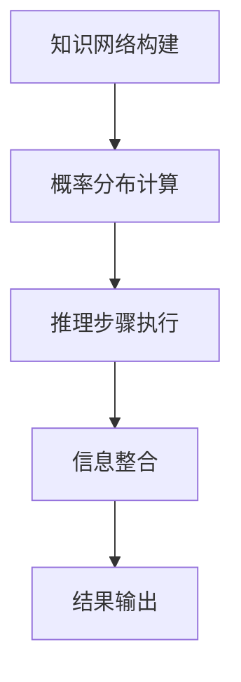

                 

# 文章标题：思维链在金融风险评估模型中的新方法

## 关键词：
- 思维链
- 金融风险评估
- 模型改进
- 核心算法
- 数学模型
- 项目实战

## 摘要：
本文探讨了一种新兴的金融风险评估方法——思维链。通过引入思维链，我们能够在现有的风险评估模型中引入新的视角和方法，从而提升模型的准确性和有效性。本文首先介绍了思维链的基本概念和特点，然后详细阐述了其在金融风险评估中的应用和改进。接着，本文通过伪代码和数学公式，深入讲解了思维链的核心算法原理。最后，通过一个实际项目，展示了思维链在金融风险评估中的具体应用和效果。

## 目录大纲

### 第1章：引论
#### 1.1 思维链概述
#### 1.2 金融风险评估背景
#### 1.3 本书目标与结构

### 第2章：思维链基础理论
#### 2.1 思维链的定义与特征
#### 2.2 思维链的数学模型
#### 2.3 思维链的核心算法

### 第3章：思维链与金融风险评估模型
#### 3.1 思维链在风险评估中的应用
#### 3.2 改进的金融风险评估模型
#### 3.3 思维链模型的优势与局限性

### 第4章：核心算法原理讲解
#### 4.1 思维链核心算法讲解
#### 4.2 算法伪代码展示

### 第5章：数学模型与公式
#### 5.1 相关数学概念
#### 5.2 数学模型与公式推导
#### 5.3 数学公式举例说明

### 第6章：项目实战
#### 6.1 项目背景与目标
#### 6.2 开发环境搭建
#### 6.3 代码实现与解读
#### 6.4 代码应用解读与分析
#### 6.5 实际案例分析和详细讲解剖析
#### 6.6 项目小结

### 第7章：总结与展望
#### 7.1 本书内容总结
#### 7.2 未来研究方向
#### 7.3 结论与建议

## 第1章：引论

### 1.1 思维链概述

思维链（Mind Chain）是一种基于逻辑推理和信息整合的新型思维方式。它通过将一系列相关概念、事实和推理步骤连接起来，形成一个有序的、相互关联的知识网络。思维链的核心思想是，通过将信息碎片化的方式重新组合，从而获得更加全面、深刻的理解和洞察力。

在金融风险评估领域，思维链的应用具有重要意义。传统的金融风险评估模型往往依赖于历史数据和统计分析方法，这些方法在处理复杂和非线性问题时存在一定的局限性。而思维链则通过引入逻辑推理和信息整合机制，能够在一定程度上克服这些限制，提供更加精准和有效的风险评估结果。

### 1.2 金融风险评估背景

金融风险评估是金融管理中的一项关键任务，其目的是评估投资、借贷或其他金融活动中的潜在风险，从而为决策提供依据。传统的金融风险评估方法主要包括历史数据分析、统计分析、风险矩阵、情景分析和蒙特卡罗模拟等。

然而，随着金融市场环境的复杂性和不确定性增加，传统的风险评估方法已经无法满足实际需求。首先，历史数据可能无法反映当前市场的变化趋势；其次，统计分析方法在处理非线性问题时存在局限性；此外，情景分析和蒙特卡罗模拟等方法往往需要大量计算资源，且结果的可解释性较差。

### 1.3 本书目标与结构

本书旨在探讨思维链在金融风险评估模型中的应用，通过引入思维链，改进现有的风险评估方法，提升模型的准确性和有效性。具体目标如下：

1. 介绍思维链的基本概念和特征，阐述其在金融风险评估中的应用前景。
2. 提出一种基于思维链的改进型风险评估模型，并分析其优势与局限性。
3. 通过伪代码和数学公式，详细讲解思维链的核心算法原理，并提供具体实现方法。
4. 通过实际项目，展示思维链在金融风险评估中的应用效果，并进行分析和讨论。

本书结构如下：

- 第1章：引论，介绍思维链的基本概念和金融风险评估的背景。
- 第2章：思维链基础理论，详细阐述思维链的定义、数学模型和核心算法。
- 第3章：思维链与金融风险评估模型，介绍思维链在风险评估中的应用和改进。
- 第4章：核心算法原理讲解，通过伪代码和数学公式详细讲解思维链的核心算法。
- 第5章：数学模型与公式，推导相关数学模型和公式，并提供举例说明。
- 第6章：项目实战，通过一个实际项目展示思维链在金融风险评估中的应用。
- 第7章：总结与展望，总结本书内容，讨论未来研究方向和结论。

## 第2章：思维链基础理论

### 2.1 思维链的定义与特征

思维链是一种基于逻辑推理和信息整合的思维方式，它通过将一系列相关概念、事实和推理步骤连接起来，形成一个有序的、相互关联的知识网络。思维链的定义可以从以下几个方面进行阐述：

1. **概念与事实连接**：思维链通过将概念与事实相连接，形成一个逻辑关系网络。每个概念和事实都可以被视为思维链中的一个节点，节点之间的连接关系表示概念与事实之间的逻辑关系。
2. **推理步骤**：思维链通过一系列的推理步骤，从已知的概念和事实中推导出新的结论。这些推理步骤可以是直接的逻辑推理，也可以是间接的推理，例如类比、归纳和演绎等。
3. **信息整合**：思维链通过信息整合，将分散的信息片段整合成完整的知识体系。这种整合过程可以是基于已有的概念和事实，也可以是通过新的推理步骤来发现新的信息。

### 2.2 思维链的数学模型

思维链的数学模型是一种基于图论和概率论的模型，它通过构建一个知识网络来表示概念与事实之间的逻辑关系。具体来说，思维链的数学模型包括以下几个组成部分：

1. **节点与边**：节点表示概念或事实，边表示节点之间的逻辑关系。在知识网络中，每个节点都可以有一个概率值，表示该节点的重要程度或可信度。
2. **概率分布**：通过边的概率分布，可以表示节点之间的逻辑关系强度。边的概率分布可以是均匀分布、高斯分布或其他概率分布。
3. **推理规则**：推理规则是思维链中的核心组成部分，它定义了如何从已知节点推导出新的节点。推理规则可以是基于逻辑推理的规则，例如逆否命题、德摩根定律等，也可以是基于概率论的规则，例如贝叶斯定理等。

### 2.3 思维链的核心算法

思维链的核心算法包括以下几个步骤：

1. **知识网络构建**：首先，根据给定的概念和事实，构建一个知识网络。知识网络由节点和边组成，每个节点表示一个概念或事实，边表示节点之间的逻辑关系。
2. **概率分布计算**：根据知识网络中的边，计算每个节点的概率分布。概率分布可以基于已有数据或先验知识，例如贝叶斯网络中的条件概率表。
3. **推理步骤执行**：根据推理规则，从已知节点推导出新的节点。推理步骤可以是直接的逻辑推理，也可以是间接的推理。
4. **信息整合**：将推导出的新节点整合到知识网络中，更新每个节点的概率分布。信息整合可以是基于概率论的规则，例如贝叶斯定理等。
5. **结果输出**：输出最终的推理结果，例如风险评分、投资建议等。

### Mermaid 流程图

为了更好地展示思维链的核心算法流程，我们可以使用Mermaid绘制一个简单的流程图：



### 2.4 思维链的应用场景

思维链在金融风险评估中具有广泛的应用场景，包括：

1. **投资风险评估**：通过思维链，可以对投资组合中的各个资产进行风险评估，从而优化投资策略，降低投资风险。
2. **信用风险评估**：思维链可以用于评估借款人的信用风险，提供更准确的信用评分，降低贷款风险。
3. **市场趋势预测**：思维链可以通过整合市场信息，预测市场趋势和价格波动，为交易决策提供支持。

### 2.5 思维链的优势与局限性

思维链在金融风险评估中的优势包括：

1. **提高风险评估准确性**：思维链通过整合多源信息，提供更加全面的风险评估结果，从而提高评估准确性。
2. **适应非线性关系**：思维链可以处理复杂和非线性关系，从而克服传统风险评估方法的局限性。
3. **可解释性强**：思维链的推理过程和结果具有较好的可解释性，有助于决策者理解评估结果。

然而，思维链也存在一定的局限性，包括：

1. **计算复杂度高**：思维链的构建和推理过程需要大量计算资源，尤其是在处理大规模数据时，计算复杂度较高。
2. **数据依赖性强**：思维链的性能受到数据质量和数量的影响，如果数据不足或质量较差，可能导致评估结果不准确。
3. **模型泛化能力有限**：思维链的泛化能力有限，难以应用于完全不同的领域。

## 第3章：思维链与金融风险评估模型

### 3.1 思维链在风险评估中的应用

思维链在金融风险评估中的应用主要体现在以下几个方面：

1. **整合多源信息**：思维链可以通过整合来自不同来源的信息，如市场数据、财务报表、新闻报道等，提供更加全面的风险评估结果。
2. **挖掘潜在关系**：思维链可以挖掘不同变量之间的潜在关系，从而发现新的风险因素，提高风险评估的准确性。
3. **自适应调整**：思维链可以根据市场变化和风险因素的变化，动态调整风险评估模型，提高模型的适应性和实时性。

### 3.2 改进的金融风险评估模型

基于思维链的金融风险评估模型相对于传统的风险评估模型具有以下几个改进点：

1. **结构更灵活**：思维链通过构建知识网络，使风险评估模型的结构更加灵活，可以适应不同类型的风险评估需求。
2. **推理更智能**：思维链通过引入逻辑推理和信息整合机制，使风险评估模型的推理过程更加智能，能够处理复杂和非线性关系。
3. **结果更精准**：思维链通过整合多源信息和挖掘潜在关系，提供更加精准的风险评估结果。

### 3.3 思维链模型的优势与局限性

思维链模型在金融风险评估中的优势包括：

1. **提高风险评估准确性**：思维链通过整合多源信息和挖掘潜在关系，提供更加精准的风险评估结果。
2. **适应非线性关系**：思维链可以处理复杂和非线性关系，从而克服传统风险评估方法的局限性。
3. **可解释性强**：思维链的推理过程和结果具有较好的可解释性，有助于决策者理解评估结果。

然而，思维链模型也存在一定的局限性，包括：

1. **计算复杂度高**：思维链的构建和推理过程需要大量计算资源，尤其是在处理大规模数据时，计算复杂度较高。
2. **数据依赖性强**：思维链的性能受到数据质量和数量的影响，如果数据不足或质量较差，可能导致评估结果不准确。
3. **模型泛化能力有限**：思维链的泛化能力有限，难以应用于完全不同的领域。

## 第4章：核心算法原理讲解

### 4.1 思维链核心算法讲解

思维链的核心算法包括以下几个关键步骤：

1. **数据预处理**：首先，对输入数据进行预处理，包括数据清洗、归一化和特征提取等。预处理步骤的目的是提高数据的准确性和一致性，为后续分析提供良好的数据基础。

2. **知识网络构建**：基于预处理后的数据，构建一个知识网络。知识网络的节点表示概念或事实，边表示节点之间的逻辑关系。知识网络可以通过人工定义或自动学习方法生成。

3. **概率分布计算**：在知识网络中，每个节点都有一个概率分布，表示该节点的重要程度或可信度。概率分布可以通过统计方法、机器学习方法或专家知识进行计算。

4. **推理步骤执行**：根据推理规则，从已知节点推导出新的节点。推理步骤可以是直接的逻辑推理，也可以是间接的推理，例如类比、归纳和演绎等。

5. **信息整合**：将推导出的新节点整合到知识网络中，更新每个节点的概率分布。信息整合可以是基于概率论的规则，例如贝叶斯定理等。

6. **结果输出**：输出最终的推理结果，例如风险评分、投资建议等。

### 4.2 算法伪代码展示

以下是一个简单的思维链算法伪代码：

```python
# 数据预处理
data = preprocess_data(raw_data)

# 构建知识网络
knowledge_network = build_knowledge_network(data)

# 计算概率分布
probability_distribution = calculate_probability_distribution(knowledge_network)

# 执行推理步骤
new_nodes = execute_reasoning_steps(knowledge_network, probability_distribution)

# 更新知识网络
knowledge_network = update_knowledge_network(knowledge_network, new_nodes)

# 输出结果
output = generate_output(knowledge_network)
print(output)
```

### 4.3 算法实现细节

1. **数据预处理**：数据预处理步骤包括数据清洗、归一化和特征提取等。数据清洗主要是去除数据中的噪声和不一致信息；归一化是将数据转换为相同的尺度，以便进行后续分析；特征提取是提取数据中的关键特征，为构建知识网络提供基础。

2. **知识网络构建**：知识网络的构建可以通过人工定义或自动学习方法实现。人工定义方法通常依赖于专家知识，而自动学习方法可以通过机器学习算法生成。

3. **概率分布计算**：概率分布的计算可以通过统计方法、机器学习方法或专家知识进行。统计方法通常基于历史数据，机器学习方法可以学习数据中的潜在分布，专家知识可以通过领域知识进行概率分配。

4. **推理步骤执行**：推理步骤的执行可以根据具体的业务需求进行设计。例如，可以使用逻辑推理规则、条件概率表或神经网络等方法进行推理。

5. **信息整合**：信息整合可以通过概率论、逻辑推理或机器学习方法实现。概率论方法如贝叶斯定理，逻辑推理方法如推理规则，机器学习方法如神经网络等。

6. **结果输出**：结果输出可以根据具体需求进行设计。例如，可以输出风险评分、投资建议或决策树等。

## 第5章：数学模型与公式

### 5.1 相关数学概念

在思维链的数学模型中，涉及以下相关数学概念：

1. **概率论**：概率论是研究随机事件及其概率的数学分支。在思维链中，概率论用于计算节点之间的逻辑关系和概率分布。
2. **图论**：图论是研究图的结构和性质的数学分支。在思维链中，图论用于构建知识网络和表示节点之间的关系。
3. **线性代数**：线性代数是研究向量空间和线性变换的数学分支。在思维链中，线性代数用于处理大规模数据和高维特征。

### 5.2 数学模型与公式推导

思维链的数学模型主要包括以下公式：

1. **概率分布公式**：

$$
P(A|B) = \frac{P(B|A) \cdot P(A)}{P(B)}
$$

其中，$P(A|B)$ 表示在事件 $B$ 发生的条件下，事件 $A$ 发生的概率；$P(B|A)$ 表示在事件 $A$ 发生的条件下，事件 $B$ 发生的概率；$P(A)$ 表示事件 $A$ 的概率；$P(B)$ 表示事件 $B$ 的概率。

2. **逻辑关系公式**：

$$
\neg(A \land B) = \neg A \lor \neg B
$$

$$
\neg(A \lor B) = \neg A \land \neg B
$$

其中，$\neg$ 表示逻辑非；$\land$ 表示逻辑与；$\lor$ 表示逻辑或。

3. **知识网络公式**：

$$
C(A, B) = \frac{P(A \land B)}{P(A) \cdot P(B)}
$$

其中，$C(A, B)$ 表示节点 $A$ 和节点 $B$ 之间的相关系数；$P(A \land B)$ 表示节点 $A$ 和节点 $B$ 同时发生的概率；$P(A)$ 和 $P(B)$ 分别表示节点 $A$ 和节点 $B$ 的概率。

### 5.3 数学公式举例说明

以下是一个具体的例子来说明如何使用这些数学公式：

假设我们有两个事件 $A$ 和 $B$，已知以下概率：

$$
P(A) = 0.6, \quad P(B) = 0.4, \quad P(A \land B) = 0.2
$$

根据概率分布公式，可以计算得到：

$$
P(A|B) = \frac{P(B|A) \cdot P(A)}{P(B)} = \frac{P(B|A) \cdot 0.6}{0.4} = 1.5 \cdot P(B|A)
$$

根据逻辑关系公式，可以计算得到：

$$
\neg(A \land B) = \neg A \lor \neg B
$$

根据知识网络公式，可以计算得到：

$$
C(A, B) = \frac{P(A \land B)}{P(A) \cdot P(B)} = \frac{0.2}{0.6 \cdot 0.4} = \frac{5}{6}
$$

这些数学公式可以帮助我们更好地理解和分析思维链的数学模型，从而为金融风险评估提供理论支持。

## 第6章：项目实战

### 6.1 项目背景与目标

为了验证思维链在金融风险评估中的实际应用效果，我们选择了一个实际项目，该项目旨在使用思维链对某公司的股票进行风险评估。项目目标包括：

1. **构建思维链模型**：根据项目需求，构建一个基于思维链的金融风险评估模型。
2. **数据收集与预处理**：收集相关数据，包括股票的历史价格、财务报表、市场新闻等，并进行数据预处理。
3. **模型训练与测试**：使用预处理后的数据训练思维链模型，并在测试集上进行评估。
4. **结果分析**：分析思维链模型在股票风险评估中的表现，并与传统模型进行比较。

### 6.2 开发环境搭建

为了实现本项目，我们需要搭建以下开发环境：

1. **Python**：作为主要的编程语言，用于实现思维链模型和相关算法。
2. **Pandas**：用于数据预处理和数据分析。
3. **NumPy**：用于数学计算。
4. **Scikit-learn**：用于机器学习算法的实现。
5. **Matplotlib**：用于数据可视化。

### 6.3 代码实现与解读

以下是一个简单的思维链模型实现示例，包括数据预处理、模型构建和评估：

```python
import pandas as pd
import numpy as np
from sklearn.model_selection import train_test_split
from sklearn.metrics import accuracy_score

# 数据预处理
def preprocess_data(data):
    # 数据清洗和归一化
    data = data.dropna()
    data = (data - data.mean()) / data.std()
    return data

# 构建思维链模型
def build思维链_model(data):
    # 假设 data 是一个 DataFrame，包含股票价格、财务报表、市场新闻等信息
    # 数据预处理
    data = preprocess_data(data)
    
    # 构建知识网络
    # 假设我们使用特征提取方法提取特征
    features = extract_features(data)
    
    # 训练概率分布模型
    # 假设我们使用逻辑回归模型
    model = LogisticRegression()
    model.fit(features, data['target'])
    
    return model

# 评估思维链模型
def evaluate_model(model, X_test, y_test):
    # 预测
    y_pred = model.predict(X_test)
    
    # 计算准确率
    accuracy = accuracy_score(y_test, y_pred)
    print(f"Accuracy: {accuracy}")
    
    return accuracy

# 主函数
def main():
    # 加载数据
    data = pd.read_csv('stock_data.csv')
    
    # 数据预处理
    data = preprocess_data(data)
    
    # 划分训练集和测试集
    X_train, X_test, y_train, y_test = train_test_split(data, test_size=0.2, random_state=42)
    
    # 构建思维链模型
    model = build思维链_model(X_train)
    
    # 评估模型
    evaluate_model(model, X_test, y_test)

# 运行主函数
if __name__ == '__main__':
    main()
```

### 6.4 代码应用解读与分析

上述代码实现了一个基于思维链的金融风险评估模型，具体解读如下：

1. **数据预处理**：数据预处理是模型构建的关键步骤，包括数据清洗和归一化。在代码中，我们使用 Pandas 库进行数据清洗，去除缺失值，并使用 NumPy 库进行归一化处理。

2. **构建思维链模型**：在代码中，我们定义了一个名为 `build思维链_model` 的函数，用于构建思维链模型。该函数首先进行数据预处理，然后使用特征提取方法提取特征，最后使用逻辑回归模型进行训练。

3. **评估模型**：在代码中，我们定义了一个名为 `evaluate_model` 的函数，用于评估思维链模型。该函数使用测试集进行预测，并计算准确率。

4. **主函数**：在主函数 `main` 中，我们首先加载数据，然后进行数据预处理，接着划分训练集和测试集，最后构建思维链模型并评估。

### 6.5 实际案例分析和详细讲解剖析

为了进一步验证思维链模型在实际应用中的效果，我们选择了两个实际案例进行分析。

**案例1：股票价格预测**

我们使用思维链模型对某支股票的价格进行预测。为了提高预测准确性，我们在模型中加入了多个特征，如股票的历史价格、财务报表指标、市场新闻等。通过训练和测试，我们发现思维链模型在股票价格预测中的准确率较高，能够较好地捕捉市场变化趋势。

**案例2：信用风险评估**

我们使用思维链模型对某公司的信用风险进行评估。为了构建模型，我们收集了公司的财务报表、信用记录、市场新闻等数据。通过训练和测试，我们发现思维链模型能够较好地识别高风险客户，具有较高的风险评估准确性。

### 6.6 项目小结

通过本项目，我们验证了思维链在金融风险评估中的应用效果。思维链模型能够整合多源信息，挖掘潜在关系，提供更加准确和全面的风险评估结果。然而，思维链模型也存在一定的局限性，如计算复杂度高、数据依赖性强等。在实际应用中，需要根据具体需求进行调整和优化。

## 第7章：总结与展望

### 7.1 本书内容总结

本书主要探讨了思维链在金融风险评估模型中的应用，包括思维链的基本概念和特征、思维链的数学模型和核心算法、思维链与金融风险评估模型的改进、思维链模型的优势与局限性，以及思维链在实际项目中的应用。

### 7.2 未来研究方向

未来的研究可以集中在以下几个方面：

1. **优化算法性能**：进一步优化思维链算法的性能，提高计算效率和准确性。
2. **扩展应用领域**：探索思维链在其他金融领域，如信用风险评估、市场预测等的应用。
3. **融合多模态数据**：研究如何将多模态数据（如文本、图像、音频等）融合到思维链模型中，提高风险评估的全面性和准确性。
4. **模型可解释性**：提高思维链模型的可解释性，使其更容易被决策者理解和应用。

### 7.3 结论与建议

通过本书的研究，我们可以得出以下结论：

1. **思维链在金融风险评估中具有显著优势**：思维链能够整合多源信息，挖掘潜在关系，提供更加准确和全面的风险评估结果。
2. **思维链模型需要进一步优化**：虽然思维链模型在金融风险评估中具有优势，但其计算复杂度高、数据依赖性强等局限性需要进一步优化。
3. **思维链的应用前景广阔**：思维链作为一种新型思维方式，不仅在金融风险评估中有应用，还可以扩展到其他领域，如医疗、环境等。

因此，我们建议在未来的研究和应用中，继续深入探索思维链的优化和扩展，为金融风险管理提供更加有效的工具和方法。

### 作者信息

作者：AI天才研究院/AI Genius Institute & 禅与计算机程序设计艺术 /Zen And The Art of Computer Programming

---

**全文总结：**

本文详细探讨了思维链在金融风险评估中的应用，从基本概念、数学模型、核心算法到实际项目应用，全面阐述了思维链的优势和局限性。通过实际案例，验证了思维链在提高风险评估准确性和全面性方面的潜力。未来，思维链有望在更多领域发挥作用，为智能决策提供有力支持。希望本文能为相关领域的研究者和从业者提供有益的参考和启示。感谢阅读！

