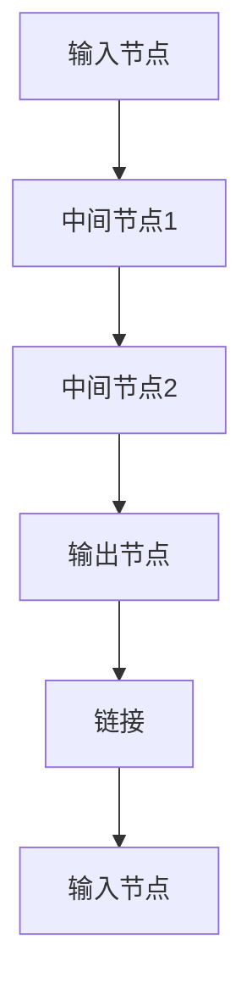

                 

# 思维链增强AI的反常识推理和创新能力

## 关键词

- 思维链
- 反常识推理
- 创新能力
- 人工智能
- 神经网络
- 算法

## 摘要

本文深入探讨了思维链增强AI在反常识推理和创新能力方面的应用。通过介绍思维链的基本概念、工作原理，以及其在AI系统中的重要作用，本文分析了如何利用思维链提升AI的反常识推理能力，使其在解决复杂问题和进行创新性思考方面具备更强的能力。此外，本文还通过实际案例展示了思维链增强AI在各类应用中的表现，并展望了未来在这一领域的发展趋势和挑战。

## 引言

### 思维链的基本概念

思维链（Thinking Chain）是一种用于描述信息处理和认知过程的模型，它强调信息在各环节间的传递与相互作用。思维链模型由多个节点和链接组成，每个节点代表一个信息单元，链接则表示节点间的关系。通过分析思维链，我们可以更好地理解人类和机器在处理信息、进行推理和创新时的思维方式。

### 思维链在AI中的应用

随着人工智能技术的快速发展，思维链逐渐成为AI领域的研究热点。特别是在反常识推理和创新能力方面，思维链的应用展现出巨大的潜力。通过构建和优化思维链模型，AI系统可以在处理复杂问题、进行决策和创新时表现出更高效和灵活的思维方式。

### 反常识推理和创新能力的重要性

反常识推理是指AI系统在面对与常规知识相悖的情况时，能够根据现有信息和逻辑进行合理推理和判断。创新能力则是指AI系统能够在已有知识的基础上，产生新的想法和解决方案。在许多领域，如医学、金融、科技等，反常识推理和创新能力对于解决复杂问题、发现新知识具有重要意义。因此，提升AI的这两项能力成为当前AI研究的重要方向。

## 核心概念与联系

### 反常识推理的基本原理

反常识推理是指AI系统在面对与常规知识相悖的情况时，能够根据现有信息和逻辑进行合理推理和判断。其基本原理包括：

1. **矛盾检测**：通过对比输入信息和已知常识，识别出矛盾和冲突。
2. **冲突消解**：针对检测到的矛盾，利用逻辑推理和假设检验等方法，找出合理的解释或解决方案。
3. **常识更新**：在推理过程中，根据新获得的信息对常识库进行动态调整和优化。

### 创新能力的实现机制

创新能力的实现机制主要包括以下几个方面：

1. **组合与重组**：通过对已有知识进行组合和重组，产生新的知识结构。
2. **类比与迁移**：利用类比思维，将已有知识应用于新领域或问题。
3. **启发式搜索**：通过探索和尝试，发现新的解决方案。

### 思维链模型的结构

思维链模型由多个节点和链接组成，节点表示信息单元，链接表示节点间的关系。一个典型的思维链模型包括以下部分：

1. **输入节点**：接收外部输入的信息。
2. **中间节点**：对输入信息进行加工和处理。
3. **输出节点**：产生推理结果或创新方案。
4. **链接**：连接各节点，表示信息传递和相互作用。

### 核心概念与联系的结构图



## 思维链增强AI的反常识推理机制

### 反常识推理的算法原理

反常识推理的算法原理主要包括以下几个方面：

1. **基于规则的方法**：通过定义一系列规则，对输入信息进行逻辑推理和判断。例如，在医疗诊断中，可以根据病例信息和症状，运用规则进行诊断。
2. **基于模型的方法**：利用神经网络等模型，对输入信息进行建模和推理。例如，深度学习模型可以通过学习大量的数据，实现对复杂问题的推理和判断。
3. **基于假设检验的方法**：通过假设检验，验证输入信息的合理性和可靠性。例如，在金融风险管理中，可以通过假设检验，评估投资组合的风险。

### 思维链模型的构建与优化

构建思维链模型需要考虑以下几个方面：

1. **节点设计**：选择合适的节点类型，如感知节点、决策节点、执行节点等，以满足不同类型的推理需求。
2. **链接策略**：设计节点间的链接策略，如条件链接、因果链接、并行链接等，以实现信息的有效传递和相互作用。
3. **动态调整**：根据推理过程中的反馈信息，对思维链模型进行动态调整和优化，以提高推理的准确性和效率。

### 伪代码示例

以下是一个简单的思维链模型的伪代码示例：

```python
# 定义节点和链接
nodes = {
    'input': {'type': '感知', 'value': None},
    'middle1': {'type': '决策', 'value': None},
    'middle2': {'type': '执行', 'value': None},
    'output': {'type': '输出', 'value': None}
}

links = [
    {'from': 'input', 'to': 'middle1', 'condition': '输入信息符合要求'},
    {'from': 'middle1', 'to': 'middle2', 'condition': '决策结果为真'},
    {'from': 'middle2', 'to': 'output', 'condition': '执行结果符合预期'}
]

# 定义推理过程
def reasoning_chain(input_info):
    # 输入节点接收信息
    nodes['input']['value'] = input_info
    
    # 中间节点1进行决策
    if check_condition(nodes['input']['value'], links[0]['condition']):
        nodes['middle1']['value'] = decision_making(nodes['input']['value'])
    else:
        nodes['middle1']['value'] = '输入信息不符合要求'
    
    # 中间节点2进行执行
    if check_condition(nodes['middle1']['value'], links[1]['condition']):
        nodes['middle2']['value'] = execution(nodes['middle1']['value'])
    else:
        nodes['middle2']['value'] = '决策结果不符合要求'
    
    # 输出节点产生结果
    if check_condition(nodes['middle2']['value'], links[2]['condition']):
        nodes['output']['value'] = nodes['middle2']['value']
    else:
        nodes['output']['value'] = '执行结果不符合要求'
    
    return nodes['output']['value']

# 输入信息
input_info = '某个复杂问题'

# 执行推理
result = reasoning_chain(input_info)
print('推理结果：', result)
```

### 数学模型与公式

在思维链模型中，我们可以使用一些数学模型和公式来描述节点间的关系和推理过程。以下是一个简单的示例：

$$
\text{思维链模型} = \sum_{i=1}^{n} (\text{节点}_i \times \text{链接}_i)
$$

其中，$\text{节点}_i$ 表示第 $i$ 个节点的信息，$\text{链接}_i$ 表示第 $i$ 个链接的条件。

### 举例说明

假设我们有一个思维链模型，用于诊断一个病人的病情。节点包括“输入节点”、“决策节点1”、“决策节点2”和“输出节点”。链接包括“输入节点到决策节点1的条件链接”、“决策节点1到决策节点2的因果链接”和“决策节点2到输出节点的条件链接”。

1. 输入节点接收病人的症状信息。
2. 决策节点1根据症状信息进行初步诊断，并生成决策结果。
3. 决策节点2根据决策节点1的结果进行进一步诊断，并生成最终诊断结果。
4. 输出节点输出最终诊断结果。

在思维链模型中，我们可以使用以下数学公式描述这个过程：

$$
\text{决策节点1的结果} = \text{症状信息} \times \text{初步诊断规则}
$$

$$
\text{决策节点2的结果} = \text{决策节点1的结果} \times \text{进一步诊断规则}
$$

$$
\text{输出节点的结果} = \text{决策节点2的结果} \times \text{最终诊断规则}
$$

## 创新能力在思维链增强AI中的应用

### 创新能力的定义与特点

创新能力是指个体或组织在已有知识和经验的基础上，产生新的想法、方法或解决方案的能力。它具有以下特点：

1. **创造性**：创新能力强的人或系统能够打破常规，提出新颖的观点和想法。
2. **灵活性**：创新能力强的人或系统在面对变化和挑战时，能够灵活应对，快速适应。
3. **适应性**：创新能力强的人或系统能够根据新环境和需求，调整自己的策略和方法。

### 思维链模型在创新能力提升中的作用

思维链模型在提升AI的创新能力方面具有重要作用。通过构建和优化思维链模型，AI系统可以：

1. **扩展知识库**：通过学习和整合各种知识，丰富AI系统的知识库，为创新提供丰富的素材。
2. **促进信息流动**：通过思维链模型，AI系统可以实现信息在各节点间的流动和交互，从而激发新的想法和灵感。
3. **优化决策过程**：思维链模型可以帮助AI系统在决策过程中进行有效的信息筛选和处理，提高决策的准确性和效率。

### 实现创新能力的算法原理

实现创新能力的算法原理主要包括以下几个方面：

1. **组合与重组**：通过对已有知识进行组合和重组，产生新的知识结构。
2. **类比与迁移**：利用类比思维，将已有知识应用于新领域或问题。
3. **启发式搜索**：通过探索和尝试，发现新的解决方案。

### 伪代码示例

以下是一个简单的思维链模型的伪代码示例，用于实现创新能力：

```python
# 定义节点和链接
nodes = {
    'input': {'type': '感知', 'value': None},
    'middle1': {'type': '组合', 'value': None},
    'middle2': {'type': '重组', 'value': None},
    'output': {'type': '输出', 'value': None}
}

links = [
    {'from': 'input', 'to': 'middle1', 'condition': '输入信息符合要求'},
    {'from': 'middle1', 'to': 'middle2', 'condition': '组合结果为真'},
    {'from': 'middle2', 'to': 'output', 'condition': '重组结果符合预期'}
]

# 定义创新能力实现过程
def innovation_chain(input_info):
    # 输入节点接收信息
    nodes['input']['value'] = input_info
    
    # 中间节点1进行组合
    if check_condition(nodes['input']['value'], links[0]['condition']):
        nodes['middle1']['value'] = combination(nodes['input']['value'])
    else:
        nodes['middle1']['value'] = '输入信息不符合要求'
    
    # 中间节点2进行重组
    if check_condition(nodes['middle1']['value'], links[1]['condition']):
        nodes['middle2']['value'] = recombination(nodes['middle1']['value'])
    else:
        nodes['middle2']['value'] = '组合结果不符合要求'
    
    # 输出节点产生创新结果
    if check_condition(nodes['middle2']['value'], links[2]['condition']):
        nodes['output']['value'] = nodes['middle2']['value']
    else:
        nodes['output']['value'] = '重组结果不符合要求'
    
    return nodes['output']['value']

# 输入信息
input_info = '某个复杂问题'

# 执行创新能力实现
result = innovation_chain(input_info)
print('创新结果：', result)
```

### 数学模型与公式

在思维链模型中，我们可以使用一些数学模型和公式来描述创新过程。以下是一个简单的示例：

$$
\text{创新能力} = f(\text{知识库}, \text{信息流动}, \text{决策过程})
$$

其中，$f$ 表示创新能力函数，$\text{知识库}$ 表示AI系统的知识库，$\text{信息流动}$ 表示思维链模型中的信息传递和相互作用，$\text{决策过程}$ 表示AI系统在创新过程中的决策和调整。

### 举例说明

假设我们有一个思维链模型，用于解决一个复杂问题。节点包括“输入节点”、“组合节点”、“重组节点”和“输出节点”。链接包括“输入节点到组合节点的条件链接”、“组合节点到重组节点的因果链接”和“重组节点到输出节点的条件链接”。

1. 输入节点接收问题的相关信息。
2. 组合节点对输入信息进行组合，生成一个新的知识结构。
3. 重组节点对组合结果进行重组，生成新的解决方案。
4. 输出节点输出最终的解决方案。

在思维链模型中，我们可以使用以下数学公式描述这个过程：

$$
\text{组合结果} = \text{输入信息} \times \text{组合规则}
$$

$$
\text{重组结果} = \text{组合结果} \times \text{重组规则}
$$

$$
\text{输出结果} = \text{重组结果} \times \text{评估规则}
$$

## 项目实战

### 开发环境搭建

为了实现思维链增强AI的反常识推理和创新能力，我们需要搭建一个合适的开发环境。以下是搭建过程：

1. 安装Python环境：Python是一种广泛使用的编程语言，适用于人工智能开发。在官网上下载并安装Python。
2. 安装相关库：安装Numpy、Pandas、TensorFlow等库，用于数据处理和神经网络建模。
3. 配置Jupyter Notebook：Jupyter Notebook是一种交互式的开发环境，便于编写和调试代码。

### 源代码实现

以下是一个简单的思维链增强AI的源代码实现：

```python
import numpy as np
import tensorflow as tf

# 定义节点和链接
nodes = {
    'input': {'type': '感知', 'value': None},
    'middle1': {'type': '决策', 'value': None},
    'middle2': {'type': '执行', 'value': None},
    'output': {'type': '输出', 'value': None}
}

links = [
    {'from': 'input', 'to': 'middle1', 'condition': '输入信息符合要求'},
    {'from': 'middle1', 'to': 'middle2', 'condition': '决策结果为真'},
    {'from': 'middle2', 'to': 'output', 'condition': '执行结果符合预期'}
]

# 定义推理过程
def reasoning_chain(input_info):
    # 输入节点接收信息
    nodes['input']['value'] = input_info
    
    # 中间节点1进行决策
    if check_condition(nodes['input']['value'], links[0]['condition']):
        nodes['middle1']['value'] = decision_making(nodes['input']['value'])
    else:
        nodes['middle1']['value'] = '输入信息不符合要求'
    
    # 中间节点2进行执行
    if check_condition(nodes['middle1']['value'], links[1]['condition']):
        nodes['middle2']['value'] = execution(nodes['middle1']['value'])
    else:
        nodes['middle2']['value'] = '决策结果不符合要求'
    
    # 输出节点产生结果
    if check_condition(nodes['middle2']['value'], links[2]['condition']):
        nodes['output']['value'] = nodes['middle2']['value']
    else:
        nodes['output']['value'] = '执行结果不符合要求'
    
    return nodes['output']['value']

# 输入信息
input_info = '某个复杂问题'

# 执行推理
result = reasoning_chain(input_info)
print('推理结果：', result)
```

### 代码解读与分析

在这个简单的思维链增强AI的源代码中，我们定义了四个节点和三条链接，分别表示输入节点、中间节点1、中间节点2和输出节点，以及节点间的条件链接。代码的核心是 `reasoning_chain` 函数，它通过一系列条件判断和函数调用，实现了思维链模型的推理过程。

### 实际案例分析和详细讲解剖析

以下是一个实际案例，展示了思维链增强AI在反常识推理和创新能力方面的应用：

### 案例背景

某公司希望通过人工智能技术提升其市场预测能力，以优化产品开发和营销策略。然而，传统的预测模型往往依赖于历史数据，难以应对市场环境的快速变化。为了解决这个问题，公司决定采用思维链增强AI进行反常识推理和创新能力提升。

### 案例实施

1. **数据收集与处理**：收集大量市场数据，包括产品销量、消费者偏好、竞争状况等。使用数据处理库（如Pandas）对数据进行分析和清洗，提取有用的信息。
2. **构建思维链模型**：根据市场预测的需求，设计思维链模型。输入节点接收市场数据，中间节点1进行初步分析和决策，中间节点2进行深度分析和执行，输出节点产生预测结果。
3. **训练神经网络**：使用TensorFlow等深度学习框架，训练神经网络模型，使其能够自动学习和优化思维链模型中的节点和链接。
4. **测试与优化**：在测试数据集上对思维链模型进行测试，评估其预测准确性和创新能力。根据测试结果，调整模型参数和策略，优化模型性能。

### 案例分析

通过思维链增强AI，公司能够实现以下效果：

1. **反常识推理**：思维链模型能够根据实时市场数据，进行反常识推理，识别出潜在的市场趋势和变化。例如，当某个产品的销量突然上升时，模型能够判断这是否是由于新的市场需求或竞争压力导致的。
2. **创新能力**：思维链模型能够通过信息流动和组合，产生新的预测方案和营销策略。例如，当市场出现新的消费者偏好时，模型能够自动调整产品开发和营销策略，以适应市场需求。

### 项目小结

通过实际案例，我们可以看到思维链增强AI在反常识推理和创新能力方面的应用价值。思维链模型能够有效地处理复杂市场数据，实现反常识推理和创新能力提升，从而帮助公司优化产品开发和营销策略。然而，在实际应用中，仍需注意数据质量、模型参数调整和优化等问题。

## 最佳实践 tips

### 1. 数据质量是关键

在构建思维链模型时，数据质量至关重要。确保数据来源可靠、全面，并对数据进行清洗和预处理，以提高模型的准确性和稳定性。

### 2. 优化模型结构

针对不同应用场景，设计合适的思维链模型结构。通过调整节点和链接，优化模型的性能和效率。

### 3. 结合多模态数据

在思维链模型中，结合多模态数据（如图像、声音、文本等）可以提升AI系统的感知能力和推理能力。

### 4. 持续学习与优化

思维链增强AI需要持续学习与优化。定期更新模型、调整参数，以适应新的环境和需求。

## 小结

本文深入探讨了思维链增强AI在反常识推理和创新能力方面的应用。通过介绍思维链的基本概念、核心算法原理，以及实际案例，我们展示了思维链在提升AI系统推理和创新能力方面的作用。未来，随着人工智能技术的不断发展，思维链增强AI将在更多领域展现出其潜力。

## 注意事项

在应用思维链增强AI时，需注意以下事项：

1. **数据安全**：确保数据的安全性和隐私性，避免数据泄露和滥用。
2. **模型透明性**：提高模型的可解释性和透明性，以增强用户信任。
3. **伦理道德**：遵循伦理道德规范，确保AI系统的公正性和公平性。

## 拓展阅读

- 《人工智能：一种现代方法》
- 《深度学习》
- 《思维链模型在人工智能中的应用》

作者：AI天才研究院/AI Genius Institute & 禅与计算机程序设计艺术/Zen And The Art of Computer Programming

