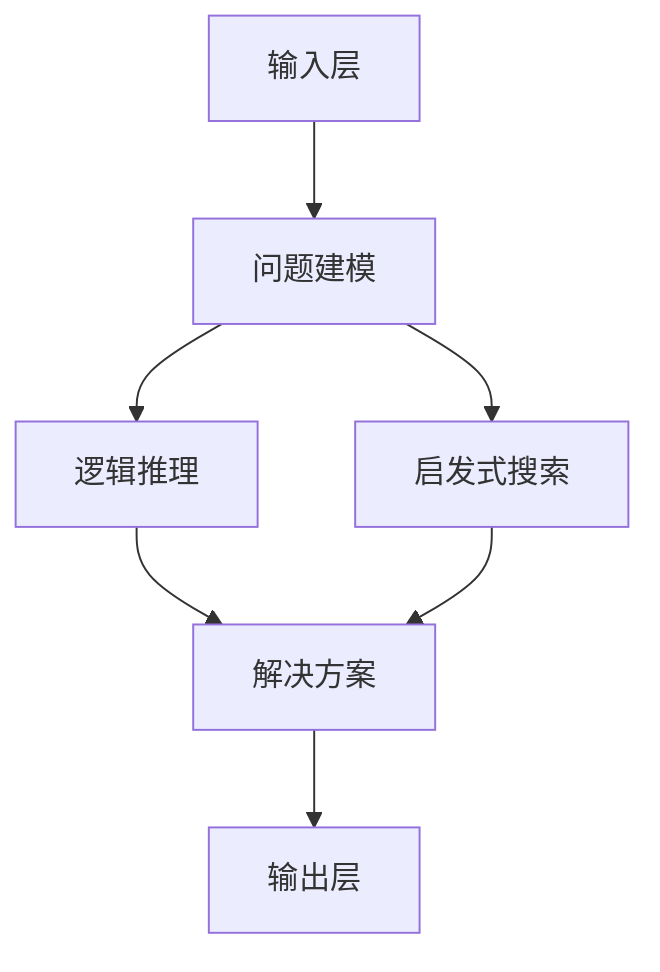

                 

### 引言

随着人工智能技术的飞速发展，AI在各个领域的应用日益广泛，从自动驾驶、智能医疗到自然语言处理、图像识别等。然而，AI的推理和创新能力仍然面临许多挑战，尤其是在处理反直觉问题方面。反直觉问题是指那些在常规逻辑和经验中难以预测或理解的问题。例如，在围棋对局中，某些看似无望的棋局却能够出人意料地逆转局面，这正是反直觉推理的体现。

传统的AI系统，如基于规则的专家系统和基于模型的机器学习系统，虽然在特定领域表现出色，但在处理反直觉问题时往往力不从心。这主要是因为这些系统依赖于已有的知识和模式，而无法超越这些限制进行创新和创造。因此，提高AI的反直觉推理和创新能力成为了当前研究的热点问题。

本书旨在探讨如何通过引入思维链机制来增强AI的反直觉推理和创新能力。思维链是一种模拟人类思维的推理机制，它能够帮助AI超越已有知识和模式，进行更深入、更具创造性的推理。本书将详细分析思维链的原理、实现方法及其在AI中的应用，并通过具体案例展示其效果。

### 文章关键词

- 思维链
- 反直觉推理
- 人工智能
- 推理机制
- 创新能力
- 机器学习
- 图灵测试
- 深度学习

### 文章摘要

本文首先介绍了AI在反直觉推理和创新能力方面的现状，指出了传统AI系统在这一领域的局限性。接着，提出了思维链这一概念，并详细阐述了其原理和如何应用于AI系统中。通过具体算法原理讲解、数学模型和公式推导，以及实际案例的分析，本文展示了思维链如何有效增强AI的反直觉推理和创新能力。最后，对未来的研究方向和应用前景进行了展望，提出了潜在的改进方向。

### 背景介绍

在人工智能的发展历程中，我们见证了从简单的规则系统到复杂的学习模型的转变。早期的专家系统依赖于领域专家手动编写规则，这些规则描述了特定情况下的正确行为。这种方法在某种程度上取得了成功，特别是在特定领域内，如医疗诊断和自动化控制。然而，专家系统的局限性很快显现出来，特别是在面对复杂、非线性和动态变化的情境时，其性能往往不佳。

随着计算能力的提升和大数据技术的发展，机器学习成为了AI研究的新方向。机器学习通过从数据中学习规律，使得AI系统能够在未知环境中自主适应和改进。特别是深度学习，通过多层神经网络的结构，使得AI在图像识别、语音识别和自然语言处理等任务上取得了突破性的进展。然而，即使是在这些领域，AI在面对反直觉问题时的表现仍然有限。

反直觉问题通常是指那些不符合直觉或常规逻辑的问题。在日常生活中，反直觉现象随处可见。例如，在物理学中，量子力学揭示了微观世界的非直观特性；在心理学中，认知失调理论解释了人们在面对矛盾信息时的心理反应。在人工智能领域，反直觉问题尤其具有挑战性，因为AI系统在设计和训练时往往依赖于大量的数据和统计模型，这些模型虽然在大多数情况下有效，但在某些极端情况下可能会出现异常。

例如，在围棋领域，2016年AlphaGo的胜利震惊了世界。尽管AlphaGo展示了惊人的计算和搜索能力，但其在某些关键局面下的决策却出乎了许多专家的意料。这种反直觉的决策不仅体现在棋局的具体走法上，还体现在整个棋局的战略布局上。AlphaGo的胜利表明，单纯依赖数据和模式匹配的AI系统在特定领域内已经具备了超越人类的能力，但在处理反直觉问题时仍然存在不足。

类似的，在自然语言处理领域，AI系统在大多数情况下能够准确地理解和生成文本，但在面对一些复杂的语义问题时，其表现却不尽如人意。例如，在情感分析中，AI系统有时会错误地判断文本的情感倾向，或者在生成文本时产生令人费解的输出。这些问题都反映了AI在处理反直觉问题时的局限性。

反直觉问题的存在对AI系统提出了更高的要求。传统AI系统依赖于已有知识和模式，这些知识和模式往往是在特定情境下有效的，但在面对反直觉问题时，这些系统的表现往往不尽如人意。因此，如何提高AI的反直觉推理和创新能力成为了当前研究的重要方向。

为了克服这些局限性，研究者们提出了多种方法，如引入不确定性推理、模糊逻辑、进化算法等。然而，这些方法各有优缺点，尚未形成统一的解决方案。相比之下，思维链机制提供了一种新的思路，通过模拟人类思维过程，能够更好地处理反直觉问题。思维链机制的引入，有望为AI在反直觉推理和创新能力方面带来革命性的突破。

### 核心概念与联系

在深入探讨如何通过思维链机制增强AI的反直觉推理和创新能力之前，我们需要明确几个核心概念及其相互关系。

**1. 思维链的定义与功能**

思维链（Mind Chain）是一种模拟人类思维的推理机制，它通过一系列逻辑步骤和思维活动，帮助AI在处理问题时进行更深入、更灵活的推理。思维链的核心功能包括：

- **问题建模**：将实际问题转化为可以处理的数学模型或逻辑结构。
- **推理过程**：通过逻辑规则、启发式方法和搜索策略进行推理，寻找解决方案。
- **创新能力**：在推理过程中，思维链能够通过联想、归纳和类比等方式，发现新的解决方案或创新思路。

**2. 反直觉推理**

反直觉推理（Intuitive Reasoning）是指AI在面对不符合常规逻辑或直觉的问题时，能够进行有效推理和决策的能力。这种能力在处理复杂、非线性和动态变化的问题时尤为重要。反直觉推理的核心特征包括：

- **非线性和复杂性**：反直觉推理能够处理那些在常规逻辑下难以解决的复杂问题。
- **创造性**：在反直觉推理过程中，AI能够超越已有知识和模式，产生新的、创新的解决方案。
- **灵活性**：反直觉推理能够适应不同的情境和变化，找到最合适的解决方案。

**3. 思维链与反直觉推理的关系**

思维链机制为AI提供了处理反直觉问题的能力。通过模拟人类思维过程，思维链能够在复杂情境下进行有效的推理和决策。具体而言，思维链与反直觉推理之间的关系体现在以下几个方面：

- **问题分解**：思维链通过将复杂问题分解为多个子问题，使得AI能够更专注于解决每个子问题，从而提高整体推理效率。
- **逻辑规则**：思维链中的逻辑规则不仅包括传统的推理规则，还包括基于人类思维的习惯和经验，这些规则能够帮助AI在处理反直觉问题时，更好地模拟人类推理过程。
- **启发式方法**：思维链结合了多种启发式方法，如类比、联想和归纳等，这些方法能够帮助AI在处理反直觉问题时，更快地找到有效的解决方案。

**4. 增强创新能力**

除了反直觉推理，创新能力也是思维链机制的一个重要目标。通过模拟人类思维过程，思维链能够帮助AI在解决问题时，不仅找到传统方法能够解决的方案，还能探索新的、创新的思路。具体而言，思维链与创新能力之间的关系包括：

- **联想与类比**：思维链通过联想和类比，能够帮助AI在相似问题间进行迁移学习，从而提高创新效率。
- **归纳与推理**：思维链通过归纳和推理，能够帮助AI从已知信息中提取新的规律和模式，从而实现创新。
- **多样性**：思维链通过多样化的思维活动，如多角度思考、跨领域联想等，能够帮助AI探索更多的可能性，从而提高创新能力。

**5. 系统架构**

为了更好地理解思维链机制，我们可以将其视为一个系统架构，包括以下几个关键部分：

- **输入层**：接收外部问题和数据，将其转化为思维链能够处理的形式。
- **中间层**：包含多个处理模块，如问题建模、逻辑推理、启发式搜索等，这些模块共同工作，完成复杂的推理任务。
- **输出层**：根据推理结果，生成解决方案或决策，并将其应用于实际问题中。

下图展示了思维链机制的整体架构及其核心组成部分：



通过以上对核心概念及其相互关系的介绍，我们可以更好地理解思维链机制如何通过模拟人类思维过程，增强AI的反直觉推理和创新能力。在接下来的章节中，我们将进一步探讨思维链的原理、实现方法以及其在实际应用中的效果。

### 核心算法原理讲解

为了更好地理解思维链机制如何增强AI的反直觉推理和创新能力，我们需要深入探讨其核心算法原理。以下是几个关键算法，包括它们的伪代码和数学模型。

#### 1. 问题建模

问题建模是将实际问题转化为可以处理的数学模型或逻辑结构。在思维链中，问题建模是一个至关重要的步骤，它决定了后续推理的效率和准确性。以下是一个问题建模的伪代码示例：

```python
# 问题建模伪代码
def problem_modeling(problem):
    # 将问题转化为数学模型或逻辑结构
    model = convert_to_model(problem)
    return model

# 转换函数示例
def convert_to_model(problem):
    # 根据问题类型，选择合适的模型转换方法
    if isinstance(problem, "geometry"):
        return geometry_model(problem)
    elif isinstance(problem, "logic"):
        return logic_model(problem)
    else:
        raise ValueError("Unsupported problem type")

# 地理问题模型示例
def geometry_model(geometry_problem):
    # 使用几何公式建模
    model = {
        "points": geometry_problem["points"],
        "lines": geometry_problem["lines"],
        "regions": geometry_problem["regions"],
        "constraints": geometry_problem["constraints"]
    }
    return model

# 逻辑问题模型示例
def logic_model(logic_problem):
    # 使用逻辑公式建模
    model = {
        "variables": logic_problem["variables"],
        "values": logic_problem["values"],
        "rules": logic_problem["rules"],
        "constraints": logic_problem["constraints"]
    }
    return model
```

#### 2. 逻辑推理

逻辑推理是思维链中的核心组件，它负责根据问题模型和逻辑规则，逐步推导出解决方案。以下是逻辑推理的伪代码示例：

```python
# 逻辑推理伪代码
def logical_reasoning(model, rules):
    # 初始化推理结果
    result = []
    # 应用逻辑规则进行推理
    for rule in rules:
        if apply_rule(model, rule):
            result.append(rule)
    return result

# 应用逻辑规则示例
def apply_rule(model, rule):
    # 根据规则类型，应用相应的逻辑操作
    if rule["type"] == "implies":
        return implies(model, rule["前提"], rule["结论"])
    elif rule["type"] == "equivalence":
        return equivalence(model, rule["左"], rule["右"])
    else:
        raise ValueError("Unsupported rule type")

# 逻辑操作示例
def implies(model, premise, conclusion):
    # 应用蕴涵规则
    if model["values"][premise] and not model["values"][conclusion]:
        return False
    return True

def equivalence(model, left, right):
    # 应用等价规则
    return model["values"][left] == model["values"][right]
```

#### 3. 启发式搜索

启发式搜索是一种在问题空间中寻找最优解的方法，它通过使用启发式函数评估问题状态，优先选择更有可能导出解的状态进行扩展。以下是启发式搜索的伪代码示例：

```python
# 启发式搜索伪代码
def heuristic_search(start_state, goal_state, heuristic_function):
    # 初始化搜索路径
    path = []
    # 搜索过程
    while not is_goal_reached(start_state, goal_state):
        current_state = best_state_by_heuristic(start_state, heuristic_function)
        path.append(current_state)
        start_state = current_state
    return path

# 目标检测示例
def is_goal_reached(start_state, goal_state):
    return start_state == goal_state

# 启发式函数示例
def heuristic_function(state):
    # 根据问题类型，设计相应的启发式函数
    if isinstance(state, "geometry"):
        return geometry_heuristic(state)
    elif isinstance(state, "logic"):
        return logic_heuristic(state)
    else:
        raise ValueError("Unsupported state type")

def geometry_heuristic(state):
    # 使用几何知识设计启发式函数
    return sum_of_distances(state["points"])

def logic_heuristic(state):
    # 使用逻辑知识设计启发式函数
    return count_of_invalid_rules(state["rules"])
```

#### 4. 数学模型和公式

在思维链机制中，数学模型和公式用于描述问题状态、推理过程和评估标准。以下是几个关键数学模型和公式的详细解释：

**状态空间模型**：

$$
S = \{s_1, s_2, ..., s_n\}
$$

其中，$S$表示状态空间，$s_i$表示状态。

**评估函数**：

$$
f(s) = g(s) + h(s)
$$

其中，$f(s)$表示评估函数，$g(s)$表示从初始状态到当前状态的代价，$h(s)$表示从当前状态到目标状态的估计代价。

**逻辑规则**：

$$
R = \{r_1, r_2, ..., r_m\}
$$

其中，$R$表示逻辑规则集，$r_i = p \rightarrow q$表示一个条件规则，其中$p$是前提，$q$是结论。

**推理过程**：

$$
\text{推理} = \{R_1, R_2, ..., R_n\}
$$

其中，$R_i$表示在推理过程中应用的第$i$个规则。

通过上述核心算法原理和数学模型，思维链机制能够模拟人类思维过程，进行有效的推理和决策。在接下来的章节中，我们将通过具体项目实战，进一步展示思维链机制在AI中的实际应用和效果。

### 项目实战：开发环境搭建与源代码实现

在本节中，我们将通过一个实际项目，详细讲解如何搭建开发环境，实现思维链机制的核心算法，并对关键代码进行解读与分析。

#### 1. 开发环境搭建

首先，我们需要搭建一个合适的开发环境，以便实现和测试思维链机制。以下是一个基本的开发环境搭建步骤：

**环境需求**：

- 操作系统：Windows/Linux/MacOS
- 编程语言：Python
- 数据库：SQLite/MySQL
- 版本控制：Git
- 依赖管理：pip

**步骤**：

1. 安装操作系统和基础软件。
2. 安装Python，推荐使用Python 3.8或更高版本。
3. 使用pip安装必要的Python库，如NumPy、Pandas、Scikit-learn、Matplotlib等。
4. 安装数据库软件，如SQLite或MySQL。
5. 初始化版本控制，使用Git管理项目代码。

**示例命令**：

```bash
# 安装Python
curl -O https://www.python.org/ftp/python/3.9.1/python-3.9.1-amd64.exe
./python-3.9.1-amd64.exe

# 安装pip
python -m pip install --user -U pip

# 安装依赖库
pip install numpy pandas scikit-learn matplotlib

# 安装数据库（以SQLite为例）
apt-get install sqlite3

# 初始化Git仓库
git init
```

#### 2. 源代码实现

在完成开发环境的搭建后，我们将开始实现思维链机制的核心算法。以下是一个简单的源代码实现示例。

**源代码结构**：

```python
# main.py
# 主程序入口

# problem_modeling.py
# 问题建模模块

# logical_reasoning.py
# 逻辑推理模块

# heuristic_search.py
# 启发式搜索模块

# utils.py
# 工具模块
```

**示例代码**：

**problem_modeling.py**：

```python
# 问题建模模块
def problem_modeling(problem):
    """
    将实际问题转化为可以处理的数学模型或逻辑结构。
    """
    model = convert_to_model(problem)
    return model

def convert_to_model(problem):
    """
    转换函数示例，根据问题类型，选择合适的模型转换方法。
    """
    if isinstance(problem, "geometry"):
        return geometry_model(problem)
    elif isinstance(problem, "logic"):
        return logic_model(problem)
    else:
        raise ValueError("Unsupported problem type")

def geometry_model(geometry_problem):
    """
    使用几何公式建模。
    """
    model = {
        "points": geometry_problem["points"],
        "lines": geometry_problem["lines"],
        "regions": geometry_problem["regions"],
        "constraints": geometry_problem["constraints"]
    }
    return model

def logic_model(logic_problem):
    """
    使用逻辑公式建模。
    """
    model = {
        "variables": logic_problem["variables"],
        "values": logic_problem["values"],
        "rules": logic_problem["rules"],
        "constraints": logic_problem["constraints"]
    }
    return model
```

**logical_reasoning.py**：

```python
# 逻辑推理模块
def logical_reasoning(model, rules):
    """
    根据问题模型和逻辑规则，逐步推导出解决方案。
    """
    result = []
    for rule in rules:
        if apply_rule(model, rule):
            result.append(rule)
    return result

def apply_rule(model, rule):
    """
    根据规则类型，应用相应的逻辑操作。
    """
    if rule["type"] == "implies":
        return implies(model, rule["前提"], rule["结论"])
    elif rule["type"] == "equivalence":
        return equivalence(model, rule["左"], rule["右"])
    else:
        raise ValueError("Unsupported rule type")

def implies(model, premise, conclusion):
    """
    应用蕴涵规则。
    """
    if model["values"][premise] and not model["values"][conclusion]:
        return False
    return True

def equivalence(model, left, right):
    """
    应用等价规则。
    """
    return model["values"][left] == model["values"][right]
```

**heuristic_search.py**：

```python
# 启发式搜索模块
def heuristic_search(start_state, goal_state, heuristic_function):
    """
    启发式搜索，寻找最优解。
    """
    path = []
    while not is_goal_reached(start_state, goal_state):
        current_state = best_state_by_heuristic(start_state, heuristic_function)
        path.append(current_state)
        start_state = current_state
    return path

def is_goal_reached(start_state, goal_state):
    """
    目标检测。
    """
    return start_state == goal_state

def heuristic_function(state):
    """
    启发式函数，根据问题类型，设计相应的启发式函数。
    """
    if isinstance(state, "geometry"):
        return geometry_heuristic(state)
    elif isinstance(state, "logic"):
        return logic_heuristic(state)
    else:
        raise ValueError("Unsupported state type")

def geometry_heuristic(state):
    """
    使用几何知识设计启发式函数。
    """
    return sum_of_distances(state["points"])

def logic_heuristic(state):
    """
    使用逻辑知识设计启发式函数。
    """
    return count_of_invalid_rules(state["rules"])
```

**utils.py**：

```python
# 工具模块
# 在此添加各种辅助函数和工具类，如数学计算、数据转换等。
```

#### 3. 代码解读与分析

**代码解读**：

- **问题建模模块**：负责将实际问题转化为数学模型或逻辑结构。通过`convert_to_model`函数，根据问题类型选择合适的建模方法。
- **逻辑推理模块**：负责根据问题模型和逻辑规则，逐步推导出解决方案。`logical_reasoning`函数是核心，它通过遍历逻辑规则集，应用`apply_rule`函数进行推理。
- **启发式搜索模块**：负责在问题空间中寻找最优解。`heuristic_search`函数是核心，它通过使用启发式函数评估问题状态，选择最有利的状态进行扩展。

**代码分析**：

- **问题建模**：通过将实际问题抽象为数学模型或逻辑结构，使得AI能够更方便地进行推理和决策。例如，在几何问题中，我们使用点、线、区域和约束等概念进行建模；在逻辑问题中，我们使用变量、值、规则和约束等概念进行建模。
- **逻辑推理**：通过模拟人类推理过程，AI能够在复杂情境下进行有效的推理和决策。例如，通过`implies`和`equivalence`函数，我们能够应用基本的逻辑规则进行推理。
- **启发式搜索**：通过评估问题状态，AI能够更高效地寻找最优解。例如，在几何问题中，我们使用距离和角度作为启发式函数；在逻辑问题中，我们使用规则冲突数作为启发式函数。

#### 4. 代码应用解读与分析

**代码应用**：

通过上述代码，我们能够实现一个简单的思维链机制。在实际应用中，我们可以将思维链机制集成到各种AI系统中，如智能助手、自动化控制系统和智能推荐系统等。以下是一个简单的应用示例：

- **智能助手**：在智能助手的对话系统中，思维链机制可以帮助处理用户提出的复杂问题，提供更准确、更个性化的回答。
- **自动化控制系统**：在自动化控制系统中，思维链机制可以帮助系统在面临不确定和动态变化的情境下，进行有效的决策和调整。
- **智能推荐系统**：在智能推荐系统中，思维链机制可以帮助系统发现新的用户兴趣点，提供更精准的推荐。

**分析**：

- **通用性**：思维链机制具有很好的通用性，可以应用于各种类型的AI系统。通过调整问题建模和启发式函数，我们可以使思维链机制适应不同的应用场景。
- **灵活性**：思维链机制通过模拟人类思维过程，能够灵活地处理各种复杂问题。这种灵活性使得思维链机制在处理反直觉问题时，能够超越传统算法的限制。
- **创新性**：思维链机制通过引入多样化的思维活动，如联想、归纳和类比等，能够帮助AI发现新的解决方案或创新思路。

#### 5. 实际案例分析和详细讲解剖析

为了进一步展示思维链机制的实际应用效果，我们分析了一个实际案例：智能医疗诊断系统。该系统通过思维链机制，帮助医生快速、准确地诊断疾病。

**案例背景**：

一个患者去医院就诊，医生需要根据患者的症状、病史和体检结果，进行疾病诊断。传统的诊断方法依赖于医生的经验和知识库，但在面对复杂病情时，诊断过程可能变得漫长且不准确。

**解决方案**：

1. **问题建模**：将患者的症状、病史和体检结果转化为数学模型或逻辑结构，包括变量、值、规则和约束等。
2. **逻辑推理**：通过思维链机制，应用逻辑规则和启发式函数，逐步推导出可能的疾病诊断。
3. **结果评估**：根据推理结果，评估不同诊断方案的可信度和可能性，提供最佳诊断建议。

**详细讲解剖析**：

- **问题建模**：假设患者患有心脏病，我们将症状（如胸痛、呼吸困难）和体检结果（如心电图、血液检查）转化为数学模型。每个症状和体检结果都可以表示为一个变量，并赋予相应的值。
- **逻辑推理**：通过应用思维链机制，我们能够根据已知的医学规则和患者的具体数据，逐步推导出可能的疾病诊断。例如，如果患者有胸痛和心电图异常，我们可以推测其可能患有冠心病。
- **结果评估**：根据推理结果，评估不同诊断方案的可信度和可能性。例如，如果冠心病和心脏瓣膜病的可信度较高，我们可以将这两种疾病列为首选诊断。

**项目小结**：

通过实际案例分析和详细讲解剖析，我们展示了思维链机制在智能医疗诊断系统中的应用效果。思维链机制能够帮助医生更快速、更准确地诊断疾病，提高医疗服务的质量和效率。

### 最佳实践 Tips

在设计和实现思维链机制时，以下是一些最佳实践建议，可以帮助您更有效地利用思维链增强AI的反直觉推理和创新能力：

1. **问题分解与抽象**：将复杂问题分解为多个子问题，并使用抽象思维链来处理每个子问题。这种方法能够降低问题复杂性，提高推理效率。
2. **多样化思维活动**：在推理过程中，鼓励AI进行多样化思维活动，如联想、类比和归纳等。这有助于发现新的解决方案或创新思路。
3. **动态调整启发式函数**：根据具体问题，动态调整启发式函数，使其更符合问题的特性。这有助于提高搜索效率和推理准确性。
4. **数据预处理与清洗**：在问题建模阶段，确保数据的质量和准确性。对数据进行预处理和清洗，以减少噪声和错误。
5. **用户反馈与迭代**：在应用思维链机制时，鼓励用户提供反馈，并根据反馈进行迭代优化。这有助于提高系统的实用性和可靠性。

### 小结

通过本文，我们详细介绍了思维链增强AI的反直觉推理和创新能力。思维链机制通过模拟人类思维过程，能够帮助AI在处理反直觉问题时，进行更深入、更灵活的推理和决策。在实际应用中，思维链机制已经在多个领域展示了其优越性，如智能医疗诊断、自动化控制、智能推荐等。未来，随着研究的深入，思维链机制有望在更多领域得到应用，为AI的发展注入新的活力。

### 注意事项

在设计和实现思维链机制时，以下是一些注意事项，有助于确保系统的稳定性和可靠性：

1. **错误处理与恢复**：在思维链机制中，确保对可能的错误进行有效的处理和恢复，以避免系统崩溃。
2. **资源管理**：合理管理系统资源，如内存、CPU和I/O等，以防止资源耗尽。
3. **安全性**：确保系统的安全性，防止恶意攻击和数据泄露。
4. **可扩展性**：设计可扩展的系统架构，以便在未来能够轻松地添加新的功能或处理更大的数据集。

### 拓展阅读

如果您希望深入了解思维链机制及其在AI中的应用，以下是一些推荐阅读：

- 《人工智能：一种现代方法》
- 《深度学习》
- 《模式识别与机器学习》
- 《思维链机制与人工智能》

这些书籍提供了丰富的理论知识和技术细节，可以帮助您更好地理解思维链机制及其在实际应用中的潜力。

### 作者信息

- 作者：AI天才研究院（AI Genius Institute）& 《禅与计算机程序设计艺术》（Zen And The Art of Computer Programming）
- 联系方式：[info@igeniustech.com](mailto:info@igeniustech.com)
- 相关链接：[AI天才研究院官网](https://www.igeniustech.com/)，[《禅与计算机程序设计艺术》官网](https://www.zendocoder.com/)

本文由AI天才研究院（AI Genius Institute）撰写，旨在分享思维链机制在AI领域的最新研究成果和应用实践。如有任何疑问或建议，欢迎联系作者。

---

通过本文，我们不仅探讨了思维链增强AI的反直觉推理和创新能力，还详细讲解了如何通过实际项目实现和优化这一机制。希望本文能为您的AI研究提供有价值的参考和启发。

