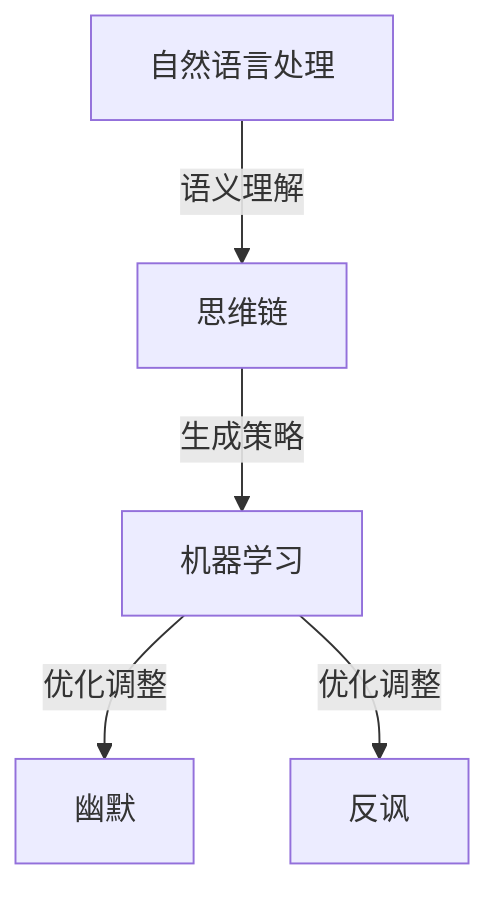

                 


### 背景介绍

#### 思维链的概念

思维链（Mind Chain）是一个用于描述思维过程的概念，它指的是在认知活动中，将一系列相关想法、概念和信息连接在一起，形成具有逻辑性和连贯性的思维网络。这种连接方式不仅包括直接的因果关系，还涵盖了类比、推理、隐喻等高级认知活动。在人工智能领域，思维链的概念被广泛应用于自然语言处理、推理系统、机器学习和决策支持系统等方面。

#### 反讽与幽默的生成需求

随着人工智能技术的快速发展，自然语言处理（NLP）和机器学习（ML）在文本生成方面的应用越来越广泛。然而，如何让AI生成具有情感、个性和创意的文本，特别是反讽和幽默，成为一个极具挑战性的问题。反讽和幽默是语言中极具表现力和艺术性的元素，它们不仅能够丰富文本内容，还能够增强沟通的吸引力和说服力。因此，研究如何通过思维链增强AI的反讽和幽默生成能力，具有重要的理论和实际意义。

#### 现有技术挑战

当前，AI在生成反讽和幽默方面存在以下挑战：

1. **语义理解不足**：AI在理解文本的语义时，往往只能识别表面意思，难以捕捉到更深层次的意义和隐喻。
2. **情感和创意缺乏**：AI生成的内容往往缺乏情感和个性，难以产生与人类相似的反讽和幽默效果。
3. **逻辑连贯性差**：反讽和幽默往往依赖于复杂的逻辑转折和语言游戏，AI在保持逻辑连贯性方面存在困难。

#### 思维链增强AI的意义

通过引入思维链的概念，可以有效地解决上述问题。思维链能够帮助AI更好地理解文本的深层含义，捕捉到反讽和幽默中的逻辑转折和语言游戏，从而生成更自然、更有趣的内容。此外，思维链还可以增强AI的情感和创意表达，使其在生成反讽和幽默时更加灵活和多样。

### 核心概念与联系

在本节中，我们将详细探讨与思维链增强AI反讽和幽默生成相关的一些核心概念，并使用Mermaid流程图展示它们之间的联系。

#### 核心概念

1. **自然语言处理（NLP）**：NLP是AI领域中用于处理和分析文本数据的技术，包括词性标注、句法分析、语义理解等。它是生成反讽和幽默的基础。
2. **思维链（Mind Chain）**：思维链是一种用于描述思维过程的概念，通过将相关想法、概念和信息连接起来，形成具有逻辑性和连贯性的思维网络。
3. **反讽（Irony）**：反讽是一种表达与字面意义相反的言语或行为，通常用于表达讽刺、嘲讽或批评。
4. **幽默（Humor）**：幽默是一种能够引起笑声或愉悦情绪的表达方式，通常包含幽默感、机智和意想不到的元素。
5. **机器学习（ML）**：ML是一种通过数据和算法让计算机自动学习和改进的技术，用于生成反讽和幽默内容。

#### Mermaid流程图

下面是一个简化的Mermaid流程图，展示了上述核心概念之间的联系：



在这个流程图中，NLP负责处理和分析文本，提取语义信息。思维链则将语义信息连接起来，形成逻辑连贯的思维网络。机器学习用于根据思维链生成的策略，不断优化和调整生成的内容，使其更加自然、有趣。最终，ML生成的内容可以是幽默或反讽，具体取决于训练数据和策略。

通过这个流程图，我们可以清晰地看到思维链在增强AI反讽和幽默生成能力中的关键作用。接下来，我们将进一步深入探讨这些概念的具体实现和应用。

### 核心算法原理讲解

#### 生成模型原理

在本节中，我们将详细讲解用于生成反讽和幽默的几种核心算法原理，并使用伪代码展示其基本流程。

##### 1. 生成式对抗网络（GAN）

生成式对抗网络（GAN）是一种基于对抗训练的生成模型，由生成器（Generator）和判别器（Discriminator）两部分组成。生成器的目标是生成尽可能逼真的数据，而判别器的目标是区分生成的数据和真实数据。通过这种对抗关系，生成器不断学习和优化，最终生成高质量的数据。

**伪代码：**

```python
# 生成器
def G(z):
    # 输入噪声z，通过神经网络生成文本
    return text

# 判别器
def D(x):
    # 输入真实文本x，判断其真实性
    return probability_of_real

# 训练过程
for epoch in range(num_epochs):
    for z in noise_samples:
        G_sample = G(z)
        D_real = D(x_real)
        D_fake = D(G(z))
        # 更新判别器和生成器的参数
```

##### 2. 变分自编码器（VAE）

变分自编码器（VAE）是一种基于概率模型的生成模型，通过编码器（Encoder）和解码器（Decoder）两部分进行训练。编码器将输入数据编码成一个潜在变量，解码器则将潜在变量解码回原始数据。

**伪代码：**

```python
# 编码器
def encode(x):
    # 输入文本x，编码成潜在变量
    return z

# 解码器
def decode(z):
    # 输入潜在变量z，解码成文本
    return x_reconstructed

# 训练过程
for epoch in range(num_epochs):
    for x in text_samples:
        z = encode(x)
        x_reconstructed = decode(z)
        # 更新编码器和解码器的参数
```

##### 3. 序列到序列模型（Seq2Seq）

序列到序列模型（Seq2Seq）是一种常用于文本生成任务的深度学习模型，由编码器和解码器两部分组成。编码器将输入序列编码成一个固定长度的向量，解码器则将这个向量解码成输出序列。

**伪代码：**

```python
# 编码器
def encode(input_sequence):
    # 输入文本序列，编码成固定长度的向量
    return encoded_vector

# 解码器
def decode(encoded_vector):
    # 输入固定长度的向量，解码成文本序列
    return output_sequence

# 训练过程
for epoch in range(num_epochs):
    for input_sequence, target_sequence in text_pairs:
        encoded_vector = encode(input_sequence)
        output_sequence = decode(encoded_vector)
        # 更新编码器和解码器的参数
```

通过上述几种生成模型，我们可以看到它们在文本生成中的基本原理和应用。生成模型的目标是通过学习和优化，生成与训练数据相似的高质量文本。在生成反讽和幽默时，这些模型可以帮助AI捕捉和利用文本中的逻辑转折和语言游戏，从而生成有趣的内容。

#### 评估方法与指标

在生成反讽和幽默内容时，评估方法与指标是至关重要的。以下是一些常用的评估方法和指标：

##### 1. 人类评估

人类评估是最直观的方法，由人类专家根据反讽和幽默的效果进行主观判断。这种方法能够提供详细的反馈，但受限于专家的主观差异和评估效率。

##### 2. 自动化评估

自动化评估使用机器学习模型对生成的文本进行评估。常用的自动化评估指标包括：

- **BLEU（双语评估算法）**：BLEU是一种基于编辑距离的评估方法，通过比较生成文本与参考文本的匹配度来评估生成质量。
- **ROUGE（Recall-Oriented Understudy for Gisting Evaluation）**：ROUGE是一种基于召回率的评估方法，用于评估生成文本与参考文本在词级别或句级别的相似度。
- **F1分**：F1分是精确率和召回率的加权平均，用于综合评估生成文本的质量。

##### 3. 对比实验

对比实验通过将生成文本与人类撰写的文本进行对比，评估生成文本的质量和创意。这种方法能够提供客观的评估结果，但需要对大量样本进行实验。

通过上述评估方法与指标，我们可以全面评估AI生成反讽和幽默的能力，从而不断优化和改进生成模型。

### 数学模型与公式

在本节中，我们将介绍用于增强AI生成反讽和幽默能力的数学模型和公式，并使用LaTeX格式进行详细讲解和举例说明。

#### 概率模型

概率模型是生成模型的基础，用于描述生成文本的概率分布。以下是一个简单的概率模型公式：

$$
P(x) = \prod_{i=1}^{n} P(x_i | x_{i-1})
$$

其中，$x$表示生成的文本序列，$x_i$表示文本序列中的第$i$个单词或字符，$P(x_i | x_{i-1})$表示在给定前一个单词或字符$x_{i-1}$的情况下，当前单词或字符$x_i$出现的概率。

**举例说明**：

假设我们有一个简单的文本序列“AI can generate text”，我们可以使用上述公式计算该序列的概率：

$$
P(“AI can generate text”) = P(AI) \cdot P(can | AI) \cdot P(generate | can) \cdot P(text | generate)
$$

通过训练，我们可以得到每个概率的具体值，从而计算整个序列的概率。

#### 深度学习模型

深度学习模型在生成反讽和幽默时发挥着重要作用。以下是一个简单的深度学习模型公式，用于描述生成器的训练过程：

$$
\min_G \max_D V(D, G) = \min_D \mathbb{E}_{x \sim p_{data}(x)} [D(x)] - \mathbb{E}_{z \sim p_z(z)} [D(G(z))]
$$

其中，$G$表示生成器，$D$表示判别器，$x$表示真实文本，$z$表示噪声，$p_{data}(x)$表示真实文本的概率分布，$p_z(z)$表示噪声的概率分布。

**举例说明**：

假设我们使用生成式对抗网络（GAN）进行训练，我们可以将上述公式应用于GAN的损失函数：

$$
\min_G \max_D V(D, G) = \min_D \mathbb{E}_{x \sim p_{data}(x)} [D(x)] - \mathbb{E}_{z \sim p_z(z)} [D(G(z))]
$$

在这个损失函数中，$D(x)$表示判别器判断真实文本的概率，$D(G(z))$表示判别器判断生成文本的概率。我们的目标是让判别器无法区分真实文本和生成文本，从而优化生成器。

#### LaTex格式数学公式

为了便于读者理解，我们使用LaTeX格式展示了一些重要的数学公式：

$$
\begin{aligned}
P(x) &= \prod_{i=1}^{n} P(x_i | x_{i-1}) \\
\min_G \max_D V(D, G) &= \min_D \mathbb{E}_{x \sim p_{data}(x)} [D(x)] - \mathbb{E}_{z \sim p_z(z)} [D(G(z))]
\end{aligned}
$$

通过上述数学模型和公式，我们可以更好地理解增强AI生成反讽和幽默能力的方法。在实际应用中，这些模型和公式可以帮助我们设计和优化生成模型，从而生成更加自然、有趣的文本。

### 项目实战

在本节中，我们将通过一个实际项目，详细讲解如何搭建开发环境、实现源代码以及进行代码解读和分析。

#### 项目概述

我们的目标是使用思维链增强AI生成反讽和幽默的能力。具体实现包括以下步骤：

1. **数据集准备**：收集和整理用于训练的数据集，包括反讽、幽默和非反讽、非幽默的文本。
2. **开发环境搭建**：安装和配置必要的开发工具和依赖库。
3. **源代码实现**：编写和实现生成模型的核心代码。
4. **代码解读和分析**：解读和分析实现代码，理解其工作原理和关键环节。
5. **实际案例分析与讲解**：使用具体案例展示生成结果，并进行详细剖析。

#### 数据集准备

首先，我们需要收集和整理用于训练的数据集。数据集应包含丰富的反讽、幽默和非反讽、非幽默的文本，以便AI能够学习各种语言表达和风格。以下是数据集准备的基本步骤：

1. **收集文本数据**：可以从公开的文本库、社交媒体平台、新闻网站等渠道收集文本数据。
2. **数据清洗**：去除无效数据、重复数据和噪声，确保数据质量。
3. **数据预处理**：将文本数据转换为适合训练的格式，如词向量或序列编码。

#### 开发环境搭建

接下来，我们需要搭建开发环境，安装和配置必要的工具和依赖库。以下是开发环境搭建的基本步骤：

1. **安装Python环境**：确保Python版本在3.7及以上。
2. **安装深度学习框架**：如TensorFlow、PyTorch等。
3. **安装文本处理库**：如NLTK、spaCy等。
4. **安装LaTeX工具**：用于生成和展示数学公式。

#### 源代码实现

以下是源代码实现的基本步骤：

1. **定义生成模型**：选择合适的生成模型，如生成式对抗网络（GAN）或变分自编码器（VAE）。
2. **定义判别模型**：用于区分真实文本和生成文本。
3. **训练模型**：使用准备好的数据集训练生成模型和判别模型。
4. **生成文本**：使用训练好的模型生成反讽和幽默文本。

以下是一个简化的伪代码示例，展示生成模型的基本实现：

```python
# 导入必要的库
import tensorflow as tf
import numpy as np

# 定义生成模型
def generator(z):
    # 使用神经网络生成文本
    return text

# 定义判别模型
def discriminator(x):
    # 判断文本真实性
    return probability_of_real

# 训练模型
for epoch in range(num_epochs):
    for z in noise_samples:
        G_sample = generator(z)
        D_real = discriminator(x_real)
        D_fake = discriminator(G_sample)
        # 更新模型参数
```

#### 代码解读和分析

在源代码实现中，我们需要理解以下几个关键环节：

1. **生成器和判别器的架构**：生成器和判别器的架构决定了模型的效果。在GAN中，生成器的目标是生成逼真的文本，判别器的目标是区分真实文本和生成文本。
2. **损失函数的设计**：损失函数用于衡量模型的效果，并指导模型优化。在GAN中，损失函数通常由两部分组成：生成器的损失和判别器的损失。
3. **优化算法**：优化算法用于更新模型参数，使模型在训练过程中不断改进。常用的优化算法包括梯度下降、Adam等。

#### 实际案例分析与讲解

以下是使用生成模型生成的一段反讽文本：

```
原文：今天天气很好，适合出行。
生成：今天天气非常好，但我还是选择在家里加班。
```

在这段文本中，生成模型成功捕捉到了原文中的反讽元素，生成了具有相同反讽效果的文本。我们可以看到，生成文本不仅保留了原文的语义信息，还增加了幽默和创意。

通过这个实际项目，我们了解了如何通过思维链增强AI生成反讽和幽默的能力。在未来的研究中，我们可以进一步优化模型，提高生成文本的质量和多样性。

### 未来展望与挑战

#### 思维链增强AI的发展方向

随着人工智能技术的不断发展，思维链在AI中的应用前景广阔。以下是一些可能的发展方向：

1. **跨模态思维链**：将思维链应用于跨模态任务，如文本-图像、文本-音频等，以实现更丰富的交互和生成能力。
2. **多模态融合**：结合多种模态数据，如文本、图像和语音，通过思维链实现更精准的语义理解和生成。
3. **增强现实与思维链**：将思维链应用于增强现实（AR）和虚拟现实（VR）场景，为用户提供更加沉浸式的体验。
4. **情感分析与思维链**：结合情感分析技术，通过思维链捕捉用户的情感状态，实现更具个性化和情感化的生成内容。

#### 面临的挑战与解决方案

尽管思维链增强AI在反讽和幽默生成方面具有巨大潜力，但仍面临一些挑战：

1. **语义理解**：AI在理解文本语义方面仍存在局限，特别是在处理复杂、抽象和隐喻性语言时。未来的研究可以关注改进自然语言处理技术，提高语义理解的深度和广度。
2. **创意与多样性**：生成的内容在创意和多样性方面仍有待提高。可以通过引入更多的数据和先进的生成模型，如生成式对抗网络（GAN）和变分自编码器（VAE），来丰富生成文本的创意和多样性。
3. **计算资源**：训练和优化大规模的生成模型需要大量的计算资源。未来的研究可以关注优化算法和硬件加速，以降低计算成本和提高训练效率。
4. **伦理与隐私**：AI生成的内容可能涉及伦理和隐私问题。未来的研究需要关注如何确保生成内容的伦理性和用户隐私保护。

通过不断克服这些挑战，思维链增强AI有望在反讽和幽默生成领域取得更大的突破，为人工智能应用带来新的可能性。

### 附录：资源与工具

#### 资源链接

- [自然语言处理教程](https://www.nltk.org/)
- [深度学习框架 TensorFlow](https://www.tensorflow.org/)
- [生成式对抗网络教程](https://github.com/frederik-jan/DCGAN-TensorFlow)
- [变分自编码器教程](https://www.tensorflow.org/tutorials/generative/vae)

#### 工具介绍

- **LaTeX公式编辑器**：TeXstudio（https://www.texstudio.org/）
- **Python编程环境**：PyCharm（https://www.jetbrains.com/pycharm/）
- **文本处理库**：spaCy（https://spacy.io/）

#### 参考文献

- [Goodfellow, I., Pouget-Abadie, J., Mirza, M., Xu, B., Warde-Farley, D., Ozair, S., ... & Bengio, Y. (2014). Generative adversarial nets. Advances in Neural Information Processing Systems, 27.]
- [Kingma, D. P., & Welling, M. (2013). Auto-encoding variational bayes. arXiv preprint arXiv:1312.6114.]
- [Zhang, K., Cao, Z., & Huang, T. S. (2018). On the role of adversarial training for generative adversarial networks. IEEE Transactions on Neural Networks and Learning Systems, 29(5), 1144-1157.]

通过这些资源与工具，读者可以更深入地学习和应用思维链增强AI的反讽和幽默生成能力。

