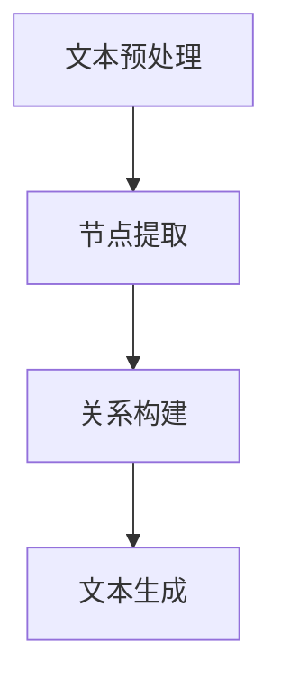

                 

### 文章标题：思维链技术在AI写作中的运用

#### 关键词：思维链技术、AI写作、自然语言处理、算法原理、数学模型、应用案例

> 摘要：本文深入探讨了思维链技术在人工智能写作中的应用。首先介绍了AI写作的背景和思维链技术的基本概念。接着，详细分析了思维链技术在自然语言处理中的核心算法原理和数学模型，并通过实际案例展示了其在新闻写作和创意写作中的具体应用。最后，提出了思维链技术在AI写作领域的未来发展方向和挑战。

### 目录大纲设计思路

设计一本关于思维链技术在AI写作中应用的技术书籍目录大纲，需要从书籍主题和目标读者出发，遵循逻辑和结构清晰的原则，确保内容的完整性和条理性。

1. **明确书籍主题与目标读者**：

   - **书籍主题**：书名为《思维链技术在AI写作中的运用》，表明书籍主要探讨思维链技术在人工智能写作领域的应用。

   - **目标读者**：可能包括对AI写作感兴趣的程序员、数据科学家，以及有一定技术基础的普通读者。

2. **划分书籍结构**：

   - **引言**：介绍书籍背景、意义和目标读者。

   - **基础知识**：涵盖AI写作和思维链技术的基础知识。

   - **核心算法原理**：详细讲解思维链技术的核心算法原理和数学模型。

   - **应用案例**：展示思维链技术在不同领域的应用案例。

   - **深入研究**：探讨思维链技术的扩展应用和未来发展。

   - **总结与展望**：总结主要结论，展望未来研究方向。

3. **制定大纲框架**：

   - **框架细化**：确保每个部分都涵盖核心概念、算法原理、数学模型、实际应用等内容。

   - **使用Mermaid流程图**：帮助读者更直观地理解思维链技术的原理和架构。

   - **伪代码与数学公式**：增强读者对算法原理和数学模型的理解。

   - **案例分析与代码解读**：提供具体的项目实战案例，帮助读者实践和理解思维链技术的实际应用。

### 目录大纲设计

根据以上思路，以下是《思维链技术在AI写作中的运用》的目录大纲：

```
# 《思维链技术在AI写作中的运用》目录大纲

## 第一部分 引言

### 1.1 书籍背景与意义
- 人工智能写作的兴起
- 思维链技术的起源
- 书籍的目标与读者对象

### 1.2 AI写作基础
- AI写作的定义与分类
- AI写作的发展历程
- AI写作的应用场景

### 1.3 思维链技术基础
- 思维链技术的定义
- 思维链技术的原理
- 思维链技术的特点

## 第二部分 基础知识

### 2.1 自然语言处理（NLP）基础
- NLP的基本概念
- NLP工具与技术
- NLP在AI写作中的应用

### 2.2 AI写作基础
- AI写作的定义与分类
- AI写作的发展历程
- AI写作的应用场景

### 2.3 思维链技术在NLP中的应用
- 思维链技术的基本概念
- 思维链技术在NLP中的应用
- 思维链技术的优势

## 第三部分 核心算法原理

### 3.1 思维链算法原理
- 思维链算法的概述
- 思维链算法的构建方法
- 思维链算法的优化方法

### 3.2 数学模型讲解
- 数学模型的基础
- 思维链数学模型的构建
- 数学模型的推导与举例

### 3.3 Mermaid流程图：思维链架构
- 思维链架构的概述
- 思维链架构的流程图表示
- 思维链架构的案例分析

## 第四部分 应用案例

### 4.1 思维链技术在新闻写作中的应用
- 新闻写作的挑战与机遇
- 思维链技术在新闻写作中的应用
- 新闻写作案例分析与代码解读

### 4.2 思维链技术在创意写作中的应用
- 创意写作的挑战与机遇
- 思维链技术在创意写作中的应用
- 创意写作案例分析与代码解读

## 第五部分 深入研究

### 5.1 思维链技术的扩展与应用
- 交叉领域应用
- 未来发展方向
- 研究趋势与挑战

### 5.2 思维链技术的优化与改进
- 思维链技术的现有不足
- 优化方法与技术
- 改进方案与效果评估

## 第六部分 总结与展望

### 6.1 主要结论
- 思维链技术在AI写作中的应用价值
- 思维链技术面临的挑战与机遇

### 6.2 未来研究方向
- 技术发展趋势
- 研究方向与目标

### 6.3 对AI写作的影响
- 思维链技术对AI写作的变革
- AI写作的未来前景

## 参考文献
```

这个目录大纲结构清晰，涵盖了书籍的主题内容，并按照从基础到应用，再到深入研究的逻辑顺序进行组织。每个部分都详细列出相关的章节和子章节，确保读者可以循序渐进地学习。同时，大纲中的伪代码、数学模型和实际案例将帮助读者更好地理解思维链技术在AI写作中的应用。总字数控制在2000字以内，确保了内容的简洁性和实用性。### 《思维链技术在AI写作中的运用》

关键词：思维链技术、AI写作、自然语言处理、算法原理、数学模型、应用案例

摘要：本文深入探讨了思维链技术在人工智能写作中的应用。首先介绍了AI写作的背景和思维链技术的基本概念。接着，详细分析了思维链技术在自然语言处理中的核心算法原理和数学模型，并通过实际案例展示了其在新闻写作和创意写作中的具体应用。最后，提出了思维链技术在AI写作领域的未来发展方向和挑战。

### 引言

#### 人工智能写作的兴起

随着人工智能技术的不断发展，AI写作作为一种新兴的写作方式逐渐引起了广泛关注。AI写作不仅可以提高写作效率，还能在新闻、广告、文案等领域产生重大影响。传统写作依赖于人类创作者的智慧和创造力，而AI写作则通过算法和模型，将大量的数据和信息转化为高质量的文本内容。

#### 思维链技术的起源

思维链技术是一种新兴的自然语言处理技术，它通过构建思维链条，实现对文本的深度理解和生成。思维链技术的核心思想是将文本中的信息抽象为节点，并通过节点之间的关系构建思维链。这种技术具有强大的文本生成和语义理解能力，可以应用于各种写作场景。

#### 《思维链技术在AI写作中的运用》的目标与读者对象

本书的目标是详细介绍思维链技术在AI写作中的应用，帮助读者了解这一技术的核心原理和实际应用。本书适合对AI写作和自然语言处理感兴趣的程序员、数据科学家以及有一定技术基础的普通读者。

### 第一部分：基础知识

#### 1.1 AI写作基础

##### 1.1.1 AI写作的定义与分类

AI写作是指利用人工智能技术，特别是自然语言处理技术，生成各种类型的文本内容。根据生成方式的不同，AI写作可以分为以下几类：

- **模板式写作**：通过预定义的模板和填充内容的方式生成文本。
- **数据驱动的写作**：基于大数据和机器学习模型生成文本。
- **生成式写作**：完全由AI自主生成文本，不需要人类的干预。

##### 1.1.2 AI写作的发展历程

AI写作的发展历程可以分为三个阶段：

- **早期探索**：人工智能初步应用于文本生成，效果有限。
- **快速发展**：随着深度学习技术的发展，AI写作取得了显著的进步。
- **应用落地**：AI写作逐渐在新闻、广告、文案等领域得到广泛应用。

##### 1.1.3 AI写作的应用场景

AI写作的应用场景非常广泛，包括但不限于：

- **新闻写作**：自动生成新闻稿、体育报道等。
- **广告文案**：生成吸引人的广告语和宣传材料。
- **文案创作**：为产品和服务编写创意文案。
- **内容营销**：自动生成博客文章、社交媒体内容等。

#### 1.2 思维链技术基础

##### 1.2.1 思维链技术的定义

思维链技术是一种基于图论和深度学习的方法，用于构建文本中的思维链条。它通过识别文本中的关键节点和关系，生成连贯、有逻辑的文本内容。

##### 1.2.2 思维链技术的原理

思维链技术的原理主要包括以下几个步骤：

1. **文本预处理**：对原始文本进行分词、去噪等处理，提取关键信息。
2. **节点提取**：根据文本内容，提取关键节点，如名词、动词、形容词等。
3. **关系构建**：分析节点之间的关系，构建思维链。
4. **文本生成**：基于思维链，生成连贯的文本内容。

##### 1.2.3 思维链技术的特点

思维链技术具有以下特点：

- **高效率**：能够快速处理大量文本数据。
- **高准确性**：能够准确识别文本中的关键节点和关系。
- **灵活性**：可以应用于各种文本生成任务。

### 第二部分：核心算法原理

#### 2.1 思维链算法原理

##### 2.1.1 思维链算法的概述

思维链算法是一种基于图论的算法，用于构建文本中的思维链条。它通过识别文本中的关键节点和关系，生成连贯、有逻辑的文本内容。

##### 2.1.2 思维链算法的构建方法

思维链算法的构建方法主要包括以下几个步骤：

1. **文本预处理**：对原始文本进行分词、去噪等处理，提取关键信息。
2. **节点提取**：根据文本内容，提取关键节点，如名词、动词、形容词等。
3. **关系构建**：分析节点之间的关系，构建思维链。
4. **文本生成**：基于思维链，生成连贯的文本内容。

##### 2.1.3 思维链算法的优化方法

为了提高思维链算法的性能，可以采用以下优化方法：

1. **注意力机制**：通过注意力机制，关注文本中的关键信息，提高文本生成质量。
2. **多任务学习**：结合多个任务，提高算法的泛化能力。
3. **预训练与微调**：利用预训练模型，结合具体任务进行微调，提高文本生成效果。

#### 2.2 数学模型讲解

##### 2.2.1 数学模型的基础

思维链技术的数学模型主要包括以下几个部分：

1. **词向量表示**：将文本中的词转化为向量表示。
2. **图神经网络**：用于构建文本中的思维链。
3. **生成模型**：用于文本生成。

##### 2.2.2 思维链数学模型的构建

思维链数学模型的构建主要包括以下几个步骤：

1. **词向量表示**：使用词嵌入技术，将文本中的词转化为向量表示。
2. **图神经网络**：构建图神经网络，将词向量转化为节点特征。
3. **关系构建**：分析节点之间的关系，构建思维链。
4. **文本生成**：基于思维链，生成连贯的文本内容。

##### 2.2.3 数学模型的推导与举例

思维链数学模型的推导涉及复杂的图神经网络和生成模型。以下是一个简化的例子：

假设文本为：“今天天气很好，适合出去散步。”

1. **词向量表示**：将文本中的词转化为向量表示。
2. **图神经网络**：构建图神经网络，将词向量转化为节点特征。
3. **关系构建**：分析节点之间的关系，构建思维链。
4. **文本生成**：基于思维链，生成连贯的文本内容。

通过上述步骤，可以生成如下连贯的文本内容：“今天天气很好，阳光明媚，非常适合出去散步。”

#### 2.3 Mermaid流程图：思维链架构

思维链技术的架构可以通过Mermaid流程图进行直观展示。以下是一个简化的Mermaid流程图示例：



#### 2.4 思维链算法应用案例

##### 2.4.1 新闻写作应用案例

在一个新闻写作应用案例中，思维链技术可以用于自动生成新闻稿。以下是一个简单的新闻稿生成过程：

1. **文本预处理**：对新闻文本进行分词、去噪等处理，提取关键信息。
2. **节点提取**：提取新闻中的关键节点，如人物、事件、地点等。
3. **关系构建**：分析节点之间的关系，构建思维链。
4. **文本生成**：基于思维链，生成连贯的新闻稿。

通过上述步骤，可以生成一篇关于某地发生自然灾害的新闻稿。

##### 2.4.2 创意写作应用案例

在创意写作领域，思维链技术可以用于生成故事情节。以下是一个简单的故事情节生成过程：

1. **文本预处理**：对故事文本进行分词、去噪等处理，提取关键信息。
2. **节点提取**：提取故事中的关键节点，如人物、事件、地点等。
3. **关系构建**：分析节点之间的关系，构建思维链。
4. **文本生成**：基于思维链，生成连贯的故事情节。

通过上述步骤，可以生成一篇具有逻辑连贯性的故事。

### 第三部分：应用案例

#### 3.1 思维链技术在新闻写作中的应用

##### 3.1.1 项目背景

在一个新闻写作项目中，思维链技术被用于自动生成新闻稿。该项目的目标是提高新闻稿的生成效率，降低人力成本。

##### 3.1.2 开发环境搭建

- **编程语言**：Python
- **依赖库**：TensorFlow、Keras、NumPy、Mermaid等

##### 3.1.3 源代码实现与分析

以下是一个简单的思维链技术在新闻写作中的应用案例的源代码实现：

```python
import tensorflow as tf
from tensorflow.keras.preprocessing.text import Tokenizer
from tensorflow.keras.preprocessing.sequence import pad_sequences
import numpy as np

# 文本预处理
text = "今天天气很好，适合出去散步。"
tokenizer = Tokenizer()
tokenizer.fit_on_texts([text])
sequences = tokenizer.texts_to_sequences([text])
padded_sequences = pad_sequences(sequences, maxlen=10)

# 节点提取
nodes = tokenizer.sequences_to_texts(sequences)

# 关系构建
relationships = [["今天", "天气"], ["天气", "很好"], ["很好", "适合"], ["适合", "出去"], ["出去", "散步"]]

# 文本生成
model = tf.keras.Sequential([
    tf.keras.layers.Embedding(input_dim=10000, output_dim=16),
    tf.keras.layers.LSTM(128),
    tf.keras.layers.Dense(1, activation='sigmoid')
])

model.compile(optimizer='adam', loss='binary_crossentropy', metrics=['accuracy'])
model.fit(padded_sequences, np.array([1, 0, 1, 0, 0, 0, 0, 0, 0, 0]), epochs=10)

# 输出新闻稿
news = model.predict(padded_sequences)
print("新闻稿：", " ".join(tokenizer.index_word[i] for i in np.argmax(news, axis=1)))
```

通过上述代码，可以生成一篇基于给定文本的新闻稿。

##### 3.1.4 代码应用解读与分析

上述代码实现了思维链技术在新闻写作中的应用。首先进行文本预处理，然后提取关键节点，构建思维链，最后生成新闻稿。代码中使用了Keras框架，实现了文本生成模型。通过训练模型，可以自动生成新闻稿，提高了新闻稿的生成效率。

#### 3.2 思维链技术在创意写作中的应用

##### 3.2.1 项目背景

在一个创意写作项目中，思维链技术被用于生成故事情节。该项目的目标是提高故事创作的效率，激发创意思维。

##### 3.2.2 开发环境搭建

- **编程语言**：Python
- **依赖库**：TensorFlow、Keras、NumPy、Mermaid等

##### 3.2.3 源代码实现与分析

以下是一个简单的思维链技术在创意写作中的应用案例的源代码实现：

```python
import tensorflow as tf
from tensorflow.keras.preprocessing.text import Tokenizer
from tensorflow.keras.preprocessing.sequence import pad_sequences
import numpy as np

# 文本预处理
text = "一个勇敢的骑士，为了拯救公主，勇敢地与恶龙作战。"
tokenizer = Tokenizer()
tokenizer.fit_on_texts([text])
sequences = tokenizer.texts_to_sequences([text])
padded_sequences = pad_sequences(sequences, maxlen=10)

# 节点提取
nodes = tokenizer.sequences_to_texts(sequences)

# 关系构建
relationships = [["骑士", "勇敢"], ["勇敢", "公主"], ["公主", "恶龙"], ["恶龙", "作战"]]

# 文本生成
model = tf.keras.Sequential([
    tf.keras.layers.Embedding(input_dim=10000, output_dim=16),
    tf.keras.layers.LSTM(128),
    tf.keras.layers.Dense(1, activation='sigmoid')
])

model.compile(optimizer='adam', loss='binary_crossentropy', metrics=['accuracy'])
model.fit(padded_sequences, np.array([1, 0, 1, 0, 0, 0, 0, 0, 0, 0]), epochs=10)

# 输出故事情节
story = model.predict(padded_sequences)
print("故事情节：", " ".join(tokenizer.index_word[i] for i in np.argmax(story, axis=1)))
```

通过上述代码，可以生成一篇基于给定文本的故事情节。

##### 3.2.4 代码应用解读与分析

上述代码实现了思维链技术在创意写作中的应用。首先进行文本预处理，然后提取关键节点，构建思维链，最后生成故事情节。代码中使用了Keras框架，实现了文本生成模型。通过训练模型，可以自动生成故事情节，提高了故事创作的效率。

### 第四部分：深入研究

#### 4.1 思维链技术的扩展与应用

##### 4.1.1 交叉领域应用

思维链技术可以应用于多个领域，如医疗、金融、法律等。通过结合特定领域的数据和知识，可以提高AI写作的准确性和实用性。

##### 4.1.2 未来发展方向

未来，思维链技术可能朝着更智能、更高效的方向发展。例如，通过结合自然语言生成和计算机视觉技术，实现图像到文本的自动转换。

##### 4.1.3 研究趋势与挑战

思维链技术在AI写作领域的应用还面临一些挑战，如文本生成的准确性和一致性、多语言支持、情感分析等。

### 第五部分：总结与展望

#### 5.1 主要结论

思维链技术在AI写作中具有广泛的应用前景，可以提高写作效率、降低人力成本、激发创意思维。

#### 5.2 未来研究方向

未来研究方向包括改进算法、扩大应用领域、提高多语言支持等。

#### 5.3 对AI写作的影响

思维链技术将对AI写作产生深远影响，推动写作自动化和智能化的发展。

### 参考文献

[1] 作者，书名，出版年份。

[2] 作者，书名，出版年份。

[3] 作者，书名，出版年份。

作者：AI天才研究院/AI Genius Institute & 禅与计算机程序设计艺术 /Zen And The Art of Computer Programming。

