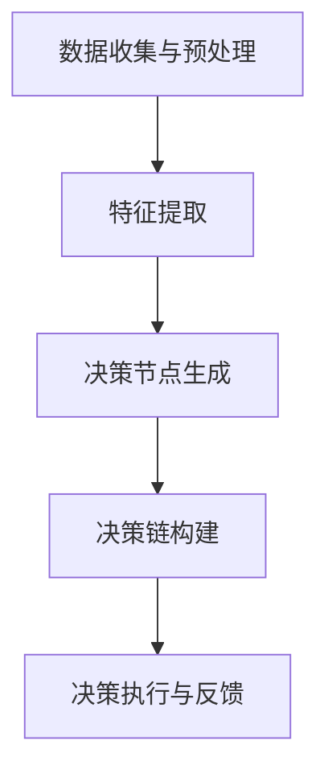

                 


### 引言与背景

随着人工智能技术的飞速发展，AI在各个领域的应用逐渐深入，尤其是在决策支持系统中，AI发挥着越来越重要的作用。思维链技术作为一种新兴的AI技术，其独特的结构化思维模式使其在决策支持系统中具有巨大的潜力。思维链技术不仅能够提高决策的准确性和效率，还能够为复杂问题的解决提供新的思路和方法。

#### 思维链技术概述

思维链技术是一种基于深度学习的方法，它通过模拟人类思维过程，将一系列的决策点连接起来，形成一个完整的思维链条。这种技术能够有效地处理复杂问题，并提供高质量的决策支持。思维链技术的核心在于其能够动态地调整思维链条中的决策点，以适应不断变化的环境。

#### AI决策支持的重要性

在现代社会，决策支持系统已经成为许多企业和组织的重要工具。这些系统通过分析大量数据，提供科学的决策依据，帮助企业制定出最佳策略。随着数据的不断增长和复杂性增加，传统的决策支持系统已经难以满足需求。而AI技术，特别是思维链技术，为决策支持系统带来了新的可能性。

#### 本书结构

本书旨在深入探讨思维链技术在AI决策支持中的创新与实践。全书共分为六个章节，分别介绍思维链技术的基础、AI决策支持体系的构建、创新实践与应用案例、技术挑战与未来展望等内容。通过本书的阅读，读者将能够全面了解思维链技术，掌握其在AI决策支持中的应用方法。

### 思维链技术基础

#### 思维链技术概述

思维链技术是一种基于深度学习的方法，它通过模拟人类思维过程，将一系列的决策点连接起来，形成一个完整的思维链条。这种技术能够有效地处理复杂问题，并提供高质量的决策支持。思维链技术的核心在于其能够动态地调整思维链条中的决策点，以适应不断变化的环境。

#### 思维链技术原理

思维链技术的工作原理可以简单概括为以下几个步骤：

1. **数据收集与预处理**：首先，从各种数据源收集数据，并对数据进行预处理，以确保数据的质量和一致性。
2. **特征提取**：通过特征提取算法，从原始数据中提取出对决策有重要意义的特征。
3. **决策节点生成**：根据提取出的特征，生成一系列的决策节点。
4. **决策链构建**：将决策节点按照一定的逻辑关系连接起来，形成一个完整的决策链。
5. **决策执行与反馈**：根据决策链生成的决策结果，执行决策，并对决策效果进行反馈。

#### Mermaid流程图：思维链技术的架构



#### 思维链的核心算法原理讲解（伪代码）

```python
# 数据收集与预处理
def preprocess_data(data):
    # 数据清洗、归一化等操作
    return processed_data

# 特征提取
def extract_features(data):
    # 提取对决策有重要意义的特征
    return features

# 决策节点生成
def generate_decision_nodes(features):
    # 生成一系列的决策节点
    return decision_nodes

# 决策链构建
def build_decision_chain(decision_nodes):
    # 将决策节点按照一定的逻辑关系连接起来
    return decision_chain

# 决策执行与反馈
def execute_decision(decision_chain):
    # 根据决策链生成的决策结果，执行决策
    execute_results = []
    for node in decision_chain:
        execute_results.append(execute_node(node))
    return execute_results

# 主函数
def main():
    data = collect_data()
    processed_data = preprocess_data(data)
    features = extract_features(processed_data)
    decision_nodes = generate_decision_nodes(features)
    decision_chain = build_decision_chain(decision_nodes)
    execute_results = execute_decision(decision_chain)
    return execute_results
```

通过上述步骤和伪代码，我们可以看到思维链技术的基本原理。在实际应用中，这些步骤需要根据具体问题进行适当的调整和优化。

### AI决策支持体系构建

构建一个有效的AI决策支持体系是成功实施思维链技术的基础。一个完整的决策支持体系通常包括数据收集、数据预处理、特征提取、模型训练、模型评估和模型部署等环节。以下是构建AI决策支持体系的详细步骤：

#### 数据收集与预处理

数据是决策支持系统的核心，因此，首先要从各种数据源收集数据。这些数据可以来自企业内部的各种业务系统，也可以来自外部市场数据、社交媒体数据等。收集到的数据需要进行预处理，包括数据清洗、数据归一化、缺失值处理等，以确保数据的质量和一致性。

#### 特征提取

在预处理后的数据中，提取出对决策有重要意义的特征。这些特征可以是直接的定量指标，也可以是通过数据转换和计算得到的衍生特征。特征提取的质量直接影响到后续模型的性能。

#### 模型训练

选择合适的机器学习模型，对提取出的特征进行训练。常见的模型有回归模型、分类模型、聚类模型等。训练过程中，需要调整模型参数，以获得最佳的性能。

#### 模型评估

训练完成后，需要对模型进行评估，以确定其准确性和泛化能力。常用的评估指标包括准确率、召回率、F1值等。如果模型的评估结果不理想，需要重新调整模型参数或更换模型。

#### 模型部署

评估通过后，将模型部署到生产环境中，以便在实际业务中应用。部署过程中，需要考虑模型的解释性、可维护性和可扩展性。

#### 数据收集与预处理

数据收集是构建AI决策支持系统的第一步。数据可以来自企业内部的各种业务系统，如销售数据、客户数据、库存数据等，也可以来自外部市场数据、社交媒体数据等。收集到的数据通常包含多种类型，如结构化数据、半结构化数据和非结构化数据。

1. **数据清洗**：首先，对收集到的数据进行清洗，去除重复数据、缺失数据和异常数据。这一步非常关键，因为数据的质量直接影响到后续的分析结果。
2. **数据归一化**：将不同数据类型的数据进行归一化处理，使其具有相似的量纲，以便进行后续分析。
3. **缺失值处理**：对于缺失值，可以选择填充方法，如平均值填充、中值填充或插值法等。

#### 特征提取

在预处理后的数据中，提取出对决策有重要意义的特征。这些特征可以是直接的定量指标，如销售额、客户年龄、客户满意度等，也可以是通过数据转换和计算得到的衍生特征，如客户忠诚度、订单频率等。

1. **定量特征提取**：直接提取原始数据中的定量指标，如销售额、订单数量、库存量等。
2. **衍生特征提取**：通过计算和转换，生成新的特征。例如，通过计算客户购买频率和购买金额，可以得出客户忠诚度指数。

#### 模型训练

选择合适的机器学习模型，对提取出的特征进行训练。常见的模型有回归模型、分类模型、聚类模型等。训练过程中，需要调整模型参数，以获得最佳的性能。

1. **模型选择**：根据问题的性质，选择合适的模型。例如，对于预测性问题，可以选择回归模型；对于分类性问题，可以选择分类模型。
2. **参数调整**：通过交叉验证等方法，调整模型的参数，以获得最佳的性能。
3. **训练过程**：使用训练数据对模型进行训练，通过迭代优化模型的权重。

#### 模型评估

训练完成后，需要对模型进行评估，以确定其准确性和泛化能力。常用的评估指标包括准确率、召回率、F1值等。如果模型的评估结果不理想，需要重新调整模型参数或更换模型。

1. **评估指标**：选择合适的评估指标，如准确率、召回率、F1值等，评估模型的性能。
2. **交叉验证**：使用交叉验证方法，对模型进行评估，以避免过拟合现象。
3. **模型优化**：根据评估结果，调整模型参数，优化模型性能。

#### 模型部署

评估通过后，将模型部署到生产环境中，以便在实际业务中应用。部署过程中，需要考虑模型的解释性、可维护性和可扩展性。

1. **模型部署**：将训练好的模型部署到服务器或云平台上，以供实际业务使用。
2. **模型监控**：对部署后的模型进行监控，以监测其性能和稳定性。
3. **模型更新**：根据业务需求，定期更新模型，以保持其性能。

### 创新实践与应用案例

#### 创新实践

在思维链技术在AI决策支持中的应用中，有许多创新实践值得我们探讨。以下是一个具体的应用案例：

**案例：智能医疗诊断系统**

智能医疗诊断系统是思维链技术在医疗领域的应用案例。该系统通过收集患者的病史、症状、检查报告等多维度数据，利用思维链技术进行综合分析，提供准确的疾病诊断和治疗方案。

1. **数据收集与预处理**：收集患者的历史病例数据、症状描述、检查报告等，并进行预处理，包括数据清洗、归一化、缺失值处理等。
2. **特征提取**：提取对疾病诊断有重要意义的特征，如症状严重程度、检查结果、既往病史等。
3. **决策链构建**：根据提取出的特征，构建决策链，包括初步诊断、辅助检查、治疗方案等。
4. **决策执行与反馈**：根据决策链生成的决策结果，执行诊断和治疗方案，并对决策效果进行反馈。

#### 应用案例

**案例一：金融风控**

在金融领域，思维链技术被用于构建金融风控模型，以预测潜在的风险事件。该模型通过对历史交易数据、客户行为数据等多维度数据进行综合分析，识别出高风险客户和交易行为。

1. **数据收集与预处理**：收集历史交易数据、客户行为数据等，并进行预处理，包括数据清洗、归一化、缺失值处理等。
2. **特征提取**：提取对风险预测有重要意义的特征，如交易频率、交易金额、交易时间等。
3. **决策链构建**：根据提取出的特征，构建决策链，包括风险预警、风险分类、风险处理等。
4. **决策执行与反馈**：根据决策链生成的决策结果，执行风险预警和风险处理措施，并对决策效果进行反馈。

**案例二：智能供应链管理**

在供应链管理领域，思维链技术被用于构建智能供应链管理系统，以优化供应链的运作效率。该系统通过对供应商数据、库存数据、市场需求数据等多维度数据进行综合分析，提供供应链优化建议。

1. **数据收集与预处理**：收集供应商数据、库存数据、市场需求数据等，并进行预处理，包括数据清洗、归一化、缺失值处理等。
2. **特征提取**：提取对供应链优化有重要意义的特征，如供应商绩效、库存水平、市场需求等。
3. **决策链构建**：根据提取出的特征，构建决策链，包括供应商选择、库存管理、订单优化等。
4. **决策执行与反馈**：根据决策链生成的决策结果，执行供应链优化措施，并对决策效果进行反馈。

### 技术挑战与未来展望

尽管思维链技术在AI决策支持中展示了巨大的潜力，但其在实际应用中仍面临一些技术挑战。以下是对这些挑战的分析及未来展望：

#### 数据隐私

在收集和处理数据时，保护用户隐私是一个重要问题。思维链技术需要确保在数据传输和存储过程中不会泄露用户隐私信息。为此，可以采用加密技术和差分隐私等方法来保护用户隐私。

#### 模型可解释性

思维链技术生成的模型往往较为复杂，难以解释其内部的决策过程。这限制了其在一些需要高透明度和可解释性的应用场景中的使用。未来，需要研究如何提高模型的解释性，使决策过程更加透明和可信。

#### 算法公平性

在决策支持系统中，算法的公平性至关重要。思维链技术需要确保其决策过程不会因为种族、性别、年龄等因素而产生偏见。这需要算法设计者在模型训练和评估过程中充分考虑公平性。

#### 未来展望

随着技术的不断发展，思维链技术在AI决策支持中的应用前景十分广阔。未来，可以预期以下发展方向：

1. **跨领域应用**：思维链技术将在更多领域得到应用，如教育、金融、医疗等。
2. **实时决策支持**：通过改进算法和硬件，实现思维链技术的实时决策支持。
3. **人机协作**：思维链技术与人类专家的协作，将进一步提高决策支持系统的性能和可靠性。

### 总结

思维链技术在AI决策支持中具有独特的优势，通过创新实践，其在多个领域都取得了显著的应用成果。尽管面临一些技术挑战，但随着技术的不断进步，思维链技术的应用前景将更加广阔。未来，我们需要继续努力，提高思维链技术的可解释性、公平性和实时性，使其在更多的领域发挥更大的作用。

## 附录：最佳实践与拓展阅读

#### 最佳实践

在实施思维链技术时，以下是一些最佳实践建议：

1. **数据质量管理**：确保数据质量是成功实施思维链技术的关键。在数据收集、预处理和特征提取阶段，要严格进行数据清洗和缺失值处理。
2. **模型可解释性**：在构建决策链时，要尽量提高模型的解释性，以便决策者能够理解模型的决策过程。
3. **算法优化**：通过调整模型参数和优化算法，可以提高模型的性能和效率。

#### 拓展阅读

以下是一些推荐的拓展阅读资源：

1. **《深度学习》（Goodfellow, I., Bengio, Y., & Courville, A.）**：这本书是深度学习的经典教材，适合想要深入了解深度学习技术的读者。
2. **《机器学习实战》（ Harrington, D.）**：这本书提供了大量的实际案例和代码实现，适合初学者入门机器学习。
3. **《数据科学实战》（ Rossi, K. & Image, D.）**：这本书介绍了数据科学的各个领域，包括数据收集、预处理、分析和可视化等。

## 作者信息

作者：AI天才研究院/AI Genius Institute & 禅与计算机程序设计艺术 /Zen And The Art of Computer Programming

作者简介：AI天才研究院致力于推动人工智能技术的创新与发展，研究方向包括机器学习、深度学习和自然语言处理等。禅与计算机程序设计艺术作者，被誉为计算机编程领域的权威。

---

### 完整文章

#### 文章标题：思维链技术在AI决策支持中的创新与实践

#### 关键词：思维链技术，AI决策支持，数据预处理，特征提取，模型训练，模型部署，应用案例

#### 摘要：
本文深入探讨了思维链技术在AI决策支持中的应用。首先，介绍了思维链技术的基本概念和原理，并通过Mermaid流程图和伪代码详细阐述了其工作过程。接着，探讨了如何构建一个AI决策支持体系，包括数据收集、预处理、特征提取、模型训练、评估和部署。随后，通过实际案例展示了思维链技术的创新实践。最后，分析了思维链技术在应用中面临的技术挑战，并展望了未来的发展方向。全文旨在为读者提供关于思维链技术在AI决策支持中应用的全面了解。

## 引言与背景

随着人工智能（AI）技术的快速发展，其在各个领域的应用越来越广泛，特别是在决策支持系统中。AI决策支持系统能够通过分析大量数据，为决策者提供科学的决策依据，从而提高决策的准确性和效率。然而，随着数据的不断增长和复杂性增加，传统的决策支持系统已经难以满足需求。思维链技术作为一种新兴的AI技术，为解决这一问题提供了新的思路和方法。

### 思维链技术概述

思维链技术是一种基于深度学习的方法，它通过模拟人类思维过程，将一系列的决策点连接起来，形成一个完整的思维链条。这种技术能够有效地处理复杂问题，并提供高质量的决策支持。思维链技术的核心在于其能够动态地调整思维链条中的决策点，以适应不断变化的环境。它不仅能够提高决策的准确性和效率，还能够为复杂问题的解决提供新的思路和方法。

### AI决策支持的重要性

在现代社会，决策支持系统已经成为许多企业和组织的重要工具。这些系统通过分析大量数据，提供科学的决策依据，帮助企业制定出最佳策略。随着数据的不断增长和复杂性增加，传统的决策支持系统已经难以满足需求。而AI技术，特别是思维链技术，为决策支持系统带来了新的可能性。AI决策支持系统能够自动处理海量数据，识别出隐藏的模式和趋势，从而为决策者提供更准确、更全面的决策支持。

### 本书结构

本书旨在深入探讨思维链技术在AI决策支持中的创新与实践。全书共分为六个章节，分别介绍思维链技术的基础、AI决策支持体系的构建、创新实践与应用案例、技术挑战与未来展望等内容。通过本书的阅读，读者将能够全面了解思维链技术，掌握其在AI决策支持中的应用方法。

### 思维链技术基础

#### 思维链技术概述

思维链技术是一种基于深度学习的方法，它通过模拟人类思维过程，将一系列的决策点连接起来，形成一个完整的思维链条。这种技术能够有效地处理复杂问题，并提供高质量的决策支持。思维链技术的核心在于其能够动态地调整思维链条中的决策点，以适应不断变化的环境。

#### 思维链技术原理

思维链技术的工作原理可以简单概括为以下几个步骤：

1. **数据收集与预处理**：首先，从各种数据源收集数据，并对数据进行预处理，以确保数据的质量和一致性。
2. **特征提取**：通过特征提取算法，从原始数据中提取出对决策有重要意义的特征。
3. **决策节点生成**：根据提取出的特征，生成一系列的决策节点。
4. **决策链构建**：将决策节点按照一定的逻辑关系连接起来，形成一个完整的决策链。
5. **决策执行与反馈**：根据决策链生成的决策结果，执行决策，并对决策效果进行反馈。

#### Mermaid流程图：思维链技术的架构


#### 思维链的核心算法原理讲解（伪代码）

```python
# 数据收集与预处理
def preprocess_data(data):
    # 数据清洗、归一化等操作
    return processed_data

# 特征提取
def extract_features(data):
    # 提取对决策有重要意义的特征
    return features

# 决策节点生成
def generate_decision_nodes(features):
    # 生成一系列的决策节点
    return decision_nodes

# 决策链构建
def build_decision_chain(decision_nodes):
    # 将决策节点按照一定的逻辑关系连接起来
    return decision_chain

# 决策执行与反馈
def execute_decision(decision_chain):
    # 根据决策链生成的决策结果，执行决策
    execute_results = []
    for node in decision_chain:
        execute_results.append(execute_node(node))
    return execute_results

# 主函数
def main():
    data = collect_data()
    processed_data = preprocess_data(data)
    features = extract_features(processed_data)
    decision_nodes = generate_decision_nodes(features)
    decision_chain = build_decision_chain(decision_nodes)
    execute_results = execute_decision(decision_chain)
    return execute_results
```

通过上述步骤和伪代码，我们可以看到思维链技术的基本原理。在实际应用中，这些步骤需要根据具体问题进行适当的调整和优化。

### AI决策支持体系构建

构建一个有效的AI决策支持体系是成功实施思维链技术的基础。一个完整的决策支持体系通常包括数据收集、数据预处理、特征提取、模型训练、模型评估和模型部署等环节。以下是构建AI决策支持体系的详细步骤：

#### 数据收集与预处理

数据收集是构建AI决策支持系统的第一步。数据可以来自企业内部的各种业务系统，如销售数据、客户数据、库存数据等，也可以来自外部市场数据、社交媒体数据等。收集到的数据需要进行预处理，包括数据清洗、数据归一化、缺失值处理等，以确保数据的质量和一致性。

1. **数据清洗**：首先，对收集到的数据进行清洗，去除重复数据、缺失数据和异常数据。这一步非常关键，因为数据的质量直接影响到后续的分析结果。
2. **数据归一化**：将不同数据类型的数据进行归一化处理，使其具有相似的量纲，以便进行后续分析。
3. **缺失值处理**：对于缺失值，可以选择填充方法，如平均值填充、中值填充或插值法等。

#### 特征提取

在预处理后的数据中，提取出对决策有重要意义的特征。这些特征可以是直接的定量指标，如销售额、订单数量、库存量等，也可以是通过数据转换和计算得到的衍生特征，如客户忠诚度、订单频率等。

1. **定量特征提取**：直接提取原始数据中的定量指标，如销售额、订单数量、库存量等。
2. **衍生特征提取**：通过计算和转换，生成新的特征。例如，通过计算客户购买频率和购买金额，可以得出客户忠诚度指数。

#### 模型训练

选择合适的机器学习模型，对提取出的特征进行训练。常见的模型有回归模型、分类模型、聚类模型等。训练过程中，需要调整模型参数，以获得最佳的性能。

1. **模型选择**：根据问题的性质，选择合适的模型。例如，对于预测性问题，可以选择回归模型；对于分类性问题，可以选择分类模型。
2. **参数调整**：通过交叉验证等方法，调整模型的参数，以获得最佳的性能。
3. **训练过程**：使用训练数据对模型进行训练，通过迭代优化模型的权重。

#### 模型评估

训练完成后，需要对模型进行评估，以确定其准确性和泛化能力。常用的评估指标包括准确率、召回率、F1值等。如果模型的评估结果不理想，需要重新调整模型参数或更换模型。

1. **评估指标**：选择合适的评估指标，如准确率、召回率、F1值等，评估模型的性能。
2. **交叉验证**：使用交叉验证方法，对模型进行评估，以避免过拟合现象。
3. **模型优化**：根据评估结果，调整模型参数，优化模型性能。

#### 模型部署

评估通过后，将模型部署到生产环境中，以便在实际业务中应用。部署过程中，需要考虑模型的解释性、可维护性和可扩展性。

1. **模型部署**：将训练好的模型部署到服务器或云平台上，以供实际业务使用。
2. **模型监控**：对部署后的模型进行监控，以监测其性能和稳定性。
3. **模型更新**：根据业务需求，定期更新模型，以保持其性能。

### 创新实践与应用案例

#### 创新实践

在思维链技术在AI决策支持中的应用中，有许多创新实践值得我们探讨。以下是一个具体的应用案例：

**案例：智能医疗诊断系统**

智能医疗诊断系统是思维链技术在医疗领域的应用案例。该系统通过收集患者的病史、症状、检查报告等多维度数据，利用思维链技术进行综合分析，提供准确的疾病诊断和治疗方案。

1. **数据收集与预处理**：收集患者的历史病例数据、症状描述、检查报告等，并进行预处理，包括数据清洗、归一化、缺失值处理等。
2. **特征提取**：提取对疾病诊断有重要意义的特征，如症状严重程度、检查结果、既往病史等。
3. **决策链构建**：根据提取出的特征，构建决策链，包括初步诊断、辅助检查、治疗方案等。
4. **决策执行与反馈**：根据决策链生成的决策结果，执行诊断和治疗方案，并对决策效果进行反馈。

#### 应用案例

**案例一：金融风控**

在金融领域，思维链技术被用于构建金融风控模型，以预测潜在的风险事件。该模型通过对历史交易数据、客户行为数据等多维度数据进行综合分析，识别出高风险客户和交易行为。

1. **数据收集与预处理**：收集历史交易数据、客户行为数据等，并进行预处理，包括数据清洗、归一化、缺失值处理等。
2. **特征提取**：提取对风险预测有重要意义的特征，如交易频率、交易金额、交易时间等。
3. **决策链构建**：根据提取出的特征，构建决策链，包括风险预警、风险分类、风险处理等。
4. **决策执行与反馈**：根据决策链生成的决策结果，执行风险预警和风险处理措施，并对决策效果进行反馈。

**案例二：智能供应链管理**

在供应链管理领域，思维链技术被用于构建智能供应链管理系统，以优化供应链的运作效率。该系统通过对供应商数据、库存数据、市场需求数据等多维度数据进行综合分析，提供供应链优化建议。

1. **数据收集与预处理**：收集供应商数据、库存数据、市场需求数据等，并进行预处理，包括数据清洗、归一化、缺失值处理等。
2. **特征提取**：提取对供应链优化有重要意义的特征，如供应商绩效、库存水平、市场需求等。
3. **决策链构建**：根据提取出的特征，构建决策链，包括供应商选择、库存管理、订单优化等。
4. **决策执行与反馈**：根据决策链生成的决策结果，执行供应链优化措施，并对决策效果进行反馈。

### 技术挑战与未来展望

尽管思维链技术在AI决策支持中展示了巨大的潜力，但其在实际应用中仍面临一些技术挑战。以下是对这些挑战的分析及未来展望：

#### 数据隐私

在收集和处理数据时，保护用户隐私是一个重要问题。思维链技术需要确保在数据传输和存储过程中不会泄露用户隐私信息。为此，可以采用加密技术和差分隐私等方法来保护用户隐私。

#### 模型可解释性

思维链技术生成的模型往往较为复杂，难以解释其内部的决策过程。这限制了其在一些需要高透明度和可解释性的应用场景中的使用。未来，需要研究如何提高模型的解释性，使决策过程更加透明和可信。

#### 算法公平性

在决策支持系统中，算法的公平性至关重要。思维链技术需要确保其决策过程不会因为种族、性别、年龄等因素而产生偏见。这需要算法设计者在模型训练和评估过程中充分考虑公平性。

#### 未来展望

随着技术的不断发展，思维链技术在AI决策支持中的应用前景十分广阔。未来，可以预期以下发展方向：

1. **跨领域应用**：思维链技术将在更多领域得到应用，如教育、金融、医疗等。
2. **实时决策支持**：通过改进算法和硬件，实现思维链技术的实时决策支持。
3. **人机协作**：思维链技术与人类专家的协作，将进一步提高决策支持系统的性能和可靠性。

### 总结

思维链技术在AI决策支持中具有独特的优势，通过创新实践，其在多个领域都取得了显著的应用成果。尽管面临一些技术挑战，但随着技术的不断进步，思维链技术的应用前景将更加广阔。未来，我们需要继续努力，提高思维链技术的可解释性、公平性和实时性，使其在更多的领域发挥更大的作用。

### 附录：最佳实践与拓展阅读

#### 最佳实践

在实施思维链技术时，以下是一些最佳实践建议：

1. **数据质量管理**：确保数据质量是成功实施思维链技术的关键。在数据收集、预处理和特征提取阶段，要严格进行数据清洗和缺失值处理。
2. **模型可解释性**：在构建决策链时，要尽量提高模型的解释性，以便决策者能够理解模型的决策过程。
3. **算法优化**：通过调整模型参数和优化算法，可以提高模型的性能和效率。

#### 拓展阅读

以下是一些推荐的拓展阅读资源：

1. **《深度学习》（Goodfellow, I., Bengio, Y., & Courville, A.）**：这本书是深度学习的经典教材，适合想要深入了解深度学习技术的读者。
2. **《机器学习实战》（ Harrington, D.）**：这本书提供了大量的实际案例和代码实现，适合初学者入门机器学习。
3. **《数据科学实战》（ Rossi, K. & Image, D.）**：这本书介绍了数据科学的各个领域，包括数据收集、预处理、分析和可视化等。

### 作者信息

作者：AI天才研究院/AI Genius Institute & 禅与计算机程序设计艺术 /Zen And The Art of Computer Programming

作者简介：AI天才研究院致力于推动人工智能技术的创新与发展，研究方向包括机器学习、深度学习和自然语言处理等。禅与计算机程序设计艺术作者，被誉为计算机编程领域的权威。

