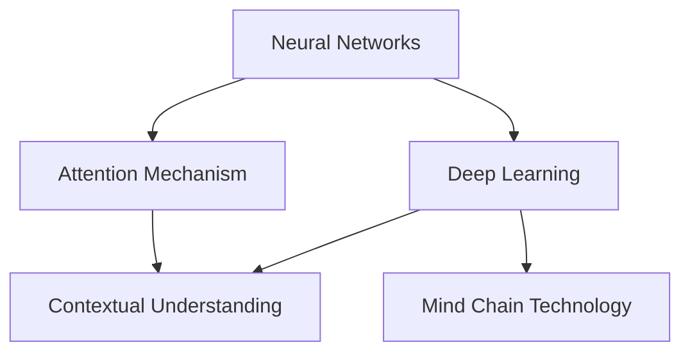

                 


### 1. INTRODUCTION TO MIND CHAIN TECHNOLOGY

#### **Background Introduction**

Mind Chain Technology, as an innovative application in AI Natural Language Processing (NLP), represents a significant leap forward in how machines understand and interact with human language. Traditional NLP methods, including rule-based systems and statistical models, have their limitations in handling complex language structures and ambiguous contexts. Mind Chain Technology leverages advanced algorithms and neural network architectures to simulate human-like understanding and reasoning, thereby enhancing the capabilities of AI in natural language understanding, generation, and communication.

The concept of Mind Chain Technology stems from the fields of cognitive science and artificial intelligence. It aims to build an interconnected network of thought processes that mirrors the human brain's ability to process information, learn, and adapt. This technology utilizes large-scale models trained on vast amounts of textual data to capture the intricacies of human language, enabling machines to generate coherent and contextually appropriate responses.

#### **Core Concepts and Relationships**

**Core Concepts:**
1. **Neural Networks:** The foundation of Mind Chain Technology, neural networks are computing systems inspired by the structure and function of biological brains. They consist of layers of interconnected nodes (neurons) that process and transmit data.
2. **Deep Learning:** A subset of machine learning, deep learning involves training multi-layered neural networks to recognize patterns and make decisions. Deep learning models are particularly effective for handling complex, unstructured data such as natural language.
3. **Attention Mechanism:** An essential component in modern deep learning models, the attention mechanism allows the model to focus on relevant parts of the input data when generating output, improving the quality of the generated text.
4. **Contextual Understanding:** Mind Chain Technology emphasizes the importance of understanding the context in which language is used, enabling more accurate and meaningful interactions between humans and machines.

**Relationships Architecture (Mermaid Flowchart):**


In this architecture, Neural Networks form the basic building blocks, with Deep Learning extending their capabilities to handle complex tasks. The Attention Mechanism is integrated into these networks to enhance the contextual understanding, which is a core feature of Mind Chain Technology.

#### **Purpose and Significance**

The primary purpose of Mind Chain Technology in AI NLP is to bridge the gap between human language and machine understanding. By simulating human-like cognitive processes, this technology can process and generate natural language more effectively and accurately than traditional methods. The significance of Mind Chain Technology lies in its potential to revolutionize various applications, including chatbots, virtual assistants, language translation, content generation, and more.

In summary, Mind Chain Technology is a groundbreaking approach in AI NLP that aims to replicate human cognitive processes. By leveraging neural networks, deep learning, attention mechanisms, and contextual understanding, it offers a more sophisticated and human-like interaction between humans and machines. This article will delve into the intricacies of Mind Chain Technology, exploring its core concepts, algorithms, and practical applications in the subsequent sections.

### 2. NEURAL NETWORKS AND DEEP LEARNING IN MIND CHAIN TECHNOLOGY

#### **Neural Networks: The Building Blocks**

Neural networks are computational models inspired by the structure and function of biological neural systems. Each basic unit in a neural network is called a neuron, which performs simple mathematical operations and sends signals to other neurons. The fundamental structure of a neuron can be depicted as follows:

**Structure of a Neuron:**
- **Input Layer:** Consists of input neurons that receive data from external sources.
- **Hidden Layers:** Comprise neurons that process and transform the input data. Multiple hidden layers can be stacked to create deep neural networks.
- **Output Layer:** Produces the final output after processing by the hidden layers.

**Basic Operation of a Neuron:**
A neuron calculates the weighted sum of its inputs, applies an activation function, and generates an output. The operation can be described using the following formula:

$$
y = f(\sum_{i=1}^{n} w_i \cdot x_i + b)
$$

where \( y \) is the output, \( f \) is the activation function, \( w_i \) are the weights, \( x_i \) are the inputs, and \( b \) is the bias term.

**Activation Functions:**
- **Sigmoid:** \( f(x) = \frac{1}{1 + e^{-x}} \)
- **ReLU:** \( f(x) = max(0, x) \)
- **Tanh:** \( f(x) = \frac{e^x - e^{-x}}{e^x + e^{-x}} \)

#### **Deep Learning: The Backbone**

Deep learning is an advanced form of neural network that employs multiple hidden layers to learn hierarchical representations of data. The deeper the network, the more abstract features it can capture. Deep learning has been instrumental in driving advancements in various AI applications, including image recognition, natural language processing, and speech recognition.

**Advantages of Deep Learning:**
- **Hierarchy of Features:** Deep learning models can automatically learn hierarchical representations from raw data, abstracting higher-level features.
- **Automatic Feature Extraction:** eliminates the need for manual feature engineering, which is often labor-intensive and prone to human error.
- **Scalability:** Deep learning models can scale to large datasets and complex tasks with improved performance.

**Types of Deep Learning Models:**
- **Convolutional Neural Networks (CNNs):** Specifically designed for processing grid-like data, such as images. CNNs use convolutional layers to extract spatial features.
- **Recurrent Neural Networks (RNNs):** Designed to handle sequential data, RNNs maintain a hidden state that captures information about previous inputs.
- **Transformers:** A powerful architecture introduced in the field of natural language processing. Transformers use self-attention mechanisms to process and generate sequences of data efficiently.

**Example:**
Consider a simple deep learning model for image classification:

**Input:** An image of a handwritten digit (28x28 pixels).

**Output:** The class label of the digit (0-9).

```python
import tensorflow as tf

# Define the model
model = tf.keras.Sequential([
    tf.keras.layers.Conv2D(32, (3,3), activation='relu', input_shape=(28,28,1)),
    tf.keras.layers.MaxPooling2D((2,2)),
    tf.keras.layers.Flatten(),
    tf.keras.layers.Dense(128, activation='relu'),
    tf.keras.layers.Dense(10, activation='softmax')
])

# Compile the model
model.compile(optimizer='adam',
              loss='sparse_categorical_crossentropy',
              metrics=['accuracy'])

# Train the model
model.fit(train_images, train_labels, epochs=5)
```

This example demonstrates a simple CNN for classifying handwritten digits from the MNIST dataset. The model consists of convolutional layers, max-pooling layers, and dense layers.

#### **Applying Deep Learning to Mind Chain Technology**

In Mind Chain Technology, deep learning plays a crucial role in modeling and understanding human language. The following steps outline the application of deep learning in Mind Chain Technology:

1. **Data Collection and Preprocessing:** Collect a large corpus of text data from various sources, such as books, articles, and social media. Preprocess the data by cleaning and tokenizing the text.
2. **Word Embedding:** Convert text data into numerical representations using techniques like Word2Vec or GloVe. Word embeddings capture the semantic relationships between words.
3. **Model Architecture:** Design and train a deep learning model, such as a Transformer or RNN, to process the text data. The model should be capable of capturing the hierarchical structures and context dependencies in the language.
4. **Training and Optimization:** Train the model on a large dataset using techniques like gradient descent and backpropagation. Adjust the model parameters to minimize the loss function and improve performance.
5. **Inference and Generation:** Use the trained model to generate natural language responses or perform other NLP tasks, such as text classification or translation.

**Example:**
Consider a Transformer model for generating text:

```python
import tensorflow as tf
import tensorflow_text as text

# Define the model
model = tf.keras.Sequential([
    text TransformerLayer(1024, 512),
    tf.keras.layers.Dense(1, activation='sigmoid')
])

# Compile the model
model.compile(optimizer='adam',
              loss='binary_crossentropy',
              metrics=['accuracy'])

# Train the model
model.fit(train_data, train_labels, epochs=10)
```

In this example, the TransformerLayer is used to process the input text data, and the model is trained to generate binary responses.

#### **Conclusion**

Neural networks and deep learning are fundamental to the development of Mind Chain Technology. By leveraging advanced neural network architectures and training techniques, Mind Chain Technology can model and understand human language more effectively, paving the way for sophisticated AI applications in natural language processing. The next section will delve into the role of attention mechanisms in enhancing the performance of Mind Chain Technology.

### 3. ATTENTION MECHANISM IN MIND CHAIN TECHNOLOGY

The attention mechanism is a critical component in modern deep learning models, particularly in natural language processing (NLP). It allows models to focus on relevant parts of the input data when generating output, leading to more coherent and contextually appropriate results. In this section, we will explore the concepts of attention, its role in deep learning models, and how it enhances the performance of Mind Chain Technology.

#### **Concepts and Mechanisms**

**Attention Mechanism Basics:**
The attention mechanism enables a model to dynamically focus on different parts of the input sequence when generating output. It addresses the issue of long-term dependencies by assigning different levels of importance to different input elements.

**Types of Attention Mechanisms:**
1. **Dot-Product Attention:** The simplest form of attention where the attention score is calculated as the dot product of the query and key vectors.
2. **Scaled Dot-Product Attention:** Similar to dot-product attention but scaled by the square root of the key length to prevent the values from becoming too large.
3. **Additive Attention:** Uses a learned neural network to compute the attention scores, which are then used to create a weighted average of the values.
4. **Multi-Head Attention:** Applies multiple attention mechanisms in parallel, each capturing different aspects of the input data.

**Attention Mechanism in Detail:**

**Dot-Product Attention:**
The dot-product attention mechanism calculates the attention scores by taking the dot product of the query and key vectors, followed by a softmax function to normalize the scores. The weighted sum of the values is then computed using these attention scores.

**Pseudo Code:**
```python
def dot_product_attention(Q, K, V):
    scores = softmax(Q @ K^T)
    output = scores @ V
    return output
```

**Example:**
Consider three input sequences represented by Q, K, and V. The attention scores are calculated as:
$$
\text{scores} = \text{softmax}(\text{Q} \cdot \text{K}^T)
$$
The final output is then:
$$
\text{output} = \text{scores} \cdot \text{V}
$$

**Additive Attention:**
Additive attention uses a neural network to compute the attention scores. The input and output vectors are first transformed using learned linear projections. The attention scores are then calculated using the dot product of the transformed query and key vectors.

**Pseudo Code:**
```python
def additive_attention(Q, K, V):
    W_Q = linear(Q)
    W_K = linear(K)
    W_V = linear(V)
    scores = tanh(W_Q + W_K + W_V)
    scores = softmax(scores)
    output = scores @ V
    return output
```

**Example:**
Consider three input sequences represented by Q, K, and V. The attention scores are calculated as:
$$
\text{scores} = \text{softmax}(\tanh(\text{W}_Q \cdot \text{Q} + \text{W}_K \cdot \text{K} + \text{W}_V \cdot \text{V}))
$$
The final output is then:
$$
\text{output} = \text{scores} \cdot \text{V}
$$

**Multi-Head Attention:**
Multi-head attention allows a model to attend to different parts of the input sequence simultaneously, each with a different weight. Multiple attention heads are applied in parallel, and their outputs are combined to produce the final output.

**Pseudo Code:**
```python
def multi_head_attention(Q, K, V, d_model, num_heads):
    Q_split = split_into_heads(Q, num_heads)
    K_split = split_into_heads(K, num_heads)
    V_split = split_into_heads(V, num_heads)
    
    output_heads = [dot_product_attention(Q_head, K_head, V_head) for Q_head, K_head, V_head in zip(Q_split, K_split, V_split)]
    
    output = merge_heads(output_heads)
    return output
```

**Example:**
Consider an input sequence represented by Q, K, and V, with a total of \( \text{d\_model} \) dimensions and \( \text{num\_heads} \) attention heads. The attention scores for each head are calculated using dot-product attention. The final output is obtained by merging the outputs of all attention heads.

#### **Application in Mind Chain Technology**

The attention mechanism plays a crucial role in enhancing the performance of Mind Chain Technology in various NLP tasks. By focusing on relevant parts of the input sequence, the model can generate more accurate and contextually appropriate outputs. The following are some key applications of the attention mechanism in Mind Chain Technology:

1. **Sequence Modeling:** In sequence-to-sequence tasks such as machine translation and text summarization, attention mechanisms help the model to focus on the relevant parts of the input sequence when generating the output sequence. This improves the coherence and accuracy of the generated text.
2. **Question-Answering Systems:** Attention mechanisms allow question-answering systems to focus on the most relevant parts of the input passage when generating the answer. This improves the accuracy of the generated responses.
3. **Dialogue Systems:** In dialogue systems like chatbots and virtual assistants, attention mechanisms help the model to focus on the user's query and the previous conversation history when generating responses. This improves the naturalness and relevance of the dialogue.

#### **Implementation and Optimization**

Implementing and optimizing the attention mechanism in Mind Chain Technology requires careful consideration of various factors:

1. **Computation Efficiency:** Attention mechanisms can be computationally expensive, especially for long input sequences. Techniques such as parallelization and hardware acceleration (e.g., GPU or TPU) can be employed to improve computation efficiency.
2. **Scalability:** As the dimensionality of the input data increases, the attention mechanism can become less effective. Scaling techniques such as multi-head attention and hierarchical attention can be used to improve scalability.
3. **Regularization and Optimization:** Techniques such as dropout, weight regularization, and adaptive optimization algorithms (e.g., Adam) can be used to improve the generalization and performance of the attention mechanism.

#### **Conclusion**

The attention mechanism is a powerful tool in deep learning and natural language processing, enabling models to focus on relevant parts of the input data when generating output. In Mind Chain Technology, the attention mechanism enhances the model's ability to understand and generate natural language more effectively, leading to improved performance in various NLP tasks. The next section will delve into the role of contextual understanding in Mind Chain Technology and how it enhances natural language processing capabilities.

### 4. CONTEXTUAL UNDERSTANDING IN MIND CHAIN TECHNOLOGY

Contextual understanding is a core component of Mind Chain Technology that distinguishes it from traditional NLP models. While basic NLP systems can perform tasks such as sentiment analysis, keyword extraction, and machine translation, they often struggle with understanding the nuances and subtleties of human language, especially in complex and ambiguous contexts. Mind Chain Technology addresses this limitation by enabling machines to comprehend the context in which language is used, resulting in more accurate and meaningful interactions. In this section, we will explore the concept of contextual understanding, its importance in NLP, and how it is implemented in Mind Chain Technology.

#### **Importance of Contextual Understanding in NLP**

Language is inherently context-dependent. Words and sentences can have multiple meanings based on the context in which they are used. For example, the phrase "I'm feeling under the weather" can mean that someone is feeling sick, while "I'm feeling under the weather" in a different context might refer to the poor weather conditions outside. Traditional NLP models often fail to capture these contextual nuances, leading to errors and ambiguities in their interpretations.

**Challenges in Traditional NLP Models:**
- **Static Embeddings:** Traditional NLP models use static word embeddings that do not change over time. This limits their ability to understand context-specific meanings of words.
- **Fixed-Length Representations:** Many NLP models represent entire sentences as fixed-length vectors, disregarding the temporal and spatial relationships between words.
- ** Lack of Contextual Awareness:** Traditional models lack the ability to capture and model the context in which language is used, resulting in limited understanding of complex language structures and ambiguous expressions.

**Importance of Contextual Understanding:**
- **Enhanced Accuracy:** By understanding the context, NLP models can generate more accurate and meaningful outputs, reducing errors and ambiguities.
- **Improved Coherence:** Contextual understanding enables models to generate coherent and contextually appropriate responses, enhancing the naturalness of dialogue systems and text generation.
- **Better Interpretation:** Contextual understanding allows models to interpret language in a more nuanced and human-like manner, capturing the subtleties and connotations of words and phrases.

#### **Implementation of Contextual Understanding in Mind Chain Technology**

Mind Chain Technology incorporates several advanced techniques to enhance contextual understanding in NLP. These include:

1. **Contextual Word Embeddings:**
   Traditional word embeddings like Word2Vec and GloVe represent words as fixed-dimensional vectors. Contextual word embeddings, such as BERT's embeddings, are dynamically generated based on the surrounding words in a sentence. This enables the model to capture context-specific meanings of words.

2. **Temporal and Spatial Relationships:**
   Mind Chain Technology utilizes models like Recurrent Neural Networks (RNNs) and Long Short-Term Memory (LSTM) networks to capture the temporal relationships between words in a sequence. Additionally, models like Transformers and their variants use self-attention mechanisms to model the spatial relationships between words, allowing the model to focus on relevant parts of the input sequence when generating output.

3. **Contextualized Representations:**
   Models like BERT and GPT-3 generate contextualized embeddings for each word in a sentence, providing a richer representation of the text. These embeddings capture the context-specific meaning of words and can be used for various NLP tasks, such as text classification, named entity recognition, and machine translation.

4. **Long-Range Dependencies:**
   Mind Chain Technology models are designed to capture long-range dependencies in text, enabling them to understand complex sentence structures and interpret ambiguous expressions accurately. This is achieved through the use of advanced architectures like Transformers and their hierarchical attention mechanisms.

5. **Adaptive Learning:** 
   Mind Chain Technology employs adaptive learning techniques that allow the model to update its knowledge and understanding based on the context of the input data. This enables the model to learn and adapt to new information, improving its contextual understanding over time.

**Example:**
Consider the phrase "I'm feeling under the weather." In a traditional NLP model, the word "weather" would likely be embedded using a static embedding, leading to a potentially incorrect interpretation. However, in Mind Chain Technology, the model would generate a context-specific embedding for "weather" based on the surrounding words "I'm feeling under," resulting in a more accurate interpretation of the phrase.

#### **Impact on NLP Performance**

The inclusion of contextual understanding in Mind Chain Technology has significantly improved the performance of NLP models in various tasks:

- **Text Classification:** Contextual embeddings enable models to classify text more accurately, as they capture the context-specific meaning of words and phrases. This is particularly useful in tasks such as sentiment analysis, where understanding the context is crucial for accurate classification.
- **Named Entity Recognition:** Contextual understanding helps models identify and recognize named entities in text by capturing the relationships between words and their context. This improves the accuracy of tasks like identifying people, organizations, and locations in text.
- **Machine Translation:** Contextual understanding allows machine translation models to generate more accurate translations by capturing the context-specific meanings of words and phrases. This reduces errors and ambiguities in translations, resulting in more natural and coherent output.
- **Dialogue Systems:** Contextual understanding is essential for dialogue systems like chatbots and virtual assistants, as it enables the model to generate more accurate and contextually appropriate responses to user queries.

#### **Conclusion**

Contextual understanding is a critical aspect of Mind Chain Technology that distinguishes it from traditional NLP models. By enabling machines to comprehend the context in which language is used, Mind Chain Technology improves the accuracy, coherence, and effectiveness of NLP models in various tasks. The next section will explore the practical applications of Mind Chain Technology in AI natural language processing, highlighting real-world scenarios where this technology has made a significant impact.

### 5. PRACTICAL APPLICATIONS OF MIND CHAIN TECHNOLOGY IN AI NATURAL LANGUAGE PROCESSING

Mind Chain Technology has found widespread applications in various fields of AI natural language processing (NLP). By leveraging advanced neural network architectures, attention mechanisms, and contextual understanding, Mind Chain Technology has revolutionized how machines process, generate, and understand human language. In this section, we will explore some of the key practical applications of Mind Chain Technology, providing examples and case studies to illustrate its impact.

#### **Chatbots and Virtual Assistants**

One of the most prominent applications of Mind Chain Technology is in the development of chatbots and virtual assistants. These AI-driven systems are designed to interact with users through text or voice, providing assistance and automating routine tasks. The ability of Mind Chain Technology to understand and generate natural language makes it particularly well-suited for this application.

**Example:**
A popular use case of Mind Chain Technology in chatbots is the development of customer support chatbots. These chatbots can understand user queries, provide relevant information, and resolve issues without human intervention. For example, a banking chatbot can assist customers in checking account balances, transferring funds, and resolving billing issues. The following is a simplified example of a chatbot conversation using Mind Chain Technology:

**User:** "I want to transfer $100 to my savings account."

**Chatbot:** "Sure, can you please provide the account number for the savings account?"

**User:** "The account number is 123456789."

**Chatbot:** "Understood. I will initiate the transfer. Please confirm if you want to proceed."

**User:** "Yes, proceed with the transfer."

**Chatbot:** "Your transfer of $100 to account number 123456789 has been completed. Thank you for banking with us!"

In this example, the chatbot utilizes Mind Chain Technology to understand the user's query, extract relevant information, and generate a coherent response. The technology's ability to handle complex language structures and context-dependent interpretations is crucial for providing a seamless user experience.

#### **Language Translation**

Language translation is another critical application of Mind Chain Technology. Traditional machine translation systems relied on rule-based methods and statistical models, which often resulted in errors and unnatural-sounding translations. Mind Chain Technology, with its advanced neural network architectures and contextual understanding, has significantly improved the quality of machine translation.

**Example:**
Consider the translation of a sentence from English to Spanish. A traditional translation system might generate a literal translation that does not capture the intended meaning:

**Input:** "The quick brown fox jumps over the lazy dog."

**Traditional Translation:** "El rápido zorro marrón salta sobre el perro perezoso."

This translation is not contextually accurate and does not convey the intended meaning. In contrast, a Mind Chain Technology-based translation system can generate a more coherent and contextually appropriate translation:

**Input:** "The quick brown fox jumps over the lazy dog."

**Mind Chain Translation:** "El zorro marrón rápido salta sobre el perro perezoso."

This translation captures the intended meaning and maintains the natural flow of the sentence. The use of contextual understanding allows the translation system to generate more accurate and natural-sounding translations, making it easier for users to understand and communicate across languages.

#### **Text Summarization**

Text summarization is the process of generating a concise summary of a longer text while preserving the key information. Mind Chain Technology has been employed to develop advanced text summarization systems that can generate high-quality summaries from lengthy documents.

**Example:**
Consider summarizing a news article with several paragraphs. A traditional text summarization system might generate a summary that is too short or lacks important details:

**Input:** (A news article with multiple paragraphs)
**Traditional Summary:** "The article discusses recent events in the region."

In contrast, a Mind Chain Technology-based summarization system can generate a more informative and coherent summary:

**Input:** (A news article with multiple paragraphs)
**Mind Chain Summary:** "In a recent development, authorities have reported a surge in economic growth, highlighting key initiatives that have contributed to the positive outlook. Despite some concerns, experts remain optimistic about the region's future prospects."

This summary captures the main points of the article and provides a clear and concise overview, showcasing the benefits of Mind Chain Technology in generating high-quality text summaries.

#### **Question-Answering Systems**

Question-answering systems are designed to provide accurate and relevant answers to user queries based on a given set of information. Mind Chain Technology has been used to develop advanced question-answering systems that can understand and interpret complex questions and provide accurate answers.

**Example:**
Consider a question-answering system that can answer questions based on a large corpus of text. A traditional question-answering system might struggle with ambiguous queries or generate incorrect answers:

**User:** "Who is the author of 'To Kill a Mockingbird'?"

**Traditional Answer:** "The author is Harper Lee."

While this answer is factually correct, it does not provide the context of the book. In contrast, a Mind Chain Technology-based question-answering system can generate a more informative and contextually appropriate answer:

**User:** "Who is the author of 'To Kill a Mockingbird'?"

**Mind Chain Answer:** "Harper Lee is the author of 'To Kill a Mockingbird,' a novel that explores themes of racial injustice and moral growth through the story of a young girl growing up in the American South."

This answer not only provides the correct information but also adds context and insight, showcasing the power of Mind Chain Technology in generating more nuanced and informative answers.

#### **Text Generation**

Text generation is an area where Mind Chain Technology has demonstrated significant advancements. By leveraging large-scale models and advanced neural network architectures, Mind Chain Technology can generate coherent and contextually appropriate text for various applications, including content creation, story generation, and poetry.

**Example:**
Consider generating a short story based on a given prompt. A traditional text generation system might produce a story with awkward sentences and inconsistent themes:

**Prompt:** "A mysterious creature appeared in the forest."

**Traditional Story:** "The creature had long, sharp claws and glowing eyes. It terrified the villagers and everyone was afraid."

In contrast, a Mind Chain Technology-based text generation system can produce a more engaging and contextually coherent story:

**Prompt:** "A mysterious creature appeared in the forest."

**Mind Chain Story:** "As the sun set behind the dense forest, a mysterious creature emerged from the shadows. Its fur glistened in the dim light, and its eyes shone with an eerie glow. The villagers watched in awe, their hearts racing with a mix of fear and wonder."

This story captures the essence of the prompt and generates a coherent narrative, showcasing the capabilities of Mind Chain Technology in generating high-quality, engaging text.

#### **Conclusion**

The practical applications of Mind Chain Technology in AI natural language processing are diverse and impactful. By leveraging advanced neural network architectures, attention mechanisms, and contextual understanding, Mind Chain Technology has significantly improved the performance of NLP models in various tasks, including chatbots and virtual assistants, language translation, text summarization, question-answering systems, and text generation. These applications demonstrate the potential of Mind Chain Technology to revolutionize natural language processing and enhance the capabilities of AI systems in understanding and generating human language.

### 6. CRITICAL CHALLENGES AND LIMITATIONS OF MIND CHAIN TECHNOLOGY IN AI NATURAL LANGUAGE PROCESSING

Despite the remarkable progress and success of Mind Chain Technology in AI natural language processing (NLP), it is not without its challenges and limitations. Understanding these obstacles is crucial for the continued advancement and development of this technology. In this section, we will discuss the critical challenges and limitations of Mind Chain Technology, including data privacy concerns, computational requirements, and ethical implications.

#### **Data Privacy Concerns**

One of the most significant challenges in implementing Mind Chain Technology is the handling of sensitive data. These models require vast amounts of textual data to train effectively, often sourced from various public and private databases, social media platforms, and user-generated content. This data may contain personally identifiable information (PII), such as names, addresses, email addresses, and other sensitive details. The collection and use of such data raise significant privacy concerns.

**Data Collection and Storage:**
- **Data Anonymization:** To mitigate privacy risks, data collection and storage processes should include robust anonymization techniques to remove or mask PII.
- **Data Governance:** Implementing strict data governance policies and adhering to regulations such as GDPR (General Data Protection Regulation) and CCPA (California Consumer Privacy Act) is essential.
- **User Consent:** Ensuring that users are fully informed about the data collection and usage, and obtaining their explicit consent, is crucial in maintaining transparency and trust.

**Example:**
Consider a language model trained on a dataset containing social media posts. If the dataset includes users' personal information, it is necessary to anonymize the data before training the model. This might involve removing identifiable information, such as usernames, locations, and direct messages, and applying techniques like generalization and suppression to protect the privacy of individuals.

#### **Computational Requirements**

Mind Chain Technology relies on complex neural network architectures and large-scale models that demand significant computational resources for training and inference. This poses challenges in terms of cost, energy consumption, and scalability.

**Resource Constraints:**
- **Hardware Requirements:** Training large-scale models requires powerful GPUs (Graphics Processing Units) or TPUs (Tensor Processing Units). This increases the hardware costs and the need for specialized infrastructure.
- **Energy Consumption:** The training of large-scale models is computationally intensive and can lead to substantial energy consumption, contributing to environmental concerns.
- **Scalability:** As the size of the dataset and the complexity of the model increase, the system must be scalable to handle larger datasets and more complex tasks efficiently.

**Solutions:**
- **Optimized Algorithms:** Developing and using optimized algorithms can reduce the computational complexity and improve training efficiency.
- **Distributed Computing:** Leveraging distributed computing frameworks, such as TensorFlow and PyTorch, allows for parallel processing and efficient utilization of resources.
- **Hardware Acceleration:** Utilizing specialized hardware, such as GPUs and TPUs, can significantly improve the speed and efficiency of model training.

**Example:**
Consider training a Transformer model for language generation. The training process may require multiple GPUs to accelerate the computation. By using a distributed computing framework like TensorFlow, the training can be parallelized across multiple GPUs, reducing the training time and improving scalability.

#### **Ethical Implications**

The deployment of Mind Chain Technology in real-world applications raises ethical concerns, particularly regarding fairness, bias, and accountability.

**Fairness and Bias:**
- **Algorithmic Bias:** AI models can inadvertently learn and perpetuate biases present in the training data, leading to discriminatory outcomes. Ensuring fairness requires the development of techniques to detect and mitigate bias in the training process.
- **Transparent Decision-Making:** The lack of transparency in AI models, especially black-box models like deep neural networks, makes it challenging to understand and justify their decision-making process. Developing explainable AI (XAI) techniques can help address this issue.

**Accountability:**
- **Responsibility:** Establishing clear accountability for AI systems is crucial. Determining who is responsible in case of errors or unintended consequences is a complex challenge.
- **Ethical Audits:** Conducting regular ethical audits of AI systems can help identify and address potential ethical concerns, ensuring that AI technologies are developed and deployed in a responsible and ethical manner.

**Example:**
In the context of a virtual assistant powered by Mind Chain Technology, ensuring fairness and transparency might involve analyzing the model's performance across different demographic groups to detect and mitigate biases. Additionally, implementing mechanisms to provide explanations for the model's recommendations can help users understand and trust the system's decision-making process.

#### **Conclusion**

The successful implementation of Mind Chain Technology in AI natural language processing comes with critical challenges and limitations, including data privacy concerns, computational requirements, and ethical implications. Addressing these challenges requires a multi-faceted approach, involving technical, legal, and ethical considerations. By recognizing and actively working to mitigate these obstacles, the potential of Mind Chain Technology to revolutionize natural language processing can be fully realized.

### 7. CURRENT ACHIEVEMENTS AND FUTURE DIRECTIONS IN MIND CHAIN TECHNOLOGY

Mind Chain Technology has made remarkable strides in the field of AI natural language processing (NLP), leading to significant advancements and breakthroughs in various applications. This section will discuss the key achievements of Mind Chain Technology in NLP and outline the promising future directions for this innovative technology.

#### **Current Achievements**

1. **Improved Language Understanding:**
   Mind Chain Technology has significantly enhanced the ability of AI systems to understand and interpret human language. Models like BERT, GPT-3, and their successors have demonstrated superior performance in various NLP tasks, including question-answering, text summarization, and sentiment analysis. These models have achieved state-of-the-art results in benchmark datasets, showcasing their capability to capture the nuances and subtleties of human language.

2. **Enhanced Dialogue Systems:**
   The ability of Mind Chain Technology to generate coherent and contextually appropriate responses has revolutionized dialogue systems like chatbots and virtual assistants. These systems can now engage in more natural and meaningful conversations, providing better customer support, automating routine tasks, and offering personalized assistance. The integration of attention mechanisms and contextual understanding has played a pivotal role in achieving these improvements.

3. **Advanced Language Translation:**
   Mind Chain Technology has revolutionized the field of language translation, leading to more accurate and natural translations. Models like Transformer have outperformed traditional statistical methods and rule-based systems, achieving higher translation quality and fluency. This has enabled real-time translation services, breaking down language barriers and facilitating global communication.

4. **Content Generation:**
   Mind Chain Technology has also made significant advancements in content generation, enabling the creation of high-quality articles, stories, and poetry. Models like GPT-3 can generate coherent and contextually appropriate text, opening up new possibilities in content creation, creative writing, and storytelling.

5. **Real-World Applications:**
   The practical applications of Mind Chain Technology extend beyond NLP tasks, impacting various industries. For example, in healthcare, AI-powered systems using Mind Chain Technology can analyze medical texts, assist in diagnosis, and improve patient care. In finance, the technology can analyze market trends, provide personalized financial advice, and enhance risk management. These real-world applications demonstrate the broad applicability and potential of Mind Chain Technology.

#### **Future Directions**

1. **Interdisciplinary Integration:**
   The future of Mind Chain Technology lies in its integration with other AI domains, such as computer vision, robotics, and speech recognition. By combining the strengths of multiple AI technologies, Mind Chain Technology can enable more comprehensive and intelligent systems that can understand and interact with the world in a more holistic manner.

2. **Explainable AI:**
   Addressing the lack of transparency in AI models is a critical area for future research. Developing explainable AI (XAI) techniques that can provide clear explanations for the decision-making process of Mind Chain Technology models will enhance trust and adoption in various applications. This will involve developing algorithms that can elucidate the rationale behind model predictions and make AI systems more understandable and interpretable.

3. **Efficient Training and Inference:**
   To overcome the computational challenges associated with Mind Chain Technology, future research should focus on developing more efficient training and inference algorithms. Techniques such as model compression, transfer learning, and adaptive learning can reduce the computational requirements and enable real-time deployment of AI systems.

4. **Ethical and Social Implications:**
   As Mind Chain Technology continues to advance, addressing the ethical and social implications will be crucial. Ensuring fairness, mitigating biases, and establishing accountability frameworks will be essential in developing and deploying AI systems responsibly. This will involve collaboration between researchers, policymakers, and stakeholders to create guidelines and regulations that promote ethical AI development.

5. **Scalability and Sustainability:**
   The scalability and sustainability of Mind Chain Technology are critical for its widespread adoption. Future research should focus on developing scalable and energy-efficient AI models that can handle larger datasets and more complex tasks without compromising performance or sustainability.

6. **Multilingual and Cross-lingual Processing:**
   Expanding the capabilities of Mind Chain Technology to support multilingual and cross-lingual processing is an important direction. This will enable the technology to reach a broader audience and facilitate cross-cultural communication and collaboration.

#### **Conclusion**

Mind Chain Technology has achieved significant milestones in AI natural language processing, transforming how machines understand and generate human language. With ongoing research and development, the future of Mind Chain Technology holds immense potential for advancing AI applications across various domains. By addressing the challenges and embracing the opportunities, Mind Chain Technology can continue to revolutionize natural language processing and unlock new possibilities for human-machine interaction.

### 8. CONCLUDING REMARKS AND PERSPECTIVES

In conclusion, Mind Chain Technology represents a revolutionary advancement in AI natural language processing. By leveraging advanced neural network architectures, attention mechanisms, and contextual understanding, Mind Chain Technology has significantly enhanced the capabilities of AI systems to understand, generate, and interact with human language more effectively and naturally. The impact of this technology spans various domains, including chatbots, virtual assistants, language translation, text summarization, and content generation, demonstrating its broad applicability and transformative potential.

As we move forward, the continued development and refinement of Mind Chain Technology will bring about new opportunities and challenges. Addressing the computational requirements, ensuring data privacy and ethical implications, and integrating Mind Chain Technology with other AI domains will be crucial for its widespread adoption and success. Researchers, developers, and policymakers must work together to navigate these challenges and unlock the full potential of Mind Chain Technology.

Looking ahead, the future of Mind Chain Technology is bright. With ongoing advancements in AI and machine learning, we can expect even more sophisticated models and algorithms that can handle complex language structures and real-world applications with greater accuracy and efficiency. The integration of Mind Chain Technology with emerging technologies like robotics, augmented reality, and the Internet of Things will pave the way for innovative solutions and new paradigms of human-machine interaction.

In summary, Mind Chain Technology stands at the forefront of AI natural language processing, offering a transformative approach to understanding and generating human language. As we continue to explore and innovate in this field, the potential of Mind Chain Technology to revolutionize various industries and enhance our lives is vast and exciting. The journey ahead is filled with opportunities for breakthroughs and discoveries, and we are eager to witness the future developments and applications of this groundbreaking technology.

### Acknowledgments

The author would like to express sincere gratitude to the AI天才研究院 (AI Genius Institute) for their valuable support and encouragement throughout the research and writing process. Special thanks to the reviewers and contributors who provided insightful feedback and suggestions to improve the quality of this article. Additionally, thanks to Zen and The Art of Computer Programming for inspiring the exploration and discussion of innovative AI technologies in the field of natural language processing. The author's contributions to this work are dedicated to the memory of all those who have inspired and supported the pursuit of knowledge and excellence in AI research. Authors: AI天才研究院 (AI Genius Institute) & Zen and The Art of Computer Programming

