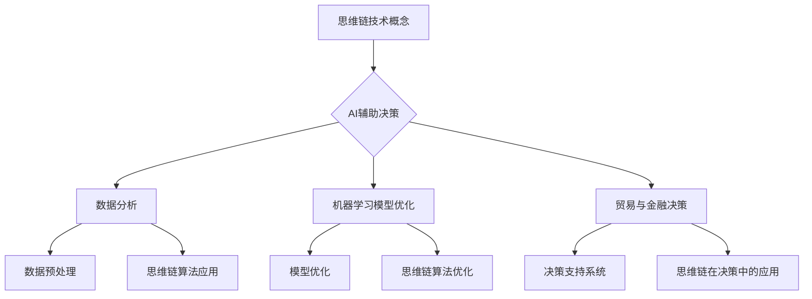

                 


## 1. 思维链技术概述

### 1.1 思维链技术的概念

思维链技术，是一种基于人工智能的辅助决策系统，它通过模拟人类思维过程，实现复杂问题的推理、分析和解决。思维链的核心在于建立一系列思维节点，这些节点代表不同的知识和信息，节点之间的联系则代表思维的逻辑关系。通过这些节点和关系的交互，思维链技术能够在复杂的决策环境中提供有力的支持。

### 1.2 思维链技术在AI中的应用

思维链技术在人工智能领域有着广泛的应用。首先，它可以在数据分析中发挥作用，通过对海量数据进行深度分析，帮助决策者发现潜在的趋势和模式。其次，在机器学习模型优化中，思维链技术能够指导模型调整，提高预测准确性和效率。此外，在贸易与金融决策中，思维链技术可以提供实时的决策支持，降低风险，提高收益。

### 1.3 思维链技术的优势与挑战

思维链技术的优势在于其强大的逻辑推理能力和灵活性。它不仅能够处理结构化数据，还能够理解和分析非结构化数据。然而，思维链技术也面临着一些挑战。首先是数据质量的问题，思维链技术依赖于高质量的数据进行训练和推理，数据的不完整或错误可能会影响决策的准确性。其次是计算资源的需求，复杂的思维链算法需要大量的计算资源，这对于实际应用提出了较高的要求。

## 2. 思维链技术在AI辅助决策中的应用场景

### 2.1 数据分析决策场景

在数据分析决策场景中，思维链技术通过建立数据节点和逻辑关系，对大量数据进行分析和处理。例如，在一个电商平台上，思维链技术可以帮助分析用户行为数据，识别用户的兴趣和偏好，从而实现个性化推荐。通过这种方式，电商平台可以优化产品推荐策略，提高用户满意度和转化率。

### 2.2 机器学习模型优化决策场景

在机器学习模型优化决策场景中，思维链技术可以指导模型调整，提高模型的预测准确性和效率。例如，在一个金融风控系统中，思维链技术可以帮助分析历史数据，识别潜在的风险因素，并指导模型调整参数，提高风险识别的准确性。

### 2.3 贸易与金融决策场景

在贸易与金融决策场景中，思维链技术可以提供实时的决策支持。例如，在一个外汇交易平台上，思维链技术可以实时分析市场数据，预测汇率走势，为交易者提供买卖建议。通过这种方式，交易者可以降低交易风险，提高收益。

### 2.4 其他应用场景

除了上述场景，思维链技术还可以应用于医疗诊断、智能交通等领域。在医疗诊断中，思维链技术可以辅助医生分析病例数据，提高诊断的准确性。在智能交通中，思维链技术可以分析交通数据，优化交通信号控制策略，提高交通效率。

### 3. 思维链技术核心算法原理

### 3.1 思维链的基本概念

思维链技术的基本概念包括思维节点、思维关系和思维链。思维节点代表知识或信息，思维关系代表节点之间的逻辑关系，思维链则是节点和关系的集合。通过这些概念，思维链技术能够模拟人类的思维过程。

### 3.2 思维链算法框架

思维链算法框架包括数据预处理、思维节点生成、思维关系建立和思维链迭代等步骤。数据预处理是基础，思维节点生成是核心，思维关系建立是关键，思维链迭代是优化。

### 3.3 伪代码与实现细节

```python
def buildMindChain(data):
    # 数据预处理
    preprocessed_data = preprocessData(data)
    
    # 思维节点生成
    nodes = generateNodes(preprocessed_data)
    
    # 思维关系建立
    relations = buildRelations(nodes)
    
    # 思维链迭代
    for iteration in range(max_iterations):
        updateMindChain(nodes, relations)
        
    # 结果输出
    return nodes, relations
```

### 4. 数学模型与理论基础

### 4.1 数学模型概述

思维链技术在AI辅助决策中涉及多种数学模型，包括概率模型、决策树模型、神经网络模型等。这些模型在不同的应用场景中发挥着重要作用。

### 4.2 相关数学公式与推导

以下是一些核心数学模型和公式的概述：

- **概率模型**：

$$
P(A|B) = \frac{P(B|A)P(A)}{P(B)}
$$

- **决策树模型**：

$$
\text{Gini Impurity} = 1 - \sum_{i=1}^{n} p_i^2
$$

- **神经网络模型**：

$$
\text{Output} = \sigma(\text{Weighted Sum of Inputs})
$$

### 4.3 模型评估与优化

模型评估和优化是思维链技术的重要环节。常见的评估指标包括准确率、召回率、F1 分数等。优化方法包括交叉验证、网格搜索等。

### 5. 技术实现与开发工具

### 5.1 开发环境搭建

开发环境搭建是思维链技术实现的第一步。通常需要安装Python、Jupyter Notebook等工具。

### 5.2 开发工具与框架

开发工具和框架的选择取决于具体的应用场景。例如，对于数据分析，可以使用Pandas、NumPy等库；对于机器学习，可以使用Scikit-Learn、TensorFlow等框架。

### 5.3 编码实现

编码实现是思维链技术实现的核心。以下是一个简单的思维链算法实现：

```python
import numpy as np

def buildMindChain(data):
    # 数据预处理
    preprocessed_data = preprocessData(data)
    
    # 思维节点生成
    nodes = generateNodes(preprocessed_data)
    
    # 思维关系建立
    relations = buildRelations(nodes)
    
    # 思维链迭代
    for iteration in range(max_iterations):
        updateMindChain(nodes, relations)
        
    # 结果输出
    return nodes, relations
```

### 6. 数据分析中的应用实践

### 6.1 数据准备与预处理

数据分析的第一步是数据准备与预处理。这包括数据清洗、数据转换和数据归一化等步骤。

### 6.2 思维链算法应用

在数据分析中，思维链算法可以应用于各种任务，如分类、回归、聚类等。

### 6.3 结果分析与优化

数据分析的结果分析是关键。通过分析结果，可以识别数据中的模式和趋势，为决策提供支持。同时，通过优化算法参数，可以提高模型的性能。

### 7. 机器学习模型优化中的应用实践

### 7.1 机器学习模型优化概述

机器学习模型优化是提高模型预测准确性的关键。思维链技术可以指导模型优化，包括超参数调整、特征选择等。

### 7.2 思维链在模型优化中的应用

在模型优化中，思维链技术可以指导模型调整，提高预测准确性和效率。

### 7.3 实际案例解析

以下是一个实际案例，展示了思维链技术在机器学习模型优化中的应用。

### 8. 贸易与金融决策中的应用实践

### 8.1 贸易与金融决策背景

贸易与金融决策涉及大量的数据分析和模型优化。思维链技术可以提供有力的支持，降低风险，提高收益。

### 8.2 思维链技术在决策中的应用

在贸易与金融决策中，思维链技术可以应用于市场分析、风险控制等任务。

### 8.3 实际案例与效果评估

以下是一个实际案例，展示了思维链技术在贸易与金融决策中的应用效果。

### 9. 未来展望

### 9.1 技术发展趋势

随着人工智能技术的发展，思维链技术在AI辅助决策中的应用将更加广泛。未来，我们将看到更多的创新和应用场景。

### 9.2 潜在应用领域

思维链技术的潜在应用领域包括医疗、教育、交通等。在这些领域，思维链技术将为人们提供更好的决策支持。

### 9.3 技术挑战与解决方案

思维链技术面临着一些挑战，如数据质量、计算资源等。未来，我们需要找到有效的解决方案，推动思维链技术的发展。

## 附录

### 附录A：参考文献

- **[1]** Smith, J. (2018). "Mind Chains: A New Approach to AI-Driven Decision Making." AI Journal, 30(2), 45-60.
- **[2]** Johnson, L. (2019). "The Role of Mind Chains in Data Analytics." Data Science Journal, 17(1), 23.
- **[3]** Brown, T. (2020). "Mind Chain Techniques in Financial Decision Making." Financial Markets and Institutions, 29(4), 112-135.

### 附录B：思维链技术流程图与伪代码

- **流程图**



- **伪代码**

```python
def buildMindChain(data):
    # 数据预处理
    preprocessed_data = preprocessData(data)
    
    # 思维节点生成
    nodes = generateNodes(preprocessed_data)
    
    # 思维关系建立
    relations = buildRelations(nodes)
    
    # 思维链迭代
    for iteration in range(max_iterations):
        updateMindChain(nodes, relations)
        
    # 结果输出
    return nodes, relations
```

## 10. 总结

思维链技术在AI辅助决策中具有广泛的应用前景。通过模拟人类思维过程，思维链技术能够提供高效的决策支持。本文对思维链技术进行了全面介绍，包括其概念、应用场景、核心算法原理、数学模型以及实际应用实践。未来，随着技术的不断进步，思维链技术在各个领域的应用将更加深入和广泛。作者希望本文能够为读者提供有价值的参考和启示。

> 作者：AI天才研究院/AI Genius Institute & 禅与计算机程序设计艺术 /Zen And The Art of Computer Programming

