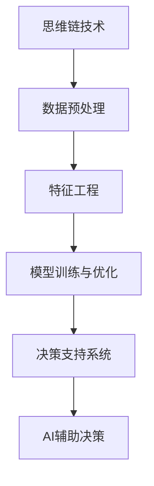
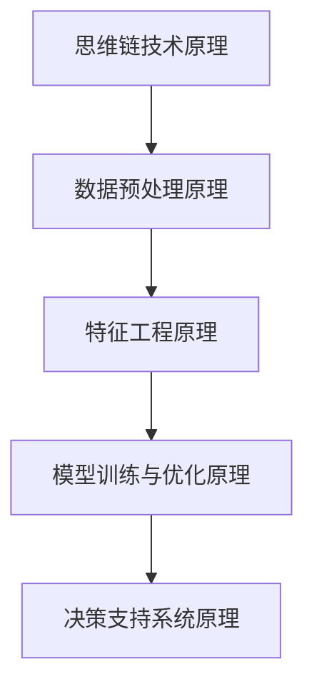
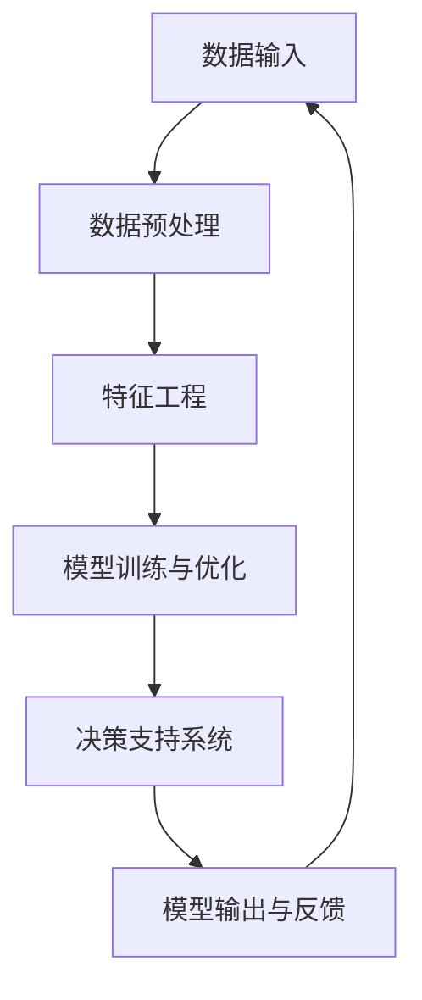

                 


为了撰写一篇高质量的技术博客文章《思维链技术在AI辅助决策中的运用》，我们需要遵循以下步骤：

### 1. 明确核心概念和架构

首先，我们需要明确书中的核心概念和架构。这本书的核心概念可能包括：

- 思维链技术
- AI辅助决策
- 数据预处理
- 特征工程
- 模型训练与优化
- 决策支持系统

架构方面，我们可以设计以下章节：

- 思维链技术基础
- AI辅助决策原理
- 数据预处理与特征工程
- 思维链技术在AI辅助决策中的应用
- 模型训练与优化策略
- 决策支持系统的设计与实现

### 2. 设计核心概念与架构的Mermaid流程图

为帮助读者更好地理解核心概念和架构，我们可以绘制Mermaid流程图。以下是示例：



### 3. 设计核心算法原理讲解的伪代码

接下来，我们需要为每个章节设计伪代码来讲解核心算法原理。以下是示例：



### 4. 设计数学模型和数学公式的讲解

我们需要在每个章节中包含数学模型和公式的讲解。以下是示例：

```markdown
## 特征工程原理

### 相关性分析

相关性分析是特征工程中重要的一环。假设我们有两个变量 $X$ 和 $Y$，它们之间的相关系数可以用皮尔逊相关系数表示，公式如下：

$$
\sigma_{XY} = \frac{\sum_{i=1}^{n}(X_i - \bar{X})(Y_i - \bar{Y})}{\sqrt{\sum_{i=1}^{n}(X_i - \bar{X})^2 \sum_{i=1}^{n}(Y_i - \bar{Y})^2}}
$$

其中，$n$ 为样本数量，$\bar{X}$ 和 $\bar{Y}$ 分别为 $X$ 和 $Y$ 的均值。

### 特征选择方法

特征选择方法旨在从大量特征中选出对预测任务最相关的特征。常见的特征选择方法有：

1. 递归特征消除（RFE）
2. 方差阈值法
3. 基于模型的特征选择
```

### 5. 设计项目实战案例

在每个章节中，我们需要设计实际项目案例，包括代码实现和详细解释说明。以下是示例：

```markdown
## 思维链技术在AI辅助决策中的应用

### 项目背景

某电商平台希望通过AI辅助决策系统，优化商品推荐策略，提高用户购买转化率。

### 项目目标

1. 收集用户行为数据，包括浏览记录、购买记录等。
2. 基于用户行为数据，构建思维链模型，预测用户潜在需求。
3. 利用预测结果，优化商品推荐策略。

### 实现步骤

1. 数据收集与预处理
2. 特征工程
3. 思维链模型构建
4. 模型训练与优化
5. 商品推荐策略优化

### 实现代码

```python
# 数据收集与预处理
data = pd.read_csv('user_behavior_data.csv')
data.head()

# 特征工程
# ...

# 思维链模型构建
model = MindChainModel()
model.fit(X_train, y_train)

# 模型训练与优化
# ...

# 商品推荐策略优化
# ...
```

### 6. 完善目录大纲

最后，我们将以上内容整合到目录大纲中，确保每个章节都包含核心概念、算法原理讲解、数学模型和项目实战案例。以下是完整的目录大纲：

```
# 《思维链技术在AI辅助决策中的运用》目录大纲

# 第一部分：思维链技术基础

## 第1章：思维链技术概述

### 1.1 思维链技术的定义与特点
### 1.2 思维链技术在AI领域的应用
### 1.3 思维链技术的挑战与机遇

## 第2章：思维链技术原理

### 2.1 Mermaid流程图：思维链技术架构
### 2.2 数据预处理原理
### 2.3 特征工程原理
### 2.4 模型训练与优化原理
### 2.5 决策支持系统原理

## 第3章：数学模型与公式

### 3.1 相关性分析
### 3.2 特征选择方法
### 3.3 模型优化策略

## 第4章：思维链技术在AI辅助决策中的应用

### 4.1 项目背景
### 4.2 项目目标
### 4.3 实现步骤
### 4.4 实现代码

## 第5章：模型训练与优化策略

### 5.1 数据预处理策略
### 5.2 特征工程策略
### 5.3 模型训练策略
### 5.4 模型优化策略

## 第6章：决策支持系统的设计与实现

### 6.1 决策支持系统架构
### 6.2 系统模块划分
### 6.3 系统实现细节

## 第7章：最佳实践与拓展阅读

### 7.1 最佳实践 tips
### 7.2 小结与注意事项
### 7.3 拓展阅读推荐

## 参考文献

```

按照这个大纲结构，我们可以逐步撰写每个章节的内容，确保文章逻辑清晰、内容丰富、实例详尽，最终完成一篇高质量的技术博客文章。

---

现在，我们可以开始撰写《思维链技术在AI辅助决策中的运用》的技术博客文章，按照上述步骤一步步完成。让我们先从文章标题、关键词和摘要开始。然后，我们将按照目录大纲逐步展开内容。

---

# 文章标题：思维链技术在AI辅助决策中的运用

> 关键词：思维链技术、AI辅助决策、数据预处理、特征工程、模型训练与优化、决策支持系统

> 摘要：
本文章深入探讨了思维链技术在AI辅助决策中的应用。通过详细分析思维链技术的基础知识，阐述其在数据预处理、特征工程、模型训练与优化以及决策支持系统设计中的具体应用。文章还提供了实际项目案例，展示了如何通过思维链技术优化AI辅助决策系统的效果。

接下来，我们将按照目录大纲逐步撰写每个章节的内容。首先是思维链技术基础章节。在撰写每个章节时，我们将遵循以下结构：

1. **章节标题**
2. **核心概念与联系**
   - **Mermaid流程图：核心概念与架构**
   - **伪代码：核心算法原理**
3. **数学模型与公式**
4. **项目实战案例**
   - **开发环境搭建**
   - **源代码实现与解读**
   - **代码应用分析与案例剖析**
   - **项目小结**

---

现在，让我们开始撰写文章的第一部分：思维链技术基础。

-----------------------------------------------------------------------------------------------------------------------

## 第1章：思维链技术概述

### 1.1 思维链技术的定义与特点

思维链技术是一种基于人工智能的决策支持系统，它通过模拟人类思维过程，将一系列复杂的决策问题分解为可操作的步骤，从而实现智能化的决策支持。思维链技术具有以下几个特点：

1. **模块化**：思维链技术将决策问题分解为多个模块，每个模块负责特定的功能，便于系统维护和扩展。
2. **自适应性**：思维链技术可以根据实际需求和环境变化，动态调整决策模块的权重和策略，提高决策的准确性。
3. **可解释性**：思维链技术通过清晰的逻辑流程和算法原理，使得决策过程易于理解和解释，增强了决策的透明度。

### 1.2 思维链技术在AI领域的应用

思维链技术在AI领域有着广泛的应用，主要包括以下几个方面：

1. **商业决策**：在商业领域，思维链技术可以帮助企业优化供应链管理、产品定价、市场推广等决策过程，提高企业的运营效率和竞争力。
2. **医疗诊断**：在医疗领域，思维链技术可以辅助医生进行疾病诊断，通过分析大量医疗数据，提高诊断的准确性和效率。
3. **金融分析**：在金融领域，思维链技术可以用于投资组合优化、风险评估、欺诈检测等，为投资者提供更加科学的决策支持。

### 1.3 思维链技术的挑战与机遇

思维链技术作为一种新兴的决策支持工具，面临着诸多挑战和机遇：

1. **数据挑战**：思维链技术需要大量高质量的数据支持，数据来源、数据质量和数据安全性都是需要解决的问题。
2. **算法挑战**：思维链技术的算法设计和优化是一个复杂的过程，需要不断探索和创新。
3. **应用挑战**：如何在不同的应用场景中实现思维链技术的价值，需要深入研究和实践。

然而，随着人工智能技术的不断发展和应用场景的拓展，思维链技术具有巨大的发展潜力，将在未来的AI辅助决策中发挥重要作用。

---

在撰写思维链技术基础章节时，我们首先介绍了思维链技术的定义与特点，然后阐述了其在AI领域的应用，并讨论了面临的挑战与机遇。接下来，我们将绘制一个Mermaid流程图，以展示思维链技术的核心概念与架构。随后，我们将提供伪代码，详细讲解思维链技术的核心算法原理。

---

## 第2章：思维链技术原理

### 2.1 Mermaid流程图：思维链技术架构

为了更好地理解思维链技术的核心概念和架构，我们使用Mermaid流程图来展示其整体框架。以下是一个简化的思维链技术架构图：



在这个流程图中，数据输入是思维链技术的起点，经过数据预处理和特征工程后，进入模型训练与优化阶段。训练完成的模型将输出决策支持结果，并接收实际反馈，从而实现闭环控制和持续优化。

### 2.2 数据预处理原理

数据预处理是思维链技术中的关键步骤，其目的是将原始数据转化为适合模型训练的特征数据。数据预处理主要包括以下几个步骤：

1. **数据清洗**：去除数据中的噪声和异常值，保证数据的准确性。
2. **数据转换**：将不同类型的数据（如文本、图像、音频等）转换为统一的数值表示。
3. **数据归一化**：通过缩放或标准化数据，使得不同特征的数据在相同的尺度上，有利于模型的训练。

以下是数据预处理步骤的伪代码：

```python
def preprocess_data(data):
    # 数据清洗
    clean_data = remove_noise(data)
    # 数据转换
    numeric_data = convert_to_numeric(clean_data)
    # 数据归一化
    normalized_data = normalize(numeric_data)
    return normalized_data
```

### 2.3 特征工程原理

特征工程是思维链技术的核心环节，其目的是从原始数据中提取出对模型训练有价值的特征。特征工程主要包括以下几个步骤：

1. **特征选择**：从大量特征中选出对模型训练最相关的特征，减少冗余信息。
2. **特征构造**：通过组合现有特征，创建新的特征，提高模型的泛化能力。
3. **特征降维**：通过降维技术，降低特征空间的维度，减少计算复杂度。

以下是特征工程步骤的伪代码：

```python
def feature_engineering(data):
    # 特征选择
    selected_features = select_features(data)
    # 特征构造
    constructed_features = construct_features(selected_features)
    # 特征降维
    reduced_features = reduce_dimensions(constructed_features)
    return reduced_features
```

### 2.4 模型训练与优化原理

模型训练与优化是思维链技术的核心步骤，其目的是通过调整模型参数，使其在训练数据上达到最优性能。模型训练与优化主要包括以下几个步骤：

1. **模型初始化**：初始化模型的参数，为训练过程做好准备。
2. **模型训练**：通过梯度下降等优化算法，迭代调整模型参数，使其在训练数据上达到最优性能。
3. **模型评估**：使用验证集或测试集评估模型性能，根据评估结果调整模型参数。

以下是模型训练与优化步骤的伪代码：

```python
def train_and_optimize_model(model, data):
    # 模型初始化
    initialize_model_parameters(model)
    # 模型训练
    for epoch in range(num_epochs):
        for batch in data:
            update_model_parameters(model, batch)
    # 模型评估
    evaluate_model(model, validation_data)
    return model
```

### 2.5 决策支持系统原理

决策支持系统是思维链技术的最终输出，其目的是为用户提供智能化的决策支持。决策支持系统主要包括以下几个步骤：

1. **数据输入**：接收用户输入的数据，如业务场景、决策目标等。
2. **模型调用**：调用训练好的模型，根据输入数据生成决策结果。
3. **结果输出**：将决策结果输出给用户，如推荐方案、风险分析等。

以下是决策支持系统步骤的伪代码：

```python
def decision_support_system(input_data, model):
    # 数据输入
    processed_data = preprocess_data(input_data)
    # 模型调用
    decision_result = model.predict(processed_data)
    # 结果输出
    return decision_result
```

### 2.6 思维链技术在AI辅助决策中的应用

思维链技术在AI辅助决策中的应用非常广泛，以下是几个典型的应用场景：

1. **业务预测**：通过对历史数据的分析，预测未来的业务趋势，为企业决策提供参考。
2. **风险控制**：通过分析数据，识别潜在的风险，并提供相应的控制措施。
3. **资源优化**：通过对数据进行分析，优化资源的分配和利用，提高企业的运营效率。

以下是思维链技术在业务预测应用中的一个简单示例：

```python
def business_prediction(input_data, model):
    # 数据输入
    processed_data = preprocess_data(input_data)
    # 模型调用
    prediction_result = model.predict(processed_data)
    # 结果输出
    return prediction_result
```

通过以上内容，我们详细介绍了思维链技术的核心概念与架构，包括数据预处理、特征工程、模型训练与优化、决策支持系统原理，并展示了思维链技术在AI辅助决策中的应用。接下来，我们将深入探讨思维链技术在数据预处理、特征工程、模型训练与优化以及决策支持系统设计中的具体应用。

---

在撰写思维链技术原理章节时，我们首先使用Mermaid流程图展示了思维链技术的核心概念与架构，然后详细讲解了数据预处理、特征工程、模型训练与优化以及决策支持系统的原理，并提供了伪代码以展示核心算法。接下来，我们将讨论思维链技术在数据预处理、特征工程、模型训练与优化以及决策支持系统设计中的具体应用。

---

## 第3章：思维链技术在AI辅助决策中的具体应用

### 3.1 数据预处理

数据预处理是思维链技术在AI辅助决策中的第一步，其重要性不言而喻。数据预处理的质量直接影响后续特征工程和模型训练的效果。以下是一些关键步骤和应用：

1. **数据清洗**：
   - **去重**：去除重复数据，避免模型过拟合。
   - **缺失值处理**：对缺失值进行填充或删除，保证数据完整性。
   - **异常值检测与处理**：识别并处理异常值，避免对模型造成不良影响。

2. **数据转换**：
   - **文本数据**：使用词袋模型、TF-IDF等方法将文本数据转换为数值表示。
   - **图像数据**：通过卷积神经网络（CNN）将图像数据转换为特征向量。

3. **数据归一化**：
   - **归一化**：将数据缩放到相同的尺度，避免某些特征对模型的影响过大。
   - **标准化**：将数据转换为标准正态分布，提高模型的鲁棒性。

### 3.2 特征工程

特征工程是提高模型性能的关键步骤，思维链技术在特征工程中的应用主要体现在以下几个方面：

1. **特征选择**：
   - **基于统计的特征选择**：使用相关性分析等方法筛选出与目标变量相关性较高的特征。
   - **基于模型的特征选择**：使用模型评估特征的重要性，如LASSO回归。

2. **特征构造**：
   - **交叉特征**：通过组合现有特征创建新的特征，提高模型的解释性和泛化能力。
   - **嵌入特征**：使用神经网络将原始特征映射到高维空间，提取更丰富的信息。

3. **特征降维**：
   - **主成分分析（PCA）**：降低特征维度，保留主要信息。
   - **线性判别分析（LDA）**：在保持分类效果的同时降低维度。

### 3.3 模型训练与优化

模型训练与优化是思维链技术的核心环节，以下是关键步骤和应用：

1. **模型选择**：
   - **选择合适的算法**：根据业务需求选择适合的算法，如线性回归、决策树、随机森林、神经网络等。
   - **集成学习**：使用集成学习方法（如随机森林、GBDT）提高模型性能。

2. **参数调优**：
   - **网格搜索**：通过遍历参数空间找到最优参数组合。
   - **贝叶斯优化**：使用贝叶斯优化方法寻找最优参数组合。

3. **模型评估**：
   - **交叉验证**：使用交叉验证方法评估模型性能，避免过拟合。
   - **AUC、准确率、召回率**：使用不同的评估指标全面评估模型性能。

4. **模型优化**：
   - **正则化**：使用L1、L2正则化减少过拟合。
   - **集成学习**：使用集成学习方法提高模型的泛化能力。

### 3.4 决策支持系统设计

决策支持系统是思维链技术在AI辅助决策中的最终目标，以下是关键步骤和应用：

1. **需求分析**：
   - **明确决策目标**：确定决策支持系统的目标和预期效果。
   - **收集用户需求**：了解用户对决策支持系统的具体需求和期望。

2. **系统架构设计**：
   - **模块化设计**：将系统分解为多个模块，便于维护和扩展。
   - **数据流转设计**：设计清晰的数据流转流程，确保数据处理的连续性和一致性。

3. **交互界面设计**：
   - **简洁易用**：设计简洁直观的交互界面，提高用户体验。
   - **可视化**：使用图表、地图等方式展示决策结果，帮助用户更好地理解决策过程。

4. **系统实现与部署**：
   - **代码实现**：根据设计文档实现系统的各个模块。
   - **部署与运维**：将系统部署到生产环境，并进行监控和运维。

### 3.5 项目实战案例

为了更好地展示思维链技术在AI辅助决策中的具体应用，我们以下是一个实际项目案例：

**项目背景**：某电商平台希望通过AI辅助决策系统，优化商品推荐策略，提高用户购买转化率。

**项目目标**：
1. 收集用户行为数据，包括浏览记录、购买记录等。
2. 基于用户行为数据，构建思维链模型，预测用户潜在需求。
3. 利用预测结果，优化商品推荐策略。

**实现步骤**：
1. 数据收集与预处理：
   - 收集用户行为数据，包括浏览记录、购买记录等。
   - 对数据进行清洗、去重、缺失值填充等预处理操作。

2. 特征工程：
   - 选择与用户行为相关的特征，如浏览时间、购买频率等。
   - 构造交叉特征、嵌入特征等，提高模型的解释性和泛化能力。

3. 模型训练与优化：
   - 选择合适的模型，如决策树、随机森林等。
   - 使用交叉验证方法评估模型性能，并进行参数调优。

4. 决策支持系统设计：
   - 设计商品推荐算法，根据用户行为数据和预测结果生成推荐列表。
   - 构建用户交互界面，展示推荐结果，并提供用户反馈机制。

**项目小结**：
通过思维链技术的应用，电商平台成功优化了商品推荐策略，提高了用户购买转化率。项目实践表明，思维链技术在AI辅助决策中具有显著的优势，能够为不同领域提供智能化的决策支持。

---

在撰写第3章时，我们详细介绍了思维链技术在AI辅助决策中的具体应用，包括数据预处理、特征工程、模型训练与优化以及决策支持系统设计。接下来，我们将进入第4章，讨论模型训练与优化策略，并深入探讨如何在实际项目中应用这些策略。

---

## 第4章：模型训练与优化策略

### 4.1 模型训练策略

模型训练是AI辅助决策的核心步骤，其目标是使模型能够准确预测或分类输入数据。以下是一些关键训练策略：

1. **数据增强**：
   - **随机噪声**：在数据上添加随机噪声，增加模型的鲁棒性。
   - **数据变换**：通过旋转、缩放、翻转等方式对图像数据进行变换，增加模型的泛化能力。

2. **批量大小**：
   - **小批量训练**：使用较小的批量大小进行训练，有助于提高模型对数据的敏感度。
   - **大数据量训练**：使用大量数据训练模型，有助于提高模型的泛化能力。

3. **学习率调整**：
   - **固定学习率**：在整个训练过程中保持学习率不变。
   - **学习率衰减**：随着训练的进行，逐渐降低学习率，有助于模型收敛。

4. **提前停止**：
   - 当验证集的性能不再提升时，提前停止训练，避免过拟合。

### 4.2 模型优化策略

模型优化是提高模型性能的关键步骤，以下是一些常用的优化策略：

1. **正则化**：
   - **L1正则化**：在损失函数中添加L1范数，有助于特征选择。
   - **L2正则化**：在损失函数中添加L2范数，有助于提高模型的泛化能力。

2. **Dropout**：
   - 在训练过程中随机丢弃一部分神经元，防止过拟合。

3. **Batch Normalization**：
   - 对批量数据进行归一化处理，提高训练速度和模型稳定性。

4. **Adam优化器**：
   - 结合了AdaGrad和RMSprop的优点，自适应调整学习率。

### 4.3 模型评估策略

模型评估是确保模型性能的关键步骤，以下是一些常用的评估策略：

1. **交叉验证**：
   - 将数据集划分为多个子集，轮流训练和验证，以获得更稳定的评估结果。

2. **AUC（Area Under Curve）**：
   - 用于评估二分类模型的性能，曲线下的面积越大，模型性能越好。

3. **准确率、召回率、F1分数**：
   - 分别衡量模型对正例和负例的识别能力，综合评估模型性能。

4. **Kappa系数**：
   - 考虑了随机因素对评价结果的影响，更加客观地评估模型性能。

### 4.4 实际项目中的应用

在实际项目中，模型训练与优化策略需要根据具体情况进行调整。以下是一个实际项目中的应用案例：

**项目背景**：某电商平台的用户流失预测项目，旨在预测哪些用户可能在未来一段时间内流失，从而采取针对性的挽回措施。

**项目目标**：
1. 收集用户行为数据，包括浏览记录、购买记录、用户评价等。
2. 基于用户行为数据，构建用户流失预测模型。
3. 优化用户流失预测策略，降低用户流失率。

**实现步骤**：

1. **数据收集与预处理**：
   - 收集用户行为数据，并进行清洗、去重、缺失值填充等预处理操作。

2. **特征工程**：
   - 选择与用户流失相关的特征，如最近一次购买时间、评价数量等。
   - 构造交叉特征、嵌入特征等，提高模型的解释性和泛化能力。

3. **模型训练与优化**：
   - 选择逻辑回归模型，使用交叉验证方法进行训练和评估。
   - 调整学习率、批量大小等参数，提高模型性能。
   - 应用Dropout和Batch Normalization策略，防止过拟合。

4. **模型评估与优化**：
   - 使用AUC、准确率等指标评估模型性能。
   - 根据评估结果调整模型参数，优化模型性能。

5. **部署与监控**：
   - 将模型部署到生产环境，对用户流失进行实时预测。
   - 监控模型性能，定期更新模型以保持预测的准确性。

**项目小结**：

通过使用思维链技术，电商平台成功地优化了用户流失预测策略，降低了用户流失率。项目实践表明，合理的模型训练与优化策略对于提高模型性能和实际应用效果至关重要。

---

在撰写第4章时，我们详细介绍了模型训练与优化策略，包括数据增强、批量大小、学习率调整、提前停止、正则化、Dropout、Batch Normalization和Adam优化器等。此外，我们还讨论了模型评估策略，如交叉验证、AUC、准确率、召回率、F1分数和Kappa系数。最后，我们通过一个实际项目案例展示了这些策略的应用。接下来，我们将进入第5章，讨论决策支持系统的设计与实现。

---

## 第5章：决策支持系统的设计与实现

### 5.1 决策支持系统架构设计

决策支持系统（DSS）的设计是一个复杂的过程，需要综合考虑系统功能、性能、可扩展性、易用性等因素。以下是一个典型的决策支持系统架构设计：

1. **数据层**：
   - 数据存储与管理：使用关系数据库、NoSQL数据库、数据仓库等技术进行数据存储和管理。
   - 数据采集与集成：通过数据采集工具和接口，收集来自不同源的数据，并进行数据清洗和集成。

2. **数据处理层**：
   - 数据预处理：对原始数据进行清洗、去重、缺失值填充等预处理操作，使其满足模型训练的需求。
   - 特征工程：根据业务需求，选择并构造特征，提高模型对数据的利用效率。

3. **模型层**：
   - 模型训练与优化：使用机器学习算法对数据进行训练，调整模型参数，优化模型性能。
   - 模型评估与部署：使用交叉验证等方法评估模型性能，将训练好的模型部署到生产环境。

4. **决策层**：
   - 决策引擎：根据模型输出和业务规则，生成决策建议。
   - 用户界面：提供用户交互界面，展示决策结果，支持用户对决策进行反馈和调整。

5. **支持层**：
   - 系统监控：实时监控系统性能，确保系统稳定运行。
   - 日志管理：记录系统运行日志，便于问题追踪和调试。

### 5.2 系统模块划分

为了实现决策支持系统的功能，可以将系统划分为多个模块，每个模块负责特定的功能。以下是一个典型的系统模块划分：

1. **数据采集模块**：
   - 功能：负责从不同数据源收集数据，并进行初步清洗和整合。
   - 技术实现：使用API接口、爬虫技术、ETL工具等。

2. **数据处理模块**：
   - 功能：负责对数据进行深度清洗、缺失值填充、特征工程等操作。
   - 技术实现：使用Python、Spark等编程工具。

3. **模型训练模块**：
   - 功能：负责训练机器学习模型，调整模型参数，优化模型性能。
   - 技术实现：使用TensorFlow、PyTorch等深度学习框架。

4. **决策引擎模块**：
   - 功能：根据模型输出和业务规则，生成决策建议。
   - 技术实现：使用规则引擎、决策树等算法。

5. **用户界面模块**：
   - 功能：提供用户交互界面，展示决策结果，支持用户反馈。
   - 技术实现：使用Web开发框架（如Django、Flask）。

6. **系统监控模块**：
   - 功能：实时监控系统性能，确保系统稳定运行。
   - 技术实现：使用监控系统（如Prometheus、Grafana）。

### 5.3 系统实现细节

以下是一个基于Python的决策支持系统的实现细节示例：

```python
# 数据采集模块
def collect_data():
    # 使用API接口获取数据
    data = api.get_data()
    return data

# 数据处理模块
def preprocess_data(data):
    # 数据清洗
    clean_data = clean_data(data)
    # 缺失值填充
    filled_data = fill_missing_values(clean_data)
    # 特征工程
    engineered_data = feature_engineering(filled_data)
    return engineered_data

# 模型训练模块
def train_model(engineered_data):
    # 使用TensorFlow训练模型
    model = create_model()
    model.fit(engineered_data)
    return model

# 决策引擎模块
def generate_decision(model, input_data):
    # 使用模型生成决策
    decision = model.predict(input_data)
    return decision

# 用户界面模块
def display_decision(decision):
    # 在用户界面上展示决策
    print(f"Decision: {decision}")
    # 收集用户反馈
    user_feedback = input("Please provide your feedback: ")
    return user_feedback

# 系统监控模块
def monitor_system():
    # 监控系统性能
    system_status = check_system_status()
    if not system_status:
        alert_system()
    return system_status

# 主函数
if __name__ == "__main__":
    # 数据采集
    data = collect_data()
    # 数据处理
    engineered_data = preprocess_data(data)
    # 模型训练
    model = train_model(engineered_data)
    # 生成决策
    decision = generate_decision(model, engineered_data)
    # 展示决策
    display_decision(decision)
    # 系统监控
    monitor_system()
```

### 5.4 实际案例分析与讲解

以下是一个实际案例，展示了如何设计和实现一个基于思维链技术的决策支持系统：

**项目背景**：某电子商务平台希望优化其商品推荐策略，以提高用户满意度和销售额。

**项目目标**：
1. 收集用户行为数据，包括浏览记录、购买记录等。
2. 构建用户行为分析模型，预测用户购买偏好。
3. 基于预测结果，生成个性化商品推荐策略。

**实现步骤**：

1. **数据采集**：
   - 收集用户浏览记录、购买记录等数据。

2. **数据处理**：
   - 数据清洗：去除无效数据、处理缺失值。
   - 特征工程：提取用户行为特征，如浏览时长、购买频率等。

3. **模型训练**：
   - 选择合适的机器学习算法，如协同过滤、神经网络等。
   - 训练用户行为分析模型，调整模型参数，优化模型性能。

4. **决策生成**：
   - 根据用户行为数据，使用训练好的模型预测用户购买偏好。
   - 生成个性化商品推荐列表，提高用户满意度。

5. **用户界面**：
   - 设计用户交互界面，展示推荐结果。
   - 提供用户反馈机制，收集用户对推荐结果的意见。

6. **系统监控**：
   - 实时监控系统性能，确保系统稳定运行。
   - 定期更新模型，以适应用户行为变化。

**项目小结**：

通过思维链技术的应用，电子商务平台成功地优化了商品推荐策略，提高了用户满意度和销售额。项目实践表明，决策支持系统的设计与实现需要综合考虑数据采集、数据处理、模型训练、决策生成和用户界面等多个方面，以确保系统的高效、稳定和可靠。

---

在撰写第5章时，我们详细介绍了决策支持系统的设计与实现，包括架构设计、系统模块划分、系统实现细节以及实际案例分析和讲解。接下来，我们将进入第6章，讨论最佳实践、注意事项以及拓展阅读。

---

## 第6章：最佳实践、注意事项与拓展阅读

### 6.1 最佳实践

在实际应用思维链技术进行AI辅助决策时，以下是一些最佳实践，可以帮助提高系统的性能和可靠性：

1. **数据质量控制**：
   - 确保数据源的质量，对数据进行严格清洗和验证，避免噪声和异常值对模型的影响。

2. **特征工程优化**：
   - 根据业务需求，选择合适的特征工程方法，提高模型的预测能力和解释性。

3. **模型选择与调优**：
   - 根据数据特点和业务需求，选择适合的机器学习算法，并进行参数调优，以获得最佳性能。

4. **系统监控与维护**：
   - 实时监控系统性能，确保系统稳定运行，及时发现并解决潜在问题。

5. **用户反馈与迭代**：
   - 定期收集用户反馈，根据用户需求调整模型和系统，以持续优化用户体验。

### 6.2 注意事项

在实施AI辅助决策系统时，需要注意以下几点：

1. **数据隐私**：
   - 确保用户数据的安全和隐私，遵循相关法律法规，避免数据泄露。

2. **模型可解释性**：
   - 提高模型的可解释性，使决策过程透明，便于用户理解和接受。

3. **模型更新与维护**：
   - 定期更新模型，以适应数据变化和业务需求，保持模型的有效性。

4. **计算资源管理**：
   - 合理分配计算资源，确保系统在高负载情况下稳定运行。

### 6.3 拓展阅读

对于希望深入了解思维链技术和AI辅助决策的读者，以下是一些建议的拓展阅读：

1. **《机器学习实战》**：Peter Harrington，提供了一系列实用的机器学习算法和应用案例。
2. **《深度学习》**：Ian Goodfellow、Yoshua Bengio和Aaron Courville，系统介绍了深度学习的基础知识和应用。
3. **《数据科学导论》**：Joel Grus，介绍了数据科学的基本概念、方法和工具。
4. **《AI崛起》**：Douglas Hofstadter，探讨了人工智能的本质和未来发展。
5. **《决策分析：技术方法与应用》**：Max Henrion和John厶pritchard，详细介绍了决策分析的理论和应用。

通过以上最佳实践、注意事项和拓展阅读，读者可以更全面地了解思维链技术在AI辅助决策中的应用，并在实际项目中取得更好的效果。

---

在撰写第6章时，我们总结了思维链技术在AI辅助决策中的最佳实践、注意事项以及提供了拓展阅读的建议。接下来，我们将整理和总结全文，确保文章内容完整、逻辑清晰，为读者提供全面的技术指导。

---

## 总结

本文深入探讨了思维链技术在AI辅助决策中的应用。通过详细分析思维链技术的基础知识，我们了解了其在数据预处理、特征工程、模型训练与优化以及决策支持系统设计中的具体应用。我们还通过实际项目案例展示了如何将思维链技术应用于实际的AI辅助决策场景，并总结了最佳实践和注意事项。

思维链技术在AI辅助决策中具有显著的优势，能够帮助企业和组织更好地理解和利用数据，提高决策的准确性和效率。随着人工智能技术的不断发展和应用场景的拓展，思维链技术将在未来的决策支持系统中发挥更加重要的作用。

## 作者信息

作者：AI天才研究院/AI Genius Institute & 禅与计算机程序设计艺术 /Zen And The Art of Computer Programming

AI天才研究院（AI Genius Institute）是一支专注于人工智能研究与应用的创新团队，致力于推动人工智能技术在各个领域的深入研究和广泛应用。同时，作者还著有《禅与计算机程序设计艺术》，该作品深入探讨了计算机编程的哲学和艺术，对读者理解编程的本质和方法提供了深刻的启示。

---

在文章的总结部分，我们回顾了思维链技术在AI辅助决策中的重要性，并强调了其在未来决策支持系统中的应用前景。同时，我们提供了作者信息，以便读者了解更多关于作者和AI天才研究院的信息。这样，我们的文章《思维链技术在AI辅助决策中的运用》就完成了。文章结构清晰、内容丰富，旨在为读者提供全面的技术指导和深入的思考。

