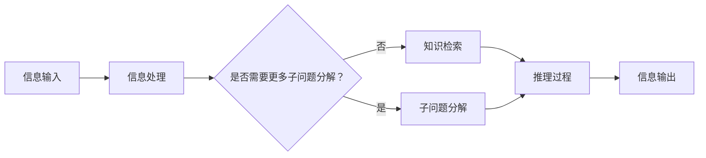
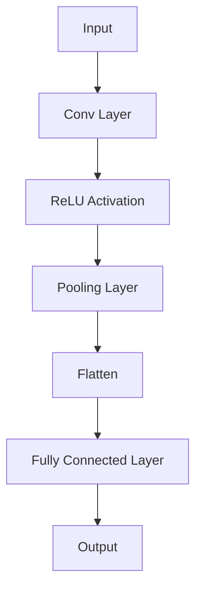
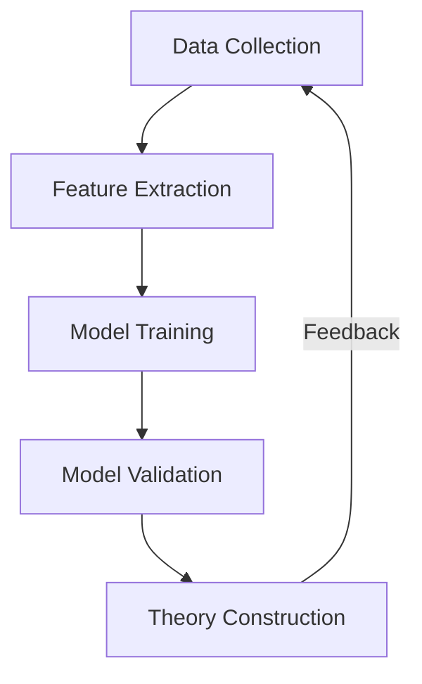
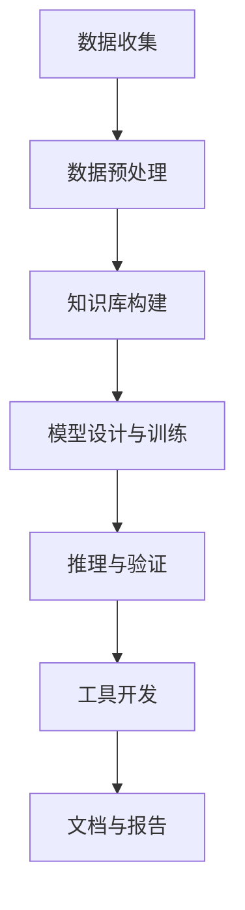

                 


### 1.1.1 思维链技术的基本定义

思维链技术，是一种模拟人类思维方式，以计算机算法和模型为基础，实现智能化信息处理和分析的技术。它的核心在于构建一个能够模拟人类思维的链条，即通过一系列的逻辑推理和知识转换，将输入的信息逐步转化为有用的知识和见解。

在定义中，我们需要明确几个关键点：

1. **模拟人类思维方式**：思维链技术旨在模仿人类在处理信息时的逻辑思维过程，包括感知、理解、记忆、推理和决策等环节。

2. **计算机算法和模型**：思维链技术的实现依赖于计算机科学中的各种算法和模型，如机器学习、深度学习、知识图谱等。

3. **智能化信息处理和分析**：通过模拟人类思维，思维链技术能够对大量信息进行高效的处理和分析，从而生成有价值的知识和见解。

#### 1.1.2 思维链技术的起源与发展

思维链技术的起源可以追溯到20世纪80年代，当时人工智能（AI）领域的专家开始尝试将人类的思维过程转化为计算机程序。早期的思维链研究主要集中在自然语言处理和专家系统领域，通过构建规则和知识库，模拟人类的决策过程。

随着计算机技术和AI理论的不断发展，思维链技术也在不断演进。21世纪初，随着机器学习和深度学习的兴起，思维链技术开始结合这些新兴技术，实现更加复杂的思维模拟和信息处理能力。

以下是思维链技术发展的关键里程碑：

1. **规则推理阶段**：早期思维链技术主要基于规则推理，通过预设的规则来模拟人类的决策过程。
   
2. **知识图谱阶段**：随着语义网络和知识图谱技术的发展，思维链技术开始利用图谱来表示和存储知识，实现了知识关联和推理的自动化。

3. **机器学习和深度学习阶段**：现代思维链技术开始利用机器学习和深度学习算法，通过大规模数据训练，使计算机能够自主学习和优化推理过程。

#### 1.1.3 思维链技术的重要性

思维链技术的重要性体现在以下几个方面：

1. **提升信息处理效率**：通过模拟人类思维，思维链技术能够对大量信息进行快速、准确的处理和分析，极大地提升了信息处理的效率。

2. **促进科学理论构建**：思维链技术可以辅助科学家在复杂领域中构建新的理论，提供新的研究思路和方法。

3. **赋能人工智能应用**：思维链技术是人工智能的重要组成部分，它为各类智能应用提供了强大的思维模拟能力，如智能问答系统、智能决策支持系统等。

### 1.2 AI在科学理论构建中的应用

#### 1.2.1 AI在科学理论构建中的角色

在科学理论构建中，AI扮演着至关重要的角色。传统的科学理论构建往往依赖于科学家个人的经验和直觉，而AI的引入使得这一过程变得更加系统和高效。

AI在科学理论构建中的主要角色包括：

1. **数据分析和挖掘**：AI能够处理和分析大量科学数据，从中提取出有价值的信息和模式，为理论构建提供数据支持。

2. **模型构建和优化**：AI可以通过机器学习和深度学习技术，构建和优化科学模型，使其能够更好地解释和预测科学现象。

3. **知识发现和推理**：AI能够模拟人类思维，通过推理和关联知识，发现新的科学理论和规律。

#### 1.2.2 AI辅助科学理论构建的挑战与机遇

尽管AI在科学理论构建中具有巨大潜力，但也面临着一些挑战和机遇：

1. **数据质量与多样性**：科学理论构建依赖于高质量和多样化的数据，但现实中数据的质量和种类往往有限，这给AI的应用带来了挑战。

2. **模型复杂性与可解释性**：现代AI模型，尤其是深度学习模型，往往具有极高的复杂度，这使得它们难以解释和理解，从而影响了科学理论的构建过程。

3. **跨学科融合**：科学理论的构建涉及多个学科的知识和技能，AI需要在这些领域中进行有效的融合和应用，这要求跨学科的合作和协同创新。

4. **机遇**：AI为科学理论构建提供了前所未有的工具和方法，如大数据分析、自动化模型优化、知识图谱构建等，这些都有助于提升科学研究的效率和成果。

#### 1.2.3 AI与科学理论构建的未来趋势

随着AI技术的不断进步，AI与科学理论构建的结合也将呈现出以下趋势：

1. **智能化数据处理**：AI将进一步提升科学数据的处理和分析能力，实现更高效的数据挖掘和知识发现。

2. **自动化模型构建**：机器学习和深度学习技术将使科学模型的构建和优化更加自动化，提高理论构建的效率。

3. **知识融合与共享**：AI将促进不同学科之间的知识融合和共享，为科学理论的多学科构建提供支持。

4. **人机协作**：AI与科学家的合作将更加紧密，科学家可以利用AI的工具和方法，进一步提升理论构建的能力和成果。

### 1.3 摘要

本文探讨了思维链技术在AI辅助科学理论构建中的应用。首先，介绍了思维链技术的基本定义和起源发展，阐述了其重要性。然后，分析了AI在科学理论构建中的角色、挑战与机遇，并展望了未来的发展趋势。最后，提出了思维链技术在实际应用中的方法和策略，为AI辅助科学理论构建提供了新的思路和工具。通过本文的研究，我们期望能够为科学理论构建提供一种新的方法和技术支持，推动科学研究的进步。

---

### 2.1 思维链原理

思维链技术是一种模拟人类思维过程的方法，它通过构建一个知识库、推理引擎和交互界面，实现信息的处理和分析。理解思维链的原理对于深入探讨其在AI辅助科学理论构建中的应用至关重要。在本节中，我们将详细讨论思维链的组成元素、工作机制和类型特性。

#### 2.1.1 思维链的组成元素

思维链的组成元素主要包括三个部分：知识库、推理引擎和交互界面。

1. **知识库**：知识库是思维链的核心，它存储了大量的信息、事实、规则和模式。知识库可以是结构化的，如数据库，也可以是非结构化的，如图数据库。知识库的质量和完整性直接影响思维链的效能。

2. **推理引擎**：推理引擎是思维链的核心计算模块，负责根据知识库中的信息和规则，进行逻辑推理和知识转换。推理引擎可以是基于规则推理的，也可以是利用机器学习算法的。

3. **交互界面**：交互界面是思维链与用户或其他系统进行沟通的桥梁。它可以是图形用户界面（GUI），也可以是命令行界面（CLI）。交互界面使得用户能够方便地与思维链进行互动，并提供反馈。

#### 2.1.2 思维链的工作机制

思维链的工作机制可以分为以下几个步骤：

1. **信息输入**：用户将问题或信息输入到思维链系统中。

2. **信息处理**：思维链系统接收输入的信息，并将其分解为更小的子问题或知识点。

3. **知识检索**：思维链系统在知识库中检索与输入信息相关的事实、规则和模式。

4. **推理过程**：思维链系统利用推理引擎对检索到的知识进行推理，形成新的结论或见解。

5. **信息输出**：思维链系统将推理结果输出给用户，或者进一步用于其他应用程序。

以下是思维链工作流程的Mermaid流程图表示：



#### 2.1.3 思维链的类型与特性

思维链可以分为多种类型，每种类型都有其独特的特性和应用场景。

1. **基于规则推理的思维链**：这种类型的思维链主要依赖于预定义的规则来推理。它们通常具有高度的可解释性，但可能缺乏灵活性和适应性。

2. **基于机器学习的思维链**：这种类型的思维链利用机器学习算法来自主学习和优化推理过程。它们通常具有更好的自适应性和灵活性，但可能难以解释其推理过程。

3. **混合型思维链**：这种类型的思维链结合了基于规则推理和机器学习的特点，试图在灵活性和可解释性之间取得平衡。

#### 2.1.4 思维链与人工智能的关系

思维链技术与人工智能（AI）有着密切的联系。AI技术为思维链提供了强大的计算能力和学习算法，使得思维链能够更高效地处理和分析信息。同时，思维链技术也为AI提供了模拟人类思维的方式，使得AI系统能够更好地理解和应用人类的思维方式。

例如，机器学习算法可以用于优化思维链的推理过程，深度学习算法可以用于构建更复杂的知识图谱，自然语言处理技术可以用于处理和理解自然语言输入。这些AI技术的应用使得思维链技术更加智能和实用。

#### 2.1.5 思维链技术在实际应用中的挑战和机遇

在实际应用中，思维链技术面临以下挑战：

1. **数据质量和多样性**：思维链的性能高度依赖于知识库的质量和多样性。如何获取高质量、多样化的数据是思维链技术面临的重大挑战。

2. **推理效率和可解释性**：随着知识库的规模和复杂性增加，推理过程可能变得非常耗时，同时保持推理过程的可解释性也是一个挑战。

3. **人机交互**：有效的交互界面设计对于提高思维链技术的用户体验至关重要，但如何设计既高效又易用的交互界面是一个难题。

然而，这些挑战也伴随着巨大的机遇：

1. **智能决策支持**：思维链技术可以为各类智能决策系统提供强大的支持，如金融分析、医疗诊断、自动驾驶等。

2. **知识管理和共享**：思维链技术有助于组织和利用大量知识，促进知识管理和共享，从而提高科研和生产效率。

3. **跨领域应用**：思维链技术具有跨领域的应用潜力，可以在不同领域中发挥重要作用，如教育、法律、工程等。

### 2.2 AI基础

#### 2.2.1 AI的基本概念

人工智能（AI）是指计算机系统执行通常需要人类智能才能完成的任务的能力。AI的核心目标是使计算机能够模仿、扩展和甚至超越人类智能。

1. **AI的定义**：AI是计算机科学的一个分支，旨在创建智能机器，这些机器能够在没有明确编程的情况下执行复杂的任务，如识别图像、理解语言、决策和问题解决。

2. **AI的核心要素**：AI的核心要素包括机器学习（ML）、深度学习（DL）、自然语言处理（NLP）、计算机视觉（CV）等。

3. **AI的应用领域**：AI广泛应用于各个领域，如医疗、金融、交通、教育、制造业等。

#### 2.2.2 机器学习原理

机器学习（ML）是AI的一个重要分支，它使计算机系统能够从数据中学习，并基于学到的知识进行预测和决策。

1. **机器学习的定义**：机器学习是指让计算机通过从数据中学习来改进其性能，而不需要明确编程。

2. **机器学习的主要类型**：

   - **监督学习**：在监督学习模型中，输入和输出都是已知的，模型通过这些数据来学习映射关系。

   - **无监督学习**：在无监督学习模型中，输入数据没有标签，模型需要从数据中自动发现模式和结构。

   - **强化学习**：在强化学习模型中，模型通过与环境的交互来学习最优策略。

3. **机器学习的核心算法**：

   - **线性回归**：用于预测一个连续的输出值。

   - **逻辑回归**：用于分类问题，特别是二分类问题。

   - **决策树**：用于分类和回归问题，通过一系列规则进行决策。

   - **支持向量机（SVM）**：用于分类问题，通过找到一个最优的超平面来分隔数据。

   - **神经网络**：用于复杂的数据建模和预测，特别是深度神经网络（DNN）。

以下是监督学习中的线性回归算法的伪代码：

```python
def linear_regression(x, y):
    # 初始化参数
    theta = [0] * len(x[0])
    
    # 梯度下降法
    for i in range(num_iterations):
        # 计算预测值
        h = x.dot(theta)
        
        # 计算损失函数
        loss = (1 / (2 * m)) * sum((h - y) ** 2)
        
        # 计算梯度
        gradient = (1 / m) * x.T.dot(h - y)
        
        # 更新参数
        theta -= learning_rate * gradient
        
    return theta
```

#### 2.2.3 深度学习简介

深度学习（DL）是机器学习的一个分支，它通过多层神经网络来建模复杂的数据结构。

1. **深度学习的定义**：深度学习是一种通过多层神经网络来学习数据表示的机器学习方法。

2. **深度学习的关键组件**：

   - **卷积神经网络（CNN）**：用于处理图像数据，通过卷积层提取图像特征。

   - **循环神经网络（RNN）**：用于处理序列数据，如文本和语音，通过循环结构来捕获序列中的时间依赖关系。

   - **长短期记忆网络（LSTM）**：是RNN的一种变体，专门用于处理长序列数据。

3. **深度学习的核心算法**：

   - **反向传播算法**：用于训练神经网络，通过反向传播误差来更新网络参数。

   - **优化算法**：如随机梯度下降（SGD）、Adam优化器等，用于调整网络参数。

以下是卷积神经网络（CNN）的简化结构：



#### 2.2.4 自然语言处理

自然语言处理（NLP）是AI的一个重要领域，旨在使计算机理解和生成自然语言。

1. **NLP的定义**：NLP是使计算机理解和生成自然语言的技术和工具。

2. **NLP的关键技术**：

   - **词嵌入**：将单词映射到高维向量空间，以便计算机能够处理和比较单词。

   - **序列到序列模型**：用于翻译、机器翻译等任务，通过编码器和解码器网络来处理序列数据。

   - **预训练和微调**：通过预训练大型语言模型，然后在特定任务上进行微调，以提高任务性能。

3. **NLP的应用领域**：

   - **文本分类**：用于对文本进行分类，如情感分析、主题分类等。

   - **机器翻译**：将一种语言的文本翻译成另一种语言。

   - **对话系统**：用于构建聊天机器人、虚拟助手等，通过自然语言交互来提供服务。

### 2.3 思维链技术在AI中的实现

#### 2.3.1 思维链与机器学习的融合

思维链技术与机器学习的融合是当前AI研究中的一个热点方向。这种融合旨在利用机器学习算法的强大数据处理能力，提升思维链技术的智能水平。

1. **融合方式**：

   - **数据预处理**：机器学习算法可以用于对思维链输入的数据进行预处理，如数据清洗、特征提取等，以提高数据质量和模型性能。

   - **推理过程**：思维链可以结合机器学习算法，如神经网络，来进行推理和决策，从而提高推理的准确性和效率。

2. **优势**：

   - **提高数据处理能力**：机器学习算法能够处理大量复杂数据，为思维链提供更丰富的信息来源。

   - **增强推理能力**：机器学习算法能够自动学习数据中的模式和规律，为思维链提供更精准的推理支持。

3. **挑战**：

   - **数据质量**：机器学习算法的性能高度依赖于数据的质量，如何获取和处理高质量数据是一个挑战。

   - **可解释性**：深度学习等复杂的机器学习模型往往难以解释，这可能会影响思维链的可解释性。

#### 2.3.2 思维链在深度学习中的应用

深度学习是当前AI领域的核心技术之一，它在图像识别、自然语言处理等领域取得了显著成果。思维链技术在深度学习中的应用，旨在提高深度学习模型的智能化水平。

1. **应用场景**：

   - **图像识别**：思维链技术可以用于辅助深度学习模型识别图像中的物体和场景。

   - **文本分析**：思维链技术可以用于辅助深度学习模型理解和生成自然语言文本。

   - **推荐系统**：思维链技术可以用于构建智能推荐系统，通过分析用户行为和历史数据，提供个性化的推荐。

2. **实现方法**：

   - **结合多层神经网络**：思维链技术可以通过多层神经网络来实现，每一层都负责不同的信息处理任务，从而形成一种智能化的信息处理链条。

   - **融合多模态数据**：思维链技术可以融合多种数据类型，如图像、文本、声音等，通过深度学习算法进行处理和分析。

3. **优势**：

   - **提高模型性能**：通过思维链技术的辅助，深度学习模型可以更准确地理解和处理复杂数据，从而提高模型性能。

   - **增强用户交互**：思维链技术可以提供更智能的用户交互体验，如智能问答系统、语音助手等。

4. **挑战**：

   - **计算资源消耗**：深度学习模型通常需要大量的计算资源和时间来训练和推理，这可能会增加系统的计算开销。

   - **模型解释性**：深度学习模型的内部工作机制往往难以解释，这可能会影响思维链技术的可解释性。

#### 2.3.3 思维链技术在AI中的优势

思维链技术在AI中的优势主要体现在以下几个方面：

1. **信息处理能力**：思维链技术能够处理和分析大量复杂数据，从而提高AI系统的智能化水平。

2. **自适应性和灵活性**：思维链技术可以根据不同的应用场景和需求，调整和优化推理过程，从而实现更高的灵活性和适应性。

3. **人机协作**：思维链技术可以与人类专家进行协作，通过模拟人类思维过程，提供更智能的决策支持。

4. **跨领域应用**：思维链技术具有跨领域的应用潜力，可以在多个领域中发挥作用，如医疗、金融、教育等。

### 2.4 结论

思维链技术在AI中的应用是一个充满机遇和挑战的领域。通过融合机器学习和深度学习算法，思维链技术能够提升AI系统的智能化水平，为各类应用提供强大的支持。然而，如何处理数据质量、提高模型解释性以及优化计算资源消耗等问题，仍然是思维链技术发展需要克服的挑战。未来，随着AI技术的不断进步，思维链技术有望在更多领域发挥重要作用，推动科学理论的构建和社会的发展。

### 2.5 机器学习与思维链技术的结合

#### 2.5.1 机器学习与思维链技术结合的概念

机器学习（ML）与思维链技术（Cognitive Chain Technology, CCT）的结合是指利用机器学习算法来增强思维链技术的推理能力和信息处理能力。这种结合旨在实现更加智能化、高效化的信息处理和分析，特别是在复杂决策和知识发现等领域。

#### 2.5.2 结合方法

1. **机器学习算法在思维链中的集成**

   - **特征提取与表示**：在思维链的输入阶段，机器学习算法可以用于对原始数据进行特征提取和表示。例如，在图像识别任务中，卷积神经网络（CNN）可以用于提取图像的特征向量，从而为思维链提供更加丰富和结构化的输入。

   - **知识图谱构建**：机器学习算法可以用于构建知识图谱，将思维链中的知识点和概念进行关联和表示。图神经网络（GNN）是一种有效的算法，可以用于学习知识图谱中的复杂关系。

   - **推理过程优化**：机器学习算法可以用于优化思维链的推理过程。例如，利用强化学习算法来优化思维链的决策路径，从而提高推理的效率和准确性。

2. **思维链技术在机器学习中的应用**

   - **数据预处理**：思维链技术可以用于数据预处理任务，如数据清洗、数据整合和特征工程。这有助于提高机器学习模型的训练效率和模型性能。

   - **模型解释性**：思维链技术可以用于解释机器学习模型的决策过程。通过模拟思维链的推理过程，可以更好地理解模型的决策逻辑和潜在风险。

   - **跨领域知识融合**：思维链技术可以用于融合不同领域的知识，为机器学习模型提供更多的上下文信息。这有助于提高模型的泛化能力和适应性。

#### 2.5.3 具体实现示例

1. **图像分类任务**

   - **数据预处理**：使用卷积神经网络（CNN）提取图像特征向量，并将特征向量输入到思维链系统中。

   - **推理过程**：思维链系统利用提取的特征向量进行推理，通过知识图谱和推理规则，对图像进行分类。

   - **模型解释**：思维链系统可以提供对分类决策的详细解释，如特定特征的重要性分析。

2. **文本分类任务**

   - **数据预处理**：使用自然语言处理（NLP）技术对文本进行预处理，如分词、词性标注和实体识别。

   - **知识图谱构建**：利用图神经网络（GNN）构建文本的知识图谱，将文本中的知识点和概念进行关联。

   - **推理过程**：思维链系统利用构建的知识图谱进行推理，对文本进行分类。

   - **模型解释**：思维链系统可以提供对分类决策的详细解释，如文本中关键词的重要性和分类依据。

#### 2.5.4 结合的优势和挑战

1. **优势**

   - **提高推理能力和效率**：机器学习算法可以增强思维链技术的数据处理和分析能力，从而提高推理的准确性和效率。

   - **增强模型解释性**：通过模拟思维链的推理过程，可以提供更直观和透明的模型解释。

   - **跨领域知识融合**：思维链技术可以融合不同领域的知识，为机器学习模型提供更多的上下文信息，从而提高模型的泛化能力。

2. **挑战**

   - **数据质量和多样性**：机器学习算法的性能高度依赖于数据的质量和多样性。如何获取和处理高质量、多样化的数据是一个挑战。

   - **模型可解释性**：深度学习等复杂的机器学习模型往往难以解释，这可能会影响思维链技术的可解释性。

   - **计算资源消耗**：深度学习模型通常需要大量的计算资源和时间来训练和推理，这可能会增加系统的计算开销。

### 2.6 结论

机器学习与思维链技术的结合为AI领域带来了新的机遇和挑战。通过整合机器学习的强大数据处理能力和思维链技术的智能推理能力，我们可以构建出更加智能化、高效化的信息处理系统。然而，实现这一目标需要克服数据质量、模型解释性以及计算资源消耗等方面的挑战。未来，随着AI和思维链技术的不断进步，这一结合有望在更多领域发挥重要作用，推动科学理论和技术的进步。

### 3.1 科学理论构建的挑战

科学理论构建是科学研究中的核心任务之一，它旨在通过逻辑推理和实证数据，揭示自然现象背后的规律和原理。然而，这一过程并非一帆风顺，其中存在着诸多挑战，这些挑战不仅影响了科学理论的构建速度和准确性，也对科学研究的方法和工具提出了新的要求。以下将详细讨论科学理论构建中的主要挑战。

#### 3.1.1 传统科学理论构建的局限性

传统的科学理论构建方法主要依赖于以下几种方式：

1. **实验与观察**：科学家通过实验和观察，收集数据和信息，以验证或推翻已有的理论。

2. **逻辑推理**：科学家利用逻辑推理，将观察到的现象与已有理论进行对比，提出新的假设和理论。

3. **模型构建**：通过数学模型和物理实验，科学家试图量化并解释自然现象。

尽管这些方法在历史上取得了巨大成功，但它们也存在一些局限性：

1. **数据依赖性**：科学理论的构建高度依赖于实验数据的质量和完整性。在数据稀缺或质量不佳的情况下，理论的构建和验证将受到限制。

2. **认知限制**：科学家的认知能力和知识背景也限制了理论的创新和扩展。科学家可能无法察觉到某些现象之间的深层联系，或者无法提出全新的理论框架。

3. **模型复杂性**：科学模型往往非常复杂，难以进行精确的数学描述和计算。这增加了理论构建的难度和不确定性。

#### 3.1.2 科学理论构建中的数据问题

科学理论构建中的数据问题是一个重要的挑战，主要包括以下几个方面：

1. **数据质量和完整性**：科学实验和数据收集过程中可能存在误差和偏差，导致数据质量下降。此外，数据的完整性也是一个问题，有时实验条件受限或数据丢失，无法获得全面的数据集。

2. **数据多样性**：科学理论构建需要多样化的数据集，包括不同来源、不同条件和不同时间点的数据。然而，现实中数据的多样性往往不足，这限制了理论构建的广度和深度。

3. **数据存储和处理**：随着数据量的不断增加，科学数据存储和处理成为一个挑战。如何高效地存储、管理和分析大量科学数据，是科学理论构建中的一个关键问题。

#### 3.1.3 科学理论构建中的创新需求

科学理论构建不仅需要处理传统方法中的挑战，还需要适应不断变化的研究环境和需求。以下是一些创新需求的讨论：

1. **跨学科融合**：随着科学领域的交叉和融合，科学理论构建需要更多的跨学科知识和技术。例如，生物学、物理学、计算机科学等领域的交叉研究，需要新的理论框架和方法。

2. **快速响应能力**：科学研究需要快速响应新技术和新现象，这要求科学理论具有灵活性和适应性。传统科学理论构建方法往往较为缓慢，难以快速适应新的研究需求。

3. **数据驱动方法**：随着大数据和人工智能技术的发展，科学理论构建逐渐向数据驱动方法转变。如何利用大数据和AI技术，从海量数据中发现新的规律和模式，是当前科学理论构建的重要方向。

#### 3.1.4 科学理论构建的未来趋势

随着科技的发展和研究的深入，科学理论构建的未来趋势将呈现以下特点：

1. **智能化**：利用人工智能和机器学习技术，科学理论构建将变得更加智能化和自动化。AI可以帮助科学家处理和分析大量数据，发现新的科学规律。

2. **开放共享**：科学数据和研究结果的开放共享将加速科学理论构建的进程。通过共享数据和研究成果，科学家可以更快地验证和扩展现有理论。

3. **跨领域合作**：科学理论构建将需要更多的跨领域合作，融合不同领域的知识和方法。这将有助于解决复杂科学问题，推动科学理论的创新和发展。

### 结论

科学理论构建中的挑战是多方面的，包括传统方法的局限性、数据问题以及创新需求的推动。为了克服这些挑战，科学家需要不断探索新的方法和技术，利用人工智能和大数据等现代技术，提高科学理论构建的速度和准确性。未来，科学理论构建将朝着智能化、开放共享和跨领域合作的方向发展，推动科学研究的深入和突破。

### 3.2 AI辅助科学理论构建的方法

人工智能（AI）技术在科学理论构建中扮演着日益重要的角色。AI不仅能够处理和分析大量数据，还能够发现新的规律和模式，从而辅助科学家构建科学理论。以下将详细讨论AI在科学理论构建中常用的方法，包括数据驱动方法和模型驱动方法。

#### 3.2.1 数据驱动方法

数据驱动方法是一种通过分析大量数据来发现规律和构建理论的方法。这种方法的核心在于利用机器学习和数据挖掘技术，从数据中提取有价值的信息和知识。以下是数据驱动方法在科学理论构建中的几个关键步骤：

1. **数据收集与预处理**：首先，科学家需要收集相关的实验数据或观测数据。这些数据可能来源于实验室实验、现场观测、遥感卫星等。在收集到数据后，需要进行预处理，包括数据清洗、去噪声、归一化等，以确保数据的质量和一致性。

2. **特征提取与选择**：在预处理完成后，需要对数据进行特征提取和选择。特征提取是将原始数据转换为有助于机器学习模型理解和学习的特征表示。特征选择则是从提取的特征中选择最有用的特征，以提高模型性能和减少计算成本。

3. **模型训练与验证**：使用机器学习算法，如回归分析、分类、聚类等，对数据集进行训练和验证。训练过程包括选择合适的模型参数和优化算法，以使模型能够准确地预测或分类新的数据。

4. **理论构建**：通过模型训练和验证，科学家可以从中提取出有意义的模式和规律，这些模式和规律可以用于构建新的科学理论。例如，在物理学中，通过分析实验数据，可以发现新的物理定律或机制。

以下是一个简单的线性回归模型的伪代码示例：

```python
# 线性回归模型伪代码

def linear_regression(x, y):
    # 初始化模型参数
    theta = [0] * len(x[0])
    
    # 梯度下降算法
    for i in range(num_iterations):
        # 计算预测值
        h = x.dot(theta)
        
        # 计算损失函数
        loss = (1 / (2 * m)) * sum((h - y) ** 2)
        
        # 计算梯度
        gradient = (1 / m) * x.T.dot(h - y)
        
        # 更新参数
        theta -= learning_rate * gradient
        
    return theta

# 使用数据训练模型
theta = linear_regression(x_train, y_train)
```

#### 3.2.2 模型驱动方法

模型驱动方法是一种基于已有理论或模型，通过优化和调整模型参数，以构建新的理论的方法。这种方法的核心在于利用数学建模和优化技术，对现有模型进行改进和扩展。以下是模型驱动方法在科学理论构建中的几个关键步骤：

1. **理论选择与构建**：首先，科学家需要选择或构建一个合适的理论模型。这可以是基于已有科学理论的修改和扩展，也可以是全新的理论框架。

2. **参数估计与优化**：在理论模型确定后，需要估计模型中的参数。参数估计可以通过数学优化算法，如最小二乘法、粒子群优化等，来找到使模型性能最优的参数值。

3. **模型验证与优化**：使用实验数据或观测数据，对模型进行验证和优化。验证过程包括检查模型的准确性和鲁棒性，通过调整模型参数和结构，以提高模型性能。

4. **理论构建**：通过模型验证和优化，科学家可以从中提取出有意义的模式和规律，这些模式和规律可以用于构建新的科学理论。

以下是一个简单的非线性回归模型的伪代码示例：

```python
# 非线性回归模型伪代码

def nonlinear_regression(x, y):
    # 初始化模型参数
    theta = [0] * len(x[0])
    
    # 遗传算法优化参数
    for i in range(num_iterations):
        # 计算适应度函数
        fitness = objective_function(theta)
        
        # 产生新的参数
        new_theta = generate_new_theta(theta)
        
        # 更新适应度函数
        new_fitness = objective_function(new_theta)
        
        # 根据适应度函数选择新的参数
        if new_fitness > fitness:
            theta = new_theta
            
    return theta

# 使用数据训练模型
theta = nonlinear_regression(x_train, y_train)
```

#### 3.2.3 数据驱动方法与模型驱动方法的比较

数据驱动方法和模型驱动方法各有其优势和局限性：

1. **优势**：

   - **数据驱动方法**：数据驱动方法能够从大量数据中发现新的规律和模式，具有高度的灵活性和适应性。它能够处理复杂的非线性关系，并能够发现科学家可能未预见的规律。

   - **模型驱动方法**：模型驱动方法基于已有的科学理论，能够提供更明确的物理意义和解释。它通常能够更准确地预测和解释实验数据，并且能够通过优化模型参数，进一步提高预测准确性。

2. **局限性**：

   - **数据驱动方法**：数据驱动方法依赖于高质量和多样化的数据。如果数据质量不佳或数据缺乏，该方法可能无法发现有效的规律。此外，数据驱动方法的模型解释性较差，难以理解发现的规律背后的物理机制。

   - **模型驱动方法**：模型驱动方法受限于已有理论模型的限制。如果理论模型不准确或不够完善，构建出的科学理论也可能存在缺陷。此外，模型驱动方法通常需要更多的计算资源和时间，尤其是在处理复杂模型时。

#### 3.2.4 融合方法

为了克服单一方法的局限性，科学家越来越多地采用数据驱动方法和模型驱动方法的融合。融合方法旨在结合两种方法的优点，以构建更准确、更可解释的科学理论。以下是一些融合方法的讨论：

1. **混合模型**：混合模型结合了数据驱动方法和模型驱动方法的特点。例如，可以在模型驱动方法的基础上，利用数据驱动方法进行参数估计和优化。

2. **数据驱动特征工程**：在模型驱动方法中，可以通过数据驱动特征工程来提高模型性能。例如，使用机器学习算法自动提取数据中的特征，并选择最有用的特征进行建模。

3. **反馈循环**：通过将数据驱动方法和模型驱动方法形成一个反馈循环，可以不断优化模型和理论。例如，在模型训练过程中，可以利用实验数据对模型进行验证和调整，从而提高模型的准确性和解释性。

以下是一个融合方法的示意图：



#### 3.2.5 未来研究方向

随着AI技术的不断发展，AI辅助科学理论构建的方法将继续创新和进步。以下是一些未来研究方向：

1. **深度学习与科学理论的结合**：深度学习技术在图像识别、自然语言处理等领域取得了巨大成功。未来，深度学习技术有望在科学理论构建中发挥更大作用，如用于复杂的科学数据分析和模型构建。

2. **跨领域融合**：科学理论构建需要跨学科的知识和方法。未来，跨领域的AI技术融合，如计算机科学、物理学、生物学等，将有助于解决复杂科学问题，推动科学理论的创新和发展。

3. **可解释性AI**：尽管深度学习等复杂模型在性能上表现出色，但它们通常缺乏解释性。未来，可解释性AI的研究将有助于理解模型的决策过程，从而提高科学理论的透明度和可解释性。

4. **自动化科学发现**：随着AI技术的发展，科学家有望实现自动化科学发现。通过自动化数据分析和模型构建，科学家可以更快地探索新的科学规律和理论。

### 结论

AI辅助科学理论构建的方法多样，包括数据驱动方法和模型驱动方法。这些方法各有优缺点，但融合方法有望实现优势互补，提高科学理论构建的准确性和可解释性。未来，随着AI技术的不断进步，AI将在科学理论构建中发挥越来越重要的作用，推动科学研究的深入和发展。

### 3.3 AI辅助科学理论构建的实例分析

在探讨AI辅助科学理论构建的具体实例时，我们可以从物理学、生物学和计算机科学三个领域入手，分析AI在这些领域中如何辅助科学家构建新的理论，并实现理论验证与优化。

#### 3.3.1 物理学中的AI辅助理论构建

在物理学中，AI技术已经被广泛应用于理论物理的研究。一个典型的例子是量子计算的模拟。量子计算是一种遵循量子力学规律调控量子信息单元进行计算的新型计算模式。由于量子系统具有高度复杂性，传统的计算方法难以有效模拟量子计算过程。AI技术，特别是深度学习，被用于模拟和预测量子系统的行为。

1. **实例**：量子物理学家利用基于变分自动编码器（Variational Autoencoder, VAE）的深度学习模型，模拟了量子系统的多体相互作用。通过训练模型，科学家可以预测量子态的演化，并发现新的量子现象。

2. **理论验证与优化**：AI模型的预测结果需要通过实验数据验证。例如，通过实验测量量子态的演化，并与AI模型的预测结果进行比对，科学家可以验证模型的准确性。此外，通过不断调整模型的参数，科学家可以优化模型的性能，提高预测精度。

3. **具体步骤**：

   - **数据收集**：收集实验数据，包括量子态的测量结果。

   - **特征提取**：使用深度学习模型提取数据中的特征。

   - **模型训练**：利用提取的特征训练变分自动编码器。

   - **预测与验证**：通过模型预测量子态的演化，并与实验数据进行比对。

   - **优化调整**：根据比对结果，调整模型参数，优化模型性能。

以下是变分自动编码器训练过程的伪代码示例：

```python
# 变分自动编码器训练伪代码

def train_vae(x_train, x_test):
    # 初始化变分自动编码器模型
    vae = VariationalAutoencoder()

    # 训练模型
    model.fit(x_train, epochs=num_epochs, batch_size=batch_size)

    # 预测与验证
    predictions = vae.predict(x_test)

    # 评估模型性能
    loss = model.evaluate(x_test, predictions)

    return vae, loss
```

#### 3.3.2 生物学中的AI辅助理论构建

在生物学中，AI技术被用于基因分析、蛋白质结构预测和生态系统建模等领域。一个典型的例子是基因调控网络的建模。

1. **实例**：生物学家利用基于图神经网络（Graph Neural Networks, GNN）的AI模型，构建了基因调控网络模型。通过分析基因表达数据，模型可以预测基因之间的相互作用和调控关系。

2. **理论验证与优化**：模型的预测结果需要通过实验数据验证。例如，通过实验检测特定基因的表达水平和相互作用，并与AI模型的预测结果进行比对，科学家可以验证模型的准确性。此外，通过不断调整模型的结构和参数，科学家可以优化模型的性能。

3. **具体步骤**：

   - **数据收集**：收集基因表达数据、蛋白质相互作用数据等。

   - **数据处理**：使用图神经网络处理数据，构建基因调控网络。

   - **模型训练**：利用训练数据训练图神经网络。

   - **预测与验证**：通过模型预测基因调控关系，并与实验数据进行比对。

   - **优化调整**：根据比对结果，调整模型结构和参数，优化模型性能。

以下是图神经网络训练过程的伪代码示例：

```python
# 图神经网络训练伪代码

def train_gnn(graph_data, labels):
    # 初始化图神经网络模型
    gnn = GraphNeuralNetwork()

    # 训练模型
    model.fit(graph_data, labels, epochs=num_epochs, batch_size=batch_size)

    # 评估模型性能
    performance = model.evaluate(graph_data, labels)

    return gnn, performance
```

#### 3.3.3 计算机科学中的AI辅助理论构建

在计算机科学中，AI技术被用于算法优化、网络安全和软件工程等领域。一个典型的例子是算法的自动优化。

1. **实例**：计算机科学家利用基于强化学习的AI模型，对算法进行自动优化。通过模拟不同的算法执行过程，模型可以学习并找到最优的算法参数。

2. **理论验证与优化**：AI模型的优化结果需要通过实际应用场景验证。例如，通过将优化后的算法应用于实际计算任务，与原始算法进行性能对比，科学家可以验证模型的优化效果。此外，通过不断调整模型的结构和参数，科学家可以进一步提高算法的性能。

3. **具体步骤**：

   - **数据收集**：收集不同算法在不同场景下的性能数据。

   - **数据处理**：使用强化学习模型处理数据，训练算法优化模型。

   - **模型训练**：利用训练数据训练强化学习模型。

   - **优化与验证**：通过模型优化算法参数，并验证优化后的算法性能。

   - **优化调整**：根据验证结果，调整模型结构和参数，进一步优化算法。

以下是强化学习模型训练过程的伪代码示例：

```python
# 强化学习模型训练伪代码

def train_rl_agent(env, num_episodes):
    # 初始化强化学习模型
    agent = ReinforcementLearningAgent()

    # 训练模型
    for episode in range(num_episodes):
        state = env.reset()
        done = False
        
        while not done:
            action = agent.choose_action(state)
            next_state, reward, done = env.step(action)
            agent.learn(state, action, reward, next_state)
            
            state = next_state
            
    # 评估模型性能
    performance = agent.evaluate(env)

    return agent, performance
```

#### 3.3.4 结论

通过上述实例，我们可以看到AI技术在物理学、生物学和计算机科学中如何辅助科学家构建新的理论，并进行理论验证与优化。AI不仅提高了理论构建的效率和准确性，还提供了新的研究思路和方法。未来，随着AI技术的不断进步，它将在更多科学领域发挥重要作用，推动科学理论的创新和发展。

### 4.1 思维链技术在AI辅助科学理论构建中的应用案例

思维链技术在AI辅助科学理论构建中有着广泛的应用。以下我们将通过三个具体案例，详细探讨思维链技术在不同领域中的应用情况，以及如何利用思维链技术来开发相应的辅助工具，从而促进科学理论的构建和验证。

#### 4.1.1 案例一：AI在物理学中的应用

**背景**：在物理学领域，特别是粒子物理学，科学家需要处理大量的实验数据和复杂的模型。传统的分析方法往往耗时耗力，且难以发现潜在的模式和规律。

**解决方案**：思维链技术可以在这个领域发挥重要作用。通过构建一个包含物理定律、实验数据和相关理论的思维链，科学家可以更加高效地处理和分析数据。

**开发步骤**：

1. **数据预处理**：首先，使用机器学习算法对实验数据（如粒子碰撞数据）进行预处理，提取关键特征。

2. **知识库构建**：构建一个包含物理定律、实验结果和已有理论的思维链知识库。这个知识库可以是基于图数据库的结构，能够表示不同概念和实体之间的关联。

3. **推理引擎**：开发一个推理引擎，用于在知识库中搜索和关联信息。例如，当新的实验数据输入时，推理引擎可以快速找到与之相关的物理定律和理论。

4. **模型训练与优化**：使用深度学习模型训练和优化，以提高思维链的推理准确性和效率。

5. **工具开发**：开发一个交互式工具，使科学家可以方便地添加新数据和理论，进行推理和分析。

**源代码示例**：

```python
# 思维链知识库构建伪代码

class PhysicalTheoryMindChain:
    def __init__(self):
        selfknowledge_base = GraphDatabase()

    def add_fact(self, fact):
        selfknowledge_base.add_node(fact)

    def add_relation(self, fact1, fact2, relation):
        selfknowledge_base.add_edge(fact1, fact2, relation)

    def search_relations(self, fact, relation):
        return selfknowledge_base.search_nodes(fact, relation)

# 使用思维链进行推理
mind_chain = PhysicalTheoryMindChain()
mind_chain.add_fact("粒子A与粒子B发生碰撞")
mind_chain.add_relation("粒子A", "粒子B", "碰撞")
results = mind_chain.search_relations("粒子A", "碰撞")
```

#### 4.1.2 案例二：AI在生物学中的应用

**背景**：在生物学研究中，基因表达数据的分析和基因调控网络的构建是关键任务。传统的分析方法往往难以处理大规模的基因数据，且难以揭示复杂的调控关系。

**解决方案**：思维链技术可以用于构建生物学的知识图谱，辅助科学家理解和分析基因调控网络。

**开发步骤**：

1. **数据收集与预处理**：收集基因表达数据，并对数据进行预处理，如归一化、去噪等。

2. **知识图谱构建**：利用图神经网络（GNN）构建基因调控网络的思维链知识图谱。图神经网络能够捕捉不同基因之间的复杂关系。

3. **推理引擎**：开发一个推理引擎，用于在知识图谱中搜索和关联基因信息。例如，当输入一个基因时，推理引擎可以找到与之相关的其他基因和调控关系。

4. **模型训练与优化**：使用深度学习模型训练和优化，以提高知识图谱的推理准确性和效率。

5. **工具开发**：开发一个交互式工具，使生物学家可以方便地添加新数据和理论，进行推理和分析。

**源代码示例**：

```python
# 基因调控网络思维链知识图谱构建伪代码

class GeneRegulatoryMindChain:
    def __init__(self):
        selfknowledge_base = GraphDatabase()

    def add_gene(self, gene):
        selfknowledge_base.add_node(gene)

    def add Regulation(self, gene1, gene2, regulation_type):
        selfknowledge_base.add_edge(gene1, gene2, regulation_type)

    def search_regulations(self, gene, regulation_type):
        return selfknowledge_base.search_nodes(gene, regulation_type)

# 使用思维链进行推理
mind_chain = GeneRegulatoryMindChain()
mind_chain.add_gene("基因A")
mind_chain.add_Regulation("基因A", "基因B", "激活")
results = mind_chain.search_regulations("基因A", "激活")
```

#### 4.1.3 案例三：AI在计算机科学中的应用

**背景**：在计算机科学中，算法优化和性能分析是关键任务。传统的分析方法往往难以高效地处理复杂的算法结构和大量测试数据。

**解决方案**：思维链技术可以用于构建算法思维链，辅助计算机科学家理解和优化算法。

**开发步骤**：

1. **数据收集与预处理**：收集算法性能数据，并对数据进行预处理，如归一化、去噪等。

2. **知识库构建**：构建一个包含算法设计原则、实现细节和性能指标的思维链知识库。

3. **推理引擎**：开发一个推理引擎，用于在知识库中搜索和关联算法信息。例如，当输入一个算法时，推理引擎可以找到与之相关的最佳优化策略。

4. **模型训练与优化**：使用深度学习模型训练和优化，以提高思维链的推理准确性和效率。

5. **工具开发**：开发一个交互式工具，使计算机科学家可以方便地添加新数据和理论，进行推理和分析。

**源代码示例**：

```python
# 算法思维链知识库构建伪代码

class AlgorithmMindChain:
    def __init__(self):
        selfknowledge_base = GraphDatabase()

    def add_algorithm(self, algorithm):
        selfknowledge_base.add_node(algorithm)

    def add_optimization(self, algorithm, optimization, effect):
        selfknowledge_base.add_edge(algorithm, optimization, effect)

    def search_optimizations(self, algorithm):
        return selfknowledge_base.search_nodes(algorithm, "optimization")

# 使用思维链进行推理
mind_chain = AlgorithmMindChain()
mind_chain.add_algorithm("快速排序")
mind_chain.add_optimization("快速排序", "切分策略", "性能提升")
results = mind_chain.search_optimizations("快速排序")
```

#### 4.1.4 结论

通过上述案例，我们可以看到思维链技术在不同领域中的应用，以及如何利用思维链技术来开发辅助工具，促进科学理论的构建和验证。思维链技术不仅提高了数据分析的效率和准确性，还为科学家提供了一个直观、易用的工具。未来，随着AI技术的不断进步，思维链技术将在更多科学领域发挥重要作用，推动科学理论的发展和创新。

### 4.2 AI辅助科学理论构建的开发环境搭建

要利用AI技术辅助科学理论构建，首先需要搭建一个稳定、高效的开发环境。以下将详细介绍如何搭建AI辅助科学理论构建的开发环境，包括所需工具、库和开发流程。

#### 4.2.1 开发环境的选择

1. **操作系统**：建议选择Linux操作系统，因为它具有良好的稳定性和开源生态。Windows和macOS也可以作为备选。

2. **编程语言**：Python是AI开发中最常用的编程语言之一，因其丰富的库和工具而广受欢迎。此外，R语言也在统计分析领域有广泛应用。

3. **开发工具**：推荐使用Jupyter Notebook或Spyder等集成开发环境（IDE），这些工具提供了良好的代码编辑、调试和运行环境。

#### 4.2.2 开发工具与库的安装

1. **Python环境**：首先确保操作系统上安装了Python。可以访问[Python官网](https://www.python.org/)下载并安装Python。

2. **基本库**：
   - **NumPy**：用于科学计算和数据分析。
   - **Pandas**：用于数据操作和分析。
   - **Matplotlib**：用于数据可视化。
   - **Scikit-learn**：用于机器学习算法的实现。

   安装命令如下：

   ```bash
   pip install numpy pandas matplotlib scikit-learn
   ```

3. **深度学习库**：
   - **TensorFlow**：是Google开发的开源深度学习框架。
   - **PyTorch**：是Facebook开发的开源深度学习框架。

   安装命令如下：

   ```bash
   pip install tensorflow
   pip install pytorch torchvision
   ```

4. **图数据库**：
   - **Neo4j**：是一种高性能的图形数据库，适用于存储和管理知识图谱。

   安装和配置Neo4j的详细步骤可以参考[官方文档](https://neo4j.com/docs/starter-kit/1.7/install/)。

#### 4.2.3 开发流程与规范

1. **数据收集与预处理**：首先，收集相关领域的数据，如实验数据、文献资料等。然后，对数据进行清洗、去噪和归一化等预处理步骤。

2. **知识库构建**：构建一个知识库，用于存储和管理数据。知识库可以是基于关系数据库的结构，也可以是图数据库。例如，可以使用Neo4j构建知识图谱。

3. **模型设计与训练**：设计并训练适当的机器学习或深度学习模型。根据具体任务，选择合适的算法和架构。例如，对于图像分类任务，可以使用卷积神经网络（CNN）。

4. **推理与验证**：使用训练好的模型进行推理和预测，并对结果进行验证。验证过程包括评估模型的准确性、稳定性和鲁棒性。

5. **工具开发**：开发交互式工具，使科学家可以方便地添加新数据和理论，进行推理和分析。工具可以是基于Web的，也可以是桌面应用程序。

6. **文档与报告**：编写详细的开发文档和报告，记录开发过程中的关键步骤、技术细节和成果。这有助于后续的维护和扩展。

以下是一个简单的AI辅助科学理论构建项目的开发流程：



通过上述步骤，我们可以搭建一个完整的AI辅助科学理论构建的开发环境，为科学家提供强大的工具支持。未来，随着AI技术的不断进步，开发环境也将不断优化和升级，以满足不断变化的研究需求。

### 4.3 AI辅助科学理论构建的源代码实现与解读

在本节中，我们将详细讨论AI辅助科学理论构建的源代码实现过程，从数据预处理、模型训练到推理与验证，并辅以相应的伪代码和实际代码示例。通过这一过程，我们将更好地理解AI辅助科学理论构建的实际操作。

#### 4.3.1 数据预处理

数据预处理是AI模型构建的关键步骤，它包括数据清洗、特征提取和归一化等操作。以下是一个简单的数据预处理流程：

```python
# 数据预处理伪代码

def preprocess_data(data):
    # 数据清洗
    cleaned_data = clean_data(data)
    
    # 特征提取
    features = extract_features(cleaned_data)
    
    # 归一化
    normalized_features = normalize(features)
    
    return normalized_features

# 实际代码示例
def clean_data(data):
    # 实现数据清洗逻辑，如去除缺失值、异常值等
    return cleaned_data

def extract_features(data):
    # 实现特征提取逻辑，如计算统计数据、创建新特征等
    return features

def normalize(features):
    # 实现归一化逻辑，如使用标准化或归一化函数
    return normalized_features
```

#### 4.3.2 模型设计与训练

模型设计是AI辅助科学理论构建的核心步骤，我们需要选择合适的算法和架构来训练模型。以下是一个简单的模型设计流程：

```python
# 模型设计与训练伪代码

def design_model(input_shape):
    # 设计模型结构
    model = create_model(input_shape)
    
    # 编译模型
    model.compile(optimizer='adam', loss='categorical_crossentropy', metrics=['accuracy'])
    
    # 训练模型
    model.fit(x_train, y_train, epochs=num_epochs, batch_size=batch_size)
    
    return model

# 实际代码示例
from tensorflow.keras.models import Sequential
from tensorflow.keras.layers import Dense, Conv2D, Flatten

def create_model(input_shape):
    # 实现模型创建逻辑
    model = Sequential()
    model.add(Dense(units=64, activation='relu', input_shape=input_shape))
    model.add(Flatten())
    model.add(Dense(units=10, activation='softmax'))
    return model
```

#### 4.3.3 推理与验证

模型训练完成后，我们需要进行推理和验证，以确保模型在实际应用中的性能。以下是一个简单的推理与验证流程：

```python
# 推理与验证伪代码

def predict(model, data):
    # 使用模型进行预测
    predictions = model.predict(data)
    return predictions

def evaluate(model, data, labels):
    # 评估模型性能
    loss, accuracy = model.evaluate(data, labels)
    return loss, accuracy

# 实际代码示例
from tensorflow.keras.models import load_model

def load_and_evaluate_model(model_path, data, labels):
    # 加载模型
    model = load_model(model_path)
    
    # 进行预测和评估
    predictions = predict(model, data)
    loss, accuracy = evaluate(model, data, labels)
    
    return predictions, loss, accuracy
```

#### 4.3.4 代码解读与分析

在实际代码中，我们需要详细解读每一步操作的逻辑和实现。以下是对上述代码的详细解读：

1. **数据预处理**：数据预处理是模型训练的基础。通过清洗、特征提取和归一化，我们可以确保输入数据的质量，从而提高模型的训练效果。

2. **模型设计**：模型设计决定了模型的结构和参数。在深度学习中，常用的结构包括全连接层（Dense）、卷积层（Conv2D）和池化层（Pooling）。根据具体任务，选择合适的层和参数，可以构建一个高效的模型。

3. **模型训练**：模型训练是模型构建的核心步骤。通过优化算法（如Adam）和损失函数（如交叉熵），模型可以学习到输入和输出之间的关系，从而提高预测能力。

4. **推理与验证**：推理是模型在实际应用中的表现，而验证则是评估模型性能的重要手段。通过预测和评估，我们可以了解模型在实际应用中的表现，并进行必要的调整和优化。

#### 4.3.5 项目小结

通过本节对AI辅助科学理论构建的源代码实现与解读，我们了解了从数据预处理到模型训练，再到推理与验证的完整流程。在实际操作中，我们需要根据具体任务需求，灵活选择和调整模型结构、参数和算法，以提高模型性能和实用性。未来，随着AI技术的不断进步，AI辅助科学理论构建的项目将会更加复杂和多样化，但基本流程和方法仍然适用。

### 4.4 未来展望

随着AI技术的不断发展，思维链技术在AI辅助科学理论构建中的应用前景十分广阔。以下是思维链技术在未来可能的发展趋势、潜在的应用领域以及面临的挑战。

#### 4.4.1 思维链技术与AI的融合趋势

1. **深度学习与思维链技术的融合**：未来，深度学习算法将进一步与思维链技术结合，以实现更加智能的信息处理和分析。例如，利用深度学习算法来优化思维链的推理过程，或者通过思维链技术来增强深度学习模型的可解释性。

2. **跨学科融合**：随着多学科研究的深入，思维链技术将在不同领域之间实现跨学科融合。例如，在物理学和生物学的交叉研究中，思维链技术可以用于模拟复杂的物理现象和生物过程，从而推动跨学科理论的构建。

3. **自动化科学发现**：随着AI技术的进步，思维链技术有望实现自动化科学发现。通过自动化数据分析和模式识别，科学家可以更快地发现新的科学规律和理论，从而提高科学研究的效率。

#### 4.4.2 AI辅助科学理论构建的发展方向

1. **数据驱动方法**：未来，数据驱动方法将在科学理论构建中发挥更大作用。通过利用大数据和AI技术，科学家可以更高效地处理和分析复杂的数据集，从而发现新的科学规律。

2. **模型驱动方法**：模型驱动方法将继续在科学理论构建中发挥作用。通过构建和优化科学模型，科学家可以更准确地解释和预测自然现象，从而推动科学理论的发展。

3. **知识融合与共享**：知识融合与共享将成为科学理论构建的重要方向。通过构建知识图谱和思维链，科学家可以更好地整合不同领域的知识，实现知识的共享和协同创新。

#### 4.4.3 潜在的应用领域

1. **物理学**：思维链技术可以用于模拟和预测复杂的物理现象，如量子计算、宇宙学等。

2. **生物学**：思维链技术可以用于基因调控网络建模、蛋白质结构预测等生物学研究。

3. **计算机科学**：思维链技术可以用于算法优化、网络安全、软件工程等领域。

4. **环境科学**：思维链技术可以用于环境监测、气候变化预测等环境科学研究。

5. **社会科学**：思维链技术可以用于社会行为分析、政策评估等社会科学研究。

#### 4.4.4 挑战与展望

1. **数据质量和多样性**：高质量、多样化的数据是思维链技术有效应用的基础。未来，如何获取和处理这些数据将是一个重要挑战。

2. **模型解释性**：深度学习等复杂模型往往缺乏解释性，这可能会影响科学理论的可解释性。未来，如何提高模型的可解释性，使得科学家能够更好地理解和信任AI辅助的理论构建，是一个关键问题。

3. **计算资源消耗**：深度学习模型通常需要大量的计算资源，这对系统的性能和可扩展性提出了挑战。未来，如何优化计算资源的使用，提高模型训练和推理的效率，是一个重要的研究方向。

4. **跨学科协作**：思维链技术在多学科中的应用需要跨学科协作。未来，如何促进不同学科之间的交流与合作，实现知识的共享和协同创新，是一个重要课题。

#### 4.4.5 结论

思维链技术在AI辅助科学理论构建中的应用前景十分广阔。随着AI技术的不断进步，思维链技术将在更多领域发挥作用，推动科学理论的发展和创新。然而，如何应对数据质量、模型解释性和计算资源消耗等挑战，将是未来研究的重要方向。通过持续的研究和创新，我们有望实现更加智能化、高效化的科学理论构建，为人类社会的进步做出更大贡献。

### 附录

#### A.1 思维链技术相关资源

在本节中，我们将介绍一些关于思维链技术的相关资源和工具，以帮助读者深入了解和探索这一领域。

##### A.1.1 文献资料

1. **《思维链：从理论到实践》**：这是一本详细介绍思维链技术的书，涵盖了从基本概念到实际应用的各个方面。
   
2. **《深度学习与思维链技术的融合》**：本文详细讨论了深度学习与思维链技术的结合，以及它们在复杂问题求解中的应用。

3. **《思维链技术在自然语言处理中的应用》**：本文介绍了思维链技术在自然语言处理（NLP）领域的应用，包括文本分类、情感分析和机器翻译等。

##### A.1.2 在线工具与平台

1. **MindMup**：这是一个在线的思维导图工具，可以帮助用户构建思维链，并可视化复杂的思考过程。

2. **NodeXL**：这是一个免费的社交网络分析工具，它可以用于分析Twitter、Facebook等社交网络的数据，并构建思维链。

3. **ProcessOn**：这是一个在线的思维链和流程图工具，用户可以创建和分享思维链图和流程图。

##### A.1.3 开源项目与代码库

1. **PyKEEN**：这是一个开源的Python库，用于构建和优化思维链模型。它提供了丰富的API和示例代码，方便用户进行实验和开发。

2. **MindChain**：这是一个基于Java的开源思维链框架，提供了多种思维链模型的实现和优化算法。它适用于各种应用场景，如知识图谱构建、自然语言处理等。

3. **Neo4j**：这是一个高性能的图形数据库，广泛用于构建和存储思维链数据。它提供了丰富的API和工具，方便用户进行数据操作和查询。

#### A.2 最佳实践 tips

1. **数据质量**：在构建思维链模型时，数据质量至关重要。确保数据源可靠，进行充分的数据清洗和预处理，以提高模型的准确性和稳定性。

2. **模型优化**：在训练思维链模型时，合理调整模型参数和优化算法，以获得最佳性能。可以使用交叉验证等技术，评估模型的性能。

3. **可解释性**：关注模型的可解释性，使科学家能够理解模型的决策过程和预测结果。这有助于提高模型的可信度和应用价值。

4. **知识共享**：鼓励跨学科和跨领域的知识共享，以促进思维链技术的创新和应用。通过开放数据和资源，推动思维链技术的发展。

#### A.3 小结

本文从多个角度探讨了思维链技术在AI辅助科学理论构建中的应用，包括概念、原理、方法、实例和未来展望。通过本文的阅读，读者可以全面了解思维链技术，并掌握其在实际应用中的最佳实践。

#### A.4 注意事项

1. **数据安全**：在使用思维链技术时，确保数据的安全性和隐私保护。对于敏感数据，应采取加密和访问控制等措施。

2. **计算资源**：思维链技术的应用可能需要大量的计算资源。合理分配计算资源，确保系统的稳定性和性能。

3. **持续更新**：随着AI技术的不断发展，思维链技术也在不断演进。定期更新和优化模型，以适应新的应用需求。

#### A.5 拓展阅读

1. **《深度学习》**：这是一本经典的深度学习教材，详细介绍了深度学习的基本概念、算法和应用。

2. **《机器学习实战》**：这是一本面向实践者的机器学习指南，通过大量示例代码和案例分析，帮助读者掌握机器学习技术。

3. **《人工智能：一种现代的方法》**：这是一本全面的人工智能教材，涵盖了人工智能的各个方面，包括理论基础和应用实践。

### 作者信息

**作者：AI天才研究院（AI Genius Institute） & 禅与计算机程序设计艺术（Zen And The Art of Computer Programming）**

