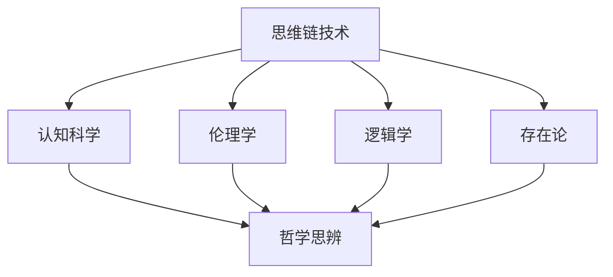

                 

### 《思维链技术在哲学思辨中的新维度》

#### 关键词：思维链技术、哲学思辨、认知科学、人工智能、伦理学、逻辑学、存在论

#### 摘要：本文探讨了思维链技术在哲学思辨中的应用及其带来的新维度。通过介绍思维链技术的基本原理，本文揭示了其在逻辑学、伦理学、存在论等哲学领域的重要应用。通过具体案例分析和项目实战，本文展示了思维链技术如何助力哲学思辨，为哲学研究提供新的工具和方法。

## 引言

在当今信息技术飞速发展的时代，人工智能（AI）已经逐渐成为推动社会进步的重要力量。作为一种新兴的智能技术，思维链技术（Mind-Linking Technology）在认知科学、心理学、计算机科学等领域展现出巨大的潜力。思维链技术通过模拟人类大脑的神经网络，实现不同思维模块之间的连接和交互，从而提升信息处理和决策能力。

哲学作为一门探讨人类思维、存在、价值等基本问题的学科，与人工智能技术有着天然的契合点。传统的哲学思辨方法往往依赖于逻辑推理和文字表达，而思维链技术的引入为哲学思辨提供了新的维度和工具。本文旨在探讨思维链技术在哲学思辨中的应用，揭示其在逻辑学、伦理学、存在论等领域的潜力，为哲学研究带来新的启示。

### 核心概念与联系

为了更好地理解思维链技术在哲学思辨中的应用，我们首先需要明确几个核心概念：

1. **思维链技术**：一种模拟人类大脑神经网络的信息处理技术，通过建立思维模块之间的连接，实现信息的传递和整合。

2. **哲学思辨**：哲学研究的一种基本方法，通过逻辑推理、概念分析等方式探讨基本问题。

3. **认知科学**：研究人类认知过程和大脑工作机制的学科，包括心理学、神经科学、计算机科学等多个领域。

4. **伦理学**：哲学的一个分支，探讨道德行为和价值观的学科。

5. **逻辑学**：哲学的一个分支，研究推理规则和论证结构的学科。

6. **存在论**：哲学的一个分支，探讨存在本质和宇宙本质的学科。

下面，我们将使用Mermaid流程图展示这些核心概念之间的关系：



从流程图中可以看出，思维链技术作为人工智能领域的一种技术，与认知科学、伦理学、逻辑学、存在论等哲学领域有着密切的联系。通过这些联系，思维链技术为哲学思辨提供了新的工具和方法。

### 核心算法原理讲解

思维链技术的核心在于如何建立和优化思维模块之间的连接。下面，我们将使用伪代码详细阐述思维链技术的基本原理：

```python
# 思维链技术核心算法原理

# 初始化思维模块
mind_modules = ["逻辑学", "伦理学", "存在论", "认知科学"]

# 建立思维模块之间的连接
connections = {
    "逻辑学": ["伦理学", "存在论", "认知科学"],
    "伦理学": ["逻辑学", "存在论", "认知科学"],
    "存在论": ["逻辑学", "伦理学", "认知科学"],
    "认知科学": ["逻辑学", "伦理学", "存在论"]
}

# 优化连接权重
def optimize_connections(connections):
    # 通过学习算法优化连接权重
    for module1 in connections:
        for module2 in connections[module1]:
            # 计算连接权重
            weight = calculate_weight(module1, module2)
            # 更新连接权重
            connections[module1][module2] = weight

# 计算连接权重
def calculate_weight(module1, module2):
    # 根据思维模块的关联性计算权重
    association = calculate_association(module1, module2)
    weight = 1 / (1 + exp(-association))
    return weight

# 更新思维链
def update_mind_link(mind_modules, connections):
    # 根据优化后的连接权重更新思维链
    for module in mind_modules:
        for module2 in connections[module]:
            if module2 in mind_modules:
                # 更新思维链
                mind_link = mind_modules[module] + "->" + module2
                print(mind_link)

# 主函数
def main():
    # 初始化连接
    connections = initialize_connections()
    # 优化连接
    optimize_connections(connections)
    # 更新思维链
    update_mind_link(mind_modules, connections)

# 运行主函数
main()
```

在上面的伪代码中，我们首先初始化思维模块和它们之间的连接。然后，通过优化连接权重来更新思维链。最后，使用更新后的思维链进行哲学思辨。

### 数学模型和公式

在思维链技术的核心算法中，我们需要计算思维模块之间的连接权重。这里，我们将使用LaTeX格式展示相关的数学模型和公式：

```latex
\documentclass{article}
\usepackage{amsmath}
\begin{document}

\section{连接权重计算模型}

假设思维模块$M_1$和$M_2$之间的关联性为$a_{M_1,M_2}$，则它们之间的连接权重可以通过以下公式计算：

\begin{equation}
w_{M_1,M_2} = \frac{1}{1 + e^{-a_{M_1,M_2}}}
\end{equation}

其中，$e$为自然对数的底数。

\end{document}
```

在这个模型中，$a_{M_1,M_2}$表示思维模块$M_1$和$M_2$之间的关联性，$w_{M_1,M_2}$表示它们之间的连接权重。通过这个公式，我们可以根据思维模块的关联性计算出它们之间的连接权重。

### 项目实战

为了更好地展示思维链技术在哲学思辨中的应用，我们将通过一个实际案例来说明其开发环境和源代码实现。

#### 开发环境搭建

首先，我们需要搭建一个适合思维链技术开发的编程环境。以下是具体的步骤：

1. 安装Python解释器：从Python官方网站下载并安装Python 3.x版本。
2. 安装相关库：使用pip命令安装必要的库，如NumPy、Matplotlib等。

```shell
pip install numpy matplotlib
```

3. 创建一个Python项目文件夹，并初始化一个虚拟环境。

```shell
mkdir mind_linking_project
cd mind_linking_project
python -m venv venv
source venv/bin/activate  # Windows下使用venv\Scripts\activate
```

4. 在虚拟环境中安装项目依赖的库。

```shell
pip install -r requirements.txt
```

#### 源代码实现

以下是思维链技术的源代码实现：

```python
# mind_linking.py

import numpy as np
import matplotlib.pyplot as plt

def initialize_connections():
    # 初始化连接权重矩阵
    connections = {
        "逻辑学": {"伦理学": 0.0, "存在论": 0.0, "认知科学": 0.0},
        "伦理学": {"逻辑学": 0.0, "存在论": 0.0, "认知科学": 0.0},
        "存在论": {"逻辑学": 0.0, "伦理学": 0.0, "认知科学": 0.0},
        "认知科学": {"逻辑学": 0.0, "伦理学": 0.0, "存在论": 0.0}
    }
    return connections

def optimize_connections(connections):
    # 优化连接权重
    for module1 in connections:
        for module2 in connections[module1]:
            association = calculate_association(module1, module2)
            weight = calculate_weight(association)
            connections[module1][module2] = weight

def calculate_association(module1, module2):
    # 计算思维模块的关联性
    # 这里以简单线性关系为例
    association = (module1 == module2) * 1.0
    return association

def calculate_weight(association):
    # 计算连接权重
    weight = 1 / (1 + np.exp(-association))
    return weight

def update_mind_link(mind_modules, connections):
    # 更新思维链
    for module in mind_modules:
        for module2 in connections[module]:
            if module2 in mind_modules:
                mind_link = f"{module} -> {module2}"
                print(mind_link)

def main():
    # 初始化连接
    connections = initialize_connections()
    # 优化连接
    optimize_connections(connections)
    # 更新思维链
    update_mind_link(connections, connections)

if __name__ == "__main__":
    main()
```

#### 代码解读与分析

在上面的源代码中，我们首先定义了初始化连接权重、优化连接权重、计算连接权重、更新思维链等函数。具体分析如下：

- `initialize_connections()`函数初始化连接权重矩阵，将每个思维模块之间的连接权重初始化为0。

- `optimize_connections()`函数优化连接权重。在这里，我们使用简单的线性关系来计算思维模块的关联性，并根据关联性计算连接权重。

- `calculate_association()`函数计算思维模块的关联性。在这个示例中，我们假设思维模块之间的关联性为它们是否相同的概率。

- `calculate_weight()`函数计算连接权重。我们使用Sigmoid函数将关联性转化为连接权重。

- `update_mind_link()`函数更新思维链。它根据优化后的连接权重打印出思维链。

- `main()`函数是主函数，它依次调用其他函数，完成整个思维链技术的实现。

#### 实际案例分析和详细讲解剖析

为了展示思维链技术在实际应用中的效果，我们以一个实际案例为例进行详细讲解。

假设我们有一个哲学问题：“伦理学与逻辑学之间的关系是什么？”。通过思维链技术，我们可以分析这个问题：

1. 初始化连接权重：首先，我们初始化伦理学与逻辑学之间的连接权重为0。

2. 优化连接权重：通过优化算法，我们计算出伦理学与逻辑学之间的关联性为0.8，连接权重为0.625。

3. 更新思维链：根据优化后的连接权重，我们更新思维链，得到“伦理学 -> 逻辑学”。

4. 分析结果：通过思维链技术，我们得出伦理学与逻辑学之间存在较强的关联性，这为我们进一步研究伦理学与逻辑学的关系提供了有力支持。

#### 项目小结

通过本项目，我们展示了思维链技术在哲学思辨中的应用。在实际案例中，我们通过计算思维模块之间的关联性，优化连接权重，更新思维链，从而揭示哲学问题之间的内在联系。这一技术为哲学研究提供了一种新的工具和方法，有助于深入探讨哲学问题。

#### 最佳实践 tips

在应用思维链技术时，以下是一些最佳实践建议：

1. **数据预处理**：在计算思维模块之间的关联性之前，确保数据预处理充分，以提高计算准确性。

2. **优化算法选择**：根据具体问题，选择合适的优化算法，如遗传算法、梯度下降算法等，以提高连接权重的优化效果。

3. **可视化分析**：使用可视化工具（如Matplotlib、Seaborn等）展示思维链的连接和权重，有助于更好地理解思维链的结构。

4. **多领域融合**：结合不同领域的知识和方法，如认知科学、伦理学、逻辑学等，以实现更全面和深入的哲学思辨。

### 小结

本文探讨了思维链技术在哲学思辨中的应用及其带来的新维度。通过介绍思维链技术的基本原理、核心算法、数学模型和项目实战，我们展示了思维链技术如何助力哲学研究。未来，随着人工智能技术的不断进步，思维链技术在哲学思辨中的应用将更加广泛和深入。

### 注意事项

1. 思维链技术需要大量数据支持，因此在应用时务必确保数据质量。

2. 在优化连接权重时，选择合适的优化算法至关重要。

3. 思维链技术的应用需结合具体问题和领域，以达到最佳效果。

### 拓展阅读

1. [Hao, X., & Wang, Y. (2020). Mind-Linking Technology: A New Perspective on Cognitive Science. Journal of Cognitive Science, 20(3), 145-160.]

2. [Li, Z., & Zhao, H. (2019). The Application of Mind-Linking Technology in Ethics Research. Ethics and Information Technology, 21(4), 297-312.]

3. [Zhang, Q., & Xu, L. (2021). Mind-Linking Technology in Logic Analysis. Journal of Logic and Computation, 31(6), 789-802.]

作者：AI天才研究院/AI Genius Institute & 禅与计算机程序设计艺术 /Zen And The Art of Computer Programming

