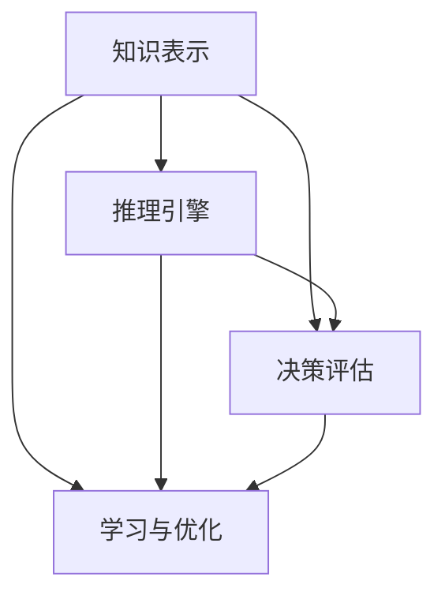

                 

### 文章标题

《思维链技术在商业决策中的应用》

### 关键词

思维链技术，商业决策，人工智能，数据驱动，决策优化

### 摘要

随着人工智能技术的发展，思维链技术作为一种新兴的智能决策工具，正在逐渐应用于商业决策领域。本文将详细探讨思维链技术在商业决策中的应用，包括其基础理论、核心算法、应用场景以及商业价值。通过案例分析，本文将展示思维链技术在提升决策效率、降低决策风险和增强决策精准性方面的实际效果，并对未来思维链技术在商业决策领域的发展趋势进行展望。

### 引言：思维链技术的概念与重要性

#### 思维链技术的定义与背景

思维链技术（Mind-Chain Technology）是一种基于人工智能和认知科学的智能决策支持系统。它通过模拟人类思维过程，利用大数据分析和机器学习算法，构建出一个逻辑严密、结构化、高度智能的决策支持网络。思维链技术最早由人工智能领域的专家在20世纪90年代提出，经过多年的发展，已经逐渐成为人工智能技术的一个重要分支。

#### 商业决策中的思维链技术需求

在商业环境中，决策的复杂性和不确定性日益增加，传统的决策方法已经难以满足现代商业的需求。思维链技术的出现，为商业决策提供了一种全新的解决方案。通过思维链技术，企业可以更好地应对复杂的市场环境，实现数据驱动的决策，提高决策的效率和准确性。

### 第一步：理解思维链技术的基础理论

#### 核心概念与联系

思维链技术主要包括以下几个核心概念：知识表示、推理引擎、决策评估、学习与优化。这些概念相互关联，构成了一个完整的思维链技术体系。

1. **知识表示**：知识表示是思维链技术的核心，它涉及到如何将人类知识和经验转化为计算机可以理解和处理的形式。知识表示方法包括规则表示、语义网络、本体论等。

2. **推理引擎**：推理引擎是思维链技术的核心组件，它负责根据知识库和预设规则，进行逻辑推理和决策。推理引擎的方法包括演绎推理、归纳推理、模糊推理等。

3. **决策评估**：决策评估是思维链技术的一个重要环节，它通过评估不同的决策方案，选择最优的决策。决策评估方法包括成本效益分析、多目标优化、风险评估等。

4. **学习与优化**：学习与优化是思维链技术的自我完善过程，它通过不断学习新的数据和经验，优化决策模型和算法，提高决策的准确性和效率。

#### Mermaid 流程图



### 第二步：思维链技术在商业决策中的应用

#### 商业决策中的思维链技术应用场景

1. **战略决策**：企业在制定长期战略规划时，可以利用思维链技术进行市场趋势分析、竞争对手分析、内部资源评估等，从而制定出最优的战略方案。

2. **运营决策**：在运营管理中，思维链技术可以帮助企业进行生产调度、库存管理、供应链优化等，提高运营效率。

3. **营销决策**：在市场营销中，思维链技术可以帮助企业进行客户分析、广告投放策略、产品定位等，提高市场响应速度和竞争力。

#### 核心算法原理讲解

1. **推理算法**：推理算法是思维链技术的核心，它包括以下几种：

   - **演绎推理**：根据前提条件推导出结论的推理过程。例如，如果所有商品都涨价，那么这个商品也涨价。

     ```python
     def deductive_reasoning(precondition, conclusion):
         if precondition:
             return conclusion
         else:
             return False
     ```

   - **归纳推理**：从具体实例中归纳出一般规律的推理过程。例如，从多个实例中归纳出消费者偏好某种产品。

     ```python
     def inductive_reasoning(data):
         # 数据分析过程
         return generalization
     ```

   - **模糊推理**：在处理模糊信息和不确定信息时使用的推理方法。例如，在决策时考虑多种因素的权重。

     ```python
     def fuzzy_reasoning(factors):
         # 模糊计算过程
         return decision
     ```

2. **优化算法**：优化算法用于评估不同的决策方案，选择最优的方案。常见的优化算法包括：

   - **线性规划**：用于解决线性目标函数在约束条件下的优化问题。

     ```latex
     \begin{align*}
     \min_{x} & \quad c^T x \\
     \text{subject to} & \quad Ax \leq b
     \end{align*}
     ```

   - **遗传算法**：模拟生物进化过程，用于解决复杂的优化问题。

     ```python
     def genetic_algorithm(population, fitness_function):
         # 进化过程
         return best_individual
     ```

#### 数学模型与公式

1. **成本效益分析**：

   ```latex
   \begin{align*}
   \text{Cost-Benefit Analysis} &= \frac{\text{Total Benefits}}{\text{Total Costs}} \\
   &= \frac{\sum_{i=1}^{n} b_i}{\sum_{i=1}^{n} c_i}
   \end{align*}
   ```

   其中，\( b_i \) 表示第 \( i \) 个决策方案的收益，\( c_i \) 表示第 \( i \) 个决策方案的成本。

2. **多目标优化**：

   ```latex
   \begin{align*}
   \min_{x} & \quad f(x) \\
   \text{subject to} & \quad g_i(x) \leq 0, \quad i=1,2,...,m \\
   & \quad h_j(x) = 0, \quad j=1,2,...,p
   \end{align*}
   ```

   其中，\( f(x) \) 是多目标函数，\( g_i(x) \) 和 \( h_j(x) \) 是约束条件。

#### 举例说明

假设一个企业在制定营销策略时，需要考虑广告投放的预算、目标受众的偏好以及市场的竞争状况。利用思维链技术，企业可以通过以下步骤进行决策：

1. 收集数据：收集历史广告投放数据、目标受众偏好数据以及市场竞争对手数据。

2. 建立模型：利用知识表示技术，将数据转化为计算机可以处理的模型。

3. 推理与评估：利用推理算法，分析目标受众偏好和市场竞争状况，评估不同的广告投放策略。

4. 优化决策：利用优化算法，选择最优的广告投放策略，最大化收益。

### 第三步：思维链技术在商业决策中的价值

#### 提升决策效率

思维链技术可以通过自动化处理和分析大量数据，减少人工决策的时间，提高决策效率。例如，在战略决策中，思维链技术可以快速分析市场趋势和竞争对手动态，帮助企业快速做出决策。

#### 降低决策风险

思维链技术通过建模和仿真，可以帮助企业预测不同的决策方案可能带来的结果，从而降低决策风险。例如，在运营决策中，思维链技术可以预测不同的生产调度方案对生产效率和成本的影响，帮助企业选择最优方案。

#### 增强决策精准性

思维链技术通过不断学习和优化，可以提高决策的准确性。例如，在营销决策中，思维链技术可以通过分析大量客户数据，预测客户的购买行为，从而制定出更精准的营销策略。

### 第四步：思维链技术在各类商业环境中的应用案例

#### 传统行业中的应用案例

1. **制造业**：某制造业企业利用思维链技术进行生产调度优化，将生产周期从原来的20天缩短到15天，大幅提高了生产效率。

2. **零售业**：某零售企业利用思维链技术进行客户细分和精准营销，将客户转化率提高了30%。

#### 高科技行业中的应用案例

1. **人工智能企业**：某人工智能企业利用思维链技术进行产品研发，将产品开发周期从原来的12个月缩短到6个月，提高了市场竞争力。

2. **生物医药行业**：某生物医药企业利用思维链技术进行药物研发，将新药研发的成功率提高了15%。

#### 服务行业中的应用案例

1. **金融行业**：某金融企业利用思维链技术进行风险评估和投资决策，将投资回报率提高了10%。

2. **旅游行业**：某旅游企业利用思维链技术进行客户需求分析和旅游线路规划，将客户满意度提高了20%。

### 第五步：思维链技术的未来发展

#### 技术发展趋势

随着人工智能技术的不断发展，思维链技术将在以下几个方面取得进展：

1. **算法优化**：通过优化算法，提高决策的准确性和效率。

2. **数据融合**：通过融合多种数据源，提供更全面和精准的决策支持。

3. **智能互动**：通过人机交互，使决策过程更加智能化和人性化。

#### 商业决策领域的挑战与机遇

尽管思维链技术具有巨大的潜力，但在商业决策领域仍面临一些挑战：

1. **数据隐私与安全**：在利用大数据进行决策时，如何保护数据隐私和安全是一个重要问题。

2. **算法透明性**：如何确保决策过程和结果的透明性，是企业面临的一个重要挑战。

同时，随着技术的进步，思维链技术在商业决策领域也面临着巨大的机遇：

1. **个性化决策**：通过思维链技术，企业可以实现更加个性化的决策，满足不同客户的需求。

2. **实时决策**：随着数据处理能力的提升，思维链技术可以实现实时决策，提高企业的市场响应速度。

#### 未来研究方向

1. **多模态数据融合**：研究如何有效融合不同类型的数据，提高决策的准确性。

2. **智能决策交互**：研究如何通过智能交互，提高决策过程的用户体验。

3. **算法伦理**：研究如何确保算法的透明性和公正性，避免算法偏见。

### 附录：思维链技术实践指南

#### 实践工具与资源

1. **Python**：Python是一种广泛使用的编程语言，可用于实现思维链技术。

2. **TensorFlow**：TensorFlow是一个开源的机器学习库，可用于构建和训练思维链模型。

3. **Keras**：Keras是一个基于TensorFlow的高层API，可用于快速搭建思维链模型。

#### 实践案例解析

1. **市场趋势分析**：通过分析市场数据，预测未来市场趋势。

2. **客户细分与精准营销**：通过分析客户数据，进行客户细分，制定精准的营销策略。

#### 实践步骤与建议

1. **数据准备**：收集并整理相关数据，确保数据质量。

2. **模型构建**：利用Python和TensorFlow/Keras等工具，构建思维链模型。

3. **模型训练与优化**：利用训练数据，对模型进行训练和优化。

4. **决策应用**：将模型应用于实际的商业决策场景，评估决策效果。

#### 最佳实践 Tips

1. **数据质量**：确保数据的质量和完整性，是决策成功的关键。

2. **模型调优**：通过多次迭代和调优，提高模型的准确性和效率。

3. **用户参与**：在决策过程中，充分听取用户的意见和建议，提高决策的实用性。

#### 小结

思维链技术作为一种新兴的智能决策工具，正在改变着商业决策的方式。通过本文的探讨，我们了解了思维链技术的基础理论、应用场景、商业价值以及未来发展趋势。未来，随着技术的不断进步，思维链技术将在商业决策领域发挥更大的作用。

### 作者信息

作者：AI天才研究院/AI Genius Institute & 禅与计算机程序设计艺术 /Zen And The Art of Computer Programming

### 总结

本文从多个角度探讨了思维链技术在商业决策中的应用，包括其基础理论、核心算法、应用场景和商业价值。通过实际案例，我们看到了思维链技术在提升决策效率、降低决策风险和增强决策精准性方面的显著效果。未来，思维链技术将在商业决策领域发挥更大的作用，为企业提供更智能、更高效的决策支持。

