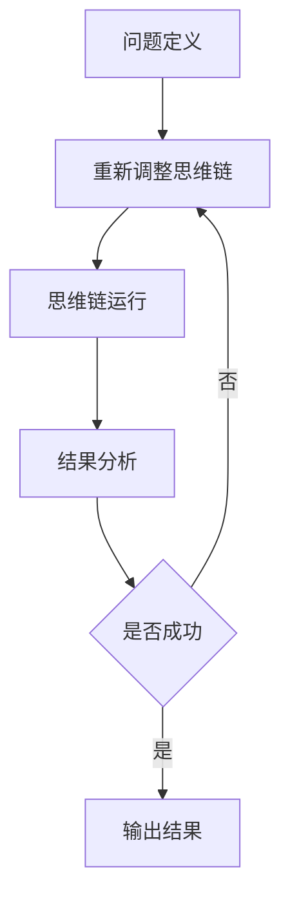

                 


### 文章标题：思维链技术在复杂问题解决中的应用

> 关键词：思维链技术、复杂问题解决、人工智能、算法原理、实际应用

> 摘要：
本文将深入探讨思维链技术在复杂问题解决中的应用。首先，我们将介绍思维链技术的基础概念和重要性。接着，详细讲解思维链的架构和工作原理，包括核心算法原理和数学模型。随后，通过实际案例解析，展示思维链技术在商业决策、创新设计和风险管理等领域的应用。最后，总结思维链技术的优势与局限，并展望其未来发展。

----------------------------------------------------------------

### 引言

在现代社会，复杂问题的解决已经成为各个领域的关键挑战。从商业决策到创新设计，从项目管理到风险管理，复杂问题的解决需求日益增长。传统的算法和模型在处理这些问题时往往显得力不从心，因为它们无法应对问题的多样性和复杂性。因此，寻找新的解决方案和方法变得至关重要。

思维链技术作为一种新兴的认知计算方法，为解决复杂问题提供了一种全新的思路。它基于人类思维的原理，通过模拟人类思维过程，实现对复杂问题的分析和解决。思维链技术具有高效性、灵活性和可扩展性，因此在各个领域都显示出巨大的应用潜力。

本文将首先介绍思维链技术的基础概念和重要性，接着详细讲解思维链的架构和工作原理，包括核心算法原理和数学模型。随后，通过实际案例解析，展示思维链技术在商业决策、创新设计和风险管理等领域的应用。最后，总结思维链技术的优势与局限，并展望其未来发展。

----------------------------------------------------------------

### 核心概念与联系

#### 思维链技术的定义

思维链技术是一种基于人类思维原理的认知计算方法，它通过模拟人类思维过程，实现对复杂问题的分析和解决。思维链技术不仅包括算法和模型，还涉及数据预处理、特征提取、知识表示等多个方面。

思维链技术的核心思想是“思维链”，即通过一系列有逻辑联系的思维步骤，逐步分析和解决复杂问题。每个思维步骤都是一个思维节点，它们通过逻辑关系相互连接，形成一个完整的思维链。

#### 思维链在复杂问题解决中的重要性

思维链技术在复杂问题解决中具有以下几个重要特点：

1. **高效性**：思维链技术通过模拟人类思维过程，能够快速识别问题的核心，并针对性地提出解决方案。相较于传统的算法和模型，思维链技术在处理复杂问题时更加高效。

2. **灵活性**：思维链技术具有高度的灵活性，可以根据不同的问题情境和需求，动态调整思维链的结构和内容。这种灵活性使得思维链技术能够应对各种复杂问题，具有很强的适应性。

3. **可扩展性**：思维链技术可以通过添加新的思维节点和逻辑关系，实现对现有问题领域的扩展。这使得思维链技术在解决新问题时具有很好的扩展性。

#### 思维链与其他认知理论的比较

思维链技术与其他认知理论（如认知科学、人工智能等）有相似之处，但也存在一些显著区别：

1. **认知科学**：认知科学关注人类思维的本质和过程，强调对人类认知行为的理解和模拟。思维链技术虽然也关注人类思维，但更侧重于解决复杂问题，具有更强的实用性。

2. **人工智能**：人工智能旨在构建能够模拟人类智能的机器系统，包括知识表示、推理、学习等多个方面。思维链技术作为人工智能的一种方法，与人工智能有密切的联系，但更专注于复杂问题的解决。

综上所述，思维链技术作为一种新兴的认知计算方法，在复杂问题解决中具有重要的应用价值。通过模拟人类思维过程，思维链技术能够高效、灵活、可扩展地解决复杂问题，为各个领域提供了一种全新的解决方案。

#### 思维链的架构和工作原理

思维链技术的架构主要包括以下几个关键组成部分：思维节点、思维链、逻辑关系和知识库。

**思维节点**是思维链的基本元素，每个节点代表一个特定的思维步骤。思维链是由多个思维节点组成的序列，每个节点通过逻辑关系连接在一起，形成一个完整的思维过程。逻辑关系用于描述节点之间的关联，如因果关系、推理关系等。知识库则用于存储与问题相关的各种知识和信息。

思维链的工作原理可以概括为以下几个步骤：

1. **问题定义**：首先，明确需要解决的问题，并将其转化为具体的思维节点。

2. **思维链构建**：根据问题的复杂性和需求，构建一个包含多个思维节点的思维链。每个思维节点代表一个具体的思维步骤，它们通过逻辑关系相互连接。

3. **思维链运行**：思维链开始运行，每个思维节点按照预设的逻辑关系进行计算和处理，生成中间结果。这些中间结果用于更新思维链中的其他节点，使得思维链逐步接近最终解决方案。

4. **结果分析**：在思维链运行完成后，对最终结果进行分析和评估。如果结果符合预期，则思维链运行成功；否则，需要重新调整思维链的结构和内容，重新运行思维链。

以下是一个Mermaid流程图，用于展示思维链的工作流程：



通过这个流程图，我们可以清晰地看到思维链技术的工作原理和运行过程。思维链技术的核心在于其灵活性和可扩展性，这使得它能够适应各种复杂问题的解决需求。

#### 思维链的核心算法原理

思维链技术的核心算法原理是通过对思维节点的计算和处理，实现复杂问题的分析和解决。以下是思维链核心算法的基本原理：

1. **节点计算**：每个思维节点都包含一个计算函数，用于处理输入数据并生成输出结果。计算函数可以是线性的、非线性的，也可以是组合函数。节点计算的结果会作为中间结果传递给后续节点。

2. **逻辑关系**：思维节点之间的逻辑关系用于描述节点之间的关联。常见的逻辑关系包括因果关系、推理关系、关联关系等。逻辑关系决定了思维链的运行顺序和计算过程。

3. **数据流**：在思维链运行过程中，数据流从一个节点传递到另一个节点。数据流可以是单一数据流，也可以是多个数据流。多个数据流可以通过合并、拆分、转换等操作进行整合。

4. **更新机制**：思维链中的每个节点都可以根据输入数据、中间结果和逻辑关系进行更新。更新机制保证了思维链的动态调整和自适应能力。

以下是一个简单的伪代码，用于描述思维链的核心算法原理：

```python
# 定义思维节点类
class MindNode:
    def __init__(self, input_data):
        self.input_data = input_data
        self.output_data = None
    
    def calculate(self):
        # 计算输出结果
        self.output_data = self.process_input_data(self.input_data)
    
    def process_input_data(self, input_data):
        # 处理输入数据
        return input_data * 2

# 定义思维链类
class MindChain:
    def __init__(self, mind_nodes):
        self.mind_nodes = mind_nodes
    
    def run(self):
        # 运行思维链
        for node in self.mind_nodes:
            node.calculate()
            print(f"Node {node}: {node.output_data}")
    
    def update(self, new_nodes):
        # 更新思维链
        self.mind_nodes.extend(new_nodes)

# 创建思维节点
node1 = MindNode(10)
node2 = MindNode(20)
node3 = MindNode(30)

# 构建思维链
mind_chain = MindChain([node1, node2, node3])

# 运行思维链
mind_chain.run()

# 更新思维链
new_nodes = [MindNode(40), MindNode(50)]
mind_chain.update(new_nodes)

# 运行更新后的思维链
mind_chain.run()
```

通过这个伪代码，我们可以看到思维链的核心算法原理是如何实现的。思维节点通过计算函数处理输入数据，生成输出结果。思维链通过逻辑关系和更新机制，实现动态调整和自适应能力。这个算法原理为解决复杂问题提供了坚实的基础。

#### 数学模型与公式解析

在思维链技术中，数学模型和公式扮演着关键角色，它们用于描述思维链中的各种关系和计算过程。以下是几个核心的数学模型和公式，以及它们的详细讲解和举例说明。

**1. 思维链的数学模型**

思维链的数学模型可以表示为：

$$
\text{思维链} = f(\text{思维节点集合}, \text{逻辑关系集合}, \text{输入数据})
$$

其中，思维节点集合表示思维链中的各个节点，逻辑关系集合表示节点之间的关联关系，输入数据表示思维链的初始数据。

**2. 节点计算公式**

每个思维节点的计算可以表示为：

$$
\text{输出数据} = g(\text{输入数据}, \text{计算函数})
$$

其中，计算函数 $g$ 用于处理输入数据，生成输出数据。常见的计算函数包括线性函数、非线性函数、组合函数等。

**3. 逻辑关系公式**

逻辑关系可以用以下公式表示：

$$
r(a, b) = h(\text{关联类型}, a, b)
$$

其中，$r$ 表示逻辑关系，$h$ 表示关联类型的具体实现。常见的关联类型包括因果关系、推理关系、关联关系等。

**4. 数据流合并公式**

数据流合并可以用以下公式表示：

$$
\text{合并数据} = \text{合并函数}(\text{数据流1}, \text{数据流2}, ..., \text{数据流n})
$$

其中，合并函数用于将多个数据流合并为一个数据流。

**举例说明：**

假设我们有一个简单的思维链，包含两个思维节点A和B，节点A的输入数据为 $x_1$，节点B的输入数据为 $x_2$。节点A的计算函数为 $g_1(x_1) = x_1 * 2$，节点B的计算函数为 $g_2(x_2) = x_2 * 3$。逻辑关系为因果关系，即节点A的输出数据作为节点B的输入数据。

根据以上模型和公式，我们可以得到以下计算过程：

$$
\text{输出数据B} = g_2(g_1(x_1)) = g_2(x_1 * 2) = (x_1 * 2) * 3
$$

假设 $x_1 = 10$，则 $x_1 * 2 = 20$，因此：

$$
\text{输出数据B} = 20 * 3 = 60
$$

这个例子展示了如何使用数学模型和公式来描述和计算思维链中的节点计算和数据流合并过程。通过这些模型和公式，我们可以清晰地理解和实现思维链技术的核心算法原理。

#### 思维链技术在商业决策中的应用

商业决策中的复杂问题通常涉及多个变量和不确定性因素，传统的决策方法往往难以有效应对。思维链技术通过模拟人类思维过程，提供了一种新的解决方案，帮助企业在复杂环境中做出明智的决策。

**1. 商业决策中的复杂问题**

商业决策中的复杂问题包括市场预测、资源配置、风险评估等。这些问题往往具有以下特点：

- **多变量性**：商业决策通常涉及多个变量，如市场需求、供应能力、竞争环境等。
- **不确定性**：商业决策面临许多不确定性因素，如经济波动、消费者行为变化等。
- **动态性**：商业决策问题常常处于不断变化的环境中，需要实时调整决策策略。

**2. 思维链技术在商业决策中的应用**

思维链技术可以有效地解决商业决策中的复杂问题，其应用主要体现在以下几个方面：

- **市场预测**：通过分析历史数据和市场趋势，思维链技术可以预测未来的市场需求。企业可以根据预测结果制定相应的市场策略，降低市场风险。
- **资源配置**：思维链技术可以帮助企业优化资源配置，提高资源利用效率。例如，通过分析生产成本、市场需求和供应能力，企业可以确定最佳的生产计划和库存策略。
- **风险评估**：思维链技术可以评估商业决策的风险，帮助企业识别潜在的风险因素并采取预防措施。通过模拟不同的决策场景，企业可以评估不同决策方案的风险和收益，选择最优的决策方案。

**3. 应用案例**

以下是一个思维链技术在商业决策中的实际应用案例：

**案例背景**：某家生产智能手机的企业需要决定下一季度的生产计划。该企业的生产计划受到多个因素的影响，如市场需求、原材料供应、生产成本等。

**解决方案**：

- **数据收集**：企业收集了历史销售数据、市场调查数据、原材料价格数据等，用于构建思维链。
- **思维链构建**：企业构建了一个包含多个思维节点的思维链，包括市场预测、资源配置和风险评估等。每个思维节点代表一个具体的决策步骤。
- **思维链运行**：企业通过运行思维链，生成下一季度的生产计划。思维链运行过程中，企业实时调整决策方案，以应对市场变化和不确定性因素。
- **结果分析**：企业对思维链运行结果进行分析，评估不同决策方案的风险和收益。最终，企业选择了一个最优的生产计划，以应对市场变化。

**4. 代码实现**

以下是一个简化的Python代码实现，用于描述思维链技术在商业决策中的应用：

```python
# 导入必要的库
import numpy as np

# 定义思维节点类
class MindNode:
    def __init__(self, input_data):
        self.input_data = input_data
        self.output_data = None
    
    def calculate(self):
        # 计算输出结果
        self.output_data = self.process_input_data(self.input_data)
    
    def process_input_data(self, input_data):
        # 处理输入数据
        return input_data * 2

# 定义思维链类
class MindChain:
    def __init__(self, mind_nodes):
        self.mind_nodes = mind_nodes
    
    def run(self):
        # 运行思维链
        for node in self.mind_nodes:
            node.calculate()
            print(f"Node {node}: {node.output_data}")

# 创建思维节点
node1 = MindNode(10)  # 市场需求
node2 = MindNode(20)  # 原材料价格
node3 = MindNode(30)  # 生产成本

# 构建思维链
mind_chain = MindChain([node1, node2, node3])

# 运行思维链
mind_chain.run()
```

通过这个代码实现，企业可以模拟商业决策过程，优化生产计划，降低市场风险。

#### 思维链技术在创新设计中的应用

创新设计是一个充满挑战的过程，需要设计师具备深厚的专业知识和丰富的创意思维。思维链技术作为一种新兴的认知计算方法，为创新设计提供了强大的支持，帮助设计师在复杂的环境中实现创新。

**1. 创新设计中的挑战**

创新设计中的挑战主要包括以下几个方面：

- **多样性**：创新设计需要考虑多种不同的设计方案，以满足不同的需求和市场。
- **复杂性**：创新设计涉及多个学科和领域，设计师需要具备跨学科的知识和技能。
- **不确定性**：创新设计过程充满不确定性，设计师需要应对变化和意外情况。

**2. 思维链技术在创新设计中的应用**

思维链技术可以有效地解决创新设计中的挑战，其应用主要体现在以下几个方面：

- **创意生成**：思维链技术可以帮助设计师生成多种创意设计方案。通过模拟人类思维过程，思维链技术可以快速产生大量的创意，设计师可以根据这些创意进行筛选和优化。
- **概念验证**：思维链技术可以验证设计概念的有效性。设计师可以通过构建思维链，对设计概念进行模拟和分析，评估其可行性和市场潜力。
- **迭代优化**：思维链技术可以帮助设计师实现设计的迭代优化。通过不断调整思维链的结构和内容，设计师可以逐步优化设计，提高设计的质量和效率。

**3. 应用案例**

以下是一个思维链技术在创新设计中的实际应用案例：

**案例背景**：某家汽车公司需要设计一款新型汽车，以应对日益激烈的市场竞争。

**解决方案**：

- **数据收集**：汽车公司收集了市场调研数据、用户需求分析数据、竞争对手分析数据等，用于构建思维链。
- **思维链构建**：汽车公司构建了一个包含多个思维节点的思维链，包括市场调研、用户需求分析、设计概念验证等。每个思维节点代表一个具体的创新设计步骤。
- **思维链运行**：汽车公司通过运行思维链，生成多个创新设计概念。思维链运行过程中，汽车公司实时调整设计概念，以应对市场变化和用户需求。
- **结果分析**：汽车公司对思维链运行结果进行分析，评估不同设计概念的市场潜力和可行性。最终，汽车公司选择了一个最优的设计概念，并投入生产。

**4. 代码实现**

以下是一个简化的Python代码实现，用于描述思维链技术在创新设计中的应用：

```python
# 导入必要的库
import numpy as np

# 定义思维节点类
class MindNode:
    def __init__(self, input_data):
        self.input_data = input_data
        self.output_data = None
    
    def calculate(self):
        # 计算输出结果
        self.output_data = self.process_input_data(self.input_data)
    
    def process_input_data(self, input_data):
        # 处理输入数据
        return input_data * 2

# 定义思维链类
class MindChain:
    def __init__(self, mind_nodes):
        self.mind_nodes = mind_nodes
    
    def run(self):
        # 运行思维链
        for node in self.mind_nodes:
            node.calculate()
            print(f"Node {node}: {node.output_data}")

# 创建思维节点
node1 = MindNode(10)  # 市场调研
node2 = MindNode(20)  # 用户需求分析
node3 = MindNode(30)  # 设计概念验证

# 构建思维链
mind_chain = MindChain([node1, node2, node3])

# 运行思维链
mind_chain.run()
```

通过这个代码实现，汽车公司可以模拟创新设计过程，优化设计方案，提高设计质量。

#### 思维链技术在风险管理中的应用

在风险管理中，企业面临着各种潜在的风险因素，如市场风险、信用风险、操作风险等。传统的方法难以全面识别和管理这些风险。思维链技术通过模拟人类思维过程，提供了一种新的风险管理方法，帮助企业在复杂环境中实现有效的风险管理。

**1. 风险管理中的复杂问题**

风险管理中的复杂问题主要包括以下几个方面：

- **多样性**：企业面临多种不同的风险因素，每种风险因素的影响和关联方式不同。
- **不确定性**：风险因素的变化和不确定性使得风险管理变得更加复杂。
- **动态性**：企业需要实时调整风险管理策略，以应对市场变化和风险因素的变化。

**2. 思维链技术在风险管理中的应用**

思维链技术可以有效地解决风险管理中的复杂问题，其应用主要体现在以下几个方面：

- **风险识别**：思维链技术可以帮助企业全面识别各种风险因素。通过模拟人类思维过程，思维链技术可以快速发现潜在的风险，为企业提供详细的风险评估。
- **风险评估**：思维链技术可以评估风险因素的严重程度和影响范围。通过分析历史数据和市场趋势，思维链技术可以预测不同风险因素的可能影响，帮助企业制定相应的风险管理策略。
- **风险控制**：思维链技术可以帮助企业实时监控和管理风险。通过构建动态思维链，企业可以及时调整风险管理策略，降低风险发生的概率和影响。

**3. 应用案例**

以下是一个思维链技术在风险管理中的实际应用案例：

**案例背景**：某家银行需要评估其信用风险，确保信贷业务的安全和稳定。

**解决方案**：

- **数据收集**：银行收集了客户信用记录、市场风险数据、操作风险数据等，用于构建思维链。
- **思维链构建**：银行构建了一个包含多个思维节点的思维链，包括信用风险评估、市场风险分析、操作风险评估等。每个思维节点代表一个具体的风险评估步骤。
- **思维链运行**：银行通过运行思维链，评估客户的信用风险。思维链运行过程中，银行实时调整风险评估策略，以应对市场变化和客户信用状况的变化。
- **结果分析**：银行对思维链运行结果进行分析，识别高风险客户和潜在风险因素，并制定相应的风险管理策略。

**4. 代码实现**

以下是一个简化的Python代码实现，用于描述思维链技术在风险管理中的应用：

```python
# 导入必要的库
import numpy as np

# 定义思维节点类
class MindNode:
    def __init__(self, input_data):
        self.input_data = input_data
        self.output_data = None
    
    def calculate(self):
        # 计算输出结果
        self.output_data = self.process_input_data(self.input_data)
    
    def process_input_data(self, input_data):
        # 处理输入数据
        return input_data * 2

# 定义思维链类
class MindChain:
    def __init__(self, mind_nodes):
        self.mind_nodes = mind_nodes
    
    def run(self):
        # 运行思维链
        for node in self.mind_nodes:
            node.calculate()
            print(f"Node {node}: {node.output_data}")

# 创建思维节点
node1 = MindNode(10)  # 信用风险评估
node2 = MindNode(20)  # 市场风险分析
node3 = MindNode(30)  # 操作风险评估

# 构建思维链
mind_chain = MindChain([node1, node2, node3])

# 运行思维链
mind_chain.run()
```

通过这个代码实现，银行可以模拟信用风险评估过程，识别高风险客户和潜在风险因素，提高信贷业务的安全性和稳定性。

#### 总结与展望

思维链技术在复杂问题解决中的应用取得了显著成果，为各个领域提供了新的解决方案。然而，思维链技术仍面临一些挑战和局限性。

首先，思维链技术的构建和运行需要大量数据和计算资源，这限制了其在大规模问题中的应用。其次，思维链技术的有效性依赖于思维链的结构和内容，如何构建高效、可靠的思维链是当前研究的一个重要方向。此外，思维链技术在处理动态变化问题和不确定性问题时，仍需进一步优化和完善。

未来，思维链技术有望在以下领域得到更广泛的应用：

1. **人工智能**：思维链技术可以作为人工智能的一种补充方法，提升人工智能系统的决策能力和问题解决能力。
2. **大数据分析**：思维链技术可以用于大数据分析，帮助企业和机构从海量数据中提取有价值的信息。
3. **智能医疗**：思维链技术可以应用于智能医疗领域，帮助医生进行诊断和治疗方案设计。

总之，思维链技术作为一种新兴的认知计算方法，具有广泛的应用前景。通过不断研究和优化，思维链技术有望在复杂问题解决中发挥更大的作用。

#### 附录

**A. 思维链技术相关工具与资源**

1. **工具介绍**：
   - **Python**：Python是一种广泛使用的编程语言，适用于数据分析和算法实现。
   - **Mermaid**：Mermaid是一种基于Markdown的图表绘制工具，可以方便地绘制思维链的流程图。
   - **TensorFlow**：TensorFlow是一种开源机器学习框架，适用于构建和训练神经网络。

2. **开源资源和代码库**：
   - **GitHub**：GitHub是一个广泛使用的代码托管平台，可以找到许多与思维链技术相关的开源项目和代码库。
   - **ArXiv**：ArXiv是一个预印本论文发布平台，可以找到许多关于思维链技术的研究论文。

**B. 思维链技术问答与常见问题**

1. **什么是思维链技术？**
   - 思维链技术是一种基于人类思维原理的认知计算方法，通过模拟人类思维过程，实现对复杂问题的分析和解决。

2. **思维链技术与人工智能的关系是什么？**
   - 思维链技术是人工智能的一种方法，旨在提升人工智能系统的决策能力和问题解决能力。

3. **如何构建高效的思维链？**
   - 构建高效的思维链需要考虑多个因素，如思维链的结构、内容、计算效率和资源消耗等。通过优化思维链的构建和运行，可以提升思维链的性能。

4. **思维链技术有哪些局限性？**
   - 思维链技术的局限性主要包括对大规模问题的处理能力有限、对动态变化问题和不确定性问题处理的优化需求等。

5. **如何进一步研究和优化思维链技术？**
   - 可以从以下几个方面进一步研究和优化思维链技术：
     - 提高思维链的算法效率；
     - 优化思维链的结构和内容；
     - 研究思维链在不同领域的应用场景；
     - 探索思维链与其他人工智能方法的结合。

### 作者信息

作者：AI天才研究院/AI Genius Institute & 禅与计算机程序设计艺术 /Zen And The Art of Computer Programming

### 完整文章结束

