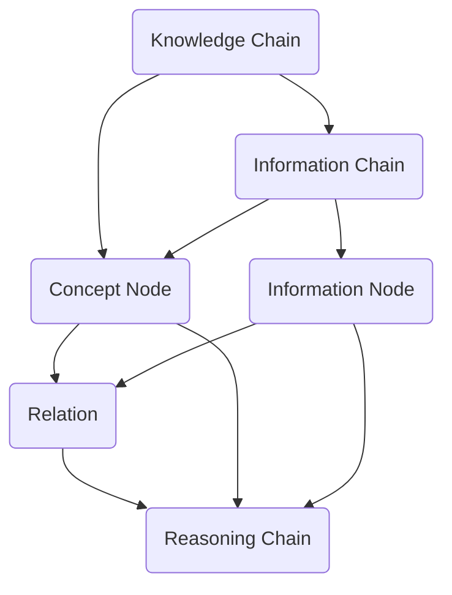
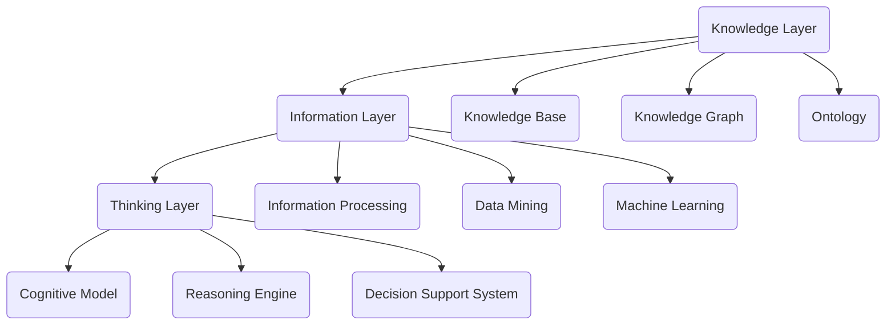

                 

### 引言与概述

在教育领域，评估学生的知识掌握程度和思维能力是教学过程中的关键环节。然而，传统的教育评估方法往往依赖于纸笔测试和面对面访谈，这些方法存在评估结果单一、主观性强、难以量化等缺点。随着信息技术的快速发展，特别是人工智能和大数据技术的广泛应用，教育评估方法正在迎来一场深刻的变革。

在此背景下，思维链技术作为一种新兴的人工智能技术，因其能够深度挖掘学生的思维过程和知识结构，提供客观、准确的评估结果，而受到了广泛关注。思维链技术，顾名思义，是通过模拟人类思维过程，将知识、信息、技能等抽象为一系列思维链条，进而对学生进行全方位、多层次的评估。这种技术不仅能够提高教育评估的准确性，还能促进个性化教育的实施，从而更好地满足不同学生的需求。

本文旨在探讨思维链技术在教育评估中的创新应用，具体内容包括以下几个方面：

1. **思维链技术原理**：介绍思维链技术的定义、背景、核心概念及其技术架构，并详细讲解其算法原理。
2. **教育评估的基础理论**：回顾教育评估的基本概念、类型与方法，以及教育评估的指标体系。
3. **思维链技术在教育评估中的应用**：分析思维链技术在教育评估中的优势，探讨其应用场景、实现方法，以及数据采集与处理的流程。
4. **实践案例**：通过具体案例，展示思维链技术在教育评估中的实际应用效果。
5. **技术挑战与发展趋势**：探讨思维链技术在教育评估中面临的技术挑战，分析未来发展趋势，并提出未来发展展望。
6. **结论与展望**：总结思维链技术在教育评估中的应用成果，提出未来研究方向与应用前景。

### 思维链技术的背景

思维链技术起源于人工智能领域，其核心理念源于对人类思维过程的模拟和再现。早在20世纪80年代，计算机科学家和认知心理学家就开始探索如何将人类思维过程转化为计算机算法。随着计算能力的提升和大数据技术的应用，思维链技术逐渐从理论研究走向实际应用。

思维链技术的应用场景非常广泛，包括自然语言处理、智能问答、知识图谱构建、智能推理等多个领域。在这些应用中，思维链技术通过模拟人类思维过程，实现了对大量复杂数据的深度理解和处理，从而为各种复杂问题提供了有效的解决方案。

在教育领域，思维链技术的应用逐渐受到重视。传统的教育评估方法主要依赖于考试成绩和教师评价，这些方法往往无法全面、准确地反映学生的知识水平和思维能力。而思维链技术通过对学生思维过程的模拟和分析，能够更深入地挖掘学生的内在潜力，提供更加个性化和精准的评估结果。

思维链技术的基本原理是通过构建一个包含知识、信息、技能的复杂网络，模拟人类思维过程中的逻辑推理、问题解决和知识整合。在这个过程中，思维链技术能够实时捕捉和记录学生的思维活动，从而形成一个动态的、可量化的思维链模型。这个模型不仅可以用于教育评估，还可以为学生提供个性化的学习支持和指导。

例如，在一个数学问题解决过程中，思维链技术可以记录学生解题的每一步思维活动，包括公式推导、问题分解、策略选择等。通过对这些思维活动的分析，系统可以识别出学生在解题过程中的强项和弱项，从而为教师提供针对性的教学建议，为学生提供个性化的学习辅导。

总的来说，思维链技术在教育评估中的应用，不仅提高了评估的准确性和有效性，还为学生提供了更加个性化和精准的学习支持，从而推动了教育评估体系的创新和发展。

### 教育评估的现状

当前，教育评估在全球范围内广泛应用，其目的是通过科学的方法和工具，对学生的知识水平、思维能力、学习态度等方面进行综合评价。然而，传统的教育评估方法存在一定的局限性，主要体现在以下几个方面：

首先，传统教育评估主要依赖于纸笔测试和面对面访谈，这些方法虽然能够一定程度上反映学生的知识掌握情况，但评估结果往往较为单一，难以全面、准确地评估学生的综合素质。例如，纸笔测试主要考察学生的记忆和理解能力，而忽略了学生的应用能力和创新能力。面对面访谈虽然可以获取学生的主观感受和思维过程，但评估结果往往受到主观因素影响，缺乏客观性和量化的支持。

其次，传统教育评估方法的主观性较强。评估者往往根据个人经验和主观判断进行评分，导致评估结果存在一定的偏差和不确定性。此外，评估标准和评价体系的制定也存在一定的局限性，不同评估者和评估对象之间的评价标准往往不一致，难以保证评估的公正性和公平性。

另外，传统教育评估方法难以适应个性化教育的需求。随着教育理念的转变，现代教育越来越注重学生的个性发展和个性化需求。然而，传统教育评估方法往往采用统一的标准和模式，无法充分挖掘每个学生的潜力，无法提供针对性的学习支持和指导。

为了克服传统教育评估方法的局限性，现代教育评估正在向更加科学、客观、全面和个性化的方向发展。例如，大数据和人工智能技术的应用，使得教育评估可以更加精准地捕捉和分析学生的知识结构和思维过程，提供更加个性化的学习支持和指导。此外，教育评估的方法和工具也在不断创新，如思维链技术、学习分析、情感计算等新兴技术的引入，为教育评估带来了新的思路和方法。

总的来说，虽然当前教育评估方法存在一定的局限性，但随着科技的进步和教育理念的转变，教育评估体系正逐步向更加科学、全面和个性化的方向发展，为学生提供更加优质的教育服务。

### 思维链技术与教育评估的关系

思维链技术在教育评估中的应用，不仅为传统评估方法注入了新的活力，还极大地提升了教育评估的精度和个性化程度。思维链技术通过模拟人类思维过程，将复杂的教育评估任务转化为可操作、可量化的数据模型，从而实现了对教育评估的全面革新。

首先，思维链技术能够深度挖掘学生的思维过程，提供多维度的评估结果。传统教育评估主要依赖考试成绩和教师评价，这些方法虽然能反映学生的部分知识掌握情况，但难以全面了解学生的思维能力、问题解决能力和创新潜力。思维链技术通过记录和分析学生在学习过程中的思维链条，能够捕捉学生在知识应用、问题解决和策略选择等方面的细节，从而提供更加全面和准确的评估结果。

其次，思维链技术在教育评估中的应用，提高了评估的个性化和精准度。每个学生的思维模式和学习路径都是独特的，传统评估方法难以针对每个学生的特点进行个性化评估。而思维链技术能够根据学生的个体差异，构建个性化的思维链模型，从而提供针对性的评估和建议。例如，在数学学习中，思维链技术可以记录学生在解题过程中每一步的思维活动，分析其逻辑推导、问题分解和策略选择，进而为教师提供有针对性的教学指导，为学生提供个性化的学习支持。

第三，思维链技术有助于实现教育评估的实时性和动态调整。传统教育评估往往是一个周期性的过程，难以实时捕捉和反馈学生的变化。而思维链技术可以实时记录和分析学生的思维活动，及时提供评估结果和反馈。这种实时性不仅有助于教师及时调整教学策略，还能为学生提供即时的学习支持，从而提高学习效率。

此外，思维链技术在教育评估中的应用，还促进了教育评估的智能化和自动化。传统的教育评估需要大量的人力和时间进行数据录入和分析，而思维链技术通过自动化数据采集和分析，大大减少了人工干预，提高了评估效率。例如，思维链技术可以通过智能识别技术自动捕捉学生的思维活动，并通过算法分析得出评估结果，从而大大简化了评估过程。

最后，思维链技术有助于提升教育评估的公平性和公正性。传统教育评估往往受到评估者主观判断的影响，容易产生偏差。而思维链技术通过客观、科学的算法，确保评估过程的公正性和公平性。同时，思维链技术还能够实现跨地域、跨文化的教育评估，为全球教育评估提供了新的可能。

总之，思维链技术在教育评估中的应用，不仅提高了评估的精度和个性化程度，还实现了评估的实时性和智能化，为教育评估带来了全新的发展思路和方向。通过深入探讨思维链技术在教育评估中的创新应用，我们可以为教育评估体系注入更多科技元素，推动教育评估迈向更加科学、全面和智能的未来。

### 思维链技术的创新点

思维链技术在教育评估中的应用具有显著的创新点，主要体现在以下几个方面：

首先，思维链技术能够提供多维度的评估结果。传统教育评估方法主要依赖于考试成绩和教师评价，这些方法往往无法全面反映学生的知识掌握情况和思维能力。而思维链技术通过记录和分析学生在学习过程中的思维链条，能够捕捉学生在知识应用、问题解决和策略选择等方面的细节，从而提供更加全面和准确的评估结果。例如，思维链技术可以记录学生在解决数学问题时每一步的思维活动，包括公式推导、问题分解和策略选择，从而全面了解学生的数学思维能力。

其次，思维链技术实现了教育评估的个性化。每个学生的思维模式和学习路径都是独特的，传统评估方法难以针对每个学生的特点进行个性化评估。而思维链技术能够根据学生的个体差异，构建个性化的思维链模型，从而提供针对性的评估和建议。例如，在语文学习中，思维链技术可以记录学生在阅读和分析文章过程中的思维活动，分析其逻辑思维、情感理解和批判性思考能力，进而为教师提供有针对性的教学指导，为学生提供个性化的学习支持。

第三，思维链技术具有实时性和动态调整的能力。传统教育评估往往是一个周期性的过程，难以实时捕捉和反馈学生的变化。而思维链技术可以实时记录和分析学生的思维活动，及时提供评估结果和反馈。这种实时性不仅有助于教师及时调整教学策略，还能为学生提供即时的学习支持，从而提高学习效率。例如，在编程学习中，思维链技术可以实时捕捉学生在编写代码过程中的错误和困惑，及时提供纠错和建议，帮助学生更快地掌握编程技能。

此外，思维链技术在教育评估中的应用，还促进了教育评估的智能化和自动化。传统的教育评估需要大量的人力和时间进行数据录入和分析，而思维链技术通过自动化数据采集和分析，大大减少了人工干预，提高了评估效率。例如，思维链技术可以通过智能识别技术自动捕捉学生的思维活动，并通过算法分析得出评估结果，从而大大简化了评估过程。

最后，思维链技术有助于提升教育评估的公平性和公正性。传统教育评估往往受到评估者主观判断的影响，容易产生偏差。而思维链技术通过客观、科学的算法，确保评估过程的公正性和公平性。同时，思维链技术还能够实现跨地域、跨文化的教育评估，为全球教育评估提供了新的可能。

总之，思维链技术在教育评估中的应用，不仅提高了评估的精度和个性化程度，还实现了评估的实时性和智能化，为教育评估带来了全新的发展思路和方向。通过深入探讨思维链技术在教育评估中的创新应用，我们可以为教育评估体系注入更多科技元素，推动教育评估迈向更加科学、全面和智能的未来。

### 思维链技术在教育评估中的意义

思维链技术在教育评估中的创新应用，具有深远的意义和广泛的潜在影响。首先，它为教育评估提供了全新的视角和方法，推动了教育评估体系的现代化和科学化。传统教育评估方法主要依赖于考试成绩和教师评价，这些方法虽然能够反映学生的部分知识掌握情况，但往往难以全面、准确地评估学生的综合素质。而思维链技术通过模拟人类思维过程，提供了多维度的评估结果，能够更深入地了解学生的知识结构、思维能力和问题解决能力，从而为教育评估注入了新的活力。

其次，思维链技术在教育评估中的应用，极大地提高了评估的个性化和精准度。传统教育评估方法难以针对每个学生的特点进行个性化评估，导致评估结果缺乏针对性和实用性。而思维链技术通过构建个性化的思维链模型，能够根据学生的个体差异，提供针对性的评估和建议，从而更好地满足学生的个性化需求。例如，在数学学习中，思维链技术可以记录学生在解题过程中的每一步思维活动，分析其逻辑推导和策略选择，从而为教师提供有针对性的教学指导，为学生提供个性化的学习支持。

第三，思维链技术实现了教育评估的实时性和动态调整。传统教育评估方法通常是一个周期性的过程，难以实时捕捉和反馈学生的变化。而思维链技术可以实时记录和分析学生的思维活动，及时提供评估结果和反馈。这种实时性不仅有助于教师及时调整教学策略，提高教学效果，还能为学生提供即时的学习支持，促进其学习效率的提升。

此外，思维链技术在教育评估中的应用，还促进了教育评估的智能化和自动化。传统的教育评估需要大量的人力和时间进行数据录入和分析，而思维链技术通过自动化数据采集和分析，大大减少了人工干预，提高了评估效率。例如，思维链技术可以通过智能识别技术自动捕捉学生的思维活动，并通过算法分析得出评估结果，从而简化了评估过程，降低了评估成本。

最后，思维链技术有助于提升教育评估的公平性和公正性。传统教育评估方法容易受到评估者主观判断的影响，导致评估结果存在偏差。而思维链技术通过客观、科学的算法，确保了评估过程的公正性和公平性。同时，思维链技术能够实现跨地域、跨文化的教育评估，为全球教育评估提供了新的可能性，促进了教育的公平性和普及性。

总的来说，思维链技术在教育评估中的应用，不仅提高了评估的精度和个性化程度，还实现了评估的实时性和智能化，为教育评估带来了全新的发展思路和方向。它不仅有助于提升教育质量，促进教育公平，还为教育评估体系的现代化和科学化提供了强有力的技术支持。通过进一步研究和推广思维链技术在教育评估中的应用，我们可以期待教育评估在未来能够更加科学、全面和智能，为教育事业的持续发展贡献力量。

### 第2章 思维链技术原理

#### 2.1 定义与背景

思维链技术是一种基于人工智能的先进技术，旨在模拟和再现人类的思维过程。它的基本概念可以追溯到认知科学和信息处理领域，早期的研究主要集中在如何将人类思维活动转化为可计算的形式。随着人工智能和大数据技术的发展，思维链技术逐渐从理论研究走向实际应用。

思维链技术的定义可以概括为：一种通过构建知识链、信息链和思维链，模拟人类思维过程，实现知识、信息处理和决策的人工智能技术。其核心思想是将人类的思维过程抽象为一系列的链条结构，每个链条节点代表思维过程中的一个概念或信息，链条之间的关系表示概念之间的逻辑联系。

思维链技术的历史背景可以追溯到20世纪80年代，当时计算机科学家和认知心理学家开始探索如何通过计算机算法模拟人类的思维过程。早期的尝试主要集中在自然语言处理和问题解决领域，例如，基于产生式规则的专家系统和基于知识图谱的知识表示方法。这些研究为思维链技术的发展奠定了基础。

在21世纪初，随着大数据和云计算技术的兴起，思维链技术迎来了新的发展机遇。大数据为思维链技术提供了丰富的数据资源，使得模型可以更加精细地模拟人类的思维过程。云计算则为思维链技术的实时计算和大规模数据处理提供了强大的计算能力。近年来，深度学习和神经网络技术的快速发展，进一步推动了思维链技术的应用和普及。

#### 2.2 核心概念与联系

思维链技术的核心概念包括知识链、信息链和思维链。这三个概念相互联系，共同构成了思维链技术的理论框架。

1. **知识链**：知识链是思维链技术的基础，它代表了知识的存储和传递。知识链中的节点表示知识单元，如概念、定理、事实等，节点之间的关系表示知识单元之间的逻辑联系。知识链的构建通常依赖于知识图谱、本体论和语义网等理论，通过这些理论，可以将海量的知识资源进行结构化和组织。

2. **信息链**：信息链是知识链的扩展，它代表了信息在思维过程中的流动和转换。信息链中的节点表示信息单元，如数据、事实、证据等，节点之间的关系表示信息单元之间的逻辑联系。信息链的构建依赖于信息处理技术，如自然语言处理、数据挖掘和机器学习等，通过这些技术，可以有效地捕捉和处理信息。

3. **思维链**：思维链是知识链和信息链的整合，它代表了人类思维过程的模拟和再现。思维链中的节点表示思维过程中的概念或信息，节点之间的关系表示概念或信息之间的逻辑关系。思维链的构建依赖于认知模型和推理算法，通过这些模型和算法，可以模拟人类思维的逻辑推理、问题解决和创新过程。

核心概念之间的联系可以归纳如下：

- 知识链为思维链技术提供了基础的知识资源，是信息链和思维链构建的前提。
- 信息链在知识链的基础上，通过信息处理技术，实现了知识的动态转换和应用。
- 思维链通过整合知识链和信息链，模拟人类的思维过程，实现了知识的创新和应用。

为了更直观地理解这些核心概念之间的关系，我们可以使用Mermaid流程图来展示：



在这个流程图中，A表示知识链，B表示信息链，C表示概念节点，D表示信息节点，E表示节点关系，F表示思维链。图中的箭头表示节点之间的关系，通过这些关系，可以清晰地展示知识链、信息链和思维链之间的联系。

#### 2.3 技术架构

思维链技术的架构可以分为三层：知识层、信息层和思维层，每一层都有其特定的功能和作用。

1. **知识层**：知识层是思维链技术的核心，它主要负责知识的存储、管理和共享。知识层通常包括知识库、知识图谱和本体库等组件。知识库用于存储结构化的知识数据，如概念、定理、事实等；知识图谱用于表示知识单元之间的复杂关系，如因果关系、上下位关系等；本体库用于定义知识的语义和结构，如词汇、定义、分类等。知识层通过这些组件，构建了一个全面、系统化的知识体系，为思维链技术的应用提供了丰富的知识资源。

2. **信息层**：信息层主要负责信息的采集、处理和分析。信息层通常包括信息处理模块、数据挖掘模块和机器学习模块等。信息处理模块用于处理和转换原始数据，如文本、图像、音频等；数据挖掘模块用于从大量数据中提取有价值的信息和模式；机器学习模块用于通过学习数据，自动优化和调整算法模型。信息层通过这些模块，实现了对信息的高效采集和处理，为思维链技术的实时应用提供了数据支持。

3. **思维层**：思维层是思维链技术的最上层，它主要负责模拟和再现人类的思维过程。思维层通常包括认知模型、推理引擎和决策支持系统等组件。认知模型用于模拟人类的认知过程，如逻辑推理、问题解决和决策等；推理引擎用于基于认知模型，进行逻辑推理和决策；决策支持系统用于提供智能化的决策支持和建议。思维层通过这些组件，实现了对思维过程的模拟和再现，为教育评估提供了科学的评估方法和工具。

这三层架构相互关联、协同工作，共同构成了思维链技术的整体框架。知识层为思维链技术提供了丰富的知识资源，信息层通过数据采集和处理，将知识转化为实际应用的数据支持，而思维层则通过模拟和再现人类的思维过程，实现了对教育评估的科学、全面和个性化的评估。

下面是一个简化的思维链技术架构图，展示了这三层架构之间的关系：



在这个架构图中，A表示知识层，B表示信息层，C表示思维层；D、E、F表示知识层的组件；G、H、I表示信息层的组件；J、K、L表示思维层的组件。通过这个架构图，可以直观地了解思维链技术的整体结构和功能。

#### 2.4 算法原理讲解

思维链技术的核心算法原理包括知识表示、信息处理和推理算法等几个方面，下面将使用伪代码详细讲解这些算法的基本原理和实现步骤。

##### 2.4.1 知识表示算法

知识表示是思维链技术的基础，它负责将知识结构化、形式化，以便于计算机处理。常用的知识表示方法包括知识图谱、本体论和语义网等。

**伪代码：知识表示算法**

```python
function KnowledgeRepresentation(knowledgeBase, ontology):
    # 创建知识图谱
    knowledgeGraph = createKnowledgeGraph()

    # 从知识库加载知识单元
    for entity in knowledgeBase:
        addNodeToGraph(knowledgeGraph, entity)

    # 根据本体库定义知识单元之间的关系
    for relation in ontology:
        addEdgeToGraph(knowledgeGraph, relation)

    return knowledgeGraph
```

在这个伪代码中，`knowledgeBase` 表示知识库，`ontology` 表示本体库，`knowledgeGraph` 表示知识图谱。函数 `KnowledgeRepresentation` 的输入是知识库和本体库，输出是构建好的知识图谱。

##### 2.4.2 信息处理算法

信息处理算法负责采集、处理和分析数据，以提取有价值的信息。常用的信息处理方法包括自然语言处理、数据挖掘和机器学习等。

**伪代码：信息处理算法**

```python
function InformationProcessing(dataSource, processingModule):
    # 加载原始数据
    raw_data = loadRawData(dataSource)

    # 数据预处理
    preprocessed_data = preprocessData(raw_data)

    # 数据分析
    for module in processingModule:
        analyzed_data = analyzeData(preprocessed_data, module)

    return analyzed_data
```

在这个伪代码中，`dataSource` 表示数据源，`processingModule` 表示信息处理模块，`raw_data` 表示原始数据，`preprocessed_data` 表示预处理后的数据，`analyzed_data` 表示分析后的数据。函数 `InformationProcessing` 的输入是数据源和信息处理模块，输出是分析后的数据。

##### 2.4.3 推理算法

推理算法负责根据知识图谱和信息数据，模拟人类的思维过程，进行逻辑推理和决策。常用的推理算法包括基于规则推理、基于模型推理和基于数据推理等。

**伪代码：推理算法**

```python
function Reasoning(knowledgeGraph, analyzed_data, reasoningModule):
    # 创建推理引擎
    reasoningEngine = createReasoningEngine()

    # 加载知识图谱
    reasoningEngine.loadKnowledgeGraph(knowledgeGraph)

    # 加载分析数据
    reasoningEngine.loadAnalyzedData(analyzed_data)

    # 进行推理
    for module in reasoningModule:
        reasoningResult = reasoningEngine.reason(module)

    return reasoningResult
```

在这个伪代码中，`knowledgeGraph` 表示知识图谱，`analyzed_data` 表示分析后的数据，`reasoningModule` 表示推理模块，`reasoningEngine` 表示推理引擎，`reasoningResult` 表示推理结果。函数 `Reasoning` 的输入是知识图谱、分析后的数据和推理模块，输出是推理结果。

通过上述伪代码，可以清楚地看到思维链技术中各个核心算法的基本原理和实现步骤。这些算法共同作用，实现了对教育评估的科学、全面和个性化的模拟和分析，为教育评估提供了强有力的技术支持。

### 教育评估的基本概念

教育评估是指利用科学的方法和工具，对学生的知识掌握程度、学习能力、思维能力、学习态度等方面进行综合评价。教育评估不仅是对学生学习结果的评估，更是对教学过程和学习过程的评估，其目的是为教师提供教学反馈，为学生提供学习指导，从而优化教学和学习效果。

首先，教育评估的定义可以从广义和狭义两个方面进行理解。广义上的教育评估包括对教育系统、教育政策、教育方法等多方面的评估，旨在全面了解教育的质量和效果。狭义上的教育评估主要关注学生的学习成果和过程，侧重于对个体学生的评价。

其次，教育评估的目的和意义主要体现在以下几个方面：

1. **反馈与改进**：教育评估通过收集和分析学生的学习情况，为教师提供教学反馈，帮助教师了解自己的教学效果，发现问题并进行改进，从而提高教学质量。

2. **激励与引导**：教育评估可以激励学生努力学习，通过评价结果了解自己在学习中的优势和不足，有针对性地改进学习方法，提高学习效率。

3. **决策与规划**：教育评估为教育管理部门提供重要的决策依据，帮助其制定教育政策、优化教育资源分配，提高教育整体水平。

4. **质量保证**：教育评估是保障教育质量的重要手段，通过评估可以及时发现和解决教育中的问题，确保教育目标的实现。

教育评估的类型和方法是评估过程中的关键部分。常见的教育评估类型包括：

1. **形成性评估**：形成性评估是在教学过程中进行的，旨在及时反馈学生学习情况，指导教师调整教学策略。例如，课堂提问、作业检查、小组讨论等。

2. **总结性评估**：总结性评估通常在课程或学期结束时进行，旨在对学生的学习成果进行总体评价。例如，期末考试、毕业论文等。

3. **诊断性评估**：诊断性评估是在教学前或教学初期进行的，旨在了解学生的知识基础和学习能力，为教师制定合适的教学计划提供依据。例如，入学考试、摸底测试等。

4. **自我评估**：自我评估是指学生通过自我反思和自我评价，了解自己的学习过程和学习效果。自我评估有助于培养学生的自主学习能力和自我管理能力。

教育评估的方法多种多样，主要包括：

1. **定量评估**：定量评估通过量化指标，对学生的学习成绩进行评估。例如，考试成绩、知识测验等。

2. **定性评估**：定性评估主要通过文字描述，对学生的综合素质进行评价。例如，教师评语、学生自评等。

3. **混合评估**：混合评估结合定量评估和定性评估的优点，通过多种评估方法，全面了解学生的学习情况。例如，课程报告、项目展示等。

4. **过程评估**：过程评估注重对学习过程进行监控和评价，强调学习过程中的体验和感悟。例如，学习日志、学习小组活动等。

通过上述教育评估的基本概念，我们可以更好地理解教育评估的目的、类型和方法，从而在实际应用中发挥教育评估的最大效用。

### 教育评估的类型与方法

教育评估的类型和方法多种多样，每种方法都有其独特的特点和适用场景。为了全面、准确地评估学生的知识水平、学习能力、思维能力和学习态度，教育评估通常结合多种方法，形成综合评估体系。

#### 形成性评估

形成性评估是在教学过程中进行的，旨在及时反馈学生的学习情况，指导教师调整教学策略。这种方法强调评估的过程性，注重对教学活动的实时监控和调整。常见的形成性评估方法包括：

1. **课堂提问**：通过教师在课堂上对学生进行随机提问，了解学生对知识点的掌握情况。这种方法能及时发现问题，帮助教师调整教学节奏和内容。

2. **作业检查**：通过定期检查学生的作业，了解学生的学习进度和理解深度。作业检查不仅考察学生对知识点的掌握，还能评估学生的思维能力和问题解决能力。

3. **小组讨论**：通过小组合作学习，学生在讨论中分享知识和经验，教师可以在讨论中观察学生的表现，了解他们的沟通能力和团队合作能力。

形成性评估的优点在于其实时性和针对性，能够为教师提供及时的教学反馈，有助于提高教学效果。然而，形成性评估的缺点是评估结果往往较为主观，难以进行量化分析。

#### 总结性评估

总结性评估通常在课程或学期结束时进行，旨在对学生的学习成果进行总体评价。这种方法侧重于对学生知识掌握程度的评估，以考试成绩为主要指标。常见的总结性评估方法包括：

1. **期末考试**：通过标准化考试，评估学生在整个学期内的知识积累和掌握情况。期末考试可以涵盖多个知识点，全面考察学生的综合能力。

2. **毕业论文**：对于高等教育阶段的学生，毕业论文是评估其学术能力和研究能力的重要方式。通过撰写论文，学生需要运用所学的知识进行深入研究和分析，展示其学术水平。

总结性评估的优点在于其客观性和全面性，能够提供量化的评估结果，有助于了解学生的学习成果。然而，总结性评估的缺点是评估结果往往滞后于教学过程，难以及时反馈和调整。

#### 诊断性评估

诊断性评估是在教学前或教学初期进行的，旨在了解学生的知识基础和学习能力，为教师制定合适的教学计划提供依据。常见的诊断性评估方法包括：

1. **入学考试**：通过对新生进行入学考试，评估他们的基础知识水平，帮助教师了解学生的学习背景和能力差异。

2. **摸底测试**：在新的学期或课程开始前，对学生进行摸底测试，了解他们在新知识领域中的起点和薄弱环节。

诊断性评估的优点在于其前瞻性和针对性，能够为教师提供准确的学生学习情况，有助于制定有效的教学策略。然而，诊断性评估的缺点是评估结果往往较为单一，难以全面反映学生的综合素质。

#### 自我评估

自我评估是指学生通过自我反思和自我评价，了解自己的学习过程和学习效果。这种方法强调学生的主体地位，培养学生的自我监控和自我管理能力。常见的自我评估方法包括：

1. **学习日志**：学生记录自己的学习过程和体会，定期进行反思，通过总结和评价自己的学习成果。

2. **自我评价表**：学生根据教师提供的要求和标准，对自己的学习情况进行自评，识别自己的优势和不足。

自我评估的优点在于其自主性和灵活性，能够培养学生的自我反思能力和自我评价能力。然而，自我评估的缺点是评估结果容易受到学生主观因素的影响，难以保证评估的客观性。

综上所述，各种教育评估方法各具特色，适用于不同的评估场景和需求。在实际应用中，教师应根据具体教学目标和学生的实际情况，灵活选择和组合评估方法，形成综合评估体系，以全面、准确地评估学生的综合素质和学业水平。

#### 教育评估的指标体系

教育评估的指标体系是评估过程中必不可少的一部分，它为评估提供了具体的衡量标准和操作框架。构建科学、全面的指标体系，有助于提高教育评估的准确性和有效性。以下是教育评估指标体系构建的原则、类型和常见的指标体系。

##### 构建原则

1. **全面性**：指标体系应涵盖学生知识、技能、态度等多个方面，以全面反映学生的综合素质。
2. **科学性**：指标体系应基于科学的教育理论和实践，通过合理的数据收集和分析方法，确保评估结果的真实性和可靠性。
3. **客观性**：指标体系应尽量减少主观评价，采用定量和定性相结合的方法，提高评估过程的客观性。
4. **可操作性**：指标体系应具体、明确，便于教师和学生理解和执行。
5. **动态性**：指标体系应具有灵活性，能够根据教学目标和评估结果进行调整和优化。

##### 类型

1. **知识指标**：主要包括学生的知识广度、深度和系统性。例如，掌握的基本概念、定理、原理，以及知识的应用能力。
2. **能力指标**：主要包括学生的思维能力、创新能力、实践能力等。例如，逻辑推理能力、问题解决能力、实验操作能力。
3. **态度指标**：主要包括学生的学习态度、学习动机、自我管理能力等。例如，学习积极性、自主性、合作精神。
4. **过程指标**：主要包括学生的学习过程表现，如出勤率、作业完成情况、课堂参与度等。

##### 常见指标体系

1. **基于标准的指标体系**：这类指标体系依据教育部门制定的教学标准，设定具体的评估项目和标准。例如，中小学课程标准、高校专业评估指标等。

2. **综合素质指标体系**：这类指标体系综合考量学生的知识、能力、态度等多个方面，通过多个维度的评估，全面反映学生的综合素质。例如，北京大学本科教育评估指标体系。

3. **学习过程指标体系**：这类指标体系主要关注学生的学习过程，通过记录和分析学生的学习行为和过程表现，评估其学习效果。例如，学习日志、课堂表现记录等。

4. **个性化指标体系**：这类指标体系根据学生的个体差异，制定个性化的评估标准，注重学生的个性化发展和需求。例如，个性化学习计划、差异化评估方案。

##### 案例分析

例如，某中学在构建其教育评估指标体系时，采用了综合素质指标体系。该指标体系包括以下几大模块：

- **基础知识模块**：包括语文、数学、英语等基础学科的知识评估，采用标准化考试和日常作业评估相结合的方法。
- **能力发展模块**：包括科学探究、艺术表现、体育竞技等能力的评估，通过实验报告、艺术作品展示、体育竞赛成绩等指标。
- **态度表现模块**：包括学习态度、行为习惯、社会责任感等方面的评估，通过学生自评、教师评价和同伴评价等多种方式。
- **过程评价模块**：包括出勤率、课堂参与度、作业完成情况等，通过量化指标进行评估。

通过这种综合性的指标体系，学校能够全面、准确地评估学生的综合素质，为教师的教学改进和学生的个性化发展提供科学依据。

总之，教育评估的指标体系是教育评估体系的重要组成部分，其构建原则和类型直接影响评估的科学性和有效性。通过科学、全面的指标体系，可以更好地实现教育评估的目标，推动教育质量的持续提升。

### 思维链技术在教育评估中的优势

思维链技术在教育评估中的应用，带来了诸多显著的优势，这些优势不仅提升了评估的精度和个性化程度，还为教育评估体系注入了新的活力。以下是思维链技术在教育评估中的主要优势：

首先，思维链技术能够提高教育评估的准确性。传统教育评估方法主要依赖于考试成绩和教师评价，这些方法往往无法全面、准确地反映学生的知识水平和思维能力。而思维链技术通过模拟人类思维过程，记录和分析学生在学习过程中的思维活动，能够捕捉学生在知识应用、问题解决和策略选择等方面的细节。例如，在数学解题过程中，思维链技术可以记录学生每一步的思维过程，包括公式推导、问题分解和策略选择，从而全面了解学生的数学思维能力。这种细致的记录和分析，使得评估结果更加客观、准确，有助于发现学生在学习中的真正优势和不足。

其次，思维链技术促进了教育评估的个性化。每个学生的思维模式和学习路径都是独特的，传统教育评估方法难以针对每个学生的特点进行个性化评估。而思维链技术通过构建个性化的思维链模型，能够根据学生的个体差异，提供针对性的评估和建议。例如，在语文学习中，思维链技术可以记录学生在阅读和分析文章过程中的思维活动，分析其逻辑思维、情感理解和批判性思考能力，进而为教师提供有针对性的教学指导，为学生提供个性化的学习支持。这种个性化的评估，不仅能够更好地满足学生的个性化需求，还能促进学生的全面发展。

第三，思维链技术实现了教育评估的实时性和动态调整。传统教育评估方法往往是一个周期性的过程，难以实时捕捉和反馈学生的变化。而思维链技术可以实时记录和分析学生的思维活动，及时提供评估结果和反馈。例如，在编程学习中，思维链技术可以实时捕捉学生在编写代码过程中的错误和困惑，及时提供纠错和建议，帮助学生更快地掌握编程技能。这种实时性不仅有助于教师及时调整教学策略，提高教学效果，还能为学生提供即时的学习支持，促进其学习效率的提升。

此外，思维链技术还促进了教育评估的智能化和自动化。传统的教育评估需要大量的人力和时间进行数据录入和分析，而思维链技术通过自动化数据采集和分析，大大减少了人工干预，提高了评估效率。例如，思维链技术可以通过智能识别技术自动捕捉学生的思维活动，并通过算法分析得出评估结果，从而大大简化了评估过程，降低了评估成本。

最后，思维链技术有助于提升教育评估的公平性和公正性。传统教育评估方法容易受到评估者主观判断的影响，导致评估结果存在偏差。而思维链技术通过客观、科学的算法，确保评估过程的公正性和公平性。同时，思维链技术还能够实现跨地域、跨文化的教育评估，为全球教育评估提供了新的可能。

总之，思维链技术在教育评估中的应用，不仅提高了评估的准确性、个性化程度和实时性，还促进了教育评估的智能化和自动化，为教育评估体系的创新和发展提供了强有力的技术支持。通过深入研究和推广思维链技术在教育评估中的应用，我们可以期待教育评估在未来能够更加科学、全面和智能，为学生提供更加优质的教育服务。

### 思维链技术在教育评估中的应用场景与实现方法

思维链技术在教育评估中的应用具有广泛的场景和丰富的实现方法。以下将详细探讨思维链技术在教学评估、学习评估和课堂评估中的应用，以及数据采集与处理的流程。

#### 教学评估

**应用场景**：教学评估旨在评估教师的教学质量和学生的学习效果。通过思维链技术，可以全面了解教师的教学方法和学生的学习过程，为教学改进提供科学依据。

**实现方法**：首先，利用思维链技术记录教师的教学内容和教学方法，包括讲解、示范、提问等。这些数据通过音频、视频和文本记录方式获取。其次，分析学生的学习过程，记录学生在课堂上的反应、参与度以及理解程度。例如，通过分析学生的提问和回答，可以了解学生对知识的掌握情况。最后，将教师的教学数据和学生的学习数据结合，构建思维链模型，评估教师的教学效果和学生的学习效果。

**数据处理流程**：
1. **数据采集**：通过音频、视频和文本记录方式，采集教师的教学内容和学生的学习数据。
2. **数据预处理**：对采集到的数据进行清洗、去噪和分类，提取关键信息。
3. **思维链建模**：将预处理后的数据输入思维链模型，构建教学评估的思维链网络。
4. **结果分析**：通过分析思维链模型，评估教师的教学效果和学生的学习效果。

#### 学习评估

**应用场景**：学习评估旨在评估学生在不同学科领域的知识掌握程度和思维能力。通过思维链技术，可以全面、细致地了解学生的学习过程和成果。

**实现方法**：首先，利用思维链技术记录学生在学习过程中的思维活动，包括问题提出、解决方案选择、策略应用等。这些数据通过学生作业、考试记录、在线学习平台等途径获取。其次，结合学生的学习数据和评估标准，构建思维链模型，分析学生的学习成果。例如，在数学学习中，思维链技术可以记录学生在解题过程中的每一步思维活动，分析其逻辑推导和策略选择。最后，根据分析结果，为学生提供个性化的学习反馈和建议。

**数据处理流程**：
1. **数据采集**：通过作业、考试、在线学习平台等途径，采集学生的学习数据。
2. **数据预处理**：对采集到的学习数据进行清洗、去噪和分类，提取关键信息。
3. **思维链建模**：将预处理后的学习数据输入思维链模型，构建学习评估的思维链网络。
4. **结果分析**：通过分析思维链模型，评估学生的知识掌握程度和思维能力，提供个性化学习反馈。

#### 课堂评估

**应用场景**：课堂评估旨在实时监控和评估课堂的教学效果和学习氛围。通过思维链技术，可以全面、细致地了解课堂上的教学互动和学生的参与度。

**实现方法**：首先，利用思维链技术记录课堂上的教学互动和学生参与情况，包括教师提问、学生回答、小组讨论等。这些数据通过课堂录音、视频监控、学生互动设备等途径获取。其次，分析课堂上的互动数据和学生的参与度，评估课堂的教学效果和学习氛围。例如，通过分析学生的回答情况，可以了解学生对知识点的掌握程度。最后，根据分析结果，为教师提供课堂改进的建议。

**数据处理流程**：
1. **数据采集**：通过课堂录音、视频监控、学生互动设备等途径，采集课堂上的互动数据和学生的参与情况。
2. **数据预处理**：对采集到的数据进行清洗、去噪和分类，提取关键信息。
3. **思维链建模**：将预处理后的数据输入思维链模型，构建课堂评估的思维链网络。
4. **结果分析**：通过分析思维链模型，评估课堂的教学效果和学习氛围，提供改进建议。

总之，思维链技术在教育评估中的应用，通过全面记录和分析学生的思维活动，提供了科学、准确的评估方法和工具，不仅提升了教育评估的精度和个性化程度，还实现了评估的实时性和智能化。通过深入研究和实践，思维链技术将为教育评估体系的优化和发展提供强大的支持。

### 数据采集与处理的流程

思维链技术在教育评估中的应用，离不开高效、准确的数据采集和处理流程。以下将详细探讨数据采集的方法、数据处理的基本流程，以及思维链技术在实际操作中的应用。

#### 数据采集方法

1. **文本采集**：
   - **来源**：学生的作业、考试试卷、论文、日记等文本资料。
   - **工具**：自然语言处理（NLP）工具，如分词、词频统计、情感分析等。
   - **流程**：首先，通过OCR（光学字符识别）技术将文本资料数字化；然后，利用NLP工具对文本进行预处理，如去除标点符号、停用词过滤、词干提取等；最后，进行词频统计和情感分析，提取关键信息。

2. **音频采集**：
   - **来源**：课堂录音、讲座录音、学生口语表达等。
   - **工具**：语音识别（ASR）技术，如语音转文本、声学模型、语言模型等。
   - **流程**：首先，通过录音设备采集音频数据；然后，利用ASR技术将音频转换为文本，进行语音识别；接着，对识别结果进行文本预处理；最后，结合语义分析技术，提取关键信息。

3. **视频采集**：
   - **来源**：课堂录像、教学演示、实验操作等。
   - **工具**：视频分析软件，如人脸识别、行为分析、场景识别等。
   - **流程**：首先，通过摄像头或录像设备采集视频数据；然后，利用视频分析软件进行人脸识别、行为分析、场景识别等；接着，结合语义分析技术，提取关键信息。

4. **在线行为数据**：
   - **来源**：在线学习平台、在线考试系统等。
   - **工具**：Web分析工具，如点击流分析、用户行为分析、学习进度分析等。
   - **流程**：首先，通过在线学习平台采集用户行为数据；然后，利用Web分析工具对用户行为进行追踪和分析；接着，结合学习进度数据和评估指标，提取关键信息。

#### 数据处理流程

1. **数据预处理**：
   - **清洗**：去除重复数据、无效数据和噪声数据。
   - **标准化**：统一数据格式和单位，如将文本中的不同标点符号转换为统一的标记。
   - **归一化**：对数据进行归一化处理，如将文本中的词频进行归一化，以便后续分析。

2. **数据整合**：
   - **集成**：将不同来源的数据进行集成，构建统一的数据仓库。
   - **关联**：通过数据关联技术，如实体识别、关系抽取等，将不同类型的数据进行关联。

3. **特征提取**：
   - **文本特征**：利用词袋模型、TF-IDF、词嵌入等方法，提取文本特征向量。
   - **音频特征**：利用频谱分析、梅尔频率倒谱系数（MFCC）等方法，提取音频特征向量。
   - **视频特征**：利用视觉特征提取技术，如SIFT、HOG等，提取视频特征向量。

4. **数据建模**：
   - **构建思维链模型**：利用神经网络、深度学习等方法，构建思维链模型，模拟人类思维过程。
   - **训练与验证**：通过训练数据和验证数据，训练思维链模型，并进行模型验证和调优。

#### 实际操作中的应用

1. **学生思维过程记录**：
   - 在数学解题过程中，记录学生的每一步推导过程，分析其逻辑推理和策略选择。
   - 在阅读理解过程中，记录学生的思维链条，分析其理解深度和批判性思考能力。

2. **教学效果评估**：
   - 通过分析教师的教学内容和教学方法，评估其教学效果。
   - 通过分析学生的学习行为和成果，评估其学习效果。

3. **课堂互动分析**：
   - 通过分析课堂上的师生互动和学生参与情况，评估课堂氛围和教学效果。

4. **个性化学习支持**：
   - 通过分析学生的学习数据，提供个性化的学习建议和反馈。

总之，数据采集与处理的流程是思维链技术在教育评估中应用的基础。通过高效的数据采集方法和科学的处理流程，思维链技术能够全面、细致地模拟和分析学生的思维过程，为教育评估提供强有力的技术支持。随着技术的不断发展和应用的深入，思维链技术将在教育评估领域发挥越来越重要的作用。

### 结果分析与反馈

思维链技术在教育评估中的应用，不仅提供了丰富的数据和分析工具，还通过结果分析和反馈环节，实现了对学生学习过程和结果的深入挖掘，为教师提供精确的教学指导和改进建议，从而优化教学效果。

#### 结果分析

1. **多维度评估结果**：
   思维链技术通过记录和分析学生在学习过程中的各种思维活动，包括问题解决、策略选择、知识应用等，能够生成多维度的评估结果。这些结果不仅反映了学生的知识掌握程度，还揭示了学生的思维能力和学习风格。例如，通过分析学生在数学解题过程中的每一步思维活动，可以识别其逻辑推理能力和策略选择能力。

2. **个性化评估报告**：
   思维链技术能够根据每个学生的个体差异，生成个性化的评估报告。报告内容包括学生的学习进度、知识掌握情况、思维能力、学习态度等多个方面。这种个性化的评估报告，不仅为教师提供了详尽的教学反馈，还为家长和学生提供了清晰的学习指南。

3. **实时动态分析**：
   思维链技术支持实时动态分析，教师可以在教学过程中随时查看学生的思维链模型和分析结果，及时了解学生的学习状态和问题。这种实时性使得教师能够迅速调整教学策略，提高教学的针对性和有效性。

#### 反馈策略

1. **基于数据的个性化指导**：
   思维链技术的结果分析能够提供基于学生实际情况的个性化教学指导。教师可以根据评估报告中的具体数据，为学生制定有针对性的学习计划。例如，针对某个学生在数学解题过程中逻辑推理能力较弱的评估结果，教师可以设计一些专门的逻辑推理训练题，帮助该学生提升这一能力。

2. **互动式反馈机制**：
   思维链技术支持互动式反馈机制，教师可以通过在线平台与学生互动，提供即时反馈和指导。例如，在在线学习平台中，教师可以针对学生的作业和考试结果，提供详细的评分和批注，指出学生的不足之处，并给出改进建议。

3. **反馈与评价相结合**：
   思维链技术将评估结果和教学评价相结合，不仅提供量化分析结果，还结合教师的主观评价，形成综合性的反馈。这种反馈不仅能够帮助学生认识到自身的优势和不足，还能激发学生的学习动机，促进其主动改进和学习。

#### 实践案例

以下是一个具体的实践案例，展示思维链技术在教育评估中结果分析和反馈策略的应用：

**案例背景**：某高中数学教师利用思维链技术对学生的数学解题过程进行评估。

**评估过程**：
- **数据采集**：通过思维链技术，记录学生在解决数学问题过程中的所有思维活动，包括问题理解、公式推导、问题分解、策略选择等。
- **结果分析**：分析学生的思维链模型，识别其逻辑推理能力和策略选择能力，并生成详细的评估报告。
- **个性化反馈**：根据评估报告，教师发现某学生在逻辑推理能力方面存在不足，于是针对性地设计了额外的逻辑推理训练题，并通过在线平台为学生提供个性化指导。

**反馈效果**：
- **学生反馈**：学生在收到个性化反馈后，认识到自身的不足，并积极参与训练题的练习，逐步提升逻辑推理能力。
- **教师反馈**：教师通过在线平台查看学生的练习情况，及时调整教学策略，提高了教学效果。

通过上述案例，我们可以看到，思维链技术在教育评估中的结果分析和反馈策略，不仅提供了科学、精准的评估结果，还通过个性化的指导和互动式反馈，帮助学生提升学习能力，实现教学效果的优化。

总之，思维链技术在教育评估中的应用，通过结果分析和反馈策略，为教育评估注入了新的活力，不仅提高了评估的精度和个性化程度，还为教学改进提供了强有力的支持。随着技术的不断发展和应用的深入，思维链技术将在教育评估领域发挥越来越重要的作用。

### 实践案例

为了更好地展示思维链技术在教育评估中的实际应用效果，以下是一个具体的案例研究，该案例涵盖了案例背景、需求分析、实施过程和效果评估。

#### 案例背景

某知名国际学校希望改进其教育评估体系，以更准确地评估学生在各个学科中的学习成效，特别是提高数学和科学课程的教学质量。学校管理层意识到，传统的评估方法如期末考试和课堂表现评分无法全面反映学生的实际能力，特别是学生在解决复杂问题和进行批判性思维方面的表现。因此，学校决定引入思维链技术，以提升教育评估的科学性和个性化水平。

#### 需求分析

学校的具体需求包括：

1. **全面评估**：通过思维链技术，全面记录和分析学生在数学和科学课程中的学习过程，包括问题解决、策略选择和知识应用。
2. **个性化反馈**：根据学生的个体差异，提供个性化的学习反馈和改进建议，帮助教师和学生有针对性地提升学习效果。
3. **实时反馈**：实现实时动态评估，教师可以随时查看学生的学习状态和问题，及时调整教学策略。
4. **数据驱动决策**：基于思维链技术的分析结果，为学校管理层提供科学的数据支持，以优化教学资源分配和课程设计。

#### 实施过程

1. **系统搭建**：
   学校首先搭建了一个基于思维链技术的教育评估系统。该系统包括数据采集模块、数据处理模块和结果分析模块。数据采集模块通过智能答题卡、课堂互动设备和在线学习平台等途径，实时记录学生的学习数据。数据处理模块利用自然语言处理（NLP）和机器学习算法，对采集到的数据进行分析和整理。结果分析模块则通过可视化工具，将分析结果以图表和报告的形式呈现。

2. **数据采集**：
   在数学和科学课程中，教师使用智能答题卡记录学生在解题过程中的每一步思维活动，包括公式的推导、问题的分解和策略的选择。同时，课堂互动设备和在线学习平台记录了学生在课堂上的互动情况和学习进度。

3. **数据处理与分析**：
   采集到的数据经过清洗、去噪和分类，提取出关键信息。利用思维链模型，系统分析了学生在问题解决过程中的逻辑推理能力、策略选择能力和知识应用能力，并生成了多维度的评估结果。

4. **个性化反馈**：
   根据分析结果，系统为每位学生生成了一份个性化的评估报告，报告内容包括学生在各个知识点上的掌握情况、思维链条的完整性和策略选择的合理性。教师根据报告，有针对性地为学生提供了学习建议和改进措施。

5. **实施反馈**：
   在实施过程中，学校组织了多次教师培训，使教师熟悉思维链技术的操作方法和分析结果的应用。同时，学校定期召开学生和家长会议，介绍评估系统的功能和效果，鼓励家长和学生积极参与评估过程。

#### 案例效果与评价

通过思维链技术的应用，学校取得了以下效果：

1. **评估精度提升**：评估系统提供了全面、准确的评估结果，使教师能够更深入地了解学生的实际能力，特别是学生在解决复杂问题和进行批判性思维方面的表现。

2. **个性化学习支持**：个性化评估报告和反馈机制帮助教师为学生提供了有针对性的学习建议，促进了学生的个性化发展。

3. **实时动态评估**：教师可以实时查看学生的学习状态和问题，及时调整教学策略，提高了教学的针对性和有效性。

4. **数据驱动决策**：基于数据分析结果，学校管理层优化了教学资源分配和课程设计，提高了教育资源的利用效率。

学生和家长对评估系统的反馈积极，大多数学生表示评估报告帮助他们更清晰地认识到自己在学习中的优势和不足，并愿意接受教师的建议进行改进。家长也认为，这种个性化的评估方法有助于提高孩子的学习效果，增强他们的自信心。

总之，该案例展示了思维链技术在教育评估中的实际应用效果，通过全面、准确的数据采集和分析，以及个性化的反馈机制，思维链技术为教育评估带来了显著的创新和改进，为教育质量的提升提供了强有力的技术支持。

### 技术挑战与发展趋势

思维链技术在教育评估中的应用，尽管展示了诸多优势，但同时也面临一系列技术挑战和潜在的改进方向。以下将分析当前技术面临的挑战，探讨未来的发展趋势，并对可能的发展方向进行展望。

#### 技术挑战

1. **数据隐私与安全问题**：
   思维链技术依赖于大量学生的个人学习数据，包括思维过程、学习行为等。这些数据涉及到学生的隐私，如何确保数据的安全和隐私保护，成为技术应用的重大挑战。解决方案可能包括：采用加密技术保护数据传输和存储、实施严格的访问控制策略、以及进行定期的数据安全审计。

2. **技术实现的复杂度**：
   思维链技术涉及知识图谱构建、自然语言处理、机器学习等多个复杂的技术领域，如何将这些技术有效整合并应用于教育评估中，是一个技术难题。未来可能的发展方向是开发更加模块化、易于集成的技术平台，降低技术实现的复杂度。

3. **技术应用的适应性**：
   教育环境多样，不同学校和学科对评估方法和工具的需求各不相同。如何使思维链技术具备良好的适应性，能够灵活地应用于不同教育场景，是一个重要挑战。可能的解决策略包括开发通用的评估框架和模型，以及提供定制化的技术解决方案。

4. **算法的公平性和公正性**：
   评估算法的公平性和公正性是教育评估中的重要问题。不同算法模型可能存在偏见，导致评估结果不准确。如何确保算法的公平性和公正性，是未来需要关注的重要方向。可能的解决方案包括：采用多模型融合的方法，避免单一模型的偏见；建立透明的算法模型和评估标准。

#### 发展趋势

1. **智能化与自动化**：
   随着人工智能技术的不断发展，思维链技术在教育评估中的应用将越来越智能化和自动化。未来的趋势是开发更加智能的评估系统，能够自动完成数据采集、分析和结果生成，降低人工干预，提高评估效率。

2. **个性化与差异化**：
   随着教育理念的转变，个性化教育和差异化教育越来越受到重视。思维链技术将通过更加精细的分析，提供更加个性化的学习反馈和指导，帮助教师和学生实现个性化发展。

3. **跨学科整合**：
   教育评估不仅涉及知识点的考核，还需要对学生的综合素质进行全面评估。未来的趋势是跨学科整合，将思维链技术应用于多学科领域，提供全面的评估方案。

4. **数据驱动的教育决策**：
   思维链技术产生的海量数据将为教育决策提供重要的数据支持。未来的趋势是利用这些数据，进行深入的教育分析和预测，为教育政策的制定和教学改进提供科学依据。

#### 未来展望

未来，思维链技术在教育评估中的应用前景广阔。随着技术的不断进步，思维链技术将实现更高的精度和个性化，为教育评估带来革命性的变化。以下是未来可能的发展方向：

1. **虚拟现实（VR）与思维链技术的结合**：
   通过VR技术，学生可以在虚拟环境中进行实验和探究，思维链技术可以实时记录和分析学生在虚拟环境中的思维活动，提供个性化的学习支持和指导。

2. **情感计算与思维链技术的融合**：
   情感计算技术可以捕捉和分析学生的情绪变化，与思维链技术结合，可以更全面地了解学生的学习状态和心理需求，提供更加精准的评估和干预。

3. **自适应学习系统**：
   基于思维链技术的自适应学习系统能够根据学生的学习情况，动态调整教学内容和难度，实现真正的个性化学习，提升学习效果。

4. **跨地域与跨文化的教育评估**：
   思维链技术将打破地域和文化的限制，为全球教育评估提供新的解决方案，促进教育公平和资源共享。

总之，思维链技术在教育评估中的应用，面临着诸多挑战，但也拥有巨大的发展潜力。通过不断的技术创新和应用实践，思维链技术将为教育评估带来更加科学、全面和智能的发展方向。

### 总结与回顾

本文从多个角度详细探讨了思维链技术在教育评估中的应用，系统阐述了其原理、优势、应用场景以及面临的挑战和未来发展趋势。首先，通过引言部分，我们明确了思维链技术在教育评估中的重要性，并概述了本文的结构和内容。接着，在思维链技术原理部分，我们详细介绍了思维链技术的定义、核心概念与联系、技术架构以及算法原理。随后，我们回顾了教育评估的基础理论，包括教育评估的基本概念、类型与方法，以及教育评估的指标体系。

在思维链技术在教育评估中的应用部分，我们分析了思维链技术在教育评估中的创新点和优势，如提高评估准确性、个性化、实时性和智能化。通过具体案例，我们展示了思维链技术在实际应用中的效果。在技术挑战与发展趋势部分，我们讨论了思维链技术面临的挑战和未来的发展趋势，包括智能化与自动化、个性化与差异化、跨学科整合以及数据驱动的教育决策。

通过本文的研究，我们可以得出以下主要结论：

1. **思维链技术在教育评估中的应用具有重要意义**：它不仅能够提高教育评估的精度和个性化程度，还能实现实时性和智能化，为教育评估带来了新的发展思路和方向。

2. **思维链技术具有显著的优势**：包括多维度的评估结果、个性化的学习支持、实时动态评估和高效的数据处理等。

3. **面临的技术挑战**：如数据隐私与安全问题、技术实现的复杂度、技术应用的适应性和算法的公平性和公正性等，需要通过技术创新和实际应用来解决。

4. **未来发展趋势**：随着人工智能和大数据技术的发展，思维链技术在教育评估中的应用将更加广泛和深入，推动教育评估体系的现代化和科学化。

通过本文的研究，我们不仅对思维链技术在教育评估中的应用有了更深入的理解，也为未来研究提供了方向。未来，我们可以进一步探讨思维链技术在其他教育领域的应用，如在线教育、职业培训等，并研究如何更好地整合思维链技术和其他新兴技术，实现教育评估的全面升级。

### 展望未来

展望未来，思维链技术在教育评估中的应用前景无限广阔。随着科技的不断进步和教育的不断改革，思维链技术有望在多个方面带来深刻变革，推动教育评估迈向更加科学、全面和智能的未来。

首先，随着人工智能技术的快速发展，思维链技术的智能化程度将不断提升。未来，思维链技术将能够更加精确地捕捉和分析学生的思维活动，提供更加个性化的评估结果和学习支持。例如，通过结合虚拟现实（VR）技术，学生可以在虚拟环境中进行实验和探究，思维链技术可以实时记录和分析学生在虚拟环境中的思维过程，从而为教育评估提供更加丰富的数据支持。

其次，随着大数据和云计算技术的广泛应用，思维链技术将能够处理和分析更大量的数据，实现更大规模的评估。这将有助于实现跨地域、跨文化的教育评估，促进教育的公平性和普及性。通过云计算平台，不同地区和教育机构可以共享思维链技术的评估模型和结果，从而提高评估的效率和一致性。

此外，随着情感计算和认知科学的发展，思维链技术将能够更全面地了解学生的学习状态和心理需求。情感计算技术可以捕捉和分析学生的情绪变化，与思维链技术结合，可以提供更加精准的学习反馈和心理支持。例如，通过分析学生的情感数据，系统可以识别学生的焦虑或困惑状态，并及时提供针对性的心理辅导和帮助。

未来，思维链技术还将与其他新兴技术如区块链、增强现实（AR）等深度融合，实现教育评估的全方位升级。区块链技术可以确保评估数据的安全性和透明性，防止数据篡改和泄露。增强现实技术可以为教育评估提供更加直观和互动的学习体验，提高学生的学习兴趣和参与度。

在教育评估的具体应用方面，思维链技术有望在以下领域取得重大突破：

1. **个性化学习支持**：通过构建个性化的思维链模型，思维链技术可以为每位学生提供定制化的学习计划和指导，帮助学生在学习过程中发挥最大潜力。

2. **实时动态评估**：思维链技术可以实现实时动态评估，教师和学生可以随时获取评估结果和反馈，及时调整教学策略和学习方法，提高教学效果和学习效率。

3. **跨学科整合**：思维链技术可以通过跨学科的知识图谱和算法模型，实现多学科的融合和综合评估，全面考察学生的综合素质和创新能力。

4. **教育决策支持**：基于思维链技术的数据分析结果，教育管理者可以更好地进行教育决策，优化教学资源分配、课程设计和教育政策，提高教育质量和管理水平。

总之，思维链技术在教育评估中的应用前景广阔，它不仅为教育评估带来了新的思路和方法，还为教育质量的提升和教育的公平性提供了强有力的技术支持。随着科技的不断进步和教育的不断改革，思维链技术将在教育评估领域发挥越来越重要的作用，推动教育评估迈向更加科学、全面和智能的未来。

### 结论

本文从多个维度探讨了思维链技术在教育评估中的应用，系统地阐述了其原理、优势、应用场景以及面临的挑战和未来发展趋势。通过对思维链技术的详细分析，我们得出以下主要结论：

1. **思维链技术在教育评估中具有显著优势**：它能够提高教育评估的准确性、个性化和实时性，实现评估的智能化和自动化，从而为教育评估注入新的活力。

2. **思维链技术在教育评估中的应用前景广阔**：随着人工智能、大数据、云计算等技术的不断发展，思维链技术将在教育评估领域发挥越来越重要的作用，推动教育评估迈向更加科学、全面和智能的未来。

3. **思维链技术面临的挑战与改进方向**：虽然思维链技术在教育评估中展现了巨大的潜力，但同时也面临着数据隐私与安全、技术实现复杂度、应用适应性以及算法公平性和公正性等方面的挑战。未来，需要通过技术创新和应用实践，不断优化和提升思维链技术的性能和适用性。

通过本文的研究，我们不仅对思维链技术在教育评估中的应用有了更深入的理解，也为未来的研究提供了方向。未来，我们期待在以下领域进行进一步探索：

1. **个性化教育评估**：深入研究和开发能够根据学生个体差异提供个性化评估结果和反馈的系统，实现更精准的教育支持。

2. **跨学科融合**：探索思维链技术在多学科领域的应用，实现跨学科的全面评估，提高学生的综合素质和创新能力。

3. **智能教育决策支持**：利用思维链技术生成的数据，为教育管理者提供科学的数据支持和决策建议，优化教育资源配置和课程设计。

4. **数据隐私与安全保障**：研究更加安全的数据处理和保护方法，确保学生隐私和数据安全。

总之，思维链技术在教育评估中的应用具有巨大的发展潜力和广阔的前景。通过不断的技术创新和应用实践，思维链技术将为教育评估体系带来深刻的变革，为教育事业的发展提供强有力的支持。我们期待在未来，思维链技术能够在教育评估领域发挥更大的作用，为全球教育事业的发展贡献力量。

