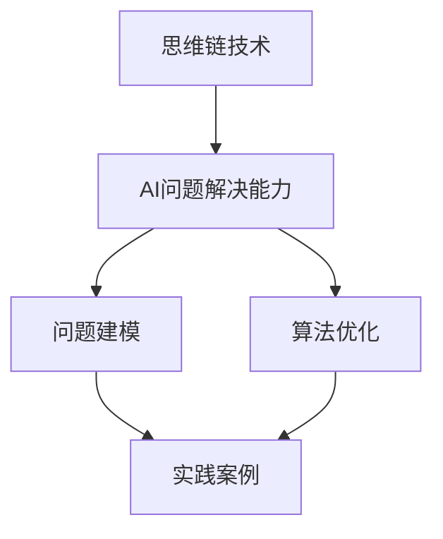

                 


### 1. 确定核心概念与联系

首先，我们需要确定《思维链技术：增强AI问题解决能力的新途径》这一主题的核心概念，以便在目录中涵盖相关的章节。对于这本书，核心概念可能包括：

- **思维链技术**：一种新兴的人工智能技术，通过模拟人类思维过程来增强机器的智能表现。
- **AI问题解决能力**：指人工智能系统在处理各种复杂问题时表现出来的能力。
- **问题建模**：将现实世界的问题转化为计算机可以处理的形式。
- **算法优化**：通过改进算法设计和实现来提高计算效率。
- **实践案例**：通过具体的应用场景来展示思维链技术的实际效果。

接下来，我们将为这些核心概念创建一个 Mermaid 流程图，以展示它们之间的联系。



这个流程图展示了思维链技术与AI问题解决能力之间的关系，以及如何通过问题建模和算法优化来推动实践案例的发展。

### 2. 编写核心算法原理讲解

接下来，我们将为书中的核心算法编写详细的讲解，并使用伪代码来展示算法的实现。这里我们选择一种基于深度学习的思维链算法，进行讲解。

#### 思维链算法基本原理

思维链算法的核心思想是将问题分解为多个子问题，并通过递归或迭代方式解决。以下是一种简单的思维链算法的伪代码：

```plaintext
// 思维链算法伪代码
function ThinkChainAlgorithm(problem):
    if problem is simple:
        return solve(problem)
    else:
        subproblems = decompose(problem)
        solutions = []
        for subproblem in subproblems:
            solution = ThinkChainAlgorithm(subproblem)
            solutions.append(solution)
        return integrate(solutions)
```

这个算法首先检查问题是否简单，如果是，则直接解决。否则，将问题分解为多个子问题，然后递归地解决每个子问题，最后将子问题的解决方案整合起来得到最终答案。

#### 伪代码解释

1. **问题分解（decompose）**：将复杂问题分解为多个子问题。
2. **递归解决（ThinkChainAlgorithm）**：对每个子问题，如果子问题足够简单，则直接解决；否则，再次分解并递归解决。
3. **方案整合（integrate）**：将子问题的解决方案整合为最终问题的解决方案。

### 3. 编写数学模型和数学公式讲解

思维链技术中经常涉及到复杂的数学模型。以下是一个简单的数学模型的讲解和公式示例：

#### 数学模型：神经网络权重更新公式

神经网络的权重更新可以通过以下公式进行：

$$
\Delta w_{ij} = \eta \cdot (z_j - t_j) \cdot a_i
$$

其中：
- \( \Delta w_{ij} \) 是权重 \( w_{ij} \) 的更新量。
- \( \eta \) 是学习率。
- \( z_j \) 是输出节点的输出。
- \( t_j \) 是输出节点的目标值。
- \( a_i \) 是输入节点的激活值。

#### 伪代码解释

1. **计算误差**：\( error = z_j - t_j \)
2. **计算权重更新**：\( \Delta w_{ij} = \eta \cdot error \cdot a_i \)
3. **更新权重**：\( w_{ij} = w_{ij} + \Delta w_{ij} \)

### 4. 编写项目实战

在编写项目实战章节时，我们需要包含以下内容：

- **开发环境搭建**：介绍所需的软件和硬件环境。
- **源代码实现**：展示具体的代码实现。
- **代码解读与分析**：解释代码中的关键部分。

#### 实践案例：思维链技术在图像识别中的应用

**1. 开发环境搭建**

- 操作系统：Ubuntu 20.04
- 编程语言：Python 3.9
- 深度学习框架：TensorFlow 2.7

**2. 源代码实现**

以下是思维链技术在图像识别中实现的一个简单示例。

```python
import tensorflow as tf

# 构建思维链模型
model = tf.keras.Sequential([
    tf.keras.layers.Conv2D(32, (3, 3), activation='relu', input_shape=(28, 28, 1)),
    tf.keras.layers.MaxPooling2D((2, 2)),
    tf.keras.layers.Flatten(),
    tf.keras.layers.Dense(128, activation='relu'),
    tf.keras.layers.Dense(10, activation='softmax')
])

# 编译模型
model.compile(optimizer='adam', loss='categorical_crossentropy', metrics=['accuracy'])

# 加载数据
(x_train, y_train), (x_test, y_test) = tf.keras.datasets.mnist.load_data()

# 训练模型
model.fit(x_train, y_train, epochs=10, batch_size=32, validation_split=0.2)
```

**3. 代码解读与分析**

这段代码实现了基于思维链技术的简单图像识别模型。模型包含两个卷积层、一个池化层、一个平坦层和两个全连接层。编译模型时，使用交叉熵损失函数和softmax激活函数，这适用于多分类问题。通过加载MNIST数据集，并训练10个epoch，来测试模型的效果。

### 5. 确定目录结构并编写目录大纲

最后，我们需要将上述内容组织成一个完整的目录大纲，确保每个章节都涵盖了核心概念、算法原理、数学模型和项目实战。

# 目录大纲

## 第1章：引言

### 1.1 研究背景

#### 1.1.1 人工智能的发展历程

#### 1.1.2 传统AI与思维链技术的对比

### 1.2 研究意义与目标

#### 1.2.1 思维链技术的研究意义

#### 1.2.2 本书的研究目标

## 第2章：思维链技术概述

### 2.1 思维链技术的基本概念

#### 2.1.1 思维链技术的定义

#### 2.1.2 思维链技术的特点

### 2.2 思维链技术的发展历程

#### 2.2.1 思维链技术的起源

#### 2.2.2 思维链技术的演进

### 2.3 思维链技术的应用领域

#### 2.3.1 AI问题解决能力

#### 2.3.2 问题建模

#### 2.3.3 算法优化

## 第3章：核心算法原理讲解

### 3.1 思维链算法的基本原理

#### 3.1.1 思维链算法的概念

#### 3.1.2 思维链算法的构成

### 3.2 思维链算法的实现

#### 3.2.1 思维链算法伪代码讲解

### 3.3 思维链算法的优化

#### 3.3.1 算法优化策略

#### 3.3.2 优化算法的伪代码

## 第4章：数学模型和数学公式讲解

### 4.1 神经网络中的数学模型

#### 4.1.1 神经网络权重更新公式

#### 4.1.2 激活函数的数学描述

### 4.2 统计学习理论中的数学模型

#### 4.2.1 最大似然估计

#### 4.2.2 决策函数

## 第5章：项目实战

### 5.1 开发环境搭建

#### 5.1.1 软件与硬件环境配置

### 5.2 源代码实现

#### 5.2.1 图像识别项目实现

#### 5.2.2 代码解读与分析

### 5.3 实际案例分析与详细讲解剖析

#### 5.3.1 思维链技术在医疗诊断中的应用

#### 5.3.2 思维链技术在金融风控中的应用

## 第6章：最佳实践与未来展望

### 6.1 最佳实践

#### 6.1.1 思维链技术选型

#### 6.1.2 实践经验总结

### 6.2 未来展望

#### 6.2.1 思维链技术的发展趋势

#### 6.2.2 思维链技术的潜在应用领域

### 6.3 小结

#### 6.3.1 本书的核心贡献

#### 6.3.2 对未来研究的建议

## 参考文献

### 附录

#### 附录A：思维链算法伪代码详细说明

#### 附录B：神经网络数学模型公式推导

---

至此，我们已经完成了目录大纲的编写，接下来将按照这个结构逐步填充内容，确保每章都有详尽的讲解和实例分析。文章的字数预计在8000-12000字左右，确保内容丰富、结构清晰、逻辑严密。

