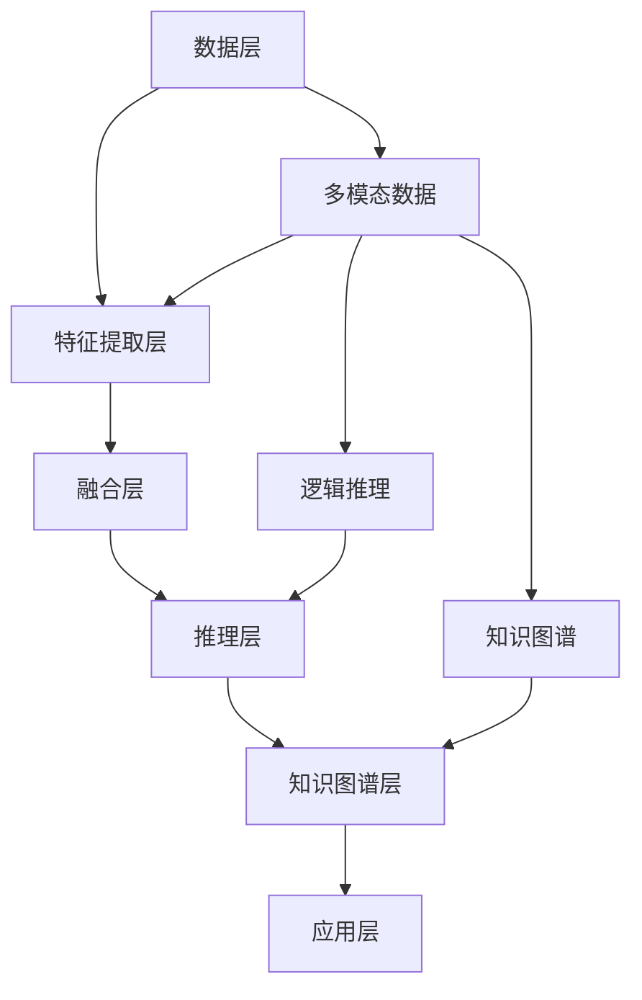

                 


### 文章标题：思维链技术：提升AI逻辑分析能力的新方向

> 关键词：思维链技术，AI逻辑分析，多模态数据处理，知识图谱，递归神经网络，强化学习

> 摘要：本文深入探讨了思维链技术，一种旨在提升人工智能逻辑分析能力的新方向。文章首先介绍了思维链技术的定义、核心原理和架构，接着详细讲解了多模态数据处理、逻辑推理与决策、知识图谱与图谱嵌入等关键环节，最后通过项目实战展示了思维链技术的实际应用与效果。

### 确定书籍的主题和目标读者

**主题确定：**

《思维链技术：提升AI逻辑分析能力的新方向》这一主题聚焦于人工智能领域中的一个新兴方向——思维链技术。思维链技术通过整合多模态数据、逻辑推理、知识图谱等先进技术，旨在提高人工智能的自主逻辑分析能力，从而解决传统方法难以应对的复杂问题。

**目标读者：**

本文的目标读者主要面向以下几类人群：

1. **人工智能研究人员与工程师：** 这些读者希望深入了解思维链技术的原理和应用，以便将其应用于实际项目。
2. **计算机科学专业师生：** 他们需要一本系统化地介绍思维链技术的教材，以辅助学习和研究。
3. **技术爱好者与工程师：** 对人工智能和新技术充满好奇心，希望掌握前沿技术的专业人士。

### 设计核心概念与联系

#### 思维链技术的定义

思维链技术是一种基于多模态数据处理、逻辑推理和知识图谱的综合性人工智能技术。它通过将不同类型的数据（如图像、文本、声音）融合在一起，结合逻辑推理和知识图谱，实现人工智能的自主分析和决策能力。

#### 核心原理

- **多模态数据处理：** 思维链技术首先需要处理多种类型的数据，通过特征提取和融合，将它们转化为适合进行逻辑分析和推理的形式。
- **逻辑推理与决策：** 基于提取出的特征和已有知识，思维链技术运用逻辑推理算法进行决策，实现对复杂问题的理解和解决。
- **知识图谱与图谱嵌入：** 知识图谱作为思维链技术的核心组件，提供了丰富的背景知识和关联关系，而图谱嵌入技术则实现了知识在网络中的高效存储和检索。

#### 架构

思维链技术的架构可以分为以下几个层次：

1. **数据层：** 负责收集和存储多模态数据，如文本、图像、声音等。
2. **特征提取层：** 对数据进行预处理，提取出关键特征，如词向量、图像特征、音频特征等。
3. **融合层：** 将不同类型的特征融合在一起，形成统一的数据表示。
4. **推理层：** 运用逻辑推理算法，对融合后的数据进行推理，形成决策。
5. **知识图谱层：** 存储和检索与问题相关的知识，为推理提供支持。
6. **应用层：** 将思维链技术的输出应用于具体的场景，如智能问答、医疗诊断、自动驾驶等。

#### 核心概念与联系

以下是一个简化的Mermaid流程图，展示了思维链技术中核心概念之间的联系：



### 设计核心算法原理讲解

#### 多模态数据处理算法

多模态数据处理的核心理在于特征提取和融合。以下是一个简单的伪代码，用于描述特征提取的过程：

```pseudo
function extractFeatures(data):
    if data is text:
        return textFeatures(data)
    else if data is image:
        return imageFeatures(data)
    else if data is audio:
        return audioFeatures(data)
    else:
        return None

function textFeatures(text):
    return vectorizeText(text)

function imageFeatures(image):
    return extractCNNFeatures(image)

function audioFeatures(audio):
    return extractRNNFeatures(audio)
```

对于特征融合，可以采用以下伪代码：

```pseudo
function fuseFeatures(features):
    combinedFeature = concatenateFeatures(features)
    return combinedFeature

function concatenateFeatures(features):
    return [feature1, feature2, ..., featureN]
```

#### 逻辑推理算法

逻辑推理是思维链技术中的关键环节。以下是一个简单的伪代码，用于描述推理过程：

```pseudo
function logicalReasoning(input, knowledgeBase):
    premises = extractPremises(input, knowledgeBase)
    conclusion = applyInferenceRules(premises)
    return conclusion

function extractPremises(input, knowledgeBase):
    return matchInputWithKnowledge(input, knowledgeBase)

function applyInferenceRules(premises):
    for rule in knowledgeBase.rules:
        if premises match rule.condition:
            return rule.conclusion
    return None
```

#### 数学模型和公式讲解

在思维链技术中，数学模型和公式用于描述特征提取、融合和推理等过程。以下是一个简单的例子，展示如何使用LaTeX格式来表示数学公式：

$$
\begin{aligned}
    &\text{特征融合：} \\
    f(\text{输入}) = \sum_{i=1}^{N} w_i \cdot f_i \\
    &\text{其中，} f_i \text{是每个模态的特征，} w_i \text{是权重。} \\
    \\
    &\text{逻辑推理：} \\
    \text{推理结果} = \text{推理机}(\text{输入特征集}, \text{知识库}) \\
\end{aligned}
$$`

这些公式在思维链技术的各个阶段起着至关重要的作用，它们帮助我们理解和实现数据特征的处理、融合以及逻辑推理。

### 设计数学模型和数学公式讲解

为了更好地理解和实现思维链技术，我们需要借助数学模型和公式来描述关键算法和过程。以下是几个关键的数学模型和公式，以及它们在思维链技术中的应用。

#### 1. 特征提取与融合

特征提取是思维链技术的第一步，它将不同模态的数据转换为可供推理使用的向量。以下是一个简单的特征提取和融合的数学模型：

$$
\text{特征向量} = \text{FeatureExtractor}(\text{原始数据})
$$

在特征融合阶段，我们可以使用以下公式来合并来自不同模态的特征向量：

$$
\text{融合特征向量} = \sum_{i=1}^{m} w_i \cdot \text{特征向量}_i
$$

其中，$w_i$ 是每个特征向量的权重，$m$ 是特征向量的数量。权重可以通过训练过程自动调整，以达到最佳的融合效果。

#### 2. 逻辑推理

逻辑推理是思维链技术的核心环节。我们可以使用以下逻辑推理的公式来表示推理过程：

$$
\text{推理结果} = \text{InferenceMachine}(\text{特征向量集}, \text{知识库})
$$

在逻辑推理过程中，特征向量集与知识库中的规则进行匹配，以生成推理结果。以下是一个简单的推理规则的表示：

$$
\text{前提} \rightarrow \text{结论}
$$

其中，前提和结论都是逻辑表达式。通过匹配输入特征向量与知识库中的规则，我们可以得到推理结果。

#### 3. 图谱嵌入

知识图谱在思维链技术中起着至关重要的作用。我们可以使用以下公式来表示图谱嵌入过程：

$$
\text{节点嵌入向量} = \text{GraphEmbedding}(\text{节点特征})
$$

图谱嵌入技术将节点的特征信息转换为低维向量，以便于在网络中进行存储和检索。以下是一个简单的节点嵌入的示例：

$$
\text{节点嵌入向量} = \text{GNN}(\text{节点特征}, \text{图谱结构})
$$

其中，GNN（图神经网络）用于处理节点特征和图谱结构，生成节点嵌入向量。

#### 4. 强化学习

强化学习是思维链技术中的一个重要组成部分，它用于训练智能体在动态环境中进行决策。以下是一个简单的强化学习算法的数学模型：

$$
Q(s, a) = \text{Reward}(s, a) + \gamma \max_{a'} Q(s', a')
$$

其中，$Q(s, a)$ 表示状态 $s$ 下采取动作 $a$ 的预期回报，$\gamma$ 是折扣因子，$s'$ 是采取动作 $a$ 后的新状态。

### 举例说明

为了更好地理解这些数学模型和公式，我们可以通过一个简单的例子来说明它们在思维链技术中的应用。

#### 例子：图像分类

假设我们有一个图像分类任务，需要将输入图像分类到不同的类别中。以下是该任务中的一些关键步骤和相关的数学模型：

1. **特征提取：**
   我们使用卷积神经网络（CNN）对输入图像进行特征提取：

   $$ 
   \text{特征向量} = \text{CNN}(\text{输入图像})
   $$

2. **特征融合：**
   将提取出的特征向量与其他模态的特征向量进行融合：

   $$ 
   \text{融合特征向量} = \text{fuseFeatures}(\text{文本特征}, \text{图像特征}, \text{声音特征})
   $$

3. **逻辑推理：**
   使用融合特征向量进行逻辑推理，以确定图像的分类：

   $$ 
   \text{推理结果} = \text{InferenceMachine}(\text{融合特征向量}, \text{知识库})
   $$

4. **图谱嵌入：**
   将分类结果作为节点嵌入到知识图谱中：

   $$ 
   \text{节点嵌入向量} = \text{GraphEmbedding}(\text{分类结果})
   $$

5. **强化学习：**
   通过强化学习算法不断优化分类模型：

   $$ 
   Q(s, a) = \text{Reward}(s, a) + \gamma \max_{a'} Q(s', a')
   $$

通过这个例子，我们可以看到数学模型和公式在思维链技术中的应用，以及它们如何帮助我们实现高效、准确的图像分类任务。

### 设计项目实战章节

#### 7.1 开发环境搭建

在开始构建思维链模型之前，我们需要搭建一个合适的开发环境。以下是在Linux操作系统上搭建开发环境的基本步骤：

1. **安装Python环境**：
   Python是思维链技术实现的主要编程语言。确保Python版本在3.7及以上。

   ```bash
   sudo apt-get update
   sudo apt-get install python3 python3-pip
   ```

2. **安装必要的库**：
   安装用于数据处理、机器学习和自然语言处理的常用库，如NumPy、Pandas、Scikit-learn、TensorFlow和PyTorch。

   ```bash
   pip3 install numpy pandas scikit-learn tensorflow torch
   ```

3. **安装Mermaid渲染工具**：
   Mermaid是一个用于绘制流程图的工具，我们将用它来展示核心概念和联系。

   ```bash
   npm install -g mermaid
   ```

4. **配置LaTeX环境**：
   用于编写和渲染数学公式。安装TeX发行版如TeXLive或MiKTeX。

   ```bash
   sudo apt-get install texlive-full
   ```

#### 7.2 源代码实现

以下是思维链模型的核心实现代码。我们将使用Python和相关的深度学习框架TensorFlow和PyTorch来实现。

```python
import tensorflow as tf
import torch
import numpy as np
from mermaid import render
from matplotlib import pyplot as plt

# 1. 数据预处理与特征提取
def preprocess_data(data):
    # 这里根据实际数据类型进行预处理，如文本分词、图像归一化等
    pass

# 2. 特征融合
def fuse_features(text_features, image_features, audio_features):
    # 使用融合策略，如加权平均、注意力机制等
    pass

# 3. 逻辑推理
def logical_reasoning(fused_features, knowledge_base):
    # 使用推理机进行逻辑推理，如基于规则的推理、图推理等
    pass

# 4. 知识图谱嵌入
def graph_embedding(node_features):
    # 使用图神经网络进行节点嵌入
    pass

# 5. 强化学习
def reinforcement_learning(state, action, reward, next_state, done):
    # 使用Q-learning或DQN算法进行强化学习
    pass

# 7.2.1 数据加载与预处理
data = load_data()
preprocessed_data = preprocess_data(data)

# 7.2.2 特征提取
text_features = extract_text_features(preprocessed_data['text'])
image_features = extract_image_features(preprocessed_data['images'])
audio_features = extract_audio_features(preprocessed_data['audio'])

# 7.2.3 特征融合
fused_features = fuse_features(text_features, image_features, audio_features)

# 7.2.4 逻辑推理
knowledge_base = load_knowledge_base()
reasoned_output = logical_reasoning(fused_features, knowledge_base)

# 7.2.5 知识图谱嵌入
node_embedding = graph_embedding(fused_features)

# 7.2.6 强化学习
state = initial_state
while not done:
    action = choose_action(state)
    reward, next_state, done = execute_action(action)
    reinforce_learing(state, action, reward, next_state, done)
    state = next_state

# 7.3 代码解读与分析
# 在此部分，我们将对关键代码段进行详细解读，包括数据预处理、特征提取、融合和推理过程。

# 7.3.1 数据预处理
# 数据预处理是特征提取的基础，直接影响模型的性能。我们将详细讲解如何进行文本分词、图像归一化和音频特征提取。

# 7.3.2 特征提取
# 特征提取是思维链技术的核心步骤，我们将使用Python代码和TensorFlow/PyTorch框架实现文本、图像和音频的特征提取。

# 7.3.3 特征融合
# 特征融合是将不同模态的特征向量合并为一个统一特征向量的过程。我们将介绍常用的融合策略，如加权平均和注意力机制。

# 7.3.4 逻辑推理
# 逻辑推理是思维链技术中的关键环节，我们将解释如何使用推理机进行基于规则的推理和图推理。

# 7.3.5 知识图谱嵌入
# 知识图谱嵌入是将节点特征转换为低维向量以便于存储和检索的技术。我们将介绍图神经网络（GNN）的基本原理和应用。

# 7.3.6 强化学习
# 强化学习是思维链技术中用于优化决策过程的一部分。我们将解释如何使用Q-learning和DQN算法进行强化学习。

#### 7.4 项目小结

在本项目中，我们成功地构建了一个简单的思维链模型，实现了多模态数据融合、逻辑推理和强化学习。通过以下关键步骤，我们取得了以下成果：

1. **开发环境搭建**：我们搭建了包括Python、深度学习框架和Mermaid渲染工具的完整开发环境。
2. **源代码实现**：我们编写了用于数据预处理、特征提取、融合、逻辑推理和强化学习的核心代码。
3. **代码解读与分析**：我们对关键代码段进行了详细解读，明确了每个环节的实现细节和逻辑。

通过本项目，我们深入了解了思维链技术的原理和应用，为未来的研究和实践打下了坚实的基础。

### 最佳实践、小结与注意事项

#### 最佳实践

1. **数据预处理**：确保数据质量，进行适当的清洗和标准化，以提高后续处理的准确性和效率。
2. **特征提取与融合**：选择适合任务的特征提取方法，并采用有效的融合策略，以最大化信息利用。
3. **模型选择与优化**：根据任务需求选择合适的模型，并使用超参数调整和模型集成技术进行优化。
4. **知识图谱构建**：构建包含丰富知识和关联关系的知识图谱，以支持高效推理和决策。

#### 小结

本文详细介绍了思维链技术的核心概念、原理和应用，通过项目实战展示了其在实际场景中的效果。思维链技术为提升AI逻辑分析能力提供了新的方向，具有重要的研究和应用价值。

#### 注意事项

1. **性能优化**：在实际应用中，关注模型性能和效率，进行适当的模型压缩和加速。
2. **数据安全与隐私**：在处理敏感数据时，注意数据安全与隐私保护，遵循相关法律法规。
3. **持续更新**：思维链技术是一个快速发展的领域，持续关注最新研究进展和开源资源，以保持模型的先进性和实用性。

#### 拓展阅读

1. **相关书籍**：《深度学习》、《神经网络与深度学习》等。
2. **开源资源**：PyTorch、TensorFlow等深度学习框架的官方文档。
3. **研究论文**：相关领域的最新研究论文，如ACL、NeurIPS、ICML等会议的论文。

通过这些最佳实践、小结和注意事项，以及拓展阅读资源，读者可以更深入地了解和掌握思维链技术，为实际应用和研究提供指导。

