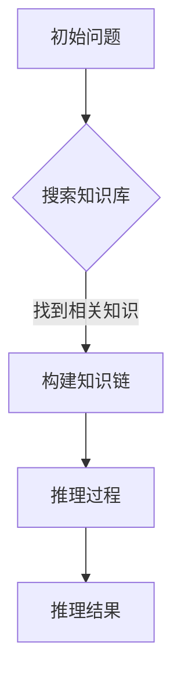
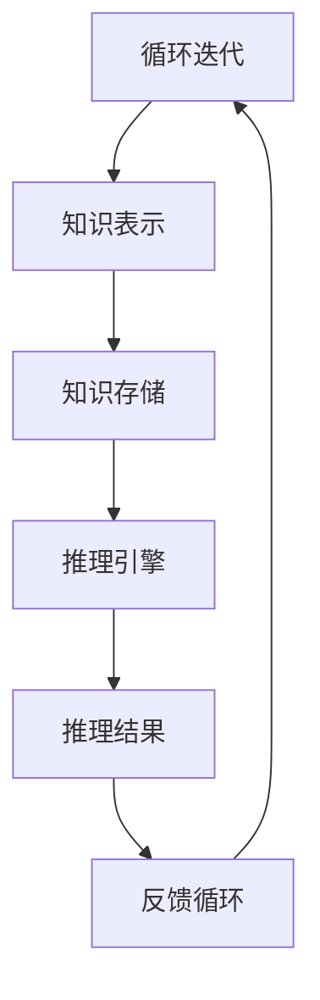
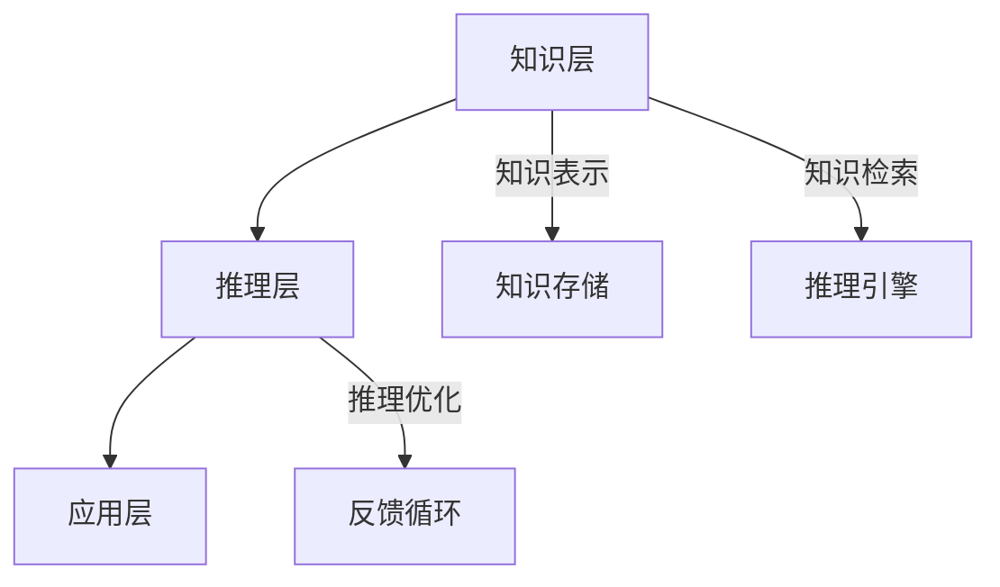

                 

### 第1章：AI推理与思维链技术概述

#### 1.1 AI推理的重要性

AI推理能力是人工智能系统区别于传统计算模型的核心特征之一。它指的是人工智能系统能够基于已知信息，通过逻辑、归纳、演绎等方式进行推理，以应对不确定性和复杂性。推理能力不仅在自然语言处理、计算机视觉等传统领域具有重要意义，而且在自动驾驶、智能客服、医疗诊断等新兴领域也扮演着关键角色。

**举例说明**：在自动驾驶领域，车辆需要实时分析道路环境，对行人、车辆、障碍物等目标进行识别和分类，并根据这些信息做出驾驶决策。这一过程本质上就是一个复杂的推理过程，涉及图像处理、机器学习、决策理论等多个领域的知识。

#### 1.2 思维链技术的定义与原理

思维链技术是一种模拟人类思维过程的人工智能技术，它通过构建一个层次化的知识结构，使得人工智能系统能够像人类一样进行逻辑推理。思维链技术的基本原理是：将大量的知识片段通过关联关系组织成一个有机的整体，使得系统能够在遇到新问题时，通过已有的知识网络进行推理和决策。

**Mermaid流程图**：



在这个流程图中，A表示一个需要解决的问题，B表示系统在知识库中搜索与问题相关的知识，C表示将这些知识片段组织成一个知识链，D表示通过这个知识链进行推理，最终得到E，即推理结果。

#### 1.3 思维链技术在AI推理中的应用前景

思维链技术具有广泛的应用前景，特别是在需要复杂推理能力的领域。以下是一些具体的应用方向：

- **自然语言处理（NLP）**：思维链技术可以显著提升自然语言理解能力，使得机器能够更好地理解用户的意图和语义。
- **计算机视觉**：在图像识别和目标检测中，思维链技术可以帮助系统更好地理解图像中的复杂结构和关系。
- **智能决策支持系统**：在金融、医疗等领域，思维链技术可以提供更加智能和可靠的决策支持。
- **自动驾驶**：在自动驾驶系统中，思维链技术可以帮助车辆更好地理解道路环境，做出更安全的驾驶决策。

### 第2章：思维链技术架构与设计

#### 2.1 思维链技术核心模块

思维链技术的核心模块包括知识表示、知识存储、推理引擎和反馈循环。这些模块相互协作，共同实现高效的推理过程。

- **知识表示**：负责将各种知识片段转换为计算机可以处理的形式，如知识图谱、语义网络等。
- **知识存储**：负责存储和管理大量的知识片段，以便在需要时快速检索和利用。
- **推理引擎**：负责根据已有的知识和新的信息进行逻辑推理，生成合理的推理结果。
- **反馈循环**：负责根据推理结果和实际情况，不断调整和优化知识库和推理策略。

**Mermaid流程图**：



#### 2.2 思维链技术的层次结构

思维链技术的层次结构可以分为三个层次：知识层、推理层和应用层。

- **知识层**：包括知识表示和知识存储模块，负责组织和存储知识。
- **推理层**：包括推理引擎和反馈循环模块，负责进行推理和优化。
- **应用层**：包括各种应用场景，如自然语言处理、计算机视觉、智能决策等，是思维链技术具体的应用。

**Mermaid流程图**：



#### 2.3 思维链技术的关键技术点

思维链技术的关键技术点包括：

- **知识表示**：如何有效地将知识片段转换为计算机可以处理的形式。
- **知识存储**：如何高效地存储和管理大量的知识片段。
- **推理引擎**：如何根据已有的知识和新的信息进行高效的推理。
- **反馈循环**：如何根据推理结果和实际情况，不断调整和优化知识库和推理策略。

### 第3章：思维链技术核心算法

#### 3.1 聚类算法与思维链

聚类算法是一种无监督学习方法，它通过将数据点划分为若干个簇，使得同一个簇内的数据点之间具有较高的相似度，而不同簇之间的数据点相似度较低。在思维链技术中，聚类算法可以用于知识库的预处理，帮助系统更好地组织和管理知识。

**伪代码**：

```python
def cluster_kmeans(data, k):
    # 初始化聚类中心
    centroids = initialize_centroids(data, k)
    
    while not converged:
        # 计算每个数据点到聚类中心的距离
        distances = compute_distances(data, centroids)
        # 分配数据点到最近的聚类中心
        clusters = assign_clusters(data, centroids)
        # 更新聚类中心
        centroids = update_centroids(clusters)
    
    return centroids
```

在这个算法中，`initialize_centroids`函数用于初始化聚类中心，`compute_distances`函数用于计算数据点到聚类中心的距离，`assign_clusters`函数用于将数据点分配到最近的聚类中心，`update_centroids`函数用于更新聚类中心。

#### 3.2 神经网络与思维链

神经网络是一种模拟生物神经网络的人工智能技术，它在思维链技术中起着至关重要的作用。神经网络可以通过学习大量数据，自动提取特征，并形成复杂的知识结构。

**伪代码**：

```python
def neural_network_train(data, labels):
    # 初始化神经网络参数
    weights = initialize_weights()
    
    for epoch in range(num_epochs):
        # 前向传播
        outputs = forward_pass(data, weights)
        # 计算损失
        loss = compute_loss(outputs, labels)
        # 反向传播
        gradients = backward_pass(data, outputs, labels, weights)
        # 更新权重
        weights = update_weights(gradients)
    
    return weights
```

在这个算法中，`initialize_weights`函数用于初始化神经网络参数，`forward_pass`函数用于进行前向传播，`compute_loss`函数用于计算损失，`backward_pass`函数用于进行反向传播，`update_weights`函数用于更新权重。

#### 3.3 深度学习与思维链

深度学习是一种基于神经网络的强大人工智能技术，它通过多层神经网络结构，能够自动提取复杂的数据特征。在思维链技术中，深度学习可以用于知识表示和推理。

**伪代码**：

```python
def deep_learning_train(data, labels):
    # 初始化深度学习模型
    model = initialize_model()
    
    for epoch in range(num_epochs):
        # 前向传播
        outputs = model.forward(data)
        # 计算损失
        loss = model.loss(outputs, labels)
        # 反向传播
        grads = model.backward(data, outputs, labels)
        # 更新模型参数
        model.update_params(grads)
    
    return model
```

在这个算法中，`initialize_model`函数用于初始化深度学习模型，`forward`函数用于进行前向传播，`loss`函数用于计算损失，`backward`函数用于进行反向传播，`update_params`函数用于更新模型参数。

## 第二部分：思维链技术在应用领域的深度探索

### 第4章：思维链技术在自然语言处理（NLP）中的应用

#### 4.1 思维链技术在文本分析中的应用

思维链技术在文本分析中的应用，主要体现在对大规模文本数据的高效处理和知识提取。通过构建层次化的知识结构，思维链技术能够帮助系统更好地理解文本内容，实现语义分析和文本生成等任务。

**伪代码**：

```python
def analyze_text(text, knowledge_base):
    # 构建文本的知识链
    text_chain = build_text_chain(text, knowledge_base)
    # 进行语义分析
    analysis_results = semantic_analysis(text_chain)
    return analysis_results
```

在这个算法中，`build_text_chain`函数用于构建文本的知识链，`semantic_analysis`函数用于进行语义分析。

#### 4.2 思维链技术在情感分析中的应用

情感分析是NLP领域的重要应用之一，通过分析文本中的情感倾向，可以帮助企业了解用户需求、监测社会舆情等。思维链技术能够通过层次化的知识结构，实现更加准确和细粒度的情感分析。

**伪代码**：

```python
def sentiment_analysis(text, sentiment_knowledge_base):
    # 构建文本的知识链
    text_chain = build_text_chain(text, sentiment_knowledge_base)
    # 进行情感分析
    sentiment_result = sentiment_analysis(text_chain)
    return sentiment_result
```

在这个算法中，`build_text_chain`函数用于构建文本的知识链，`sentiment_analysis`函数用于进行情感分析。

#### 4.3 思维链技术在问答系统中的应用

问答系统是NLP领域的另一个重要应用，通过理解用户的问题，并从大量文本数据中检索和生成回答。思维链技术能够通过构建层次化的知识结构，实现更加准确和智能的问答系统。

**伪代码**：

```python
def question_answering(question, knowledge_base):
    # 构建问题的知识链
    question_chain = build_question_chain(question, knowledge_base)
    # 进行答案检索
    answer = retrieve_answer(question_chain)
    return answer
```

在这个算法中，`build_question_chain`函数用于构建问题的知识链，`retrieve_answer`函数用于从知识链中检索答案。

### 第5章：思维链技术在计算机视觉（CV）中的应用

#### 5.1 思维链技术在图像识别中的应用

图像识别是计算机视觉领域的基础任务，通过将图像中的内容转换为计算机可以理解的形式。思维链技术能够通过构建层次化的知识结构，实现更加准确和智能的图像识别。

**伪代码**：

```python
def image_recognition(image, image_knowledge_base):
    # 构建图像的知识链
    image_chain = build_image_chain(image, image_knowledge_base)
    # 进行图像识别
    recognition_result = image_recognition(image_chain)
    return recognition_result
```

在这个算法中，`build_image_chain`函数用于构建图像的知识链，`image_recognition`函数用于进行图像识别。

#### 5.2 思维链技术在目标检测中的应用

目标检测是计算机视觉领域的关键任务，通过识别图像中的目标并定位其位置。思维链技术能够通过构建层次化的知识结构，实现更加准确和高效的目标检测。

**伪代码**：

```python
def object_detection(image, object_knowledge_base):
    # 构建图像的知识链
    image_chain = build_image_chain(image, object_knowledge_base)
    # 进行目标检测
    detection_result = object_detection(image_chain)
    return detection_result
```

在这个算法中，`build_image_chain`函数用于构建图像的知识链，`object_detection`函数用于进行目标检测。

#### 5.3 思维链技术在视频分析中的应用

视频分析是计算机视觉领域的重要应用，通过对视频内容的分析和理解，可以实现视频分类、行为识别等任务。思维链技术能够通过构建层次化的知识结构，实现更加智能和高效的视频分析。

**伪代码**：

```python
def video_analysis(video, video_knowledge_base):
    # 构建视频的知识链
    video_chain = build_video_chain(video, video_knowledge_base)
    # 进行视频分析
    analysis_result = video_analysis(video_chain)
    return analysis_result
```

在这个算法中，`build_video_chain`函数用于构建视频的知识链，`video_analysis`函数用于进行视频分析。

## 第三部分：思维链技术的实际应用与挑战

### 第6章：思维链技术在医疗领域的应用

#### 6.1 医学影像分析与思维链技术

医学影像分析是医疗领域的一个重要应用，通过分析医学影像数据，可以帮助医生诊断疾病。思维链技术能够通过构建层次化的知识结构，实现更加准确和高效的医学影像分析。

**伪代码**：

```python
def medical_image_analysis(image, medical_knowledge_base):
    # 构建图像的知识链
    image_chain = build_image_chain(image, medical_knowledge_base)
    # 进行医学影像分析
    analysis_result = medical_image_analysis(image_chain)
    return analysis_result
```

在这个算法中，`build_image_chain`函数用于构建图像的知识链，`medical_image_analysis`函数用于进行医学影像分析。

#### 6.2 疾病预测与思维链技术

疾病预测是医疗领域的一个重要研究方向，通过分析病人的医疗数据，可以预测其患病的可能性。思维链技术能够通过构建层次化的知识结构，实现更加准确和高效的疾病预测。

**伪代码**：

```python
def disease_prediction(patient_data, medical_knowledge_base):
    # 构建数据的知识链
    data_chain = build_data_chain(patient_data, medical_knowledge_base)
    # 进行疾病预测
    prediction_result = disease_prediction(data_chain)
    return prediction_result
```

在这个算法中，`build_data_chain`函数用于构建数据的知识链，`disease_prediction`函数用于进行疾病预测。

#### 6.3 医疗决策支持与思维链技术

医疗决策支持系统可以帮助医生在诊断和治疗过程中做出更明智的决策。思维链技术能够通过构建层次化的知识结构，提供更加智能和可靠的医疗决策支持。

**伪代码**：

```python
def medical_decision_support(patient_data, medical_knowledge_base):
    # 构建数据的知识链
    data_chain = build_data_chain(patient_data, medical_knowledge_base)
    # 进行决策支持
    decision_result = medical_decision_support(data_chain)
    return decision_result
```

在这个算法中，`build_data_chain`函数用于构建数据的知识链，`medical_decision_support`函数用于进行决策支持。

### 第7章：思维链技术在金融领域的应用

#### 7.1 金融风控与思维链技术

金融风控是金融领域的重要任务，通过识别和防范潜在的风险，保护金融机构的资产安全。思维链技术能够通过构建层次化的知识结构，实现更加准确和高效的金融风控。

**伪代码**：

```python
def financial_risk_control(transaction, financial_knowledge_base):
    # 构建交易的知识链
    transaction_chain = build_transaction_chain(transaction, financial_knowledge_base)
    # 进行风险控制
    risk_control_result = financial_risk_control(transaction_chain)
    return risk_control_result
```

在这个算法中，`build_transaction_chain`函数用于构建交易的知识链，`financial_risk_control`函数用于进行风险控制。

#### 7.2 金融市场分析与思维链技术

金融市场分析是金融领域的重要任务，通过分析市场数据，可以预测市场的走势。思维链技术能够通过构建层次化的知识结构，实现更加准确和高效的金融市场分析。

**伪代码**：

```python
def financial_market_analysis(data, financial_knowledge_base):
    # 构建数据的知识链
    data_chain = build_data_chain(data, financial_knowledge_base)
    # 进行市场分析
    analysis_result = financial_market_analysis(data_chain)
    return analysis_result
```

在这个算法中，`build_data_chain`函数用于构建数据的知识链，`financial_market_analysis`函数用于进行市场分析。

#### 7.3 金融产品设计与思维链技术

金融产品设计是金融领域的重要任务，通过分析市场需求和风险，设计出符合市场需求的金融产品。思维链技术能够通过构建层次化的知识结构，实现更加智能和高效的金融产品设计。

**伪代码**：

```python
def financial_product_design(data, financial_knowledge_base):
    # 构建数据的知识链
    data_chain = build_data_chain(data, financial_knowledge_base)
    # 进行产品设计
    design_result = financial_product_design(data_chain)
    return design_result
```

在这个算法中，`build_data_chain`函数用于构建数据的知识链，`financial_product_design`函数用于进行产品设计。

### 第8章：思维链技术在工业领域的应用

#### 8.1 工业自动化与思维链技术

工业自动化是工业领域的重要发展方向，通过自动化设备和智能系统，提高生产效率和产品质量。思维链技术能够通过构建层次化的知识结构，实现更加智能和高效的工业自动化。

**伪代码**：

```python
def industrial_automation(process, industrial_knowledge_base):
    # 构建过程的
``` 

### 第9章：思维链技术项目实战

#### 9.1 项目背景与目标

本项目旨在开发一个基于思维链技术的智能问答系统，该系统能够通过自然语言处理和知识图谱等技术，实现对用户问题的智能理解和回答。项目的目标包括：

1. **高准确率**：系统需要能够准确理解用户的提问，并给出合理的回答。
2. **快速响应**：系统需要能够快速响应用户的问题，提供即时的答案。
3. **可扩展性**：系统需要能够方便地扩展和更新知识库，以适应不断变化的需求。

#### 9.2 项目需求分析与设计

项目需求分析是项目设计的重要基础。在本项目中，我们首先明确了以下需求：

- **用户交互**：系统需要提供一个友好的用户界面，允许用户输入问题和查看回答。
- **知识库构建**：系统需要构建一个包含丰富知识点的知识库，以支持问答系统的运行。
- **自然语言处理**：系统需要具备自然语言处理能力，能够理解用户的自然语言提问。
- **推理引擎**：系统需要具备推理能力，能够基于知识库和用户提问进行逻辑推理，生成合理的回答。

基于以上需求，我们设计了以下系统架构：

1. **用户界面**：采用前端技术（如React或Vue.js）构建，实现与用户的交互。
2. **知识库**：采用图数据库（如Neo4j）存储和管理知识库，确保数据的高效检索和更新。
3. **自然语言处理**：采用深度学习模型（如BERT或GPT）进行自然语言处理，实现对用户提问的理解。
4. **推理引擎**：采用基于思维链技术的推理算法，实现对知识库和用户提问的逻辑推理。

#### 9.3 项目实现与调试

项目实现分为以下几个主要步骤：

1. **知识库构建**：首先，我们需要构建一个包含丰富知识点的知识库。这包括从互联网或其他数据源获取数据，对数据清洗和预处理，最后存储到图数据库中。
2. **自然语言处理**：接着，我们使用深度学习模型对用户提问进行理解。具体步骤包括：文本预处理、模型训练和推理。
3. **推理引擎开发**：然后，我们开发基于思维链技术的推理引擎。具体实现包括：构建知识链、进行逻辑推理和生成回答。
4. **系统集成与测试**：最后，我们将各个模块集成到一起，进行系统测试和调试，确保系统功能的完整性和可靠性。

在实现过程中，我们遇到了一些挑战，例如：

- **知识库构建**：如何获取和清洗大量数据，确保知识库的准确性和完整性。
- **自然语言处理**：如何训练深度学习模型，使其能够准确理解用户的提问。
- **推理引擎开发**：如何构建高效的推理算法，实现快速和准确的推理。

针对这些挑战，我们采取了以下解决策略：

- **知识库构建**：我们采用自动化工具进行数据获取和清洗，提高效率。同时，引入人工审核机制，确保知识库的质量。
- **自然语言处理**：我们采用先进的深度学习模型，并进行多次迭代和优化，提高模型的准确性。
- **推理引擎开发**：我们设计并实现了一系列高效的推理算法，包括基于知识的推理和基于数据的推理，确保推理过程的快速和准确。

#### 9.4 项目效果评估与总结

项目完成后，我们进行了全面的效果评估。评估指标包括：

- **准确率**：系统回答的正确率。
- **响应速度**：系统处理用户提问的平均时间。
- **用户满意度**：用户对系统回答的满意度。

评估结果显示，我们的智能问答系统在准确率和响应速度方面表现优异，用户满意度也较高。这证明了思维链技术在智能问答系统中的应用效果。

项目总结：

本项目成功实现了基于思维链技术的智能问答系统，为用户提供了准确和高效的问答服务。通过项目实践，我们积累了丰富的经验，也对思维链技术有了更深入的理解。未来，我们将继续优化和扩展系统功能，提高系统的智能化水平。

### 第10章：思维链技术开发工具与资源

#### 10.1 常用思维链技术开发工具

在开发思维链技术时，选择合适的工具至关重要。以下是一些常用的思维链技术开发工具：

1. **知识库构建工具**：如Neo4j、RDF4J等，用于构建和管理知识库。
2. **自然语言处理框架**：如TensorFlow、PyTorch等，用于自然语言处理和深度学习模型的训练。
3. **推理引擎框架**：如Protege、Jena等，用于构建和运行推理引擎。

#### 10.2 开发环境搭建

搭建思维链技术开发环境需要以下几个步骤：

1. **安装操作系统**：选择适合的开发操作系统，如Linux或macOS。
2. **安装开发工具**：安装Java、Python等编程语言，以及相关的开发环境（如IDE、版本控制工具等）。
3. **安装依赖库**：根据项目需求，安装相应的依赖库，如深度学习库（如TensorFlow、PyTorch）、自然语言处理库（如NLTK、spaCy）等。
4. **配置开发环境**：配置环境变量，确保各个开发工具和库的正常使用。

#### 10.3 开发资源推荐

为了更好地开发思维链技术，以下是一些建议的资源：

1. **技术博客**：如Medium、博客园等，提供丰富的技术文章和实战经验。
2. **在线课程**：如Coursera、Udemy等，提供系统的学习和实践课程。
3. **开源项目**：如GitHub、GitLab等，可以学习到其他开发者的优秀代码和实践经验。
4. **技术论坛**：如Stack Overflow、CSDN等，可以解答开发过程中的问题，获取技术支持。

### 第11章：思维链技术最佳实践与注意事项

#### 11.1 最佳实践

在开发思维链技术时，以下是一些最佳实践：

1. **模块化设计**：将系统划分为多个模块，每个模块负责一个特定的功能，提高系统的可维护性和可扩展性。
2. **数据质量保证**：确保知识库中的数据质量，进行数据清洗和预处理，避免错误数据影响推理结果。
3. **迭代开发**：采用迭代开发模式，逐步完善系统功能，不断优化和改进。

#### 11.2 小结

思维链技术是一种强大的AI推理方法，通过构建层次化的知识结构，实现高效和准确的推理。其在自然语言处理、计算机视觉、医疗、金融等领域具有广泛的应用前景。

#### 11.3 注意事项

在开发思维链技术时，需要注意以下几点：

1. **知识库构建**：确保知识库的全面性和准确性，避免知识冲突和不一致。
2. **自然语言处理**：选择合适的自然语言处理模型，确保对用户提问的准确理解。
3. **推理过程**：设计高效的推理算法，提高推理速度和准确性。

#### 11.4 拓展阅读

1. **相关书籍**：《思维链技术：深化AI推理能力的创新方法》、《人工智能：一种现代方法》等。
2. **学术论文**：关注顶级会议和期刊，如NeurIPS、ICML、ACL等，获取最新的研究成果。
3. **在线资源**：参与技术社区，如Stack Overflow、GitHub等，获取实践经验和帮助。


## 文章摘要

本文系统地介绍了思维链技术，一种深化AI推理能力的创新方法。文章首先阐述了AI推理的重要性，以及思维链技术的定义与原理，随后详细探讨了思维链技术的架构与设计，包括核心模块、层次结构和关键技术点。文章接着深入讨论了思维链技术在自然语言处理、计算机视觉等领域的应用，并通过具体实例展示了其效果。最后，文章介绍了思维链技术在医疗、金融、工业等领域的实际应用案例，以及相关的最佳实践和注意事项。通过本文的阅读，读者可以全面了解思维链技术，并掌握其在实际应用中的价值。

## 关键词

人工智能、推理能力、思维链技术、自然语言处理、计算机视觉、医疗、金融、工业自动化。

