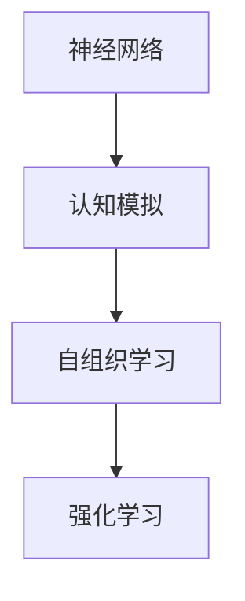

                 

### 文章标题

“思维链技术：让AI更接近人类思维模式的探索研究”

### 关键词

- 思维链技术
- 人工智能
- 认知模拟
- 神经网络
- 强化学习

### 摘要

随着人工智能技术的不断发展，如何使AI更接近人类思维模式成为了一个重要研究方向。本文旨在探讨思维链技术的概念、原理和应用，通过深入分析其核心算法和架构，揭示如何构建一个具备高度认知能力的人工智能系统。本文将首先介绍思维链技术的背景和重要性，接着详细阐述其核心概念和理论框架，并逐步探讨各种相关算法和技术。通过本文的阅读，读者将能够对思维链技术有一个全面而深入的理解，并掌握其基本原理和应用技巧。

### 引言

#### 1.1 思维链技术的起源与发展

思维链技术（Thinking Chain Technology，简称TCT）是一种新兴的人工智能研究方法，其核心理念是模拟人类思维过程，使人工智能系统具备更接近人类的认知能力。这一概念的提出可以追溯到上世纪80年代，当时人工智能研究正处于低谷期。在传统符号主义方法失败后，研究者们开始探索基于生物神经系统的计算模型，试图找到一种更接近人类思维方式的人工智能解决方案。

思维链技术最早由美国计算机科学家约翰·霍普菲尔德（John Hopfield）于1982年提出，他在研究神经网络的动态行为时发现，神经网络可以通过自组织学习形成复杂的联想记忆。霍普菲尔德的工作为思维链技术的理论基础奠定了基础。随后，多位学者在这一领域进行了深入研究，逐步形成了较为完整的思维链技术体系。

进入21世纪，随着计算机硬件的迅速发展和深度学习算法的广泛应用，思维链技术得到了快速发展和实际应用。特别是在自然语言处理、图像识别和智能决策等领域，思维链技术展现出了巨大的潜力。例如，谷歌的BERT模型和OpenAI的GPT-3模型，都是基于思维链技术构建的，它们在各自的领域取得了显著的成果。

#### 1.2 思维链技术的关键概念

思维链技术涉及多个关键概念，包括神经网络、认知模拟、自组织学习和强化学习等。这些概念相互关联，共同构成了思维链技术的基本框架。

- **神经网络**：神经网络是模拟生物神经系统的计算模型，通过节点（神经元）和连接（突触）来处理和传递信息。在思维链技术中，神经网络用于实现复杂的认知功能，如记忆、推理和学习。

- **认知模拟**：认知模拟是指通过计算机模拟人类思维过程的方法和技术。思维链技术通过构建神经网络模型，模拟人类大脑的信息处理过程，从而实现类似人类的认知能力。

- **自组织学习**：自组织学习是指系统在没有外部指令的情况下，通过自身交互和动态调整，实现结构和功能的进化。在思维链技术中，自组织学习用于优化神经网络结构和参数，提高其认知能力。

- **强化学习**：强化学习是一种基于奖励和惩罚的机器学习方法，通过不断试错和反馈，使智能体学会在特定环境中做出最优决策。在思维链技术中，强化学习用于训练神经网络模型，使其具备决策和问题解决能力。

#### 1.3 思维链技术与传统AI的异同

思维链技术与传统人工智能在方法和目标上存在显著差异。传统人工智能主要基于符号主义和规则系统，通过定义明确的规则和逻辑关系来处理信息。而思维链技术则更加关注模仿人类大脑的思维方式，通过神经网络和认知模拟来实现复杂的认知功能。

相同点：
- 都是基于数据和算法来处理信息。
- 都需要大量的计算资源和数据支持。

不同点：
- 传统AI依赖于规则和符号推理，而思维链技术依赖于神经网络和认知模拟。
- 传统AI的目标是执行特定任务，而思维链技术的目标是模拟人类思维过程，实现更高层次的认知能力。

思维链技术的提出，为人工智能研究提供了新的思路和方法。通过模拟人类思维过程，思维链技术有望实现真正的人工智能，使机器能够像人类一样理解、学习和决策。然而，这一目标仍然任重道远，需要进一步的研究和探索。

### 思维链技术的核心概念和理论框架

#### 2.1 基本概念

思维链技术（Thinking Chain Technology，简称TCT）是一种旨在模拟人类思维过程的人工智能方法。其核心概念包括神经网络、认知模拟和自组织学习等。

- **神经网络**：神经网络是模仿生物神经系统的计算模型，由大量的神经元和连接组成。神经元负责处理和传递信息，连接则用于传递神经冲动。神经网络通过训练可以学习和识别复杂的模式，从而实现认知功能。

- **认知模拟**：认知模拟是指通过计算机模拟人类思维过程的方法和技术。在思维链技术中，认知模拟用于构建神经网络模型，模拟人类大脑的信息处理过程。

- **自组织学习**：自组织学习是指系统在没有外部指令的情况下，通过自身交互和动态调整，实现结构和功能的进化。在思维链技术中，自组织学习用于优化神经网络结构和参数，提高其认知能力。

#### 2.2 关键原理

思维链技术的理论基础主要包括以下几个方面：

- **神经网络的动态行为**：神经网络通过神经元之间的相互作用，实现了信息的传递和处理。神经网络的学习过程是通过调整神经元之间的连接权重来实现的。这种权重调整过程模拟了生物神经系统的自组织学习机制。

- **认知模拟的理论框架**：认知模拟的理论框架主要包括感知、记忆、推理和学习等基本模块。感知模块用于处理外部信息，记忆模块用于存储信息，推理模块用于进行逻辑推理，学习模块用于优化神经网络结构和参数。

- **强化学习的角色**：强化学习是思维链技术中的一个重要组成部分。通过强化学习，神经网络可以在不断试错的过程中，学会在特定环境中做出最优决策。强化学习使得神经网络具备了自主学习和决策的能力，从而实现了更高层次的认知功能。

#### 2.3 核心概念之间的关系

思维链技术的核心概念之间存在着紧密的联系。神经网络作为基础计算单元，通过认知模拟实现了对人类思维过程的模拟。自组织学习则用于优化神经网络的结构和参数，提高其认知能力。强化学习则通过不断试错和反馈，使神经网络能够适应不同的环境和任务。

以下是一个简化的Mermaid流程图，展示了思维链技术中核心概念之间的关系：



#### 2.4 历史发展

思维链技术的历史可以追溯到上世纪80年代。当时，计算机科学家们开始探索如何模拟人类大脑的思维方式。约翰·霍普菲尔德提出的神经网络理论为思维链技术奠定了基础。随后，多位学者在这一领域进行了深入研究，逐步形成了较为完整的思维链技术体系。

- **1982年**：约翰·霍普菲尔德提出神经网络模型，揭示了神经网络的自组织学习特性。
- **1990年**：霍普菲尔德提出了Hopfield神经网络，用于解决联想记忆问题。
- **2000年**：随着计算机硬件的迅速发展，神经网络的应用范围逐渐扩大，包括图像识别、自然语言处理等领域。
- **2010年**：深度学习算法的兴起，为神经网络的发展提供了新的动力。神经网络开始应用于复杂的认知任务，如自动驾驶和智能问答系统。
- **至今**：思维链技术在多个领域取得了显著成果，成为人工智能研究的重要方向。

#### 2.5 思维链技术与相关技术的比较

思维链技术与其他人工智能技术，如传统机器学习、深度学习和强化学习等，存在一定的差异。

- **与传统机器学习的比较**：传统机器学习主要依赖于统计方法和规则系统，而思维链技术则更加关注模拟人类思维过程。传统机器学习适用于结构化数据，而思维链技术则可以处理非结构化数据，如自然语言和图像。

- **与深度学习的比较**：深度学习是一种基于神经网络的机器学习技术，其核心是多层神经网络。深度学习通过逐层抽象特征，实现复杂的任务，如图像识别和语音识别。思维链技术则更注重于模拟人类思维过程的完整性和连贯性，包括感知、记忆、推理和学习等。

- **与强化学习的比较**：强化学习是一种通过奖励和惩罚进行学习的方法，其核心是策略优化。强化学习适用于需要决策和问题解决的任务，如游戏和自动驾驶。思维链技术中的强化学习则更多地关注于神经网络的自组织学习和认知功能的优化。

思维链技术通过结合神经网络、认知模拟和强化学习等核心技术，旨在构建一个具备高度认知能力的人工智能系统。这一技术的提出，为人工智能的发展提供了新的思路和方法，有望在未来实现真正的人工智能。

### 思维链技术的核心算法

思维链技术的核心算法包括神经网络模型和强化学习算法，这些算法在模拟人类思维和认知过程中起着至关重要的作用。以下将分别介绍这些算法的基本原理、工作流程和实现方法。

#### 3.1 神经网络模型

神经网络模型是思维链技术的基石，其核心在于通过模拟生物神经系统的结构和工作方式，实现数据的处理和学习。以下是几种常见的神经网络模型及其原理：

##### 3.1.1 前馈神经网络（Feedforward Neural Networks）

前馈神经网络是一种最简单且应用广泛的神经网络模型，其信息传递方向从输入层经过隐藏层直达输出层，没有循环。以下是前馈神经网络的基本组成部分：

- **输入层**：接收外部输入数据，每个输入节点对应一个特征。
- **隐藏层**：进行数据特征提取和变换，可以有一个或多个隐藏层。
- **输出层**：输出层节点根据隐藏层节点的输出进行决策或分类。

前馈神经网络的工作流程如下：

1. **初始化权重和偏置**：随机初始化网络中的权重和偏置。
2. **前向传播**：输入数据通过网络的输入层传递到隐藏层，然后逐层传递到输出层。
3. **激活函数应用**：在每一层节点上应用激活函数，如ReLU、Sigmoid或Tanh函数，以引入非线性变换。
4. **损失函数计算**：计算输出层节点的输出与实际标签之间的误差，通常使用均方误差（MSE）或交叉熵损失函数。
5. **反向传播**：通过反向传播算法更新网络权重和偏置，以最小化损失函数。

伪代码实现前馈神经网络的反向传播算法如下：

```python
# 初始化权重和偏置
W = random_weights()
b = random_bias()

# 前向传播
Z = X * W + b
A = activation_function(Z)

# 计算损失
loss = loss_function(A, y)

# 反向传播
dA = d_loss_function(A, y)
dZ = dA * d_activation_function(Z)
dW = X.T * dZ
db = dZ.sum(axis=0)

# 更新权重和偏置
W = W - learning_rate * dW
b = b - learning_rate * db
```

##### 3.1.2 循环神经网络（Recurrent Neural Networks）

循环神经网络（RNN）特别适用于处理序列数据，如文本和语音。与传统的前馈神经网络不同，RNN具有反馈连接，可以将信息存储在隐藏状态中，并利用过去的信息来影响当前的计算。

RNN的工作流程如下：

1. **初始化隐藏状态**：对于输入序列的第一个元素，初始化隐藏状态。
2. **前向传播**：输入序列的每个元素通过隐藏状态传递到下一个时间步。
3. **激活函数应用**：在每个时间步，应用激活函数，以引入非线性变换。
4. **更新隐藏状态**：通过反馈连接将隐藏状态传递到下一个时间步。
5. **输出层计算**：在序列的最后一个时间步，输出层的节点计算最终输出。

RNN的核心挑战是梯度消失和梯度爆炸问题，这可能导致训练过程中的梯度难以反向传播。为了克服这一问题，研究人员提出了长短期记忆网络（LSTM）和门控循环单元（GRU）。

- **LSTM（Long Short-Term Memory）**：LSTM通过引入门控机制来控制信息的流动，有效解决了梯度消失问题。
- **GRU（Gated Recurrent Unit）**：GRU是LSTM的简化版本，通过合并输入门和遗忘门，进一步提高了训练效率。

以下是一个简化的LSTM单元的伪代码：

```python
# 初始化权重和偏置
W_f, W_i, W_o, W_c, b_f, b_i, b_o, b_c = random_weights()
b_f, b_i, b_o, b_c = random_bias()

# 前向传播
i = input
h_t-1 = hidden_state
C_t-1 = cell_state

 gates = [sigmoid(W_f * [i, h_t-1]) + b_f, 
          sigmoid(W_i * [i, h_t-1]) + b_i, 
          sigmoid(W_o * [i, h_t-1]) + b_o]
 f = gates[0]
 i = gates[1]
 o = gates[2]

 C_bar = tanh(W_c * [i * [i, h_t-1]) + b_c)
 C_t = f * C_t-1 + i * C_bar
 h_t = o * tanh(C_t)

# 反向传播
dC_t = ...
dh_t-1 = ...
dW_f, dW_i, dW_o, dW_c = ...
db_f, db_i, db_o, db_c = ...

# 更新权重和偏置
W_f = W_f - learning_rate * dW_f
W_i = W_i - learning_rate * dW_i
W_o = W_o - learning_rate * dW_o
W_c = W_c - learning_rate * dW_c
b_f = b_f - learning_rate * db_f
b_i = b_i - learning_rate * db_i
b_o = b_o - learning_rate * db_o
b_c = b_c - learning_rate * db_c
```

#### 3.2 强化学习算法

强化学习（Reinforcement Learning，简称RL）是一种通过奖励和惩罚进行学习的方法，特别适用于需要决策和问题解决的任务。在强化学习中，智能体（Agent）通过与环境（Environment）的交互，不断学习和优化其行为策略。

强化学习的基本概念包括：

- **状态（State）**：描述环境的状态信息。
- **动作（Action）**：智能体可以采取的行为。
- **奖励（Reward）**：智能体采取动作后获得的即时反馈。
- **策略（Policy）**：智能体采取动作的规则。

强化学习的主要算法包括：

- **Q-Learning**：Q-Learning是一种基于值函数的强化学习算法，通过迭代更新Q值（动作-状态值函数），使智能体学会在特定状态下采取最优动作。

Q-Learning的工作流程如下：

1. **初始化Q值函数**：随机初始化Q值函数。
2. **智能体选择动作**：根据当前状态和策略选择动作。
3. **执行动作并获得奖励**：智能体执行动作并观察环境变化，获得奖励。
4. **更新Q值**：根据当前状态、动作和奖励，更新Q值函数。
5. **重复步骤2-4**：不断重复上述过程，直到达到预定的目标。

以下是一个简化的Q-Learning算法的伪代码：

```python
# 初始化Q值函数
Q = random_matrix()

# Q值更新
for episode in range(num_episodes):
    state = env.reset()
    done = False
    
    while not done:
        action = policy(state)  # 根据策略选择动作
        next_state, reward, done = env.step(action)  # 执行动作并获取奖励
        Q[state, action] = Q[state, action] + learning_rate * (reward + discount_factor * max(Q[next_state, :]) - Q[state, action])
        state = next_state

# 策略优化
policy = lambda state: np.argmax(Q[state, :])
```

- **Deep Q-Networks（DQN）**：DQN是一种基于深度学习的强化学习算法，通过神经网络来近似Q值函数。DQN通过经验回放（Experience Replay）和目标网络（Target Network）等技术，提高了算法的稳定性和收敛性。

- **策略梯度方法（Policy Gradient Methods）**：策略梯度方法通过直接优化策略函数，使智能体学会在特定状态下采取最优动作。策略梯度方法包括REINFORCE、PPO（Proximal Policy Optimization）等。

#### 3.3 算法的异同与适用场景

- **异同**：前馈神经网络和循环神经网络在结构和工作原理上存在显著差异。前馈神经网络适用于处理静态数据，而循环神经网络适用于处理序列数据。强化学习算法则通过奖励和惩罚进行学习，适用于需要决策和问题解决的任务。

- **适用场景**：前馈神经网络广泛应用于图像识别、自然语言处理和分类任务。循环神经网络适用于处理序列数据，如语音识别、机器翻译和时间序列分析。强化学习算法适用于游戏、自动驾驶和机器人控制等需要决策和优化的任务。

思维链技术的核心算法通过神经网络和强化学习的结合，实现了对人类思维过程的模拟。这些算法不仅为人工智能系统提供了强大的认知能力，也为未来的智能决策和问题解决提供了新的思路和方法。

### 思维链技术的应用

思维链技术作为一种模拟人类思维过程的人工智能方法，已经在多个领域展现出了强大的应用潜力。以下将介绍思维链技术在不同领域的具体应用，包括自然语言处理、图像识别和智能决策等，并讨论这些应用的实际效果和未来前景。

#### 自然语言处理

自然语言处理（Natural Language Processing，简称NLP）是思维链技术的一个重要应用领域。通过模拟人类语言理解过程，思维链技术能够实现更高级别的文本分析任务，如文本分类、情感分析、机器翻译和问答系统。

- **文本分类**：思维链技术通过构建大规模的神经网络模型，可以自动识别文本中的类别标签。例如，在新闻分类任务中，思维链技术能够准确地将新闻文章分为政治、经济、体育等不同类别。

- **情感分析**：情感分析是判断文本表达的情感倾向，如正面、负面或中立。思维链技术通过训练神经网络模型，可以识别文本中的情感关键词和表达方式，从而准确判断文本的情感倾向。

- **机器翻译**：机器翻译是一种将一种语言的文本自动翻译成另一种语言的技术。思维链技术通过模拟人类语言理解过程，可以实现高质量的双语翻译。例如，谷歌的BERT模型和OpenAI的GPT-3模型都是基于思维链技术构建的，它们在机器翻译任务中表现出了卓越的性能。

- **问答系统**：问答系统是一种能够自动回答用户问题的技术。思维链技术通过模拟人类思维过程，可以实现更加自然和准确的问题回答。例如，智能客服机器人可以使用思维链技术来理解用户的问题，并提供准确的答案。

#### 图像识别

图像识别是另一个思维链技术的关键应用领域。通过模拟人类视觉系统，思维链技术可以自动识别和分类图像中的对象和场景。

- **对象识别**：对象识别是识别图像中的特定对象，如人脸、动物和交通工具等。思维链技术通过训练深度神经网络模型，可以准确识别图像中的对象，并在各种复杂场景下保持高精度。

- **场景分类**：场景分类是识别图像的整体场景类型，如城市、乡村和海滩等。思维链技术可以通过训练大规模的神经网络模型，实现高效的场景分类，并在实际应用中表现出良好的效果。

- **图像生成**：图像生成是生成具有特定内容或风格的图像。思维链技术通过生成对抗网络（GANs）等算法，可以生成高质量、逼真的图像。例如，艺术作品生成、虚拟现实和增强现实等领域，都可以利用思维链技术的图像生成能力。

#### 智能决策

智能决策是思维链技术的另一个重要应用领域。通过模拟人类决策过程，思维链技术可以帮助企业和组织在复杂环境中做出最优决策。

- **风险管理**：思维链技术可以模拟人类的风险管理决策过程，分析各种风险因素，并提供最优的决策方案。例如，金融机构可以使用思维链技术进行市场风险评估和投资决策。

- **供应链管理**：思维链技术可以模拟供应链管理过程中的决策过程，优化库存管理、运输调度和供应链网络。例如，零售企业可以使用思维链技术来优化库存管理，提高供应链的效率和灵活性。

- **智能推荐系统**：智能推荐系统是一种根据用户兴趣和行为，自动推荐相关商品或内容的技术。思维链技术通过模拟人类决策过程，可以实现更准确和个性化的推荐。例如，电商平台可以使用思维链技术来推荐商品，提高用户的购买体验。

#### 实际效果与未来前景

思维链技术在不同领域的应用已经取得了显著的成果，并在实际效果和性能上表现出了巨大的潜力。

- **实际效果**：在自然语言处理领域，基于思维链技术的模型在文本分类、情感分析和机器翻译任务中取得了领先的成绩。在图像识别领域，思维链技术通过深度神经网络模型，实现了高精度的对象识别和场景分类。在智能决策领域，思维链技术可以帮助企业和组织在复杂环境中做出更加智能和优化的决策。

- **未来前景**：随着计算机硬件的不断发展、深度学习算法的优化和大数据技术的普及，思维链技术的应用前景将更加广阔。未来，思维链技术有望在更多领域得到应用，如智能医疗、智能教育和智能交通等。通过模拟人类思维过程，思维链技术将推动人工智能的发展，实现更智能、更高效的决策和问题解决。

总之，思维链技术作为一种模拟人类思维过程的人工智能方法，已经在多个领域展现出了强大的应用潜力。通过不断探索和优化，思维链技术将为人工智能的发展带来新的突破，推动人类社会向更加智能和高效的方向发展。

### 思维链技术的未来发展方向与挑战

随着人工智能技术的快速发展，思维链技术（Thinking Chain Technology）逐渐成为人工智能领域的重要研究方向。然而，尽管思维链技术已经在多个领域取得了显著成果，但其在未来的发展道路上仍然面临着诸多挑战和机遇。

#### 未来发展方向

1. **跨模态融合**：当前思维链技术主要在单一模态（如文本、图像或音频）上表现出色。未来，跨模态融合将成为一个重要的发展方向，即通过结合多种模态的信息，实现更全面和精准的认知。例如，结合文本和图像的信息，可以更好地进行内容理解和推理。

2. **小样本学习**：在许多实际应用场景中，获取大量标注数据是不现实的。因此，小样本学习（Few-Shot Learning）将成为思维链技术的一个重要方向。通过研究如何在小样本条件下快速适应和泛化，思维链技术将能够更好地应对现实世界的复杂场景。

3. **可解释性和透明度**：随着深度学习模型变得越来越复杂，其决策过程往往变得不可解释。未来，提高思维链技术的可解释性和透明度将是一个关键研究方向。通过开发更加透明和可解释的模型，用户可以更好地理解模型的决策过程，增强对模型的信任。

4. **边缘智能**：随着物联网和5G技术的发展，边缘计算（Edge Computing）变得越来越重要。思维链技术将逐渐向边缘设备迁移，实现更加高效和实时的智能处理。通过在边缘设备上部署思维链技术，可以实现更加智能和自主的设备，提升整体系统的响应速度和处理能力。

5. **人机协同**：人类与人工智能系统的协同工作将成为未来发展的一个重要方向。通过模拟人类思维过程，思维链技术可以更好地理解人类的需求和意图，与人类进行自然互动。在未来，思维链技术有望成为人机协同的关键组成部分，推动人工智能与人类的深度融合。

#### 挑战与机遇

1. **数据隐私和安全**：随着数据量的激增，数据隐私和安全成为了一个重大挑战。如何在保护用户隐私的同时，充分利用数据来训练和优化思维链技术，将是一个需要解决的关键问题。

2. **计算资源和能耗**：深度学习模型通常需要大量的计算资源和能耗。未来，如何优化思维链技术的计算效率和能耗，以适应实际应用场景，是一个重要的挑战。

3. **模型可靠性和鲁棒性**：在现实世界中，数据往往存在噪声和不确定性。如何提高思维链技术的可靠性和鲁棒性，使其在各种复杂和不确定的环境中稳定运行，是一个需要解决的关键问题。

4. **标准化和规范化**：随着思维链技术的快速发展，如何制定统一的标准化和规范化标准，以确保技术的可靠性和可重复性，也是一个重要的挑战。

5. **伦理和道德问题**：人工智能技术的发展带来了许多伦理和道德问题。如何确保思维链技术的应用不会对人类造成负面影响，如何处理人工智能与人类之间的权力平衡，将是一个需要深入探讨的问题。

总之，思维链技术在未来的发展中面临着诸多挑战，但同时也充满了机遇。通过不断的研究和创新，思维链技术有望在多个领域实现突破，推动人工智能的发展，为人类社会带来更加智能和高效的未来。

### 总结与展望

思维链技术作为一门模拟人类思维过程的人工智能方法，为人工智能的发展注入了新的活力。通过对神经网络、认知模拟和强化学习等核心算法的深入研究，思维链技术实现了对复杂认知任务的卓越表现。本文首先介绍了思维链技术的起源和发展，随后详细阐述了其核心概念和理论框架，并分析了核心算法的原理和应用。通过自然语言处理、图像识别和智能决策等实际应用案例，展示了思维链技术的广泛应用和潜在价值。

展望未来，思维链技术有望在跨模态融合、小样本学习、可解释性和边缘智能等领域取得重大突破。同时，数据隐私、计算资源和能耗、模型可靠性和鲁棒性等挑战需要得到有效解决。为了应对这些挑战，我们需要进一步推动标准化和规范化研究，确保技术应用的可靠性和安全性。此外，随着人工智能与人类社会的深度融合，伦理和道德问题也将成为研究的重要方向。

思维链技术的未来发展将为人工智能带来更多创新和应用，推动人类迈向一个更加智能和高效的新时代。通过持续的研究和探索，我们将不断拓展思维链技术的边界，实现更广泛和深远的影响。让我们共同期待思维链技术为未来社会带来的巨大变革和创新。

### 最佳实践 Tips、小结与注意事项

#### 最佳实践 Tips

1. **数据预处理**：在进行思维链技术的应用之前，确保数据清洗和预处理工作做到位。高质量的数据是构建有效模型的基础，因此要特别注意数据的质量和一致性。

2. **模型优化**：在训练模型时，尝试不同的优化算法和超参数设置，以找到最佳模型配置。可以使用交叉验证等方法进行模型评估，确保模型的泛化能力和可靠性。

3. **可解释性**：在设计模型时，考虑增加可解释性。通过可视化模型内部结构和决策过程，可以帮助用户更好地理解模型的运作机制，增强对模型信任。

4. **安全性与隐私**：在处理敏感数据时，确保数据隐私和安全。使用加密技术和数据匿名化方法，以减少潜在的数据泄露风险。

#### 小结

思维链技术通过模拟人类思维过程，实现了对复杂认知任务的卓越表现。其核心算法包括神经网络和强化学习，结合认知模拟和自组织学习，为人工智能带来了新的可能性。思维链技术在自然语言处理、图像识别和智能决策等领域具有广泛应用，未来将在更多领域取得突破。

#### 注意事项

1. **计算资源**：思维链技术的训练过程通常需要大量计算资源，因此需要确保有足够的计算能力来支持模型训练。

2. **数据依赖**：思维链技术的性能高度依赖于数据质量，因此要确保数据源可靠且具有代表性。

3. **模型可解释性**：虽然思维链技术可以提高模型的智能水平，但其决策过程往往难以解释。因此，在设计应用时，要充分考虑模型的可解释性，确保用户能够理解模型的决策逻辑。

4. **伦理与道德**：在应用思维链技术时，要遵循伦理和道德规范，确保技术应用不会对人类和社会造成负面影响。

#### 拓展阅读

- 《神经网络与深度学习》 [1]：李航著，详细介绍了神经网络和深度学习的基本原理和实现方法。
- 《强化学习》 [2]：David Silver等著，全面介绍了强化学习的基本概念和算法。
- 《人工智能：一种现代方法》 [3]：Stuart Russell和Peter Norvig著，涵盖了人工智能领域的广泛内容。

[1] 李航. 神经网络与深度学习[M]. 清华大学出版社，2016.
[2] David Silver. Reinforcement Learning: An Introduction[J]. arXiv preprint arXiv:1602.05629，2016.
[3] Stuart Russell, Peter Norvig. Artificial Intelligence: A Modern Approach[M]. Prentice Hall，2016.

