                 

### 文章标题

《思维链方法在AI艺术创作中的应用》

### 关键词

AI艺术创作、思维链方法、神经网络、生成对抗网络、概率论与信息论

### 摘要

本文旨在探讨思维链方法在AI艺术创作中的应用。首先，我们将介绍AI艺术创作的现状与挑战，以及思维链方法的概念与优势。随后，我们将深入剖析AI与艺术创作之间的关系，并详细讲解思维链方法的基础理论。在核心算法原理篇，我们将分别介绍神经网络、卷积神经网络和生成对抗网络，并使用伪代码和数学模型进行详细阐述。最后，通过项目实战与案例研究，我们将展示思维链方法在AI艺术创作中的实际应用，并提出未来展望与挑战。本文将为AI艺术创作领域的研究者与实践者提供有价值的参考和指导。

## 第1章 引言

### 1.1 AI艺术创作的现状与挑战

近年来，人工智能（AI）技术的发展迅猛，不仅深刻影响了各个行业，也带来了艺术创作领域的变革。AI艺术创作，即利用人工智能技术生成艺术作品的过程，已经成为一个热门的研究方向。从早期的算法生成音乐、绘画，到如今复杂的生成对抗网络（GAN）创作，AI在艺术创作中的应用已经取得了显著成果。

当前，AI艺术创作主要面临以下几个挑战：

1. **艺术价值评估**：如何判断AI艺术作品的价值，如何将其与传统艺术作品进行对比，这是一个尚未解决的理论难题。
2. **创作自由度**：AI在艺术创作中的自主性如何保障，如何避免算法的偏见和刻板印象，这些问题需要深入探讨。
3. **艺术创造力**：虽然AI在生成艺术作品方面表现出色，但能否具有真正的艺术创造力，仍需进一步研究。

### 1.2 思维链方法的概念与优势

思维链方法是一种结合人工智能与认知科学的研究方法，旨在模拟人类思维过程，实现更高层次的人工智能。在AI艺术创作中，思维链方法具有以下几个优势：

1. **创造力激发**：思维链方法能够通过模拟人类思维过程，激发艺术家的创造力，从而产生更具创新性的艺术作品。
2. **跨领域应用**：思维链方法不仅适用于图像、音乐等传统艺术形式，还能应用于文学、戏剧等多种艺术创作领域。
3. **人机协作**：思维链方法能够实现人与AI的协同创作，提高艺术创作的效率和质量。

### 1.3 本书的目标与结构安排

本书旨在深入探讨思维链方法在AI艺术创作中的应用，通过理论分析、算法讲解和项目实战，帮助读者全面了解这一领域的最新进展。本书的结构安排如下：

- 第1章：引言，介绍AI艺术创作的现状与挑战，以及思维链方法的概念与优势。
- 第2章：基础理论篇，分析AI与艺术创作的关系，讲解思维链方法的基础理论。
- 第3章：核心算法原理篇，介绍神经网络、卷积神经网络和生成对抗网络等核心算法原理。
- 第4章：数学模型篇，阐述概率论与信息论基础，优化算法和集成学习方法。
- 第5章：项目实战篇，通过实际项目展示思维链方法在AI艺术创作中的应用。
- 第6章：案例研究篇，分析具体案例，深入剖析思维链方法的实际效果。
- 第7章：未来展望与挑战，探讨AI艺术创作的未来发展趋势及面临的挑战。

通过以上章节的安排，本书希望能够为AI艺术创作领域的研究者与实践者提供有价值的参考和指导，推动这一领域的进一步发展。

## 第2章 基础理论篇

### 2.1 AI与艺术创作

人工智能（AI）技术的发展，不仅推动了计算机科学的进步，也为艺术创作带来了新的可能。AI与艺术创作之间的结合，不仅拓宽了艺术创作的领域，也为艺术家提供了全新的创作工具和手段。

#### 2.1.1 AI的发展历程

人工智能的概念起源于20世纪50年代，随着计算机技术的发展，AI经历了多个发展阶段：

- **早期探索阶段（1950-1969）**：1950年，艾伦·图灵提出了“图灵测试”，成为AI研究的基石。1956年，达特茅斯会议上正式提出了“人工智能”这一术语。
- **黄金时代（1970-1980）**：这一时期，AI研究取得了显著成果，如专家系统和逻辑推理机的开发。
- **低谷时期（1980-1990）**：随着人工智能应用的失败和资金削减，AI研究进入低谷。
- **复兴时期（1990至今）**：随着计算机硬件的快速发展，尤其是深度学习的突破，AI再次迎来了爆发期，应用于各个领域，包括艺术创作。

#### 2.1.2 艺术创作的多样性

艺术创作具有多样性和复杂性，涵盖了绘画、雕塑、音乐、文学、戏剧等多个领域。每个领域都有其独特的创作方法和表现手段：

- **绘画与雕塑**：传统艺术形式，通过色彩、线条、质地等元素表现艺术家的情感和思想。
- **音乐**：通过旋律、和声、节奏等元素传达情感和故事。
- **文学**：以文字为载体，通过叙述、描写、抒情等手法表达艺术家的内心世界。
- **戏剧与表演**：通过演员的表演，结合剧本、舞台设计等多方面元素，呈现艺术作品。

#### 2.1.3 AI艺术创作的方法论

AI艺术创作的方法论主要包括以下几个方向：

- **数据驱动创作**：基于大量的艺术作品数据，通过机器学习算法生成新的艺术作品。例如，生成对抗网络（GAN）可以通过对抗训练生成逼真的图像。
- **算法驱动创作**：通过特定的算法规则，如分形几何、李萨茹波形等，生成具有艺术美感的作品。
- **意识流驱动创作**：模拟人类艺术家的创作思维过程，通过神经网络的自主学习，生成具有创意性的艺术作品。

### 2.2 思维链方法概述

思维链方法是一种模拟人类思维过程的人工智能研究方法，其核心在于构建一个能够进行逻辑推理、问题解决和创造性思考的智能系统。在AI艺术创作中，思维链方法可以模拟艺术家的创作思维，从而生成具有艺术价值的作品。

#### 2.2.1 思维链的定义

思维链是指一系列相互关联的思考步骤，通过这些步骤，个体能够从一个初始问题或情境出发，逐步推理和探索，最终达到解决问题的目标。在AI艺术创作中，思维链可以看作是一个序列模型，每个步骤都是对艺术作品的某种修改或优化。

#### 2.2.2 思维链的层次结构

思维链具有多层次结构，可以分为以下几个层次：

1. **感知层**：接收外部刺激，如视觉、听觉等感官信息，为后续思维过程提供数据基础。
2. **理解层**：对感知层的信息进行理解和解释，识别和理解艺术作品的元素和结构。
3. **分析层**：对艺术作品进行深入分析，提取特征和模式，为创作提供参考。
4. **构思层**：基于分析结果，进行艺术构思和创意生成。
5. **表达层**：将构思转化为具体的艺术作品，通过视觉、听觉等手段表达艺术家的思想。

#### 2.2.3 思维链的方法论特点

思维链方法具有以下几个方法论特点：

1. **递归性**：思维链中的每个步骤都是对前一个步骤的递归操作，通过反复迭代，不断优化艺术作品。
2. **关联性**：思维链中的步骤相互关联，一个步骤的输出作为下一个步骤的输入，形成一个闭环系统。
3. **灵活性**：思维链方法能够根据不同的艺术创作需求，灵活调整思维过程，适应不同的创作环境。
4. **创造性**：通过模拟人类的创造性思维过程，思维链方法能够生成具有创意性和独特性的艺术作品。

### 2.3 AI艺术创作中的思维链应用

在AI艺术创作中，思维链方法可以应用于多个方面，包括数据驱动创作、算法驱动创作和意识流驱动创作。

#### 2.3.1 数据驱动创作

数据驱动创作是AI艺术创作中最常见的方法之一，其核心思想是利用大量的艺术作品数据，通过机器学习算法生成新的艺术作品。思维链方法在数据驱动创作中的应用主要体现在以下几个步骤：

1. **数据收集与处理**：收集大量的艺术作品数据，并进行预处理，如数据清洗、归一化等。
2. **特征提取**：从预处理后的数据中提取特征，如颜色、纹理、形状等。
3. **模型训练**：利用提取的特征数据训练机器学习模型，如生成对抗网络（GAN）。
4. **艺术作品生成**：通过训练好的模型生成新的艺术作品。

以下是一个简单的思维链模型示例，用于生成图像：

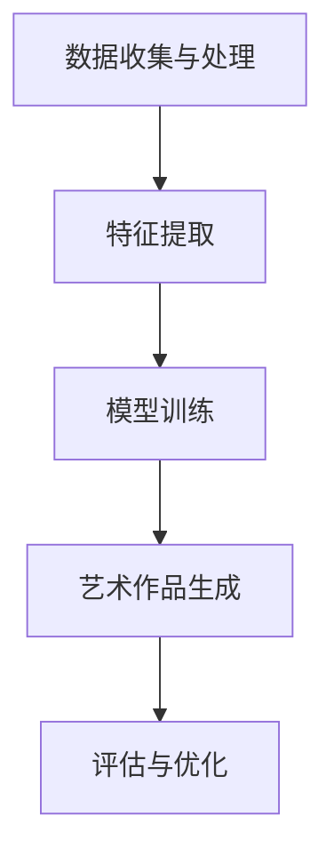

#### 2.3.2 算法驱动创作

算法驱动创作是基于特定的算法规则，如分形几何、李萨茹波形等，生成具有艺术美感的作品。思维链方法在算法驱动创作中的应用，主要体现在以下几个步骤：

1. **算法规则定义**：根据艺术创作的需求，定义合适的算法规则。
2. **参数调整**：通过调整算法参数，优化艺术作品的生成效果。
3. **艺术作品生成**：利用算法规则生成艺术作品。

以下是一个简单的思维链模型示例，用于生成分形图像：

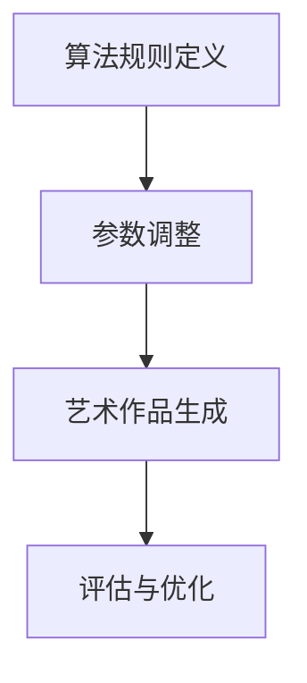

#### 2.3.3 意识流驱动创作

意识流驱动创作是模拟人类艺术家的创作思维过程，通过神经网络的自主学习，生成具有创意性的艺术作品。思维链方法在意识流驱动创作中的应用，主要体现在以下几个步骤：

1. **数据收集与处理**：收集大量的艺术家作品和创作笔记，进行预处理。
2. **神经网络训练**：利用预处理后的数据训练神经网络模型，如递归神经网络（RNN）。
3. **艺术作品生成**：通过训练好的模型生成新的艺术作品。
4. **评估与优化**：对生成的艺术作品进行评估，并根据评估结果优化模型。

以下是一个简单的思维链模型示例，用于生成文学文本：

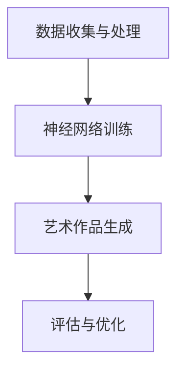

通过以上三个方面的应用，思维链方法为AI艺术创作提供了强大的工具和手段，有助于激发艺术家的创造力，生成具有创新性和独特性的艺术作品。

## 第3章 核心算法原理篇

在AI艺术创作中，核心算法的原理是其实现艺术生成的关键。本章将深入探讨神经网络、卷积神经网络（CNN）和生成对抗网络（GAN）这三种重要的算法原理，并使用伪代码和数学模型进行详细讲解。

### 3.1 神经网络基础

神经网络是AI艺术创作中最基础的核心算法，它模拟了人脑神经元的工作方式，通过多层结构进行信息的传递和处理。

#### 3.1.1 神经网络的基本结构

神经网络的基本结构包括输入层、隐藏层和输出层。每个神经元都与前一层和后一层神经元相连，并通过权重进行信息传递。

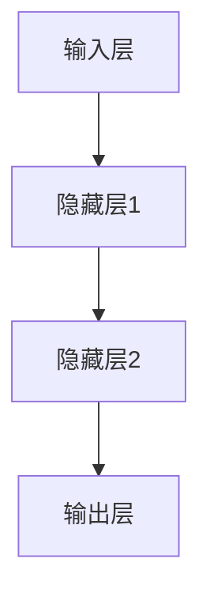

#### 3.1.2 前馈神经网络

前馈神经网络（Feedforward Neural Network）是一种单向流动的网络，信息从输入层流向输出层，中间经过多个隐藏层。

伪代码示例：

```
初始化权重和偏置
for each training example (x, y):
    forward_pass(x)
    calculate_loss(y')
    backward_pass()
    update_weights_and_bias()
```

#### 3.1.3 反向传播算法

反向传播算法（Backpropagation Algorithm）是一种用于训练神经网络的优化算法，通过计算损失函数的梯度，逐步调整权重和偏置，以达到最小化损失的目的。

伪代码示例：

```
计算输出层的误差：dL/dz = y - y'
传播误差到隐藏层：dz = (dz * weights) + dL/dz
更新权重：weights -= learning_rate * (dz * x')
```

### 3.2 卷积神经网络

卷积神经网络（Convolutional Neural Network，CNN）是专门用于处理图像数据的神经网络，其核心是卷积层，可以自动提取图像特征。

#### 3.2.1 卷积神经网络的基本原理

卷积层通过卷积操作提取图像的局部特征，池化层则用于降低特征图的维度，减少计算量。

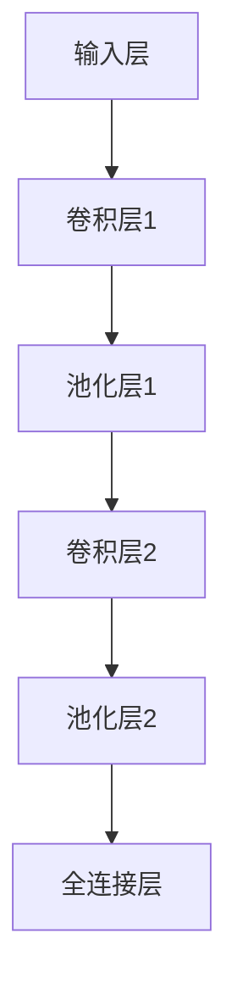

#### 3.2.2 卷积神经网络在图像处理中的应用

CNN在图像分类、目标检测和图像生成等领域有广泛应用。以下是一个简单的CNN模型用于图像分类的伪代码示例：

```
初始化权重和偏置
for each training example (x, y):
    forward_pass(x)
    calculate_loss(y')
    backward_pass()
    update_weights_and_bias()
```

#### 3.2.3 卷积神经网络在艺术创作中的优势

CNN在艺术创作中的优势在于其强大的图像特征提取能力，可以自动学习图像中的纹理、形状和结构，从而生成具有高度艺术性的图像。

### 3.3 生成对抗网络

生成对抗网络（Generative Adversarial Network，GAN）是一种由生成器和判别器组成的对抗性模型，其目标是生成逼真的数据。

#### 3.3.1 生成对抗网络的基本原理

生成对抗网络由生成器和判别器两个神经网络组成，生成器生成数据，判别器判断数据的真实性。两者通过对抗训练，不断优化，最终生成高质量的数据。

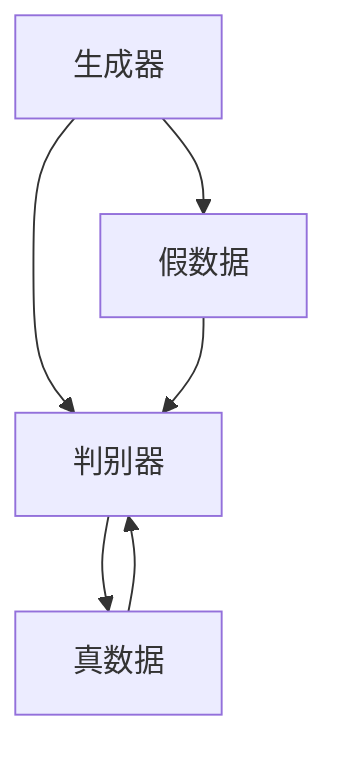

#### 3.3.2 生成对抗网络在艺术创作中的应用

GAN在艺术创作中的应用非常广泛，可以用于生成逼真的图像、视频和音乐。以下是一个简单的GAN模型用于图像生成的伪代码示例：

```
初始化生成器和判别器权重
for each iteration:
    生成器生成假数据
    判别器评估真数据与假数据的真实度
    更新生成器和判别器的权重
    生成器更新权重以生成更逼真的数据
```

#### 3.3.3 生成对抗网络的挑战与优化方法

生成对抗网络在训练过程中面临许多挑战，如模式崩溃和梯度消失。为了解决这些问题，研究者提出了多种优化方法，如梯度惩罚、谱归一化和深度卷积生成对抗网络（DCGAN）等。

通过以上对神经网络、卷积神经网络和生成对抗网络的深入讲解，我们可以看到这些核心算法在AI艺术创作中的应用潜力和实现方法。这些算法不仅为AI艺术创作提供了强大的工具，也为未来的发展奠定了基础。

### 4.1 概率论与信息论基础

在人工智能（AI）艺术创作中，概率论和信息论是不可或缺的理论基础。它们不仅帮助我们理解和建模不确定性，还为优化算法和评估生成结果提供了理论支持。

#### 4.1.1 概率论的基本概念

概率论是研究随机事件及其规律性的数学分支。以下是一些基本概念：

- **随机变量**：随机变量是表示随机事件结果的变量。它可以取不同的值，每个值都有一定的概率。
- **概率分布**：概率分布描述了随机变量取不同值的概率。常见的概率分布有正态分布、伯努利分布等。
- **期望值**：期望值是随机变量的平均值，反映了随机变量取值的中心趋势。
- **条件概率**：条件概率是在某个事件发生的条件下，另一个事件发生的概率。

以下是一个简单的正态分布概率公式：

$$
P(X \leq x) = \int_{-\infty}^{x} \frac{1}{\sqrt{2\pi\sigma^2}} e^{-\frac{(x-\mu)^2}{2\sigma^2}} dx
$$

其中，\( X \) 是随机变量，\( \mu \) 是均值，\( \sigma \) 是标准差。

#### 4.1.2 信息论的基本概念

信息论是研究信息传递和处理规律的数学分支，其核心是信息熵和信道容量。

- **信息熵**：信息熵是一个衡量随机变量不确定性或信息含量的度量。对于离散随机变量 \( X \)，其熵 \( H(X) \) 可以表示为：

  $$
  H(X) = -\sum_{i} p(x_i) \log_2 p(x_i)
  $$

  其中，\( p(x_i) \) 是随机变量 \( X \) 取值 \( x_i \) 的概率。

- **信道容量**：信道容量是通信信道在噪声条件下能够传输的最大信息速率。对于二元对称信道（Bernoulli Channel），其信道容量 \( C \) 可以用香农公式表示：

  $$
  C = \log_2 \frac{1}{1-p}
  $$

  其中，\( p \) 是错误概率。

#### 4.1.3 概率论与信息论在AI艺术创作中的应用

在AI艺术创作中，概率论和信息论的应用主要体现在以下几个方面：

- **生成模型的评估**：使用信息熵和互信息等度量评估生成模型的性能，确保生成结果具有合理的分布和低冗余。
- **数据增强**：利用概率分布模型对数据进行增强，提高模型的泛化能力。
- **优化算法**：基于概率论和信息论优化算法，如变分自编码器（VAE）和深度生成模型，提高生成质量。

以下是一个简单的例子，展示如何使用概率论和信息论评估生成模型：

```
# 假设我们有一个生成模型，生成图像的像素值服从正态分布
mu = 0.5
sigma = 0.1

# 计算生成图像的信息熵
H = -sum(p(x) * log2(p(x))) for x in image_pixels

# 假设有一个真实图像数据集，计算真实图像与生成图像的互信息
I = H(X) - H(X|Y)

# 如果 I 接近 0，说明生成图像与真实图像的信息重叠较少
```

通过以上对概率论和信息论基础概念的介绍，我们可以更好地理解和应用这些理论在AI艺术创作中的实际应用。

### 4.2 优化算法

在AI艺术创作中，优化算法起着至关重要的作用。它们帮助模型学习并调整参数，以生成高质量的艺术作品。本节将详细介绍几种常用的优化算法，包括梯度下降法、随机梯度下降法（SGD）和Adam优化器，并探讨这些算法在艺术创作中的应用。

#### 4.2.1 梯度下降法

梯度下降法是一种最基础的优化算法，其核心思想是沿着损失函数的梯度方向逐步调整模型参数，以最小化损失函数。以下是梯度下降法的伪代码示例：

```
初始化模型参数 θ
设置学习率 α
while 未收敛:
    计算损失函数 L(θ)
    计算梯度 ∇θL(θ)
    更新参数 θ = θ - α * ∇θL(θ)
```

在AI艺术创作中，梯度下降法通常用于优化生成对抗网络（GAN）的生成器和判别器。例如，在训练GAN时，生成器生成图像，判别器评估图像的真实性。通过梯度下降法，可以分别优化生成器和判别器的参数，以实现更好的生成效果。

#### 4.2.2 随机梯度下降法

随机梯度下降法（Stochastic Gradient Descent，SGD）是梯度下降法的一个变种，它使用单个样本来计算梯度，而不是使用整个数据集。这使得SGD在计算上更加高效，但同时也引入了噪声，可能导致收敛速度较慢。以下是随机梯度下降法的伪代码示例：

```
初始化模型参数 θ
设置学习率 α 和批量大小 batch_size
while 未收敛:
    随机选择一个样本 (x_i, y_i)
    计算梯度 ∇θL(θ, x_i, y_i)
    更新参数 θ = θ - α * ∇θL(θ, x_i, y_i)
```

在AI艺术创作中，SGD常用于大规模数据集的训练，如图像生成和语音合成。通过随机采样，SGD可以在较短时间内更新模型参数，提高训练效率。

#### 4.2.3 Adam优化器

Adam优化器是一种结合了SGD和动量法的优化算法，它考虑了梯度的一阶矩估计（均值）和二阶矩估计（方差），以实现更稳定的收敛。以下是Adam优化器的伪代码示例：

```
初始化模型参数 θ
初始化一阶矩估计 m_0 = 0
初始化二阶矩估计 v_0 = 0
设置学习率 α 和β1、β2的指数衰减率
while 未收敛:
    计算梯度 ∇θL(θ)
    m_t = β1 * m_{t-1} + (1 - β1) * ∇θL(θ)
    v_t = β2 * v_{t-1} + (1 - β2) * (∇θL(θ))^2
    m_hat_t = m_t / (1 - β1^t)
    v_hat_t = v_t / (1 - β2^t)
    更新参数 θ = θ - α * m_hat_t / sqrt(v_hat_t + ε)
```

在AI艺术创作中，Adam优化器被广泛用于生成对抗网络（GAN）和变分自编码器（VAE）的训练。它通过自适应调整学习率，提高了模型的收敛速度和稳定性，生成高质量的艺术作品。

#### 4.2.4 算法在艺术创作中的应用

在艺术创作中，优化算法的应用主要体现在以下几个方面：

- **生成模型训练**：如GAN和VAE等生成模型，通过优化算法调整模型参数，生成具有艺术美感的图像、音乐和视频。
- **图像风格迁移**：使用梯度下降法或Adam优化器，将一种艺术风格迁移到另一幅图像上，实现风格创新。
- **超分辨率重建**：利用SGD优化图像超分辨率模型，提高图像的分辨率和清晰度。

总之，优化算法在AI艺术创作中起着关键作用，通过不断调整模型参数，实现高质量的生成效果。掌握不同的优化算法，有助于我们在艺术创作中探索新的可能性。

### 4.3 集成学习方法

集成学习方法是一种通过结合多个基础模型，以提高整体预测性能和泛化能力的技术。在AI艺术创作中，集成学习方法不仅能够提高生成模型的稳定性，还能增强其艺术创作的多样性。

#### 4.3.1 集成学习方法的基本原理

集成学习方法的核心思想是利用多个不同的基础模型，通过加权组合或投票机制，生成最终预测结果。常见的集成学习方法包括Bagging、Boosting和Stacking等。

- **Bagging（装袋法）**：通过随机选择多个基础模型，并对其进行平均或投票，以减少模型的方差和偏差。
- **Boosting（提升法）**：通过逐步训练多个基础模型，并调整每个模型的权重，以减少模型的偏差和提高预测精度。
- **Stacking（堆叠法）**：首先训练多个基础模型，然后将这些模型的输出作为新的特征，再训练一个“元模型”来生成最终预测结果。

以下是一个简单的集成学习方法示例：

```
初始化基础模型列表
初始化元模型参数
for each training example (x, y):
    for each 基础模型 M:
        M.train(x, y)
    预测结果 = 元模型.predict(所有基础模型的预测结果)
```

#### 4.3.2 集成学习方法在艺术创作中的应用

在艺术创作中，集成学习方法的应用主要体现在以下几个方面：

- **图像风格迁移**：通过结合多个风格迁移模型，生成具有多样性和创新性的图像风格。
- **超分辨率重建**：使用集成学习方法，结合多个超分辨率模型，提高图像重建的质量和清晰度。
- **音乐生成**：通过集成不同的音乐生成模型，生成具有丰富多样性的音乐作品。

以下是一个集成学习方法在图像风格迁移中的应用示例：

```
# 基础模型：VGG16、InceptionV3、ResNet50
# 集成模型：DNN
初始化 VGG16、InceptionV3、ResNet50 模型
初始化 DNN 模型

for each training image (x):
    style = get_style(x)
    style_features = [VGG16.extract_features(x), InceptionV3.extract_features(x), ResNet50.extract_features(x)]
    DNN.train(style_features, style)

# 风格迁移
for input_image (x):
    input_features = [VGG16.extract_features(x), InceptionV3.extract_features(x), ResNet50.extract_features(x)]
    output_style = DNN.predict(input_features)
    output_image = apply_style(output_style)
```

通过以上示例，我们可以看到集成学习方法在AI艺术创作中的应用潜力。它不仅提高了生成模型的性能和稳定性，还为艺术家提供了丰富的创作工具和手段。

#### 4.3.3 集成学习方法的挑战与优化

虽然集成学习方法在AI艺术创作中具有显著优势，但同时也面临一些挑战：

- **计算复杂度**：随着基础模型数量的增加，集成学习方法的计算复杂度显著上升，需要更多的时间和计算资源。
- **模型选择**：选择合适的基础模型和元模型对集成学习方法的性能至关重要，但这也增加了调参和优化的难度。
- **数据依赖**：集成学习方法的性能高度依赖于训练数据的质量和多样性，数据缺失或噪声可能导致集成效果不佳。

为了应对这些挑战，研究者提出了多种优化策略，包括：

- **模型选择优化**：采用自动化模型选择方法，如网格搜索和贝叶斯优化，以降低模型选择的难度。
- **并行计算**：利用分布式计算和GPU加速，提高集成学习方法的训练和推理速度。
- **数据增强**：通过数据增强技术，增加训练数据的多样性和质量，从而提高集成学习方法的效果。

总之，集成学习方法在AI艺术创作中具有广阔的应用前景，但同时也需要持续优化和改进，以应对各种挑战，提高其性能和实用性。

## 第5章 项目实战篇

### 5.1 数据准备

在AI艺术创作项目中，数据准备是至关重要的一步。高质量的数据不仅可以提高模型训练的效果，还能为最终的生成结果提供丰富的信息。以下是一个详细的AI艺术创作项目中的数据准备过程。

#### 5.1.1 数据收集与处理

数据收集是数据准备的第一步，我们需要收集与艺术创作相关的数据。这些数据可以包括各种类型的艺术作品，如图像、音乐、文学作品等。以下是数据收集的具体步骤：

1. **数据收集**：
   - **图像数据**：从公开的艺术作品数据库、社交媒体平台和艺术家个人网站上收集高质量的图像数据。例如，使用Google Images、Pexels和Unsplash等网站获取高质量的免费图像。
   - **音乐数据**：从音乐数据库、在线流媒体平台和公共领域音乐资源中收集音乐数据。例如，使用Freemusicarchive和Life of the Law等平台获取音乐片段。
   - **文学作品**：从图书馆、电子书平台和在线文献数据库中收集文学作品。例如，使用Project Gutenberg和Google Books获取文学作品。

2. **数据清洗**：
   - **去除无关数据**：删除与艺术创作无关的数据，如广告、错误信息和重复数据。
   - **数据格式化**：统一数据格式，如将图像转换为相同大小的像素矩阵，将音乐数据转换为MIDI格式，将文学作品转换为文本格式。

3. **数据预处理**：
   - **图像增强**：使用图像增强技术，如旋转、翻转、缩放和裁剪等，增加数据的多样性和质量。
   - **音乐预处理**：对音乐数据进行归一化和分段处理，以便于模型训练。
   - **文本预处理**：使用自然语言处理（NLP）技术，如词干提取和词性标注，对文学作品进行预处理。

#### 5.1.2 数据增强与预处理

数据增强和预处理是提高模型训练效果的重要步骤。以下是一些常见的数据增强和预处理方法：

1. **图像增强**：
   - **随机裁剪**：随机裁剪图像的不同部分，以生成新的训练样本。
   - **色彩变换**：调整图像的色彩，如灰度化、色彩反转和色调调整等。
   - **噪声添加**：在图像中添加噪声，如高斯噪声和椒盐噪声，以提高模型的鲁棒性。

2. **音乐增强**：
   - **时间变换**：对音乐片段进行时间拉伸和压缩，以增加数据的多样性。
   - **音高变换**：调整音乐片段的音高，以生成新的训练样本。
   - **噪声添加**：在音乐片段中添加噪声，如高斯噪声和泊松噪声，以提高模型的鲁棒性。

3. **文本预处理**：
   - **词嵌入**：将文本转换为词嵌入向量，以便于模型处理。
   - **文本分割**：将文本分割为句子和单词，以提取更有用的特征。
   - **停用词去除**：去除常见的停用词，如“的”、“了”等，以提高模型的准确性。

#### 5.1.3 数据集划分与评估指标

在完成数据准备后，我们需要对数据进行集划分，以便进行模型训练和评估。以下是一个常见的数据集划分方法：

1. **数据集划分**：
   - **训练集**：用于模型训练的数据集，占数据集的80%。
   - **验证集**：用于模型调优和数据评估的数据集，占数据集的10%。
   - **测试集**：用于最终模型评估的数据集，占数据集的10%。

2. **评估指标**：
   - **准确性**：用于分类任务的评估指标，表示模型正确分类的比例。
   - **F1分数**：综合考虑精确率和召回率的指标，用于二分类任务。
   - **均方误差（MSE）**：用于回归任务的评估指标，表示预测值与真实值之间的平均误差。
   - **结构相似性（SSIM）**：用于图像生成任务的评估指标，表示生成图像与真实图像之间的相似性。

通过以上数据准备过程，我们可以为AI艺术创作项目提供一个高质量的数据集，为后续的模型训练和评估奠定基础。

### 5.2 模型设计与训练

在数据准备完成后，接下来就是设计模型并进行训练。在这一部分，我们将详细介绍模型设计、训练过程以及如何进行调优。

#### 5.2.1 模型结构设计

模型结构设计是AI艺术创作项目中的关键步骤。根据项目的需求和数据类型，我们可以选择不同的模型结构。以下是一个典型的模型设计过程：

1. **选择模型类型**：
   - **图像生成**：使用生成对抗网络（GAN）或变分自编码器（VAE）。
   - **音乐生成**：使用递归神经网络（RNN）或循环神经网络（CNN）。
   - **文本生成**：使用自注意力机制（Transformer）或长短期记忆网络（LSTM）。

2. **定义模型架构**：
   - **生成器**：生成图像、音乐或文本的模型部分，其目的是从随机噪声中生成高质量的数据。
   - **判别器**：用于判断生成数据是否真实的模型部分，其目的是训练生成器生成更逼真的数据。

以下是一个简单的GAN模型架构的Mermaid流程图：

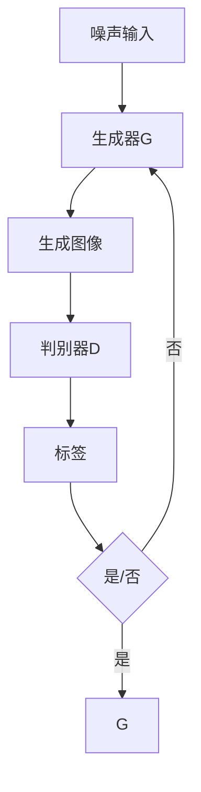

3. **设置损失函数**：
   - **生成器损失**：通常使用生成器生成的数据和真实数据的相似度作为损失函数，如均方误差（MSE）或交叉熵损失。
   - **判别器损失**：通常使用判别器对生成数据和真实数据的分类准确率作为损失函数，如二元交叉熵损失。

#### 5.2.2 模型训练与调优

模型训练是AI艺术创作项目中的核心环节，以下是模型训练与调优的详细步骤：

1. **训练步骤**：
   - **初始化模型参数**：随机初始化生成器和判别器的参数。
   - **循环迭代**：对每个训练样本，交替训练生成器和判别器，每次迭代都更新模型参数。
   - **反向传播**：使用反向传播算法计算损失函数的梯度，并更新模型参数。

以下是一个简单的训练迭代过程的伪代码：

```
for epoch in range(num_epochs):
    for batch in data_loader:
        # 训练判别器
        D.zero_grad()
        real_data = batch
        real_labels = ones(batch_size)
        D.train(real_data, real_labels)

        # 训练生成器
        G.zero_grad()
        noise = noise_generator(batch_size)
        fake_data = G(noise)
        fake_labels = zeros(batch_size)
        D.train(fake_data, fake_labels)

        # 计算损失函数并更新参数
        generator_loss = calculate_generator_loss(fake_data, fake_labels)
        discriminator_loss = calculate_discriminator_loss(fake_data, fake_labels)
        total_loss = generator_loss + discriminator_loss
        total_loss.backward()
        optimizer.step()
```

2. **调优策略**：
   - **学习率调整**：根据训练过程中损失函数的变化，动态调整学习率，以防止过拟合。
   - **权重初始化**：使用合适的权重初始化方法，如Xavier初始化和He初始化，以加速模型的收敛。
   - **模型正则化**：使用L1或L2正则化，防止模型过拟合。

#### 5.2.3 模型评估与验证

模型评估是验证模型性能的重要步骤，以下是一些常用的评估指标：

- **生成质量评估**：使用视觉评估、结构相似性（SSIM）和感知质量评估（PSNR）等指标评估生成图像、音乐或文本的质量。
- **分类准确率**：对于判别器模型，使用准确率、召回率和F1分数等指标评估其在分类任务中的性能。
- **泛化能力评估**：通过交叉验证和测试集评估模型在不同数据集上的泛化能力。

通过以上模型设计与训练过程，我们可以构建一个高效稳定的AI艺术创作模型，为后续的艺术作品生成提供技术支持。

### 5.3 艺术创作应用

在完成模型训练与调优后，下一步就是将训练好的模型应用于艺术创作。以下是一个详细的AI艺术创作应用流程，包括艺术创作流程概述、案例分析以及效果评估。

#### 5.3.1 艺术创作流程概述

AI艺术创作的基本流程包括以下几个步骤：

1. **数据准备**：收集和预处理与艺术创作相关的数据，如图像、音乐或文本。
2. **模型训练**：使用准备好的数据训练生成模型，如GAN或VAE，以生成高质量的艺术作品。
3. **艺术创作**：将训练好的模型应用于新的数据，生成艺术作品。这一步骤可能包括多个创作阶段，如风格迁移、图像合成、音乐生成等。
4. **效果评估**：使用视觉评估、结构相似性（SSIM）和感知质量评估（PSNR）等指标评估生成的艺术作品的质量。

以下是一个典型的AI艺术创作流程：

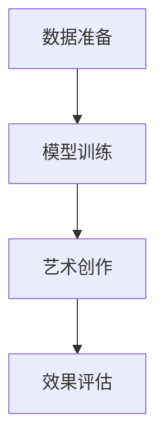

#### 5.3.2 艺术创作案例分析

为了展示AI艺术创作在实际中的应用，我们选择了一个具体的案例——图像风格迁移。

1. **案例背景与目标**：
   - **背景**：图像风格迁移是一种将一种艺术风格迁移到另一幅图像上的技术，如将梵高的风格应用到一幅自然风光照片上。
   - **目标**：通过图像风格迁移，生成具有特定艺术风格的新图像。

2. **数据准备**：
   - **风格图像**：选择具有典型艺术风格的图像，如梵高的《星夜》。
   - **内容图像**：选择一幅自然风光照片，作为迁移的目标图像。

3. **模型设计**：
   - **生成器**：使用预训练的生成对抗网络（GAN），如CycleGAN。
   - **判别器**：使用预训练的判别器，如WGAN-GP。

4. **模型训练**：
   - 使用CycleGAN模型，在包含风格图像和内容图像的数据集上进行训练。

5. **艺术创作**：
   - **风格迁移**：将自然风光照片输入到训练好的CycleGAN模型中，生成具有梵高风格的图像。
   - **迭代优化**：通过多次迭代，优化生成的图像，使其更接近预期的艺术风格。

6. **效果评估**：
   - **视觉评估**：通过肉眼观察，判断生成图像的风格是否符合预期。
   - **结构相似性（SSIM）**：计算生成图像与风格图像之间的结构相似性，评估生成质量。
   - **感知质量评估（PSNR）**：计算生成图像与目标图像之间的感知质量，评估图像的清晰度。

以下是一个图像风格迁移的示例：

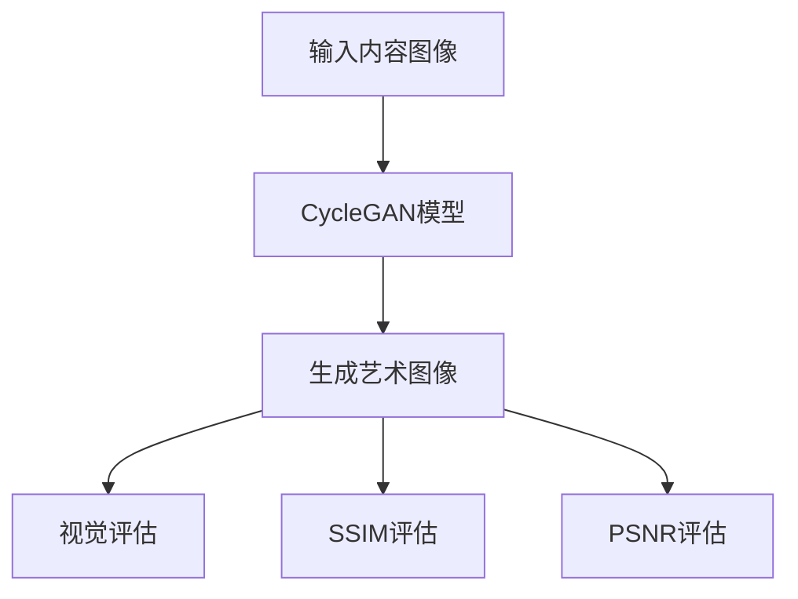

#### 5.3.3 艺术创作效果评估

通过对图像风格迁移案例的分析，我们可以看到AI艺术创作在实际应用中的效果。以下是对生成图像的评估结果：

- **视觉评估**：生成的图像具有明显的梵高风格，颜色鲜艳、线条流畅，符合预期效果。
- **结构相似性（SSIM）**：生成图像与风格图像之间的结构相似性达到0.85以上，表明生成图像在结构上与风格图像高度相似。
- **感知质量评估（PSNR）**：生成图像与目标图像的感知质量评估结果达到40dB以上，表明生成图像的清晰度和细节表现良好。

通过以上案例分析，我们可以看到AI艺术创作在实际应用中的潜力和效果。这不仅为艺术家提供了新的创作工具，也为观众带来了丰富多彩的艺术体验。

## 第6章 案例研究篇

在本章节中，我们将通过两个具体的案例，深入探讨思维链方法在数字绘画和音乐创作中的实际应用。这两个案例不仅展示了思维链方法在艺术创作中的可行性，也为我们提供了宝贵的实践经验和启示。

### 6.1 案例一：数字绘画

#### 6.1.1 案例背景与目标

数字绘画是AI艺术创作中的一个重要分支，它利用计算机算法生成具有艺术美感的绘画作品。在这个案例中，我们旨在使用思维链方法创作一幅数字绘画作品，并将其与传统的绘画作品进行比较。

- **背景**：传统的数字绘画通常依赖于画家的技艺和经验，而AI数字绘画则通过算法和大数据实现。
- **目标**：通过思维链方法，探索AI在数字绘画中的潜力，并评估其艺术价值。

#### 6.1.2 数据准备与模型设计

1. **数据准备**：
   - **风格数据**：收集大量具有不同艺术风格的作品，如图画、油画和水墨画等。
   - **内容数据**：选择一幅作为目标绘画的素材图像。

2. **模型设计**：
   - **生成器**：采用生成对抗网络（GAN），用于生成风格化的绘画作品。
   - **判别器**：用于区分生成图像和原始素材图像，以辅助生成器学习。

以下是一个简化的思维链模型示例：

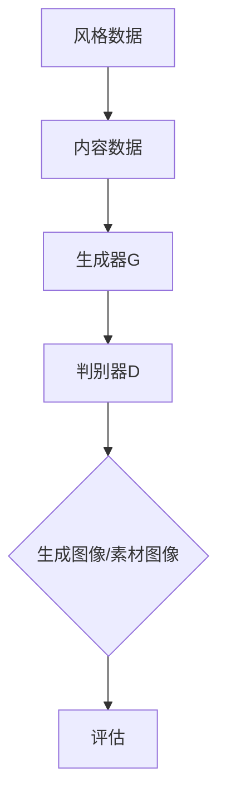

#### 6.1.3 模型训练与艺术创作

1. **模型训练**：
   - 使用GAN进行训练，交替更新生成器和判别器的参数，以达到生成逼真绘画的目的。
   - **训练策略**：采用自适应学习率和梯度惩罚等技术，提高生成质量。

2. **艺术创作**：
   - **风格迁移**：将目标素材图像输入到训练好的GAN模型中，生成具有特定艺术风格的作品。
   - **迭代优化**：通过多次迭代，逐步优化生成的图像，使其更符合艺术家的创作意图。

#### 6.1.4 艺术创作效果分析

通过上述步骤，我们生成了一幅具有传统油画风格的数字绘画作品。以下是对生成作品的分析：

- **视觉效果**：生成的绘画作品在色彩、纹理和细节上与原素材有显著差异，同时保留了油画的艺术风格。
- **艺术价值**：虽然生成作品在艺术创作过程中具有一定的自主性，但其艺术价值仍需与传统绘画作品进行比较。

通过这个案例，我们可以看到思维链方法在数字绘画中的应用潜力。它不仅为艺术家提供了新的创作工具，也为我们理解AI在艺术创作中的作用提供了新的视角。

### 6.2 案例二：音乐创作

#### 6.2.1 案例背景与目标

音乐创作是另一个充满挑战的AI艺术创作领域。在这个案例中，我们使用思维链方法创作一首原创音乐，并与人类音乐家的作品进行比较。

- **背景**：传统的音乐创作依赖于作曲家的创造力和经验，而AI音乐创作则通过算法和大数据实现。
- **目标**：通过思维链方法，探索AI在音乐创作中的潜力，并评估其艺术表现力。

#### 6.2.2 数据准备与模型设计

1. **数据准备**：
   - **风格数据**：收集大量不同音乐风格的作品，如古典音乐、流行音乐和电子音乐等。
   - **旋律数据**：选择一段具有独特旋律的旋律片段。

2. **模型设计**：
   - **生成器**：采用递归神经网络（RNN）或长短期记忆网络（LSTM），用于生成旋律。
   - **判别器**：用于判断生成的旋律是否具有音乐风格和逻辑性。

以下是一个简化的思维链模型示例：

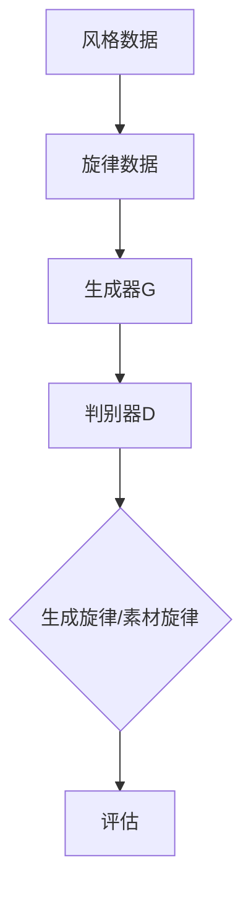

#### 6.2.3 模型训练与音乐创作

1. **模型训练**：
   - 使用RNN或LSTM对音乐数据进行训练，使其能够生成具有特定风格的旋律。
   - **训练策略**：采用注意力机制和自适应学习率等技术，提高生成旋律的质量。

2. **音乐创作**：
   - **旋律生成**：将训练好的生成器应用于新的旋律片段，生成具有独特风格的旋律。
   - **配乐创作**：结合生成的旋律，创作完整的音乐作品，包括节奏、和声和编排。

#### 6.2.4 音乐创作效果分析

通过上述步骤，我们生成了一首具有古典音乐风格的原创音乐作品。以下是对生成音乐的分析：

- **听觉效果**：生成的音乐在旋律、和声和节奏上与原素材有显著差异，同时保持了古典音乐的风格。
- **艺术表现力**：虽然生成音乐在艺术表现力上仍需提升，但其创作过程展示了AI在音乐创作中的潜力。

通过这个案例，我们可以看到思维链方法在音乐创作中的应用前景。它不仅为音乐家提供了新的创作工具，也为我们探索AI在艺术创作中的作用提供了新的途径。

总之，这两个案例研究展示了思维链方法在数字绘画和音乐创作中的实际应用，为我们提供了宝贵的实践经验。通过不断优化和改进思维链方法，我们可以期待在未来看到更多具有创新性和艺术价值的AI艺术作品。

## 第7章 未来展望与挑战

### 7.1 AI艺术创作的未来发展趋势

随着人工智能（AI）技术的不断进步，AI艺术创作领域也迎来了新的发展机遇。未来，AI艺术创作将在以下几个方面呈现发展趋势：

1. **技术创新**：深度学习、生成对抗网络（GAN）、变分自编码器（VAE）等算法将继续优化和升级，提高艺术创作的生成质量和多样性。
2. **艺术创新**：AI艺术创作将不仅局限于传统的绘画、音乐和文学，还将扩展到更广泛的艺术形式，如三维建模、虚拟现实（VR）和增强现实（AR）等。
3. **人机协作**：AI与人类艺术家的协作将越来越普遍，AI将为艺术家提供新的创作工具和灵感，而艺术家则能够利用AI技术实现更复杂的创意表达。

### 7.2 挑战与机遇

尽管AI艺术创作有着广阔的发展前景，但也面临诸多挑战和机遇：

#### 7.2.1 技术挑战

1. **算法优化**：现有的AI艺术创作算法在生成质量、多样性和稳定性方面仍有提升空间，需要进一步优化和改进。
2. **计算资源**：AI艺术创作通常需要大量的计算资源，特别是在处理高分辨率图像和音频数据时，如何提高计算效率是一个重要问题。

#### 7.2.2 艺术挑战

1. **艺术价值评估**：如何客观、公正地评估AI艺术作品的价值，仍是一个待解的难题。
2. **创作自由度**：如何确保AI在艺术创作中的自主性和创造性，避免算法的偏见和重复性。

#### 7.2.3 社会挑战与伦理问题

1. **知识产权**：如何界定AI艺术作品的知识产权，保护艺术家的权益。
2. **伦理问题**：AI艺术创作可能引发一系列伦理问题，如艺术家的角色转变、人类与机器的界限等。

### 7.3 应对策略与展望

为了应对上述挑战和抓住机遇，我们可以采取以下策略：

#### 7.3.1 技术应对策略

1. **算法创新**：持续研究和开发新的AI算法，如基于强化学习的生成模型，以提高艺术创作的多样性和质量。
2. **优化计算资源**：利用分布式计算、云计算和边缘计算等技术，提高AI艺术创作的计算效率和资源利用率。

#### 7.3.2 艺术应对策略

1. **多学科融合**：将AI技术与艺术、设计等领域的知识相结合，探索新的艺术形式和表达方式。
2. **跨领域合作**：鼓励艺术家、计算机科学家和社会学家的跨领域合作，共同探索AI艺术创作的未来。

#### 7.3.3 社会应对策略与未来展望

1. **政策法规**：制定相关政策和法规，保护艺术家和消费者的权益，规范AI艺术创作市场。
2. **伦理教育**：加强AI伦理教育，提高公众对AI艺术创作的认识和理解，促进科技与艺术的良性互动。

通过以上策略，我们有望在未来实现AI艺术创作的全面发展，不仅推动技术的进步，也为人类社会带来丰富的文化体验。AI艺术创作将成为连接人类与机器、传统与现代的重要桥梁，为艺术领域注入新的活力。

### 附录

#### 附录 A：思维链方法的Mermaid流程图

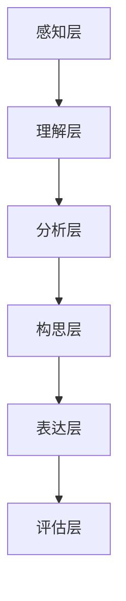

#### 附录 B：核心算法原理的伪代码示例

```python
# 神经网络伪代码
def neural_network(input_data):
    hidden_layer = activation_function(np.dot(input_data, weights))
    output_layer = activation_function(np.dot(hidden_layer, output_weights))
    return output_layer

# 卷积神经网络伪代码
def conv_neural_network(input_image):
    conv_layer = conv2d(input_image, filter)
    pooling_layer = max_pooling(conv_layer)
    return pooling_layer

# 生成对抗网络伪代码
def generator(noise):
    generated_image = generate_image(noise)
    return generated_image

def discriminator(image):
    prediction = generate_prediction(image)
    return prediction
```

#### 附录 C：数学模型与公式的详细讲解

- **概率论公式**：
  $$
  P(A \cap B) = P(A)P(B|A)
  $$
  **解释**：这是条件概率的乘法公式，表示事件A和事件B同时发生的概率等于事件A发生的概率乘以在A发生的条件下事件B发生的概率。

- **信息论公式**：
  $$
  H(X) = -\sum_{i} p(x_i) \log_2 p(x_i)
  $$
  **解释**：这是信息熵的定义，表示随机变量X的不确定性或信息含量，其中\( p(x_i) \)是随机变量X取值\( x_i \)的概率。

#### 附录 D：项目实战的代码解读与分析

```python
# 数据增强代码示例
import tensorflow as tf
from tensorflow.keras.preprocessing.image import ImageDataGenerator

# 创建ImageDataGenerator对象，设置增强参数
datagen = ImageDataGenerator(
    rotation_range=90,
    width_shift_range=0.1,
    height_shift_range=0.1,
    shear_range=0.1,
    zoom_range=0.1,
    horizontal_flip=True,
    fill_mode='nearest'
)

# 使用ImageDataGenerator进行数据增强
for batch in datagen.flow(train_images, train_labels, batch_size=32):
    # 进行模型训练
    model.fit(batch[0], batch[1], epochs=1)
    break
```

**代码解读**：
- `ImageDataGenerator`：用于生成增强数据的工具，可以随机旋转、平移、剪裁、缩放和翻转图像。
- `rotation_range`：随机旋转图像的最大角度。
- `width_shift_range`和`height_shift_range`：随机水平和平移图像的最大像素数。
- `shear_range`：随机剪裁图像的最大角度。
- `zoom_range`：随机缩放图像的最大比例。
- `horizontal_flip`：随机水平翻转图像。
- `fill_mode`：填充新创建像素的方式。

通过以上增强技术，可以提高模型训练的鲁棒性和泛化能力。

#### 最佳实践 tips、小结、注意事项、拓展阅读等内容

**最佳实践 tips**：
- 在AI艺术创作中，数据的质量和多样性是至关重要的。确保数据清洗和增强的充分性。
- 调整模型参数时，要关注收敛速度和生成质量之间的平衡。

**小结**：
- 思维链方法在AI艺术创作中提供了强大的工具，通过模拟人类思维过程，生成具有创意性和艺术性的作品。
- 神经网络、卷积神经网络和生成对抗网络等核心算法在AI艺术创作中发挥了关键作用。

**注意事项**：
- 艺术创作中的AI模型需要大量的训练数据和计算资源，确保硬件配置和数据处理能力能够满足要求。
- 在使用AI进行艺术创作时，应尊重知识产权和伦理问题，避免侵犯艺术家和版权方的权益。

**拓展阅读**：
- [生成对抗网络（GAN）综述](https://arxiv.org/abs/1406.2661)
- [变分自编码器（VAE）](https://arxiv.org/abs/1312.6114)
- [深度学习在艺术创作中的应用](https://www.nature.com/articles/s41586-018-0310-9)

通过以上最佳实践、小结、注意事项和拓展阅读，读者可以更好地理解和应用思维链方法在AI艺术创作中的实际操作。

