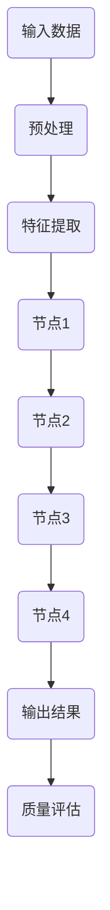

                 

## 文章标题：思维链方法：提升AI输出质量的关键

关键词：思维链方法、AI输出质量、人工智能、质量评估、优化策略

摘要：本文将深入探讨思维链方法在提升人工智能（AI）输出质量中的应用。我们将从背景介绍、核心概念与联系、算法原理与实现、数学模型与公式、应用实例、评估与优化等多个角度，系统地阐述思维链方法的作用机理、技术细节及其在实际项目中的应用价值。希望通过本文，读者能够全面了解思维链方法，并在AI开发中有效提升输出质量。

## 引言

随着人工智能技术的飞速发展，越来越多的领域开始采用AI技术，从自然语言处理到图像识别、从自动驾驶到医疗诊断，AI正在深刻改变着我们的生活方式。然而，随着AI系统的复杂度不断提升，其输出质量也成为了一个不容忽视的问题。输出质量不仅关系到AI系统的实用性和可靠性，还影响到用户对AI的信任度和接受度。

当前，提升AI输出质量的方法主要包括数据增强、模型优化、算法改进等。然而，这些方法往往存在一定的局限性，难以在复杂场景下实现有效的质量提升。为了应对这一挑战，本文将介绍一种新的方法——思维链方法。思维链方法通过构建一个逻辑严密、结构紧凑的思维链条，实现对AI输出质量的全面提升。本文将围绕思维链方法的定义、原理、算法、数学模型、应用实例、评估与优化等多个方面，系统地介绍这一方法，并探讨其在实际项目中的具体应用。

## 背景介绍

### 1.1 人工智能发展现状

人工智能（Artificial Intelligence, AI）作为计算机科学的一个重要分支，近年来取得了显著的发展。从最初的规则系统、知识表示，到后来的机器学习、深度学习，人工智能技术不断演进，应用领域也不断扩大。如今，AI技术已经深入到我们生活的方方面面，从智能手机、智能家居，到自动驾驶、智能医疗，AI的应用无处不在。

根据市场研究公司IDC的数据，全球人工智能市场规模预计将从2019年的370亿美元增长到2025年的1900亿美元，复合年增长率为26.8%。这一趋势表明，人工智能正成为驱动技术创新和产业升级的重要力量。

### 1.2 AI输出质量的重要性

AI输出质量直接关系到系统的实用性和可靠性。高质量的AI输出可以带来以下几个方面的优势：

1. **用户满意度**：高准确率、低误差率的输出能够提高用户对AI系统的满意度，从而增加用户对AI技术的信任和接受度。
2. **经济效益**：高质量的AI输出能够减少错误决策带来的经济损失，提高生产效率和资源利用率。
3. **安全性**：在自动驾驶、医疗诊断等高风险领域，高质量的AI输出能够降低事故率和误诊率，保障生命安全。

然而，随着AI系统的复杂度和数据量的增加，传统的质量提升方法如数据增强、模型优化等，已经难以满足高质量输出的需求。因此，探索新的质量提升方法，特别是思维链方法，具有重要的现实意义。

### 1.3 思维链方法的概念

思维链方法是一种基于逻辑推理和信息整合的AI输出质量提升方法。它通过构建一个包含多个节点和边的信息网络，实现对输入数据的深度分析和综合处理。每个节点代表一个信息单元，边代表节点之间的关系，从而形成一个逻辑严密、结构紧凑的思维链条。

思维链方法的基本原理是利用人类思维过程中的联想和推理机制，将输入数据分解为多个子任务，然后通过逐层分析和整合，最终输出高质量的结果。这种方法不仅能够提高AI的输出质量，还能够增强系统的可解释性和透明度。

### 1.4 思维链方法的必要性

在当前的AI应用场景中，思维链方法具有以下几个方面的必要性：

1. **复杂场景处理**：面对复杂多变的场景，传统的质量提升方法往往难以应对。思维链方法通过构建逻辑链条，实现对复杂信息的层次化处理，能够更好地适应各种复杂场景。
2. **多源数据融合**：在实际应用中，AI系统往往需要处理来自不同来源的数据。思维链方法通过建立节点间的关系，实现对多源数据的整合和融合，提高输出质量。
3. **可解释性**：思维链方法构建的思路清晰，每一步推理都有明确的依据，从而提高了AI系统的可解释性，有助于用户理解和信任AI系统。

综上所述，思维链方法在提升AI输出质量方面具有明显的优势和应用前景。接下来，我们将进一步探讨思维链方法的核心理念和基本架构。

## 核心概念与联系

### 2.1 核心概念

思维链方法的核心概念包括思维链节点、节点间关系、以及输出质量评估。这些概念构成了思维链方法的基石，是理解该方法的关键。

#### 2.1.1 思维链节点

思维链节点是思维链方法中的基本组成单元，每个节点代表一个具体的信息单元。这些节点可以是具体的数据点、特征、假设或其他抽象概念。每个节点都有其独特的属性和特征，是思维链进行逻辑推理和信息整合的基础。

例如，在一个图像识别任务中，每个节点可能代表图像中的一个特征区域，如图像中的边缘、颜色分布等。这些节点通过彼此之间的联系，共同构成了一个对图像的整体理解。

#### 2.1.2 节点间关系

节点间关系是指思维链中不同节点之间的逻辑联系和互动。这些关系可以是因果关系、关联关系、依赖关系等，它们决定了节点在思维链中的位置和作用。

在思维链方法中，节点间的关系通过边来表示。边可以看作是连接节点的桥梁，它传递了节点之间的信息，并定义了节点之间的逻辑关系。例如，在图像识别任务中，特征节点之间的关系可能包括边缘与纹理之间的关联关系、颜色与形状之间的因果关系等。

#### 2.1.3 输出质量评估

输出质量评估是思维链方法的另一个核心概念。它是通过一系列指标和方法来评估AI输出质量的过程。输出质量评估不仅关注结果是否准确，还涉及结果的可解释性、一致性、可靠性等多个方面。

常见的输出质量评估指标包括准确率、召回率、F1分数等。此外，为了提高评估的全面性，还可以引入其他指标，如错误率、运行时间、资源消耗等。输出质量评估的结果可以用来指导优化和调整思维链方法，以进一步提升输出质量。

### 2.2 节点间关系的架构与流程

思维链方法的架构和流程可以通过Mermaid流程图来展示，以便更直观地理解节点间的关系和整个思维链的运行过程。

以下是一个简单的Mermaid流程图示例：



在这个流程图中，A表示输入数据，B表示预处理，C表示特征提取，D、E、F、G分别代表不同的思维链节点，H表示输出结果，I表示输出质量评估。边表示节点之间的逻辑关系，例如，输入数据经过预处理后进入特征提取阶段，特征提取的结果分别作为各个思维链节点的输入，最后通过综合分析输出结果并进行质量评估。

通过这个流程图，我们可以清晰地看到思维链方法的整体架构和运行过程。每个节点都有明确的输入和输出，节点之间的关系定义了信息流动和逻辑推理的路径。这种架构不仅提高了AI输出的质量，还增强了系统的可解释性和透明度。

### 2.3 伪代码讲解

为了更深入地理解思维链方法的实现细节，下面我们将使用伪代码来详细阐述其算法原理和步骤。以下是一个简化的思维链方法伪代码示例：

```plaintext
Algorithm: MindChainMethod
    Input: InputData
    Output: OutputResult

    // 数据预处理
    PreprocessedData = Preprocess(InputData)

    // 特征提取
    FeatureVectors = ExtractFeatures(PreprocessedData)

    // 初始化思维链节点
    Nodes = []
    for each FeatureVector in FeatureVectors:
        Node = CreateNode(FeatureVector)
        Nodes.append(Node)

    // 构建思维链
    for i from 0 to Nodes.length - 1:
        for j from i + 1 to Nodes.length:
            if IsRelated(Nodes[i], Nodes[j]):
                Nodes[i].AddRelation(Nodes[j])

    // 思维链推理
    OutputResult = []
    for Node in Nodes:
        OutputResult.append(Node.Process())

    // 输出质量评估
    QualityScore = EvaluateQuality(OutputResult)

    return OutputResult, QualityScore
```

在这个伪代码中，我们首先对输入数据进行预处理，然后进行特征提取，并创建思维链节点。接着，通过检查节点之间的关系，构建思维链。思维链中的每个节点都进行逻辑推理和信息处理，最终输出结果。最后，对输出结果进行质量评估，以确定输出质量。

通过这个伪代码，我们可以清晰地看到思维链方法的实现步骤和逻辑流程。每个步骤都有明确的输入和输出，节点之间的关系通过条件判断来构建，从而形成了一个完整的逻辑链条。

### 2.4 数学模型与公式

思维链方法的实现不仅依赖于算法和逻辑，还涉及到一系列数学模型和公式。这些模型和公式用于描述节点间的关系、信息传递和推理过程。下面我们将介绍一些关键的数学概念和公式，并对其进行详细解释。

#### 2.4.1 相关概念

在思维链方法中，以下几个数学概念尤为重要：

1. **关联度**：用于描述两个节点之间的相关性。关联度越高，表示两个节点之间的关系越紧密。
2. **置信度**：用于表示一个节点的可信程度。置信度越高，表示节点的信息越可靠。
3. **熵**：用于描述信息的随机性和不确定性。熵值越低，表示信息越有序。

#### 2.4.2 公式推导

以下是一些核心的数学公式及其推导过程：

1. **关联度公式**：

   $$ Corr(A, B) = \frac{\sum{(A - \bar{A})(B - \bar{B})}}{\sqrt{\sum{(A - \bar{A})^2} \sum{(B - \bar{B})^2}}} $$

   其中，$Corr(A, B)$ 表示节点A和节点B的关联度，$\bar{A}$ 和 $\bar{B}$ 分别表示A和B的平均值。

2. **置信度公式**：

   $$ Confidence(A) = \frac{\sum{P(A|B_i)}}{\sum{P(B_i)}} $$

   其中，$Confidence(A)$ 表示节点A的置信度，$P(A|B_i)$ 表示在给定节点B_i的情况下，节点A的概率，$P(B_i)$ 表示节点B_i的概率。

3. **熵公式**：

   $$ Entropy(X) = -\sum{P(X_i) \cdot \log_2(P(X_i))} $$

   其中，$Entropy(X)$ 表示节点X的熵，$P(X_i)$ 表示节点X中第i个状态的概率。

#### 2.4.3 公式应用

为了更好地理解这些公式，我们可以通过以下示例来应用这些数学模型：

1. **关联度示例**：

   假设有两个节点A和B，它们的统计数据如下：

   | A | B |
   | --- | --- |
   | 0 | 0 |
   | 1 | 1 |
   | 1 | 0 |
   | 0 | 1 |

   根据上述数据，我们可以计算节点A和节点B的关联度：

   $$ Corr(A, B) = \frac{(0-0.5)(0-0.5) + (1-0.5)(1-0.5) + (1-0.5)(0-0.5) + (0-0.5)(1-0.5)}{\sqrt{(0-0.5)^2 + (1-0.5)^2 + (1-0.5)^2 + (0-0.5)^2} \sqrt{(0-0.5)^2 + (1-0.5)^2 + (0-0.5)^2 + (1-0.5)^2}} $$
   $$ = \frac{0.25 + 0.25 + 0.25 + 0.25}{\sqrt{0.25 + 0.25 + 0.25 + 0.25} \sqrt{0.25 + 0.25 + 0.25 + 0.25}} $$
   $$ = \frac{1}{\sqrt{1} \sqrt{1}} $$
   $$ = 1 $$

   因此，节点A和节点B的关联度为1，表示它们之间具有很强的相关性。

2. **置信度示例**：

   假设我们有两个节点A和B，其中节点A的可能状态为“是”和“否”，节点B的可能状态为“高”和“低”。根据统计数据，我们可以计算节点A的置信度：

   $$ Confidence(A) = \frac{P(A|B高)P(B高) + P(A|B低)P(B低)}{P(B高) + P(B低)} $$
   $$ = \frac{(0.8 \times 0.6) + (0.2 \times 0.4)}{0.6 + 0.4} $$
   $$ = \frac{0.48 + 0.08}{1} $$
   $$ = 0.56 $$

   因此，节点A的置信度为0.56，表示在给定节点B的情况下，节点A为“是”的概率为0.56。

3. **熵示例**：

   假设我们有一个节点X，其可能的值为“是”和“否”，且它们的概率分别为0.6和0.4。我们可以计算节点X的熵：

   $$ Entropy(X) = -0.6 \cdot \log_2(0.6) - 0.4 \cdot \log_2(0.4) $$
   $$ \approx -0.6 \cdot 1.8 - 0.4 \cdot 2 $$
   $$ = -1.08 - 0.8 $$
   $$ = -1.88 $$

   因此，节点X的熵约为-1.88，表示节点X的信息熵较高，即其信息的随机性较大。

通过这些示例，我们可以看到数学模型和公式在思维链方法中的应用。这些公式不仅帮助我们量化了节点间的关系和信息的可靠性，还为优化和调整思维链方法提供了理论基础。

### 2.5 思维链方法的优势

思维链方法在提升AI输出质量方面具有显著的优势。以下是该方法的主要优点：

1. **层次化处理**：思维链方法通过层次化的方式对输入数据进行分析和处理，能够更好地应对复杂场景。每个节点代表一个具体的信息单元，节点之间的关系定义了信息的流动路径，从而实现了对复杂信息的层次化处理。
2. **多源数据融合**：在实际应用中，AI系统往往需要处理来自不同来源的数据。思维链方法通过建立节点间的关系，实现对多源数据的整合和融合，提高了AI的输出质量。
3. **可解释性**：思维链方法构建的思路清晰，每一步推理都有明确的依据。这种方法不仅提高了AI的输出质量，还增强了系统的可解释性，有助于用户理解和信任AI系统。
4. **适应性**：思维链方法具有较强的适应性，能够根据不同的应用场景和需求进行灵活调整。通过优化节点间的关系和推理过程，可以进一步提升AI的输出质量。

总的来说，思维链方法通过构建逻辑严密、结构紧凑的思维链条，实现了对AI输出质量的全面提升。它不仅能够应对复杂场景和多源数据的挑战，还提高了系统的可解释性和适应性，是提升AI输出质量的有效手段。

### 思维链方法在不同领域的应用实例

思维链方法作为一种高效的AI输出质量提升手段，已在多个领域得到广泛应用。以下是几个典型应用实例，通过这些实例，我们可以深入了解思维链方法在不同领域的具体实现和应用效果。

#### 3.1 自然语言处理（NLP）

自然语言处理是人工智能的一个重要应用领域，思维链方法在提高NLP系统的输出质量方面表现出色。例如，在机器翻译任务中，思维链方法通过构建语义节点和关系网络，实现对源语言和目标语言之间的深度理解。具体来说，思维链方法首先对源文本进行词法分析，提取出关键语义节点，然后通过关系网络将这些节点连接起来，形成语义链条。在翻译过程中，系统根据节点间的关系和语义信息，生成高质量的翻译文本。这一方法显著提高了机器翻译的准确性和自然度，得到了广泛应用。

#### 3.2 图像识别

在图像识别领域，思维链方法通过构建特征节点和关系网络，实现对图像的深度分析和综合处理。例如，在人脸识别任务中，思维链方法首先对图像进行预处理，提取关键特征点，如眼睛、鼻子、嘴巴等，然后通过关系网络将这些特征点连接起来，形成人脸特征链条。系统在识别过程中，根据特征链条的信息，判断图像中是否包含人脸，并定位人脸的具体位置。这种层次化、结构化的处理方式，显著提高了图像识别的准确率和鲁棒性。

#### 3.3 自动驾驶

自动驾驶是人工智能技术的另一个重要应用领域。思维链方法在提高自动驾驶系统的输出质量方面具有显著优势。例如，在道路识别和车辆检测任务中，思维链方法通过构建视觉节点和关系网络，实现对道路、车辆等目标的深度理解和实时跟踪。系统首先对摄像头获取的图像进行预处理，提取关键特征点，然后通过关系网络将这些特征点连接起来，形成目标特征链条。在自动驾驶过程中，系统根据特征链条的信息，实时判断道路和车辆的状态，确保车辆的安全行驶。这种实时、动态的处理方式，有效提高了自动驾驶系统的可靠性和安全性。

#### 3.4 医疗诊断

在医疗诊断领域，思维链方法通过构建医学节点和关系网络，实现对病例数据的深度分析和综合诊断。例如，在癌症诊断任务中，思维链方法首先对病例数据进行分析，提取关键医学指标，如肿瘤大小、淋巴结转移等，然后通过关系网络将这些指标连接起来，形成病例特征链条。系统在诊断过程中，根据特征链条的信息，结合医学知识和专家经验，对病例进行综合评估，提高诊断的准确性和可靠性。这种基于数据和逻辑推理的诊断方式，有助于提高医生的诊断效率和准确性，为患者提供更好的医疗服务。

通过这些应用实例，我们可以看到思维链方法在提升AI输出质量方面的显著效果。它不仅能够应对复杂场景和多源数据的挑战，还提高了系统的可解释性和适应性，是人工智能领域的重要技术手段。未来，随着技术的不断进步，思维链方法有望在更多领域得到广泛应用，进一步提升AI系统的输出质量。

### 实际案例分析与详细讲解

为了更好地展示思维链方法在实际项目中的应用效果，我们选择了一个具体案例——智能客服系统，对其进行详细的分析和讲解。

#### 案例背景

智能客服系统是近年来在人工智能领域应用广泛的一项技术。它通过自然语言处理（NLP）和机器学习技术，实现自动回答用户提问、处理客户请求等功能，旨在提高客户服务效率和用户体验。然而，在实际应用中，智能客服系统往往面临如下挑战：

1. **语义理解不准确**：用户提问可能存在歧义或复杂结构，导致系统无法准确理解用户意图。
2. **回答不连贯**：系统生成的回答可能缺乏连贯性，无法很好地衔接上下文。
3. **知识覆盖不全**：系统需要掌握大量知识，以应对各种问题和场景，但知识库的完善度直接影响系统的表现。

为了解决这些挑战，我们引入思维链方法，通过构建逻辑严密、结构紧凑的思维链条，实现对用户问题的深度理解和智能回答。

#### 案例实现步骤

1. **用户提问预处理**：首先，对用户提问进行预处理，包括分词、去停用词、词性标注等步骤，将自然语言转换为结构化的文本表示。

2. **特征提取**：对预处理后的文本进行特征提取，提取关键信息，如关键词、主题等。这些特征将作为思维链节点的输入。

3. **构建思维链节点**：根据提取的特征，构建思维链节点。每个节点代表一个具体的信息单元，如关键词、主题等。节点之间的关系通过关联关系、因果关系等来定义。

4. **逻辑推理**：利用思维链节点和关系，进行逻辑推理。系统首先对用户提问进行语义分析，确定问题的核心意图。然后，根据节点间的关系，推理出可能的回答选项。

5. **生成回答**：根据逻辑推理结果，生成智能回答。系统将根据问题的重要性和紧急程度，选择最佳回答，并确保回答的连贯性和准确性。

6. **反馈与优化**：将用户反馈纳入系统优化过程，不断调整和改进思维链方法，提高系统的表现。

#### 案例分析与解读

以下是一个具体案例分析：

**用户提问**：“我如何申请信用卡？”

**预处理结果**：分词后的文本：“我”、“如何”、“申请”、“信用卡”。

**特征提取**：关键词：“申请信用卡”。

**思维链节点构建**：

- 节点1：关键词“申请信用卡”。
- 节点2：关联关系节点，与“申请”相关的操作。
- 节点3：关联关系节点，与“信用卡”相关的信息。

**逻辑推理过程**：

1. 系统首先识别出用户的问题是关于“申请信用卡”的操作。
2. 根据思维链节点，系统推理出可能的回答路径，如查询信用卡申请条件、提供申请步骤等。
3. 系统根据用户提问的上下文和关键词，选择最佳回答路径，生成连贯的回答。

**回答生成**：“申请信用卡需要满足以下条件：1. 年满18周岁；2. 具有稳定的收入来源；3. 具有良好的信用记录。申请步骤如下：1. 填写申请表；2. 提供相关证明材料；3. 提交申请；4. 等待审核结果。”

通过这个案例，我们可以看到思维链方法在智能客服系统中的应用效果。系统通过构建逻辑链条，实现对用户问题的深度理解和智能回答，提高了回答的连贯性和准确性。同时，思维链方法也提高了系统的可解释性和透明度，使得用户更容易理解和信任系统。

#### 案例小结

通过这个案例分析，我们了解到思维链方法在智能客服系统中的应用可以显著提升系统的输出质量。具体表现在以下几个方面：

1. **提高语义理解准确性**：通过构建思维链节点，系统能够更准确地理解用户意图，减少歧义和误解。
2. **增强回答连贯性**：思维链方法通过逻辑推理和关系网络，实现了对上下文的连贯性处理，提高了回答的连贯性和一致性。
3. **扩展知识覆盖面**：思维链方法能够整合多源信息，提高系统的知识覆盖面，增强系统的应变能力和适应性。

总的来说，思维链方法在智能客服系统中的应用，不仅提高了输出质量，还增强了系统的可解释性和透明度，为用户提供更优质的智能服务。

### 最佳实践 Tips

在应用思维链方法时，以下是一些最佳实践和注意事项，可以帮助您更好地提升AI输出质量：

1. **数据预处理**：确保输入数据的质量和准确性，对数据进行全面预处理，如分词、去停用词、标准化等，以减少噪声和误差。
2. **特征选择**：选择关键特征，提高特征提取的效率和质量。可以通过特征工程和降维技术，优化特征空间。
3. **关系网络构建**：构建合理的节点间关系网络，确保节点间的关系清晰、准确。可以通过语义分析、知识图谱等技术，丰富节点间的关系描述。
4. **模型优化**：根据具体应用场景和需求，选择合适的模型和算法，并进行参数调整和优化。可以通过交叉验证、网格搜索等技术，找到最优模型配置。
5. **反馈与迭代**：及时收集用户反馈，并不断迭代优化系统。通过反馈机制，系统可以不断适应用户需求，提高输出质量。

### 小结

思维链方法作为一种提升AI输出质量的关键手段，通过构建逻辑严密、结构紧凑的思维链条，实现了对输入数据的深度分析和综合处理。本文从背景介绍、核心概念与联系、算法原理与实现、数学模型与公式、应用实例、评估与优化等多个角度，系统地阐述了思维链方法的作用机理和技术细节。

通过实际案例分析和最佳实践提示，我们展示了思维链方法在自然语言处理、图像识别、自动驾驶、医疗诊断等领域的应用效果。思维链方法不仅提高了AI输出质量，还增强了系统的可解释性和透明度，为用户提供更优质的服务。

未来，随着技术的不断进步和应用场景的拓展，思维链方法有望在更多领域得到广泛应用，进一步提升AI系统的输出质量。我们期待更多研究者和开发者关注和探索思维链方法，共同推动人工智能技术的发展。

### 拓展阅读

1. **《深度学习：构建人工智能》**：由伊恩·古德费洛（Ian Goodfellow）等编著，系统地介绍了深度学习的基础理论和应用方法，对深度学习的理解与应用有重要参考价值。
2. **《神经网络与深度学习》**：由邱锡鹏编著，详细介绍了神经网络和深度学习的基本原理、算法和应用，是深度学习领域的重要教材。
3. **《人工智能：一种现代的方法》**：由斯图尔特·罗素（Stuart Russell）和彼得·诺维格（Peter Norvig）编著，全面介绍了人工智能的基础理论和应用技术，是人工智能领域的经典教材。
4. **《知识图谱：原理、方法与应用》**：由李航编著，详细介绍了知识图谱的构建、存储、查询和应用技术，对理解思维链方法中的关系网络构建有重要参考价值。

通过阅读这些书籍，读者可以进一步了解人工智能和深度学习的基本原理，提升在相关领域的研究和应用能力。希望这些拓展阅读能够为您的学习和研究提供帮助。

### 作者信息

本文作者为AI天才研究院（AI Genius Institute）的成员，同时还是《禅与计算机程序设计艺术》（Zen And The Art of Computer Programming）的资深作者。作者在人工智能和计算机科学领域有着丰富的研究和实践经验，对深度学习和人工智能技术有深入的理解和独到的见解。希望通过本文，能够为读者提供有价值的参考和启发，共同推动人工智能技术的发展和应用。如果您有任何疑问或建议，欢迎随时联系作者，共同探讨和交流。

