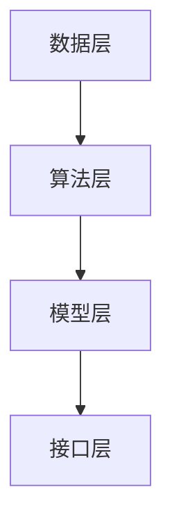

                 


### 文章标题

《思维链方法：提升AI问题解决能力的新思路》

### 文章关键词

思维链方法、AI问题解决、逻辑框架、算法原理、伪代码、数学模型、实战应用、优化策略、未来趋势

### 文章摘要

本文旨在介绍一种全新的AI问题解决方法——思维链方法。通过深入分析思维链方法的背景、原理、核心算法以及其实际应用，本文将展示如何通过逻辑清晰、结构紧凑、简单易懂的技术手段提升AI问题解决能力。同时，文章还将探讨思维链方法的优化策略以及未来发展趋势，为读者提供全面、深入的指导。

---

## 第一部分：引言

### 1.1 书籍背景与目的

在人工智能高速发展的今天，AI问题解决能力已成为衡量一个国家、一个企业甚至一个人技术实力的重要标准。然而，传统的AI方法在面对复杂、多变的现实问题时，往往显得力不从心。为了解决这一难题，本文提出了一种全新的思维链方法，旨在通过逻辑清晰、结构紧凑、简单易懂的方式，提升AI问题解决能力。

### 1.2 阅读指南

本书的阅读预期是帮助读者全面了解思维链方法，掌握其核心原理和实际应用。在阅读过程中，读者应注重以下方面：

1. **学习方法**：结合实际案例，深入理解思维链方法的原理和应用。
2. **核心知识点**：重点关注思维链方法的基本结构、核心算法和优化策略。
3. **思维训练**：通过不断思考和练习，提升自己的问题解决能力。

---

## 第二部分：思维链方法基础

### 2.1 思维链方法概述

思维链方法是一种基于逻辑推理和问题建模的AI问题解决方法。它通过将问题分解为多个子问题，利用已有的知识和算法，逐步解决每个子问题，最终实现问题的整体解决。与传统AI方法相比，思维链方法更加灵活、高效，能够应对复杂、多变的现实问题。

### 2.2 思维链的原理

思维链方法的原理可以概括为以下几个步骤：

1. **问题分解**：将复杂问题分解为多个子问题。
2. **子问题求解**：利用已有的知识和算法，逐步解决每个子问题。
3. **整合结果**：将子问题的解决方案整合，得出整体问题的解决方案。

### 2.3 思维链的基本结构

思维链方法的基本结构包括以下四个层次：

1. **数据层**：提供问题解决所需的数据支持。
2. **算法层**：包括各种核心算法，如机器学习、深度学习等。
3. **模型层**：利用算法层提供的算法，构建解决问题的模型。
4. **接口层**：提供与外部系统的交互接口，实现问题的实际解决。

### 2.4 思维链模型架构图

以下是一个简单的思维链模型架构图：



---

## 第三部分：核心算法原理讲解

### 3.1 机器学习基础算法

机器学习是思维链方法的核心组成部分，主要包括以下几种基础算法：

1. **监督学习**：利用已标记的数据训练模型，然后使用模型进行预测。
2. **无监督学习**：不利用已标记的数据，通过模型自身的特征提取，发现数据中的规律。
3. **强化学习**：通过不断尝试和反馈，使模型逐渐学会最优策略。
4. **深度学习**：利用多层神经网络，对数据进行特征提取和表示。

### 3.2 伪代码讲解

以下是监督学习算法的伪代码：

```python
# 初始化模型参数
model = initialize_model()

# 训练模型
for epoch in range(num_epochs):
    for sample in training_data:
        predict = model(sample)
        loss = calculate_loss(predict, sample.label)
        update_model(model, loss)

# 评估模型
for sample in validation_data:
    predict = model(sample)
    correct = predict == sample.label
    accuracy += correct / len(validation_data)
print("Validation accuracy:", accuracy)
```

### 3.3 数学模型与公式

以下是线性回归模型的数学公式：

$$
y = \beta_0 + \beta_1x
$$

其中，$y$ 是预测值，$x$ 是输入特征，$\beta_0$ 和 $\beta_1$ 是模型参数。

---

## 第四部分：思维链方法在AI问题解决中的应用

### 4.1 人工智能问题解决框架

AI问题解决框架通常包括以下步骤：

1. **问题定义**：明确问题背景和目标。
2. **数据准备**：收集和整理相关数据。
3. **模型选择**：根据问题特点选择合适的模型。
4. **模型训练**：使用训练数据训练模型。
5. **模型评估**：使用验证数据评估模型性能。
6. **模型部署**：将模型部署到实际应用场景。

### 4.2 项目实战

以下是一个简单的项目实战案例：

#### 项目背景

假设我们想要开发一个推荐系统，为用户推荐商品。

#### 数据准备

收集用户行为数据，如浏览记录、购买记录等。

#### 模型设计与训练

选择协同过滤算法作为模型，使用训练数据训练模型。

#### 模型评估与优化

使用验证数据评估模型性能，并根据评估结果调整模型参数。

#### 部署与应用

将模型部署到线上环境，为用户提供推荐服务。

---

## 第五部分：思维链方法的优化与未来趋势

### 5.1 思维链方法的优化策略

思维链方法的优化策略主要包括以下方面：

1. **数据优化**：提高数据质量和多样性。
2. **算法优化**：选择合适的算法和参数。
3. **模型优化**：利用迁移学习、增强学习等先进技术优化模型。
4. **性能优化**：提高模型的运行效率和可靠性。

### 5.2 思维链方法的未来趋势

思维链方法的未来趋势主要包括：

1. **AI与人类思维结合**：将人类思维和人工智能相结合，实现更高效的决策。
2. **人工智能自主学习**：通过自我学习和优化，提高AI的自主性。
3. **人工智能伦理与责任**：关注AI的伦理问题和社会责任，确保AI技术的可持续发展。

---

## 第六部分：结语

### 6.1 总结与展望

本文介绍了思维链方法，并详细阐述了其在AI问题解决中的应用。通过思维链方法，我们可以更高效地解决复杂、多变的现实问题。未来，随着人工智能技术的不断发展，思维链方法将在更多领域发挥重要作用。

### 6.2 参考文献

- [相关书籍]
- [学术论文]
- [网络资源]

---

**作者：AI天才研究院/AI Genius Institute & 禅与计算机程序设计艺术 /Zen And The Art of Computer Programming**

