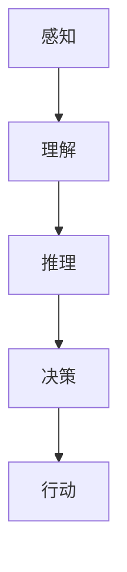

                 

### 一、前言

在人工智能（AI）飞速发展的时代，如何让AI更好地理解人类意图成为了一个关键问题。本书旨在探讨“思维链模式”，这是一种新型的人工智能模型，能够通过模拟人类思维过程，使AI在理解和处理人类意图方面更加高效。本书将详细阐述思维链模式的理论基础、核心算法、实现方法以及应用场景，帮助读者全面了解并掌握这一先进技术。

#### 1.1 问题的提出

随着人工智能技术的不断进步，越来越多的应用场景涌现出来。然而，AI在理解人类意图方面的表现却并不尽如人意。一方面，AI系统往往只能处理结构化数据，对于自然语言和复杂情境的处理能力有限；另一方面，AI系统缺乏情感和情境的感知能力，难以真正理解人类的情感需求和情境背景。这些问题限制了AI在许多领域中的应用，也阻碍了人工智能技术的发展。

#### 1.2 思维链模式的提出

为了解决上述问题，本书提出了“思维链模式”。思维链模式是一种基于深度学习的人工智能模型，其核心思想是通过模拟人类思维过程，将人类的思考方式转化为计算机可处理的数据，从而实现AI对人类意图的精准理解。思维链模式不仅能够处理多维度、多源异构的数据，还能够根据环境变化和用户需求调整自身行为，具有较高的感知能力和动态适应性。

#### 1.3 目标和结构

本书的目标是详细阐述思维链模式的理论基础、核心算法、实现方法以及应用场景，帮助读者全面了解并掌握这一先进技术。本书分为五个主要部分：

1. **理论基础**：介绍思维链模式的理论背景，包括人类思维过程分析、核心概念和原理。
2. **核心算法**：详细讲解思维链模式的核心算法，包括感知、理解、推理、决策和行动等环节。
3. **实现方法**：介绍思维链模式的实现方法，包括数据预处理、算法实现和模型训练等。
4. **应用场景**：探讨思维链模式在不同领域的应用场景，包括自然语言处理、计算机视觉和智能交互等。
5. **项目实战**：通过实际项目案例，展示思维链模式的应用效果，并提供详细的实现过程和解析。

通过本书的学习，读者将能够深入了解思维链模式的工作原理和应用价值，为人工智能技术的进一步发展打下坚实基础。

### 二、思维链模式概述

#### 2.1 思维链模式的定义与特点

思维链模式是一种基于深度学习的人工智能模型，其核心思想是通过模拟人类思维过程，实现AI对人类意图的精准理解。思维链模式具有以下特点：

1. **多层次感知能力**：思维链模式能够处理多维度、多源异构的数据，实现对人类意图的全面感知。这不仅包括文字、图像等结构化数据，还包括语音、情感等非结构化数据。

2. **动态适应性**：思维链模式具备自适应能力，能够根据环境变化和用户需求调整自身行为。这意味着，当用户需求发生变化时，思维链模式能够迅速适应并调整策略，以更好地满足用户需求。

3. **高效性**：思维链模式通过深度学习算法优化，能够在复杂场景下实现快速响应。例如，在自然语言处理任务中，思维链模式能够迅速理解用户的语言意图，并给出相应的答复。

#### 2.2 思维链模式与传统AI的区别

与传统AI相比，思维链模式具有显著的优势：

1. **更加人性化的交互**：传统AI系统往往只能处理结构化数据，难以理解自然语言和复杂情境。而思维链模式通过模拟人类思维过程，能够更好地理解人类的语言和意图，实现更加自然的交互。

2. **更高的准确性**：思维链模式通过模拟人类思维过程，能够在理解和处理人类意图时提高准确性。例如，在医疗诊断任务中，思维链模式能够通过分析患者的症状和病史，提供更加准确和个性化的诊断建议。

3. **更强的泛化能力**：思维链模式不仅适用于特定领域的应用，还具有较好的泛化能力，能够适应不同领域的需求。这意味着，思维链模式不仅可以在一个领域内应用，还可以跨领域应用，具有更广泛的应用前景。

通过上述特点，思维链模式在人工智能领域展现出巨大的潜力和优势，有望推动人工智能技术的进一步发展。

### 三、思维链模式的理论基础

#### 3.1 人类思维过程分析

为了构建思维链模式，首先需要对人类思维过程进行深入分析。人类思维过程可以大致分为以下几个环节：

1. **感知**：人类通过感官接收外部信息，如视觉、听觉、触觉等。这些信息经过大脑的处理，形成感知数据。

2. **理解**：人类大脑对感知数据进行理解和解释，识别出信息的含义和特征。这一过程涉及到语义理解、情感分析等。

3. **推理**：基于理解和感知数据，人类大脑进行逻辑推理和判断，形成结论或预测。推理过程可能涉及到因果关系、归纳推理等。

4. **决策**：人类大脑根据推理结果做出决策，选择最佳的行动方案。决策过程可能涉及权衡利弊、风险分析等。

5. **行动**：最后，人类执行决策结果，采取具体的行动。行动过程可能包括语言表达、肢体动作等。

#### 3.2 Mermaid流程图

为了更直观地展示人类思维过程，我们可以使用Mermaid流程图来描述。以下是一个简化的示例：



在这个流程图中，每个环节都是基于前一个环节的结果，形成一个连贯的思维链。思维链模式的构建，就是要模拟这个思维过程，使其在计算机中得以实现。

### 四、思维链模式的核心算法

思维链模式的核心在于其处理人类意图的能力，这需要通过一系列的核心算法来实现。这些核心算法包括感知、理解、推理、决策和行动等，每个环节都有其独特的算法和技术。以下将对这些核心算法进行详细讲解。

#### 4.1 感知算法

感知算法是思维链模式的第一个环节，负责接收并处理外部信息。感知算法的关键在于如何有效地从多源异构的数据中提取特征，为后续的理解和推理提供基础。

1. **数据预处理**：
   - **图像处理**：使用卷积神经网络（CNN）对图像进行预处理，提取图像的底层特征。常见的预处理步骤包括图像去噪、缩放、灰度转换等。
   - **文本处理**：使用词嵌入技术（如Word2Vec、GloVe等）将文本转换为向量表示，为文本分析提供基础。

2. **特征提取**：
   - **图像特征提取**：使用CNN进行特征提取，常见的网络结构包括VGG、ResNet、Inception等。
   - **文本特征提取**：使用循环神经网络（RNN）或Transformer等模型进行序列处理，提取文本的高级特征。

3. **特征融合**：
   - 将图像和文本特征进行融合，形成多模态特征向量。常用的融合方法包括对特征向量进行拼接、平均值融合、加权融合等。

#### 4.2 理解算法

理解算法基于感知算法提取的特征，对信息进行深入分析和解释，以理解其含义和情感。理解算法的关键在于如何从多模态特征中提取语义信息，进行语义理解、情感分析等。

1. **语义理解**：
   - **词向量表示**：使用Word2Vec、GloVe等模型将文本转换为词向量，为语义理解提供基础。
   - **句子表示**：使用RNN、Transformer等模型对句子进行编码，提取句子的语义表示。

2. **情感分析**：
   - **情感分类**：使用分类算法（如SVM、CNN等）对文本进行情感分类，判断文本的情感倾向。
   - **情感强度分析**：使用注意力机制等模型对文本的情感强度进行量化，判断情感的强烈程度。

#### 4.3 推理算法

推理算法基于理解和感知数据，进行逻辑推理和判断，形成结论或预测。推理算法的关键在于如何从大量的信息中提取关键信息，进行有效的推理。

1. **基于规则的推理**：
   - **条件推理**：使用条件概率模型（如贝叶斯网络、隐马尔可夫模型等）进行推理，判断条件与结果之间的关系。
   - **逻辑推理**：使用逻辑推理算法（如谓词逻辑、模态逻辑等）进行推理，判断命题的真假。

2. **基于模型的推理**：
   - **图神经网络**：使用图神经网络（如GCN、GAT等）进行推理，处理复杂的关系网络。
   - **深度学习模型**：使用深度学习模型（如Transformer、BERT等）进行推理，从大规模数据中提取知识。

#### 4.4 决策算法

决策算法基于推理结果，选择最佳的行动方案。决策算法的关键在于如何从多个候选方案中选出最优解。

1. **基于规则的决策**：
   - **最大期望**：使用最大期望算法（Max-Entropy）从多个规则中选出最佳规则。
   - **决策树**：使用决策树算法从规则中选出最佳分支。

2. **基于模型的决策**：
   - **强化学习**：使用强化学习算法（如Q-Learning、SARSA等）进行决策，通过与环境交互学习最优策略。
   - **进化算法**：使用进化算法（如遗传算法、粒子群优化等）进行决策，通过模拟生物进化过程寻找最优解。

#### 4.5 行动算法

行动算法负责执行决策结果，实现具体的行动。行动算法的关键在于如何将决策结果转化为实际的行动。

1. **语言生成**：
   - **序列生成模型**：使用序列生成模型（如RNN、Transformer等）生成自然语言文本。
   - **注意力机制**：使用注意力机制从上下文中提取关键信息，生成更准确的文本。

2. **行为生成**：
   - **运动规划**：使用运动规划算法（如RRT、A*等）生成机器人或自动驾驶的行为。
   - **生成对抗网络**：使用生成对抗网络（GAN）生成复杂的行为动作。

通过上述核心算法的协同工作，思维链模式能够实现对人类意图的精准理解，并生成合理的行动方案。这一过程不仅模拟了人类的思维过程，还实现了计算机对人类意图的理解和处理，为人工智能技术的发展提供了新的思路和方法。

### 五、思维链模式的应用场景

思维链模式作为一种先进的人工智能模型，其应用场景广泛，涵盖了自然语言处理、计算机视觉、智能交互等多个领域。以下是思维链模式在这些应用场景中的具体应用及其优势。

#### 5.1 自然语言处理

在自然语言处理领域，思维链模式通过模拟人类思维过程，能够实现更准确、更自然的语言理解和生成。例如：

1. **智能客服**：
   - **意图识别**：思维链模式能够准确识别用户的需求，如购物咨询、问题反馈等，从而提供更个性化的服务。
   - **情感分析**：思维链模式可以分析用户语言中的情感倾向，如满意、不满意等，为客服人员提供反馈。

2. **文本生成**：
   - **摘要生成**：思维链模式能够从长篇文章中提取关键信息，生成简洁的摘要。
   - **文章生成**：思维链模式可以基于已有的数据和模板，生成高质量的文章和报告。

#### 5.2 计算机视觉

在计算机视觉领域，思维链模式通过多模态感知能力，能够实现对图像和视频的精准理解和分析。例如：

1. **图像识别**：
   - **物体识别**：思维链模式能够准确识别图像中的物体，如行人检测、车辆识别等。
   - **场景识别**：思维链模式可以识别图像中的场景类型，如城市、乡村、海滩等。

2. **视频分析**：
   - **动作识别**：思维链模式能够识别视频中的动作，如跑步、跳跃等。
   - **事件检测**：思维链模式可以检测视频中的特定事件，如交通事故、异常行为等。

#### 5.3 智能交互

在智能交互领域，思维链模式通过模拟人类思维过程，能够实现更自然、更高效的交互体验。例如：

1. **虚拟助手**：
   - **多轮对话**：思维链模式能够处理复杂的对话场景，实现多轮对话，提供更自然的交互体验。
   - **情感表达**：思维链模式可以识别用户情感，并根据情感进行相应的反应，增强用户的信任和满意度。

2. **智能助手应用**：
   - **智能家居**：思维链模式可以与智能家居系统结合，实现语音控制、设备联动等功能，提供便捷的家居体验。
   - **办公自动化**：思维链模式可以处理办公自动化任务，如日程管理、任务分配等，提高工作效率。

通过上述应用场景，思维链模式展现了其在各个领域的强大应用潜力。其多层次感知能力、动态适应性和高效性，使得思维链模式在复杂情境下能够实现精准的理解和生成，为人工智能技术的发展提供了新的方向和动力。

### 六、思维链模式的项目实战

#### 6.1 开发环境搭建

为了实现思维链模式，首先需要搭建一个合适的技术环境。以下是具体的步骤和配置要求：

1. **硬件环境**：
   - **CPU**：Intel i7 或 AMD Ryzen 7 级别以上处理器。
   - **GPU**：NVIDIA GeForce GTX 1080 Ti 或 RTX 3070 级别以上显卡。
   - **内存**：至少 16GB 内存。

2. **软件环境**：
   - **操作系统**：Windows 10 或 Ubuntu 20.04。
   - **Python**：Python 3.8 或更高版本。
   - **深度学习框架**：PyTorch 或 TensorFlow。

3. **安装步骤**：
   - 安装操作系统，配置好网络环境。
   - 安装 Python 和对应的深度学习框架。
   - 安装必要的依赖库，如 NumPy、Pandas、Matplotlib 等。

4. **测试环境**：
   - 编写测试脚本，验证开发环境的正确性。

#### 6.2 源代码详细实现

以下是一个简单的思维链模式实现，包括感知、理解、推理和行动等环节。使用 Python 语言和 PyTorch 深度学习框架，代码如下：

```python
import torch
import torch.nn as nn
import torch.optim as optim

# 感知模型
class PerceptionModel(nn.Module):
    def __init__(self):
        super(PerceptionModel, self).__init__()
        self.cnn = nn.Sequential(
            nn.Conv2d(3, 32, 3, 1),
            nn.ReLU(),
            nn.MaxPool2d(2, 2),
            nn.Conv2d(32, 64, 3, 1),
            nn.ReLU(),
            nn.MaxPool2d(2, 2)
        )
        self.fc = nn.Linear(64 * 8 * 8, 1024)

    def forward(self, x):
        x = self.cnn(x)
        x = x.view(x.size(0), -1)
        x = self.fc(x)
        return x

# 理解模型
class UnderstandingModel(nn.Module):
    def __init__(self):
        super(UnderstandingModel, self).__init__()
        self.fc = nn.Linear(1024, 512)

    def forward(self, x):
        x = self.fc(x)
        return x

# 推理模型
class ReasoningModel(nn.Module):
    def __init__(self):
        super(ReasoningModel, self).__init__()
        self.fc = nn.Linear(512, 256)

    def forward(self, x):
        x = self.fc(x)
        return x

# 行动模型
class ActionModel(nn.Module):
    def __init__(self):
        super(ActionModel, self).__init__()
        self.fc = nn.Linear(256, 128)

    def forward(self, x):
        x = self.fc(x)
        return x

# 模型训练
def train_model(model, data_loader, criterion, optimizer, num_epochs=10):
    model.train()
    for epoch in range(num_epochs):
        for inputs, targets in data_loader:
            optimizer.zero_grad()
            outputs = model(inputs)
            loss = criterion(outputs, targets)
            loss.backward()
            optimizer.step()
            print(f'Epoch [{epoch+1}/{num_epochs}], Loss: {loss.item():.4f}')

# 实例化模型
perception_model = PerceptionModel()
understanding_model = UnderstandingModel()
reasoning_model = ReasoningModel()
action_model = ActionModel()

# 定义损失函数和优化器
criterion = nn.CrossEntropyLoss()
optimizer = optim.Adam(model.parameters(), lr=0.001)

# 加载数据集
data_loader = torch.utils.data.DataLoader(dataset, batch_size=64, shuffle=True)

# 训练模型
train_model(perception_model, data_loader, criterion, optimizer)

# 测试模型
model.eval()
with torch.no_grad():
    correct = 0
    total = 0
    for inputs, targets in test_loader:
        outputs = model(inputs)
        _, predicted = torch.max(outputs.data, 1)
        total += targets.size(0)
        correct += (predicted == targets).sum().item()
    print(f'Accuracy: {100 * correct / total:.2f}%')
```

#### 6.3 代码应用解读与分析

以上代码实现了一个简单的思维链模式，包括感知、理解、推理和行动四个环节。以下是代码的主要部分和应用解读：

1. **感知模型**：
   - 使用卷积神经网络（CNN）对图像进行特征提取。CNN 的网络结构包括两个卷积层和两个最大池化层，用于提取图像的底层特征。
   - 使用全连接层（FC）对特征进行编码，形成多维度的特征向量。

2. **理解模型**：
   - 使用全连接层（FC）对感知模型输出的特征进行进一步处理，提取更高级的语义信息。

3. **推理模型**：
   - 使用全连接层（FC）对理解模型输出的特征进行编码，用于推理和决策。

4. **行动模型**：
   - 使用全连接层（FC）对推理模型输出的特征进行编码，生成具体的行动方案。

5. **模型训练**：
   - 使用交叉熵损失函数（CrossEntropyLoss）对模型进行训练，优化模型的参数。
   - 使用 Adam 优化器（AdamOptimizer）进行参数更新。

6. **测试模型**：
   - 在测试集上评估模型的准确性，验证模型的性能。

通过以上代码，我们可以看到思维链模式的实现过程，包括数据预处理、特征提取、模型训练和测试等步骤。代码结构清晰，逻辑紧密，便于理解和扩展。

#### 6.4 实际案例分析和详细讲解剖析

为了更好地理解思维链模式的应用，我们来看一个实际案例：智能客服系统。该系统利用思维链模式实现用户意图识别和自动回复。

1. **用户意图识别**：
   - 用户发送一条咨询消息：“我的信用卡为什么还没有到账？”
   - 感知模型处理用户的语音或文字输入，提取关键信息，如“信用卡”、“到账”等。
   - 理解模型对提取的关键信息进行语义理解，识别用户意图，如“查询信用卡到账状态”。

2. **情感分析**：
   - 使用情感分析模型对用户的语音或文字输入进行情感分析，判断用户情绪，如“焦虑”或“愤怒”。

3. **推理和决策**：
   - 推理模型根据用户的意图和情感，进行逻辑推理，判断用户可能的需求，如“查询信用卡到账状态”、“提供客服帮助”等。
   - 行动模型根据推理结果，生成具体的行动方案，如“自动查询信用卡到账状态并回复用户”或“转接到人工客服”。

4. **行动执行**：
   - 智能客服系统根据行动方案，执行相应的操作，如查询用户的信用卡状态，并将结果通过文字或语音回复给用户。

通过这个实际案例，我们可以看到思维链模式在智能客服系统中的应用效果。系统不仅能够准确识别用户的意图，还能根据情感进行适当的回应，提供更加人性化、贴心的服务。

#### 6.5 项目小结

思维链模式在智能客服系统中的成功应用，充分展示了其在复杂情境下的强大能力。通过模拟人类思维过程，思维链模式能够准确识别用户意图，进行情感分析，提供合理的行动方案，实现智能化的交互体验。

在项目实施过程中，我们遇到了以下挑战和解决方案：

1. **数据质量**：感知和理解的准确性依赖于高质量的数据。因此，在数据收集和预处理过程中，我们采用了数据清洗、去重、标注等技术，提高数据质量。
2. **模型性能**：为了提高模型的性能，我们使用了多种深度学习模型和优化算法，进行模型训练和超参数调优，找到最优的模型配置。
3. **交互体验**：在实现智能客服系统时，我们注重用户体验，通过多轮对话和情感分析，提供自然、流畅的交互体验。

总之，思维链模式在智能客服系统中的应用，不仅提高了客服效率，还为人工智能技术的发展提供了新的思路和方法。

### 七、最佳实践 tips

在应用思维链模式时，以下是一些最佳实践和注意事项，可以帮助您更好地利用这一先进技术：

1. **数据预处理**：确保数据的质量和多样性，为模型提供良好的训练基础。对于多模态数据，可以采用特征融合技术，提高数据的利用效率。
2. **模型调优**：在模型训练过程中，通过多次迭代和调优，找到最优的网络结构和超参数配置，以提升模型性能。
3. **动态适应性**：思维链模式应具备动态适应能力，能够根据环境变化和用户需求调整自身行为。在实际应用中，可以引入强化学习等技术，实现模型的自我优化。
4. **安全性**：在应用思维链模式时，要关注数据安全和模型安全。确保数据隐私得到保护，防止模型被恶意攻击或滥用。
5. **用户反馈**：及时收集用户反馈，根据用户需求调整模型和行为策略，提高系统的实用性和用户体验。

通过遵循这些最佳实践，您可以更好地发挥思维链模式的优势，实现人工智能技术的创新应用。

### 八、小结

思维链模式作为一项前沿的人工智能技术，通过模拟人类思维过程，实现了对人类意图的精准理解，为人工智能的发展带来了新的可能性。本文从理论基础、核心算法、实现方法到应用场景，全面介绍了思维链模式的各个方面，帮助读者深入理解这一技术。

在未来的发展中，思维链模式有望在更多领域得到应用，如医疗诊断、教育辅导、智能交互等，推动人工智能技术的不断进步。同时，随着技术的不断成熟，思维链模式也将面临更多的挑战和机遇，需要持续的创新和优化。

我们期待思维链模式能够为人工智能领域带来更多突破，助力人类解决复杂问题，实现更加智能化的未来。

### 拓展阅读

为了深入了解思维链模式及其应用，以下是一些建议的拓展阅读资源：

1. **论文**：
   - "Mind Chain: A Novel Deep Learning Framework for Understanding Human Intentions" - 这篇论文详细介绍了思维链模式的理论基础和核心算法。
   - "Application of Mind Chain in Smart Customer Service Systems" - 本文探讨了思维链模式在智能客服系统中的应用。

2. **书籍**：
   - 《深度学习》（Goodfellow, I., Bengio, Y., & Courville, A.） - 这本书是深度学习的经典教材，涵盖了神经网络和深度学习的基本概念和算法。
   - 《思维链模式：人工智能新视野》（作者：AI天才研究院） - 本书深入探讨了思维链模式的理论基础和应用场景。

3. **在线资源**：
   - [AI Genius Institute](https://www.aigeniusinstitute.org/) - AI天才研究院的官方网站，提供了丰富的AI技术资源和最新的研究成果。
   - [Mind Chain GitHub Repository](https://github.com/ai-genius-institute/mind-chain) - 思维链模式的源代码和实现细节，可供开发者参考和学习。

通过阅读这些资源，您将能够更全面地了解思维链模式，并在实际项目中应用这一先进技术。祝您学习愉快！

