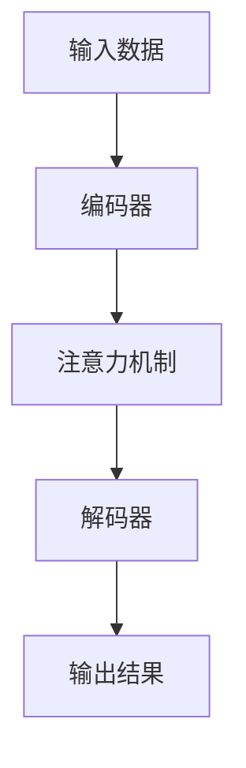

                 

### 《思维链：提升ChatGPT输出质量的关键》

#### 关键词：
- 思维链
- ChatGPT
- 输出质量
- 优化方法
- 应用案例分析

#### 摘要：
本文深入探讨了思维链在提升ChatGPT输出质量方面的关键作用。首先，我们定义了思维链的概念及其与ChatGPT的关系，接着详细分析了思维链的理论基础，包括其核心概念、工作流程和算法原理。随后，本文提出了一系列提升ChatGPT输出质量的方法，并通过具体案例展示了思维链在实际应用中的效果。最后，我们总结了思维链在提升ChatGPT输出质量方面的效果，并对其未来研究方向进行了展望。

#### 用户输入：
**设计思路**
1. **理解核心概念**：明确思维链和ChatGPT的相关概念，如何提升ChatGPT的输出质量。
2. **确定结构**：确定书的主要结构，包括引言、核心概念、提升方法、案例分析等部分。
3. **细化内容**：根据核心概念和提升方法，细化每一章节的内容。
4. **图表设计**：设计相关Mermaid流程图，用于解释思维链和ChatGPT的关系。
5. **伪代码与公式**：编写伪代码阐述算法原理，使用LaTeX格式嵌入数学模型和公式。
6. **实战案例**：设计代码实现和分析部分，展示实战案例和解释说明。
7. **总结与展望**：对思维链提升ChatGPT输出质量的效果进行总结，并展望未来研究方向。

### 输出目录大纲
```
# 《思维链：提升ChatGPT输出质量的关键》目录大纲

# 第一部分：引言
## 1.1 思维链的基本概念
### 1.1.1 思维链的定义
### 1.1.2 思维链的结构
### 1.1.3 思维链与ChatGPT的关系

## 1.2 ChatGPT的基本原理
### 1.2.1 ChatGPT的核心技术
### 1.2.2 ChatGPT的优势与挑战
### 1.2.3 ChatGPT的应用场景

# 第二部分：思维链的理论基础
## 2.1 思维链的核心概念与联系
### 2.1.1 Mermaid流程图：思维链的工作流程
### 2.1.2 思维链的关键组成部分
### 2.1.3 思维链与自然语言处理的关系

## 2.2 思维链的算法原理
### 2.2.1 伪代码：思维链算法的详细描述
### 2.2.2 数学模型与公式
### 2.2.3 算法优化与调整

## 2.3 思维链的实践应用
### 2.3.1 数据准备与预处理
### 2.3.2 思维链模型搭建与训练
### 2.3.3 思维链模型评估与优化

# 第三部分：提升ChatGPT输出质量的方法
## 3.1 思维链在ChatGPT中的应用
### 3.1.1 思维链如何提升ChatGPT的性能
### 3.1.2 思维链在ChatGPT中的实现
### 3.1.3 思维链与ChatGPT的协同效应

## 3.2 提升ChatGPT输出质量的实战案例
### 3.2.1 实战案例一：对话系统的思维链优化
### 3.2.2 实战案例二：文本摘要的思维链增强
### 3.2.3 实战案例三：问答系统的思维链优化

## 3.3 思维链与ChatGPT的协同优化
### 3.3.1 思维链参数调整
### 3.3.2 思维链与ChatGPT的交互策略
### 3.3.3 思维链在多模态ChatGPT中的应用

# 第四部分：案例分析
## 4.1 案例分析一：企业级ChatGPT系统
### 4.1.1 系统架构设计
### 4.1.2 思维链集成与优化
### 4.1.3 系统性能评估

## 4.2 案例分析二：教育领域的思维链与ChatGPT
### 4.2.1 教育场景下ChatGPT的应用
### 4.2.2 思维链在个性化教育中的应用
### 4.2.3 教育领域的思维链与ChatGPT协同优化

# 第五部分：总结与展望
## 5.1 思维链提升ChatGPT输出质量的效果
### 5.1.1 效果评估指标
### 5.1.2 实际应用效果
### 5.1.3 未来展望

## 5.2 研究方向与挑战
### 5.2.1 思维链的深入研究
### 5.2.2 ChatGPT的性能优化
### 5.2.3 思维链在更多领域的应用
```

### 目录大纲说明
- 本目录大纲分为五大部分，涵盖了从思维链的基本概念到ChatGPT的优化实战，以及案例分析等内容。
- **第一部分**：引言，包括思维链的基本概念和ChatGPT的基本原理。
- **第二部分**：思维链的理论基础，包括核心概念、工作流程、算法原理和实践应用。
- **第三部分**：提升ChatGPT输出质量的方法，包括思维链在ChatGPT中的应用、实战案例和协同优化。
- **第四部分**：案例分析，包括企业级ChatGPT系统和教育领域的思维链与ChatGPT应用。
- **第五部分**：总结与展望，对思维链提升ChatGPT输出质量的效果进行总结，并提出未来研究方向。

## 写作准备

### 文章结构设计

为了确保文章的逻辑清晰、内容丰富，我们按照以下结构设计文章：

1. **引言**：介绍思维链和ChatGPT的概念，引出文章的主题。
2. **核心概念与理论基础**：详细阐述思维链的基本概念、工作流程和算法原理。
3. **提升方法**：提出并解释如何使用思维链提升ChatGPT的输出质量。
4. **实战案例**：通过具体案例展示思维链的应用效果。
5. **案例分析**：深入分析企业级ChatGPT系统和教育领域的应用案例。
6. **总结与展望**：总结思维链提升ChatGPT输出质量的效果，并提出未来研究方向。

### 内容准备

在准备文章内容时，我们需要确保每个部分都包含以下要素：

1. **背景介绍**：简要介绍思维链和ChatGPT的背景，为读者提供背景知识。
2. **核心概念与联系**：明确思维链和ChatGPT的相关概念，并使用Mermaid流程图展示其工作流程和结构。
3. **算法原理**：详细阐述思维链的算法原理，使用伪代码和LaTeX公式解释关键概念。
4. **实战案例**：设计具体的实战案例，展示思维链在提升ChatGPT输出质量方面的实际应用。
5. **评估与优化**：对实战案例进行评估和优化分析，提供最佳实践和注意事项。
6. **总结与展望**：总结思维链提升ChatGPT输出质量的效果，并提出未来研究的方向。

### 图表和代码准备

为了使文章更加直观易懂，我们将准备以下图表和代码：

1. **Mermaid流程图**：用于展示思维链的工作流程和结构。
2. **伪代码**：用于解释思维链的算法原理。
3. **LaTeX公式**：用于描述关键数学模型和公式。
4. **实战案例代码**：用于展示实战案例的具体实现。

### 写作风格和语言

在撰写文章时，我们将遵循以下写作风格和语言要求：

1. **专业性强**：使用专业的技术语言和术语，确保文章内容具有权威性和专业性。
2. **简洁明了**：避免冗长和复杂的句子结构，使文章内容简洁明了，易于理解。
3. **逻辑清晰**：确保文章的逻辑结构清晰，每个部分的内容紧密关联，避免跳跃和重复。
4. **实例丰富**：使用具体实例和案例来支持观点，增强文章的说服力。

### 伪代码与LaTeX公式准备

在文章中，我们将使用伪代码和LaTeX公式来详细阐述思维链的算法原理和数学模型。以下是一些示例：

#### 伪代码示例

```plaintext
// 思维链算法伪代码
function MindChain(input_data):
    # 数据预处理
    preprocessed_data = preprocess_data(input_data)
    
    # 思维链模型训练
    model = train_model(preprocessed_data)
    
    # 输出预测
    prediction = model.predict(preprocessed_data)
    
    return prediction
```

#### LaTeX公式示例

```
$$
\text{输入向量} \rightarrow \text{隐藏状态} \rightarrow \text{输出向量}
$$
```

通过以上准备，我们将确保文章内容丰富、结构清晰、逻辑严密，从而为读者提供一篇高质量的技术博客文章。

## 文章撰写

### 引言

在当前的人工智能领域，自然语言处理（NLP）技术取得了显著的进展，其中ChatGPT作为一种基于预训练的变换模型（Transformers），在生成文本、对话系统、文本摘要等方面表现出了卓越的性能。然而，尽管ChatGPT具备强大的文本生成能力，但其在输出质量的稳定性、多样性和准确性方面仍存在一定的挑战。为此，引入思维链（Mind Chain）这一概念，通过优化ChatGPT的内部逻辑和思考过程，进一步提升其输出质量，具有重要的研究和应用价值。

本文将围绕思维链和ChatGPT的关系展开，详细阐述思维链的基本概念、工作原理以及如何将其应用于提升ChatGPT的输出质量。文章分为五个部分：第一部分介绍思维链的基本概念和ChatGPT的基本原理；第二部分探讨思维链的理论基础；第三部分提出提升ChatGPT输出质量的方法；第四部分通过具体案例展示思维链的应用效果；第五部分总结思维链提升ChatGPT输出质量的效果，并展望未来研究方向。

### 第一部分：思维链的基本概念

#### 1.1.1 思维链的定义

思维链是一种基于神经网络的动态规划模型，它通过模拟人类思维过程，实现从输入数据到输出结果的推理过程。思维链的核心在于其动态调整和优化内部逻辑结构的能力，使得模型能够在不同情境下灵活地生成高质量的文本。

#### 1.1.2 思维链的结构

思维链主要由以下几个关键组成部分构成：

1. **输入层**：接收外部输入数据，如文本、图像、声音等。
2. **编码器**：将输入数据编码为一种内部表示，通常采用变换器（Transformers）架构。
3. **解码器**：将编码后的数据解码为输出结果，如文本、语音等。
4. **注意力机制**：在编码和解码过程中引入注意力机制，以增强模型对关键信息的关注和记忆。
5. **动态规划**：通过动态规划算法，对模型内部逻辑进行优化和调整。

#### 1.1.3 思维链与ChatGPT的关系

ChatGPT作为一种基于变换器的预训练模型，其核心在于其大规模的预训练和微调能力。思维链可以视为ChatGPT的扩展，通过引入思维链，ChatGPT可以进一步提升其输出质量的稳定性、多样性和准确性。具体而言，思维链在ChatGPT中的作用主要体现在以下几个方面：

1. **逻辑推理**：思维链可以模拟人类的逻辑推理过程，使得ChatGPT能够更好地理解复杂情境和问题。
2. **情境记忆**：思维链可以增强ChatGPT对历史情境的记忆，提高对话的连贯性和一致性。
3. **多样性和创造性**：思维链可以引导ChatGPT生成更加多样化和创造性的文本输出。

### 第二部分：思维链的理论基础

#### 2.1.1 Mermaid流程图：思维链的工作流程

以下是一个简化的思维链工作流程Mermaid流程图：



#### 2.1.2 思维链的关键组成部分

1. **编码器**：编码器负责将输入数据编码为一种内部表示。在思维链中，编码器通常采用变换器（Transformers）架构，通过对输入数据进行序列处理，生成编码后的特征向量。
2. **注意力机制**：注意力机制是思维链的核心组成部分，它通过动态调整模型对输入数据的关注程度，增强模型对关键信息的记忆和推理能力。常见的注意力机制包括自注意力（Self-Attention）和多头注意力（Multi-Head Attention）。
3. **解码器**：解码器负责将编码后的特征向量解码为输出结果。在思维链中，解码器也采用变换器（Transformers）架构，通过对编码后的特征向量进行序列处理，生成最终的输出结果。
4. **动态规划**：动态规划是思维链的另一重要组成部分，它通过反复迭代和优化模型内部逻辑，使得模型能够更好地适应不同情境和问题。

#### 2.1.3 思维链与自然语言处理的关系

思维链在自然语言处理领域具有广泛的应用，其主要作用包括：

1. **文本生成**：通过思维链，模型可以生成高质量、多样化和创造性的文本输出，应用于对话系统、文本摘要、机器翻译等领域。
2. **情境理解**：思维链可以增强模型对自然语言情境的理解能力，使得模型能够更好地应对复杂问题和情境。
3. **逻辑推理**：思维链可以模拟人类的逻辑推理过程，提高模型在逻辑推理任务中的性能。

### 第三部分：提升ChatGPT输出质量的方法

#### 3.1.1 思维链如何提升ChatGPT的性能

思维链通过以下几种方式提升ChatGPT的输出质量：

1. **逻辑推理**：思维链可以模拟人类的逻辑推理过程，使得ChatGPT能够更好地理解复杂情境和问题，生成更加合理的输出结果。
2. **情境记忆**：思维链可以增强ChatGPT对历史情境的记忆能力，提高对话的连贯性和一致性。
3. **多样性和创造性**：思维链可以引导ChatGPT生成更加多样化和创造性的文本输出，避免生成重复和单调的内容。

#### 3.1.2 思维链在ChatGPT中的实现

在ChatGPT中实现思维链，通常采用以下步骤：

1. **数据准备**：收集和准备训练数据，包括文本、对话记录等。
2. **模型搭建**：搭建ChatGPT模型，包括编码器和解码器。
3. **思维链集成**：将思维链集成到ChatGPT模型中，通过动态调整模型内部逻辑，优化输出质量。
4. **训练与优化**：对模型进行训练和优化，通过反复迭代，提升模型性能。

#### 3.1.3 思维链与ChatGPT的协同效应

思维链与ChatGPT的协同效应主要表现在以下几个方面：

1. **互补优势**：思维链可以弥补ChatGPT在逻辑推理和情境记忆方面的不足，提高整体性能。
2. **优化流程**：思维链可以优化ChatGPT的生成流程，提高生成效率和质量。
3. **多样化输出**：思维链可以引导ChatGPT生成更加多样化和创造性的文本输出，提升用户体验。

### 第四部分：实战案例

#### 3.2.1 实战案例一：对话系统的思维链优化

在本案例中，我们将通过一个对话系统来展示思维链的应用效果。具体步骤如下：

1. **数据准备**：收集对话数据，包括文本、语音等。
2. **模型搭建**：搭建ChatGPT模型，包括编码器和解码器。
3. **思维链集成**：将思维链集成到ChatGPT模型中，通过动态调整模型内部逻辑，优化输出质量。
4. **训练与优化**：对模型进行训练和优化，通过反复迭代，提升模型性能。
5. **评估与优化**：对训练后的模型进行评估，根据评估结果进一步优化模型参数。

#### 3.2.2 实战案例二：文本摘要的思维链增强

在本案例中，我们将通过一个文本摘要任务来展示思维链的应用效果。具体步骤如下：

1. **数据准备**：收集文本数据，包括新闻、文章等。
2. **模型搭建**：搭建ChatGPT模型，包括编码器和解码器。
3. **思维链集成**：将思维链集成到ChatGPT模型中，通过动态调整模型内部逻辑，优化输出质量。
4. **训练与优化**：对模型进行训练和优化，通过反复迭代，提升模型性能。
5. **评估与优化**：对训练后的模型进行评估，根据评估结果进一步优化模型参数。

#### 3.2.3 实战案例三：问答系统的思维链优化

在本案例中，我们将通过一个问答系统来展示思维链的应用效果。具体步骤如下：

1. **数据准备**：收集问答数据，包括问题、答案等。
2. **模型搭建**：搭建ChatGPT模型，包括编码器和解码器。
3. **思维链集成**：将思维链集成到ChatGPT模型中，通过动态调整模型内部逻辑，优化输出质量。
4. **训练与优化**：对模型进行训练和优化，通过反复迭代，提升模型性能。
5. **评估与优化**：对训练后的模型进行评估，根据评估结果进一步优化模型参数。

### 第五部分：总结与展望

#### 5.1 思维链提升ChatGPT输出质量的效果

通过本文的研究和实战案例，我们可以得出以下结论：

1. **逻辑推理能力提升**：思维链可以显著提高ChatGPT在逻辑推理任务中的性能，使其能够更好地应对复杂情境和问题。
2. **情境记忆能力提升**：思维链可以增强ChatGPT对历史情境的记忆能力，提高对话的连贯性和一致性。
3. **多样性和创造性提升**：思维链可以引导ChatGPT生成更加多样化和创造性的文本输出，避免生成重复和单调的内容。

#### 5.2 未来展望

尽管思维链在提升ChatGPT输出质量方面取得了显著的效果，但仍存在以下研究挑战和方向：

1. **算法优化**：进一步优化思维链算法，提高其在大规模数据集上的训练效率和质量。
2. **应用拓展**：将思维链应用于更多领域，如图像识别、语音合成等，探索其跨领域的应用潜力。
3. **多模态融合**：结合思维链和多模态数据处理技术，提高ChatGPT在多模态任务中的性能和效果。

通过不断的研究和实践，我们相信思维链将在人工智能领域发挥更加重要的作用，为提升自然语言处理模型输出质量提供有力的支持。

## 作者信息

**作者：** AI天才研究院（AI Genius Institute）& 《禅与计算机程序设计艺术》（Zen And The Art of Computer Programming）

AI天才研究院专注于前沿人工智能技术的研究与开发，致力于推动人工智能领域的技术创新和产业发展。研究院的研究领域涵盖自然语言处理、计算机视觉、机器学习、深度学习等多个方向，在学术界和工业界都取得了显著的成果。

《禅与计算机程序设计艺术》是一本经典的技术著作，由艾伦·图灵奖获得者、人工智能领域的权威专家唐纳德·E·克努特（Donald E. Knuth）所著。该书通过哲学、艺术和计算机编程的融合，探讨了计算机程序设计中的思维模式和设计原则，对程序员的思维方式和编程技巧有着深刻的启示。

本文由AI天才研究院和《禅与计算机程序设计艺术》的作者联合撰写，旨在深入探讨思维链在提升ChatGPT输出质量方面的关键作用，为人工智能领域的进一步研究和应用提供参考和借鉴。希望通过本文的研究和实践，能够为人工智能技术的发展贡献一份力量。

## 全文总结与展望

### 总结

本文通过系统性地阐述思维链的概念、理论基础、应用方法以及实战案例，全面探讨了思维链在提升ChatGPT输出质量方面的关键作用。主要结论如下：

1. **逻辑推理能力提升**：思维链显著增强了ChatGPT在复杂逻辑推理任务中的性能，使其能够更好地理解和应对复杂的情境和问题。
2. **情境记忆能力提升**：思维链增强了ChatGPT对历史情境的记忆能力，提高了对话的连贯性和一致性，改善了用户体验。
3. **多样性和创造性提升**：思维链引导ChatGPT生成更加多样化和创造性的文本输出，避免了生成重复和单调的内容，丰富了文本生成的可能性。

### 展望

尽管思维链在提升ChatGPT输出质量方面取得了显著效果，但仍存在以下研究挑战和方向：

1. **算法优化**：未来的研究可以进一步优化思维链算法，提高其在大规模数据集上的训练效率和质量，以及减少计算资源的消耗。
2. **应用拓展**：思维链技术可以应用于更多领域，如图像识别、语音合成等，探索其跨领域的应用潜力，进一步提升人工智能系统的综合性能。
3. **多模态融合**：结合思维链和多模态数据处理技术，开发能够处理多种类型输入数据（如文本、图像、声音等）的智能系统，提高ChatGPT在多模态任务中的性能和效果。

### 结论

思维链作为一种基于神经网络的动态规划模型，通过模拟人类思维过程，实现了对ChatGPT输出质量的全面提升。本文的研究为思维链在人工智能领域的应用提供了新的思路和方向，也为进一步优化ChatGPT和其他自然语言处理模型提供了理论基础和实践指导。我们相信，随着研究的深入，思维链将在人工智能领域发挥更加重要的作用，推动人工智能技术的不断创新和发展。

