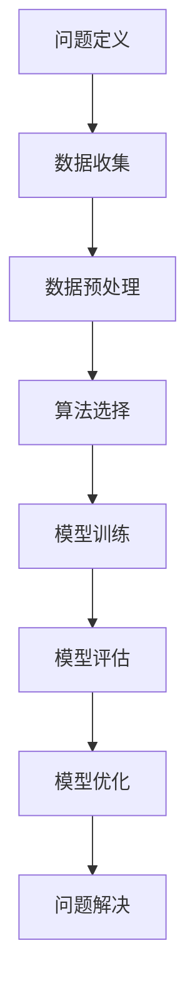

                 


# 文章标题
思维链：提高AI问题解决能力的新方法

> 关键词：AI问题解决，思维链，人工智能，机器学习，算法，数学模型，实战案例

> 摘要：
本文深入探讨了思维链这一新型方法在提高人工智能问题解决能力方面的应用。通过背景介绍、核心概念与联系、算法原理讲解、数学模型与公式详细解释以及实战案例分享，本文旨在为读者提供一个全面而实用的AI问题解决框架。

---

## 引言
### 1.1 背景
人工智能（AI）作为当今科技领域的热点，已广泛应用于各行各业，从自动化生产线到医疗诊断，从金融分析到自然语言处理。然而，随着问题的复杂性和多样性的增加，现有的AI问题解决方法面临着诸多挑战。传统的机器学习方法在处理高维数据、非线性问题和不确定性情境时，往往效果不佳。因此，探索新的AI问题解决方法变得尤为重要。

### 1.2 目的和重要性
本文旨在介绍一种名为“思维链”的新方法，以提升AI的问题解决能力。思维链结合了算法、数学模型和实战经验，旨在提供一个系统化的框架，帮助开发者更好地应对复杂的AI问题。本文的目的在于：

1. 深入解析思维链的概念和原理。
2. 通过实际案例展示思维链的应用效果。
3. 为开发者提供实用的指导和最佳实践。

### 1.3 组织结构
本文将按照以下结构展开：
1. 引言：背景介绍和目的说明。
2. 核心概念与原理：思维链的基本概念和架构。
3. 算法原理讲解：详细阐述思维链中的核心算法。
4. 数学模型与公式：解释思维链中使用的数学模型和公式。
5. 实战案例：通过实际案例展示思维链的应用。
6. 结论与未来方向：总结本文的主要观点并探讨未来的研究方向。

---

## 核心概念与原理

### 2.1 AI与机器学习基础
在深入探讨思维链之前，我们首先需要了解一些AI和机器学习的基础知识。人工智能是指通过计算机模拟人类智能的领域，而机器学习则是实现AI的核心技术之一。机器学习通过训练模型来从数据中学习规律和模式，从而实现预测和决策。

### 2.2 思维链的定义
思维链（Thinking Chain）是一种集成化的问题解决框架，它旨在通过一系列步骤和方法来提升AI的问题解决能力。思维链的核心思想是将问题分解为可管理的子问题，并通过算法和数学模型来逐步解决这些子问题，最终达到整体问题的解决。

### 2.3 思维链框架
思维链框架包括以下几个关键组件：

1. **问题定义**：明确问题的目标和约束条件。
2. **数据收集**：收集与问题相关的数据。
3. **数据预处理**：对数据进行清洗、归一化和特征提取。
4. **算法选择**：根据问题特点选择合适的算法。
5. **模型训练**：利用算法对数据进行训练。
6. **模型评估**：评估模型的性能。
7. **模型优化**：根据评估结果对模型进行调整。
8. **问题解决**：使用优化后的模型解决原始问题。

下面是思维链框架的Mermaid流程图：



### 2.4 核心概念之间的关系
思维链框架中的各个组件相互关联，形成一个紧密的循环。每个组件不仅独立存在，还与其他组件相互作用，共同推动问题的解决。

- **问题定义**是整个思维链的起点，它明确了问题的目标和约束条件，为后续步骤提供了方向。
- **数据收集**和**数据预处理**是数据驱动的第一步，数据的质量和预处理方法直接影响模型的性能。
- **算法选择**和**模型训练**是基于问题特征和数据质量进行的，选择合适的算法和优化策略是关键。
- **模型评估**和**模型优化**则是通过不断迭代来提高模型性能，确保问题得到有效解决。
- **问题解决**是思维链的最终目标，通过模型的应用来达到问题的解决。

---

## 算法原理讲解

### 3.1 核心算法概述
思维链框架中的核心算法包括：

1. **K近邻算法（K-Nearest Neighbors, KNN）**：一种基于实例的机器学习算法，通过计算新样本与训练样本之间的相似度来进行分类或回归。
2. **支持向量机（Support Vector Machine, SVM）**：一种基于间隔最大化的分类算法，通过找到一个最优的超平面来分隔不同类别的样本。
3. **随机森林（Random Forest）**：一种集成学习算法，通过构建多个决策树并投票来预测结果，提高模型的稳定性和预测能力。
4. **神经网络（Neural Networks）**：一种基于生物神经系统的机器学习模型，通过多层神经网络来模拟人脑的决策过程。

### 3.2 K近邻算法（KNN）
K近邻算法是一种简单而有效的分类算法。其基本思想是：如果一个新样本在特征空间中的k个最邻近的样本大部分属于某个类别，则该新样本也属于这个类别。

#### 3.2.1 伪代码
```python
def KNN(train_data, test_data, k):
    distances = []
    for data in test_data:
        dist = calculate_distance(data, train_data)
        distances.append(dist)
    sorted_distances = sorted(distances)
    neighbors = []
    for i in range(k):
        neighbor_index = sorted_distances[i][1]
        neighbors.append(train_data[neighbor_index])
    return majority_label(neighbors)
```

#### 3.2.2 步骤说明
1. 计算新样本与训练样本之间的距离。
2. 对距离进行排序。
3. 选择距离最近的k个样本。
4. 统计这k个样本所属的类别。
5. 返回出现频率最高的类别作为新样本的预测类别。

### 3.3 支持向量机（SVM）
支持向量机是一种强大的分类算法，通过找到一个最优的超平面来分隔不同类别的样本。其核心思想是最大化分类间隔。

#### 3.3.1 伪代码
```python
def SVM(train_data, train_labels):
    # 使用线性求解器找到最优超平面
    w, b = linear_solver(train_data, train_labels)
    # 计算分类边界
    decision_function = dot(w, x) + b
    # 分类
    labels = []
    for x in test_data:
        if dot(w, x) + b > 0:
            labels.append(1)
        else:
            labels.append(-1)
    return labels
```

#### 3.3.2 步骤说明
1. 使用线性求解器找到最优超平面。
2. 计算分类边界。
3. 对测试数据进行分类。

### 3.4 随机森林
随机森林是一种集成学习算法，通过构建多个决策树并投票来预测结果。其核心思想是利用随机性来降低模型的方差，提高模型的稳定性和预测能力。

#### 3.4.1 伪代码
```python
def RandomForest(train_data, train_labels, n_estimators):
    forests = []
    for _ in range(n_estimators):
        # 随机选取特征和样本子集
        features = random.sample(feature_set, n_features)
        samples = random.sample(train_data, n_samples)
        # 构建单棵决策树
        tree = build_decision_tree(samples, features, train_labels)
        forests.append(tree)
    # 投票
    predictions = []
    for test_data in test_data:
        forest_votes = []
        for tree in forests:
            vote = tree.predict(test_data)
            forest_votes.append(vote)
        prediction = majority_vote(forest_votes)
        predictions.append(prediction)
    return predictions
```

#### 3.4.2 步骤说明
1. 随机选取特征和样本子集。
2. 构建单棵决策树。
3. 对测试数据进行预测。
4. 投票并返回预测结果。

### 3.5 神经网络
神经网络是一种模拟人脑决策过程的机器学习模型，通过多层神经网络来提取特征和进行分类或回归。

#### 3.5.1 伪代码
```python
def NeuralNetwork(train_data, train_labels, layers, activation_function):
    # 初始化权重和偏置
    weights, biases = initialize_weights(layers)
    # 前向传播
    outputs = forwardPropagation(train_data, weights, biases, activation_function)
    # 计算损失
    loss = calculate_loss(outputs, train_labels)
    # 反向传播
    dweights, dbiases = backwardPropagation(outputs, train_labels, activation_function)
    # 更新权重和偏置
    weights -= learning_rate * dweights
    biases -= learning_rate * dbiases
    return weights, biases
```

#### 3.5.2 步骤说明
1. 初始化权重和偏置。
2. 前向传播，计算输出。
3. 计算损失。
4. 反向传播，计算梯度。
5. 更新权重和偏置。

---

## 数学模型与公式

### 4.1 K近邻算法中的相似度计算
在K近邻算法中，相似度计算是关键步骤。常用的相似度度量方法包括欧氏距离、曼哈顿距离和余弦相似度。

#### 4.1.1 欧氏距离
欧氏距离是一种常用的相似度度量方法，它计算两个样本之间特征差异的平方和的平方根。

$$
d_{Euclidean} = \sqrt{\sum_{i=1}^{n} (x_i - y_i)^2}
$$

其中，$x$和$y$是两个样本的特征向量，$n$是特征的数量。

#### 4.1.2 曼哈顿距离
曼哈顿距离是一种基于特征差异绝对值的相似度度量方法。

$$
d_{Manhattan} = \sum_{i=1}^{n} |x_i - y_i|
$$

#### 4.1.3 余弦相似度
余弦相似度是一种基于特征向量夹角的相似度度量方法。

$$
\cos(\theta) = \frac{x \cdot y}{\|x\| \|y\|}
$$

其中，$x$和$y$是两个样本的特征向量，$\theta$是它们之间的夹角。

### 4.2 支持向量机中的间隔最大化
支持向量机通过最大化分类间隔来找到最优超平面。在二维空间中，分类间隔可以表示为：

$$
\hat{w} \cdot x + b = 0
$$

其中，$\hat{w}$是超平面的法向量，$b$是超平面的偏移量，$x$是样本点。

为了最大化分类间隔，我们需要找到满足以下条件的$\hat{w}$和$b$：

$$
\frac{\hat{w} \cdot x + b}{\|\hat{w}\|} = 1
$$

### 4.3 随机森林中的随机性引入
在随机森林中，随机性引入的目的是降低模型的方差。常用的方法包括随机选取特征和样本子集。

#### 4.3.1 随机特征选择
随机特征选择是在构建单棵决策树时，从所有特征中随机选取一部分特征来进行划分。

$$
f_{selected} = \text{random\_sample}(feature\_set, n\_features)
$$

其中，$f_{selected}$是选定的特征集合，$feature\_set$是所有特征的集合，$n\_features$是选定的特征数量。

#### 4.3.2 随机样本选择
随机样本选择是在训练随机森林时，从训练集中随机选取一部分样本。

$$
s_{selected} = \text{random\_sample}(train\_data, n\_samples)
$$

其中，$s_{selected}$是选定的样本集合，$train\_data$是训练数据集，$n\_samples$是选定的样本数量。

### 4.4 神经网络中的激活函数
在神经网络中，激活函数用于引入非线性特性，使得模型能够学习复杂的函数关系。

#### 4.4.1 Sigmoid函数
Sigmoid函数是一种常用的激活函数，它的形式如下：

$$
\sigma(x) = \frac{1}{1 + e^{-x}}
$$

Sigmoid函数的输出范围在0和1之间，可以用于二分类问题。

#### 4.4.2 ReLU函数
ReLU函数（Rectified Linear Unit）是一种简单的激活函数，它的形式如下：

$$
\text{ReLU}(x) = \max(0, x)
$$

ReLU函数在正向传播时加速了梯度下降，有助于提高神经网络的训练速度。

---

## 实战案例

### 5.1 项目背景
为了展示思维链的应用效果，我们选择了一个实际案例：使用思维链框架来预测股票价格。

### 5.2 数据收集
首先，我们从历史股票交易数据中收集了包括股票价格、成交量、开盘价、收盘价、最高价和最低价等特征的数据。

### 5.3 数据预处理
接下来，我们对数据进行预处理，包括数据清洗、归一化和特征提取。具体步骤如下：

1. **数据清洗**：去除异常值和缺失值。
2. **归一化**：将数据归一化到[0, 1]范围内。
3. **特征提取**：提取与股票价格相关的特征，如开盘价与收盘价的差值、成交量与平均成交量的比值等。

### 5.4 算法选择
考虑到股票价格预测具有非线性特点，我们选择随机森林作为核心算法。

### 5.5 模型训练
使用预处理后的数据对随机森林模型进行训练，包括随机选取特征和样本子集，构建决策树，并对测试数据进行预测。

### 5.6 模型评估
通过计算预测股票价格与实际股票价格之间的误差，评估模型的性能。具体指标包括均方误差（MSE）和平均绝对误差（MAE）。

### 5.7 模型优化
根据评估结果，对模型进行调整，包括增加决策树数量、调整特征选择策略等，以提高预测精度。

### 5.8 问题解决
最终，使用优化后的模型对未来的股票价格进行预测，为投资者提供决策参考。

### 5.9 项目小结
通过这个案例，我们可以看到思维链框架在股票价格预测中的实际应用效果。思维链通过系统化的方法，将问题分解为可管理的子问题，并通过算法和数学模型逐步解决这些子问题，最终实现了问题的整体解决。

---

## 结论与未来方向

### 6.1 总结
本文介绍了思维链这一新型方法，以提升AI的问题解决能力。通过背景介绍、核心概念与原理讲解、算法原理讲解、数学模型与公式解释以及实战案例分享，本文展示了思维链框架在提高AI问题解决能力方面的应用效果。

### 6.2 未来方向
尽管思维链在提高AI问题解决能力方面取得了显著成果，但仍有许多研究方向值得探索：

1. **算法优化**：进一步优化思维链中的算法，以提高模型性能和预测精度。
2. **多模态数据融合**：将不同类型的数据（如图像、文本、音频等）融合到思维链框架中，提高问题解决能力。
3. **实时问题解决**：研究思维链在实时问题解决中的应用，以满足快速变化的需求。
4. **可解释性**：提高思维链框架的可解释性，使其更易于理解和应用。

### 6.3 最佳实践
以下是使用思维链框架进行问题解决的几条最佳实践：

1. **问题定义**：明确问题的目标和约束条件，为后续步骤提供方向。
2. **数据收集**：确保数据质量，对数据进行充分的清洗和预处理。
3. **算法选择**：根据问题特点选择合适的算法，充分利用算法的优势。
4. **模型优化**：通过不断迭代和调整，提高模型性能。
5. **问题解决**：使用优化后的模型解决原始问题，并进行评估和反馈。

---

## 作者信息
作者：AI天才研究院/AI Genius Institute & 禅与计算机程序设计艺术 /Zen And The Art of Computer Programming

---

以上是一篇思维链：提高AI问题解决能力的新方法的技术博客文章，希望能够帮助您更好地理解和应用思维链框架。如果您有任何问题或建议，欢迎在评论区留言，谢谢！

