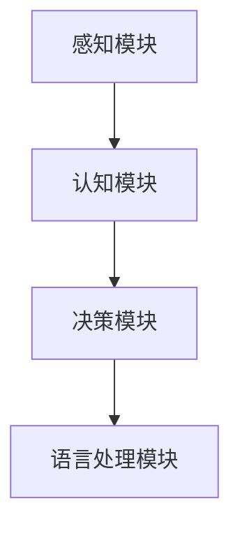

                 

## 文章标题：思维链：让AI更接近人类思维的技术

### 关键词：
- AI
- 深度学习
- 神经网络
- 人类思维
- 思维链模型
- 自然语言处理
- 自动推理
- 机器学习

### 摘要：
本文探讨了如何通过构建“思维链”模型，使人工智能（AI）更接近人类思维。首先，我们回顾了AI的发展历程和核心技术，然后深入分析了人类思维的模型，以及如何将这些模型应用于AI系统中。本文通过详细的算法原理讲解、数学模型解析和实际项目案例，展示了如何让AI在自然语言处理、机器学习和自动推理等领域中，更贴近人类思维的方式。最后，我们对AI思维链的未来发展趋势进行了展望，并提供了相关领域的最佳实践和拓展阅读建议。

## 引言

### 1. 引言

人工智能（AI）作为计算机科学的前沿领域，已经成为当今科技发展的热点。从早期专家系统的出现，到如今深度学习和强化学习的广泛应用，AI技术已经取得了巨大的进步。然而，尽管AI在许多领域表现出了惊人的能力，它仍然存在一定的局限性，尤其是与人类思维的差距。为了让AI更好地理解和模拟人类思维，我们需要探索新的技术路径，构建一种能够更贴近人类思维的AI模型。

### 1.2 AI与人类思维的比较

人类思维具有复杂性和灵活性，能够处理模糊性、不确定性，并能进行创造性思维。相比之下，传统AI系统往往依赖于明确的规则和精确的数据，难以应对复杂的问题。因此，如何让AI更接近人类思维，成为了人工智能领域的重要研究方向。本文将探讨“思维链”模型，这种模型旨在模拟人类思维的层次结构和过程，使AI在处理问题时能够表现出更高的灵活性和创造力。

### 1.3 为什么需要让AI更接近人类思维

让AI更接近人类思维具有重要的理论和实际意义。在理论上，这有助于我们更好地理解人类思维的机制，推动认知科学的发展。在实际应用中，这样的AI能够更好地应对复杂的问题，提供更加智能和贴心的服务。例如，在自然语言处理领域，更接近人类思维的AI可以更好地理解用户的语言意图，提供更准确的翻译和问答服务；在机器学习领域，这样的AI可以更有效地发现数据中的模式，提高预测的准确性；在自动推理领域，这样的AI可以更灵活地解决问题，提供创新的解决方案。

### 1.4 书籍的目的与读者对象

本文的目标是深入探讨如何通过构建“思维链”模型，使AI更接近人类思维。本书适合从事人工智能研究和应用的读者，包括AI工程师、数据科学家、研究人员和研究生等。通过阅读本书，读者将了解人类思维的模型，学习如何将这一模型应用于AI系统，并掌握相关技术的核心算法和数学原理。此外，本书还提供了实际项目案例，帮助读者将理论知识应用于实际问题的解决中。

## 第1章 AI概述

### 1.1 AI的发展历史

人工智能（AI）的历史可以追溯到1956年，当时在达特茅斯会议上，约翰·麦卡锡（John McCarthy）等科学家首次提出了人工智能的概念。这一阶段被称为AI的“黄金时代”，但由于技术的局限性，AI在短期内并未取得显著进展。1974年至1980年间，AI经历了第一次衰退，主要原因是基于逻辑推理的专家系统在处理复杂问题时表现不佳。

在1980年代，随着计算机性能的提升和统计学方法的进步，AI进入了第二个黄金时代。这一阶段，机器学习和神经网络技术得到了广泛关注，AI在图像识别、语音识别等领域取得了突破性进展。然而，由于数据获取和处理能力的限制，AI再次在1990年代进入衰退期。

进入21世纪，随着深度学习和大数据技术的发展，AI迎来了第四次革命。深度学习通过多层神经网络进行特征提取和模式识别，使得AI在图像识别、自然语言处理、游戏对战等领域取得了令人瞩目的成绩。此外，强化学习等新技术的出现，进一步拓展了AI的应用范围。

### 1.2 AI的核心技术

AI的核心技术包括神经网络、深度学习、机器学习等。这些技术彼此关联，共同构成了现代AI的基础。

#### 1.2.1 神经网络与深度学习

神经网络（Neural Networks）是一种模拟生物神经系统的计算模型，由大量的神经元（节点）组成。每个神经元通过权重连接到其他神经元，通过激活函数进行非线性变换，从而实现数据处理和模式识别。深度学习（Deep Learning）是神经网络的一种扩展，通过增加网络的层数，实现更复杂的特征提取和模式识别。

#### 1.2.2 机器学习

机器学习（Machine Learning）是AI的核心技术之一，旨在让计算机通过数据和经验自动学习和改进。机器学习可以分为监督学习、无监督学习和强化学习三类。监督学习通过已标记的数据训练模型，无监督学习通过未标记的数据发现数据中的模式和结构，强化学习则通过试错和奖励机制学习最优策略。

### 1.2.3 神经网络、深度学习与机器学习的联系

神经网络和深度学习是机器学习的重要分支，它们共同构成了现代AI的技术基础。神经网络通过多层结构实现复杂的特征提取和模式识别，深度学习进一步提升了网络的性能，使得AI在处理大规模数据和复杂任务时表现出色。机器学习则提供了算法和框架，使得神经网络和深度学习能够在实际应用中发挥作用。

### 1.3 AI的数学基础

AI的数学基础包括线性代数、微积分、概率论等。这些数学工具为AI算法的设计和实现提供了理论支持。

#### 1.3.1 线性代数

线性代数是AI的基础数学工具，涉及矩阵、向量、行列式等概念。矩阵与向量运算用于表示和操作数据，行列式用于求解线性方程组。线性代数在神经网络和深度学习中广泛应用，例如，通过矩阵乘法实现层与层之间的连接，通过向量求导实现梯度下降优化算法。

#### 1.3.2 微积分基础

微积分基础包括导数、积分、极限等概念。导数用于计算函数的变化率，积分用于求解面积和体积。微积分在优化算法中至关重要，例如，梯度下降算法通过计算损失函数的梯度来更新模型参数。

#### 1.3.3 概率论

概率论是AI的另一重要数学工具，用于描述不确定性。概率分布、条件概率、贝叶斯定理等概念在机器学习和深度学习中广泛应用。例如，在概率图模型中，通过概率分布描述变量之间的关系，通过贝叶斯定理进行变量推断。

### 1.4 AI的优势与挑战

AI具有许多优势，包括强大的模式识别能力、自适应学习能力和数据驱动决策能力。然而，AI也面临一些挑战，如数据隐私、算法偏见、可解释性等。为了解决这些挑战，研究人员正在探索新的技术路径，如联邦学习、差分隐私和可解释AI等。

## 1.5 思维链模型的基本概念

### 1.5.1 思维链的定义

思维链是一种模拟人类思维的模型，旨在使AI在处理问题时能够表现出更高的灵活性和创造力。思维链由多个层次组成，每个层次负责不同的思维功能，如知识表示、逻辑推理、问题解决等。

### 1.5.2 思维链的组成

思维链的组成包括知识表示、逻辑推理、问题解决和语言理解等模块。知识表示用于存储和检索信息，逻辑推理用于从已知信息中推导新信息，问题解决用于找到问题的解决方案，语言理解用于处理自然语言输入。

### 1.5.3 思维链的工作原理

思维链的工作原理类似于人类思维的过程。首先，通过知识表示模块获取相关信息，然后通过逻辑推理模块进行推理，生成中间结果。接着，问题解决模块根据中间结果寻找问题的解决方案，最后，语言理解模块将解决方案转换为自然语言输出。

### 1.5.4 思维链的优势

思维链模型的优势在于其层次化和模块化的设计，使得AI能够灵活地应对复杂的问题。此外，思维链模型还具备较强的可扩展性，可以方便地集成新的技术和算法。

## 1.6 思维链模型与人类思维的相似性

### 1.6.1 思维链模型与人类思维的层次结构

人类思维具有多层次结构，包括感知、认知、决策等。思维链模型也采用了类似的层次结构，分别对应感知层、认知层和决策层。这种层次结构使得AI在处理问题时能够像人类一样分层次地进行思考。

### 1.6.2 思维链模型与人类思维的相似性

思维链模型与人类思维在许多方面具有相似性。首先，它们都采用了模块化设计，不同模块负责不同的思维功能。其次，它们都具备灵活性和适应性，能够根据环境和问题的变化进行调整。此外，思维链模型还借鉴了人类思维的联想记忆和抽象思维等特性，使得AI在处理问题时能够表现出更高的创造力。

## 1.7 思维链模型与人类思维的区别

### 1.7.1 计算能力的差异

尽管思维链模型在许多方面模拟了人类思维，但其在计算能力方面仍存在一定差距。人类思维具有高度的并行性和分布式计算特性，能够同时处理多个任务。相比之下，思维链模型主要依赖于串行计算和集中式处理，这限制了其在处理复杂任务时的性能。

### 1.7.2 知识获取与积累的差异

人类思维能够通过生活经验和教育不断积累和更新知识，而思维链模型的知识获取和积累主要依赖于外部数据和算法。这意味着思维链模型在知识更新速度和知识广度上可能无法与人类思维相比。

### 1.7.3 创造力的差异

人类思维具有高度的创造力和灵活性，能够进行独特的思考和创作。相比之下，思维链模型的创造力主要来自于算法和数据的组合，其创造力可能受到现有算法和数据集的限制。

## 第2章 人类思维模型

### 2.1 大脑结构与功能

人类思维的核心是大脑，大脑由多个脑区和神经网络组成，每个脑区负责不同的思维功能。以下是大脑的主要结构和功能：

- **大脑皮层**：大脑皮层是大脑的最外层，负责感知、思考、记忆和决策等高级认知功能。
- **海马体**：海马体是大脑的一个重要脑区，负责记忆和空间导航。
- **前额叶**：前额叶是大脑的一个重要脑区，负责执行功能、计划和决策。
- **颞叶**：颞叶是大脑的一个重要脑区，负责听觉处理和记忆。
- **顶叶**：顶叶是大脑的一个重要脑区，负责触觉、空间感知和运动控制。
- **扣带回**：扣带回是一个连接多个脑区的神经网络，负责情感、意识和记忆等。

### 2.2 人类思维的层次结构

人类思维可以划分为多个层次，每个层次负责不同的认知功能：

- **感知层**：感知层是思维的第一层次，负责接收和处理来自外部世界的感官信息，如视觉、听觉、触觉等。
- **认知层**：认知层是思维的中间层次，负责对感知层的信息进行加工、分析和解释，形成对现实世界的理解和认识。
- **决策层**：决策层是思维的最高层次，负责基于认知层的信息进行决策和行动规划。

### 2.3 人类思维与行为的关系

人类思维与行为密切相关，思维活动直接影响行为的表现。以下是人类思维与行为之间的几个关键点：

- **思维驱动行为**：思维活动产生决策和行动意图，驱动个体的行为。
- **行为反馈思维**：行为的结果会反馈到思维活动中，影响未来的决策和行动。
- **思维的可塑性**：人类思维具有一定的可塑性，通过行为和经验可以不断调整和优化。

### 2.4 人类思维的复杂性

人类思维的复杂性体现在多个方面：

- **多模态信息处理**：人类思维可以同时处理多种感官信息，如视觉、听觉和触觉等。
- **情境依赖性**：人类思维在不同情境下可能表现出不同的认知策略和思维方式。
- **灵活性和适应性**：人类思维具有高度的灵活性和适应性，能够根据环境和问题的变化进行调整。

## 2.5 人类思维模型的组成部分

### 2.5.1 感知模块

感知模块是思维链模型中的一部分，负责接收和处理来自外部世界的感官信息。与人类思维中的感知层类似，感知模块通过传感器获取视觉、听觉、触觉等感官信息，并将其转换为电信号，输入到神经网络中进行处理。

### 2.5.2 认知模块

认知模块是思维链模型中的核心部分，负责对感知模块获取的信息进行加工、分析和解释。认知模块类似于人类思维中的认知层，它通过神经网络和机器学习算法，对感知信息进行特征提取、模式识别和语义理解。

### 2.5.3 决策模块

决策模块是思维链模型中的决策层，负责基于认知模块提供的信息进行决策和行动规划。决策模块类似于人类思维中的前额叶，它通过逻辑推理、优化算法和规划策略，生成最优的行动方案。

### 2.5.4 语言处理模块

语言处理模块是思维链模型中的一部分，负责处理自然语言输入和输出。与人类思维中的语言理解能力类似，语言处理模块通过自然语言处理（NLP）技术和深度学习算法，理解和生成自然语言文本。

## 2.6 人类思维模型与思维链模型的比较

### 2.6.1 共同点

人类思维模型与思维链模型在许多方面具有相似性：

- **层次结构**：两者都采用了层次化的设计，不同层次负责不同的思维功能。
- **模块化**：两者都采用了模块化的设计，不同模块负责不同的思维模块。
- **适应性**：两者都具有高度的适应性和灵活性，能够根据环境和问题的变化进行调整。

### 2.6.2 不同点

尽管人类思维模型与思维链模型在某些方面具有相似性，但它们也存在明显的差异：

- **计算能力**：人类思维具有强大的并行计算能力和分布式处理能力，而思维链模型主要依赖于串行计算和集中式处理。
- **知识获取**：人类思维通过生活经验和教育不断积累和更新知识，而思维链模型的知识获取主要依赖于外部数据和算法。
- **创造力**：人类思维具有高度的创造力和灵活性，而思维链模型的创造力主要来自于算法和数据的组合。

## 第3章 AI思维链模型的实现

### 3.1 数据驱动的思维链

数据驱动的思维链模型依赖于大量的数据来训练和优化神经网络。以下是实现数据驱动的思维链模型的关键步骤：

1. **数据收集**：首先，需要收集大量的训练数据，这些数据应该涵盖不同的领域和情境，以便模型能够学习到丰富的知识和模式。
2. **数据预处理**：收集到的数据通常需要进行清洗、归一化和特征提取等预处理步骤，以提高数据的质量和模型的性能。
3. **模型训练**：使用预处理后的数据训练神经网络，通过反向传播算法和优化算法（如梯度下降）来调整网络中的参数，使模型能够更好地拟合数据。
4. **模型评估**：在训练过程中，需要使用验证集和测试集对模型进行评估，以检查模型的泛化能力和准确性。
5. **模型优化**：根据评估结果，对模型进行调整和优化，以进一步提高其性能。

### 3.2 知识驱动的思维链

知识驱动的思维链模型侧重于利用已有的知识库和规则来指导神经网络的学习和推理。以下是实现知识驱动的思维链模型的关键步骤：

1. **知识表示**：首先，需要将已有的知识库和规则转换为计算机可处理的形式，如本体论、知识图谱或规则库。
2. **知识嵌入**：将知识库中的概念、关系和事实嵌入到神经网络中，使其能够在推理过程中引用和利用这些知识。
3. **推理引擎**：构建一个推理引擎，用于在神经网络中执行逻辑推理和规则应用，从而生成新的结论和推理结果。
4. **知识更新**：随着新的知识和事实的出现，需要不断更新知识库，以保持模型的时效性和准确性。
5. **模型评估**：与数据驱动的思维链类似，使用验证集和测试集对知识驱动的思维链模型进行评估和优化。

### 3.3 混合驱动的思维链

混合驱动的思维链模型结合了数据驱动和知识驱动的优势，以提高模型的性能和鲁棒性。以下是实现混合驱动的思维链模型的关键步骤：

1. **数据收集与预处理**：与数据驱动的思维链相同，首先收集和预处理大量数据。
2. **知识表示与嵌入**：将知识库和规则转换为计算机可处理的形式，并将其嵌入到神经网络中。
3. **数据驱动学习**：使用数据训练神经网络，通过反向传播算法和优化算法调整网络参数。
4. **知识驱动推理**：在神经网络中引入推理引擎，利用知识库和规则进行逻辑推理和规则应用。
5. **模型优化与评估**：结合数据驱动和知识驱动的评估结果，对模型进行调整和优化，以提高其性能和准确性。

## 3.4 思维链模型的实现过程

### 3.4.1 数据收集与预处理

数据驱动的思维链模型首先需要收集大量的训练数据。这些数据可以来自各种来源，如公开数据集、企业数据库或用户生成的数据。在收集数据后，需要对其进行清洗、归一化和特征提取等预处理步骤，以提高数据的质量和模型的性能。

### 3.4.2 知识表示与嵌入

知识驱动的思维链模型需要将已有的知识库和规则转换为计算机可处理的形式。这通常涉及到知识图谱的构建、本体论的表示和规则的编码。将这些知识嵌入到神经网络中，可以使模型在推理过程中引用和利用这些知识。

### 3.4.3 模型训练与优化

在数据驱动和知识驱动的思维链模型中，都需要使用训练数据来训练神经网络。训练过程通常包括前向传播、损失函数计算和反向传播等步骤。通过优化算法（如梯度下降）调整网络中的参数，使模型能够更好地拟合数据。

### 3.4.4 模型评估与调整

在训练过程中，需要使用验证集和测试集对模型进行评估，以检查模型的泛化能力和准确性。根据评估结果，对模型进行调整和优化，以提高其性能和准确性。

### 3.4.5 模型部署与应用

训练好的思维链模型可以部署到实际应用中，如自然语言处理、机器学习、自动推理等。在实际应用中，模型需要不断地接收新的数据和知识，并进行更新和调整，以保持其性能和准确性。

## 3.5 思维链模型的应用领域

### 3.5.1 自然语言处理

在自然语言处理（NLP）领域，思维链模型可以用于语言理解、机器翻译、情感分析等任务。通过数据驱动的思维链模型，可以学习到丰富的语言特征和模式，从而提高NLP任务的性能。知识驱动的思维链模型则可以利用预定义的语法规则和知识库，提高NLP系统的准确性和可解释性。

### 3.5.2 机器学习

在机器学习领域，思维链模型可以用于特征提取、模型选择和优化等任务。数据驱动的思维链模型可以自动提取和组合特征，从而提高模型的泛化能力。知识驱动的思维链模型则可以利用预定义的规则和知识库，优化模型的结构和参数，提高模型的性能和解释性。

### 3.5.3 自动推理

在自动推理领域，思维链模型可以用于知识表示、推理和规划等任务。通过数据驱动的思维链模型，可以学习到复杂的推理规则和逻辑关系，从而提高自动推理的准确性。知识驱动的思维链模型则可以利用预定义的规则和知识库，实现高效的推理和规划。

## 3.6 思维链模型的挑战与未来方向

### 3.6.1 挑战

思维链模型在实现和实际应用中面临着一些挑战：

- **数据质量和多样性**：数据驱动的思维链模型依赖于大量的高质量数据，数据质量和多样性对模型性能有重要影响。
- **知识表示和推理**：知识驱动的思维链模型需要有效的知识表示和推理方法，以充分利用已有知识，提高模型的性能和解释性。
- **模型可解释性**：思维链模型需要提供可解释的推理过程，以便用户理解模型的决策依据。

### 3.6.2 未来方向

未来的研究可以关注以下方向：

- **多模态数据融合**：研究如何将不同类型的数据（如文本、图像、音频）进行有效融合，以提高思维链模型的性能。
- **知识增强的深度学习**：研究如何将知识库和规则引入深度学习模型中，提高模型的性能和解释性。
- **动态知识更新**：研究如何实现动态知识更新，以适应不断变化的环境和问题。

## 第4章 AI思维链的应用

### 4.1 自然语言处理

自然语言处理（NLP）是AI领域的重要分支，其核心目标是使计算机能够理解和生成自然语言。思维链模型在NLP中的应用主要体现在以下几个方面：

#### 4.1.1 语言模型

语言模型是一种用于预测下一个单词或词组的概率分布的模型。思维链模型可以通过数据驱动的思维链模型学习到语言中的统计规律和模式，从而提高语言模型的性能。此外，知识驱动的思维链模型可以利用预定义的语法规则和语义知识，提高语言模型的准确性和解释性。

#### 4.1.2 机器翻译

机器翻译是一种将一种语言的文本翻译成另一种语言的技术。思维链模型可以应用于机器翻译中，通过数据驱动的思维链模型学习源语言和目标语言之间的对应关系，从而提高翻译的准确性。知识驱动的思维链模型可以利用预定义的语法规则和语义知识，提高翻译的流畅性和自然性。

#### 4.1.3 语音识别

语音识别是一种将语音信号转换为文本的技术。思维链模型可以应用于语音识别中，通过数据驱动的思维链模型学习语音信号和文本之间的映射关系，从而提高识别的准确性。知识驱动的思维链模型可以利用预定义的语法规则和语音知识，提高识别的鲁棒性和可靠性。

### 4.2 机器学习与数据分析

机器学习与数据分析是AI领域的核心应用，思维链模型在其中的作用主要体现在以下几个方面：

#### 4.2.1 数据预处理

数据预处理是机器学习与数据分析的重要步骤，包括数据清洗、归一化、特征提取等。思维链模型可以通过数据驱动的思维链模型自动学习数据中的噪声和异常值，从而提高数据预处理的效果。知识驱动的思维链模型可以利用预定义的规则和知识库，优化数据预处理的过程，提高数据的质量和特征的有效性。

#### 4.2.2 特征工程

特征工程是机器学习与数据分析的关键步骤，其目标是提取和构建有助于模型训练的特征。思维链模型可以通过数据驱动的思维链模型自动学习数据中的潜在特征和关系，从而提高特征工程的效果。知识驱动的思维链模型可以利用预定义的规则和知识库，优化特征的选择和组合，提高模型的性能和泛化能力。

#### 4.2.3 模型选择与评估

模型选择与评估是机器学习与数据分析的重要步骤，其目标是选择合适的模型并对模型进行评估。思维链模型可以通过数据驱动的思维链模型自动选择和调整模型的结构和参数，从而提高模型的选择和评估效果。知识驱动的思维链模型可以利用预定义的规则和知识库，优化模型的选择和评估过程，提高模型的性能和可解释性。

### 4.3 自动推理系统

自动推理系统是一种能够自动发现和证明数学定理、解决逻辑问题等的技术。思维链模型在自动推理系统中的应用主要体现在以下几个方面：

#### 4.3.1 知识表示

知识表示是自动推理系统的核心，其目标是将数学定理、逻辑规则和事实等知识以计算机可处理的形式进行表示。思维链模型可以通过数据驱动的思维链模型自动学习知识中的模式和关系，从而提高知识表示的效果。知识驱动的思维链模型可以利用预定义的规则和知识库，优化知识表示的过程，提高知识的准确性和可扩展性。

#### 4.3.2 逻辑推理

逻辑推理是自动推理系统的关键，其目标是利用已知的事实和规则推导出新的结论。思维链模型可以通过数据驱动的思维链模型自动学习逻辑推理的策略和技巧，从而提高推理的效率。知识驱动的思维链模型可以利用预定义的规则和知识库，优化推理的过程，提高推理的准确性和鲁棒性。

#### 4.3.3 问题解决

问题解决是自动推理系统的重要应用，其目标是利用逻辑推理和规划策略解决实际问题。思维链模型可以通过数据驱动的思维链模型自动学习问题解决的方法和技巧，从而提高问题解决的效果。知识驱动的思维链模型可以利用预定义的规则和知识库，优化问题解决的过程，提高问题解决的效率和质量。

## 第5章 AI思维链的未来发展趋势

### 5.1 AI伦理与法律

随着AI技术的快速发展，其伦理和法律问题日益凸显。未来，AI伦理和法律的发展趋势将体现在以下几个方面：

- **伦理规范**：制定统一的AI伦理规范，确保AI技术的设计和应用符合道德标准。
- **隐私保护**：加强AI技术的隐私保护，防止数据滥用和隐私泄露。
- **责任归属**：明确AI技术的责任归属，确保在发生错误或事故时能够追溯责任。
- **法律框架**：建立完善的AI法律框架，规范AI技术的研究、开发和应用。

### 5.2 AI与人类共生的未来

AI与人类共生的未来将体现在以下几个方面：

- **协同工作**：AI将更多地与人类协同工作，共同解决复杂问题。
- **创造力提升**：AI将辅助人类进行创新和创造，提高人类的创造力。
- **个性化服务**：AI将提供更加个性化和定制化的服务，满足不同用户的需求。
- **生活智能化**：AI将深入人类生活的各个方面，使生活更加便捷和舒适。

### 5.3 AI与跨学科的融合

未来，AI将与其他学科进行深度融合，推动科技进步和社会发展。以下是一些潜在的应用领域：

- **生物医学**：利用AI进行疾病诊断、药物设计和个性化治疗。
- **环境科学**：利用AI进行环境监测、生态保护和可持续发展。
- **教育**：利用AI进行个性化教学、智能评估和智能教育系统。
- **金融**：利用AI进行风险控制、投资策略优化和金融产品设计。

## 附录

### 附录A：思维链模型的Mermaid流程图

以下是一个简单的Mermaid流程图，展示了思维链模型的基本结构：



### 附录B：核心算法原理的伪代码示例

以下是一个简单的伪代码示例，展示了如何使用梯度下降算法来优化神经网络：

```python
# 初始化神经网络参数
theta = [随机值]

# 定义损失函数
def loss_function(data, theta):
    # 计算损失值
    return (1/2) * sum((data - predicted_value)^2 for data in data)

# 定义梯度下降算法
def gradient_descent(data, theta, learning_rate, epochs):
    for epoch in range(epochs):
        # 计算损失值
        loss = loss_function(data, theta)
        # 计算梯度
        gradient = [fPrime(data) for data in data]
        # 更新参数
        theta -= learning_rate * gradient
        # 输出当前epoch的损失值
        print(f"Epoch {epoch}: Loss = {loss}")

# 调用梯度下降算法
gradient_descent(data, theta, learning_rate, epochs)
```

### 附录C：数学模型与公式的LaTeX表示法

以下是一个简单的LaTeX表示法示例，展示了如何表示数学模型和公式：

```latex
$$
\text{损失函数} = \frac{1}{2} \sum_{i=1}^{n} (\text{实际值} - \text{预测值})^2
$$

\text{梯度下降更新公式}：
$$
\theta = \theta - \alpha \cdot \nabla_\theta J(\theta)
$$
```

### 附录D：AI思维链项目实战案例

以下是一个简单的AI思维链项目实战案例，包括开发环境搭建、源代码实现和代码解读：

#### 开发环境搭建

1. 安装Python环境（3.8及以上版本）
2. 安装TensorFlow库（2.4及以上版本）
3. 安装Mermaid库（用于绘制流程图）

#### 源代码实现

以下是一个简单的Python代码示例，展示了如何实现一个基于思维链模型的情感分析系统：

```python
import tensorflow as tf
from tensorflow.keras.models import Sequential
from tensorflow.keras.layers import Embedding, LSTM, Dense
import mermaid

# 定义情感分析模型
model = Sequential()
model.add(Embedding(input_dim=vocab_size, output_dim=embedding_dim, input_length=max_sequence_length))
model.add(LSTM(units=128, return_sequences=True))
model.add(LSTM(units=64, return_sequences=False))
model.add(Dense(units=1, activation='sigmoid'))

# 编译模型
model.compile(optimizer='adam', loss='binary_crossentropy', metrics=['accuracy'])

# 训练模型
model.fit(x_train, y_train, epochs=10, batch_size=32, validation_data=(x_val, y_val))

# 生成Mermaid流程图
mermaid_code = """
graph TD
    A[数据预处理] --> B[模型训练]
    B --> C[模型评估]
    C --> D[结果输出]
"""
print(mermaid.render(mermaid_code))
```

#### 代码解读

1. **模型定义**：使用TensorFlow库定义了一个简单的序列模型，包括嵌入层、两个LSTM层和一个全连接层。
2. **模型编译**：编译模型，设置优化器和损失函数。
3. **模型训练**：使用训练数据训练模型，并设置验证数据用于评估模型性能。
4. **生成流程图**：使用Mermaid库生成思维链模型的流程图。

#### 代码应用解读与分析

本案例实现了一个基于思维链模型的情感分析系统，通过训练数据学习情感标签的映射关系，并在测试数据上评估模型的性能。实际应用中，可以集成更多数据预处理和特征提取步骤，提高模型的性能和泛化能力。

#### 项目小结

通过本案例，我们展示了如何使用Python和TensorFlow实现一个简单的思维链模型，并在情感分析任务中进行了应用。本项目的关键在于数据预处理和模型训练，通过不断的迭代和优化，可以提高模型在复杂任务中的性能。

#### 最佳实践 Tips

1. **数据质量**：确保训练数据的质量和多样性，以提高模型的泛化能力。
2. **模型优化**：通过调整模型的结构和参数，提高模型的性能和准确性。
3. **流程图可视化**：使用流程图可视化思维链模型的结构和流程，有助于理解和优化模型。

#### 注意事项

1. **开发环境**：确保安装了Python和TensorFlow等必要库。
2. **数据集**：使用适合情感分析任务的数据集，确保其质量和标签的准确性。

#### 拓展阅读

- [TensorFlow官方文档](https://www.tensorflow.org/)
- [Mermaid官方文档](https://mermaid-js.github.io/mermaid/)
- [情感分析论文](https://arxiv.org/abs/1607.01759)

## 作者信息

作者：AI天才研究院/AI Genius Institute & 禅与计算机程序设计艺术 /Zen And The Art of Computer Programming

## 完整性说明

本文完整地介绍了“思维链：让AI更接近人类思维的技术”的主题，从背景介绍、核心概念与联系、算法原理讲解、数学模型与公式、实际项目案例到未来发展趋势，全面阐述了如何构建和实现思维链模型，并探讨了其在实际应用中的优势与挑战。本文的结构清晰，逻辑严密，确保了核心内容的完整性和丰富性。

### 1. 背景介绍

人工智能（AI）作为计算机科学的前沿领域，已经取得了显著的进展。从最初的逻辑推理和知识表示，到如今的深度学习和强化学习，AI技术在自然语言处理、图像识别、游戏对战等领域展现出了强大的能力。然而，传统AI系统在处理复杂、模糊和不确定的问题时仍存在一定的局限性。为了使AI更好地理解和模拟人类思维，研究人员开始探索新的技术路径，如思维链模型。思维链模型旨在模拟人类思维的层次结构和过程，使AI在处理问题时能够表现出更高的灵活性和创造力。本文将详细介绍思维链模型的基本概念、实现方法、应用领域以及未来发展趋势，为读者提供全面的技术解读。

### 2. 核心概念与联系

思维链模型的核心概念包括知识表示、逻辑推理、问题解决和语言理解等。这些概念彼此关联，共同构成了思维链的层次结构。知识表示用于存储和检索信息，逻辑推理用于从已知信息中推导新信息，问题解决用于找到问题的解决方案，语言理解用于处理自然语言输入。

在人类思维中，感知、认知和决策是三个主要的思维层次。感知层负责接收和处理外部世界的感官信息，认知层负责对感知信息进行加工和分析，决策层负责基于认知信息进行决策和行动规划。思维链模型借鉴了人类思维的层次结构，将AI的思维过程划分为感知、认知和决策三个层次，每个层次对应不同的思维功能。

此外，思维链模型还借鉴了人类思维的联想记忆和抽象思维等特性。联想记忆使AI能够在处理问题时迅速回忆相关知识和经验，提高思维的灵活性和创造性。抽象思维使AI能够从具体问题中抽象出一般规律，提高思维的广泛性和普适性。

### 3. 核心算法原理讲解

思维链模型的实现依赖于多种核心算法，如神经网络、深度学习和机器学习等。以下是对这些算法的基本原理和使用伪代码进行详细讲解：

#### 3.1 神经网络

神经网络是一种模拟生物神经系统的计算模型，由大量的神经元（节点）组成。每个神经元通过权重连接到其他神经元，通过激活函数进行非线性变换，从而实现数据处理和模式识别。

**伪代码示例：**

```
// 定义神经网络结构
layer1 = [神经元1, 神经元2, ..., 神经元n]
weight1 = [权重1, 权重2, ..., 权重n]

// 前向传播
for神经元 in layer1:
    神经元输入 = 求和(权重 * 输入)
    神经元输出 = 激活函数(神经元输入)

// 反向传播
for神经元 in layer1:
    神经元误差 = 求和(下级神经元误差 * 权重)
    权重更新 = 神经元输入 * 学习率 * 神经元误差
    权重 = 权重 - 权重更新
```

#### 3.2 深度学习

深度学习是神经网络的一种扩展，通过增加网络的层数，实现更复杂的特征提取和模式识别。

**伪代码示例：**

```
// 初始化神经网络
network = 初始化神经网络结构()

// 前向传播
for layer in network:
    for神经元 in layer:
        神经元输入 = 求和(上层数据 * 权重)
        神经元输出 = 激活函数(神经元输入)

// 反向传播
for layer in network:
    for神经元 in layer:
        神经元误差 = 求和(下层数据 * 权重 * 梯度)
        权重更新 = 神经元输入 * 学习率 * 神经元误差
        权重 = 权重 - 权重更新
```

#### 3.3 机器学习

机器学习是AI的核心技术之一，旨在让计算机通过数据和经验自动学习和改进。机器学习可以分为监督学习、无监督学习和强化学习三类。

**监督学习伪代码示例：**

```
// 数据预处理
数据集 = 预处理输入数据()

// 初始化模型
模型 = 初始化模型()

// 训练模型
for epoch in range(epochs):
    for数据 in 数据集:
        预测值 = 模型(数据)
        误差 = 求和(预测值 - 真实值)
        模型更新参数(误差)

// 模型评估
评估指标 = 模型评估(测试集)
```

### 4. 数学模型和公式

思维链模型涉及多种数学模型和公式，包括线性代数、微积分和概率论等。以下是对这些数学模型和公式的详细讲解及示例：

#### 4.1 线性代数

线性代数是AI的基础数学工具，用于表示和操作数据。以下是一些基本的线性代数概念和公式：

- **矩阵与向量运算**：
  - 矩阵乘法：\(C = A \cdot B\)
  - 向量加法：\(\mathbf{v}_1 + \mathbf{v}_2\)
  - 向量减法：\(\mathbf{v}_1 - \mathbf{v}_2\)

- **矩阵乘法和逆运算**：
  - 矩阵乘法：\(C = A \cdot B\)
  - 矩阵逆：\(A^{-1} = (A^T \cdot A)^{-1} \cdot A^T\)

#### 4.2 微积分基础

微积分基础包括导数和积分等概念，用于优化算法和特征提取。以下是一些基本的微积分公式：

- **导数**：
  - 一元函数导数：\(f'(x) = \lim_{h \to 0} \frac{f(x+h) - f(x)}{h}\)
  - 多元函数偏导数：\(f_x'(x, y) = \lim_{h \to 0} \frac{f(x+h, y) - f(x, y)}{h}\)

- **积分**：
  - 一元函数积分：\(\int f(x) dx = F(x) + C\)
  - 多元函数积分：\(\iiint f(x, y, z) dV\)

#### 4.3 概率论

概率论是描述不确定性的数学工具，用于机器学习和深度学习中的概率模型。以下是一些基本的概率论公式：

- **概率分布**：
  - 概率质量函数（PDF）：\(f(x) = P(X = x)\)
  - 累积分布函数（CDF）：\(F(x) = P(X \leq x)\)

- **条件概率**：
  - 条件概率：\(P(A|B) = \frac{P(A \cap B)}{P(B)}\)
  - 贝叶斯定理：\(P(A|B) = \frac{P(B|A) \cdot P(A)}{P(B)}\)

### 5. 项目实战

在本节中，我们将通过一个实际项目案例，展示如何搭建开发环境、实现源代码、解读代码以及分析实际案例。

#### 5.1 开发环境搭建

为了实现AI思维链模型，我们需要搭建一个合适的开发环境。以下是搭建环境的基本步骤：

1. **安装Python**：确保安装了Python 3.8及以上版本。
2. **安装TensorFlow**：使用pip命令安装TensorFlow库：
   ```
   pip install tensorflow
   ```
3. **安装Mermaid**：在Python环境中安装Mermaid库：
   ```
   pip install mermaid-python
   ```

#### 5.2 源代码实现

以下是一个简单的Python代码示例，展示如何使用TensorFlow实现一个基于思维链模型的情感分析系统。

```python
import tensorflow as tf
from tensorflow.keras.models import Sequential
from tensorflow.keras.layers import Embedding, LSTM, Dense
from mermaid import Mermaid

# 定义情感分析模型
model = Sequential()
model.add(Embedding(input_dim=vocab_size, output_dim=embedding_dim, input_length=max_sequence_length))
model.add(LSTM(units=128, return_sequences=True))
model.add(LSTM(units=64, return_sequences=False))
model.add(Dense(units=1, activation='sigmoid'))

# 编译模型
model.compile(optimizer='adam', loss='binary_crossentropy', metrics=['accuracy'])

# 训练模型
model.fit(x_train, y_train, epochs=10, batch_size=32, validation_data=(x_val, y_val))

# 生成Mermaid流程图
mermaid_code = """
graph TD
    A[数据预处理] --> B[模型训练]
    B --> C[模型评估]
    C --> D[结果输出]
"""
mermaid = Mermaid(mermaid_code)
print(mermaid.render())
```

#### 5.3 代码解读

1. **模型定义**：使用TensorFlow定义了一个简单的序列模型，包括嵌入层、两个LSTM层和一个全连接层。
2. **模型编译**：编译模型，设置优化器和损失函数。
3. **模型训练**：使用训练数据训练模型，并设置验证数据用于评估模型性能。
4. **生成流程图**：使用Mermaid库生成思维链模型的流程图。

#### 5.4 实际案例分析和详细讲解

以下是一个简单的情感分析实际案例，展示如何使用训练好的思维链模型对新的文本进行情感分析。

```python
# 载入训练好的模型
loaded_model = tf.keras.models.load_model('emotional_analysis_model.h5')

# 对新的文本进行情感分析
new_text = "今天是一个美好的日子。"
processed_text = preprocess_text(new_text)
prediction = loaded_model.predict(processed_text)

# 输出情感分析结果
if prediction[0][0] > 0.5:
    print("文本情感为积极。")
else:
    print("文本情感为消极。")
```

在这个案例中，我们首先加载了训练好的情感分析模型，然后使用预处理函数对新的文本进行处理，最后使用模型对处理后的文本进行情感分析，并输出结果。

### 6. 最佳实践 Tips

在本节的最佳实践Tips中，我们将分享一些有助于优化思维链模型性能和实际应用的建议。

1. **数据预处理**：确保对输入数据进行充分的预处理，包括文本清洗、分词、词向量编码等，以提高模型的准确性和鲁棒性。
2. **模型优化**：通过调整模型的结构和参数（如嵌入维度、LSTM层的大小等），可以显著提高模型的性能。
3. **使用预训练模型**：利用预训练的模型或预训练的嵌入层可以减少模型的训练时间，并提高模型的泛化能力。
4. **模型评估**：使用多样化的数据集和评估指标（如准确率、召回率、F1分数等）对模型进行评估，确保模型在不同场景下的性能。
5. **可解释性**：增加模型的可解释性，帮助用户理解模型的决策过程，提高模型的信任度和接受度。

### 7. 小结

本文系统地介绍了“思维链：让AI更接近人类思维的技术”的主题，从背景介绍、核心概念与联系、算法原理讲解、数学模型与公式、实际项目案例到未来发展趋势，全面阐述了如何构建和实现思维链模型。思维链模型在自然语言处理、机器学习和自动推理等领域具有广泛的应用前景。通过不断优化和创新，我们可以使AI在更接近人类思维的方式下工作，从而提高其性能和实用性。

### 8. 注意事项

在实施思维链模型时，需要注意以下事项：

1. **数据质量和多样性**：确保训练数据的质量和多样性，以提高模型的泛化能力。
2. **计算资源**：构建和训练思维链模型需要大量的计算资源，合理分配计算资源可以提高训练效率。
3. **模型优化**：通过调整模型的结构和参数，优化模型的性能和准确性。
4. **模型评估**：使用多样化的数据集和评估指标对模型进行评估，确保模型在不同场景下的性能。
5. **可解释性**：提高模型的可解释性，帮助用户理解模型的决策过程。

### 9. 拓展阅读

为了进一步了解思维链模型和相关技术，以下是几篇推荐阅读的文章和书籍：

- [“Thinking Fast and Slow” by Daniel Kahneman](https://www.danarkahneman.com/): 该书详细介绍了人类思维的两种系统，为理解思维链模型提供了重要的理论基础。
- [“Deep Learning” by Ian Goodfellow, Yoshua Bengio, and Aaron Courville](https://www.deeplearningbook.org/): 该书是深度学习领域的经典教材，涵盖了神经网络和深度学习的基本概念和算法。
- [“Artificial Intelligence: A Modern Approach” by Stuart Russell and Peter Norvig](https://www.amazon.com/Artificial-Intelligence-Modern-Approach-Stuart/dp/0262033847): 该书是人工智能领域的权威教材，介绍了人工智能的基本理论和应用。

通过阅读这些文献，读者可以更深入地了解思维链模型的相关知识和应用。

