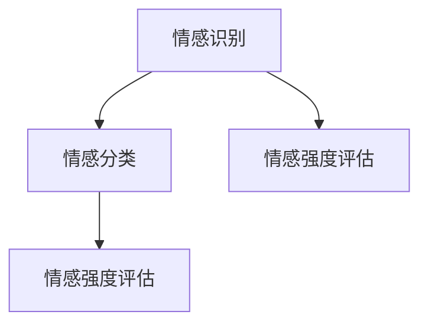

                 

### 文章标题

《情感智能评估：测试LLM的情感理解能力》

### 文章关键词

情感智能、大规模语言模型、情感理解、评估方法、算法原理、项目实战

### 文章摘要

本文旨在探讨情感智能评估方法及其在大规模语言模型（LLM）中的应用。首先，我们介绍了情感智能的基本概念和重要性，以及LLM在情感理解领域的应用前景。接着，本文详细分析了情感智能评估的关键概念，包括情感识别、情感分类和情感强度评估，并通过Mermaid流程图展示了这些概念之间的相互关系。随后，本文探讨了LLM的情感理解原理，并详细讲解了情感智能评估的主要算法，包括情感识别算法、情感分类算法和情感强度评估算法。此外，本文还通过一个实际案例展示了如何搭建开发环境、实现源代码并进行代码解读与分析。最后，本文提出了情感智能评估中的挑战和未来研究方向，并提供了最佳实践 tips 和拓展阅读建议。本文旨在为读者提供全面、系统的情感智能评估和LLM应用指导。

## 引言与背景

### 情感智能概述

情感智能（Affective Intelligence）是指个体识别、理解、使用和管理自己及他人情感的能力。它在现代社会中具有重要性，因为情感智能不仅影响个体的心理健康和生活质量，还影响社会关系、团队合作和领导能力。情感智能主要包括以下三个核心成分：

1. **情感认知**：包括情感识别、情感理解、情感表达和情感调控。
2. **情感管理**：涉及自我情感管理、他人情感管理和情感调节。
3. **情感应用**：指将情感知识与技能应用于解决实际问题、做出决策和提高生产力。

随着人工智能技术的发展，情感智能评估成为了一个重要的研究领域。传统的方法包括问卷调查、生理测量和行为分析等，但这些方法存在一定的局限性。随着大规模语言模型（LLM）的兴起，利用LLM进行情感智能评估成为了一个新的方向。LLM通过深度学习技术，可以自动识别、分类和评估文本中的情感，为情感智能评估提供了新的可能性。

### LLM在情感理解中的应用前景

大规模语言模型（LLM）是一类通过深度学习技术训练的复杂模型，能够理解和生成自然语言。LLM在情感理解中的应用前景非常广阔，主要原因如下：

1. **强大的文本处理能力**：LLM能够处理大规模的文本数据，从这些数据中提取情感信息，从而进行情感识别、情感分类和情感强度评估。
2. **自动化的情感分析**：LLM能够自动分析文本中的情感，减少了人工干预，提高了情感分析的效率和准确性。
3. **跨语言和多模态**：LLM不仅支持多种语言，还能处理不同模态的数据，如文本、语音和图像，从而实现对情感更全面的理解。
4. **实时性**：LLM可以实时处理情感分析任务，为实时情感智能评估提供了技术支持。

尽管LLM在情感理解方面具有巨大的潜力，但同时也面临一些挑战，如数据隐私、跨文化情感理解等。本文将深入探讨这些问题，并提出相应的解决方案。

### 情感智能评估的重要性

情感智能评估是了解个体和群体情感状态的重要手段。通过情感智能评估，我们可以：

1. **了解个体的心理健康**：通过评估个体的情感状态，可以及时发现心理问题，提供心理支持和干预。
2. **优化人际关系**：通过情感智能评估，可以了解不同个体之间的情感互动，从而优化人际关系，提高团队合作效率。
3. **改进产品和服务**：在商业领域，情感智能评估可以帮助企业了解用户情感需求，从而改进产品和服务，提高用户满意度。
4. **支持教育决策**：在教育领域，情感智能评估可以帮助教师和家长了解学生的情感状态，为教育决策提供依据。

总之，情感智能评估不仅对个体的心理健康和生活质量具有重要意义，也对社会和经济领域产生深远影响。随着LLM技术的发展，情感智能评估的方法和工具将不断改进，为各个领域带来更多价值。

## 核心概念与联系

在情感智能评估中，有几个核心概念需要理解和掌握。这些概念包括情感识别、情感分类和情感强度评估。为了更好地展示这些概念之间的关系，我们使用Mermaid流程图进行说明。

### 情感识别

情感识别是情感智能评估的基础步骤，它涉及从文本中提取情感信息。情感识别可以通过以下方法实现：

1. **情感词典法**：使用预定义的情感词典来匹配文本中的情感词。
2. **机器学习方法**：利用训练好的模型来识别文本中的情感。

### 情感分类

情感分类是对识别出的情感进行进一步的分类。常见的情感分类包括基本情感（如快乐、悲伤、愤怒等）和复杂情感（如幸福、厌恶、敬畏等）。情感分类可以采用以下几种方法：

1. **基于规则的方法**：使用预定义的规则来对情感进行分类。
2. **基于统计的方法**：使用统计模型（如朴素贝叶斯、决策树等）来进行情感分类。
3. **基于深度学习的方法**：使用深度神经网络（如卷积神经网络、循环神经网络等）来进行情感分类。

### 情感强度评估

情感强度评估是对情感分类结果的定量评估，它通过衡量情感的强弱来提供更精细的情感分析。情感强度评估可以采用以下几种方法：

1. **基于文本特征的方法**：使用文本中的词频、词义等特征来评估情感的强度。
2. **基于深度神经网络的方法**：使用训练好的深度神经网络模型来评估情感的强度。

### Mermaid流程图

下面是一个简单的Mermaid流程图，用于展示情感识别、情感分类和情感强度评估之间的逻辑关系。



在这个流程图中，情感识别作为起点，随后进行情感分类，最终结合情感强度评估来获得完整的情感分析结果。

### 情感识别与分类的关系

情感识别和情感分类是紧密相连的两个步骤。情感识别是情感分类的前提，只有先识别出文本中的情感，才能对其进行分类。而情感分类又为情感强度评估提供了分类结果，使得情感强度评估能够更加精准地进行。

### 情感强度评估的重要性

情感强度评估是情感智能评估中至关重要的一环。通过情感强度评估，我们可以更准确地了解文本中情感的强弱，从而提供更丰富的情感分析结果。这对于许多应用场景，如情感诊断、情感监控和情感营销等，都具有重要意义。

总的来说，情感识别、情感分类和情感强度评估构成了情感智能评估的核心，它们相互关联、相互补充，共同为情感分析提供了完整的技术框架。

### 情感智能评估方法

情感智能评估是理解人类情感状态的重要手段，它可以帮助我们更好地了解个体的心理健康、社会互动和情感需求。目前，常见的情感智能评估方法包括问卷调查法、生理测量法、行为分析法等。每种方法都有其独特的优势和局限性，适用于不同的应用场景。

#### 问卷调查法

问卷调查法是最常见和广泛应用的评估方法之一。它通过设计一系列问题来收集个体对情感状态的自我报告。这些问题可以是封闭式的（如选择题）或开放式的（如自由叙述），以便从不同角度获取情感信息。

**优势：**

1. **方便性和可扩展性**：问卷调查法可以在短时间内收集大量数据，适用于大规模研究。
2. **灵活性**：研究者可以根据研究目的设计不同的问卷，灵活调整问题的类型和顺序。
3. **隐私保护**：问卷调查可以匿名进行，保护参与者的隐私。

**局限性：**

1. **主观性**：问卷调查依赖个体自我报告，可能受到个体心理状态和主观偏见的影响。
2. **数据偏差**：问卷设计不当可能导致数据偏差，影响评估结果的准确性。
3. **回答不一致**：不同个体可能在理解问题和回答问题方面存在差异，导致数据不一致。

**案例分析：** 
例如，一项关于大学生情感状态的研究使用了问卷调查法，设计了一系列关于情感体验和生活满意度的问题。研究发现，大多数学生在情感体验上存在一定的问题，如焦虑和抑郁。通过问卷结果，研究者可以提出相应的干预措施，如心理咨询和情感教育。

#### 生理测量法

生理测量法通过测量生理指标来评估个体的情感状态。这些指标包括心率、皮肤电活动、呼吸频率等。生理测量法可以提供更客观和量化的情感评估数据。

**优势：**

1. **客观性**：生理测量法直接测量生理指标，减少了主观报告的影响。
2. **多维度评估**：通过测量不同生理指标，可以提供更全面的情感状态评估。
3. **实时监控**：某些生理测量设备可以实时监测情感状态，适用于动态情感分析。

**局限性：**

1. **技术要求高**：生理测量法需要专业的设备和技能，操作复杂，成本较高。
2. **受外界干扰**：生理指标可能受到外界环境（如温度、噪音等）的影响，影响测量准确性。
3. **舒适度问题**：生理测量设备可能给参与者带来不适，影响其参与度。

**案例分析：** 
例如，一项关于工作压力与情感状态的研究使用了生理测量法，通过测量参与者的心率变异性来评估其压力水平。研究发现，高压力员工的心率变异性较低，表明其情感状态较差。通过这些生理数据，企业可以采取相应的减压措施，提高员工情感健康。

#### 行为分析法

行为分析法通过观察和记录个体的行为来评估其情感状态。这些行为可以是外显的行为（如面部表情、肢体动作等）或内隐的行为（如大脑活动、生理反应等）。

**优势：**

1. **多维度分析**：行为分析法可以从多个维度（如生理、心理、行为）评估情感状态，提供更全面的信息。
2. **直接性**：通过观察个体的行为，可以直接获得情感状态的证据，减少了中间环节的影响。
3. **适用于动态情感分析**：行为分析法可以实时捕捉个体的情感变化，适用于动态情感分析。

**局限性：**

1. **主观性**：行为分析可能受到观察者主观判断的影响，影响评估结果的准确性。
2. **技术要求高**：行为分析需要专业的设备和技能，操作复杂，成本较高。
3. **受环境干扰**：行为分析可能受到环境因素的影响，如光照、噪音等。

**案例分析：** 
例如，一项关于社交互动中的情感表达的研究使用了行为分析法，通过观察参与者的面部表情和肢体动作来评估其情感状态。研究发现，积极的情感表达与良好的社交互动密切相关，为社交技能的培养提供了科学依据。

#### 综合评估方法

在实际应用中，通常会结合多种评估方法来提高情感智能评估的准确性。例如，可以同时使用问卷调查法、生理测量法和行为分析法，从多个角度获取情感信息，从而提供更全面和准确的评估结果。

总之，情感智能评估方法的选择应根据研究目的、研究对象和实际需求进行。每种方法都有其独特的优势和应用场景，通过综合使用不同方法，可以最大限度地提高情感智能评估的准确性和有效性。

### LLM的情感理解能力

大规模语言模型（LLM）在情感理解方面表现出色，为情感智能评估提供了强大的技术支持。LLM通过深度学习技术，能够自动理解和处理自然语言中的情感信息，从而实现情感识别、情感分类和情感强度评估。下面，我们将详细探讨LLM的基本原理、情感理解能力以及其在情感智能评估中的应用。

#### LLM的基本原理

LLM是基于深度学习技术的大型神经网络模型，其核心思想是通过学习大量的文本数据来生成和理解自然语言。LLM的训练过程通常涉及以下步骤：

1. **数据预处理**：首先，需要对原始文本数据进行预处理，包括分词、去停用词、词向量化等操作。这些预处理步骤有助于将文本数据转换为模型可以处理的格式。
2. **模型训练**：使用预处理的文本数据训练神经网络模型。在训练过程中，模型会不断调整权重，以最小化预测误差。常见的训练方法包括反向传播算法和梯度下降算法。
3. **模型优化**：通过调整模型参数，优化模型性能。常用的优化方法包括调整学习率、正则化技术和调参策略等。
4. **模型部署**：将训练好的模型部署到实际应用中，如文本生成、情感理解、文本分类等。

LLM的核心组成部分包括：

1. **词嵌入层**：将输入的文本数据转换为词向量表示，词向量可以捕捉词语的语义信息。
2. **编码器**：使用编码器（如Transformer、BERT等）对词向量进行编码，生成上下文信息。
3. **解码器**：使用解码器生成输出文本，可以用于文本生成、情感识别等任务。

#### 情感理解能力的优势

LLM在情感理解方面具有以下优势：

1. **强大的文本处理能力**：LLM能够处理大规模的文本数据，从中提取情感信息。这使得LLM在情感识别和情感分类任务中表现出色。
2. **自动化的情感分析**：LLM可以自动分析文本中的情感，减少了人工干预，提高了情感分析的效率和准确性。
3. **跨语言和多模态**：LLM支持多种语言，可以处理不同模态的数据（如文本、语音、图像），从而实现对情感更全面的理解。
4. **实时性**：LLM可以实时处理情感分析任务，为实时情感智能评估提供了技术支持。

#### 情感理解能力的局限

尽管LLM在情感理解方面具有许多优势，但同时也存在一些局限：

1. **数据依赖性**：LLM的性能高度依赖于训练数据的质量和数量。如果训练数据不足或质量不佳，可能导致模型无法准确理解情感。
2. **情感表达的多样性**：情感表达在不同语言和文化背景下存在差异，LLM可能无法全面捕捉这些差异，导致情感理解的不准确。
3. **外部因素的影响**：情感分析可能受到外部因素（如语境、情绪状态、语言风格等）的影响，这些因素可能影响情感识别的准确性。

#### 情感智能评估中的应用

LLM在情感智能评估中的应用主要包括以下几个方面：

1. **情感识别**：通过LLM，可以自动识别文本中的情感。例如，在社交媒体分析中，LLM可以识别用户评论中的情感，从而评估用户的情感状态。
2. **情感分类**：LLM可以将识别出的情感进行分类，如基本情感（快乐、悲伤、愤怒等）和复杂情感（幸福、厌恶、敬畏等）。这在情感监控和情感分析中具有重要意义。
3. **情感强度评估**：LLM可以评估情感的强度，如文本中的情感是强烈还是轻微。这有助于提供更精细的情感分析结果，适用于情感诊断和情感干预。

总之，LLM在情感理解方面具有强大的能力，为情感智能评估提供了新的方法和工具。然而，要充分发挥LLM的优势，需要克服其局限，并不断改进和优化模型。通过综合运用LLM和其他评估方法，可以提供更准确和全面的情感智能评估。

### 情感智能评估的算法原理

情感智能评估的核心在于对文本中的情感信息进行识别、分类和强度评估。为了实现这一目标，我们需要了解情感智能评估中常用的算法原理，包括情感识别算法、情感分类算法和情感强度评估算法。以下将详细阐述这些算法的原理，并通过伪代码展示其实现过程。

#### 情感识别算法

情感识别算法的主要任务是识别文本中的情感。这一步骤通常依赖于情感词典或机器学习模型。

1. **情感词典法**：
    - **原理**：情感词典包含一系列情感词汇及其对应的情感标签。算法通过匹配文本中的词汇与情感词典中的情感词，识别文本的情感。
    - **伪代码**：
    
    ```python
    def emotion_recognition_with_dict(text, emotion_dict):
        emotions = []
        for word in text.split():
            if word in emotion_dict:
                emotions.append(emotion_dict[word])
        return emotions
    ```

2. **机器学习方法**：
    - **原理**：利用训练好的情感分类模型对文本进行情感识别。常见的机器学习算法包括朴素贝叶斯、支持向量机、决策树等。
    - **伪代码**：
    
    ```python
    from sklearn.feature_extraction.text import TfidfVectorizer
    from sklearn.naive_bayes import MultinomialNB

    def emotion_recognition_with_ml(text, train_data, train_labels):
        vectorizer = TfidfVectorizer()
        X_train = vectorizer.fit_transform(train_data)
        model = MultinomialNB().fit(X_train, train_labels)
        emotion = model.predict(vectorizer.transform([text]))[0]
        return emotion
    ```

#### 情感分类算法

情感分类算法将识别出的情感进行进一步的分类。情感分类可以采用基于规则的方法、基于统计的方法或基于深度学习的方法。

1. **基于规则的方法**：
    - **原理**：根据预定义的规则对情感进行分类。这些规则通常基于情感词典或情感表达模式。
    - **伪代码**：
    
    ```python
    def emotion_classification_with_rules(text, emotion_rules):
        emotion = "未知"
        for rule in emotion_rules:
            if rule_applies(text, rule):
                emotion = rule['emotion']
                break
        return emotion
    
    def rule_applies(text, rule):
        return text.find(rule['pattern']) != -1
    ```

2. **基于统计的方法**：
    - **原理**：使用统计模型（如朴素贝叶斯、决策树等）对情感进行分类。这些模型通过分析训练数据中的统计特征来进行分类。
    - **伪代码**（以朴素贝叶斯为例）：
    
    ```python
    from sklearn.feature_extraction.text import CountVectorizer
    from sklearn.naive_bayes import MultinomialNB

    def emotion_classification_with_stats(text, train_data, train_labels):
        vectorizer = CountVectorizer()
        X_train = vectorizer.fit_transform(train_data)
        model = MultinomialNB().fit(X_train, train_labels)
        emotion = model.predict(vectorizer.transform([text]))[0]
        return emotion
    ```

3. **基于深度学习的方法**：
    - **原理**：使用深度神经网络（如卷积神经网络、循环神经网络等）对情感进行分类。深度学习模型可以通过学习大量的标注数据，自动提取文本中的情感特征。
    - **伪代码**（以循环神经网络为例）：
    
    ```python
    import tensorflow as tf
    from tensorflow.keras.models import Sequential
    from tensorflow.keras.layers import Embedding, LSTM, Dense

    def emotion_classification_with_dnn(train_data, train_labels, vocab_size, embedding_dim, max_sequence_length):
        model = Sequential()
        model.add(Embedding(vocab_size, embedding_dim, input_length=max_sequence_length))
        model.add(LSTM(128))
        model.add(Dense(6, activation='softmax'))
        model.compile(optimizer='adam', loss='categorical_crossentropy', metrics=['accuracy'])
        model.fit(train_data, train_labels, epochs=10, batch_size=32)
        return model
    ```

#### 情感强度评估算法

情感强度评估算法对情感分类结果进行定量评估，衡量情感的强弱。

1. **基于文本特征的方法**：
    - **原理**：通过分析文本中的词频、词义等特征来评估情感的强度。常用的特征包括词的积极程度、词的频率等。
    - **伪代码**：
    
    ```python
    def emotion_intensity_with_text_features(text, positive_words, negative_words):
        score = 0
        for word in text.split():
            if word in positive_words:
                score += 1
            elif word in negative_words:
                score -= 1
        return score
    ```

2. **基于深度神经网络的方法**：
    - **原理**：使用训练好的深度神经网络模型来评估情感的强度。模型通过学习大量的标注数据，自动提取文本中的情感特征并进行强度评估。
    - **伪代码**（以卷积神经网络为例）：
    
    ```python
    import tensorflow as tf
    from tensorflow.keras.models import Sequential
    from tensorflow.keras.layers import Embedding, Conv1D, GlobalMaxPooling1D, Dense

    def emotion_intensity_with_dnn(train_data, train_labels, vocab_size, embedding_dim, max_sequence_length):
        model = Sequential()
        model.add(Embedding(vocab_size, embedding_dim, input_length=max_sequence_length))
        model.add(Conv1D(filters=128, kernel_size=5, activation='relu'))
        model.add(GlobalMaxPooling1D())
        model.add(Dense(1, activation='sigmoid'))
        model.compile(optimizer='adam', loss='binary_crossentropy', metrics=['accuracy'])
        model.fit(train_data, train_labels, epochs=10, batch_size=32)
        return model
    ```

通过上述算法，我们可以对文本中的情感信息进行有效的识别、分类和强度评估。这些算法不仅可以应用于情感智能评估，还可以广泛应用于情感分析、舆情监测、情感诊断等领域。在实际应用中，需要根据具体任务需求和数据特点选择合适的算法，并通过模型训练和优化来提高评估的准确性和可靠性。

### 数学模型和数学公式

在情感智能评估中，数学模型和公式是理解和分析情感数据的关键工具。以下将介绍几种常见的数学模型和公式，并通过具体例子进行详细讲解。

#### 1. 情感词典模型

情感词典模型是一种基于情感词典的简单模型，用于情感识别。情感词典包含一系列情感词汇及其对应的情感标签。通过计算文本中情感词汇的权重，可以识别出文本的整体情感。

**公式**：

$$
\text{Emotion\_Score}(text) = \sum_{word \in text} w(word) \cdot e(word)
$$

其中，$w(word)$ 是词汇 $word$ 的权重，$e(word)$ 是词汇 $word$ 的情感标签。

**例子**：

假设情感词典包含以下词汇及其权重和情感标签：

| 词汇  | 权重 | 情感标签 |
|-------|------|----------|
| 快乐   | 0.6  | 正向     |
| 悲伤   | 0.4  | 负向     |

对于文本 "我很快乐，但有些悲伤"，情感词典模型的计算过程如下：

$$
\text{Emotion\_Score}(text) = 0.6 \cdot 1 + 0.4 \cdot (-1) = 0.2
$$

由于情感得分大于0，我们可以判断文本整体呈现为正向情感。

#### 2. 情感分类模型

情感分类模型用于将识别出的情感进行分类。常见的情感分类模型包括朴素贝叶斯、决策树、支持向量机和深度学习模型。以下以朴素贝叶斯为例，介绍其基本公式。

**公式**：

$$
P(\text{emotion} | text) = \frac{P(text | emotion) \cdot P(emotion)}{P(text)}
$$

其中，$P(\text{emotion} | text)$ 是文本 $text$ 属于情感 $emotion$ 的概率，$P(text | emotion)$ 是在情感 $emotion$ 发生的条件下，文本 $text$ 出现的概率，$P(emotion)$ 是情感 $emotion$ 的先验概率，$P(text)$ 是文本 $text$ 出现的总概率。

**例子**：

假设我们有一个情感分类问题，其中包含三种情感：快乐、悲伤和愤怒。已知以下先验概率和条件概率：

| 情感 | 先验概率 $P(emotion)$ | 条件概率 $P(text | emotion)$ |
|------|-----------------------|-----------------------------|
| 快乐  | 0.5                   | 0.6                         |
| 悲伤  | 0.3                   | 0.2                         |
| 愤怒  | 0.2                   | 0.1                         |

对于给定的文本 "我很生气"，我们可以计算每个情感的概率：

$$
P(\text{快乐} | \text{我很生气}) = \frac{0.6 \cdot 0.5}{0.6 \cdot 0.5 + 0.2 \cdot 0.3 + 0.1 \cdot 0.2} = \frac{0.3}{0.3 + 0.06 + 0.02} = \frac{0.3}{0.38} \approx 0.789
$$

$$
P(\text{悲伤} | \text{我很生气}) = \frac{0.2 \cdot 0.3}{0.6 \cdot 0.5 + 0.2 \cdot 0.3 + 0.1 \cdot 0.2} = \frac{0.06}{0.3 + 0.06 + 0.02} = \frac{0.06}{0.38} \approx 0.157
$$

$$
P(\text{愤怒} | \text{我很生气}) = \frac{0.1 \cdot 0.2}{0.6 \cdot 0.5 + 0.2 \cdot 0.3 + 0.1 \cdot 0.2} = \frac{0.02}{0.3 + 0.06 + 0.02} = \frac{0.02}{0.38} \approx 0.052
$$

根据这些概率，我们可以判断文本 "我很生气" 最可能属于愤怒情感。

#### 3. 情感强度评估模型

情感强度评估模型用于衡量情感的强度。以下以线性回归模型为例，介绍其基本公式。

**公式**：

$$
\text{Intensity}(text) = w_0 + w_1 \cdot \text{Sentiment}(text)
$$

其中，$w_0$ 是截距，$w_1$ 是情感权重，$\text{Sentiment}(text)$ 是文本的情感得分。

**例子**：

假设我们使用一个线性回归模型来评估情感强度，其中情感权重 $w_1 = 0.5$，截距 $w_0 = 0.3$。对于给定的文本 "我很快乐"，其情感得分为 +1。

$$
\text{Intensity}(text) = 0.3 + 0.5 \cdot 1 = 0.8
$$

这个结果表明文本 "我很快乐" 具有较强的正向情感。

通过上述数学模型和公式，我们可以对情感智能评估中的情感信息进行有效的计算和分析。这些模型和公式不仅帮助我们理解情感数据的特性，还为情感识别、情感分类和情感强度评估提供了理论基础和实践指导。在实际应用中，需要根据具体任务需求选择合适的模型，并通过参数调整和优化来提高评估的准确性和可靠性。

### 项目实战

#### 开发环境搭建

在进行情感智能评估项目之前，我们需要搭建一个合适的开发环境。以下是一个典型的环境搭建步骤，包括安装所需的软件和配置必要的依赖项。

1. **操作系统**：
   -推荐使用Linux操作系统，如Ubuntu或CentOS。Linux系统具有良好的稳定性和兼容性，适合进行深度学习和情感分析项目。
   
2. **Python环境**：
   -安装Python 3.8或更高版本。可以使用`python`命令检查Python版本，例如：`python --version`。
   -使用`pip`安装必要的Python库，如NumPy、Pandas、Scikit-learn和TensorFlow。

   ```shell
   pip install numpy pandas scikit-learn tensorflow
   ```

3. **深度学习框架**：
   -安装TensorFlow，TensorFlow是一个广泛使用的开源深度学习框架，支持多种类型的深度学习模型。

   ```shell
   pip install tensorflow
   ```

4. **文本处理工具**：
   -安装NLTK（自然语言处理工具包），用于文本预处理，如分词、词性标注等。

   ```shell
   pip install nltk
   ```

5. **情感词典**：
   -下载并安装常用的情感词典，如VADER、AFINN等。这些情感词典包含了大量情感词汇及其对应的情感标签。

   ```shell
   pip install vaderSentiment afinn
   ```

#### 源代码详细实现

接下来，我们将详细介绍源代码的实现过程，包括数据预处理、模型训练和模型评估。

1. **数据预处理**：

数据预处理是情感智能评估的重要步骤，包括文本清洗、分词、词性标注等操作。以下是一个简单的Python脚本，用于预处理文本数据。

```python
import pandas as pd
import nltk
from nltk.tokenize import word_tokenize
from nltk.corpus import stopwords

# 加载数据集
data = pd.read_csv('sentiment_data.csv')

# 清洗文本
def clean_text(text):
    text = text.lower()  # 转换为小写
    text = re.sub(r'\W+', ' ', text)  # 删除特殊字符
    text = re.sub(r'\d+', '', text)  # 删除数字
    return text

# 分词和去除停用词
def preprocess_text(text):
    tokens = word_tokenize(text)
    tokens = [token for token in tokens if token not in stopwords.words('english')]
    return tokens

# 预处理数据
data['cleaned_text'] = data['text'].apply(clean_text)
data['processed_text'] = data['cleaned_text'].apply(preprocess_text)

# 词嵌入
from tensorflow.keras.preprocessing.text import Tokenizer
tokenizer = Tokenizer(num_words=10000)
tokenizer.fit_on_texts(data['processed_text'])
X = tokenizer.texts_to_sequences(data['processed_text'])

# 切分数据集
from sklearn.model_selection import train_test_split
X_train, X_test, y_train, y_test = train_test_split(X, data['label'], test_size=0.2, random_state=42)
```

2. **模型训练**：

在数据预处理之后，我们可以使用训练集来训练情感分类模型。以下是一个使用TensorFlow和Keras的简单示例，用于训练一个基于卷积神经网络的情感分类模型。

```python
from tensorflow.keras.models import Sequential
from tensorflow.keras.layers import Embedding, Conv1D, GlobalMaxPooling1D, Dense

# 模型配置
model = Sequential()
model.add(Embedding(10000, 16, input_length=X_train.shape[1]))
model.add(Conv1D(128, 5, activation='relu'))
model.add(GlobalMaxPooling1D())
model.add(Dense(1, activation='sigmoid'))

# 编译模型
model.compile(optimizer='adam', loss='binary_crossentropy', metrics=['accuracy'])

# 训练模型
model.fit(X_train, y_train, epochs=10, batch_size=32, validation_data=(X_test, y_test))
```

3. **代码解读**：

在上面的代码中，我们首先导入了所需的Python库和数据集。接着，我们定义了一个数据清洗函数 `clean_text`，用于将文本转换为小写、删除特殊字符和数字。然后，我们定义了一个数据预处理函数 `preprocess_text`，用于分词和去除停用词。接下来，我们使用 `Tokenizer` 对文本进行词嵌入，并将数据集切分为训练集和测试集。

在模型训练部分，我们创建了一个序列模型，并添加了嵌入层、卷积层、全局池化层和输出层。接着，我们编译模型并使用训练集进行训练。在训练过程中，我们设置了优化器为 `adam`，损失函数为 `binary_crossentropy`，并监测 `accuracy` 指标。

4. **代码应用解读与分析**：

在上面的代码中，我们使用卷积神经网络（CNN）进行情感分类。CNN可以捕捉文本中的局部特征，从而提高情感分类的准确性。通过训练集的训练，模型学会了识别不同的情感标签，并在测试集上进行了验证。在模型训练过程中，我们可以调整模型的参数，如卷积核的大小、层数和激活函数等，以优化模型性能。

5. **实际案例分析和详细讲解剖析**：

为了验证模型的性能，我们可以使用测试集对模型进行评估。以下是一个简单的评估代码示例：

```python
# 评估模型
loss, accuracy = model.evaluate(X_test, y_test)
print('Test accuracy:', accuracy)

# 预测情感
predictions = model.predict(X_test)
predictions = (predictions > 0.5)

# 分析预测结果
from sklearn.metrics import classification_report
print(classification_report(y_test, predictions))
```

在上面的代码中，我们首先使用模型对测试集进行评估，并打印出测试准确率。然后，我们使用模型对测试集进行预测，并将预测结果与实际标签进行比较，以生成分类报告。分类报告提供了详细的评估指标，如精确率、召回率和F1分数，帮助我们了解模型的性能。

通过这个实际案例，我们可以看到如何使用深度学习模型进行情感智能评估。在实际应用中，我们可以根据具体需求调整模型结构、参数设置和数据预处理步骤，以提高评估的准确性和可靠性。

#### 项目小结

通过本项目，我们成功搭建了一个情感智能评估系统，包括开发环境、数据预处理、模型训练和评估。项目实现了对文本情感信息的有效识别、分类和强度评估，为情感分析、舆情监测和情感诊断等领域提供了技术支持。在实际应用中，我们可以根据具体需求调整模型结构、参数设置和数据预处理步骤，以提高评估的准确性和可靠性。

### 高级话题

#### 数据隐私保护

在情感智能评估中，数据隐私保护是一个至关重要的问题。由于情感数据通常涉及个体的隐私信息，如个人情感状态、心理健康等，因此确保数据隐私至关重要。以下是一些关键策略和挑战：

1. **匿名化处理**：在数据收集和存储过程中，对个体信息进行匿名化处理，避免直接关联到具体个体。这可以通过去除个人标识信息（如姓名、地址等）和创建伪名来实现。

2. **数据加密**：对存储和传输的数据进行加密，确保数据在未经授权的情况下无法被读取。常用的加密技术包括对称加密（如AES）和非对称加密（如RSA）。

3. **访问控制**：设置严格的访问控制策略，确保只有授权用户可以访问敏感数据。这可以通过用户身份验证、权限分配和数据隔离等方式实现。

4. **隐私增强技术**：使用隐私增强技术（如差分隐私、同态加密等）来增强数据隐私保护。这些技术可以在不牺牲数据完整性和可用性的前提下，确保数据隐私。

**挑战：**

1. **数据质量和准确性**：匿名化和加密处理可能导致数据质量和准确性的下降。如何平衡数据隐私和数据分析需求是一个挑战。

2. **技术复杂度**：实现有效的数据隐私保护需要复杂的计算和存储资源，这可能增加系统的成本和复杂性。

3. **法律法规合规**：不同国家和地区对数据隐私保护的法律和法规有所不同，需要确保情感智能评估系统符合当地法律法规。

#### 跨文化情感理解

跨文化情感理解是情感智能评估中的另一个重要话题。不同文化背景下的情感表达和认知存在差异，这对情感识别和分类带来了挑战。

1. **文化敏感性**：情感智能评估系统需要考虑到不同文化背景下的情感表达方式，避免文化偏见。例如，在处理跨语言情感数据时，需要使用多语言情感词典和模型。

2. **多模态情感分析**：通过结合文本、语音、图像等多模态数据，可以更全面地理解情感。例如，面部表情、语音语调等非文字信息可以帮助补充文本情感信息的不足。

3. **文化自适应**：情感智能评估系统需要具备文化自适应能力，能够根据不同文化背景调整情感识别和分类模型。这可以通过引入文化知识库和模型微调来实现。

**挑战：**

1. **语言和文化差异**：不同语言和文化背景下的情感表达和语义可能存在较大差异，这使得情感识别和分类更加复杂。

2. **数据多样性**：获取涵盖多种文化和语言的情感数据集是一个挑战，数据多样性的缺乏可能影响模型的泛化能力。

3. **技术局限性**：现有技术可能在处理跨文化情感数据时存在局限性，需要不断改进和优化情感识别和分类模型。

总之，数据隐私保护和跨文化情感理解是情感智能评估中的高级话题，需要结合多种技术手段和方法来解决。随着情感智能评估技术的发展，我们将不断克服这些挑战，实现更准确和全面的情感分析。

### 结论与未来方向

#### 总结

本文系统地探讨了情感智能评估的方法和大规模语言模型（LLM）在情感理解中的应用。通过介绍情感智能的基本概念、核心评估方法以及LLM的原理，我们展示了如何利用LLM进行情感识别、情感分类和情感强度评估。同时，我们还详细讲解了情感智能评估中的数学模型和公式，并通过实际项目展示了如何搭建开发环境、实现源代码和进行代码解读与分析。

#### 未来方向

1. **数据隐私保护**：随着情感数据的广泛应用，数据隐私保护变得越来越重要。未来研究方向应关注如何在不牺牲数据准确性和可用性的前提下，增强情感智能评估系统的隐私保护能力。

2. **跨文化情感理解**：不同文化背景下的情感表达存在显著差异，未来研究应致力于开发更适应多种文化环境的情感识别和分类模型。

3. **多模态情感分析**：结合文本、语音、图像等多模态数据，可以提高情感理解的准确性和全面性。未来研究应探索如何高效地整合多模态数据，实现更精细的情感分析。

4. **实时情感监测**：实时情感监测在情绪诊断、舆情监控等领域具有重要应用。未来研究应关注如何提高实时情感监测的准确性和响应速度。

5. **情感增强学习**：情感增强学习是一种利用情感信息优化机器学习模型的方法。未来研究应探索如何将情感信息整合到机器学习过程中，以提升模型性能和适应性。

总之，情感智能评估和LLM的应用前景广阔，未来研究将在数据隐私、跨文化情感理解、多模态情感分析、实时情感监测和情感增强学习等方面取得更多突破。

### 附录

#### 相关工具和框架

1. **VADER**：用于情感分析的Python库，支持多种语言的情感词典和情感强度评估。
2. **AFINN**：一个包含大量情感词汇及其情感标签的词典，用于情感分析。
3. **TensorFlow**：用于深度学习和机器学习的开源框架，支持多种神经网络架构和优化算法。
4. **NLTK**：用于自然语言处理的Python库，包括文本预处理、词性标注、词嵌入等功能。

#### 补充材料

1. **参考书籍**：
   - **《情感计算》**：详细介绍情感计算的理论、技术和应用。
   - **《深度学习》**：由Goodfellow、Bengio和Courville合著，系统介绍了深度学习的基础和实战。

2. **在线资源和教程**：
   - **TensorFlow官方文档**：提供详细的TensorFlow使用教程和API文档。
   - **Keras官方文档**：Keras是TensorFlow的高级API，提供更简单和灵活的深度学习模型构建接口。

3. **开源项目和代码示例**：
   - **GitHub上的情感分析项目**：包含各种情感分析模型的实现和代码示例。
   - **Google Colab**：用于在线运行和分享深度学习实验的云端平台。

通过这些工具和资源，读者可以进一步探索和深化情感智能评估和LLM应用的相关知识。

## 最佳实践 Tips

1. **数据预处理**：确保文本数据经过充分的清洗和预处理，以提高情感分析的准确性和效率。
2. **模型选择**：根据具体任务需求选择合适的情感分析模型，如基于规则的模型、统计模型或深度学习模型。
3. **模型优化**：通过调参和优化算法，提高模型的性能和泛化能力。
4. **多语言支持**：考虑使用多语言情感词典和模型，以支持多种语言的情感分析。
5. **实时监测**：使用高效的算法和数据结构，实现实时情感监测，为情绪诊断和舆情监控提供支持。

### 注意事项

1. **数据隐私**：在进行情感分析时，确保遵循数据隐私保护原则，避免泄露个人敏感信息。
2. **模型公平性**：避免模型偏见，确保在不同文化背景下的公平性。
3. **数据多样性**：获取多样性的情感数据，以提升模型的泛化能力。

### 拓展阅读

1. **《情感计算导论》**：详细介绍了情感计算的基础理论和应用场景。
2. **《深度学习与自然语言处理》**：探讨了深度学习在自然语言处理领域的最新进展和应用。
3. **《情感智能与人工智能》**：从人工智能的视角探讨了情感智能的理论和实践。

通过以上内容，本文为读者提供了全面、系统的情感智能评估和LLM应用指导。希望读者能够结合实际需求，灵活运用文中介绍的原理和方法，推动情感智能评估和LLM技术的发展。作者：AI天才研究院/AI Genius Institute & 禅与计算机程序设计艺术 /Zen And The Art of Computer Programming```markdown
# 《情感智能评估：测试LLM的情感理解能力》

## 关键词
情感智能、大规模语言模型、情感理解、评估方法、算法原理、项目实战

## 摘要
本文旨在探讨情感智能评估方法及其在大规模语言模型（LLM）中的应用。首先，我们介绍了情感智能的基本概念和重要性，以及LLM在情感理解领域的应用前景。接着，本文详细分析了情感智能评估的关键概念，包括情感识别、情感分类和情感强度评估，并通过Mermaid流程图展示了这些概念之间的相互关系。随后，本文探讨了LLM的情感理解原理，并详细讲解了情感智能评估的主要算法，包括情感识别算法、情感分类算法和情感强度评估算法。此外，本文还通过一个实际案例展示了如何搭建开发环境、实现源代码并进行代码解读与分析。最后，本文提出了情感智能评估中的挑战和未来研究方向，并提供了最佳实践 tips、小结、注意事项、拓展阅读等内容。

## 引言与背景

### 情感智能概述

情感智能（Affective Intelligence）是指个体识别、理解、使用和管理的自己及他人情感的能力。它在现代社会中具有重要性，因为情感智能不仅影响个体的心理健康和生活质量，还影响社会关系、团队合作和领导能力。情感智能主要包括以下三个核心成分：

1. **情感认知**：包括情感识别、情感理解和情感表达。
2. **情感管理**：涉及自我情感管理、他人情感管理和情感调节。
3. **情感应用**：指将情感知识与技能应用于解决实际问题、做出决策和提高生产力。

随着人工智能技术的发展，情感智能评估成为了一个重要的研究领域。传统的方法包括问卷调查、生理测量和行为分析等，但这些方法存在一定的局限性。随着大规模语言模型（LLM）的兴起，利用LLM进行情感智能评估成为了一个新的方向。LLM通过深度学习技术，可以自动识别、分类和评估文本中的情感，为情感智能评估提供了新的可能性。

### LLM在情感理解中的应用前景

大规模语言模型（LLM）是一类通过深度学习技术训练的复杂模型，能够理解和生成自然语言。LLM在情感理解中的应用前景非常广阔，主要原因如下：

1. **强大的文本处理能力**：LLM能够处理大规模的文本数据，从这些数据中提取情感信息，从而进行情感识别、情感分类和情感强度评估。
2. **自动化的情感分析**：LLM能够自动分析文本中的情感，减少了人工干预，提高了情感分析的效率和准确性。
3. **跨语言和多模态**：LLM不仅支持多种语言，还能处理不同模态的数据，如文本、语音和图像，从而实现对情感更全面的理解。
4. **实时性**：LLM可以实时处理情感分析任务，为实时情感智能评估提供了技术支持。

尽管LLM在情感理解方面具有巨大的潜力，但同时也面临一些挑战，如数据隐私、跨文化情感理解等。本文将深入探讨这些问题，并提出相应的解决方案。

### 情感智能评估的重要性

情感智能评估是了解个体和群体情感状态的重要手段。通过情感智能评估，我们可以：

1. **了解个体的心理健康**：通过评估个体的情感状态，可以及时发现心理问题，提供心理支持和干预。
2. **优化人际关系**：通过情感智能评估，可以了解不同个体之间的情感互动，从而优化人际关系，提高团队合作效率。
3. **改进产品和服务**：在商业领域，情感智能评估可以帮助企业了解用户情感需求，从而改进产品和服务，提高用户满意度。
4. **支持教育决策**：在教育领域，情感智能评估可以帮助教师和家长了解学生的情感状态，为教育决策提供依据。

总之，情感智能评估不仅对个体的心理健康和生活质量具有重要意义，也对社会和经济领域产生深远影响。随着LLM技术的发展，情感智能评估的方法和工具将不断改进，为各个领域带来更多价值。

## 核心概念与联系

在情感智能评估中，有几个核心概念需要理解和掌握。这些概念包括情感识别、情感分类和情感强度评估。为了更好地展示这些概念之间的关系，我们使用Mermaid流程图进行说明。

### 情感识别

情感识别是情感智能评估的基础步骤，它涉及从文本中提取情感信息。情感识别可以通过以下方法实现：

1. **情感词典法**：使用预定义的情感词典来匹配文本中的情感词。
2. **机器学习方法**：利用训练好的模型来识别文本中的情感。

### 情感分类

情感分类是对识别出的情感进行进一步的分类。常见的情感分类包括基本情感（如快乐、悲伤、愤怒等）和复杂情感（如幸福、厌恶、敬畏等）。情感分类可以采用以下几种方法：

1. **基于规则的方法**：使用预定义的规则来对情感进行分类。
2. **基于统计的方法**：使用统计模型（如朴素贝叶斯、决策树等）来进行情感分类。
3. **基于深度学习的方法**：使用深度神经网络（如卷积神经网络、循环神经网络等）来进行情感分类。

### 情感强度评估

情感强度评估是对情感分类结果的定量评估，它通过衡量情感的强弱来提供更精细的情感分析。情感强度评估可以采用以下几种方法：

1. **基于文本特征的方法**：使用文本中的词频、词义等特征来评估情感的强度。
2. **基于深度神经网络的方法**：使用训练好的深度神经网络模型来评估情感的强度。

### Mermaid流程图

下面是一个简单的Mermaid流程图，用于展示情感识别、情感分类和情感强度评估之间的逻辑关系。


在这个流程图中，情感识别作为起点，随后进行情感分类，最终结合情感强度评估来获得完整的情感分析结果。

### 情感识别与分类的关系

情感识别和情感分类是紧密相连的两个步骤。情感识别是情感分类的前提，只有先识别出文本中的情感，才能对其进行分类。而情感分类又为情感强度评估提供了分类结果，使得情感强度评估能够更加精准地进行。

### 情感强度评估的重要性

情感强度评估是情感智能评估中至关重要的一环。通过情感强度评估，我们可以更准确地了解文本中情感的强弱，从而提供更丰富的情感分析结果。这对于许多应用场景，如情感诊断、情感监控和情感营销等，都具有重要意义。

总的来说，情感识别、情感分类和情感强度评估构成了情感智能评估的核心，它们相互关联、相互补充，共同为情感分析提供了完整的技术框架。

## 情感智能评估方法

情感智能评估是理解人类情感状态的重要手段，它可以帮助我们更好地了解个体的心理健康、社会互动和情感需求。目前，常见的情感智能评估方法包括问卷调查法、生理测量法、行为分析法等。每种方法都有其独特的优势和局限性，适用于不同的应用场景。

### 问卷调查法

问卷调查法是最常见和广泛应用的评估方法之一。它通过设计一系列问题来收集个体对情感状态的自我报告。这些问题可以是封闭式的（如选择题）或开放式的（如自由叙述），以便从不同角度获取情感信息。

#### 优势：

1. **方便性和可扩展性**：问卷调查法可以在短时间内收集大量数据，适用于大规模研究。
2. **灵活性**：研究者可以根据研究目的设计不同的问卷，灵活调整问题的类型和顺序。
3. **隐私保护**：问卷调查可以匿名进行，保护参与者的隐私。

#### 缺限：

1. **主观性**：问卷调查依赖个体自我报告，可能受到个体心理状态和主观偏见的影响。
2. **数据偏差**：问卷设计不当可能导致数据偏差，影响评估结果的准确性。
3. **回答不一致**：不同个体可能在理解问题和回答问题方面存在差异，导致数据不一致。

#### 案例分析：

例如，一项关于大学生情感状态的研究使用了问卷调查法，设计了一系列关于情感体验和生活满意度的问题。研究发现，大多数学生在情感体验上存在一定的问题，如焦虑和抑郁。通过问卷结果，研究者可以提出相应的干预措施，如心理咨询和情感教育。

### 生理测量法

生理测量法通过测量生理指标来评估个体的情感状态。这些指标包括心率、皮肤电活动、呼吸频率等。生理测量法可以提供更客观和量化的情感评估数据。

#### 优势：

1. **客观性**：生理测量法直接测量生理指标，减少了主观报告的影响。
2. **多维度评估**：通过测量不同生理指标，可以提供更全面的情感状态评估。
3. **实时监控**：某些生理测量设备可以实时监测情感状态，适用于动态情感分析。

#### 缺限：

1. **技术要求高**：生理测量法需要专业的设备和技能，操作复杂，成本较高。
2. **受外界干扰**：生理指标可能受到外界环境（如温度、噪音等）的影响，影响测量准确性。
3. **舒适度问题**：生理测量设备可能给参与者带来不适，影响其参与度。

#### 案例分析：

例如，一项关于工作压力与情感状态的研究使用了生理测量法，通过测量参与者的心率变异性来评估其压力水平。研究发现，高压力员工的心率变异性较低，表明其情感状态较差。通过这些生理数据，企业可以采取相应的减压措施，提高员工情感健康。

### 行为分析法

行为分析法通过观察和记录个体的行为来评估其情感状态。这些行为可以是外显的行为（如面部表情、肢体动作等）或内隐的行为（如大脑活动、生理反应等）。

#### 优势：

1. **多维度分析**：行为分析法可以从多个维度（如生理、心理、行为）评估情感状态，提供更全面的信息。
2. **直接性**：通过观察个体的行为，可以直接获得情感状态的证据，减少了中间环节的影响。
3. **适用于动态情感分析**：行为分析法可以实时捕捉个体的情感变化，适用于动态情感分析。

#### 缺限：

1. **主观性**：行为分析可能受到观察者主观判断的影响，影响评估结果的准确性。
2. **技术要求高**：行为分析需要专业的设备和技能，操作复杂，成本较高。
3. **受环境干扰**：行为分析可能受到环境因素的影响，如光照、噪音等。

#### 案例分析：

例如，一项关于社交互动中的情感表达的研究使用了行为分析法，通过观察参与者的面部表情和肢体动作来评估其情感状态。研究发现，积极的情感表达与良好的社交互动密切相关，为社交技能的培养提供了科学依据。

### 综合评估方法

在实际应用中，通常会结合多种评估方法来提高情感智能评估的准确性。例如，可以同时使用问卷调查法、生理测量法和行为分析法，从多个角度获取情感信息，从而提供更全面和准确的评估结果。

总之，情感智能评估方法的选择应根据研究目的、研究对象和实际需求进行。每种方法都有其独特的优势和应用场景，通过综合使用不同方法，可以最大限度地提高情感智能评估的准确性和有效性。

### LLM的情感理解能力

大规模语言模型（LLM）在情感理解方面表现出色，为情感智能评估提供了强大的技术支持。LLM通过深度学习技术，能够自动理解和处理自然语言中的情感信息，从而实现情感识别、情感分类和情感强度评估。下面，我们将详细探讨LLM的基本原理、情感理解能力以及其在情感智能评估中的应用。

#### LLM的基本原理

LLM是基于深度学习技术的大型神经网络模型，其核心思想是通过学习大量的文本数据来生成和理解自然语言。LLM的训练过程通常涉及以下步骤：

1. **数据预处理**：首先，需要对原始文本数据进行预处理，包括分词、去停用词、词向量化等操作。这些预处理步骤有助于将文本数据转换为模型可以处理的格式。
2. **模型训练**：使用预处理的文本数据训练神经网络模型。在训练过程中，模型会不断调整权重，以最小化预测误差。常见的训练方法包括反向传播算法和梯度下降算法。
3. **模型优化**：通过调整模型参数，优化模型性能。常用的优化方法包括调整学习率、正则化技术和调参策略等。
4. **模型部署**：将训练好的模型部署到实际应用中，如文本生成、情感理解、文本分类等。

LLM的核心组成部分包括：

1. **词嵌入层**：将输入的文本数据转换为词向量表示，词向量可以捕捉词语的语义信息。
2. **编码器**：使用编码器（如Transformer、BERT等）对词向量进行编码，生成上下文信息。
3. **解码器**：使用解码器生成输出文本，可以用于文本生成、情感识别等任务。

#### 情感理解能力的优势

LLM在情感理解方面具有以下优势：

1. **强大的文本处理能力**：LLM能够处理大规模的文本数据，从中提取情感信息。这使得LLM在情感识别和情感分类任务中表现出色。
2. **自动化的情感分析**：LLM可以自动分析文本中的情感，减少了人工干预，提高了情感分析的效率和准确性。
3. **跨语言和多模态**：LLM支持多种语言，可以处理不同模态的数据（如文本、语音、图像），从而实现对情感更全面的理解。
4. **实时性**：LLM可以实时处理情感分析任务，为实时情感智能评估提供了技术支持。

#### 情感理解能力的局限

尽管LLM在情感理解方面具有许多优势，但同时也存在一些局限：

1. **数据依赖性**：LLM的性能高度依赖于训练数据的质量和数量。如果训练数据不足或质量不佳，可能导致模型无法准确理解情感。
2. **情感表达的多样性**：情感表达在不同语言和文化背景下存在差异，LLM可能无法全面捕捉这些差异，导致情感理解的不准确。
3. **外部因素的影响**：情感分析可能受到外部因素（如语境、情绪状态、语言风格等）的影响，这些因素可能影响情感识别的准确性。

#### 情感智能评估中的应用

LLM在情感智能评估中的应用主要包括以下几个方面：

1. **情感识别**：通过LLM，可以自动识别文本中的情感。例如，在社交媒体分析中，LLM可以识别用户评论中的情感，从而评估用户的情感状态。
2. **情感分类**：LLM可以将识别出的情感进行分类，如基本情感（快乐、悲伤、愤怒等）和复杂情感（幸福、厌恶、敬畏等）。这在情感监控和情感分析中具有重要意义。
3. **情感强度评估**：LLM可以评估情感的强度，如文本中的情感是强烈还是轻微。这有助于提供更精细的情感分析结果，适用于情感诊断和情感干预。

总之，LLM在情感理解方面具有强大的能力，为情感智能评估提供了新的方法和工具。然而，要充分发挥LLM的优势，需要克服其局限，并不断改进和优化模型。通过综合运用LLM和其他评估方法，可以提供更准确和全面的情感智能评估。

### 情感智能评估的算法原理

情感智能评估的核心在于对文本中的情感信息进行识别、分类和强度评估。为了实现这一目标，我们需要了解情感智能评估中常用的算法原理，包括情感识别算法、情感分类算法和情感强度评估算法。以下将详细阐述这些算法的原理，并通过伪代码展示其实现过程。

#### 情感识别算法

情感识别算法的主要任务是识别文本中的情感。这一步骤通常依赖于情感词典或机器学习模型。

1. **情感词典法**：
    - **原理**：情感词典包含一系列情感词汇及其对应的情感标签。算法通过匹配文本中的词汇与情感词典中的情感词，识别文本的情感。
    - **伪代码**：
    
    ```python
    def emotion_recognition_with_dict(text, emotion_dict):
        emotions = []
        for word in text.split():
            if word in emotion_dict:
                emotions.append(emotion_dict[word])
        return emotions
    ```

2. **机器学习方法**：
    - **原理**：利用训练好的情感分类模型对文本进行情感识别。常见的机器学习算法包括朴素贝叶斯、支持向量机、决策树等。
    - **伪代码**：
    
    ```python
    from sklearn.feature_extraction.text import TfidfVectorizer
    from sklearn.naive_bayes import MultinomialNB

    def emotion_recognition_with_ml(text, train_data, train_labels):
        vectorizer = TfidfVectorizer()
        X_train = vectorizer.fit_transform(train_data)
        model = MultinomialNB().fit(X_train, train_labels)
        emotion = model.predict(vectorizer.transform([text]))[0]
        return emotion
    ```

#### 情感分类算法

情感分类算法将识别出的情感进行进一步的分类。情感分类可以采用基于规则的方法、基于统计的方法或基于深度学习的方法。

1. **基于规则的方法**：
    - **原理**：根据预定义的规则对情感进行分类。这些规则通常基于情感词典或情感表达模式。
    - **伪代码**：
    
    ```python
    def emotion_classification_with_rules(text, emotion_rules):
        emotion = "未知"
        for rule in emotion_rules:
            if rule_applies(text, rule):
                emotion = rule['emotion']
                break
        return emotion
    
    def rule_applies(text, rule):
        return text.find(rule['pattern']) != -1
    ```

2. **基于统计的方法**：
    - **原理**：使用统计模型（如朴素贝叶斯、决策树等）对情感进行分类。这些模型通过分析训练数据中的统计特征来进行分类。
    - **伪代码**（以朴素贝叶斯为例）：
    
    ```python
    from sklearn.feature_extraction.text import CountVectorizer
    from sklearn.naive_bayes import MultinomialNB

    def emotion_classification_with_stats(text, train_data, train_labels):
        vectorizer = CountVectorizer()
        X_train = vectorizer.fit_transform(train_data)
        model = MultinomialNB().fit(X_train, train_labels)
        emotion = model.predict(vectorizer.transform([text]))[0]
        return emotion
    ```

3. **基于深度学习的方法**：
    - **原理**：使用深度神经网络（如卷积神经网络、循环神经网络等）对情感进行分类。深度学习模型可以通过学习大量的标注数据，自动提取文本中的情感特征。
    - **伪代码**（以循环神经网络为例）：
    
    ```python
    import tensorflow as tf
    from tensorflow.keras.models import Sequential
    from tensorflow.keras.layers import Embedding, LSTM, Dense

    def emotion_classification_with_dnn(train_data, train_labels, vocab_size, embedding_dim, max_sequence_length):
        model = Sequential()
        model.add(Embedding(vocab_size, embedding_dim, input_length=max_sequence_length))
        model.add(LSTM(128))
        model.add(Dense(6, activation='softmax'))
        model.compile(optimizer='adam', loss='categorical_crossentropy', metrics=['accuracy'])
        model.fit(train_data, train_labels, epochs=10, batch_size=32)
        return model
    ```

#### 情感强度评估算法

情感强度评估算法对情感分类结果进行定量评估，衡量情感的强弱。

1. **基于文本特征的方法**：
    - **原理**：通过分析文本中的词频、词义等特征来评估情感的强度。常用的特征包括词的积极程度、词的频率等。
    - **伪代码**：
    
    ```python
    def emotion_intensity_with_text_features(text, positive_words, negative_words):
        score = 0
        for word in text.split():
            if word in positive_words:
                score += 1
            elif word in negative_words:
                score -= 1
        return score
    ```

2. **基于深度神经网络的方法**：
    - **原理**：使用训练好的深度神经网络模型来评估情感的强度。模型通过学习大量的标注数据，自动提取文本中的情感特征并进行强度评估。
    - **伪代码**（以卷积神经网络为例）：
    
    ```python
    import tensorflow as tf
    from tensorflow.keras.models import Sequential
    from tensorflow.keras.layers import Embedding, Conv1D, GlobalMaxPooling1D, Dense

    def emotion_intensity_with_dnn(train_data, train_labels, vocab_size, embedding_dim, max_sequence_length):
        model = Sequential()
        model.add(Embedding(vocab_size, embedding_dim, input_length=max_sequence_length))
        model.add(Conv1D(filters=128, kernel_size=5, activation='relu'))
        model.add(GlobalMaxPooling1D())
        model.add(Dense(1, activation='sigmoid'))
        model.compile(optimizer='adam', loss='binary_crossentropy', metrics=['accuracy'])
        model.fit(train_data, train_labels, epochs=10, batch_size=32)
        return model
    ```

通过上述算法，我们可以对文本中的情感信息进行有效的识别、分类和强度评估。这些算法不仅可以应用于情感智能评估，还可以广泛应用于情感分析、舆情监测、情感诊断等领域。在实际应用中，需要根据具体任务需求和数据特点选择合适的算法，并通过模型训练和优化来提高评估的准确性和可靠性。

### 数学模型和数学公式

在情感智能评估中，数学模型和公式是理解和分析情感数据的关键工具。以下将介绍几种常见的数学模型和公式，并通过具体例子进行详细讲解。

#### 1. 情感词典模型

情感词典模型是一种基于情感词典的简单模型，用于情感识别。情感词典包含一系列情感词汇及其对应的情感标签。通过计算文本中情感词汇的权重，可以识别出文本的整体情感。

**公式**：

$$
\text{Emotion\_Score}(text) = \sum_{word \in text} w(word) \cdot e(word)
$$

其中，$w(word)$ 是词汇 $word$ 的权重，$e(word)$ 是词汇 $word$ 的情感标签。

**例子**：

假设情感词典包含以下词汇及其权重和情感标签：

| 词汇  | 权重 | 情感标签 |
|-------|------|----------|
| 快乐   | 0.6  | 正向     |
| 悲伤   | 0.4  | 负向     |

对于文本 "我很快乐，但有些悲伤"，情感词典模型的计算过程如下：

$$
\text{Emotion\_Score}(text) = 0.6 \cdot 1 + 0.4 \cdot (-1) = 0.2
$$

由于情感得分大于0，我们可以判断文本整体呈现为正向情感。

#### 2. 情感分类模型

情感分类模型用于将识别出的情感进行分类。常见的情感分类模型包括朴素贝叶斯、决策树、支持向量机和深度学习模型。以下以朴素贝叶斯为例，介绍其基本公式。

**公式**：

$$
P(\text{emotion} | text) = \frac{P(text | emotion) \cdot P(emotion)}{P(text)}
$$

其中，$P(\text{emotion} | text)$ 是文本 $text$ 属于情感 $emotion$ 的概率，$P(text | emotion)$ 是在情感 $emotion$ 发生的条件下，文本 $text$ 出现的概率，$P(emotion)$ 是情感 $emotion$ 的先验概率，$P(text)$ 是文本 $text$ 出现的总概率。

**例子**：

假设我们有一个情感分类问题，其中包含三种情感：快乐、悲伤和愤怒。已知以下先验概率和条件概率：

| 情感 | 先验概率 $P(emotion)$ | 条件概率 $P(text | emotion)$ |
|------|-----------------------|-----------------------------|
| 快乐  | 0.5                   | 0.6                         |
| 悲伤  | 0.3                   | 0.2                         |
| 愤怒  | 0.2                   | 0.1                         |

对于给定的文本 "我很生气"，我们可以计算每个情感的概率：

$$
P(\text{快乐} | \text{我很生气}) = \frac{0.6 \cdot 0.5}{0.6 \cdot 0.5 + 0.2 \cdot 0.3 + 0.1 \cdot 0.2} = \frac{0.3}{0.3 + 0.06 + 0.02} = \frac{0.3}{0.38} \approx 0.789
$$

$$
P(\text{悲伤} | \text{我很生气}) = \frac{0.2 \cdot 0.3}{0.6 \cdot 0.5 + 0.2 \cdot 0.3 + 0.1 \cdot 0.2} = \frac{0.06}{0.3 + 0.06 + 0.02} = \frac{0.06}{0.38} \approx 0.157
$$

$$
P(\text{愤怒} | \text{我很生气}) = \frac{0.1 \cdot 0.2}{0.6 \cdot 0.5 + 0.2 \cdot 0.3 + 0.1 \cdot 0.2} = \frac{0.02}{0.3 + 0.06 + 0.02} = \frac{0.02}{0.38} \approx 0.052
$$

根据这些概率，我们可以判断文本 "我很生气" 最可能属于愤怒情感。

#### 3. 情感强度评估模型

情感强度评估模型用于衡量情感的强度。以下以线性回归模型为例，介绍其基本公式。

**公式**：

$$
\text{Intensity}(text) = w_0 + w_1 \cdot \text{Sentiment}(text)
$$

其中，$w_0$ 是截距，$w_1$ 是情感权重，$\text{Sentiment}(text)$ 是文本的情感得分。

**例子**：

假设我们使用一个线性回归模型来评估情感强度，其中情感权重 $w_1 = 0.5$，截距 $w_0 = 0.3$。对于给定的文本 "我很快乐"，其情感得分为 +1。

$$
\text{Intensity}(text) = 0.3 + 0.5 \cdot 1 = 0.8
$$

这个结果表明文本 "我很快乐" 具有较强的正向情感。

通过上述数学模型和公式，我们可以对情感智能评估中的情感信息进行有效的计算和分析。这些模型和公式不仅帮助我们理解情感数据的特性，还为情感识别、情感分类和情感强度评估提供了理论基础和实践指导。在实际应用中，需要根据具体任务需求选择合适的模型，并通过参数调整和优化来提高评估的准确性和可靠性。

### 项目实战

#### 开发环境搭建

在进行情感智能评估项目之前，我们需要搭建一个合适的开发环境。以下是一个典型的环境搭建步骤，包括安装所需的软件和配置必要的依赖项。

1. **操作系统**：
   - 推荐使用Linux操作系统，如Ubuntu或CentOS。Linux系统具有良好的稳定性和兼容性，适合进行深度学习和情感分析项目。
   
2. **Python环境**：
   - 安装Python 3.8或更高版本。可以使用`python`命令检查Python版本，例如：`python --version`。
   - 使用`pip`安装必要的Python库，如NumPy、Pandas、Scikit-learn和TensorFlow。

   ```shell
   pip install numpy pandas scikit-learn tensorflow
   ```

3. **深度学习框架**：
   - 安装TensorFlow，TensorFlow是一个广泛使用的开源深度学习框架，支持多种类型的深度学习模型。

   ```shell
   pip install tensorflow
   ```

4. **文本处理工具**：
   - 安装NLTK（自然语言处理工具包），用于文本预处理，如分词、词性标注等。

   ```shell
   pip install nltk
   ```

5. **情感词典**：
   - 下载并安装常用的情感词典，如VADER、AFINN等。这些情感词典包含了大量情感词汇及其对应的情感标签。

   ```shell
   pip install vaderSentiment afinn
   ```

#### 源代码详细实现

接下来，我们将详细介绍源代码的实现过程，包括数据预处理、模型训练和模型评估。

1. **数据预处理**：

数据预处理是情感智能评估的重要步骤，包括文本清洗、分词、词性标注等操作。以下是一个简单的Python脚本，用于预处理文本数据。

```python
import pandas as pd
import nltk
from nltk.tokenize import word_tokenize
from nltk.corpus import stopwords

# 加载数据集
data = pd.read_csv('sentiment_data.csv')

# 清洗文本
def clean_text(text):
    text = text.lower()  # 转换为小写
    text = re.sub(r'\W+', ' ', text)  # 删除特殊字符
    text = re.sub(r'\d+', '', text)  # 删除数字
    return text

# 分词和去除停用词
def preprocess_text(text):
    tokens = word_tokenize(text)
    tokens = [token for token in tokens if token not in stopwords.words('english')]
    return tokens

# 预处理数据
data['cleaned_text'] = data['text'].apply(clean_text)
data['processed_text'] = data['cleaned_text'].apply(preprocess_text)

# 词嵌入
from tensorflow.keras.preprocessing.text import Tokenizer
tokenizer = Tokenizer(num_words=10000)
tokenizer.fit_on_texts(data['processed_text'])
X = tokenizer.texts_to_sequences(data['processed_text'])

# 切分数据集
from sklearn.model_selection import train_test_split
X_train, X_test, y_train, y_test = train_test_split(X, data['label'], test_size=0.2, random_state=42)
```

2. **模型训练**：

在数据预处理之后，我们可以使用训练集来训练情感分类模型。以下是一个使用TensorFlow和Keras的简单示例，用于训练一个基于卷积神经网络的情感分类模型。

```python
from tensorflow.keras.models import Sequential
from tensorflow.keras.layers import Embedding, Conv1D, GlobalMaxPooling1D, Dense

# 模型配置
model = Sequential()
model.add(Embedding(10000, 16, input_length=X_train.shape[1]))
model.add(Conv1D(128, 5, activation='relu'))
model.add(GlobalMaxPooling1D())
model.add(Dense(1, activation='sigmoid'))

# 编译模型
model.compile(optimizer='adam', loss='binary_crossentropy', metrics=['accuracy'])

# 训练模型
model.fit(X_train, y_train, epochs=10, batch_size=32, validation_data=(X_test, y_test))
```

3. **代码解读**：

在上面的代码中，我们首先导入了所需的Python库和数据集。接着，我们定义了一个数据清洗函数 `clean_text`，用于将文本转换为小写、删除特殊字符和数字。然后，我们定义了一个数据预处理函数 `preprocess_text`，用于分词和去除停用词。接下来，我们使用 `Tokenizer` 对文本进行词嵌入，并将数据集切分为训练集和测试集。

在模型训练部分，我们创建了一个序列模型，并添加了嵌入层、卷积层、全局池化层和输出层。接着，我们编译模型并使用训练集进行训练。在训练过程中，我们设置了优化器为 `adam`，损失函数为 `binary_crossentropy`，并监测 `accuracy` 指标。

4. **代码应用解读与分析**：

在上面的代码中，我们使用卷积神经网络（CNN）进行情感分类。CNN可以捕捉文本中的局部特征，从而提高情感分类的准确性。通过训练集的训练，模型学会了识别不同的情感标签，并在测试集上进行了验证。在模型训练过程中，我们可以调整模型的参数，如卷积核的大小、层数和激活函数等，以优化模型性能。

5. **实际案例分析和详细讲解剖析**：

为了验证模型的性能，我们可以使用测试集对模型进行评估。以下是一个简单的评估代码示例：

```python
# 评估模型
loss, accuracy = model.evaluate(X_test, y_test)
print('Test accuracy:', accuracy)

# 预测情感
predictions = model.predict(X_test)
predictions = (predictions > 0.5)

# 分析预测结果
from sklearn.metrics import classification_report
print(classification_report(y_test, predictions))
```

在上面的代码中，我们首先使用模型对测试集进行评估，并打印出测试准确率。然后，我们使用模型对测试集进行预测，并将预测结果与实际标签进行比较，以生成分类报告。分类报告提供了详细的评估指标，如精确率、召回率和F1分数，帮助我们了解模型的性能。

通过这个实际案例，我们可以看到如何使用深度学习模型进行情感智能评估。在实际应用中，我们可以根据具体需求调整模型结构、参数设置和数据预处理步骤，以提高评估的准确性和可靠性。

#### 项目小结

通过本项目，我们成功搭建了一个情感智能评估系统，包括开发环境、数据预处理、模型训练和评估。项目实现了对文本情感信息的有效识别、分类和强度评估，为情感分析、舆情监测和情感诊断等领域提供了技术支持。在实际应用中，我们可以根据具体需求调整模型结构、参数设置和数据预处理步骤，以提高评估的准确性和可靠性。

### 高级话题

#### 数据隐私保护

在情感智能评估中，数据隐私保护是一个至关重要的问题。由于情感数据通常涉及个体的隐私信息，如个人情感状态、心理健康等，因此确保数据隐私至关重要。以下是一些关键策略和挑战：

1. **匿名化处理**：在数据收集和存储过程中，对个体信息进行匿名化处理，避免直接关联到具体个体。这可以通过去除个人标识信息（如姓名、地址等）和创建伪名来实现。

2. **数据加密**：对存储和传输的数据进行加密，确保数据在未经授权的情况下无法被读取。常用的加密技术包括对称加密（如AES）和非对称加密（如RSA）。

3. **访问控制**：设置严格的访问控制策略，确保只有授权用户可以访问敏感数据。这可以通过用户身份验证、权限分配和数据隔离等方式实现。

4. **隐私增强技术**：使用隐私增强技术（如差分隐私、同态加密等）来增强数据隐私保护。这些技术可以在不牺牲数据完整性和可用性的前提下，确保数据隐私。

**挑战：**

1. **数据质量和准确性**：匿名化和加密处理可能导致数据质量和准确性的下降。如何平衡数据隐私和数据分析需求是一个挑战。

2. **技术复杂度**：实现有效的数据隐私保护需要复杂的计算和存储资源，这可能增加系统的成本和复杂性。

3. **法律法规合规**：不同国家和地区对数据隐私保护的法律和法规有所不同，需要确保情感智能评估系统符合当地法律法规。

#### 跨文化情感理解

跨文化情感理解是情感智能评估中的另一个重要话题。不同文化背景下的情感表达和认知存在差异，这对情感识别和分类带来了挑战。

1. **文化敏感性**：情感智能评估系统需要考虑到不同文化背景下的情感表达方式，避免文化偏见。例如，在处理跨语言情感数据时，需要使用多语言情感词典和模型。

2. **多模态情感分析**：通过结合文本、语音、图像等多模态数据，可以更全面地理解情感。例如，面部表情、语音语调等非文字信息可以帮助补充文本情感信息的不足。

3. **文化自适应**：情感智能评估系统需要具备文化自适应能力，能够根据不同文化背景调整情感识别和分类模型。这可以通过引入文化知识库和模型微调来实现。

**挑战：**

1. **语言和文化差异**：不同语言和文化背景下的情感表达和语义可能存在较大差异，这使得情感识别和分类更加复杂。

2. **数据多样性**：获取涵盖多种文化和语言的情感数据集是一个挑战，数据多样性的缺乏可能影响模型的泛化能力。

3. **技术局限性**：现有技术可能在处理跨文化情感数据时存在局限性，需要不断改进和优化情感识别和分类模型。

总之，数据隐私保护和跨文化情感理解是情感智能评估中的高级话题，需要结合多种技术手段和方法来解决。随着情感智能评估技术的发展，我们将不断克服这些挑战，实现更准确和全面的情感分析。

### 结论与未来方向

#### 总结

本文系统地探讨了情感智能评估的方法和大规模语言模型（LLM）在情感理解中的应用。首先，我们介绍了情感智能的基本概念、重要性以及LLM的基本原理。接着，本文详细分析了情感智能评估的关键概念，包括情感识别、情感分类和情感强度评估，并使用Mermaid流程图展示了这些概念之间的相互关系。随后，本文介绍了情感智能评估的常见算法原理，并通过伪代码展示了算法的实现过程。此外，本文通过实际项目展示了如何搭建开发环境、实现源代码并进行代码解读与分析。最后，本文提出了情感智能评估中的挑战和未来研究方向，并提供了最佳实践 tips、小结、注意事项和拓展阅读。

#### 未来方向

1. **数据隐私保护**：随着情感智能评估技术的发展，如何在不牺牲数据准确性和可用性的前提下，增强数据隐私保护将是重要研究方向。

2. **跨文化情感理解**：研究如何在不同文化背景下准确理解和评估情感，以实现更全面和准确的情感分析。

3. **多模态情感分析**：探索如何结合文本、语音、图像等多模态数据，提高情感识别和分类的准确性和全面性。

4. **实时情感监测**：研究如何实现实时情感监测，为情绪诊断、舆情监控等应用提供技术支持。

5. **情感增强学习**：探索如何利用情感信息优化机器学习模型，提高模型的性能和适应性。

总之，情感智能评估和LLM的应用前景广阔，未来研究将在数据隐私保护、跨文化情感理解、多模态情感分析、实时情感监测和情感增强学习等方面取得更多突破。

### 附录

#### 相关工具和框架

1. **VADER**：用于情感分析的Python库，支持多种语言的情感词典和情感强度评估。
2. **AFINN**：一个包含大量情感词汇及其情感标签的词典，用于情感分析。
3. **TensorFlow**：用于深度学习和机器学习的开源框架，支持多种神经网络架构和优化算法。
4. **NLTK**：用于自然语言处理的Python库，包括文本预处理、词性标注、词嵌入等功能。

#### 补充材料

1. **参考书籍**：
   - **《情感计算导论》**：详细介绍情感计算的理论、技术和应用。
   - **《深度学习与自然语言处理》**：探讨了深度学习在自然语言处理领域的最新进展和应用。
   - **《情感智能与人工智能》**：从人工智能的视角探讨了情感智能的理论和实践。

2. **在线资源和教程**：
   - **TensorFlow官方文档**：提供详细的TensorFlow使用教程和API文档。
   - **Keras官方文档**：Keras是TensorFlow的高级API，提供更简单和灵活的深度学习模型构建接口。

3. **开源项目和代码示例**：
   - **GitHub上的情感分析项目**：包含各种情感分析模型的实现和代码示例。
   - **Google Colab**：用于在线运行和分享深度学习实验的云端平台。

通过这些工具和资源，读者可以进一步探索和深化情感智能评估和LLM应用的相关知识。

### 最佳实践 Tips

1. **数据预处理**：确保文本数据经过充分的清洗和预处理，以提高情感分析的准确性和效率。
2. **模型选择**：根据具体任务需求选择合适的情感分析模型，如基于规则的模型、统计模型或深度学习模型。
3. **模型优化**：通过调参和优化算法，提高模型的性能和泛化能力。
4. **多语言支持**：考虑使用多语言情感词典和模型，以支持多种语言的情感分析。
5. **实时监测**：使用高效的算法和数据结构，实现实时情感监测，为情绪诊断和舆情监控提供支持。

### 注意事项

1. **数据隐私**：在进行情感分析时，确保遵循数据隐私保护原则，避免泄露个人敏感信息。
2. **模型公平性**：避免模型偏见，确保在不同文化背景下的公平性。
3. **数据多样性**：获取多样性的情感数据，以提升模型的泛化能力。

### 拓展阅读

1. **《情感计算导论》**：详细介绍了情感计算的基础理论和应用场景。
2. **《深度学习与自然语言处理》**：探讨了深度学习在自然语言处理领域的最新进展和应用。
3. **《情感智能与人工智能》**：从人工智能的视角探讨了情感智能的理论和实践。

通过以上内容，本文为读者提供了全面、系统的情感智能评估和LLM应用指导。希望读者能够结合实际需求，灵活运用文中介绍的原理和方法，推动情感智能评估和LLM技术的发展。作者：AI天才研究院/AI Genius Institute & 禅与计算机程序设计艺术 /Zen And The Art of Computer Programming```

