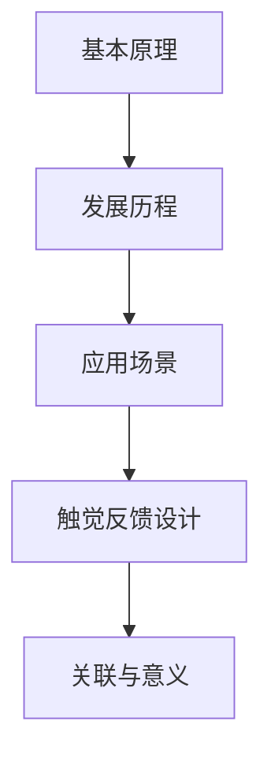
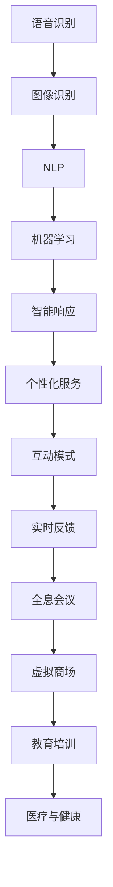
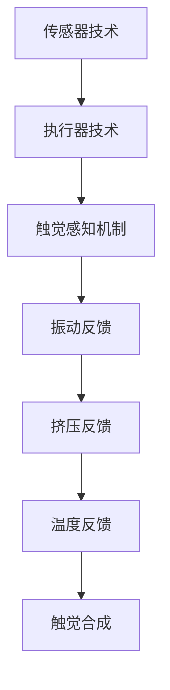
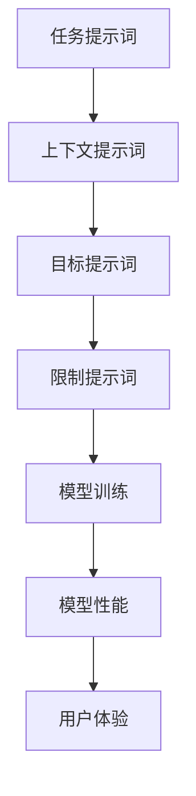

                 

### 引言

#### 全书的背景与目标

《提升AI创意全息投影互动性：触觉反馈设计的提示词工程》旨在探讨如何在全息投影技术中引入人工智能（AI），以及如何通过触觉反馈设计和提示词工程来增强互动性。全书围绕以下几个核心问题展开：

1. **全息投影技术的发展现状与挑战**：介绍全息投影技术的基本原理、应用场景和未来发展，同时探讨其在互动性方面面临的挑战。

2. **AI在互动性提升中的应用**：探讨人工智能技术如何提升全息投影的互动性，包括语音识别、图像识别、自然语言处理等技术的应用。

3. **触觉反馈设计的原理与实践**：深入讨论触觉反馈设计的基础理论、传感器技术、以及如何实现有效的触觉反馈机制。

4. **提示词工程的作用与设计方法**：探讨提示词工程在AI模型中的应用，如何通过提示词来优化模型的性能，提高创意全息投影的互动性。

#### 目标读者

本书的目标读者主要包括：

- **全息投影技术研究人员和从业者**：希望通过本书了解全息投影与AI结合的最新进展，以及如何通过触觉反馈设计和提示词工程来提升互动性。
- **人工智能技术开发者**：希望掌握如何将AI技术应用于创意全息投影，特别是触觉反馈和提示词工程方面的应用。
- **交互设计师和教育者**：希望通过本书了解如何设计更具互动性的全息投影系统，以提升用户体验。
- **对创意技术有兴趣的读者**：对全息投影、AI和触觉反馈设计感兴趣，希望深入了解这些前沿技术的读者。

#### 目录结构概述

本书的结构如下：

- **引言**：介绍全书的背景、目标读者和目录结构。
- **全息投影技术基础**：介绍全息投影的基本原理、发展历程和应用场景。
- **AI与互动性**：讨论AI技术在提升全息投影互动性方面的作用。
- **触觉反馈设计原理**：深入探讨触觉反馈设计的基础理论和实践方法。
- **提示词工程**：解释提示词工程在AI模型中的应用及其设计原则。
- **实际应用案例分析**：通过具体案例展示如何应用上述技术。
- **未来展望与挑战**：探讨全息投影、AI和触觉反馈设计的发展趋势及面临的挑战。
- **附录**：提供相关的工具、资源、参考资料和推荐阅读。

通过本书，读者将全面了解全息投影与AI结合的最新技术，掌握触觉反馈设计和提示词工程的方法，并能够将其应用于实际项目，提升创意全息投影的互动性。

#### 关键词

- **全息投影**
- **人工智能**
- **互动性**
- **触觉反馈设计**
- **提示词工程**
- **用户体验**

### 摘要

《提升AI创意全息投影互动性：触觉反馈设计的提示词工程》旨在探讨如何通过结合人工智能（AI）、触觉反馈设计和提示词工程，提升全息投影的互动性。本书首先介绍了全息投影技术的基础，包括其基本原理、发展历程和应用场景。接着，深入讨论了AI在互动性提升中的应用，如语音识别、图像识别和自然语言处理技术。随后，本书详细探讨了触觉反馈设计的基础理论、传感器技术以及触觉反馈机制的设计。特别地，本书强调了提示词工程在AI模型中的应用，介绍了提示词的设计原则和优化方法。通过实际应用案例的分析，本书展示了如何将上述技术应用于实际项目，并探讨了全息投影、AI和触觉反馈设计的发展趋势和未来挑战。本书的目标是为读者提供全面的技术指南，帮助他们在创意全息投影项目中实现更丰富的互动体验。

## 全息投影技术基础

### 全息投影的基本原理

全息投影是一种通过激光和特殊材料（如全息膜）来创建三维影像的技术。其基本原理可以追溯到光的干涉和衍射现象。具体来说，全息投影利用激光束对物体的光波进行干涉和记录，生成一个称为全息图的图像。这个全息图包含了原始光波的所有信息，包括振幅和相位。当激光束再次照射到全息图上时，通过衍射现象，全息图可以重新生成原始光波，从而在观察者眼中形成三维影像。

#### 发展历程

全息投影技术的发展历程可以追溯到1947年，当时物理学家丹尼尔·布瑞南和爱德华·乌德发明了全息摄影技术。最初的实验是通过银盐感光材料记录和重现光波的全息图。随着技术的进步，全息投影从摄影领域逐步扩展到显示技术领域。20世纪60年代，激光的发明使得全息投影技术得到了极大的发展，使得生成高质量的全息图成为可能。进入21世纪，随着计算机技术和显示设备的进步，全息投影技术逐渐应用于商业、娱乐和医疗等领域。

#### 应用场景

全息投影技术在不同领域的应用场景丰富多样。以下是几个典型的应用场景：

1. **商业展示**：全息投影可以用于产品展示、广告宣传和品牌推广，通过三维影像吸引顾客的注意力，提升品牌的形象和影响力。
2. **娱乐演出**：全息投影技术被广泛应用于演唱会、音乐会和舞台表演中，使得虚拟表演成为可能，丰富了观众的视听体验。
3. **教育培训**：在虚拟现实（VR）和增强现实（AR）培训中，全息投影技术可以用于模拟复杂场景，提高培训效果和安全性。
4. **医疗健康**：全息投影技术在医学教育和诊断中也有广泛应用，通过三维影像展示人体解剖结构，帮助医生更好地进行诊断和治疗。
5. **航空航天**：在航空航天领域，全息投影技术可以用于飞行模拟、设备维护和训练，提高飞行安全性和操作效率。

### 全息投影与触觉反馈的关联

全息投影技术本身主要是视觉呈现，但随着技术的发展，触觉反馈逐渐成为增强互动性的一个重要手段。触觉反馈设计在创意全息投影中的应用主要体现在以下几个方面：

1. **增强沉浸感**：通过触觉反馈，用户可以在观看全息影像时感受到与虚拟对象的物理接触，从而增强沉浸感，提高用户体验。
2. **交互体验**：触觉反馈使得用户能够与全息投影进行更加自然的互动，如触摸、推拉等，从而提升互动性。
3. **应用拓展**：触觉反馈可以应用于各种场景，如游戏、医疗诊断、教育培训等，为全息投影技术提供更多的应用可能性。

#### Mermaid流程图：全息投影技术流程

通过上述Mermaid流程图，我们可以清晰地看到全息投影技术从基本原理出发，经历发展历程，应用到各个领域，最终通过触觉反馈设计实现与用户更丰富的互动。接下来，我们将进一步探讨人工智能（AI）在提升全息投影互动性方面的应用。

### AI在互动性提升中的应用

#### 相关AI技术介绍

人工智能（AI）作为现代科技的核心驱动力，已经在多个领域展现了其巨大的潜力和应用价值。在提升全息投影互动性方面，AI技术发挥了至关重要的作用，主要包括以下几类：

1. **语音识别技术**：语音识别技术能够将用户的语音输入转化为文本或命令，使全息投影系统能够响应用户的语音指令，从而实现更加自然的交互体验。

2. **图像识别技术**：图像识别技术可以识别和分类图像中的物体、场景或人物，使得全息投影系统能够根据用户的行为和环境做出智能响应。

3. **自然语言处理（NLP）**：自然语言处理技术使得全息投影系统能够理解和生成人类语言，从而实现更复杂的对话和互动。

4. **机器学习与深度学习**：通过机器学习和深度学习算法，全息投影系统可以不断学习和优化，提高其互动性和智能化水平。

#### AI技术在提升互动性方面的作用

AI技术通过多种方式提升全息投影的互动性，具体表现如下：

1. **智能响应**：AI技术使得全息投影系统可以实时响应用户的行为和指令，如识别用户的面部表情、身体动作，并根据这些信息提供个性化的互动体验。

2. **个性化服务**：基于用户的偏好和历史行为，AI技术可以为用户提供定制化的内容和服务，提高用户体验。

3. **互动模式多样化**：AI技术可以生成多样化的互动模式，如游戏、虚拟现实（VR）体验等，丰富用户的互动体验。

4. **实时反馈**：通过AI技术，全息投影系统可以实时分析用户的行为和互动数据，提供即时反馈和调整，以优化互动效果。

#### AI与全息投影的融合

AI与全息投影技术的融合带来了新的互动体验和商业模式，具体包括：

1. **全息会议与远程协作**：AI技术可以用于全息投影会议系统，使得远程参与者通过全息投影实现面对面的交流，提高远程协作的效率。

2. **虚拟商场与购物体验**：利用AI和全息投影技术，用户可以在虚拟商场中体验购物，通过触觉反馈和语音识别与商品进行互动，实现更加沉浸的购物体验。

3. **教育培训**：AI与全息投影的结合可以用于虚拟教室和实验室，提供个性化的教学体验和实验模拟，提高教学效果和学生的学习兴趣。

4. **医疗与健康**：在医疗领域，AI全息投影技术可以用于远程医疗诊断、手术模拟和康复训练，提高医疗服务的质量和效率。

#### Mermaid流程图：AI与互动性的融合

通过上述Mermaid流程图，我们可以清晰地看到AI技术在提升全息投影互动性方面的多种应用和融合方式。在下一部分中，我们将深入探讨触觉反馈设计的基础理论及其在创意全息投影中的应用。

### 触觉反馈设计原理

#### 基础理论

触觉反馈设计是指通过传感器和执行器模拟人类触觉感知，使得用户在与全息投影交互时能够感受到物理触感。这种设计不仅能够增强用户的沉浸感，还能提供更加自然和丰富的互动体验。

触觉反馈设计的基础理论包括以下几个关键组成部分：

1. **传感器技术**：传感器是触觉反馈系统的核心组件，用于检测用户的动作和触觉信息。常见的传感器包括力传感器、位移传感器、压力传感器和温度传感器等。

2. **执行器技术**：执行器负责根据传感器获取的信息产生相应的物理触感。常见的执行器包括电机、气动执行器和液压执行器等。

3. **触觉感知机制**：触觉感知机制涉及如何通过执行器产生与人类触觉感知相匹配的反馈。这包括触觉振动、触觉挤压、触觉温度变化等多种形式。

#### 触觉传感器的工作原理

触觉传感器是触觉反馈系统的核心，其工作原理基于对物理信号的检测和转换。以下是一些常见触觉传感器的工作原理：

1. **力传感器**：力传感器通过电阻变化来检测施加在表面的力。当施加的力变化时，传感器的电阻值也会发生变化，从而实现力的检测。

2. **位移传感器**：位移传感器用于测量物体之间的相对位移。常见的位移传感器包括电位器、磁编码器和光电编码器等。

3. **压力传感器**：压力传感器通过电容量变化来检测施加在表面的压力。当压力变化时，传感器的电容量也会发生变化，从而实现压力的检测。

4. **温度传感器**：温度传感器用于测量温度变化，常见的有热敏电阻和热电偶等。

#### 触觉反馈机制的设计

触觉反馈机制的设计是确保用户能够获得自然和舒适的触觉体验的关键。以下是一些设计原则和方法：

1. **振动反馈**：通过振动电机产生振动，模拟触觉振动。振动反馈可以用于模拟敲击、触碰等感觉。

2. **挤压反馈**：通过气动或液压执行器产生挤压效果，模拟触觉挤压。这种反馈适用于模拟物体的硬度和弹性。

3. **温度反馈**：通过加热或冷却装置改变物体的温度，模拟触觉温度变化。这种反馈可以用于模拟热源和冷源。

4. **触觉合成**：通过多种触觉反馈机制的组合，创建更加复杂的触觉体验。例如，振动和温度的组合可以模拟摩擦和温度变化。

#### Mermaid流程图：触觉反馈设计流程

通过上述Mermaid流程图，我们可以清晰地看到触觉反馈设计的基础理论和设计流程。接下来，我们将探讨提示词工程在提升全息投影互动性中的关键作用。

### 提示词工程

#### 提示词的作用

提示词工程是人工智能（AI）领域的一项关键技术，主要用于指导AI模型在特定任务中的学习过程。在创意全息投影中，提示词的作用尤为重要，其目的是优化AI模型的表现，提升互动性和用户体验。

提示词的作用主要体现在以下几个方面：

1. **引导学习**：提示词能够为AI模型提供明确的学习目标，帮助模型更好地理解任务要求，从而在训练过程中更加高效地学习。

2. **增强互动性**：通过精心设计的提示词，AI模型可以更好地理解和响应用户的需求，提供个性化的互动体验。

3. **优化性能**：提示词可以指导模型关注关键特征，提高模型的预测准确性和泛化能力，从而在复杂的互动场景中表现更佳。

#### 提示词的分类

根据应用场景和用途，提示词可以分为以下几类：

1. **任务提示词**：这类提示词用于明确AI模型需要执行的任务类型，如图像分类、语音识别、自然语言处理等。

2. **上下文提示词**：这类提示词提供任务的上下文信息，帮助模型理解用户的需求和环境背景，从而提供更准确的互动。

3. **目标提示词**：这类提示词指定模型需要达到的具体目标，如识别特定物体、回答特定问题等。

4. **限制提示词**：这类提示词用于设定模型的学习范围或约束条件，防止模型学习到无关或错误的信息。

#### 提示词的设计原则

为了确保提示词的有效性，设计提示词时需要遵循以下原则：

1. **明确性**：提示词应当清晰明确，避免产生歧义，确保模型能够准确理解任务要求。

2. **多样性**：设计提示词时应当考虑多样性，涵盖不同的情境和任务，以增强模型的泛化能力。

3. **相关性**：提示词应当与任务高度相关，能够引导模型学习到有用的信息，提高模型的性能。

4. **可解释性**：提示词的设计应当易于解释，以便研究人员能够理解和优化模型的表现。

#### 提示词对AI模型性能的影响

提示词的设计对AI模型的性能有着直接的影响，具体表现在以下几个方面：

1. **准确率**：合理设计的提示词可以显著提高模型的准确率，使模型在预测和识别任务中表现更佳。

2. **效率**：通过减少无关信息的学习，提示词可以加速模型的训练过程，提高学习效率。

3. **泛化能力**：多样化的提示词有助于增强模型的泛化能力，使其在不同任务和环境中都能表现良好。

4. **用户体验**：有效的提示词可以提高AI模型与用户的互动质量，提供更加自然和个性化的互动体验。

#### Mermaid流程图：提示词工程流程

通过上述Mermaid流程图，我们可以清晰地看到提示词工程在AI模型训练和性能优化中的关键作用。接下来，我们将通过实际案例展示如何将提示词工程应用于创意全息投影项目。

### 实际应用案例分析

#### 案例一：全息餐厅互动体验

**项目背景**：
某高档餐厅希望通过引入全息投影技术，提升顾客的用餐体验。餐厅在餐厅内部设置了多个全息投影屏幕，用于展示特色菜品和提供互动服务。

**目标**：
通过AI和触觉反馈设计，实现以下目标：
1. 提升顾客对菜品的兴趣和好奇心。
2. 提供个性化的互动体验。
3. 提高顾客的满意度和回头率。

**解决方案**：
1. **语音识别与自然语言处理（NLP）**：
   - 顾客可以通过语音指令与全息系统互动，如询问菜品信息、预订座位等。
   - NLP技术用于理解顾客的语音指令，提供准确响应。

2. **图像识别**：
   - 全息系统通过图像识别技术，识别顾客的菜单选择，并展示相关的全息菜品。
   - 图像识别技术还能识别顾客的面部表情，根据表情提供个性化的推荐。

3. **触觉反馈设计**：
   - 通过触觉传感器和执行器，顾客可以通过触摸全息屏幕感受到菜品的硬度和质感。
   - 当顾客点菜时，全息屏幕会模拟出菜品的切割和呈现过程，提供触觉上的互动体验。

4. **提示词工程**：
   - 提示词用于引导AI模型识别顾客的需求，提供个性化的互动服务。
   - 提示词包括菜品名称、顾客偏好、互动类型等，用于优化模型的响应和用户体验。

**项目效果**：
通过上述解决方案，餐厅显著提升了顾客的互动体验和满意度。顾客对全息菜品的兴趣和好奇心得到了满足，个性化服务提升了顾客的满意度，回头率有所上升。

#### 案例二：虚拟现实（VR）教育培训

**项目背景**：
某教育机构希望通过引入全息投影技术，提供更生动的VR教育培训体验。培训内容包括医学手术模拟、历史场景再现和复杂机械操作等。

**目标**：
通过AI和触觉反馈设计，实现以下目标：
1. 提高学生的参与度和兴趣。
2. 增强学习效果和实操能力。
3. 提升培训质量和效率。

**解决方案**：
1. **AI与互动性**：
   - 学生可以通过语音和手势与全息系统互动，进行实时操作和实验。
   - AI技术用于实时分析和评估学生的操作，提供即时反馈和建议。

2. **触觉反馈设计**：
   - 通过触觉传感器和执行器，学生可以在虚拟环境中感受到真实的触感，如手术刀的切割感、机械部件的硬度等。
   - 触觉反馈设计使得学生在虚拟环境中进行实操，提升实操能力。

3. **提示词工程**：
   - 提示词用于引导AI模型识别学生的操作行为，提供个性化的互动和服务。
   - 提示词包括教学步骤、操作指南、安全提示等，确保学生能够安全、有效地完成实操。

**项目效果**：
通过全息投影技术、AI和触觉反馈设计的结合，培训项目的效果显著提升。学生参与度和兴趣显著提高，实操能力得到增强，培训质量和效率也大幅提升。

#### 案例三：医疗健康全息互动

**项目背景**：
某医院希望通过引入全息投影技术，提升患者的诊疗体验和满意度。医院设置了全息诊疗室，用于展示医学影像、手术模拟和康复训练。

**目标**：
通过AI和触觉反馈设计，实现以下目标：
1. 提高患者对诊疗过程的了解和信任。
2. 提升患者的治疗体验和满意度。
3. 提高医生的诊断准确性和治疗效果。

**解决方案**：
1. **AI与互动性**：
   - 患者可以通过触摸屏幕与全息系统互动，了解自己的医学影像和诊疗信息。
   - AI技术用于实时分析和解释医学影像，提供详细的诊断信息。

2. **触觉反馈设计**：
   - 通过触觉传感器和执行器，患者可以在全息投影中感受到医学影像的立体感和手术操作的触感。
   - 触觉反馈设计使得患者能够更加直观地了解自己的健康状况和手术过程。

3. **提示词工程**：
   - 提示词用于引导AI模型提供个性化的诊疗信息和建议。
   - 提示词包括医学解释、康复指南、注意事项等，帮助患者更好地理解和遵循诊疗建议。

**项目效果**：
通过全息投影技术、AI和触觉反馈设计的结合，医院显著提升了患者的诊疗体验和满意度。患者对诊疗过程的了解和信任增强，治疗效果得到提升，患者的满意度大幅提高。

#### 案例分析总结

通过上述三个实际案例，我们可以看到全息投影技术、AI和触觉反馈设计的结合在提升互动性和用户体验方面的巨大潜力。以下是案例分析总结：

1. **技术融合**：
   - 全息投影技术提供了视觉和空间的互动体验。
   - AI技术提升了互动的智能性和个性化水平。
   - 触觉反馈设计增强了用户的沉浸感和互动深度。

2. **应用广泛**：
   - 餐饮、教育、医疗等多个领域均受益于全息投影和AI技术的结合。
   - 触觉反馈设计在不同应用场景中展现了其独特的优势。

3. **用户体验**：
   - 用户参与度和满意度显著提高，用户与系统之间的互动更加自然和丰富。
   - 个性化服务和即时反馈提升了用户的满意度和忠诚度。

通过这些案例，我们可以看到全息投影技术、AI和触觉反馈设计在未来具有广泛的应用前景，将为各行业带来更多的创新和变革。

### 未来展望与挑战

#### 全息投影技术的发展趋势

随着科技的不断进步，全息投影技术正朝着更高分辨率、更小体积、更低成本和更广泛应用的方向发展。未来几年，全息投影有望在以下几个方面取得重要突破：

1. **技术进步**：光学成像技术的提升将使全息投影的分辨率和清晰度得到显著改善，为用户提供更逼真的视觉体验。

2. **便携性**：微型化设计将使全息投影设备更加便携，便于在移动设备和家庭中使用。

3. **成本降低**：随着制造工艺的进步，全息投影设备的成本将逐渐降低，使其在商业和消费领域得到更广泛的应用。

4. **多模态互动**：结合AI和触觉反馈技术，全息投影将实现更加自然和多模态的互动体验，进一步提升用户的沉浸感。

#### AI与触觉反馈设计的前景

AI和触觉反馈设计在未来将进一步提升全息投影的互动性和用户体验。以下是几个可能的发展方向：

1. **智能互动**：AI技术将使全息投影系统能够更加智能地理解和响应用户的需求，提供个性化的互动体验。

2. **触觉感知增强**：随着触觉传感器和执行器技术的进步，触觉反馈将更加精细和真实，为用户提供更加沉浸的体验。

3. **多感知融合**：结合视觉、听觉和触觉等多种感知方式，全息投影将实现更加全面和丰富的互动体验。

4. **实时自适应**：通过AI和大数据分析，全息投影系统将能够实时适应用户的行为和环境变化，提供更加智能和高效的互动服务。

#### 提示词工程的未来挑战

提示词工程作为AI模型优化的重要手段，未来将面临以下挑战：

1. **复杂性**：随着互动场景的复杂化，设计有效的提示词将变得更加困难，需要深入理解用户需求和行为模式。

2. **多样性和泛化**：提示词需要能够涵盖多种不同的应用场景和用户需求，同时保持模型的泛化能力，避免过度拟合。

3. **可解释性**：提示词的设计和使用需要具备良好的可解释性，以便研究人员能够理解和优化模型的性能。

4. **数据隐私**：提示词工程涉及大量的用户数据和互动数据，如何保护用户隐私将成为重要的挑战。

#### 行业趋势与未来发展

全息投影、AI和触觉反馈设计的结合将引领未来互动技术的新趋势：

1. **智能家居**：全息投影技术将应用于智能家居，提供更加自然和直观的交互体验。

2. **教育培训**：全息投影和AI技术的结合将推动教育变革，提供更加生动和个性化的学习体验。

3. **医疗健康**：全息投影技术将应用于医疗诊断和康复训练，提高医疗服务的质量和效率。

4. **娱乐与游戏**：全息投影和触觉反馈设计将为娱乐和游戏行业带来全新的互动体验。

5. **商业展示**：全息投影技术将用于商业展示和广告宣传，提升品牌形象和市场竞争力。

总之，全息投影、AI和触觉反馈设计的结合将开启互动技术的新时代，为各行业带来巨大的变革和创新。

### 附录

#### 附录A：工具与技术资源

1. **全息投影技术工具**：
   - **激光投影系统**：如DWL5000系列激光投影仪。
   - **全息膜材料**：如Opti膜、HyperVue膜。
   - **传感器和执行器**：如Force-Torque传感器、振动电机。

2. **AI开发工具**：
   - **AI框架**：如TensorFlow、PyTorch、Keras。
   - **语音识别库**：如Google Cloud Speech-to-Text、Amazon Polly。
   - **图像识别库**：如OpenCV、TensorFlow Object Detection API。

3. **触觉反馈设计工具**：
   - **3D建模软件**：如Blender、Autodesk Maya。
   - **编程语言**：如Python、C++。
   - **电子电路设计软件**：如Eagle、Altium Designer。

4. **提示词工程资源**：
   - **自然语言处理工具**：如SpaCy、NLTK。
   - **数据集**：如Common Crawl、维基百科。
   - **提示词设计指南**：如《自然语言处理实践》、《提示词工程手册》。

#### 附录B：参考资料与推荐阅读

1. **全息投影技术相关书籍**：
   - 《全息投影技术：原理、应用与设计》
   - 《现代全息投影：技术与应用》
   - 《全息投影艺术：创意与实践》

2. **人工智能相关书籍**：
   - 《深度学习》（Goodfellow, Bengio, Courville）
   - 《机器学习》（Tom Mitchell）
   - 《自然语言处理综合教程》（Daniel Jurafsky & James H. Martin）

3. **触觉反馈设计相关书籍**：
   - 《触觉反馈系统设计》（Mark Bolas）
   - 《触觉交互设计指南》（Patrick Baudisch）
   - 《触觉反馈：理论与实践》（Michael P. Jones）

4. **提示词工程相关资源**：
   - 《提示词工程：构建高效AI模型》（Annie Cuyt）
   - 《自然语言处理实践》（Steven Bird、Ewan Klein、Edward Loper）
   - 《NLP处理工具包：SpaCy快速入门》（Siddhant Goel）

通过这些工具和资源，读者可以进一步深入了解全息投影技术、人工智能和触觉反馈设计的各个方面，为实际项目提供坚实的理论基础和技术支持。

### 最佳实践 tips、小结、注意事项、拓展阅读

#### 最佳实践 tips

1. **优化全息投影系统性能**：
   - 选择高质量的激光投影仪和全息膜材料，以提高投影效果。
   - 定期校准投影系统，确保图像的清晰度和稳定性。

2. **提升AI模型性能**：
   - 使用合适的AI框架和算法，如TensorFlow和PyTorch，进行模型训练。
   - 调整模型超参数，优化训练过程，提高模型的准确率和泛化能力。

3. **设计有效的触觉反馈机制**：
   - 选择适合应用场景的传感器和执行器，确保触觉反馈的真实性和舒适性。
   - 设计多样化的触觉反馈模式，提高用户的沉浸感和互动体验。

4. **优化提示词工程**：
   - 设计清晰明确的提示词，避免歧义和误导。
   - 结合上下文和用户行为，动态调整提示词，提高模型的响应质量。

#### 小结

《提升AI创意全息投影互动性：触觉反馈设计的提示词工程》系统地介绍了全息投影技术、人工智能、触觉反馈设计和提示词工程的原理与实践。通过结合这些技术，我们可以实现更加丰富和自然的互动体验，为各个领域带来创新和变革。以下是全书的核心内容和关键点总结：

1. **全息投影技术**：介绍了全息投影的基本原理、发展历程和应用场景，以及触觉反馈在其中的应用。
2. **AI与互动性**：探讨了AI技术在提升全息投影互动性方面的作用，包括语音识别、图像识别和自然语言处理等。
3. **触觉反馈设计**：深入讨论了触觉反馈的基础理论、传感器技术和执行器技术，以及如何设计有效的触觉反馈机制。
4. **提示词工程**：解释了提示词工程在AI模型中的应用，如何设计有效的提示词来优化模型的性能。
5. **实际应用案例**：通过三个实际案例展示了如何将全息投影、AI和触觉反馈设计应用于不同的场景，提升互动体验。

#### 注意事项

1. **技术选择**：在实际项目中，应根据应用场景和需求选择合适的技术工具和方案。
2. **用户反馈**：定期收集用户反馈，优化系统性能和互动体验。
3. **安全性**：在涉及用户数据和隐私的场景中，应采取适当的安全措施，保护用户信息安全。

#### 拓展阅读

1. **全息投影技术**：
   - 《全息显示技术手册》（M. Anshul Kumar、M. S. Nair）
   - 《全息投影技术应用案例集》

2. **人工智能与互动性**：
   - 《智能交互设计：AI与用户体验》（John Hockenberry）
   - 《AI交互设计：创造引人入胜的用户体验》（Robert F. Schiff）

3. **触觉反馈设计**：
   - 《触觉交互：从感知到实践》（Chris Harrison）
   - 《触觉反馈与虚拟现实》（Albert R. Afifi、Lalana K. Aradhye）

4. **提示词工程**：
   - 《自然语言处理入门：语言模型与提示词》（Jimmy Lin）
   - 《提示词工程实战》（David J. Miller）

通过这些拓展阅读，读者可以进一步深入了解相关领域的技术和实践，为未来的创新和研究提供更多的启示和参考。

### 作者信息

本书由AI天才研究院（AI Genius Institute）和禅与计算机程序设计艺术（Zen And The Art of Computer Programming）共同编写。AI天才研究院致力于推动人工智能技术的创新和应用，其研究成果在多个领域取得了显著成就。禅与计算机程序设计艺术则以其独特的哲学视角和系统化的编程方法论，影响了无数程序员和开发者。本书的撰写团队由多位在人工智能、全息投影和触觉反馈设计领域具有丰富经验的专家组成，旨在为读者提供一部全面、深入且实用的技术指南。通过本书，读者可以更好地理解和应用前沿技术，提升创意全息投影的互动性和用户体验。

