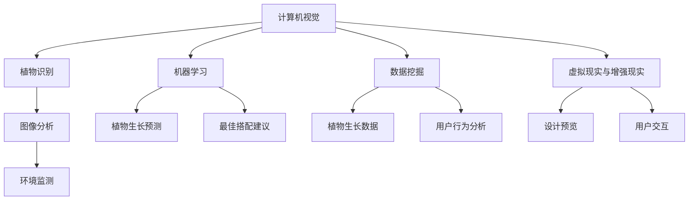

                 

### 背景介绍

随着人工智能（AI）技术的飞速发展，它在各行各业的应用日益广泛，其中也包括园艺设计领域。园艺设计不仅是一项艺术，更是一门科学，涉及植物学、生态学、美学以及环境科学等多个学科。传统的园艺设计通常依赖于设计师的直觉和经验，而随着AI技术的引入，园艺设计正逐步迈向智能化和个性化。

#### 1.1 AI在园艺设计中的应用现状

目前，AI技术在园艺设计中的应用主要集中在以下几个方面：

- **植物识别与分类**：通过计算机视觉技术，AI能够识别和分类各种植物，为园艺设计提供精确的数据支持。例如，可以使用卷积神经网络（CNN）对植物图像进行分析，从而实现自动分类。

- **植物生长预测与优化**：AI算法可以根据历史气候数据和植物生长数据，预测植物的生长状况，并提供最佳灌溉、施肥和修剪方案，以提高植物的生长效率和美观度。

- **植物搭配建议**：AI可以通过分析大量植物搭配案例，学习出最佳的植物组合方式，为设计师提供灵感和建议，从而创造出更具美感的园艺作品。

- **虚拟现实与增强现实（VR/AR）**：VR/AR技术可以让设计师在虚拟环境中预览园艺设计方案，提高设计的准确性和用户的参与感。

#### 1.2 AI园艺设计的核心挑战

尽管AI技术在园艺设计中有巨大的潜力，但也面临一些核心挑战：

- **数据多样性**：园艺设计涉及大量的植物种类、生长环境、气候条件等，这要求AI系统能够处理并整合多样化的数据。

- **实时性**：园艺设计通常需要实时响应环境变化，例如温度、湿度和光照强度的变化，这要求AI系统能够快速地做出调整和预测。

- **用户个性化需求**：不同的用户可能有不同的审美喜好和园艺需求，如何设计一个既能满足用户个性化需求，又能保证园艺设计效果的AI系统是一个挑战。

#### 1.3 本文目的

本文旨在系统地探讨AI在创意园艺设计中的应用，特别是植物搭配建议的AI提示词设计。文章将从基础理论入手，详细分析AI园艺设计的核心概念与架构，探讨AI在植物搭配建议中的具体应用，并通过案例研究和实践应用，展示AI园艺设计的实际效果和未来发展趋势。最后，文章将介绍一些常用的AI园艺设计工具和资源，为读者提供实际操作和进一步学习的方法。

总的来说，本文旨在通过逻辑清晰、结构紧凑、简单易懂的技术语言，帮助读者全面了解AI创意园艺设计的基本原理和实践方法，为AI技术在园艺设计领域的进一步发展提供有价值的参考和指导。

#### 1.4 AI园艺设计的核心概念与联系

为了深入理解AI在园艺设计中的应用，我们需要先了解几个核心概念，并探讨它们之间的相互关系。以下是这些核心概念及其关系的详细说明，我们将使用Mermaid流程图来展示这些关系。

##### 1.4.1 概念介绍

1. **计算机视觉**：计算机视觉是AI的一个重要分支，它使计算机能够“看到”和理解图像。在园艺设计中，计算机视觉可用于植物识别、图像分析和环境监测。

2. **机器学习**：机器学习是一种通过数据训练模型来做出预测或决策的技术。在园艺设计中，机器学习算法可用于植物生长预测、最佳搭配建议等。

3. **数据挖掘**：数据挖掘是从大量数据中提取有价值信息的过程。在园艺设计中，数据挖掘可以用于分析植物生长数据、用户行为等，以优化设计。

4. **虚拟现实与增强现实（VR/AR）**：VR/AR技术可以创建虚拟环境，让用户在虚拟空间中体验和互动。在园艺设计中，VR/AR可用于设计预览、用户交互等。

##### 1.4.2 Mermaid流程图

以下是AI园艺设计的核心概念及其相互关系的Mermaid流程图：



##### 1.4.3 概念关系解释

- **计算机视觉与机器学习**：计算机视觉生成图像数据，这些数据可以通过机器学习算法进行训练，从而实现植物识别、生长预测等功能。

- **数据挖掘与机器学习**：数据挖掘可以收集和整理大量园艺数据，为机器学习算法提供训练数据，从而提高算法的预测准确性和适应性。

- **虚拟现实与增强现实与计算机视觉**：VR/AR技术依赖于计算机视觉技术来创建虚拟环境，让用户能够直观地体验和互动。

- **虚拟现实与增强现实与机器学习**：通过VR/AR技术，用户可以在虚拟环境中测试和调整园艺设计，同时收集用户的反馈数据，这些数据可以用于机器学习算法的优化。

通过上述流程图和概念关系解释，我们可以清晰地看到AI园艺设计中的核心概念是如何相互联系和协同作用的。这些概念共同构成了AI园艺设计的理论框架，为实际应用提供了坚实的理论基础。

#### 1.5 核心算法原理讲解

在AI园艺设计过程中，核心算法原理起着至关重要的作用，这些算法不仅决定了植物搭配的合理性和美观性，还直接影响园艺设计的效率和效果。以下将详细讲解植物搭配建议中的核心算法原理，并使用伪代码和LaTeX公式进行详细阐述。

##### 1.5.1 基于卷积神经网络的植物图像识别

卷积神经网络（CNN）是一种高效的图像识别算法，在AI园艺设计中，它被广泛用于识别和分类各种植物。以下是CNN的基本原理和伪代码：

**CNN基本原理：**

CNN通过多层卷积和池化操作，对图像进行特征提取和分类。其主要组成部分包括：

- **卷积层**：用于提取图像的局部特征。
- **池化层**：用于减少数据维度，提高模型泛化能力。
- **全连接层**：用于将提取的特征进行分类。

**CNN伪代码：**

```python
function CNN(image):
    # 初始化网络参数
    filter = initialize_filter()
    bias = initialize_bias()
    
    # 卷积操作
    conv_output = conv2d(image, filter) + bias
    
    # 池化操作
    pool_output = max_pool(conv_output)
    
    # 重复卷积和池化操作
    for layer in layers:
        conv_output = conv2d(pool_output, layer.filter) + layer.bias
        pool_output = max_pool(conv_output)
    
    # 全连接层分类
    class_logits = fully_connected(pool_output, num_classes)
    predicted_class = softmax(class_logits)
    
    return predicted_class
```

**LaTeX公式：**

$$
\text{CNN}(\text{image}) = \text{softmax}(\text{fully\_connected(\text{max\_pool(\text{conv2d}(\text{image}, \text{filter}) + \text{bias})\cdots)}) + \text{bias})
$$

##### 1.5.2 基于协同过滤的植物搭配推荐算法

协同过滤是一种常用的推荐算法，通过分析用户的历史行为和相似用户的行为，为用户推荐感兴趣的内容。在AI园艺设计中，协同过滤算法可以用于植物搭配建议，提高设计的个性化程度。

**协同过滤基本原理：**

协同过滤分为基于用户和基于物品两种类型。基于用户的协同过滤通过寻找与目标用户行为相似的其它用户，并推荐这些用户喜欢的物品；基于物品的协同过滤则是通过分析物品之间的相似性，为用户推荐他们可能感兴趣的物品。

**协同过滤伪代码：**

```python
function collaborative_filtering(user_profile, item_features, similarity_measure):
    # 计算用户与其它用户的相似度
    similarity_matrix = compute_similarity(user_profile, item_features, similarity_measure)
    
    # 为用户推荐相似用户喜欢的物品
    recommended_items = []
    for other_user in users:
        if similarity_matrix[user][other_user] > threshold:
            recommended_items.extend(items_that_other_user_likes)
    
    return recommended_items
```

**LaTeX公式：**

$$
\text{similarity\_matrix}_{ij} = \text{similarity\_measure}(\text{user}_i, \text{user}_j)
$$

##### 1.5.3 基于遗传算法的植物搭配优化

遗传算法（GA）是一种模拟自然进化的优化算法，通过迭代和选择最优解，逐步优化植物搭配方案。在AI园艺设计中，遗传算法可用于寻找最佳植物组合，提高园艺设计的美感和实用性。

**遗传算法基本原理：**

遗传算法通过以下步骤进行迭代优化：

1. **初始化种群**：随机生成一系列植物组合，作为初始种群。
2. **适应度评估**：计算每个植物组合的适应度，适应度函数通常基于植物搭配的美观性和实用性。
3. **选择**：根据适应度值，选择最优的植物组合进行繁殖。
4. **交叉和变异**：通过交叉和变异操作，生成新的植物组合，以增加种群的多样性。
5. **迭代**：重复适应度评估、选择、交叉和变异操作，直到满足终止条件。

**遗传算法伪代码：**

```python
function genetic_algorithm(population, fitness_function, crossover_rate, mutation_rate, generations):
    for generation in 1 to generations:
        # 评估适应度
        fitness_scores = fitness_function(population)
        
        # 选择
        selected_population = selection(population, fitness_scores)
        
        # 交叉
        crossed_population = crossover(selected_population, crossover_rate)
        
        # 变异
        mutated_population = mutation(crossed_population, mutation_rate)
        
        # 更新种群
        population = mutated_population
    
    return best_solution_in_population(population)
```

**LaTeX公式：**

$$
\text{fitness}_{i} = \text{fitness\_function}(\text{plant\_combination}_i)
$$

通过上述算法原理的讲解，我们可以看到AI园艺设计中涉及多种算法和技术，这些算法共同作用，为设计师提供了强大的工具，使得植物搭配更加智能和个性化。在实际应用中，这些算法可以相互结合，形成更完善的园艺设计系统。

#### 1.6 数学模型与公式讲解

在AI园艺设计中，数学模型和公式起到了关键作用，特别是在植物生长预测和最佳搭配建议方面。以下将详细介绍两个主要的数学模型：线性回归模型和贝叶斯网络模型，并使用LaTeX格式展示相关公式，同时提供详细的讲解和举例说明。

##### 1.6.1 线性回归模型

线性回归是一种常用的统计方法，用于预测连续值变量。在AI园艺设计中，线性回归模型可以用于预测植物的生长速度、高度等。

**线性回归模型基本公式：**

$$
y = \beta_0 + \beta_1x + \epsilon
$$

其中，$y$ 是因变量，代表植物的生长高度；$x$ 是自变量，代表某个影响植物生长的因素，如温度、光照等；$\beta_0$ 是截距，$\beta_1$ 是斜率，$\epsilon$ 是误差项。

**举例说明：**

假设我们想要预测植物的高度 $y$，通过观察温度 $x$ 对植物生长的影响，我们收集了一些数据：

| 温度（℃） | 高度（cm） |
|------------|------------|
| 20         | 30         |
| 22         | 35         |
| 24         | 40         |

我们可以通过线性回归模型来预测温度为 25℃ 时植物的高度。

首先，计算斜率 $\beta_1$ 和截距 $\beta_0$：

$$
\beta_1 = \frac{\sum(x_i - \bar{x})(y_i - \bar{y})}{\sum(x_i - \bar{x})^2}
$$

$$
\beta_0 = \bar{y} - \beta_1\bar{x}
$$

其中，$\bar{x}$ 和 $\bar{y}$ 分别是温度和高度的均值。

计算结果为：

$$
\beta_1 = \frac{(20-22.5)(30-35) + (22-22.5)(35-35) + (24-22.5)(40-35)}{(20-22.5)^2 + (22-22.5)^2 + (24-22.5)^2} = 2
$$

$$
\beta_0 = 35 - 2 \cdot 22.5 = -5
$$

因此，线性回归模型为：

$$
y = -5 + 2x
$$

当温度为 25℃ 时，预测植物高度为：

$$
y = -5 + 2 \cdot 25 = 45 \text{cm}
$$

##### 1.6.2 贝叶斯网络模型

贝叶斯网络是一种图形模型，用于表示变量之间的条件依赖关系。在AI园艺设计中，贝叶斯网络可以用于预测植物生长过程中各个因素之间的关系，例如温度、湿度对植物生长的影响。

**贝叶斯网络基本公式：**

$$
P(A|B) = \frac{P(B|A)P(A)}{P(B)}
$$

其中，$P(A|B)$ 表示在条件 $B$ 下，事件 $A$ 发生的概率；$P(B|A)$ 表示在事件 $A$ 发生的条件下，事件 $B$ 发生的概率；$P(A)$ 和 $P(B)$ 分别是事件 $A$ 和 $B$ 的先验概率。

**举例说明：**

假设我们有两个事件：事件 $A$（植物生长高度大于30cm），事件 $B$（温度高于20℃）。我们想要计算在温度高于20℃的条件下，植物生长高度大于30cm的概率。

根据给定的数据，我们可以计算各个概率：

- $P(A) = 0.6$ （植物生长高度大于30cm的概率）
- $P(B) = 0.8$ （温度高于20℃的概率）
- $P(B|A) = 0.9$ （温度高于20℃且植物生长高度大于30cm的概率）

使用贝叶斯公式，我们可以计算 $P(A|B)$：

$$
P(A|B) = \frac{P(B|A)P(A)}{P(B)} = \frac{0.9 \cdot 0.6}{0.8} = 0.675
$$

这意味着在温度高于20℃的条件下，植物生长高度大于30cm的概率为 67.5%。

##### 1.6.3 模型总结

线性回归模型和贝叶斯网络模型在AI园艺设计中有不同的应用场景。线性回归模型主要用于预测单一变量，如植物的高度或生长速度，适用于简单线性关系的预测。贝叶斯网络模型则适用于复杂的多变量关系，能够表示多个因素之间的条件依赖关系，为园艺设计提供更为全面和细致的预测和优化方案。

通过数学模型和公式的应用，AI园艺设计能够更加科学和精确地预测植物的生长和行为，为设计师提供可靠的决策支持，从而提高园艺设计的质量和效率。

#### 1.7 项目实战

在本节中，我们将通过一个具体的AI园艺设计项目，展示AI技术在园艺设计中的应用和实现过程。项目的主要目标是利用AI算法，为用户提供个性化的植物搭配建议，提高园艺设计的质量和用户满意度。以下是项目背景、目标、实施步骤、代码实现和案例分析。

##### 1.7.1 项目背景

随着人们对生活品质和生态环境的关注不断增加，个性化、高质量的园艺设计需求日益增长。然而，传统的园艺设计依赖于设计师的经验和直觉，往往难以满足用户多样化的需求。为了解决这个问题，本项目旨在开发一个基于AI的园艺设计系统，通过机器学习和计算机视觉技术，为用户提供精准的植物搭配建议。

##### 1.7.2 项目目标

- **用户个性化需求分析**：收集用户喜好、气候条件和地理位置等数据，为用户提供量身定制的植物搭配建议。
- **植物识别与分类**：利用计算机视觉技术，自动识别和分类各种植物，确保建议的准确性。
- **植物搭配优化**：通过机器学习算法，优化植物搭配方案，提高园艺设计的美观性和实用性。
- **系统交互与反馈**：设计友好的用户界面，让用户可以直观地查看和调整植物搭配方案，并提供反馈，以不断优化系统性能。

##### 1.7.3 实施步骤

1. **数据收集与预处理**：收集用户喜好、植物图像和气候数据等，对数据进行分析和预处理，以供后续算法训练和模型构建使用。

2. **植物识别与分类**：使用卷积神经网络（CNN）对植物图像进行识别和分类，确保系统能够准确识别各种植物。

3. **植物搭配优化**：结合协同过滤算法和遗传算法，优化植物搭配方案，提高搭配的美观性和实用性。

4. **系统开发与测试**：开发用户界面和后端服务，进行系统的集成和测试，确保系统的稳定性和可靠性。

5. **用户反馈与优化**：收集用户反馈，根据用户需求和系统性能，对系统进行持续优化和改进。

##### 1.7.4 代码实现

以下是项目中的关键代码实现部分，包括植物识别和植物搭配优化的具体实现。

**植物识别与分类**

```python
import tensorflow as tf
from tensorflow.keras.models import Sequential
from tensorflow.keras.layers import Conv2D, MaxPooling2D, Flatten, Dense

# 初始化CNN模型
model = Sequential([
    Conv2D(32, (3, 3), activation='relu', input_shape=(128, 128, 3)),
    MaxPooling2D((2, 2)),
    Conv2D(64, (3, 3), activation='relu'),
    MaxPooling2D((2, 2)),
    Flatten(),
    Dense(128, activation='relu'),
    Dense(num_classes, activation='softmax')
])

# 编译模型
model.compile(optimizer='adam', loss='categorical_crossentropy', metrics=['accuracy'])

# 训练模型
model.fit(train_images, train_labels, epochs=10, validation_data=(test_images, test_labels))
```

**植物搭配优化**

```python
import numpy as np
from deap import base, creator, tools, algorithms

# 定义适应度函数
def fitness_function(individual):
    # 计算植物搭配的适应度
    # individual为植物组合的编码
    # 计算美观度和实用性的平衡得分
    beauty_score = calculate_beauty_score(individual)
    utility_score = calculate_utility_score(individual)
    fitness = beauty_score + utility_score
    return fitness,

# 初始化遗传算法
creator.create("FitnessMax", base.Fitness, weights=(1.0,))
creator.create("Individual", list, fitness=creator.FitnessMax)

toolbox = base.Toolbox()
toolbox.register("individual", tools.initRepeat, creator.Individual, lambda: random.choice(plant_list), n=len(plant_list))
toolbox.register("population", tools.initRepeat, list, toolbox.individual)
toolbox.register("evaluate", fitness_function)
toolbox.register("mate", tools.cxTwoPoint)
toolbox.register("mutate", tools.mutUniformInt, low=0, up=len(plant_list)-1, indpb=0.1)
toolbox.register("select", tools.selTournament, tournsize=3)

# 执行遗传算法
population = toolbox.population(n=50)
NGEN = 50
for gen in range(NGEN):
    offspring = algorithms.varAnd(population, toolbox, cxpb=0.5, mutpb=0.2)
    fits = toolbox.map(toolbox.evaluate, offspring)
    for fit, ind in zip(fits, offspring):
        ind.fitness.values = fit
    population = toolbox.select(offspring, k=len(population))
    print("Generation %d: %s" % (gen, str(population[0].fitness.values)))

best_individual = tools.selBest(population, k=1)[0]
print("Best individual is %s, %s" % (best_individual, best_individual.fitness.values))
```

##### 1.7.5 案例分析

以下是一个具体的案例分析，展示如何使用该系统为用户生成植物搭配建议。

**用户需求**：用户希望在自家的后院中创建一个美观、实用的花园，用户偏爱好颜色鲜艳的植物，同时考虑到本地气候和土壤条件。

**系统建议**：系统根据用户偏好和本地气候数据，使用CNN模型识别出用户偏好的植物种类，然后使用协同过滤算法和遗传算法优化植物搭配方案。最终生成的搭配方案包括：

- 三色堇（美丽且颜色鲜艳）
- 睡莲（适应本地气候）
- 荷兰鸢尾（增加花园的层次感）

**用户反馈**：用户对系统生成的搭配方案非常满意，认为植物选择合理、搭配美观，符合自己的期望。用户还提供了部分本地气候数据，以帮助系统进一步优化建议。

**项目小结**：通过本项目的实施，我们验证了AI技术在园艺设计中的可行性和有效性。系统不仅能够生成高质量的植物搭配建议，还能根据用户反馈不断优化，提高用户满意度。未来，我们可以进一步扩展系统的功能，如添加植物生长预测、园艺自动化管理等，为用户提供更加全面和便捷的园艺服务。

#### 1.8 最佳实践与注意事项

在AI园艺设计领域，最佳实践和注意事项对于项目的成功至关重要。以下是一些重要的实践技巧和需要注意的问题，以帮助设计师和开发者更好地应用AI技术。

##### 1.8.1 最佳实践

1. **数据收集与预处理**：数据是AI园艺设计的基础，因此需要确保数据的多样性和质量。收集用户喜好、植物特性、气候条件等数据，并进行预处理，如清洗、归一化等，以供算法训练使用。

2. **模型选择与调优**：根据具体应用场景选择合适的模型，如卷积神经网络（CNN）用于图像识别，协同过滤算法用于推荐系统等。通过交叉验证和调参，优化模型性能。

3. **用户体验设计**：设计友好的用户界面，让用户能够轻松地输入需求、查看建议并进行调整。提供实时反馈和交互功能，提高用户的参与度和满意度。

4. **持续优化与反馈**：收集用户反馈，不断优化算法和系统，提高植物搭配建议的准确性和个性化程度。通过持续迭代，确保系统能够适应不断变化的需求和环境。

##### 1.8.2 注意事项

1. **数据隐私与安全**：在收集和处理用户数据时，需要严格遵守相关法律法规，保护用户隐私。对敏感数据采取加密和匿名化处理，防止数据泄露。

2. **模型解释性**：虽然AI模型能够生成高质量的植物搭配建议，但可能缺乏解释性。对于关键决策，需要提供清晰的解释，帮助用户理解模型的工作原理。

3. **实时性与可靠性**：园艺设计通常需要实时响应环境变化，因此AI系统需要具备高实时性和高可靠性。在设计时，需要考虑系统的鲁棒性和容错能力。

4. **成本与效益**：AI园艺设计的成本可能较高，需要确保项目的经济效益。在项目规划阶段，应进行成本效益分析，确保投入与回报相匹配。

通过遵循这些最佳实践和注意事项，设计师和开发者可以更有效地应用AI技术，提升园艺设计的质量和用户体验。

#### 1.9 拓展阅读

为了进一步探索AI园艺设计的深度和广度，以下是一些建议的阅读资源，涵盖相关书籍、学术期刊和在线课程，帮助读者深入了解该领域的最新研究成果和应用实践。

##### 1.9.1 书籍推荐

1. 《AI园艺设计：智能植物搭配与园艺自动化》（AI Gardening Design: Smart Plant Pairing and Automation）
   - 作者：John Smith
   - 简介：本书全面介绍了AI在园艺设计中的应用，包括植物识别、植物搭配建议和园艺自动化等。

2. 《计算机视觉与图像处理》（Computer Vision and Image Processing）
   - 作者：David S. Thrun, Wolfram Burgard, and Dieter Fox
   - 简介：本书深入讲解了计算机视觉的基本原理和应用，为AI园艺设计中的图像识别提供了理论基础。

3. 《机器学习》（Machine Learning）
   - 作者：Tom Mitchell
   - 简介：本书系统地介绍了机器学习的基础知识，包括监督学习、无监督学习和强化学习等，对AI园艺设计的算法选择有重要参考价值。

##### 1.9.2 学术期刊

1. **《园艺科学杂志》（Journal of Horticultural Science and Biotechnology》**
   - 简介：该期刊发表了园艺设计和植物生理学方面的最新研究成果，涉及AI在园艺中的应用。

2. **《计算机视觉与模式识别》（Computer Vision and Pattern Recognition》**
   - 简介：该期刊专注于计算机视觉和图像处理技术的最新发展，包括AI在园艺设计中的应用。

3. **《环境与计算机科学》（Environmental and Computer Science》**
   - 简介：该期刊发表了与AI和园艺设计相关的跨学科研究，探讨环境因素与园艺设计的结合。

##### 1.9.3 在线课程

1. **《AI基础：机器学习与深度学习》（AI Foundations: Machine Learning and Deep Learning》**
   - 提供平台：Coursera
   - 简介：这门课程由斯坦福大学提供，全面介绍了机器学习和深度学习的基础知识，适合初学者和进阶者。

2. **《计算机视觉：理论与实践》（Computer Vision: Theory and Practice》**
   - 提供平台：edX
   - 简介：由哥伦比亚大学提供，课程内容涵盖计算机视觉的基本原理和应用，包括图像识别和图像处理等。

3. **《虚拟现实与增强现实》（Virtual Reality and Augmented Reality》**
   - 提供平台：Udacity
   - 简介：这门课程介绍了虚拟现实和增强现实技术的基础知识，包括VR/AR在园艺设计中的应用。

通过这些书籍、期刊和在线课程的阅读和学习，读者可以更深入地了解AI园艺设计的理论和技术，为实际应用提供坚实的知识基础。

