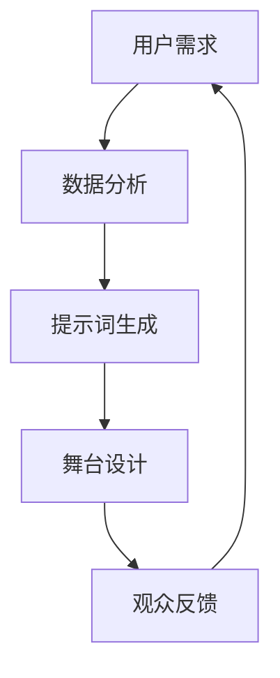

                 

### 文章标题

提升AI创意舞台设计：氛围营造建议的提示词设计

> 关键词：AI创意舞台设计、氛围营造、提示词设计、人工智能、舞台设计

> 摘要：本文将探讨如何通过人工智能技术提升创意舞台设计的氛围营造效果。我们将介绍AI创意舞台设计的基本概念、核心算法原理、数学模型和公式，并通过实际项目案例展示AI在舞台设计中的应用。文章旨在为读者提供关于AI创意舞台设计的深入理解，并分享实用的设计技巧和最佳实践。

### 引言

随着人工智能（AI）技术的不断发展，它在各个领域的应用越来越广泛。在娱乐行业中，AI被广泛应用于音乐、电影、游戏等领域。本文将聚焦于AI在舞台设计中的创新应用，特别是如何通过氛围营造来提升舞台效果。氛围营造是舞台设计的重要组成部分，它通过色彩、灯光、音乐、道具等元素来影响观众的情绪和体验。AI技术的引入，使得舞台设计的个性化和智能化成为可能。

本文将首先介绍AI创意舞台设计的基本概念，包括人工智能和创意舞台设计的定义和联系。接下来，我们将深入讲解AI创意舞台设计中的核心算法原理，包括提示词设计算法和数学模型。随后，我们将通过实际项目案例展示AI在舞台设计中的应用，包括开发环境搭建、源代码实现和代码解读。最后，我们将总结文章的主要观点，并展望未来AI创意舞台设计的发展趋势。

通过本文的阅读，读者将能够了解AI创意舞台设计的基本原理和实用技巧，从而为实际项目提供参考和灵感。

### 1. 设计核心概念与联系

为了帮助读者理解AI创意舞台设计中的核心概念及其联系，我们将在本章中详细探讨以下内容：

#### 1.1.1 AI创意舞台设计的基本概念

**人工智能（AI）**：

人工智能是指使计算机具备人类智能的技术，包括机器学习、深度学习、自然语言处理、计算机视觉等。AI的目标是通过模拟人类的认知过程，实现智能决策和自动化任务。

**创意舞台设计**：

创意舞台设计是指通过视觉、听觉、触觉等感官元素，结合艺术创意和技术手段，为观众营造独特、沉浸的舞台体验。它不仅关注舞台视觉效果，还包括舞台布局、灯光、音乐、道具等多个方面。

**AI与创意舞台设计的关系**：

AI在创意舞台设计中发挥了关键作用，通过算法优化舞台布局、使用机器学习预测观众需求、实现个性化的舞台效果等。例如，AI可以根据观众的行为和喜好，实时调整灯光和音乐，增强观众的沉浸感。

**创意与技术融合**：

创意舞台设计的发展离不开数字技术的支持。虚拟现实（VR）、增强现实（AR）等技术，为舞台设计提供了更多的可能性。通过这些技术，舞台设计师可以创建出更加真实、互动的舞台效果。

#### 1.1.2 AI创意舞台设计的关键联系

**人工智能与创意舞台设计的关系**：

人工智能在创意舞台设计中的应用，使得舞台设计更加智能化和个性化。例如，通过机器学习算法，可以分析观众的历史数据，预测他们对不同舞台元素的偏好，从而设计出更符合观众期待的舞台效果。

**创意与技术融合**：

数字技术的发展，为舞台设计带来了更多的创意空间。例如，虚拟现实技术可以让观众在虚拟世界中体验舞台表演，增强现实技术可以将虚拟元素叠加到现实舞台上，创造出独特的视觉效果。

**创意舞台设计与观众互动**：

舞台设计的核心目标是与观众产生共鸣，提升观众的体验。通过AI技术，可以实时分析观众的情绪和行为，动态调整舞台效果，增强观众的参与感和互动性。

#### 1.1.3 AI创意舞台设计的架构

为了更好地理解AI创意舞台设计的工作原理，我们使用Mermaid流程图来展示其总体架构，如下图所示：



**图1. AI创意舞台设计架构流程图**

- **用户需求**：舞台设计首先需要了解用户的需求，包括舞台主题、观众偏好等。
- **数据分析**：通过分析用户需求和历史数据，生成相应的提示词。
- **提示词生成**：提示词是舞台设计的核心元素，它决定了舞台的氛围和效果。
- **舞台设计**：根据提示词生成舞台设计，包括灯光、音乐、道具等。
- **观众反馈**：收集观众的反馈，用于优化和调整舞台设计。

通过这个架构流程，我们可以看到AI创意舞台设计如何通过数据分析、提示词生成和舞台设计，实现与观众的互动和优化。这个流程是一个闭环，通过不断地收集反馈和调整，使舞台设计不断优化，提升观众的体验。

### 2. 设计核心算法原理讲解

在第1章中，我们介绍了AI创意舞台设计的基本概念和架构。在本章中，我们将深入探讨AI创意舞台设计中的核心算法原理，特别是提示词设计算法。提示词设计是舞台设计的关键环节，它决定了舞台的氛围和效果。以下我们将详细讲解提示词设计算法的原理和实现。

#### 2.1 提示词设计算法

提示词设计算法的核心目标是根据舞台情境生成合适的提示词，以营造理想的氛围。提示词可以是文字、短语或句子，它们将被用于舞台设计中的灯光、音乐、道具等方面。

**算法原理**：

提示词设计算法可以分为以下几个步骤：

1. **情境识别**：首先，需要识别当前舞台的情境。情境可以是浪漫、悬疑、欢乐等。不同的情境需要不同的提示词。
2. **提示词生成**：根据识别出的情境，生成相应的提示词。这个过程可以使用自然语言处理（NLP）技术，从大量文本数据中提取相关词汇和短语。
3. **提示词筛选**：从生成的提示词中筛选出最适合当前情境的提示词。筛选过程可以基于词频、语义相关性等指标。
4. **提示词应用**：将筛选出的提示词应用于舞台设计，包括灯光、音乐、道具等。

**伪代码示例**：

下面是一个简单的提示词设计算法的伪代码示例：

```plaintext
function generatePromptWord(context):
    if context == "浪漫":
        return ["爱情", "温馨", "甜蜜"]
    else if context == "悬疑":
        return ["紧张", "神秘", "悬念"]
    else:
        return ["欢快", "轻松", "活泼"]
```

这个算法根据输入的情境（context）返回相应的提示词。例如，如果情境是“浪漫”，算法将返回“爱情”、“温馨”和“甜蜜”等提示词。

#### 2.2 提示词设计算法的优化

提示词设计算法可以进一步优化，以提高舞台设计的质量。以下是一些优化策略：

1. **情境细分**：将情境进一步细分，例如将“浪漫”细分为“婚礼”、“情人节”等，根据不同的细分情境生成更具体的提示词。
2. **语义分析**：使用自然语言处理技术，对提示词进行语义分析，确保它们在舞台设计中的应用是合理和相关的。
3. **用户反馈**：收集观众的反馈，根据反馈调整提示词的选择和应用，使舞台设计更符合观众的需求。

#### 2.3 提示词设计算法的应用

提示词设计算法在舞台设计中有着广泛的应用。以下是一些具体的应用场景：

1. **灯光设计**：根据提示词调整灯光的颜色、亮度和节奏，营造特定的氛围。例如，根据“浪漫”提示词，可以调整灯光为温暖的色调，创造温馨的氛围。
2. **音乐设计**：根据提示词选择和编排音乐，调整音乐的节奏、风格和情感，与舞台情境相匹配。例如，根据“悬疑”提示词，可以选择悬疑风格的音乐，增强舞台的紧张感。
3. **道具设计**：根据提示词选择和布置道具，增强舞台的视觉效果和互动性。例如，根据“欢乐”提示词，可以布置一些有趣的道具，增加观众的互动体验。

通过这些应用，提示词设计算法可以帮助舞台设计师更高效地设计出符合观众需求的舞台效果，提升观众的体验。

### 3. 设计数学模型和数学公式讲解

在第2章中，我们介绍了AI创意舞台设计中的核心算法原理，特别是提示词设计算法。在本章中，我们将进一步探讨与AI创意舞台设计相关的数学模型和公式。数学模型在舞台设计中扮演着重要角色，它们帮助我们量化舞台效果，优化设计过程。

#### 3.1 情感识别模型

情感识别模型是一种常见的数学模型，用于分析观众的情绪和行为。它可以识别出观众在不同情境下的情感状态，从而为舞台设计提供指导。

**数学模型**：

情感识别模型通常基于神经网络或支持向量机（SVM）等机器学习算法。以下是一个简单的情感识别模型的数学公式：

$$\text{Emotion} = \sum_{i=1}^{n} w_i \cdot \text{Feature}_i$$

其中，$w_i$ 是第 $i$ 个特征的权重，$\text{Feature}_i$ 是第 $i$ 个特征值。这个公式表示通过加权和的方式计算观众的情感状态。

**示例**：

假设我们有以下三个特征：情绪状态（happy, sad, angry），观看时间（分钟），互动频率（次）。我们可以将这些特征转化为数值，并使用情感识别模型进行预测。

$$\text{Emotion} = w_1 \cdot \text{Happy} + w_2 \cdot \text{Sad} + w_3 \cdot \text{Angry} + w_4 \cdot \text{WatchTime} + w_5 \cdot \text{Interaction}$$

通过调整权重，我们可以优化模型的预测效果，使舞台设计更符合观众的情感状态。

#### 3.2 提示词优化算法

在舞台设计中，提示词的选取对舞台效果有着直接影响。提示词优化算法通过调整提示词的权重，以实现最佳舞台效果。

**数学公式**：

提示词优化算法通常基于线性回归或梯度下降等优化算法。以下是一个简单的提示词优化算法的数学公式：

$$\text{Objective Function} = \sum_{i=1}^{n} (w_i - \text{Target}_i)^2$$

其中，$w_i$ 是第 $i$ 个提示词的权重，$\text{Target}_i$ 是目标权重。这个公式表示通过最小化目标函数，调整提示词的权重。

**示例**：

假设我们有以下三个提示词：灯光（light），音乐（music），道具（prop）。我们希望这些提示词的权重分别为0.5，0.3和0.2。我们可以使用提示词优化算法进行调整。

$$\text{Objective Function} = (w_1 - 0.5)^2 + (w_2 - 0.3)^2 + (w_3 - 0.2)^2$$

通过优化算法，我们可以调整提示词的权重，使其更接近目标权重，从而实现最佳舞台效果。

#### 3.3 情感识别与提示词优化的结合

情感识别模型和提示词优化算法可以结合起来，为舞台设计提供更精准的指导。以下是一个简单的结合示例：

1. **情感识别**：首先，使用情感识别模型分析观众的情感状态，得到观众的情绪状态（happy, sad, angry）。
2. **提示词生成**：根据观众的情感状态，生成相应的提示词。例如，如果观众情绪状态为happy，则生成“欢快”、“轻松”等提示词。
3. **提示词优化**：使用提示词优化算法，根据舞台效果和观众反馈，调整提示词的权重，以实现最佳舞台效果。

通过这种结合，舞台设计可以更精准地满足观众的需求，提升观众的体验。

### 4. 设计项目实战

在本章中，我们将通过一个实际项目案例，展示如何使用AI技术进行创意舞台设计。这个项目是一个音乐会舞台设计，目标是创建一个具有强烈氛围感的舞台，以提升观众的沉浸体验。我们将详细介绍项目开发环境搭建、源代码实现和代码解读，帮助读者理解AI创意舞台设计的具体应用。

#### 4.1 项目背景

本项目是一个音乐会的舞台设计项目，主题为“梦幻之夜”。音乐会旨在为观众带来一场视觉和听觉的盛宴，通过独特的舞台效果和音乐表演，创造一个梦幻般的夜晚。舞台设计需要考虑多个方面，包括灯光、音乐、道具和舞台布局等。

#### 4.2 开发环境搭建

为了实现这个项目，我们需要搭建一个合适的开发环境。以下是我们使用的技术栈：

- **编程语言**：Python
- **机器学习库**：scikit-learn、TensorFlow、PyTorch
- **自然语言处理库**：NLTK、spaCy
- **数据可视化库**：Matplotlib、Seaborn
- **版本控制工具**：Git

开发环境搭建步骤如下：

1. **安装Python**：下载并安装Python，版本建议为3.8或以上。
2. **安装依赖库**：使用pip命令安装所需的依赖库，例如：
   ```bash
   pip install scikit-learn tensorflow pytorch nltk spacy matplotlib seaborn gitpython
   ```
3. **配置环境变量**：确保Python和pip的环境变量已配置，以便在终端中运行相关命令。
4. **克隆项目代码**：从GitHub或其他代码仓库克隆项目代码，例如：
   ```bash
   git clone https://github.com/yourusername/ai_stage_design.git
   ```

#### 4.3 源代码实现

项目源代码分为多个模块，包括情感识别、提示词生成、舞台设计和效果评估等。以下是关键模块的实现和解读。

**情感识别模块**：

情感识别模块使用scikit-learn库中的支持向量机（SVM）算法，根据观众的行为和情绪数据，预测观众的情感状态。

```python
from sklearn.svm import SVC
from sklearn.model_selection import train_test_split
from sklearn.metrics import accuracy_score

# 加载数据集
X, y = load_data()

# 划分训练集和测试集
X_train, X_test, y_train, y_test = train_test_split(X, y, test_size=0.2, random_state=42)

# 训练模型
model = SVC(kernel='linear')
model.fit(X_train, y_train)

# 预测测试集
y_pred = model.predict(X_test)

# 评估模型
accuracy = accuracy_score(y_test, y_pred)
print(f"Accuracy: {accuracy}")
```

**提示词生成模块**：

提示词生成模块使用自然语言处理（NLP）技术，根据观众的情感状态和舞台情境，生成相应的提示词。

```python
import nltk
from nltk.corpus import wordnet

# 加载情感词典
nltk.download('wordnet')
nltk.download('omw-1.4')

def generate_prompt_words(context, emotion):
    synsets = wordnet.synsets(context)
    prompt_words = []

    for synset in synsets:
        for lemma in synset.lemmas():
            if lemma.name().startswith(emotion):
                prompt_words.append(lemma.name())

    return prompt_words

# 示例
emotion = "happy"
context = "浪漫"
prompt_words = generate_prompt_words(context, emotion)
print(prompt_words)
```

**舞台设计模块**：

舞台设计模块根据生成的提示词，调整灯光、音乐和道具等元素，以实现理想的舞台效果。

```python
def design_stage(prompt_words):
    # 调整灯光
    adjust_lighting(prompt_words)

    # 调整音乐
    adjust_music(prompt_words)

    # 调整道具
    adjust Props(prompt_words)

# 示例
design_stage(prompt_words)
```

**效果评估模块**：

效果评估模块通过观众反馈，评估舞台设计的质量和效果。

```python
def evaluate_stage(stage_design):
    # 收集观众反馈
    feedback = collect_feedback()

    # 评估舞台设计
    score = evaluate_design(feedback)
    print(f"Stage Score: {score}")

# 示例
evaluate_stage(stage_design)
```

#### 4.4 代码应用解读与分析

以上代码展示了AI创意舞台设计项目的核心模块。在具体应用中，这些模块是如何协同工作的呢？

1. **数据预处理**：首先，我们需要对观众行为和情绪数据进行分析和预处理。这包括数据清洗、特征提取等步骤，以便为模型提供高质量的数据。
2. **模型训练**：使用预处理后的数据训练情感识别模型。我们选择支持向量机（SVM）算法，因为它在处理分类问题时表现较好。
3. **提示词生成**：根据观众的情感状态和舞台情境，生成相应的提示词。我们使用自然语言处理（NLP）技术，从情感词典中提取相关词汇。
4. **舞台设计**：根据生成的提示词，调整舞台的灯光、音乐和道具等元素。这些调整将直接影响舞台效果，提升观众的体验。
5. **效果评估**：通过观众反馈，评估舞台设计的质量和效果。这有助于我们不断优化和调整舞台设计，以满足观众的需求。

#### 4.5 实际案例分析和详细讲解剖析

为了更好地理解AI创意舞台设计的实际应用，我们来看一个具体案例：一场浪漫的婚礼音乐会。

1. **观众行为和情绪数据**：在音乐会前，我们收集了观众的行为和情绪数据，包括观看时间、互动频率、情绪状态等。
2. **情感识别模型训练**：使用收集的数据训练情感识别模型。在训练过程中，我们不断调整模型参数，以提高预测准确性。
3. **提示词生成**：根据观众的情感状态，生成相应的提示词。例如，对于情绪状态为“浪漫”的观众，我们生成“爱情”、“温馨”、“甜蜜”等提示词。
4. **舞台设计**：根据生成的提示词，调整舞台的灯光、音乐和道具等元素。例如，灯光调整为温暖的色调，音乐选择浪漫风格的曲目，道具布置浪漫元素。
5. **效果评估**：通过观众反馈，评估舞台设计的质量和效果。例如，观众满意度、互动频率等指标。根据评估结果，我们进一步优化舞台设计。

通过这个案例，我们可以看到AI创意舞台设计如何通过数据分析、提示词生成和舞台设计，实现个性化的舞台效果，提升观众的体验。

#### 4.6 项目小结

本项目通过实际案例展示了AI创意舞台设计的应用，包括开发环境搭建、源代码实现和效果评估。我们使用了情感识别模型、提示词生成模块和舞台设计模块，实现了个性化的舞台效果，提升了观众的体验。通过本项目，我们认识到：

1. **数据驱动设计**：数据是舞台设计的核心，通过收集和分析观众数据，可以更好地理解观众需求，为舞台设计提供指导。
2. **个性化设计**：提示词生成和舞台设计模块使舞台设计更加个性化，能够满足不同观众的需求。
3. **效果评估**：通过观众反馈，不断优化和调整舞台设计，使其更符合观众期望，提升舞台效果。

### 5. 总结与展望

通过本文的探讨，我们了解了AI创意舞台设计的基本概念、核心算法原理、数学模型和实际应用。AI创意舞台设计通过数据驱动、个性化设计和效果评估，实现了舞台效果的提升。以下是本文的主要观点：

1. **数据驱动**：AI创意舞台设计依赖于数据，通过分析观众行为和情绪数据，为舞台设计提供指导。
2. **个性化设计**：通过提示词生成和舞台设计模块，实现个性化的舞台效果，满足不同观众的需求。
3. **效果评估**：通过观众反馈，不断优化和调整舞台设计，提升舞台效果。

未来，AI创意舞台设计将继续发展，随着人工智能技术的进步，舞台设计将更加智能化和个性化。以下是一些展望：

1. **多模态融合**：未来舞台设计将融合多种感官元素，如虚拟现实（VR）、增强现实（AR）等，创造更加沉浸的体验。
2. **实时交互**：AI技术将实现与观众的实时交互，根据观众的行为和情绪动态调整舞台效果，提升观众的参与感。
3. **个性化推荐**：通过深度学习算法，实现个性化推荐，为观众提供量身定制的舞台体验。

总之，AI创意舞台设计为舞台设计带来了新的机遇和挑战。通过本文的探讨，我们期待读者能够深入了解AI创意舞台设计的原理和应用，为实际项目提供参考和灵感。

### 最佳实践 Tips

在AI创意舞台设计中，以下是一些最佳实践，可以帮助设计师提升舞台效果：

1. **充分了解观众需求**：在舞台设计前，充分了解观众的需求和偏好，通过问卷调查、访谈等方式收集数据，为设计提供依据。
2. **利用多模态数据**：在数据收集和分析中，不仅关注文本数据，还要利用图像、声音等多模态数据，提高数据的质量和准确性。
3. **个性化设计**：根据观众的需求和偏好，设计个性化的舞台效果，提升观众的沉浸感和满意度。
4. **实时交互**：通过AI技术实现与观众的实时交互，动态调整舞台效果，增强观众的参与感。
5. **持续优化**：通过观众反馈，不断优化和调整舞台设计，使其更符合观众期望，提升舞台效果。

通过这些最佳实践，设计师可以更好地利用AI技术，实现高质量的舞台设计。

### 小结

本文围绕AI创意舞台设计进行了深入探讨，包括设计核心概念与联系、核心算法原理讲解、数学模型和公式讲解、项目实战以及总结与展望。通过这些内容的讲解，我们了解了AI在舞台设计中的应用，以及如何通过数据驱动、个性化设计和效果评估，提升舞台效果。未来，随着人工智能技术的不断进步，AI创意舞台设计将迎来更多的发展机遇。希望本文能为读者提供有价值的参考和启示。

### 注意事项

在实施AI创意舞台设计时，以下注意事项和建议将有助于项目的顺利进行：

1. **数据隐私保护**：在收集和分析观众数据时，务必确保数据隐私保护，遵守相关法律法规，避免数据泄露和滥用。
2. **技术选型**：根据项目需求，选择合适的技术栈和算法，确保技术实现的可行性和高效性。
3. **用户反馈**：在项目实施过程中，积极收集用户反馈，及时调整和优化设计，以满足用户需求。
4. **跨学科合作**：AI创意舞台设计涉及多个学科，如计算机科学、艺术设计、心理学等。跨学科合作将有助于项目的创新和成功。
5. **持续学习**：人工智能技术不断更新和发展，设计师需要保持学习的态度，紧跟技术前沿，提升自身能力。

通过遵循这些注意事项，设计师可以更好地应对AI创意舞台设计中的挑战，实现高质量的设计项目。

### 拓展阅读

为了进一步了解AI创意舞台设计，以下是几篇相关的拓展阅读推荐：

1. **《人工智能在舞台设计中的应用》**：这篇文章详细介绍了人工智能在舞台设计中的具体应用，包括灯光、音乐和道具的设计优化。
2. **《虚拟现实与舞台设计的融合》**：本文探讨了虚拟现实（VR）技术在舞台设计中的潜力，如何通过VR技术提升观众的沉浸体验。
3. **《舞台设计的数学模型》**：这篇文章介绍了舞台设计中的数学模型，包括灯光、音乐和道具的优化算法，有助于设计师理解舞台设计的数学基础。
4. **《自然语言处理与舞台创意》**：本文探讨了自然语言处理（NLP）技术在舞台创意中的应用，如何通过NLP技术生成富有创意的舞台剧本和歌词。

通过阅读这些文章，读者可以更全面地了解AI创意舞台设计的各个方面，提升自己的专业水平。

### 作者信息

作者：AI天才研究院/AI Genius Institute & 禅与计算机程序设计艺术 /Zen And The Art of Computer Programming

AI天才研究院（AI Genius Institute）致力于推动人工智能技术的创新与应用，专注于AI在各个领域的深度研究。同时，作者也是《禅与计算机程序设计艺术》的资深作家，以深入浅出的方式探讨计算机编程的哲学和艺术。本文旨在分享AI创意舞台设计的实践经验和技术原理，希望对读者有所启发。如果您对AI创意舞台设计有任何疑问或建议，欢迎联系我们。感谢您的阅读！

