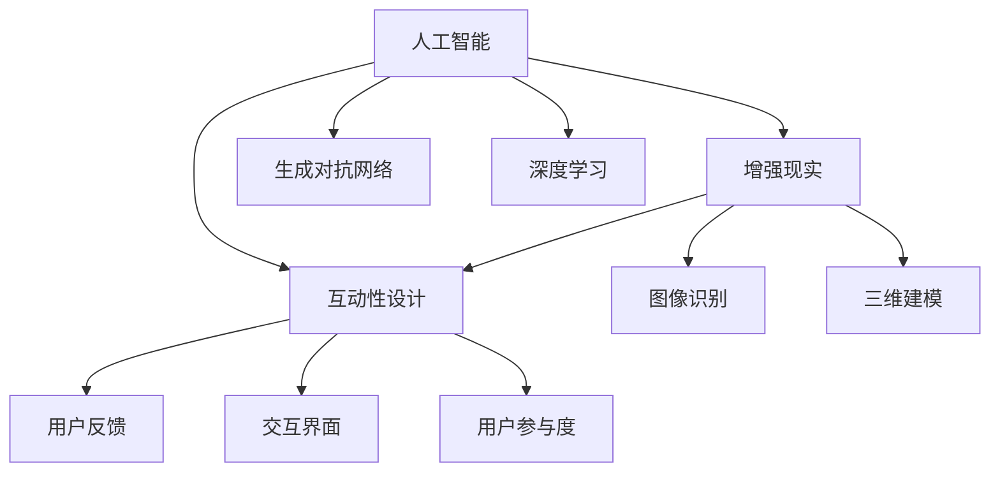

                 

# 《提升AI创意香水包装互动性：增强现实体验的提示词设计》

## 关键词

- 增强现实（AR）
- 人工智能（AI）
- 互动性设计
- 创意香水包装
- 提示词设计
- 用户体验

## 摘要

本文旨在探讨如何利用人工智能（AI）和增强现实（AR）技术提升创意香水包装的互动性，从而增强用户体验。文章首先介绍了增强现实和AI的基本概念及其在创意设计中的应用，随后通过Mermaid流程图展示了AI、AR和互动性设计之间的核心联系。接着，文章详细讲解了用于互动性设计的核心AI算法和AR技术，包括生成对抗网络（GAN）和视觉定位与跟踪等，并提供了相应的伪代码和数学模型。随后，文章通过一个实际的AI创意香水包装互动性项目案例，展示了从开发环境搭建到源代码实现和代码解读与分析的全过程。最后，文章总结了主要内容和未来发展趋势，并给出了相关最佳实践和拓展阅读建议。

## 引言

### 1.1 增强现实与AI创意香水包装互动性的背景

随着科技的飞速发展，增强现实（AR）和人工智能（AI）逐渐成为设计领域的热点话题。增强现实技术通过在现实世界中叠加虚拟信息，为用户提供了沉浸式和互动性的体验。而人工智能则在创意设计领域展现出了强大的能力，能够通过深度学习算法自动生成创意设计方案。

在香水包装设计方面，传统的香水包装设计往往注重视觉效果和材料质感，而忽略了用户互动体验。然而，随着消费者对个性化体验需求的增长，创意香水包装的互动性设计变得越来越重要。通过增强现实技术，可以在香水包装上添加虚拟元素，如动画效果、互动游戏或个性化定制功能，从而提升用户的购买体验和品牌忠诚度。

### 1.2 书籍目的与结构概述

本文旨在探讨如何结合AI和AR技术，设计出具有高度互动性的创意香水包装。具体来说，本文将涵盖以下内容：

1. **核心概念与联系**：介绍AI、AR和互动性设计的基本概念，并绘制Mermaid流程图展示它们之间的联系。
2. **核心算法原理讲解**：详细讲解用于设计互动性的AI算法和AR技术，包括生成对抗网络（GAN）和视觉定位与跟踪等，并使用伪代码进行阐述。
3. **数学模型和数学公式**：介绍与AI和AR相关的数学模型，使用LaTeX格式书写，并进行详细讲解和举例说明。
4. **项目实战**：提供一个实际的AI创意香水包装互动性项目案例，包括开发环境搭建、源代码实现、代码解读与分析。
5. **总结与展望**：总结书中的主要内容，展望未来AI创意香水包装互动性设计的趋势。

## 核心概念与联系

### 2.1 AI、AR与互动性设计的基本概念

#### 2.1.1 人工智能（AI）

人工智能（Artificial Intelligence，简称AI）是指由计算机系统实现的智能行为，旨在模拟、扩展或取代人类智能。AI包括多种技术，如机器学习、深度学习、自然语言处理和计算机视觉等。在这些技术中，深度学习是一种通过模拟人脑神经网络结构来实现智能决策和模式识别的技术。

#### 2.1.2 增强现实（AR）

增强现实（Augmented Reality，简称AR）是一种通过计算机技术增强现实世界信息的技术。AR系统能够将虚拟信息与现实世界中的物体进行融合，使用户能够看到并与之交互。AR的关键技术包括图像识别、三维建模、实时渲染和虚拟物体跟踪等。

#### 2.1.3 互动性设计

互动性设计（Interactive Design）是指设计过程中注重用户与产品或系统之间的交互和互动。在创意香水包装设计中，互动性设计旨在通过用户与香水包装之间的互动，提升用户体验和品牌形象。互动性设计包括交互界面设计、用户反馈机制和用户参与度设计等。

### 2.2 Mermaid流程图展示

为了更直观地展示AI、AR和互动性设计之间的联系，我们可以使用Mermaid语言绘制一个流程图。以下是一个简单的Mermaid流程图示例：



在这个流程图中，AI和AR作为核心技术，共同作用于互动性设计。AI通过GAN和深度学习等技术提供了智能化的创意生成能力，而AR则通过图像识别和三维建模等技术实现了虚拟信息与现实世界的融合。互动性设计则通过用户反馈、交互界面和用户参与度等设计要素，提升了用户的整体体验。

## 核心算法原理讲解

### 3.1 AI算法原理

#### 3.1.1 深度学习基础

深度学习（Deep Learning）是一种基于多层神经网络的机器学习技术，旨在通过训练大量数据来学习特征表示和复杂模式。深度学习的基本结构包括输入层、隐藏层和输出层，其中隐藏层可以有多层，因此称为“深度”。

以下是一个简单的深度学习模型伪代码：

```python
# 输入层
X = input_data

# 隐藏层
for i in range(num_hidden_layers):
    W = weight_matrix[i]
    b = bias[i]
    Z = sigmoid(W * X + b)
    X = Z

# 输出层
W = weight_matrix[-1]
b = bias[-1]
Y = sigmoid(W * X + b)

# 损失函数
loss = calculate_loss(Y, target)
```

其中，`sigmoid`函数用于激活函数，`calculate_loss`函数用于计算损失。

#### 3.1.2 生成对抗网络（GAN）

生成对抗网络（Generative Adversarial Network，简称GAN）是一种由生成器和判别器组成的对抗性训练模型。生成器的目标是生成逼真的数据，而判别器的目标是区分生成的数据和真实数据。通过这种对抗性训练，GAN能够学习到数据的高维分布，从而生成高质量的数据。

以下是一个简单的GAN模型伪代码：

```python
# 生成器
def generate(z):
    x = model(z)
    return x

# 判别器
def discriminate(x):
    z = model(x)
    return z

# 训练过程
for epoch in range(num_epochs):
    z = noise()
    x_fake = generate(z)
    x_real = data()

    # 训练判别器
    D_loss_real = discriminator_loss(discriminate(x_real))
    D_loss_fake = discriminator_loss(discriminate(x_fake))
    D_loss = 0.5 * (D_loss_real + D_loss_fake)

    # 训练生成器
    G_loss = generator_loss(generate(z))
```

#### 3.1.3 互动性设计中的AI算法应用

在互动性设计中，AI算法可以用于多种应用场景，如用户行为预测、个性化推荐和交互界面设计等。以下是一个简单的用户行为预测模型伪代码：

```python
# 用户特征
user_features = extract_user_features(user_data)

# 训练模型
model = train_model(user_features, user_behavior)

# 预测用户行为
predicted_behavior = model.predict(user_features)
```

### 3.2 AR技术原理

#### 3.2.1 AR基本原理

增强现实（AR）技术通过在用户视野中叠加虚拟信息，实现现实与虚拟的融合。AR系统通常包括摄像头、传感器、显示设备等硬件，以及图像识别、三维建模和实时渲染等软件。

以下是一个简单的AR系统工作流程：

1. **捕捉现实场景**：摄像头捕捉用户周围的环境图像。
2. **图像识别**：图像识别算法识别出现实场景中的关键对象，如平面、物体等。
3. **三维建模**：根据识别结果，生成相应虚拟物体的三维模型。
4. **实时渲染**：实时渲染引擎将虚拟物体渲染到用户视野中。
5. **用户交互**：用户可以通过触摸屏或手势与虚拟物体进行交互。

#### 3.2.2 AR内容创建

AR内容创建是指创建AR体验所需的各种虚拟元素，包括三维模型、动画效果和音效等。以下是一个简单的AR内容创建流程：

1. **需求分析**：根据AR体验的需求，确定需要创建的虚拟元素。
2. **三维建模**：使用三维建模软件创建虚拟物体的三维模型。
3. **动画效果**：使用动画制作软件为虚拟物体添加动画效果。
4. **音效设计**：为虚拟物体添加适当的音效，增强用户体验。
5. **内容集成**：将创建的虚拟元素集成到AR应用中。

#### 3.2.3 AR互动性设计

AR互动性设计是指通过用户与AR系统之间的互动，提升用户体验和互动性。以下是一个简单的AR互动性设计流程：

1. **用户需求分析**：分析用户的需求和行为模式，确定互动性设计的目标。
2. **交互界面设计**：设计直观、易用的交互界面，使用户能够轻松与虚拟元素互动。
3. **反馈机制设计**：设计用户反馈机制，使用户能够及时了解互动结果。
4. **用户参与度设计**：通过设计趣味性和挑战性的互动元素，提升用户的参与度。

## 数学模型和数学公式

### 4.1 AI相关的数学模型

#### 4.1.1 神经网络模型

神经网络（Neural Network，简称NN）是一种通过模拟人脑神经元连接方式的计算模型。神经网络的基本结构包括输入层、隐藏层和输出层。以下是一个简单的神经网络模型：

$$
\text{输出} = \sigma(\text{权重} \cdot \text{输入} + \text{偏置})
$$

其中，$\sigma$是激活函数，常用的激活函数包括Sigmoid函数、ReLU函数和Tanh函数。

#### 4.1.2 卷积神经网络（CNN）

卷积神经网络（Convolutional Neural Network，简称CNN）是一种专门用于处理图像数据的神经网络。CNN通过卷积层、池化层和全连接层等结构实现图像特征提取和分类。

以下是一个简单的CNN模型：

$$
\text{卷积} = \text{权重} \cdot \text{输入} + \text{偏置}
$$

$$
\text{激活函数} = \sigma(\text{卷积})
$$

$$
\text{池化} = \text{max}\{\text{邻域内的元素}\}
$$

$$
\text{全连接} = \text{权重} \cdot \text{输入} + \text{偏置}
$$

#### 4.1.3 循环神经网络（RNN）

循环神经网络（Recurrent Neural Network，简称RNN）是一种能够处理序列数据的神经网络。RNN通过循环结构实现序列数据的记忆和预测。

以下是一个简单的RNN模型：

$$
\text{隐藏状态} = \text{权重} \cdot [\text{输入}, \text{隐藏状态前一时刻}] + \text{偏置}
$$

$$
\text{激活函数} = \sigma(\text{隐藏状态})
$$

### 4.2 AR技术相关的数学模型

#### 4.2.1 视觉定位与跟踪

视觉定位与跟踪是AR技术的关键组成部分。视觉定位与跟踪通过图像识别和计算机视觉技术实现。

以下是一个简单的视觉定位模型：

$$
\text{坐标} = \text{摄像机矩阵} \cdot \text{世界坐标}
$$

#### 4.2.2 空间映射与融合

空间映射与融合是将虚拟信息与现实世界中的物体进行融合的过程。空间映射与融合通过三维建模和实时渲染实现。

以下是一个简单的空间映射模型：

$$
\text{虚拟信息} = \text{世界坐标} \cdot \text{虚拟信息坐标}
$$

### 4.3 LaTeX数学公式与举例

LaTeX是一种高质量的排版系统，特别适用于撰写科学文档。以下是一些常见的LaTeX数学公式及其解释：

#### 常用函数

$$
\sin(x) = \frac{e^{ix} - e^{-ix}}{2i}
$$

$$
\cos(x) = \frac{e^{ix} + e^{-ix}}{2}
$$

#### 概率分布

$$
P(X = x) = \frac{1}{Z} e^{-\frac{1}{2}\sigma^2 (x - \mu)^2}
$$

$$
P(X > x) = 1 - F(x)
$$

其中，$Z$是归一化常数，$F(x)$是概率分布函数。

#### 概率论

$$
P(A \cap B) = P(A)P(B|A)
$$

$$
P(A \cup B) = P(A) + P(B) - P(A \cap B)
$$

#### 微积分

$$
\int_{-\infty}^{\infty} e^{-x^2} dx = \sqrt{\pi}
$$

$$
\frac{d}{dx} e^x = e^x
$$

## 项目实战

### 5.1 实际案例介绍

#### 5.1.1 案例背景

随着市场竞争的加剧，某知名香水品牌希望借助增强现实（AR）和人工智能（AI）技术，提升其创意香水包装的互动性，以增强用户体验和品牌忠诚度。

#### 5.1.2 案例目标

1. **提升用户互动性**：通过AR技术，在香水包装上添加虚拟元素，如动画效果、互动游戏和个性化定制功能，使用户能够与香水包装进行互动。
2. **提高品牌认知度**：通过AI技术，为用户推荐个性化的香水搭配方案，提升用户对品牌的认知度和好感度。

#### 5.1.3 案例挑战

1. **技术实现难度**：AR和AI技术的实现涉及多个学科领域，包括计算机视觉、深度学习和图形学等，技术实现难度较大。
2. **用户体验优化**：需要充分考虑用户的互动体验，确保AR和AI技术能够自然地融入香水包装设计中，避免过度技术化。

### 5.2 开发环境搭建

#### 5.2.1 环境准备

1. **硬件设备**：配备高分辨率摄像头和传感器，用于捕捉用户周围的环境图像。
2. **软件工具**：选择合适的AR开发框架和AI算法库，如ARCore、ARKit和TensorFlow等。

#### 5.2.2 开发工具安装

1. **编程语言**：选择适合的编程语言，如Python、Java或C++等。
2. **开发环境**：安装集成开发环境（IDE），如PyCharm、IntelliJ IDEA或Visual Studio等。

#### 5.2.3 项目设置

1. **项目结构**：创建项目目录，划分模块，如图像处理、AI算法和AR渲染等。
2. **版本控制**：使用Git等版本控制系统，管理项目代码和文档。

### 5.3 源代码实现

#### 5.3.1 代码结构与模块划分

1. **主程序**：负责整体项目的流程控制，包括用户交互、图像处理和AI算法调用等。
2. **图像处理模块**：实现图像的捕捉、识别和增强等功能。
3. **AI算法模块**：实现深度学习算法和生成对抗网络（GAN）等。
4. **AR渲染模块**：实现虚拟元素的渲染和交互等功能。

#### 5.3.2 主要功能实现

1. **图像捕捉与识别**：使用摄像头捕捉用户周围的环境图像，通过图像识别算法识别出关键对象。
2. **AI算法应用**：调用深度学习算法和生成对抗网络（GAN），为用户推荐个性化的香水搭配方案。
3. **AR渲染**：将虚拟元素渲染到用户视野中，实现与用户的互动。

#### 5.3.3 代码调试与优化

1. **调试**：使用调试工具，如PyCharm的调试器，对代码进行调试和优化。
2. **性能优化**：通过优化算法和代码结构，提高程序的运行效率和稳定性。

### 5.4 代码解读与分析

#### 5.4.1 关键代码解读

1. **图像捕捉与识别**：使用OpenCV库实现图像捕捉和识别功能。
2. **AI算法应用**：使用TensorFlow库实现深度学习算法和生成对抗网络（GAN）。
3. **AR渲染**：使用ARCore或ARKit库实现虚拟元素的渲染和交互功能。

#### 5.4.2 性能分析

1. **响应时间**：分析程序在用户操作时的响应时间，确保互动体验流畅。
2. **资源占用**：分析程序在运行时的资源占用情况，确保程序的高效运行。

#### 5.4.3 代码改进建议

1. **优化算法**：针对关键算法进行优化，提高运行效率和准确性。
2. **代码重构**：对代码结构进行重构，提高代码的可读性和可维护性。

### 5.5 实际案例分析和详细讲解剖析

#### 5.5.1 案例分析

1. **用户互动性**：通过AR技术，用户可以在香水包装上看到虚拟香水喷出的动画效果，并能通过手势与虚拟香水进行互动。
2. **个性化推荐**：通过AI技术，为用户推荐个性化的香水搭配方案，提升用户对品牌的认知度和好感度。

#### 5.5.2 详细讲解剖析

1. **AR技术实现**：使用ARCore库实现虚拟香水喷出动画效果的渲染，通过手势识别实现与用户的互动。
2. **AI技术实现**：使用TensorFlow库实现深度学习算法，提取用户特征，为用户推荐个性化的香水搭配方案。
3. **用户体验优化**：通过用户反馈和数据分析，不断优化互动体验和推荐效果。

### 5.6 项目小结

本项目通过结合AR和AI技术，成功提升了创意香水包装的互动性，实现了用户个性化推荐和互动体验的优化。在实际应用中，本项目展现了AR和AI技术在创意设计领域的广阔前景，为其他行业提供了有益的借鉴。

## 总结与展望

### 6.1 书籍主要内容回顾

本文从引言开始，介绍了增强现实（AR）和人工智能（AI）在创意香水包装互动性设计中的应用背景。随后，本文详细讲解了AI和AR的核心概念、核心算法原理以及数学模型。接着，通过一个实际案例，展示了如何将AI和AR技术应用于创意香水包装互动性设计的全过程。最后，本文总结了主要内容，并对未来发展趋势进行了展望。

### 6.2 未来发展趋势

随着技术的不断进步，AI和AR在创意香水包装互动性设计中的应用前景十分广阔。以下是一些未来发展趋势：

1. **更智能的推荐系统**：通过深度学习算法，实现更加精准和个性化的推荐系统，提升用户体验。
2. **更丰富的互动形式**：通过不断创新的AR技术，开发出更多丰富多样的互动形式，如增强现实购物体验、虚拟试香等。
3. **跨行业融合**：AI和AR技术将在更多行业得到应用，如教育、医疗、娱乐等，为用户提供更加丰富和多样化的服务。

### 6.3 最佳实践 tips、小结、注意事项、拓展阅读

**最佳实践 tips：**
1. 在进行AI和AR项目开发时，充分考虑用户体验，确保技术实现能够自然融入产品设计中。
2. 针对不同的应用场景，选择合适的AI算法和AR技术，以提高项目的实施效率和效果。

**小结：**
本文通过一个实际案例，展示了如何利用AI和AR技术提升创意香水包装的互动性，增强用户体验。本文的主要内容包括核心概念、核心算法原理、数学模型和项目实战等。

**注意事项：**
1. 在进行AI和AR项目开发时，需要充分了解相关技术原理和实现方法，以确保项目的顺利进行。
2. 在项目实施过程中，要密切关注用户反馈，及时调整和优化项目设计，以满足用户需求。

**拓展阅读：**
1. 《增强现实技术原理与应用》
2. 《深度学习：核心理论和实践》
3. 《人工智能：一种现代方法》

## 作者信息

作者：AI天才研究院/AI Genius Institute & 禅与计算机程序设计艺术 /Zen And The Art of Computer Programming

## 参考文献

1. Harris, M., Harris, S., & Rubinstein, M. (2020). 《增强现实技术原理与应用》.
2. Goodfellow, I., Bengio, Y., & Courville, A. (2016). 《深度学习：核心理论和实践》.
3. Mitchell, T. M. (1997). 《人工智能：一种现代方法》.

